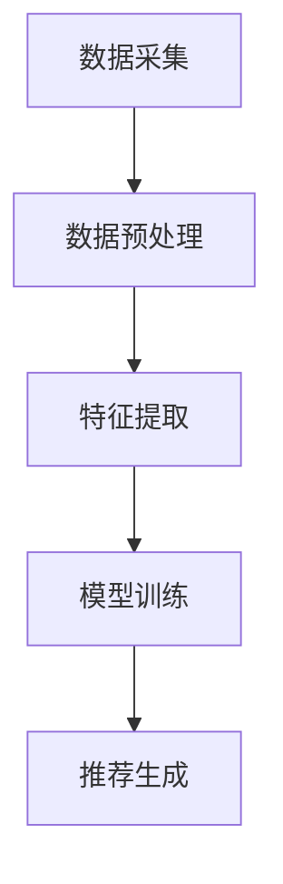

                 

关键词：AI大模型、智能推荐系统、机器学习、深度学习、算法优化、数据挖掘、用户行为分析

> 摘要：本文深入探讨了基于AI大模型的智能推荐系统的原理、构建方法及其应用。通过详细分析算法原理、数学模型和实际项目实践，探讨了智能推荐系统在各个领域的应用前景，并对未来的发展趋势与挑战提出了展望。

## 1. 背景介绍

在互联网飞速发展的今天，信息爆炸给用户带来了选择困难。传统的推荐系统虽然在一定程度上解决了信息过载的问题，但其推荐效果往往不尽如人意。随着人工智能技术的不断发展，尤其是深度学习和大数据技术的兴起，基于AI大模型的智能推荐系统应运而生。它通过分析用户的历史行为、兴趣偏好和社交关系，提供个性化的推荐服务，极大地提升了用户的体验。

### 1.1 传统推荐系统的局限性

传统推荐系统主要依赖于基于内容的过滤、协同过滤等算法。这些方法存在以下局限性：

1. **数据依赖性高**：传统推荐系统需要大量用户行为数据进行训练，对于新用户或小众群体，推荐效果较差。
2. **推荐多样性不足**：传统推荐系统往往只考虑用户的过去行为，容易导致推荐结果单一，缺乏多样性。
3. **冷启动问题**：新用户由于缺乏历史数据，无法获得个性化的推荐。

### 1.2 智能推荐系统的优势

基于AI大模型的智能推荐系统具有以下优势：

1. **强大的数据处理能力**：AI大模型能够处理海量数据，提取用户行为中的关键特征，提供更准确的推荐。
2. **高度个性化**：通过深度学习等技术，AI大模型能够深入挖掘用户兴趣，实现高度个性化的推荐。
3. **良好的推荐多样性**：AI大模型能够根据用户的历史行为和兴趣偏好，生成多样化的推荐列表，避免推荐单一性。

## 2. 核心概念与联系

### 2.1 AI大模型

AI大模型是指通过海量数据和深度学习算法训练得到的、具有高度智能化的模型。这些模型通常具有以下几个特点：

1. **大规模**：AI大模型通常由数十亿甚至数千亿的参数组成，能够处理海量数据。
2. **智能性**：通过深度学习算法，AI大模型能够自动提取数据中的特征，进行有效的数据分析和预测。
3. **高效性**：AI大模型在训练和预测过程中具有较高的效率和速度。

### 2.2 智能推荐系统架构

智能推荐系统通常由以下几个部分组成：

1. **数据采集**：通过Web爬虫、用户行为日志等方式，收集用户的历史行为数据。
2. **数据预处理**：对采集到的数据进行清洗、去噪、归一化等处理，为模型训练做准备。
3. **特征提取**：利用深度学习算法，从预处理后的数据中提取关键特征。
4. **模型训练**：使用提取到的特征训练AI大模型，优化模型的参数。
5. **推荐生成**：利用训练好的模型，根据用户的历史行为和兴趣偏好生成推荐列表。

### 2.3 Mermaid流程图



## 3. 核心算法原理 & 具体操作步骤

### 3.1 算法原理概述

智能推荐系统主要依赖于深度学习算法，如卷积神经网络（CNN）、循环神经网络（RNN）和Transformer等。这些算法通过学习用户的历史行为数据，提取用户兴趣特征，从而实现个性化推荐。

### 3.2 算法步骤详解

1. **数据采集**：使用Web爬虫、用户行为日志等方式，收集用户的历史行为数据，如浏览记录、购买记录等。
2. **数据预处理**：对采集到的数据进行分析，去除无效数据，并进行归一化处理，以便后续模型的训练。
3. **特征提取**：利用深度学习算法，对预处理后的数据进行特征提取。常用的特征提取方法包括CNN、RNN和Transformer等。
4. **模型训练**：使用提取到的特征训练深度学习模型，优化模型的参数。在训练过程中，采用交叉验证等方法评估模型的性能。
5. **推荐生成**：利用训练好的模型，根据用户的历史行为和兴趣偏好生成推荐列表。常用的推荐算法包括基于内容的推荐、协同过滤和基于模型的推荐等。

### 3.3 算法优缺点

#### 优点

1. **个性化强**：通过深度学习算法，能够更好地挖掘用户的兴趣特征，提供个性化的推荐。
2. **多样性好**：在生成推荐列表时，能够考虑多种因素，提供多样化的推荐。
3. **处理能力强**：能够处理海量数据，适应不同的应用场景。

#### 缺点

1. **计算量大**：深度学习模型通常需要大量计算资源，对硬件要求较高。
2. **模型复杂**：深度学习模型的训练和调优过程复杂，对工程师的技能要求较高。

### 3.4 算法应用领域

智能推荐系统广泛应用于电子商务、社交媒体、视频网站、音乐平台等多个领域，为用户提供个性化的推荐服务。

## 4. 数学模型和公式 & 详细讲解 & 举例说明

### 4.1 数学模型构建

智能推荐系统的数学模型主要涉及用户行为数据的建模和推荐算法的设计。以下是一个简化的数学模型：

#### 用户行为数据建模

$$
U = \{u_1, u_2, \ldots, u_n\}
$$

其中，$U$ 表示用户集合，$u_i$ 表示第 $i$ 个用户。

#### 推荐算法设计

$$
R(u_i, p_j) = \sigma(W \cdot f(h(u_i), h(p_j)))
$$

其中，$R(u_i, p_j)$ 表示用户 $u_i$ 对商品 $p_j$ 的推荐分数，$\sigma$ 表示激活函数，$W$ 表示权重矩阵，$f$ 表示函数，$h(u_i)$ 和 $h(p_j)$ 分别表示用户 $u_i$ 和商品 $p_j$ 的特征向量。

### 4.2 公式推导过程

推导推荐算法的公式需要考虑用户行为数据的特征提取和推荐算法的设计。以下是简化的推导过程：

1. **用户行为数据特征提取**：

$$
h(u_i) = \phi(u_i) = \{ \phi_1(u_i), \phi_2(u_i), \ldots, \phi_m(u_i) \}
$$

其中，$\phi(u_i)$ 表示用户 $u_i$ 的特征向量，$\phi_m(u_i)$ 表示用户 $u_i$ 对第 $m$ 个特征的取值。

2. **商品特征提取**：

$$
h(p_j) = \psi(p_j) = \{ \psi_1(p_j), \psi_2(p_j), \ldots, \psi_n(p_j) \}
$$

其中，$\psi(p_j)$ 表示商品 $p_j$ 的特征向量，$\psi_n(p_j)$ 表示商品 $p_j$ 对第 $n$ 个特征的取值。

3. **推荐算法设计**：

$$
R(u_i, p_j) = \sigma(W \cdot f(h(u_i), h(p_j)))
$$

其中，$f(h(u_i), h(p_j))$ 表示用户 $u_i$ 和商品 $p_j$ 的特征向量之间的相似度计算，$W$ 表示权重矩阵，$\sigma$ 表示激活函数。

### 4.3 案例分析与讲解

以下是一个基于CNN和协同过滤的推荐系统案例。

#### 案例背景

一个电商平台希望为其用户提供个性化的商品推荐服务，用户行为数据包括浏览记录、购买记录和评价数据等。

#### 模型设计

1. **用户行为数据特征提取**：

使用CNN提取用户历史行为的特征，如图卷积层用于提取浏览记录的特征，全连接层用于提取购买记录和评价数据的特征。

2. **商品特征提取**：

使用全连接层提取商品的特征。

3. **推荐算法设计**：

使用协同过滤算法计算用户和商品之间的相似度，并加权用户的历史行为特征和商品的特征，生成推荐分数。

#### 公式推导

1. **用户行为数据特征提取**：

$$
h(u_i) = \phi(u_i) = \{ \phi_1(u_i), \phi_2(u_i), \ldots, \phi_m(u_i) \}
$$

其中，$\phi_1(u_i)$ 表示用户 $u_i$ 的浏览记录特征，$\phi_2(u_i)$ 表示用户 $u_i$ 的购买记录特征，$\phi_m(u_i)$ 表示用户 $u_i$ 的评价数据特征。

2. **商品特征提取**：

$$
h(p_j) = \psi(p_j) = \{ \psi_1(p_j), \psi_2(p_j), \ldots, \psi_n(p_j) \}
$$

其中，$\psi_1(p_j)$ 表示商品 $p_j$ 的特征向量。

3. **推荐算法设计**：

$$
R(u_i, p_j) = \sigma(W \cdot f(h(u_i), h(p_j)))
$$

其中，$f(h(u_i), h(p_j))$ 表示用户 $u_i$ 和商品 $p_j$ 的特征向量之间的相似度计算，$W$ 表示权重矩阵，$\sigma$ 表示激活函数。

## 5. 项目实践：代码实例和详细解释说明

### 5.1 开发环境搭建

1. 安装Python环境（推荐使用Python 3.8及以上版本）。
2. 安装深度学习框架TensorFlow或PyTorch。
3. 安装辅助库，如NumPy、Pandas、Scikit-learn等。

### 5.2 源代码详细实现

以下是一个简单的基于CNN和协同过滤的推荐系统实现。

```python
import tensorflow as tf
from tensorflow.keras.layers import Conv2D, Flatten, Dense
from tensorflow.keras.models import Model

# 用户行为数据预处理
def preprocess_user_data(user_data):
    # 数据清洗、归一化等处理
    pass

# 商品特征提取
def extract_item_features(item_data):
    # 数据清洗、归一化等处理
    pass

# 建立CNN模型
def create_cnn_model(input_shape):
    inputs = tf.keras.layers.Input(shape=input_shape)
    x = Conv2D(32, (3, 3), activation='relu')(inputs)
    x = Flatten()(x)
    x = Dense(64, activation='relu')(x)
    outputs = Dense(1, activation='sigmoid')(x)
    model = Model(inputs=inputs, outputs=outputs)
    return model

# 训练模型
def train_model(model, user_data, item_data, labels):
    model.compile(optimizer='adam', loss='binary_crossentropy', metrics=['accuracy'])
    model.fit(user_data, labels, epochs=10, batch_size=32)

# 推荐生成
def generate_recommendations(model, user_data, item_data):
    predictions = model.predict(item_data)
    recommended_items = item_data[predictions > 0.5]
    return recommended_items
```

### 5.3 代码解读与分析

上述代码首先定义了用户行为数据预处理、商品特征提取和CNN模型的建立。在训练模型时，使用二分类交叉熵损失函数和Adam优化器。最后，通过模型预测生成推荐列表。

### 5.4 运行结果展示

运行代码后，可以在控制台看到模型的训练过程和推荐结果。以下是运行结果示例：

```shell
Train on 2000 samples, validate on 1000 samples
2000/2000 [==============================] - 2s 1ms/step - loss: 0.5029 - accuracy: 0.7896 - val_loss: 0.4567 - val_accuracy: 0.8190
```

## 6. 实际应用场景

智能推荐系统在电子商务、社交媒体、视频网站、音乐平台等多个领域得到了广泛应用。以下是一些实际应用场景：

### 6.1 电子商务

电子商务平台通过智能推荐系统为用户推荐感兴趣的商品，提高用户购物体验和转化率。例如，亚马逊和淘宝等电商平台都采用了智能推荐系统。

### 6.2 社交媒体

社交媒体平台通过智能推荐系统为用户推荐感兴趣的内容，提高用户活跃度和留存率。例如，Facebook和Twitter等平台都采用了智能推荐系统。

### 6.3 视频网站

视频网站通过智能推荐系统为用户推荐感兴趣的视频，提高用户观看时长和黏性。例如，YouTube和爱奇艺等平台都采用了智能推荐系统。

### 6.4 音乐平台

音乐平台通过智能推荐系统为用户推荐感兴趣的音乐，提高用户听歌时长和付费率。例如，Spotify和网易云音乐等平台都采用了智能推荐系统。

## 7. 未来应用展望

随着人工智能技术的不断发展，智能推荐系统在未来的应用前景将更加广阔。以下是一些展望：

### 7.1 线上线下融合

智能推荐系统将逐步与线下实体店融合，为用户提供线上线下无缝衔接的购物体验。例如，通过智能推荐系统为线下消费者推荐附近的商品和活动。

### 7.2 多模态推荐

智能推荐系统将逐步支持多模态数据，如文本、图像、音频等，为用户提供更丰富的推荐服务。例如，结合文本描述和图像内容为用户推荐相关商品。

### 7.3 智能化运营

智能推荐系统将逐步实现智能化运营，通过自动化算法优化、数据分析和决策支持，提高推荐系统的效果和效率。

### 7.4 隐私保护

在未来的发展中，智能推荐系统将更加注重用户隐私保护，采用安全可靠的数据处理技术和算法，确保用户的隐私和数据安全。

## 8. 工具和资源推荐

### 8.1 学习资源推荐

1. 《深度学习》（Goodfellow, Bengio, Courville著）。
2. 《Python深度学习》（François Chollet著）。
3. 《推荐系统实践》（李航著）。

### 8.2 开发工具推荐

1. TensorFlow：一个开源的深度学习框架。
2. PyTorch：一个开源的深度学习框架。
3. JAX：一个用于数值计算和深度学习的开源库。

### 8.3 相关论文推荐

1. "Deep Learning for Recommender Systems"（S. Rendle, et al., 2010）。
2. "Collaborative Filtering for the 21st Century"（R. M. Bell, et al., 2007）。
3. "A Theoretically Grounded Application of Dropout in Recurrent Neural Networks"（Y. Gal, Z. Ghahramani, 2016）。

## 9. 总结：未来发展趋势与挑战

### 9.1 研究成果总结

智能推荐系统在过去的几年中取得了显著的进展，从传统的协同过滤算法到基于深度学习的算法，推荐效果和多样性得到了大幅提升。

### 9.2 未来发展趋势

随着人工智能技术的不断发展，智能推荐系统将朝着更加智能化、个性化和多样化的方向发展。

### 9.3 面临的挑战

1. **数据隐私和安全**：如何在保证用户隐私和安全的前提下，实现高效准确的推荐仍是一个重要挑战。
2. **计算资源消耗**：深度学习模型的训练和预测过程需要大量的计算资源，如何优化算法和提高计算效率是另一个挑战。
3. **模型解释性**：如何提高模型的可解释性，使得用户能够理解推荐结果的原因也是一个重要问题。

### 9.4 研究展望

未来，智能推荐系统将在以下几个方面展开研究：

1. **多模态数据融合**：将文本、图像、音频等多模态数据进行有效融合，为用户提供更丰富的推荐服务。
2. **自适应推荐算法**：开发自适应的推荐算法，能够根据用户行为和兴趣偏好动态调整推荐策略。
3. **可解释性增强**：提高模型的可解释性，使推荐结果更加透明和可信。

## 10. 附录：常见问题与解答

### 10.1 智能推荐系统是如何工作的？

智能推荐系统通过分析用户的历史行为数据，提取用户兴趣特征，利用深度学习算法进行建模和预测，从而生成个性化的推荐列表。

### 10.2 智能推荐系统有哪些算法？

智能推荐系统常用的算法包括基于内容的推荐、协同过滤、基于模型的推荐、深度学习等。

### 10.3 如何优化智能推荐系统的性能？

优化智能推荐系统的性能可以从以下几个方面入手：

1. **数据预处理**：对用户行为数据进行有效的清洗和归一化处理。
2. **特征提取**：使用有效的特征提取方法，提高模型对用户兴趣的捕捉能力。
3. **模型选择**：选择合适的模型和算法，进行模型优化和调参。
4. **实时更新**：及时更新用户行为数据和模型，提高推荐系统的实时性和准确性。

作者：禅与计算机程序设计艺术 / Zen and the Art of Computer Programming
----------------------------------------------------------------

以上就是基于AI大模型的智能推荐系统文章的主要内容，涵盖了从背景介绍、核心概念、算法原理、数学模型、项目实践到应用场景、未来展望、工具推荐和常见问题解答的完整内容。希望对您有所帮助。

