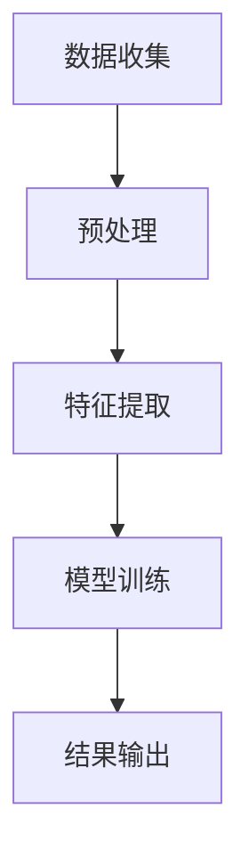

                 

关键词：舆情分析、AI大模型、深度学习、智能系统、数据挖掘、自然语言处理

> 摘要：随着信息时代的到来，舆情分析在政府、企业和社会各界的重要性日益凸显。本文将探讨基于AI大模型的智能舆情分析系统，深入分析其核心概念、算法原理、数学模型、项目实践和未来应用展望，旨在为读者提供全面的技术解读和应用指导。

## 1. 背景介绍

随着互联网和社交媒体的迅猛发展，信息传播速度和范围都得到了极大的提升。与此同时，舆情问题也日益复杂化，传统的舆情分析方法已经难以满足现代社会对实时性、全面性和准确性的需求。在这样的背景下，基于AI大模型的智能舆情分析系统应运而生。

舆情分析是指通过对网络上的公开信息进行分析、挖掘和处理，来识别、监测和评估公众对某一事件、话题或个体的态度和意见。智能舆情分析系统则利用人工智能技术，特别是深度学习和自然语言处理技术，实现对大规模数据的自动化分析，从而为用户提供更准确、更及时的分析结果。

## 2. 核心概念与联系

### 2.1 核心概念

- **舆情分析**：对网络上的公开信息进行分析，以识别和评估公众对某一事件或话题的态度和意见。
- **AI大模型**：基于深度学习和自然语言处理技术，能够处理大规模数据并自动提取特征的大规模神经网络模型。
- **深度学习**：一种机器学习技术，通过构建多层神经网络来模拟人脑的学习过程，实现自动特征提取和模式识别。
- **自然语言处理（NLP）**：人工智能的一个分支，旨在使计算机能够理解、生成和处理人类语言。

### 2.2 概念联系

智能舆情分析系统的工作原理可以概括为以下几个步骤：

1. **数据收集**：通过网络爬虫、社交媒体API等方式收集大量公开信息。
2. **预处理**：对收集到的数据进行清洗、去重和标准化处理，以去除噪声和提高数据质量。
3. **特征提取**：利用NLP技术对文本数据进行分析，提取出反映舆情的关键特征。
4. **模型训练**：使用深度学习技术训练AI大模型，使其能够自动分类、聚类和预测舆情趋势。
5. **结果输出**：将分析结果以可视化或文本报告的形式呈现给用户。

下面是智能舆情分析系统的Mermaid流程图：



## 3. 核心算法原理 & 具体操作步骤

### 3.1 算法原理概述

智能舆情分析系统的核心算法主要包括深度学习和自然语言处理技术。其中，深度学习负责自动提取特征和建模，自然语言处理负责处理文本数据。

- **深度学习**：使用多层神经网络，通过前向传播和反向传播算法，从数据中自动学习特征表示，实现对复杂关系的建模。
- **自然语言处理**：包括分词、词性标注、实体识别、情感分析等任务，用于处理和理解自然语言文本。

### 3.2 算法步骤详解

#### 3.2.1 数据收集

- **数据源**：包括网站、社交媒体、论坛等。
- **数据采集**：使用爬虫技术定期爬取目标网站的内容。

#### 3.2.2 预处理

- **数据清洗**：去除重复、无关信息，修正错误信息。
- **标准化处理**：统一文本格式，如去除特殊字符、转小写等。

#### 3.2.3 特征提取

- **词向量表示**：使用Word2Vec、GloVe等技术将单词转换为向量表示。
- **文本表示**：将句子或文档表示为一个向量，如使用BERT、Transformer等预训练模型。

#### 3.2.4 模型训练

- **模型选择**：选择适合的深度学习模型，如CNN、RNN、Transformer等。
- **模型训练**：使用已标注的数据集训练模型，调整参数以达到最佳性能。

#### 3.2.5 结果输出

- **分类与聚类**：对新的文本数据进行分类或聚类，识别出不同的舆情主题。
- **趋势预测**：利用训练好的模型预测未来的舆情趋势。

### 3.3 算法优缺点

#### 优点：

- **自动化处理**：能够自动化处理大规模文本数据，提高工作效率。
- **高准确性**：通过深度学习和自然语言处理技术，提高舆情分析的准确性和可靠性。
- **实时性**：能够实时监测和响应舆情变化，为决策提供及时的支持。

#### 缺点：

- **数据质量依赖**：数据质量对舆情分析结果有很大影响，低质量数据可能导致错误的结论。
- **模型解释性差**：深度学习模型的内部决策过程复杂，难以解释。

### 3.4 算法应用领域

- **政府舆情监控**：监测网络上的公众情绪，为政策制定提供参考。
- **企业品牌管理**：分析消费者对品牌的看法，指导营销策略。
- **社交媒体分析**：识别热点话题，预测趋势，为内容策划提供依据。

## 4. 数学模型和公式 & 详细讲解 & 举例说明

### 4.1 数学模型构建

智能舆情分析系统中的数学模型主要包括深度学习模型和自然语言处理模型。以下是一个简单的数学模型示例：

$$
\begin{aligned}
\text{舆情分析模型} &= \text{神经网络} \\
&= \text{输入层} \rightarrow \text{隐藏层} \rightarrow \text{输出层} \\
&= W_1 \cdot X + b_1 \rightarrow \sigma(W_2 \cdot (W_1 \cdot X + b_1) + b_2) \rightarrow \text{分类结果}
\end{aligned}
$$

其中，$W_1$、$W_2$是权重矩阵，$b_1$、$b_2$是偏置项，$X$是输入数据，$\sigma$是激活函数。

### 4.2 公式推导过程

神经网络的工作原理是通过前向传播和反向传播来更新权重和偏置，以达到最小化损失函数。以下是公式推导的简要过程：

#### 前向传播：

$$
\begin{aligned}
z &= W_1 \cdot X + b_1 \\
a &= \sigma(z) \\
z' &= W_2 \cdot a + b_2 \\
y &= \sigma(z')
\end{aligned}
$$

#### 反向传播：

$$
\begin{aligned}
\frac{\partial L}{\partial W_2} &= \frac{\partial L}{\partial y} \cdot \frac{\partial y}{\partial z'} \\
\frac{\partial L}{\partial W_1} &= \frac{\partial L}{\partial y} \cdot \frac{\partial y}{\partial z'} \cdot \frac{\partial z'}{\partial a} \cdot \frac{\partial a}{\partial z} \\
\frac{\partial L}{\partial b_1} &= \frac{\partial L}{\partial y} \cdot \frac{\partial y}{\partial z'} \cdot \frac{\partial z'}{\partial a} \\
\frac{\partial L}{\partial b_2} &= \frac{\partial L}{\partial y} \cdot \frac{\partial y}{\partial z'}
\end{aligned}
$$

其中，$L$是损失函数，$\partial$表示偏导数。

### 4.3 案例分析与讲解

以下是一个简单的舆情分析案例：

#### 案例背景：

某品牌新推出了一款手机，市场反响热烈。我们需要使用智能舆情分析系统来分析消费者对这款手机的评论，以了解消费者对手机性能、外观、价格等方面的看法。

#### 案例步骤：

1. **数据收集**：从多个电商网站和社交媒体平台上收集关于这款手机的评论数据。
2. **预处理**：清洗和标准化评论数据，去除无关信息。
3. **特征提取**：使用BERT模型提取评论的词向量表示。
4. **模型训练**：使用分类模型（如CNN）训练舆情分析模型。
5. **结果输出**：对新的评论数据进行分类，识别出正面、中性或负面的评论。

#### 案例结果：

通过对评论数据的分析，我们发现消费者对这款手机的性能和外观给予了高度评价，但对价格的接受度较低。基于这些结果，企业可以进一步优化产品策略，如提高性价比，以吸引更多消费者。

## 5. 项目实践：代码实例和详细解释说明

### 5.1 开发环境搭建

为了实现智能舆情分析系统，我们需要搭建一个合适的开发环境。以下是一个简单的开发环境搭建步骤：

1. **Python环境**：安装Python 3.8及以上版本，并配置pip。
2. **深度学习框架**：安装TensorFlow或PyTorch，用于构建和训练神经网络模型。
3. **自然语言处理库**：安装NLP库，如NLTK、spaCy、nltk等，用于文本预处理和特征提取。
4. **其他依赖库**：安装其他必要的库，如requests、beautifulsoup4等，用于数据收集和清洗。

### 5.2 源代码详细实现

以下是一个简单的智能舆情分析系统的源代码实现：

```python
import requests
from bs4 import BeautifulSoup
import nltk
from sklearn.feature_extraction.text import TfidfVectorizer
from sklearn.naive_bayes import MultinomialNB
from sklearn.pipeline import make_pipeline

# 数据收集
def collect_data(url):
    response = requests.get(url)
    soup = BeautifulSoup(response.text, 'html.parser')
    comments = soup.find_all('div', class_='comment')
    texts = [comment.text for comment in comments]
    return texts

# 数据预处理
def preprocess_text(texts):
    tokenizer = nltk.tokenize.Tok

