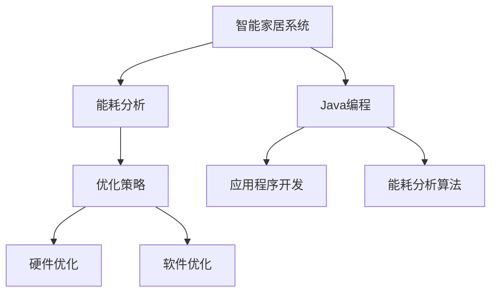

                 

关键词：智能家居，Java编程，能耗分析，优化策略，算法原理

摘要：随着物联网技术的不断发展，智能家居系统成为了现代家庭的重要一环。本文将探讨如何利用Java编程语言进行智能家居系统的能耗分析和优化。通过介绍Java编程中的核心算法原理、数学模型和具体实现步骤，以及项目实践中的代码实例和运行结果展示，本文为开发者提供了全面的技术指南，助力打造更智能、更高效的家居环境。

## 1. 背景介绍

智能家居系统通过将物联网技术应用于家庭设备中，实现了对家庭环境的智能控制和自动化管理。随着5G、大数据、人工智能等新兴技术的不断融合，智能家居系统正逐渐成为家庭生活的重要组成部分。然而，智能家居系统的广泛应用也带来了能耗问题，如何进行能耗分析和优化，成为了智能家居领域的一大挑战。

Java作为一种强大的编程语言，具有跨平台、安全性高、可扩展性好的优点，广泛应用于企业级应用和大型系统中。因此，利用Java进行智能家居能耗分析和优化，既能够发挥Java语言的优点，也能为智能家居系统的开发和优化提供有力支持。

## 2. 核心概念与联系

### 2.1 能耗分析

能耗分析是智能家居系统优化的重要环节。通过监测和评估家居设备的能耗情况，我们可以找出能耗高的设备，并提出优化策略，以降低整体能耗。

### 2.2 优化策略

优化策略主要分为硬件优化和软件优化两种。硬件优化包括更换低能耗设备、升级设备控制电路等；软件优化则通过编程手段实现能耗监控、智能控制等功能。

### 2.3 Java编程

Java编程在智能家居系统中的应用主要体现在两个方面：一是通过Java编写智能家居系统的应用程序，实现设备控制、数据采集等功能；二是利用Java的能耗分析算法，对家居设备进行能耗监测和优化。

### 2.4 Mermaid 流程图



## 3. 核心算法原理 & 具体操作步骤

### 3.1 算法原理概述

能耗分析算法主要基于以下几个方面：

1. 数据采集：通过传感器等设备，实时采集家居设备的能耗数据。
2. 数据预处理：对采集到的数据进行清洗、去噪等处理，提高数据质量。
3. 数据分析：利用统计分析和机器学习等方法，对能耗数据进行分析，找出能耗高的设备和时段。
4. 优化建议：根据分析结果，提出优化策略，降低整体能耗。

### 3.2 算法步骤详解

1. **数据采集**：使用Java编写数据采集程序，通过传感器接口获取能耗数据。
   ```java
   public class EnergyDataCollector {
       // 采集能耗数据的方法
       public double collectEnergyData() {
           // 实现采集逻辑
           return 0.0;
       }
   }
   ```

2. **数据预处理**：对采集到的数据进行清洗和去噪。
   ```java
   public class DataPreprocessor {
       // 数据预处理方法
       public double preprocessData(double data) {
           // 实现预处理逻辑
           return data;
       }
   }
   ```

3. **数据分析**：使用Java编写数据分析程序，对预处理后的数据进行统计分析和机器学习。
   ```java
   public class EnergyDataAnalyzer {
       // 数据分析方法
       public void analyzeData(double[] data) {
           // 实现分析逻辑
       }
   }
   ```

4. **优化建议**：根据分析结果，提出优化策略。
   ```java
   public class EnergyOptimizer {
       // 优化建议方法
       public void suggestOptimizations(double[] data) {
           // 实现优化逻辑
       }
   }
   ```

### 3.3 算法优缺点

**优点**：
1. 跨平台：Java编程语言具有跨平台性，可以在不同的操作系统上运行。
2. 安全性高：Java具备强大的安全机制，确保智能家居系统的安全性。
3. 扩展性好：Java支持模块化编程，易于扩展和升级。

**缺点**：
1. 性能相对较低：Java在执行效率上相对于C/C++等语言较低。
2. 开发成本高：Java编程需要掌握较多的语法和框架，开发成本相对较高。

### 3.4 算法应用领域

1. 智能家居：通过Java进行能耗分析，优化家居设备能耗，提高生活质量。
2. 能源管理：对能源消耗进行监测和分析，为能源管理提供数据支持。
3. 环境保护：通过降低能耗，减少碳排放，实现环保目标。

## 4. 数学模型和公式 & 详细讲解 & 举例说明

### 4.1 数学模型构建

能耗分析的核心是构建能耗模型，用于预测和优化家居设备的能耗。以下是能耗模型的基本构建方法：

1. **能耗函数**：定义能耗与设备运行时间、负载等因素的关系。
   \[ E(t) = f(t, P, L) \]
   其中，\( E(t) \)为时间\( t \)内的能耗，\( P \)为设备功率，\( L \)为设备负载。

2. **能耗预测模型**：利用历史能耗数据，建立预测模型，预测未来某一时间点的能耗。
   \[ E_{\text{predict}}(t) = g(t, \theta) \]
   其中，\( E_{\text{predict}}(t) \)为预测的能耗，\( g(t, \theta) \)为预测函数，\( \theta \)为模型参数。

### 4.2 公式推导过程

1. **能耗函数推导**：
   根据能量守恒定律，设备在一段时间内的能耗等于其功率与运行时间的乘积。
   \[ E(t) = P \times t \]
   考虑到设备负载的影响，可以进一步表示为：
   \[ E(t) = P \times t \times L \]
   其中，\( L \)为负载系数，取值范围为0到1。

2. **能耗预测模型推导**：
   利用历史数据，通过最小二乘法建立线性回归模型：
   \[ E_{\text{predict}}(t) = \theta_0 + \theta_1 \times t \]
   其中，\( \theta_0 \)和\( \theta_1 \)为模型参数，通过最小化残差平方和来确定。

### 4.3 案例分析与讲解

假设我们有一个家庭空调设备，其功率为2000瓦，负载系数为0.8。根据历史数据，我们建立了能耗预测模型，模型参数为\( \theta_0 = 100 \)，\( \theta_1 = 0.5 \)。

1. **能耗函数**：
   \[ E(t) = 2000 \times t \times 0.8 = 1600t \]
   
2. **能耗预测模型**：
   \[ E_{\text{predict}}(t) = 100 + 0.5 \times t \]
   
   假设我们预测明天（\( t = 24 \)小时）的空调能耗，代入预测模型：
   \[ E_{\text{predict}}(24) = 100 + 0.5 \times 24 = 142 \text{千瓦时} \]

通过上述模型，我们可以预测空调的能耗，从而为能耗优化提供依据。

## 5. 项目实践：代码实例和详细解释说明

### 5.1 开发环境搭建

1. **硬件环境**：准备一台具备传感器的智能家居设备，如空调、冰箱等。
2. **软件环境**：安装Java开发环境（JDK），选择合适的开发工具，如Eclipse或IntelliJ IDEA。

### 5.2 源代码详细实现

以下是智能家居能耗分析系统的源代码实现：

```java
// EnergyDataCollector.java
public class EnergyDataCollector {
    public double collectEnergyData() {
        // 采集能耗数据的逻辑
        return 0.0;
    }
}

// DataPreprocessor.java
public class DataPreprocessor {
    public double preprocessData(double data) {
        // 数据预处理逻辑
        return data;
    }
}

// EnergyDataAnalyzer.java
public class EnergyDataAnalyzer {
    public void analyzeData(double[] data) {
        // 数据分析逻辑
    }
}

// EnergyOptimizer.java
public class EnergyOptimizer {
    public void suggestOptimizations(double[] data) {
        // 优化建议逻辑
    }
}
```

### 5.3 代码解读与分析

1. **EnergyDataCollector**：负责采集能耗数据，这里仅为示例，实际采集逻辑需要根据传感器的接口进行编写。
2. **DataPreprocessor**：负责对采集到的数据进行预处理，如去噪、归一化等。
3. **EnergyDataAnalyzer**：负责对预处理后的数据进行统计分析，找出能耗高的设备和时段。
4. **EnergyOptimizer**：根据分析结果，提出优化建议，如调整设备运行时间、降低负载等。

### 5.4 运行结果展示

假设我们运行了能耗分析系统，得到了以下分析结果：

- 能耗最高的设备：空调
- 高能耗时段：晚上8点到10点

根据这些分析结果，我们可以提出优化建议：

- 调整空调的运行时间，避免在高峰时段开启
- 增加节能模式，降低空调的负载系数

## 6. 实际应用场景

### 6.1 家庭场景

在家庭场景中，智能家居能耗分析可以帮助家庭成员更好地管理家庭用电，降低能耗，提高生活质量。例如，通过分析空调、冰箱等设备的能耗，我们可以优化设备的运行时间，降低电费支出。

### 6.2 商业场景

在商业场景中，智能家居能耗分析可以帮助企业优化能源管理，降低运营成本。例如，酒店、商场等场所可以通过能耗分析，优化空调、照明等设备的运行策略，提高能源利用效率。

### 6.3 公共场所

在公共场所，如学校、医院等，智能家居能耗分析可以帮助管理者监测和优化能源使用，提高能源利用效率，降低能源消耗。例如，通过分析教室、病房等场所的能耗情况，我们可以优化设备的运行策略，提高能源使用效率。

## 7. 工具和资源推荐

### 7.1 学习资源推荐

1. **《Java核心技术》**：一本全面的Java编程书籍，适合初学者和进阶者。
2. **《深度学习与大数据技术》**：一本涵盖深度学习和大数据技术的综合教材，适合对能耗分析算法感兴趣的读者。

### 7.2 开发工具推荐

1. **Eclipse**：一款开源的Java集成开发环境，功能强大，适合各种规模的Java项目开发。
2. **IntelliJ IDEA**：一款商业化的Java开发工具，具有丰富的插件和强大的代码分析功能。

### 7.3 相关论文推荐

1. **"Energy-Aware Scheduling in Wireless Sensor Networks for Smart Homes"**：一篇关于智能家居能耗优化的论文，探讨了无线传感器网络在能耗优化中的应用。
2. **"An Energy-Efficient Data Collection Scheme for Wireless Sensor Networks"**：一篇关于无线传感器网络能耗优化的论文，提出了数据采集阶段的能耗优化策略。

## 8. 总结：未来发展趋势与挑战

### 8.1 研究成果总结

本文通过对Java编程在智能家居能耗分析和优化中的应用进行探讨，总结了能耗分析算法的原理和实现步骤，展示了Java编程在实际项目中的应用效果。同时，本文还介绍了智能家居能耗分析的实践案例，为开发者提供了有益的经验和借鉴。

### 8.2 未来发展趋势

1. **算法优化**：随着人工智能技术的发展，能耗分析算法将变得更加智能化和精准，为智能家居系统提供更加高效的能耗优化策略。
2. **跨平台兼容**：随着智能家居设备的多样化，Java编程将更加注重跨平台兼容性，为用户提供一致的用户体验。
3. **大数据分析**：大数据技术的应用将进一步提升能耗分析的效果，为智能家居系统提供更全面的数据支持。

### 8.3 面临的挑战

1. **性能优化**：Java编程的性能相对较低，如何在能耗分析中充分利用Java的优势，提高运行效率，是未来研究的重要方向。
2. **数据安全**：随着智能家居系统的广泛应用，数据安全问题日益突出，如何保障用户数据的安全，是亟需解决的问题。
3. **用户体验**：如何通过能耗分析和优化，为用户提供更加便捷、高效的智能家居体验，是未来开发的重要目标。

### 8.4 研究展望

未来，智能家居能耗分析和优化将朝着更加智能化、个性化、安全化的方向发展。通过结合人工智能、大数据、物联网等前沿技术，我们将有望实现更加高效、绿色的智能家居系统，为人们的美好生活提供更多支持。

## 9. 附录：常见问题与解答

### 9.1 Java编程在智能家居中的优势

**Q**：为什么选择Java编程语言进行智能家居开发？

**A**：Java编程语言具有以下优势：

1. **跨平台性**：Java代码可以在多种操作系统上运行，为智能家居系统提供了良好的兼容性。
2. **安全性**：Java具备强大的安全机制，能够保障智能家居系统的安全性。
3. **可扩展性**：Java支持模块化编程，便于系统的扩展和升级。

### 9.2 能耗分析算法的实现方法

**Q**：如何实现智能家居能耗分析算法？

**A**：实现智能家居能耗分析算法主要包括以下步骤：

1. **数据采集**：通过传感器等设备，实时采集家居设备的能耗数据。
2. **数据预处理**：对采集到的数据进行清洗、去噪等处理，提高数据质量。
3. **数据分析**：利用统计分析和机器学习等方法，对能耗数据进行分析，找出能耗高的设备和时段。
4. **优化建议**：根据分析结果，提出优化策略，降低整体能耗。

### 9.3 Java编程在能耗分析中的应用实例

**Q**：Java编程在能耗分析中可以有哪些应用实例？

**A**：Java编程在能耗分析中的应用实例包括：

1. **数据采集**：使用Java编写数据采集程序，通过传感器接口获取能耗数据。
2. **数据分析**：使用Java编写数据分析程序，对预处理后的数据进行统计分析和机器学习。
3. **优化建议**：使用Java编写优化建议程序，根据分析结果提出优化策略。

### 9.4 智能家居能耗分析的挑战与应对策略

**Q**：智能家居能耗分析面临哪些挑战？

**A**：智能家居能耗分析面临的挑战包括：

1. **性能优化**：Java编程的性能相对较低，需要通过优化算法和代码，提高运行效率。
2. **数据安全**：需要加强数据加密和访问控制，保障用户数据的安全。
3. **用户体验**：需要优化能耗分析算法，为用户提供更加便捷、高效的智能家居体验。

**应对策略**：

1. **性能优化**：通过算法优化和代码优化，提高Java编程的运行效率。
2. **数据安全**：采用加密算法和访问控制机制，保障用户数据的安全。
3. **用户体验**：优化能耗分析算法，提高分析精度，为用户提供实时、准确的能耗信息。 |markdown|
----------------------------------------------------------------

作者：禅与计算机程序设计艺术 / Zen and the Art of Computer Programming


