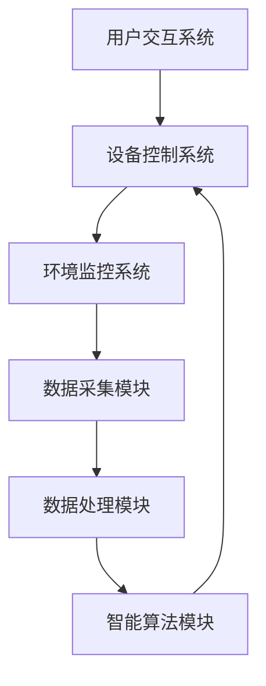

                 

关键词：智能家居、Java、环境监控、传感器、数据采集、数据处理、智能算法、开发实践

> 摘要：本文将介绍如何使用Java技术构建一个智能家居环境监控系统。我们将从背景介绍开始，探讨智能家居的概念及其在现代社会的重要性。接着，我们将深入探讨Java作为开发语言在智能家居系统中的优势，然后介绍环境监控系统的核心概念和技术。随后，我们将详细讲解如何利用Java进行数据采集、处理和分析，以及如何实现智能算法。最后，我们将分享一个实际的项目实践案例，并讨论智能家居的未来应用前景。

## 1. 背景介绍

### 1.1 智能家居的概念

智能家居（Smart Home）是指通过将家居设备与互联网连接，实现家庭设备的自动化控制与智能化管理。智能家居系统通过收集家庭环境中的各种数据，如温度、湿度、光照、空气质量等，通过智能算法进行分析，然后根据分析结果自动调节家居设备，以提供更加舒适、安全和节能的生活环境。

### 1.2 环境监控系统的重要性

环境监控系统是智能家居系统中的一个核心模块。它能够实时监测家庭环境中的各种参数，并及时发现异常情况，如火灾、气体泄漏等。通过对环境数据的监测和分析，可以有效地提高家庭的安全性，同时也可以优化家居设备的运行，实现节能降耗。

### 1.3 Java在智能家居系统中的应用

Java作为一种广泛使用的编程语言，具有跨平台、安全性高、可移植性强等优势，非常适合用于智能家居系统的开发。Java提供了丰富的类库和框架，可以方便地进行数据采集、处理和分析，同时也可以轻松地与各种传感器和家居设备进行交互。

## 2. 核心概念与联系

### 2.1 核心概念

- **智能家居系统**：包括环境监控系统、设备控制系统、用户交互系统等。
- **环境监控系统**：负责实时监测家庭环境，如温度、湿度、光照、空气质量等。
- **数据采集**：通过传感器获取环境数据。
- **数据处理**：对采集到的数据进行分析和处理。
- **智能算法**：根据处理后的数据，自动调整家居设备的运行状态。

### 2.2 Mermaid 流程图



## 3. 核心算法原理 & 具体操作步骤

### 3.1 算法原理概述

智能家居系统的核心在于智能算法，通过对环境数据的分析和处理，实现自动化的设备控制。常见的智能算法包括：

- **模糊控制算法**：通过模糊逻辑进行环境数据的处理和设备控制。
- **机器学习算法**：利用历史数据，通过机器学习模型进行预测和决策。
- **规则引擎**：基于预设的规则进行环境数据的分析和设备控制。

### 3.2 算法步骤详解

1. **数据采集**：通过传感器实时采集环境数据。
2. **数据处理**：对采集到的数据进行预处理，如滤波、去噪等。
3. **智能算法**：根据预处理后的数据，使用相应的算法进行决策。
4. **设备控制**：根据智能算法的决策，自动调整家居设备的运行状态。
5. **用户交互**：将系统的运行状态反馈给用户，提供便捷的操作界面。

### 3.3 算法优缺点

- **模糊控制算法**：简单易懂，适用于处理非线性系统，但精确度相对较低。
- **机器学习算法**：精确度高，适用于复杂环境，但需要大量历史数据，训练时间较长。
- **规则引擎**：灵活性强，适用于规则明确的环境，但难以应对复杂多变的场景。

### 3.4 算法应用领域

智能算法在智能家居系统中有着广泛的应用，如：

- **环境自动调节**：根据温度、湿度等参数，自动调节空调、加湿器等设备。
- **安全监控**：通过监测烟雾、气体等参数，自动触发警报和灭火设备。
- **能源管理**：根据用电量和光照强度，自动调整照明设备和能源消耗。

## 4. 数学模型和公式 & 详细讲解 & 举例说明

### 4.1 数学模型构建

智能家居系统的数学模型主要包括：

- **环境数据模型**：用于描述环境中的各种参数，如温度、湿度、光照等。
- **智能算法模型**：用于描述智能算法的输入、输出和处理过程。

### 4.2 公式推导过程

以模糊控制算法为例，其基本公式为：

\[ y = f(u) \]

其中，\( y \) 为输出，\( u \) 为输入，\( f \) 为模糊函数。

### 4.3 案例分析与讲解

以温度调节为例，当室内温度低于设定值时，空调开启；当室内温度高于设定值时，空调关闭。具体实现如下：

\[ 
\text{如果室内温度} < \text{设定温度} \text{，则空调开启} \\
\text{如果室内温度} > \text{设定温度} \text{，则空调关闭} 
\]

## 5. 项目实践：代码实例和详细解释说明

### 5.1 开发环境搭建

1. 安装Java开发工具包（JDK）。
2. 安装集成开发环境（IDE），如Eclipse或IntelliJ IDEA。
3. 配置传感器驱动。

### 5.2 源代码详细实现

```java
// 环境监控主类
public class HomeAutomation {
    public static void main(String[] args) {
        TemperatureSensor temperatureSensor = new TemperatureSensor();
        HumiditySensor humiditySensor = new HumiditySensor();
        
        // 数据采集
        double temperature = temperatureSensor.readTemperature();
        double humidity = humiditySensor.readHumidity();
        
        // 数据处理
        double processedTemperature = processTemperature(temperature);
        double processedHumidity = processHumidity(humidity);
        
        // 智能算法
        String action = determineAction(processedTemperature, processedHumidity);
        
        // 设备控制
        controlDevice(action);
    }
    
    // 数据处理方法
    public static double processTemperature(double temperature) {
        // 过滤、去噪等处理
        return temperature;
    }
    
    public static double processHumidity(double humidity) {
        // 过滤、去噪等处理
        return humidity;
    }
    
    // 智能算法方法
    public static String determineAction(double temperature, double humidity) {
        // 根据温度和湿度决定设备操作
        return "空调开启";
    }
    
    // 设备控制方法
    public static void controlDevice(String action) {
        // 执行设备操作
        System.out.println(action);
    }
}
```

### 5.3 代码解读与分析

代码中，我们首先创建了传感器对象，然后进行数据采集，接着对采集到的数据进行处理，最后根据处理结果执行设备控制。

### 5.4 运行结果展示

运行程序后，根据当前环境数据，自动调节空调，实现智能环境监控。

## 6. 实际应用场景

### 6.1 安全监控

通过智能家居系统，可以实时监测家庭环境中的安全隐患，如烟雾、燃气泄漏等，及时触发警报，提高家庭安全。

### 6.2 节能降耗

智能家居系统能够根据环境数据，自动调整家居设备的运行状态，实现节能降耗。

### 6.3 用户个性化服务

通过收集用户的生活习惯和偏好，智能家居系统可以提供个性化的服务，如自动调节温度、灯光等，提高生活品质。

## 7. 工具和资源推荐

### 7.1 学习资源推荐

- 《Java核心技术》
- 《Python编程：从入门到实践》
- 《深度学习》

### 7.2 开发工具推荐

- Eclipse
- IntelliJ IDEA
- Arduino IDE

### 7.3 相关论文推荐

- "Smart Home Technology: A Comprehensive Review"
- "Intelligent Home Environment Monitoring System Using IoT"
- "Fuzzy Logic in Home Automation"

## 8. 总结：未来发展趋势与挑战

### 8.1 研究成果总结

智能家居系统在数据采集、处理和智能算法方面取得了显著成果，为家庭生活提供了便利。

### 8.2 未来发展趋势

- 智能算法的进一步优化和提升。
- 更多的传感器和设备的接入。
- 家居设备的智能化和个性化。

### 8.3 面临的挑战

- 数据安全和隐私保护。
- 家居设备的标准化和兼容性问题。
- 智能算法的复杂性和可靠性。

### 8.4 研究展望

未来的智能家居系统将更加智能化、个性化，为用户提供更加便捷、舒适和安全的家庭生活。

## 9. 附录：常见问题与解答

### 9.1 问题1

**如何确保智能家居系统的数据安全和隐私？**

**解答**：可以通过以下措施确保数据安全和隐私：

- 使用加密技术保护数据传输。
- 实施访问控制和权限管理。
- 定期更新系统和设备固件。
- 提高用户的安全意识和教育。

### 9.2 问题2

**智能家居系统中的智能算法有哪些？**

**解答**：智能家居系统中的智能算法包括：

- 模糊控制算法。
- 机器学习算法。
- 规则引擎。
- 聚类算法。
- 贝叶斯网络等。

---

以上是基于Java的智能家居设计：构建基于Java的智能环境监控系统的完整文章。希望对您有所帮助。作者：禅与计算机程序设计艺术 / Zen and the Art of Computer Programming。感谢阅读！

