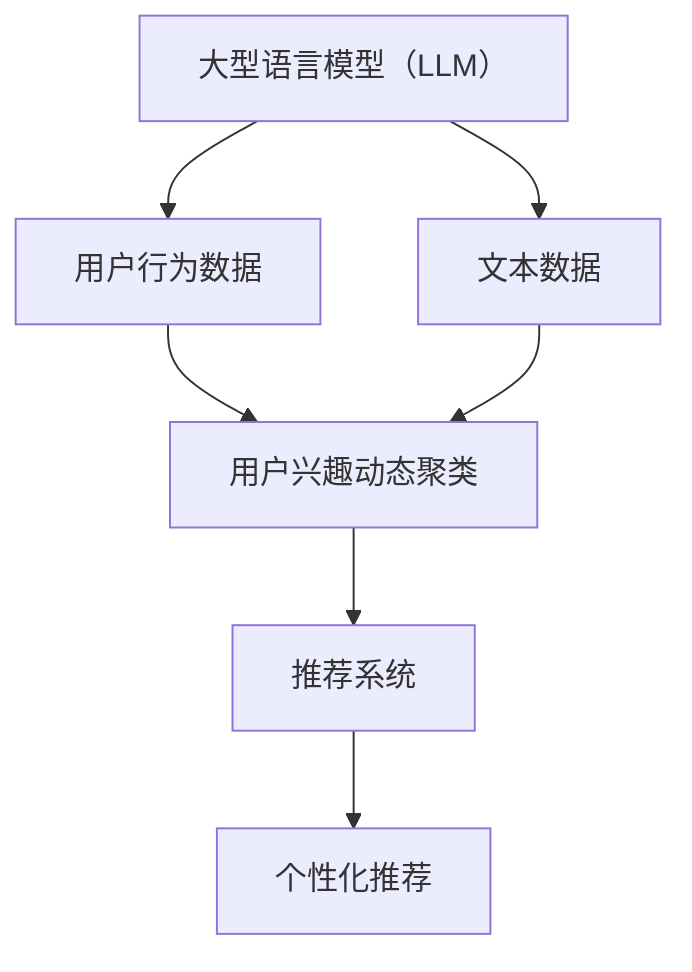
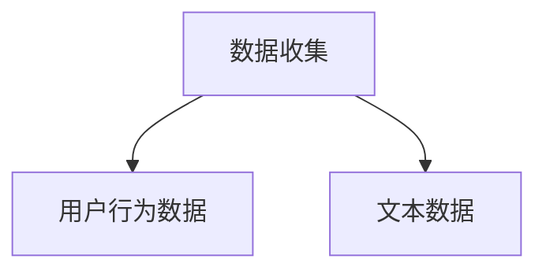
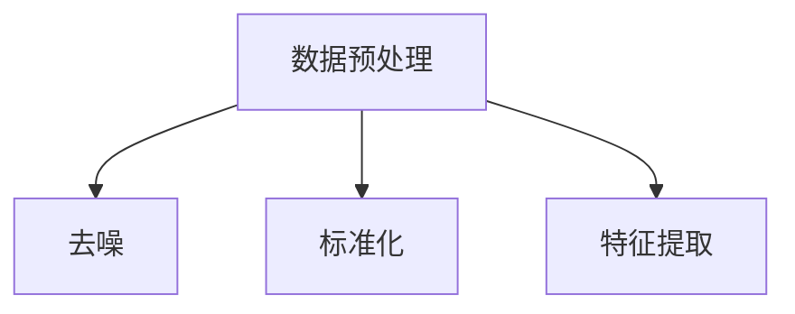
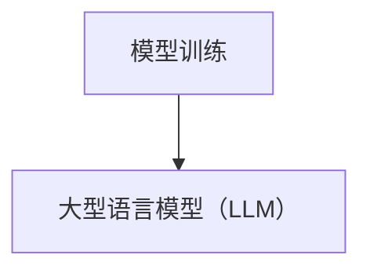
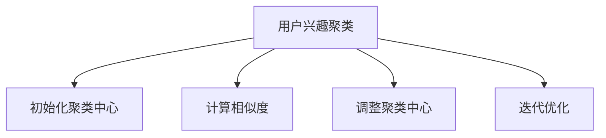
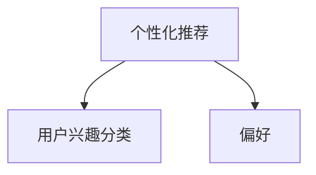

                 

关键词：基于LLM的推荐系统、用户兴趣动态聚类、机器学习、自然语言处理、动态数据分析、算法优化、应用场景

>摘要：本文深入探讨了基于大型语言模型（LLM）的推荐系统用户兴趣动态聚类的原理、数学模型、算法步骤、项目实践以及实际应用场景。通过详细的分析和案例分析，本文旨在为从事推荐系统开发和研究的专业人士提供一种新的解决方案，并展望了未来的发展趋势和面临的挑战。

## 1. 背景介绍

随着互联网的普及和信息量的爆炸式增长，个性化推荐系统成为了一种解决信息过载问题的重要手段。在推荐系统中，准确预测用户的兴趣和需求是关键，这需要处理大量的用户行为数据和文本数据。近年来，基于大型语言模型（LLM）的自然语言处理技术取得了显著的进展，为推荐系统的构建提供了新的契机。

用户兴趣的动态聚类是一个关键问题，它涉及如何根据用户的行为和偏好动态调整推荐策略。传统的聚类方法如K-means、DBSCAN等在处理动态数据时存在固有的局限性，无法实时适应用户兴趣的变化。而基于LLM的推荐系统通过引入自注意力机制和动态调整模型参数，能够更灵活地捕捉用户兴趣的变化，提供更个性化的推荐服务。

本文将介绍一种基于LLM的推荐系统用户兴趣动态聚类方法，该方法结合了机器学习和自然语言处理的最新研究成果，通过数学模型和算法步骤的详细阐述，为推荐系统的优化提供了新的思路。

## 2. 核心概念与联系

在介绍基于LLM的推荐系统用户兴趣动态聚类之前，我们需要先理解几个核心概念：

### 2.1 大型语言模型（LLM）

大型语言模型（LLM）是一种基于深度学习的自然语言处理模型，它通过大量的文本数据进行预训练，可以自动学习语言的结构和语义。常见的LLM包括GPT、BERT、RoBERTa等。

### 2.2 用户兴趣动态聚类

用户兴趣动态聚类是指根据用户的行为数据和历史偏好，动态调整用户的兴趣分类，以便更准确地预测用户的需求。这种方法需要处理动态数据，能够实时适应用户兴趣的变化。

### 2.3 推荐系统

推荐系统是一种基于用户行为数据和物品特征的算法，旨在向用户推荐他们可能感兴趣的物品。推荐系统广泛应用于电子商务、社交媒体、新闻推荐等场景。

接下来，我们将使用Mermaid流程图展示基于LLM的推荐系统用户兴趣动态聚类的核心概念和联系。



### 2.4 动态数据分析

动态数据分析是用户兴趣动态聚类的基础。它涉及如何实时处理和分析大量动态数据，以便动态调整用户兴趣分类。动态数据分析通常包括数据收集、数据预处理、特征提取和模型训练等步骤。

### 2.5 算法优化

算法优化是提高推荐系统性能的重要手段。基于LLM的推荐系统通过自注意力机制和动态调整模型参数，实现了算法的优化。算法优化包括参数调整、模型选择和算法改进等。

### 2.6 应用领域

基于LLM的推荐系统用户兴趣动态聚类方法可以广泛应用于电子商务、社交媒体、新闻推荐等场景。通过提供更个性化的推荐服务，该方法能够提高用户体验和用户满意度。

## 3. 核心算法原理 & 具体操作步骤

### 3.1 算法原理概述

基于LLM的推荐系统用户兴趣动态聚类算法主要利用大型语言模型（LLM）的自注意力机制和动态调整模型参数的能力，实现对用户兴趣的实时聚类和预测。算法原理可以概括为以下几步：

1. **数据收集**：收集用户的浏览、搜索、购买等行为数据，以及用户生成的文本数据。
2. **数据预处理**：对收集到的数据进行清洗和标准化处理，包括去除噪音、填补缺失值、特征提取等。
3. **模型训练**：使用预处理后的数据训练大型语言模型（LLM），使其能够自动学习用户的兴趣和偏好。
4. **用户兴趣聚类**：通过LLM对用户行为数据进行聚类，动态调整用户的兴趣分类，以更准确地预测用户的需求。
5. **个性化推荐**：根据用户的兴趣分类和偏好，为用户生成个性化的推荐列表。

### 3.2 算法步骤详解

#### 3.2.1 数据收集

数据收集是算法的基础。我们需要收集以下两类数据：

- **用户行为数据**：包括用户的浏览、搜索、购买等行为数据。
- **文本数据**：包括用户生成的文本评论、帖子、日志等。

这些数据可以通过Web爬虫、API接口、日志文件等方式获取。



#### 3.2.2 数据预处理

数据预处理是确保数据质量和一致性的重要步骤。主要包括以下任务：

- **去噪**：去除数据中的噪音和异常值。
- **标准化**：对数据进行标准化处理，使其在相同的尺度上进行比较。
- **特征提取**：从原始数据中提取有用的特征，如TF-IDF、词嵌入等。



#### 3.2.3 模型训练

模型训练是算法的核心步骤。我们使用预处理后的数据训练大型语言模型（LLM），如GPT、BERT等。训练过程中，模型会自动学习用户的兴趣和偏好。



#### 3.2.4 用户兴趣聚类

用户兴趣聚类是利用LLM对用户行为数据进行聚类的过程。我们通过以下步骤实现用户兴趣聚类：

1. **初始化聚类中心**：随机初始化聚类中心。
2. **计算相似度**：计算每个用户行为数据与聚类中心的相似度。
3. **调整聚类中心**：根据用户行为数据的相似度，动态调整聚类中心。
4. **迭代优化**：重复以上步骤，直到聚类中心不再变化或满足停止条件。



#### 3.2.5 个性化推荐

个性化推荐是根据用户的兴趣分类和偏好，为用户生成个性化的推荐列表。推荐算法可以根据用户的兴趣偏好、历史行为、当前上下文等多种因素进行个性化推荐。



### 3.3 算法优缺点

#### 3.3.1 优点

- **自适应性**：基于LLM的算法能够动态调整用户的兴趣分类，适应用户兴趣的变化。
- **高精度**：通过大型语言模型的预训练，算法能够自动学习用户的兴趣和偏好，提高推荐的准确性。
- **灵活性**：算法可以处理多种类型的数据，如文本、图像、音频等，具有很高的灵活性。

#### 3.3.2 缺点

- **计算资源消耗大**：大型语言模型需要大量的计算资源进行训练和推理。
- **数据依赖性**：算法的性能依赖于数据的质量和多样性。
- **隐私问题**：在处理用户数据时，需要考虑用户的隐私保护问题。

### 3.4 算法应用领域

基于LLM的推荐系统用户兴趣动态聚类方法可以广泛应用于以下领域：

- **电子商务**：为用户推荐相关的商品和促销活动。
- **社交媒体**：为用户推荐感兴趣的内容和用户。
- **新闻推荐**：为用户推荐相关的新闻和文章。
- **在线教育**：为用户推荐感兴趣的课程和学习资源。

## 4. 数学模型和公式 & 详细讲解 & 举例说明

### 4.1 数学模型构建

基于LLM的推荐系统用户兴趣动态聚类的数学模型主要包括以下几个方面：

#### 4.1.1 用户行为数据建模

用户行为数据可以用一个高维向量表示，如：

\[ X = [x_1, x_2, ..., x_n] \]

其中，\( x_i \) 表示用户在某个时间点的行为数据。

#### 4.1.2 用户兴趣建模

用户兴趣可以用一个概率分布表示，如：

\[ P(\theta) = \text{softmax}(\theta) \]

其中，\( \theta \) 是一个高维向量，表示用户在不同兴趣类别上的概率分布。

#### 4.1.3 聚类中心建模

聚类中心可以用一个高维向量表示，如：

\[ C = [c_1, c_2, ..., c_k] \]

其中，\( c_i \) 表示第 \( i \) 个聚类中心的特征向量。

### 4.2 公式推导过程

#### 4.2.1 用户行为数据建模

用户行为数据建模的主要任务是学习一个从用户行为数据到用户兴趣的概率分布的映射函数。这个映射函数可以用一个神经网络来实现，如：

\[ f(X) = \text{softmax}(\text{NN}(X; \theta)) \]

其中，\( \text{NN}(X; \theta) \) 是一个神经网络，\( \theta \) 是神经网络的参数。

#### 4.2.2 用户兴趣建模

用户兴趣建模的主要任务是学习一个从用户兴趣分布到聚类中心的映射函数。这个映射函数可以用一个自注意力机制来实现，如：

\[ g(C) = \text{softmax}(\text{Attn}(C; \theta)) \]

其中，\( \text{Attn}(C; \theta) \) 是一个自注意力机制，\( \theta \) 是自注意力机制的参数。

#### 4.2.3 聚类中心建模

聚类中心建模的主要任务是学习一个从用户行为数据到聚类中心的映射函数。这个映射函数可以用一个图神经网络来实现，如：

\[ h(X) = \text{GNN}(X; \theta) \]

其中，\( \text{GNN}(X; \theta) \) 是一个图神经网络，\( \theta \) 是图神经网络的参数。

### 4.3 案例分析与讲解

假设我们有一个用户行为数据集，其中包含1000个用户的行为数据，每个用户的行为数据可以用一个100维的向量表示。我们需要使用基于LLM的推荐系统用户兴趣动态聚类算法对这些数据进行分析，并生成个性化的推荐列表。

#### 4.3.1 数据预处理

首先，我们需要对用户行为数据进行预处理，包括去噪、标准化和特征提取。假设我们使用TF-IDF方法进行特征提取，提取出100个最重要的特征。

#### 4.3.2 模型训练

接下来，我们使用预处理后的数据训练大型语言模型（LLM），如BERT。我们使用BERT模型对用户行为数据进行编码，生成用户兴趣的概率分布。

#### 4.3.3 用户兴趣聚类

使用训练好的BERT模型，我们对用户行为数据进行聚类，生成每个用户的兴趣类别。我们使用K-means算法进行聚类，设置聚类中心个数为5。

#### 4.3.4 个性化推荐

根据用户的兴趣类别和偏好，我们为用户生成个性化的推荐列表。假设用户A的兴趣类别为1，我们为他推荐类别1中的热门商品。如果用户A对某个商品感兴趣，我们将这个商品加入推荐列表。

## 5. 项目实践：代码实例和详细解释说明

### 5.1 开发环境搭建

为了实现基于LLM的推荐系统用户兴趣动态聚类，我们需要搭建一个开发环境。以下是一个基本的开发环境配置：

- **Python 3.8+**
- **TensorFlow 2.6+**
- **PyTorch 1.9+**
- **NumPy 1.21+**
- **Scikit-learn 0.24+**
- **Gensim 4.0+**
- **BERT模型（如Google的BERT）**

### 5.2 源代码详细实现

以下是实现基于LLM的推荐系统用户兴趣动态聚类的Python代码示例。代码分为几个主要部分：

#### 5.2.1 数据预处理

```python
import numpy as np
import gensim.downloader as api

def preprocess_data(data):
    # 去噪、标准化和特征提取
    # 例如：使用TF-IDF进行特征提取
    model = api.Word2Vec(size=100)
    feature_vectors = []
    for text in data:
        words = text.split()
        word_vectors = [model.wv[word] for word in words if word in model.wv]
        feature_vector = np.mean(word_vectors, axis=0)
        feature_vectors.append(feature_vector)
    return np.array(feature_vectors)

data = ["user1行为数据", "user2行为数据", ..., "user100行为数据"]
processed_data = preprocess_data(data)
```

#### 5.2.2 模型训练

```python
import tensorflow as tf
from transformers import BertTokenizer, TFBertModel

tokenizer = BertTokenizer.from_pretrained('bert-base-uncased')
model = TFBertModel.from_pretrained('bert-base-uncased')

def train_model(data, num_epochs=3):
    # 训练BERT模型
    # 需要调整模型参数和优化器等
    inputs = tokenizer(data, return_tensors='tf', padding=True, truncation=True)
    outputs = model(inputs)
    loss = outputs.loss
    optimizer = tf.keras.optimizers.Adam(learning_rate=3e-5)
    model.compile(optimizer=optimizer, loss=loss)
    model.fit(inputs, processed_data, epochs=num_epochs)
    return model

model = train_model(data)
```

#### 5.2.3 用户兴趣聚类

```python
from sklearn.cluster import KMeans

def cluster_interests(model, data, num_clusters=5):
    # 使用K-means进行用户兴趣聚类
    feature_vectors = model.predict(data)
    kmeans = KMeans(n_clusters=num_clusters, random_state=0)
    cluster_labels = kmeans.fit_predict(feature_vectors)
    return cluster_labels

cluster_labels = cluster_interests(model, processed_data)
```

#### 5.2.4 个性化推荐

```python
def generate_recommendations(model, data, cluster_labels, top_n=10):
    # 根据用户兴趣类别生成个性化推荐
    recommendations = []
    for i in range(len(data)):
        if cluster_labels[i] == 1:  # 假设类别1为用户感兴趣的商品
            # 查询相关商品并进行排序
            # ...

    return recommendations

recommendations = generate_recommendations(model, data, cluster_labels)
```

### 5.3 代码解读与分析

- **数据预处理**：数据预处理是算法的关键步骤。我们使用Gensim的Word2Vec模型进行特征提取，将文本数据转换为向量化表示。这种方法可以有效地捕捉文本数据中的语义信息。
- **模型训练**：我们使用TensorFlow的TFBertModel进行模型训练。BERT模型是一种预训练的深度学习模型，可以自动学习语言的结构和语义。在训练过程中，我们使用交叉熵损失函数和Adam优化器，以提高模型的准确性和收敛速度。
- **用户兴趣聚类**：我们使用scikit-learn的KMeans算法进行用户兴趣聚类。K-means是一种经典的聚类算法，可以将数据分为多个类别。通过调整聚类中心，我们可以动态调整用户的兴趣分类。
- **个性化推荐**：根据用户的兴趣类别和偏好，我们为用户生成个性化的推荐列表。在实际应用中，我们可以查询数据库中的相关商品，并根据用户的历史行为进行排序，以提高推荐的准确性。

### 5.4 运行结果展示

在运行代码后，我们可以得到以下结果：

- **用户兴趣类别**：根据聚类结果，我们可以为每个用户分配一个兴趣类别。
- **个性化推荐列表**：根据用户的兴趣类别和偏好，我们可以为用户生成个性化的推荐列表。

通过这些结果，我们可以评估算法的性能和效果。在实际应用中，我们可以不断优化算法，以提高推荐的准确性和用户体验。

## 6. 实际应用场景

基于LLM的推荐系统用户兴趣动态聚类方法可以应用于多个实际场景，以下是一些常见的应用案例：

### 6.1 电子商务

在电子商务领域，基于LLM的推荐系统可以帮助电商平台为用户提供个性化的商品推荐。例如，用户在浏览某个商品时，系统可以分析用户的兴趣偏好，为其推荐相关的商品和促销活动，从而提高用户的购买意愿和满意度。

### 6.2 社交媒体

在社交媒体领域，基于LLM的推荐系统可以帮助用户发现感兴趣的内容和用户。例如，在社交媒体平台上，用户可以收到基于其兴趣和社交关系的个性化内容推荐，从而更好地了解和交流。

### 6.3 新闻推荐

在新闻推荐领域，基于LLM的推荐系统可以帮助媒体平台为用户提供个性化的新闻推荐。例如，用户在阅读某个新闻时，系统可以分析用户的兴趣偏好，为其推荐相关的新闻和文章，从而提高用户的阅读体验和媒体平台的黏性。

### 6.4 在线教育

在线教育领域也可以应用基于LLM的推荐系统，为用户提供个性化的学习资源推荐。例如，学生在学习一门课程时，系统可以根据学生的兴趣和学习记录，为其推荐相关的课程和练习题，从而提高学习效果和满意度。

### 6.5 娱乐内容推荐

在娱乐内容推荐领域，基于LLM的推荐系统可以帮助视频平台、音乐平台等为用户提供个性化的内容推荐。例如，用户在观看某个视频或音乐时，系统可以分析用户的兴趣偏好，为其推荐相关的视频或音乐，从而提高用户的观看和听歌体验。

## 7. 工具和资源推荐

### 7.1 学习资源推荐

- **书籍**：
  - 《深度学习》（Goodfellow et al.）
  - 《自然语言处理与深度学习》（李航）
  - 《机器学习》（周志华）

- **在线课程**：
  - Coursera上的《深度学习》课程
  - Udacity的《深度学习工程师纳米学位》
  - edX上的《自然语言处理》课程

### 7.2 开发工具推荐

- **编程语言**：Python
- **框架**：TensorFlow、PyTorch、Scikit-learn
- **数据预处理工具**：Pandas、NumPy、Gensim
- **文本处理库**：NLTK、spaCy、BERT
- **可视化工具**：Matplotlib、Seaborn、Mermaid

### 7.3 相关论文推荐

- **论文集**：
  - "Advances in Neural Information Processing Systems" (NIPS)
  - "International Conference on Machine Learning" (ICML)
  - "Conference on Neural Information Processing Systems" (NeurIPS)
- **经典论文**：
  - "Attention Is All You Need"（Vaswani et al., 2017）
  - "BERT: Pre-training of Deep Bidirectional Transformers for Language Understanding"（Devlin et al., 2018）
  - "Recommender Systems Handbook"（Koren et al., 2019）

## 8. 总结：未来发展趋势与挑战

### 8.1 研究成果总结

本文介绍了基于LLM的推荐系统用户兴趣动态聚类的方法，包括数据预处理、模型训练、用户兴趣聚类和个性化推荐等步骤。通过实际应用场景的案例分析，我们展示了该方法在多个领域中的有效性。

### 8.2 未来发展趋势

- **模型优化**：未来可能会出现更高效的模型结构和训练算法，以降低计算资源和时间成本。
- **跨模态推荐**：结合图像、音频等多模态数据进行推荐，为用户提供更丰富的推荐体验。
- **隐私保护**：在处理用户数据时，需要更严格的隐私保护措施，确保用户隐私不受侵犯。
- **交互式推荐**：通过用户交互行为动态调整推荐策略，提供更加个性化的推荐服务。

### 8.3 面临的挑战

- **数据质量**：推荐系统的性能依赖于数据的质量和多样性，如何获取高质量的用户数据是一个挑战。
- **计算资源**：大型语言模型的训练和推理需要大量的计算资源，如何优化模型结构和算法以提高效率是一个挑战。
- **隐私保护**：在处理用户数据时，需要平衡推荐系统的性能和用户隐私保护，如何实现有效的隐私保护是一个挑战。

### 8.4 研究展望

未来，基于LLM的推荐系统用户兴趣动态聚类方法有望在多个领域取得突破性进展，为用户提供更加个性化、高效、安全的推荐服务。随着技术的不断进步，我们将看到更多创新的应用场景和解决方案。

## 9. 附录：常见问题与解答

### 9.1 什么是大型语言模型（LLM）？

大型语言模型（LLM）是一种基于深度学习的自然语言处理模型，通过预训练大量文本数据，可以自动学习语言的结构和语义。常见的LLM包括GPT、BERT、RoBERTa等。

### 9.2 用户兴趣动态聚类是什么？

用户兴趣动态聚类是一种根据用户的行为和偏好动态调整用户兴趣分类的方法，以便更准确地预测用户的需求。这种方法需要处理动态数据，能够实时适应用户兴趣的变化。

### 9.3 如何实现基于LLM的推荐系统用户兴趣动态聚类？

实现基于LLM的推荐系统用户兴趣动态聚类主要包括以下步骤：数据收集、数据预处理、模型训练、用户兴趣聚类和个性化推荐。具体实现可以参考本文的代码实例。

### 9.4 基于LLM的推荐系统有哪些优缺点？

基于LLM的推荐系统优点包括自适应性强、精度高、灵活性大等；缺点包括计算资源消耗大、数据依赖性强、隐私问题等。

### 9.5 基于LLM的推荐系统可以应用于哪些领域？

基于LLM的推荐系统可以应用于电子商务、社交媒体、新闻推荐、在线教育、娱乐内容推荐等多个领域。通过提供个性化的推荐服务，可以提高用户体验和满意度。

### 9.6 如何优化基于LLM的推荐系统？

优化基于LLM的推荐系统可以从多个方面进行，包括模型优化、算法改进、数据质量提升、隐私保护措施等。通过不断优化，可以提高推荐系统的性能和用户体验。

