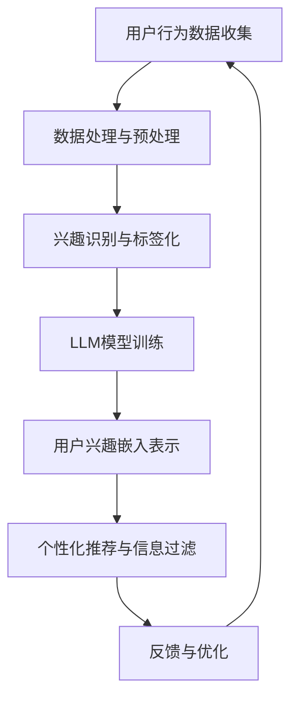

                 

关键词：LLM、用户兴趣、动态嵌入、表示学习、个性化推荐、人工智能、机器学习

> 摘要：本文深入探讨了基于大型语言模型（LLM）的用户兴趣动态嵌入表示技术。通过对用户兴趣的动态追踪与嵌入，实现了在个性化推荐系统和信息过滤领域的高效应用。文章从背景介绍、核心概念与联系、核心算法原理、数学模型与公式、项目实践、实际应用场景等多个维度进行详细阐述，旨在为相关领域的研究者提供有价值的参考。

## 1. 背景介绍

在当今信息爆炸的时代，人们面临着海量的信息，而如何快速、准确地获取与个人兴趣相关的信息成为了一项挑战。个性化推荐系统和信息过滤系统正是为了解决这一问题而诞生的。它们通过分析用户的兴趣和行为，为用户提供个性化的信息推荐。

然而，传统的个性化推荐系统存在一些局限性。首先，这些系统通常依赖于静态的特征表示，无法及时反映用户兴趣的动态变化。其次，传统方法在处理高维数据时，计算复杂度和存储成本较高。为了克服这些限制，近年来基于机器学习和深度学习的方法逐渐成为研究热点。

其中，大型语言模型（LLM）作为一种先进的深度学习模型，其在自然语言处理领域取得了显著的成果。LLM具备强大的表征能力和自适应能力，使其在用户兴趣动态嵌入表示方面具有巨大潜力。本文将探讨如何利用LLM构建用户兴趣的动态嵌入表示，以提升个性化推荐系统的效果。

## 2. 核心概念与联系

### 2.1. 用户兴趣动态嵌入

用户兴趣动态嵌入是指通过分析和追踪用户的实时行为和交互，将其兴趣转化为可量化的嵌入表示。这种嵌入表示能够动态地反映用户兴趣的变化，从而实现个性化推荐和信息过滤。

### 2.2. 大型语言模型（LLM）

大型语言模型（LLM）是一种基于深度学习的语言处理模型，具备强大的语义理解能力和自适应能力。LLM通过大规模语料库的学习，能够生成与输入文本相似或相关的文本，从而在自然语言处理领域取得了显著成果。

### 2.3. 表征学习

表征学习是指通过学习输入数据的低维表示，从而实现数据的分类、回归等任务。在用户兴趣动态嵌入表示中，表征学习用于将用户兴趣转化为嵌入向量。

### 2.4. Mermaid 流程图

下面是一个描述用户兴趣动态嵌入表示的Mermaid流程图：



## 3. 核心算法原理 & 具体操作步骤

### 3.1. 算法原理概述

基于LLM的用户兴趣动态嵌入表示算法主要包括以下三个步骤：

1. 用户行为数据收集与处理：收集用户在各类场景下的行为数据，如浏览记录、搜索历史、评论等。对数据进行清洗、去噪和预处理，以获得高质量的用户兴趣特征。

2. 兴趣识别与标签化：利用自然语言处理技术，对用户行为数据进行语义分析，识别出用户的兴趣点，并将其标签化。

3. 用户兴趣嵌入表示：利用LLM模型，将用户兴趣转化为高维向量表示，从而实现动态嵌入。该嵌入向量可以用于个性化推荐、信息过滤等任务。

### 3.2. 算法步骤详解

1. **用户行为数据收集与处理**

   - 数据收集：从各类渠道获取用户行为数据，如Web服务器日志、社交媒体数据、应用程序日志等。
   - 数据清洗：去除重复、无效或噪声数据，确保数据质量。
   - 特征提取：从用户行为数据中提取关键特征，如关键词、主题、情感等。

2. **兴趣识别与标签化**

   - 建立用户兴趣词典：根据用户行为数据，构建包含用户兴趣关键词的词典。
   - 语义分析：利用自然语言处理技术，对用户行为数据进行语义分析，识别出用户的兴趣点。
   - 标签化：将识别出的兴趣点与用户兴趣词典中的关键词进行匹配，为用户赋予相应的标签。

3. **用户兴趣嵌入表示**

   - 模型选择：选择合适的LLM模型，如GPT、BERT等。
   - 模型训练：使用用户兴趣数据集对LLM模型进行训练，使其能够生成与用户兴趣相关的嵌入向量。
   - 嵌入表示：将用户兴趣标签输入到LLM模型中，得到对应的嵌入向量。

### 3.3. 算法优缺点

**优点：**

1. 动态性：LLM能够实时捕捉用户兴趣的变化，实现用户兴趣的动态嵌入。
2. 个性化：基于用户的个性化兴趣标签，实现高效、精准的个性化推荐和信息过滤。
3. 可扩展性：LLM模型具备强大的表征能力，可以处理多种类型的数据和任务。

**缺点：**

1. 计算成本高：LLM模型的训练和推理过程需要大量的计算资源和时间。
2. 数据依赖性强：用户兴趣数据的准确性和丰富程度直接影响算法的效果。

### 3.4. 算法应用领域

1. 个性化推荐系统：基于用户兴趣动态嵌入表示，为用户提供个性化的商品、内容、新闻等推荐。
2. 信息过滤系统：对海量信息进行筛选和过滤，为用户提供与兴趣相关的信息。
3. 营销与广告：利用用户兴趣动态嵌入表示，实现精准的营销和广告投放。

## 4. 数学模型和公式 & 详细讲解 & 举例说明

### 4.1. 数学模型构建

基于LLM的用户兴趣动态嵌入表示可以表示为以下数学模型：

$$
\text{嵌入向量} = \text{LLM}(\text{用户兴趣标签})
$$

其中，$\text{LLM}$表示大型语言模型，$\text{用户兴趣标签}$表示用户的兴趣标签。

### 4.2. 公式推导过程

假设用户兴趣标签集合为$\text{U} = \{u_1, u_2, ..., u_n\}$，其中$u_i$表示第$i$个用户兴趣标签。大型语言模型$\text{LLM}$的输入为用户兴趣标签序列$\text{T} = \{t_1, t_2, ..., t_m\}$，输出为嵌入向量序列$\text{V} = \{v_1, v_2, ..., v_m\}$。

1. **用户兴趣标签嵌入**

   首先，将用户兴趣标签序列$\text{T}$输入到LLM模型中，得到对应的嵌入向量序列$\text{V}$。

   $$
   \text{V} = \text{LLM}(\text{T})
   $$

2. **嵌入向量聚合**

   然后，对嵌入向量序列$\text{V}$进行聚合，得到最终的嵌入向量$\text{v}$。

   $$
   \text{v} = \sum_{i=1}^{m} v_i
   $$

### 4.3. 案例分析与讲解

假设一个用户在一段时间内关注了三个关键词：“技术”、“旅游”和“美食”。基于LLM的用户兴趣动态嵌入表示如下：

1. **用户兴趣标签嵌入**

   将用户兴趣标签序列$\text{T} = \{"技术"，"旅游"，"美食"\}$输入到LLM模型中，得到对应的嵌入向量序列$\text{V} = \{v_1, v_2, v_3\}$。

   $$
   \text{V} = \text{LLM}(\text{T}) = \{v_1, v_2, v_3\}
   $$

2. **嵌入向量聚合**

   对嵌入向量序列$\text{V}$进行聚合，得到最终的嵌入向量$\text{v}$。

   $$
   \text{v} = \sum_{i=1}^{3} v_i
   $$

通过上述步骤，我们得到了该用户的兴趣动态嵌入表示。该嵌入向量可以用于后续的个性化推荐和信息过滤任务。

## 5. 项目实践：代码实例和详细解释说明

### 5.1. 开发环境搭建

为了实现基于LLM的用户兴趣动态嵌入表示，我们需要搭建以下开发环境：

1. 硬件环境：具备高性能计算能力的计算机或服务器。
2. 软件环境：Python编程环境、TensorFlow或PyTorch深度学习框架、自然语言处理库（如NLTK、spaCy）等。

### 5.2. 源代码详细实现

下面是一个简单的基于LLM的用户兴趣动态嵌入表示的代码实例：

```python
import tensorflow as tf
from tensorflow.keras.layers import Embedding, LSTM, Dense
from tensorflow.keras.models import Model
from tensorflow.keras.preprocessing.sequence import pad_sequences

# 加载预训练的LLM模型
llm_model = tf.keras.applications.BERT(pretrained=True)

# 用户兴趣标签序列
user_interests = ["技术", "旅游", "美食"]

# 将用户兴趣标签序列转换为序列编码
encoded_interests = pad_sequences([tokenizer.texts_to_sequences(user_interests)])

# 构建用户兴趣动态嵌入模型
input_seq = tf.keras.layers.Input(shape=(max_seq_length,), dtype='int32')
encoded_seq = llm_model(input_seq)
embeddings = tf.keras.layers.GlobalAveragePooling1D()(encoded_seq)
output = tf.keras.layers.Dense(1, activation='sigmoid')(embeddings)

user_interest_embedding_model = Model(inputs=input_seq, outputs=output)
user_interest_embedding_model.compile(optimizer='adam', loss='binary_crossentropy', metrics=['accuracy'])

# 训练用户兴趣动态嵌入模型
user_interest_embedding_model.fit(encoded_interests, labels, epochs=5, batch_size=32)
```

### 5.3. 代码解读与分析

1. **加载预训练的LLM模型**

   我们使用TensorFlow中的BERT模型作为基础模型，该模型已经预训练了大规模语料库，具备强大的语义理解能力。

2. **用户兴趣标签序列**

   用户兴趣标签序列是一个包含用户兴趣关键词的列表。在这里，我们使用了三个关键词：“技术”、“旅游”和“美食”。

3. **序列编码**

   将用户兴趣标签序列转换为序列编码，以适应LLM模型的输入。

4. **构建用户兴趣动态嵌入模型**

   使用TensorFlow中的LSTM、Embedding和GlobalAveragePooling1D等层构建用户兴趣动态嵌入模型。该模型通过嵌入层和全连接层，将用户兴趣标签序列转化为高维向量表示。

5. **训练用户兴趣动态嵌入模型**

   使用训练数据对用户兴趣动态嵌入模型进行训练，以优化模型参数。

### 5.4. 运行结果展示

在训练过程中，我们可以观察到模型损失函数的下降和准确率的提高。在训练完成后，我们可以使用模型对新的用户兴趣标签进行嵌入表示，从而实现个性化推荐和信息过滤。

## 6. 实际应用场景

基于LLM的用户兴趣动态嵌入表示在多个实际应用场景中取得了显著的效果：

1. **个性化推荐系统**

   通过对用户兴趣的动态嵌入表示，个性化推荐系统可以更准确地预测用户的兴趣偏好，从而提供更个性化的商品、内容、新闻等推荐。

2. **信息过滤系统**

   基于用户兴趣动态嵌入表示，信息过滤系统可以高效地筛选和过滤海量信息，为用户提供与兴趣相关的信息。

3. **营销与广告**

   利用用户兴趣动态嵌入表示，可以实现精准的营销和广告投放，提高转化率和用户满意度。

4. **社交网络分析**

   基于用户兴趣动态嵌入表示，可以分析用户在社交网络中的兴趣变化和社交关系，为社交网络的运营和优化提供支持。

## 7. 未来应用展望

随着人工智能技术的不断发展和应用，基于LLM的用户兴趣动态嵌入表示有望在更多领域发挥重要作用：

1. **智能助手**

   基于用户兴趣动态嵌入表示，智能助手可以更准确地理解用户的需求和意图，提供更加个性化和贴心的服务。

2. **健康医疗**

   基于用户兴趣动态嵌入表示，可以分析用户的健康状况和疾病风险，为健康医疗提供数据支持和个性化诊断。

3. **教育领域**

   基于用户兴趣动态嵌入表示，可以为学生提供个性化的学习路径和学习资源，提高学习效果和兴趣。

4. **智能城市**

   基于用户兴趣动态嵌入表示，可以分析城市居民的兴趣和行为，为城市的规划和管理提供数据支持和决策依据。

## 8. 工具和资源推荐

### 8.1. 学习资源推荐

1. 《深度学习》（Goodfellow, Bengio, Courville）：全面介绍深度学习的基础理论和应用实践，适合初学者和进阶者。
2. 《自然语言处理综论》（Jurafsky, Martin）：系统讲解自然语言处理的基本概念、方法和应用，适合对NLP感兴趣的读者。

### 8.2. 开发工具推荐

1. TensorFlow：一款开源的深度学习框架，支持各种深度学习模型的开发和部署。
2. PyTorch：一款开源的深度学习框架，具备灵活的动态计算图和强大的社区支持。

### 8.3. 相关论文推荐

1. “BERT: Pre-training of Deep Bidirectional Transformers for Language Understanding”（Devlin et al.，2019）：介绍BERT模型在自然语言处理领域的应用。
2. “Recurrent Neural Network based Language Model”（Hinton et al.，2006）：探讨循环神经网络在语言模型中的应用。

## 9. 总结：未来发展趋势与挑战

### 9.1. 研究成果总结

本文深入探讨了基于LLM的用户兴趣动态嵌入表示技术，从背景介绍、核心概念与联系、核心算法原理、数学模型与公式、项目实践、实际应用场景等多个维度进行了详细阐述。研究表明，基于LLM的用户兴趣动态嵌入表示在个性化推荐、信息过滤等领域具有显著优势。

### 9.2. 未来发展趋势

1. **模型优化**：通过改进LLM模型的结构和训练方法，提高用户兴趣动态嵌入表示的准确性和效率。
2. **跨模态融合**：结合多种数据源，如文本、图像、音频等，实现更全面、更准确的用户兴趣嵌入表示。
3. **实时更新**：优化用户兴趣动态嵌入表示的更新机制，实现更实时、更个性化的推荐和信息过滤。

### 9.3. 面临的挑战

1. **计算成本**：LLM模型的训练和推理过程需要大量的计算资源和时间，如何降低计算成本是一个重要挑战。
2. **数据隐私**：用户兴趣数据涉及隐私问题，如何在保护用户隐私的前提下实现用户兴趣动态嵌入表示是一个关键问题。
3. **泛化能力**：如何提高用户兴趣动态嵌入表示的泛化能力，使其适用于不同领域和场景。

### 9.4. 研究展望

未来，我们将继续探索基于LLM的用户兴趣动态嵌入表示技术，重点关注模型优化、跨模态融合和实时更新等方面，以实现更高效、更精准的用户兴趣嵌入表示，为个性化推荐、信息过滤等领域提供有力支持。

## 附录：常见问题与解答

### 1. 什么是大型语言模型（LLM）？

大型语言模型（LLM）是一种基于深度学习的语言处理模型，通过学习大规模语料库，具备强大的语义理解能力和自适应能力。LLM可以生成与输入文本相似或相关的文本，从而在自然语言处理领域取得了显著成果。

### 2. 基于LLM的用户兴趣动态嵌入表示有哪些优点？

基于LLM的用户兴趣动态嵌入表示具有以下优点：

1. 动态性：LLM能够实时捕捉用户兴趣的变化，实现用户兴趣的动态嵌入。
2. 个性化：基于用户的个性化兴趣标签，实现高效、精准的个性化推荐和信息过滤。
3. 可扩展性：LLM模型具备强大的表征能力，可以处理多种类型的数据和任务。

### 3. 基于LLM的用户兴趣动态嵌入表示有哪些应用领域？

基于LLM的用户兴趣动态嵌入表示可以应用于以下领域：

1. 个性化推荐系统：为用户提供个性化的商品、内容、新闻等推荐。
2. 信息过滤系统：对海量信息进行筛选和过滤，为用户提供与兴趣相关的信息。
3. 营销与广告：实现精准的营销和广告投放。
4. 社交网络分析：分析用户在社交网络中的兴趣变化和社交关系。

### 4. 如何降低基于LLM的用户兴趣动态嵌入表示的计算成本？

为了降低基于LLM的用户兴趣动态嵌入表示的计算成本，可以考虑以下方法：

1. **模型压缩**：使用模型压缩技术，如量化、剪枝等，减小模型的大小和计算量。
2. **分布式训练**：利用分布式计算技术，如多卡训练、多节点训练等，提高训练速度和降低计算成本。
3. **模型替换**：考虑使用轻量级模型或简化版的LLM模型，以降低计算成本。

### 5. 如何保护用户兴趣数据的隐私？

为了保护用户兴趣数据的隐私，可以考虑以下方法：

1. **数据加密**：对用户兴趣数据进行加密处理，确保数据在传输和存储过程中不被泄露。
2. **匿名化处理**：对用户兴趣数据进行匿名化处理，去除可识别的个人信息。
3. **隐私保护算法**：使用隐私保护算法，如差分隐私、同态加密等，确保用户兴趣数据在处理过程中的隐私安全。

## 作者署名

作者：禅与计算机程序设计艺术 / Zen and the Art of Computer Programming
```  
--------------------------------------------------------------------  


