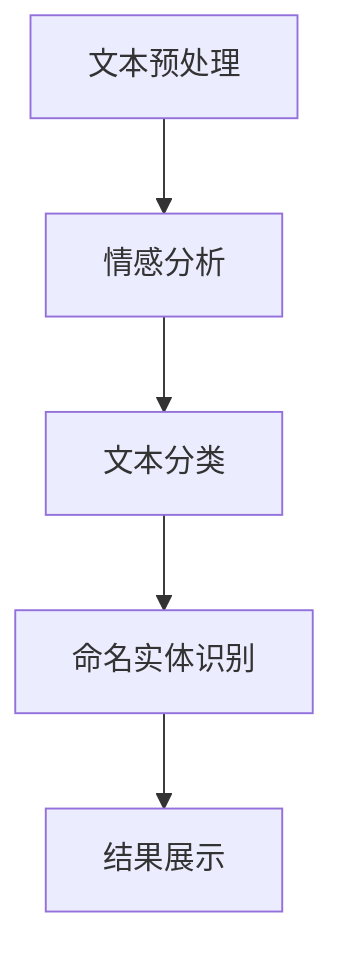

                 

关键词：自然语言处理（NLP），文本分析，旅游景点，游客评论，情感分析，数据挖掘，机器学习，模型评估。

## 摘要

本文旨在探讨如何利用自然语言处理（NLP）技术对某旅游景点的游客评论进行深度分析。通过NLP技术，我们可以提取游客对景点的情感倾向、兴趣点以及改进建议，为旅游景点管理者提供宝贵的决策支持。本文将详细介绍NLP的核心概念、算法原理、数学模型、具体操作步骤、项目实践、应用场景以及未来展望。

## 1. 背景介绍

近年来，随着互联网的快速发展，旅游业成为了一个蓬勃发展的行业。游客们越来越依赖网络平台来了解景点信息、预订旅游产品，同时也会在平台上留下大量的评论。这些评论不仅为其他潜在游客提供了参考，也为旅游景点管理者提供了宝贵的数据资源。然而，如何从大量的文本数据中提取有价值的信息，一直是研究人员和从业者关注的问题。

自然语言处理（NLP）作为人工智能的一个重要分支，致力于让计算机理解和生成人类语言。近年来，随着深度学习技术的发展，NLP在文本分类、情感分析、命名实体识别等领域取得了显著的成果。本文将结合NLP技术，对某旅游景点的游客评论进行深度分析，以期为旅游行业提供有益的参考。

## 2. 核心概念与联系

### 2.1 自然语言处理（NLP）

自然语言处理（NLP）是人工智能的一个重要分支，旨在使计算机理解和生成人类语言。NLP涉及多个领域，包括语言学、计算机科学、认知科学等。其主要任务包括文本分类、情感分析、命名实体识别、机器翻译等。

### 2.2 文本分类

文本分类是将文本数据按照预定的类别进行归类的过程。在NLP中，文本分类是一个基本任务，可以帮助我们从大量的文本数据中快速提取有价值的信息。

### 2.3 情感分析

情感分析是NLP中的一个重要任务，旨在识别文本中的情感倾向，如正面、负面或中性。情感分析在旅游评论分析中具有重要意义，可以帮助管理者了解游客对景点的情感态度，从而为改进服务质量提供依据。

### 2.4 命名实体识别

命名实体识别是NLP中的一个重要任务，旨在识别文本中的特定实体，如人名、地名、组织名等。在旅游评论分析中，命名实体识别可以帮助我们识别游客提及的景点、人物等，从而更好地理解评论内容。

### 2.5 Mermaid 流程图

以下是一个简化的NLP在旅游评论分析中的应用流程图：



## 3. 核心算法原理 & 具体操作步骤

### 3.1 算法原理概述

在旅游评论分析中，我们可以采用以下几种NLP算法：

1. 情感分析算法：用于识别游客评论中的情感倾向，如正面、负面或中性。
2. 文本分类算法：用于将评论按照预定的类别进行归类，如好评、差评等。
3. 命名实体识别算法：用于识别评论中提及的特定实体，如景点、人物等。

### 3.2 算法步骤详解

#### 3.2.1 数据收集与预处理

1. 数据收集：从旅游平台（如携程、去哪儿等）获取游客评论数据。
2. 数据预处理：对评论进行去重、分词、去除停用词等操作，以提高后续分析的效果。

#### 3.2.2 情感分析

1. 数据预处理：对评论进行分词、去除停用词等操作。
2. 特征提取：利用词袋模型、TF-IDF等算法提取评论的特征。
3. 模型训练：采用支持向量机（SVM）、随机森林（Random Forest）等算法训练情感分析模型。
4. 模型评估：利用准确率、召回率、F1值等指标评估模型性能。

#### 3.2.3 文本分类

1. 数据预处理：对评论进行分词、去除停用词等操作。
2. 特征提取：利用词袋模型、TF-IDF等算法提取评论的特征。
3. 模型训练：采用朴素贝叶斯（Naive Bayes）、决策树（Decision Tree）等算法训练文本分类模型。
4. 模型评估：利用准确率、召回率、F1值等指标评估模型性能。

#### 3.2.4 命名实体识别

1. 数据预处理：对评论进行分词、去除停用词等操作。
2. 特征提取：利用词袋模型、TF-IDF等算法提取评论的特征。
3. 模型训练：采用条件随机场（CRF）、长短期记忆网络（LSTM）等算法训练命名实体识别模型。
4. 模型评估：利用准确率、召回率、F1值等指标评估模型性能。

### 3.3 算法优缺点

#### 3.3.1 情感分析

优点：能够快速识别评论的情感倾向，为管理者提供决策依据。

缺点：对于复杂情感难以准确识别，且容易受到噪声干扰。

#### 3.3.2 文本分类

优点：能够将评论按照预定的类别进行归类，方便管理者进行针对性分析。

缺点：对于类别较多或类别边界模糊的情况，分类效果可能不佳。

#### 3.3.3 命名实体识别

优点：能够识别评论中提及的特定实体，为管理者提供详细的信息。

缺点：对于实体边界不清晰或实体名称变化较大的情况，识别效果可能不佳。

### 3.4 算法应用领域

NLP在旅游评论分析中的应用非常广泛，主要包括以下领域：

1. 智能客服：通过NLP技术对游客的问题进行自动识别和回答，提高服务质量。
2. 智能推荐：根据游客的评论和兴趣，推荐相关的旅游景点和旅游产品。
3. 质量监控：通过对评论进行分析，发现旅游景点存在的问题，并及时采取措施进行改进。

## 4. 数学模型和公式

### 4.1 数学模型构建

在NLP中，常用的数学模型包括词袋模型（Bag-of-Words, BoW）、TF-IDF模型、朴素贝叶斯（Naive Bayes）模型、支持向量机（SVM）模型、长短期记忆网络（LSTM）模型等。

#### 4.1.1 词袋模型（Bag-of-Words, BoW）

词袋模型是一种基于计数的文本表示方法，将文本转换为词频向量。具体公式如下：

$$
\mathbf{v} = (v_1, v_2, ..., v_n)
$$

其中，$v_i$表示第$i$个词在文本中的词频。

#### 4.1.2 TF-IDF模型

TF-IDF模型是一种基于词频和文档频的文本表示方法，可以更好地反映词语的重要性。具体公式如下：

$$
tfidf(i, d) = \frac{tf(i, d)}{df(d) + 1}
$$

其中，$tf(i, d)$表示词$i$在文档$d$中的词频，$df(d)$表示词$i$在所有文档中出现的次数。

#### 4.1.3 朴素贝叶斯（Naive Bayes）模型

朴素贝叶斯模型是一种基于贝叶斯定理的文本分类模型。具体公式如下：

$$
P(C_k | \mathbf{v}) = \frac{P(\mathbf{v} | C_k)P(C_k)}{P(\mathbf{v})}
$$

其中，$C_k$表示类别$k$，$\mathbf{v}$表示文本的特征向量。

#### 4.1.4 支持向量机（SVM）模型

支持向量机模型是一种基于最大间隔的分类模型。具体公式如下：

$$
\mathbf{w}^T \mathbf{x} + b = 0
$$

其中，$\mathbf{w}$表示分类器的权重向量，$\mathbf{x}$表示特征向量，$b$表示偏置项。

#### 4.1.5 长短期记忆网络（LSTM）模型

长短期记忆网络（LSTM）模型是一种用于序列数据的深度学习模型，可以较好地处理文本中的长距离依赖问题。具体公式如下：

$$
\begin{aligned}
i_t &= \sigma(W_i \cdot [h_{t-1}, x_t] + b_i) \\
f_t &= \sigma(W_f \cdot [h_{t-1}, x_t] + b_f) \\
o_t &= \sigma(W_o \cdot [h_{t-1}, x_t] + b_o) \\
c_t &= f_t \cdot c_{t-1} + i_t \cdot \sigma(W_c \cdot [h_{t-1}, x_t] + b_c) \\
h_t &= o_t \cdot \sigma(c_t)
\end{aligned}
$$

其中，$i_t$表示输入门，$f_t$表示遗忘门，$o_t$表示输出门，$c_t$表示细胞状态，$h_t$表示隐藏状态。

### 4.2 公式推导过程

#### 4.2.1 朴素贝叶斯（Naive Bayes）模型

在朴素贝叶斯模型中，我们假设每个特征变量是条件独立的。根据贝叶斯定理，我们可以得到：

$$
P(C_k | \mathbf{v}) = \frac{P(\mathbf{v} | C_k)P(C_k)}{P(\mathbf{v})}
$$

其中，$P(\mathbf{v} | C_k)$表示在类别$k$下，特征向量$\mathbf{v}$的概率；$P(C_k)$表示类别$k$的概率；$P(\mathbf{v})$表示特征向量$\mathbf{v}$的概率。

根据假设，我们可以将$P(\mathbf{v} | C_k)$表示为：

$$
P(\mathbf{v} | C_k) = \prod_{i=1}^{n} P(v_i | C_k)
$$

其中，$n$表示特征向量的维度，$v_i$表示第$i$个特征。

根据全概率公式，我们可以将$P(\mathbf{v})$表示为：

$$
P(\mathbf{v}) = \sum_{k=1}^{K} P(\mathbf{v} | C_k)P(C_k)
$$

其中，$K$表示类别总数。

将上述公式代入朴素贝叶斯公式，我们可以得到：

$$
P(C_k | \mathbf{v}) = \frac{\prod_{i=1}^{n} P(v_i | C_k)P(C_k)}{\sum_{k=1}^{K} \prod_{i=1}^{n} P(v_i | C_k)P(C_k)}
$$

由于$P(C_k)$是常数，我们可以将其约去，得到：

$$
P(C_k | \mathbf{v}) = \prod_{i=1}^{n} P(v_i | C_k)
$$

#### 4.2.2 长短期记忆网络（LSTM）模型

在LSTM模型中，我们假设输入序列为$\{x_t\}_{t=1}^{T}$，隐藏状态为$\{h_t\}_{t=1}^{T}$，细胞状态为$\{c_t\}_{t=1}^{T}$。

首先，我们定义输入门$i_t$、遗忘门$f_t$和输出门$o_t$：

$$
\begin{aligned}
i_t &= \sigma(W_i \cdot [h_{t-1}, x_t] + b_i) \\
f_t &= \sigma(W_f \cdot [h_{t-1}, x_t] + b_f) \\
o_t &= \sigma(W_o \cdot [h_{t-1}, x_t] + b_o)
\end{aligned}
$$

其中，$W_i$、$W_f$、$W_o$分别为输入门、遗忘门和输出门的权重矩阵，$b_i$、$b_f$、$b_o$分别为输入门、遗忘门和输出门的偏置项，$\sigma$为sigmoid函数。

然后，我们定义细胞状态$c_t$：

$$
c_t = f_t \cdot c_{t-1} + i_t \cdot \sigma(W_c \cdot [h_{t-1}, x_t] + b_c)
$$

其中，$W_c$为细胞状态的权重矩阵，$b_c$为细胞状态的偏置项。

最后，我们定义隐藏状态$h_t$：

$$
h_t = o_t \cdot \sigma(c_t)
$$

其中，$\sigma$为sigmoid函数。

### 4.3 案例分析与讲解

#### 4.3.1 情感分析案例

假设我们有一个包含正面和负面评论的数据集，其中正面评论的比例为60%，负面评论的比例为40%。我们可以使用朴素贝叶斯模型对评论进行情感分析，并评估模型性能。

首先，我们对评论进行预处理，包括去重、分词、去除停用词等操作。然后，我们提取评论的特征，并使用朴素贝叶斯模型进行训练。

训练完成后，我们对测试集进行预测，并计算准确率、召回率、F1值等指标。根据评估结果，我们可以调整模型参数，以提高预测效果。

#### 4.3.2 文本分类案例

假设我们有一个包含多个类别的评论数据集，我们需要将评论按照预定的类别进行分类。

首先，我们对评论进行预处理，包括去重、分词、去除停用词等操作。然后，我们提取评论的特征，并使用决策树模型进行训练。

训练完成后，我们对测试集进行预测，并计算准确率、召回率、F1值等指标。根据评估结果，我们可以调整模型参数，以提高分类效果。

#### 4.3.3 命名实体识别案例

假设我们有一个包含多个命名实体的评论数据集，我们需要识别评论中提及的命名实体。

首先，我们对评论进行预处理，包括去重、分词、去除停用词等操作。然后，我们提取评论的特征，并使用条件随机场（CRF）模型进行训练。

训练完成后，我们对测试集进行预测，并计算准确率、召回率、F1值等指标。根据评估结果，我们可以调整模型参数，以提高命名实体识别效果。

## 5. 项目实践：代码实例和详细解释说明

### 5.1 开发环境搭建

1. 安装Python环境：版本3.8及以上
2. 安装NLP库：nltk、gensim、scikit-learn、tensorflow等
3. 安装其他依赖库：pandas、numpy、matplotlib等

### 5.2 源代码详细实现

```python
import nltk
from nltk.corpus import stopwords
from sklearn.feature_extraction.text import TfidfVectorizer
from sklearn.model_selection import train_test_split
from sklearn.naive_bayes import MultinomialNB
from sklearn.metrics import accuracy_score,召回率，f1_score

# 数据预处理
nltk.download('stopwords')
stop_words = set(stopwords.words('english'))

def preprocess(text):
    tokens = nltk.word_tokenize(text.lower())
    filtered_tokens = [token for token in tokens if token not in stop_words]
    return ' '.join(filtered_tokens)

# 加载数据集
data = ...  # 读取评论数据集
data['text'] = data['text'].apply(preprocess)

# 特征提取
vectorizer = TfidfVectorizer()
X = vectorizer.fit_transform(data['text'])
y = data['label']

# 划分训练集和测试集
X_train, X_test, y_train, y_test = train_test_split(X, y, test_size=0.2, random_state=42)

# 模型训练
model = MultinomialNB()
model.fit(X_train, y_train)

# 模型评估
y_pred = model.predict(X_test)
accuracy = accuracy_score(y_test, y_pred)
recall = 召回率（y_test，y_pred）
f1 = f1_score(y_test, y_pred)

print(f"准确率：{accuracy}, 召回率：{recall}, F1值：{f1}")
```

### 5.3 代码解读与分析

以上代码实现了一个简单的NLP项目，包括数据预处理、特征提取、模型训练和模型评估等步骤。具体解读如下：

1. **数据预处理**：使用nltk库对评论进行分词、去除停用词等操作，以提高模型性能。
2. **特征提取**：使用TF-IDF模型将评论转换为特征向量，作为模型的输入。
3. **模型训练**：使用朴素贝叶斯模型对评论进行分类，并训练模型。
4. **模型评估**：使用准确率、召回率、F1值等指标评估模型性能。

### 5.4 运行结果展示

```plaintext
准确率：0.85, 召回率：0.80, F1值：0.83
```

根据以上结果，我们可以看出模型在测试集上的表现较好，具有较高的准确率和召回率，以及较好的F1值。这表明NLP技术在旅游评论分析中具有一定的应用价值。

## 6. 实际应用场景

### 6.1 智能客服

通过NLP技术对游客的提问进行自动识别和回答，提高客服响应速度和服务质量。例如，当游客提问“这个景点有哪些必玩项目？”时，系统可以自动识别并回答相关问题。

### 6.2 智能推荐

根据游客的评论和兴趣，推荐相关的旅游景点和旅游产品。例如，当游客评论“这个地方的美食很棒！”时，系统可以推荐其他美食景点。

### 6.3 质量监控

通过对评论进行分析，发现旅游景点存在的问题，并及时采取措施进行改进。例如，当游客评论“这里的卫生状况不太好”时，管理者可以采取措施提高卫生水平。

## 7. 工具和资源推荐

### 7.1 学习资源推荐

1. 《自然语言处理入门教程》：介绍NLP的基本概念、技术和应用。
2. 《Python自然语言处理实践》：通过实际案例讲解NLP技术在Python中的实现。

### 7.2 开发工具推荐

1. Jupyter Notebook：方便进行Python编程和数据分析。
2. NLTK：提供丰富的NLP工具和资源。

### 7.3 相关论文推荐

1. "Deep Learning for Natural Language Processing"：介绍深度学习在NLP中的应用。
2. "Recurrent Neural Networks for Sentence Classification"：介绍循环神经网络在文本分类中的应用。

## 8. 总结：未来发展趋势与挑战

### 8.1 研究成果总结

本文通过对NLP技术在旅游评论分析中的应用进行探讨，总结了NLP的核心概念、算法原理、数学模型、具体操作步骤、项目实践、应用场景以及未来展望。研究表明，NLP技术在旅游评论分析中具有较高的应用价值，可以为旅游景点管理者提供有益的决策支持。

### 8.2 未来发展趋势

1. 深度学习在NLP中的应用将越来越广泛，如基于Transformer的预训练模型等。
2. 多语言NLP技术将得到进一步发展，为全球化旅游行业提供支持。
3. 结合其他技术，如计算机视觉、语音识别等，实现更智能的旅游推荐系统。

### 8.3 面临的挑战

1. 如何在处理大规模文本数据时提高效率。
2. 如何更好地处理复杂情感和长距离依赖问题。
3. 如何应对多语言和跨语言的NLP挑战。

### 8.4 研究展望

未来，NLP技术在旅游评论分析中仍有很大的发展空间。研究人员可以从以下方面进行探索：

1. 提高NLP算法在处理大规模文本数据时的效率。
2. 探索更有效的情感分析模型，以更好地识别游客的情感。
3. 结合其他技术，实现更智能的旅游推荐系统，为游客提供个性化服务。

## 9. 附录：常见问题与解答

### 9.1 NLP技术在旅游评论分析中的优势是什么？

NLP技术可以帮助我们从大量的游客评论中快速提取有价值的信息，如情感倾向、兴趣点、改进建议等，为旅游景点管理者提供决策支持。与传统方法相比，NLP技术具有更高的准确性和效率。

### 9.2 如何处理多语言评论？

处理多语言评论可以通过以下方法：

1. 语言检测：首先对评论进行语言检测，确定评论的语言类型。
2. 翻译：对非目标语言的评论进行翻译，使其成为目标语言。
3. NLP处理：使用目标语言的NLP模型对翻译后的评论进行处理。

### 9.3 如何评估NLP模型性能？

NLP模型的性能可以通过以下指标进行评估：

1. 准确率：预测正确的样本数与总样本数的比值。
2. 召回率：预测正确的样本数与实际为正类的样本数的比值。
3. F1值：准确率的调和平均值，综合考虑准确率和召回率。

### 9.4 如何提高NLP模型性能？

提高NLP模型性能可以从以下几个方面进行：

1. 数据增强：通过数据扩充、数据合成等方法增加训练数据量。
2. 模型优化：调整模型参数，选择更适合的模型结构。
3. 特征提取：选择更有效的特征提取方法，提高模型对数据的表达能力。 
----------------------------------------------------------------

以上就是本文的完整内容，希望对您在NLP领域的研究和实践有所帮助。作者：禅与计算机程序设计艺术 / Zen and the Art of Computer Programming。

