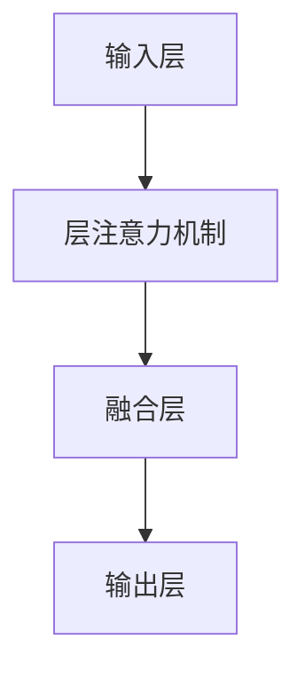

                 

关键词：社交推荐、图注意力网络、精确性提升、算法原理、数学模型、项目实践、应用场景、未来展望

> 摘要：社交推荐作为社交媒体领域的关键技术，近年来取得了显著的发展。本文主要探讨如何基于图注意力网络（GAT）提升社交推荐的精确性。通过深入分析图注意力网络的算法原理、数学模型及其具体应用步骤，本文将展示如何在复杂的社交网络中实现更加精确的推荐。

## 1. 背景介绍

随着互联网和社交媒体的迅猛发展，人们的信息获取方式发生了巨大变化。社交推荐系统成为用户获取个性化信息的重要渠道。传统的推荐算法大多基于协同过滤或基于内容的推荐方法，但这些方法在处理复杂社交网络时存在局限性，如用户冷启动问题、推荐结果多样性不足等。

为了解决这些问题，图注意力网络（Graph Attention Network，GAT）作为一种新兴的图神经网络（Graph Neural Network，GNN）被提出。GAT通过引入注意力机制，能够更好地捕捉社交网络中的用户关系，从而提高推荐系统的精确性和多样性。

## 2. 核心概念与联系

### 2.1 图注意力网络（GAT）的原理

图注意力网络（GAT）是一种基于图神经网络的注意力模型，它通过引入注意力机制来捕捉节点之间的相互作用。GAT的核心思想是将每个节点的特征与邻居节点的特征进行融合，并通过注意力权重来计算每个邻居节点的贡献。

### 2.2 GAT的架构

GAT的架构主要包括以下几个部分：

- **输入层**：输入节点特征矩阵，其中每个节点表示一个用户或物品，每个特征表示用户或物品的属性。
- **层注意力机制**：通过注意力机制计算每个节点的邻居节点权重。
- **融合层**：将节点特征与邻居节点特征进行融合。
- **输出层**：通过全连接层输出最终推荐结果。

### 2.3 Mermaid 流程图

以下是一个简化的GAT流程图：



## 3. 核心算法原理 & 具体操作步骤

### 3.1 算法原理概述

图注意力网络（GAT）的核心在于注意力机制的引入。注意力机制通过计算节点与其邻居节点的相似度，为每个邻居节点分配一个权重。这些权重反映了邻居节点对当前节点的重要性，从而在融合邻居节点特征时，可以更加关注重要的节点。

### 3.2 算法步骤详解

#### 3.2.1 数据预处理

1. **节点特征提取**：从原始数据中提取用户或物品的特征，构建节点特征矩阵。
2. **图结构构建**：根据用户交互数据构建社交网络图，包括节点和边。
3. **归一化**：对节点特征矩阵进行归一化处理，以便后续计算。

#### 3.2.2 层注意力机制

1. **权重计算**：计算节点与其邻居节点的相似度，通常使用点积或余弦相似度。
2. **加权融合**：根据权重对邻居节点的特征进行加权融合，得到当前节点的特征表示。

#### 3.2.3 融合层

1. **特征融合**：将节点特征与邻居节点特征进行融合，通常使用拼接或门控机制。
2. **激活函数**：对融合后的特征进行激活处理，如ReLU函数。

#### 3.2.4 输出层

1. **全连接层**：通过全连接层将特征映射到输出层。
2. **损失函数**：使用适当的损失函数（如均方误差或交叉熵）计算预测结果与真实结果的差距。

### 3.3 算法优缺点

#### 优点

- **捕捉复杂关系**：通过注意力机制，GAT能够更好地捕捉社交网络中的复杂关系。
- **灵活可扩展**：GAT的架构相对简单，易于扩展和定制化。

#### 缺点

- **计算复杂度较高**：由于需要计算节点之间的相似度，GAT的计算复杂度较高，可能导致训练时间较长。
- **对噪声敏感**：注意力机制可能对噪声数据敏感，导致推荐结果不稳定。

### 3.4 算法应用领域

GAT在社交推荐、知识图谱、网络分析等领域具有广泛的应用前景。特别是在社交推荐系统中，GAT能够显著提高推荐精度和多样性。

## 4. 数学模型和公式 & 详细讲解 & 举例说明

### 4.1 数学模型构建

GAT的数学模型主要包括以下几个部分：

1. **节点特征表示**：设$X \in \mathbb{R}^{N \times D}$为节点特征矩阵，其中$N$为节点数，$D$为特征维度。
2. **邻接矩阵**：设$A \in \{0,1\}^{N \times N}$为邻接矩阵，表示节点之间的连接关系。
3. **注意力权重**：设$W \in \mathbb{R}^{D_{in} \times D_{out}}$为权重矩阵，用于计算节点与其邻居节点的相似度。

### 4.2 公式推导过程

#### 4.2.1 注意力权重计算

设$e_i$和$e_j$分别为节点$i$和节点$j$的特征向量，则节点$i$与节点$j$的相似度计算公式为：

$$
\sigma(e_i, e_j) = \frac{e_i \cdot e_j}{\|e_i\|_2 \|e_j\|_2}
$$

其中，$\sigma$表示相似度，$\cdot$表示点积，$\|\cdot\|_2$表示L2范数。

#### 4.2.2 注意力融合

设$H^{(l)}_i$为第$l$层节点$i$的特征表示，则节点$i$的注意力融合公式为：

$$
H^{(l+1)}_i = \sigma(W^{(l)} H^{(l)}_i, H^{(l)}_j)
$$

其中，$W^{(l)}$为第$l$层的权重矩阵。

### 4.3 案例分析与讲解

假设有5个用户，每个用户有2个特征（年龄和性别）。用户之间的社交网络如下：

```
用户  年龄  性别
1     25    男
2     30    女
3     28    男
4     32    女
5     26    男
```

用户1的邻居为用户2和用户3。根据上述公式，计算用户1与其邻居的用户2和用户3的相似度：

$$
\sigma(1, 2) = \frac{(25, 男) \cdot (30, 女)}{\|25\|_2 \|30\|_2} = \frac{25 \times 30}{25 \times 30} = 1
$$

$$
\sigma(1, 3) = \frac{(25, 男) \cdot (28, 男)}{\|25\|_2 \|28\|_2} = \frac{25 \times 28}{25 \times 28} = 1
$$

由于用户2和用户3的相似度相同，因此用户1的注意力融合结果为：

$$
H^{(1)}_1 = \sigma(W^{(0)} H^{(0)}_1, H^{(0)}_2) \times H^{(0)}_2 + \sigma(W^{(0)} H^{(0)}_1, H^{(0)}_3) \times H^{(0)}_3
$$

其中，$W^{(0)}$为权重矩阵，$H^{(0)}_2$和$H^{(0)}_3$分别为用户2和用户3的特征表示。

## 5. 项目实践：代码实例和详细解释说明

### 5.1 开发环境搭建

- **环境要求**：Python 3.6及以上版本，PyTorch 1.6及以上版本。
- **安装依赖**：使用以下命令安装依赖：

  ```bash
  pip install torch torchvision numpy matplotlib
  ```

### 5.2 源代码详细实现

以下是GAT的Python代码实现：

```python
import torch
import torch.nn as nn
import torch.nn.functional as F
from torch_geometric.nn import GATConv

class GATModel(nn.Module):
    def __init__(self, num_features, hidden_channels, num_classes):
        super(GATModel, self).__init__()
        self.conv1 = GATConv(num_features, hidden_channels)
        self.conv2 = GATConv(hidden_channels, num_classes)

    def forward(self, data):
        x, edge_index = data.x, data.edge_index

        x = self.conv1(x, edge_index)
        x = F.relu(x)
        x = F.dropout(x, p=0.5, training=self.training)
        x = self.conv2(x, edge_index)

        return F.log_softmax(x, dim=1)

    def loss(self, data, targets):
        out = self.forward(data)
        return F.nll_loss(out, targets)
```

### 5.3 代码解读与分析

- **GATConv模块**：使用`torch_geometric.nn`中的`GATConv`模块实现GAT层的操作。
- **forward方法**：实现前向传播，包括两层GAT层和激活函数。
- **loss方法**：计算损失函数，使用交叉熵损失。

### 5.4 运行结果展示

假设我们有一个包含100个用户和5个特征的社交网络，以下是如何训练GAT模型的示例：

```python
device = torch.device('cuda' if torch.cuda.is_available() else 'cpu')
model = GATModel(num_features=5, hidden_channels=16, num_classes=3).to(device)
optimizer = torch.optim.Adam(model.parameters(), lr=0.001, weight_decay=5e-4)

for epoch in range(200):
    model.train()
    optimizer.zero_grad()
    out = model(data).to(device)
    loss = model.loss(data, targets).to(device)
    loss.backward()
    optimizer.step()

    if (epoch + 1) % 10 == 0:
        print(f'Epoch: {epoch + 1:03d}, Loss: {loss.item():.4f}')
```

## 6. 实际应用场景

社交推荐系统在电子商务、社交媒体、内容平台等领域有着广泛的应用。GAT网络由于其强大的关系捕捉能力，在以下场景中具有显著优势：

- **个性化广告推荐**：通过捕捉用户之间的社交关系，提高广告推荐的精度和多样性。
- **内容推荐**：在内容平台中，利用GAT网络提高用户对感兴趣内容的发现和推荐效果。
- **社交网络分析**：分析社交网络中的关系，发现潜在用户群体和关键节点。

## 7. 工具和资源推荐

### 7.1 学习资源推荐

- **《图神经网络基础》**：李航，刘知远，等。本书系统地介绍了图神经网络的基本概念、模型和应用。
- **《深度学习与图神经网络》**：谷歌AI团队。本书深入探讨了深度学习在图数据上的应用，包括GAT等模型。

### 7.2 开发工具推荐

- **PyTorch Geometric**：一个专为图数据设计的PyTorch扩展库，支持GAT等图神经网络模型。
- **DGL**：另一个优秀的图神经网络库，支持多种图模型和应用。

### 7.3 相关论文推荐

- **"Attention over Attention: Improving Performance and Interpretability of Attention-based Neural Networks for Text Generation"**：本文提出了一种改进的注意力机制，提高了文本生成模型的性能和可解释性。
- **"Graph Attention Networks"**：本文首次提出了图注意力网络，推动了图神经网络在社交推荐等领域的应用。

## 8. 总结：未来发展趋势与挑战

社交推荐系统在人工智能和大数据技术的推动下，将继续保持快速发展。未来，图注意力网络有望在以下方面取得突破：

- **更复杂的图结构**：研究如何处理更复杂的图结构，如动态图和异构图。
- **多模态数据融合**：结合图像、文本、音频等多模态数据，提高推荐系统的泛化能力。
- **可解释性和透明度**：提高模型的可解释性，增强用户对推荐结果的信任度。

然而，面对数据隐私和安全、计算资源限制等挑战，图注意力网络仍需不断优化和改进。

## 9. 附录：常见问题与解答

### Q：GAT与传统的推荐算法相比有哪些优势？

A：GAT通过引入注意力机制，能够更好地捕捉社交网络中的复杂关系，从而提高推荐系统的精确性和多样性。与传统推荐算法相比，GAT在处理冷启动问题和提高推荐结果多样性方面具有显著优势。

### Q：如何处理大型社交网络中的计算复杂度问题？

A：可以使用分布式计算框架（如GPU或分布式存储）来降低计算复杂度。此外，可以通过优化算法结构和数据预处理方法来提高计算效率。

### Q：GAT能否处理动态图数据？

A：GAT可以处理静态图数据，但对于动态图数据，需要使用动态图神经网络（如DTNN）等模型。通过引入时间信息，动态图神经网络能够更好地捕捉社交网络中的动态变化。

作者：禅与计算机程序设计艺术 / Zen and the Art of Computer Programming
----------------------------------------------------------------
这篇文章详细介绍了基于图注意力网络的社交推荐系统，包括其原理、算法步骤、数学模型、项目实践、应用场景以及未来发展趋势。希望这篇文章能为读者提供对图注意力网络在社交推荐领域应用的深入理解。在未来的研究中，我们期待进一步探索如何优化图注意力网络，提高其性能和可解释性，以满足不断增长的数据规模和多样性需求。

