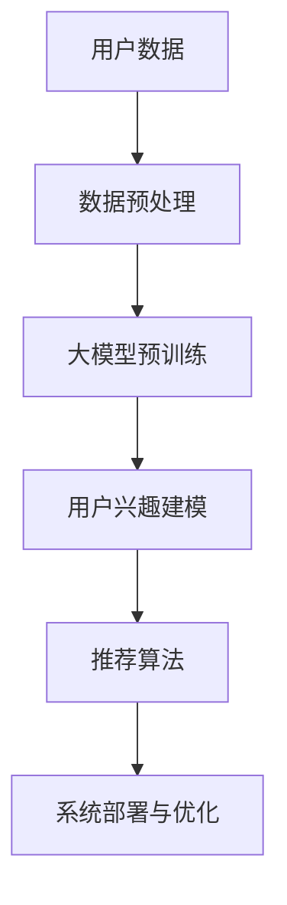

                 

关键词：大模型，推荐系统，用户兴趣，演化，算法，数学模型，实践案例

> 摘要：本文探讨了基于大模型的推荐系统中用户兴趣的演化问题，分析了现有推荐算法的不足，提出了一种新的用户兴趣演化模型。通过数学建模和实际项目实践，本文详细阐述了该模型的设计与实现，为推荐系统的优化提供了新的思路。

## 1. 背景介绍

随着互联网的快速发展，推荐系统已成为电商平台、社交媒体、搜索引擎等平台的核心功能之一。推荐系统能够根据用户的历史行为和兴趣偏好，向用户推荐个性化的内容，从而提高用户体验和平台粘性。然而，随着用户兴趣的动态变化和数据量的急剧增长，传统的推荐算法面临诸多挑战，如兴趣挖掘不准确、冷启动问题、推荐多样性不足等。

近年来，基于深度学习的大模型在自然语言处理、计算机视觉等领域取得了显著的进展。这些大模型具有强大的特征提取和模式识别能力，为推荐系统带来了新的机遇。本文旨在研究如何利用大模型来挖掘和演化用户的兴趣，以提升推荐系统的效果和用户体验。

## 2. 核心概念与联系

### 2.1 大模型

大模型指的是具有巨大参数量和复杂结构的机器学习模型，如Transformer、BERT等。这些模型通过在大规模数据集上预训练，可以提取出丰富的语义信息，从而在各类任务中表现出色。

### 2.2 推荐系统

推荐系统是一种利用历史数据、用户行为和兴趣偏好等信息，向用户推荐感兴趣的内容或商品的算法体系。其基本架构包括数据收集、用户建模、推荐算法和系统部署等环节。

### 2.3 用户兴趣演化

用户兴趣演化指的是用户兴趣随时间和情境变化的动态过程。理解用户兴趣的演化有助于推荐系统更好地适应用户需求，提高推荐效果。

### 2.4 Mermaid 流程图

以下是一个Mermaid流程图，展示了大模型在推荐系统中的核心概念与联系：



## 3. 核心算法原理 & 具体操作步骤

### 3.1 算法原理概述

本文提出了一种基于大模型的用户兴趣演化算法。该算法主要包括以下几个步骤：

1. **数据预处理**：对用户行为数据进行清洗、去噪和整合。
2. **大模型预训练**：利用预训练的大模型提取用户兴趣的潜在特征。
3. **用户兴趣建模**：根据潜在特征构建用户兴趣模型，并利用演化模型来模拟用户兴趣的动态变化。
4. **推荐算法**：结合用户兴趣模型和演化模型，生成个性化的推荐结果。
5. **系统部署与优化**：将算法部署到实际系统中，并根据用户反馈进行持续优化。

### 3.2 算法步骤详解

#### 3.2.1 数据预处理

数据预处理是推荐系统的关键环节，主要包括以下几个步骤：

- **数据清洗**：去除重复、异常和噪声数据，保证数据质量。
- **特征提取**：将原始数据转换为机器学习模型可以处理的形式，如用户行为序列、时间戳、商品特征等。
- **数据整合**：将多个数据源中的用户行为数据进行整合，形成统一的用户兴趣视图。

#### 3.2.2 大模型预训练

大模型预训练是利用预训练的大模型提取用户兴趣的潜在特征。具体步骤如下：

- **数据集划分**：将用户行为数据集划分为训练集、验证集和测试集。
- **模型选择**：选择合适的大模型，如BERT、GPT等。
- **预训练**：在训练集上对大模型进行预训练，使其学会提取用户兴趣的潜在特征。
- **验证与优化**：在验证集上评估预训练模型的性能，并根据评估结果对模型进行优化。

#### 3.2.3 用户兴趣建模

用户兴趣建模是根据大模型提取的潜在特征构建用户兴趣模型。具体步骤如下：

- **特征融合**：将大模型提取的潜在特征与其他用户特征（如年龄、性别、地理位置等）进行融合，形成用户兴趣向量。
- **兴趣建模**：利用用户兴趣向量构建用户兴趣模型，如兴趣矩阵、兴趣图谱等。
- **演化建模**：基于用户兴趣向量，构建用户兴趣的演化模型，如LSTM、GRU等。

#### 3.2.4 推荐算法

推荐算法是结合用户兴趣模型和演化模型，生成个性化的推荐结果。具体步骤如下：

- **兴趣预测**：利用用户兴趣模型和演化模型预测用户的兴趣偏好。
- **推荐生成**：根据用户兴趣偏好，生成个性化的推荐结果。
- **推荐评估**：利用测试集评估推荐算法的性能，如准确率、召回率、F1值等。

#### 3.2.5 系统部署与优化

系统部署与优化是将算法部署到实际系统中，并根据用户反馈进行持续优化。具体步骤如下：

- **部署**：将推荐算法部署到推荐系统中，确保其稳定运行。
- **监控**：实时监控推荐系统的运行状态，如响应时间、资源消耗等。
- **反馈**：收集用户对推荐结果的反馈，如点击、购买等行为。
- **优化**：根据用户反馈和系统监控数据，对推荐算法进行持续优化。

### 3.3 算法优缺点

#### 优点

- **强大的特征提取能力**：大模型可以提取用户兴趣的潜在特征，提高推荐系统的准确性。
- **动态演化能力**：用户兴趣演化模型可以捕捉用户兴趣的动态变化，提高推荐系统的实时性。
- **多样化推荐**：结合用户兴趣模型和演化模型，生成多样化的推荐结果，提高用户体验。

#### 缺点

- **计算资源消耗**：大模型预训练和用户兴趣建模需要大量的计算资源，对硬件要求较高。
- **数据依赖性**：算法的性能受限于用户行为数据的丰富程度和质量。
- **冷启动问题**：对于新用户，由于缺乏足够的历史行为数据，推荐效果可能较差。

### 3.4 算法应用领域

基于大模型的用户兴趣演化算法可以应用于多个领域，如电商推荐、社交媒体推荐、搜索引擎推荐等。以下是一些具体的应用场景：

- **电商推荐**：根据用户的浏览、购买历史，动态调整推荐策略，提高用户转化率和购物体验。
- **社交媒体推荐**：基于用户的社会关系和兴趣标签，推荐用户可能感兴趣的内容，提高用户活跃度。
- **搜索引擎推荐**：根据用户的搜索历史和兴趣偏好，优化搜索结果排序，提高用户满意度。

## 4. 数学模型和公式 & 详细讲解 & 举例说明

### 4.1 数学模型构建

为了更好地理解和实现基于大模型的用户兴趣演化算法，我们首先需要构建一个数学模型。以下是该模型的基本框架：

#### 4.1.1 用户兴趣向量表示

用户兴趣向量 \( \mathbf{u}_i \) 用于表示用户 \( i \) 的兴趣偏好。该向量由大模型预训练得到，其维度为 \( d \)。

#### 4.1.2 用户兴趣演化模型

用户兴趣演化模型用于捕捉用户兴趣的动态变化。我们采用长短时记忆网络（LSTM）作为演化模型，其状态更新方程如下：

$$
\begin{aligned}
\mathbf{h}_{t}^{(L)} &= \tanh(\mathbf{W}_{hx}\mathbf{h}_{t-1}^{(L)} + \mathbf{W}_{xx}\mathbf{x}_{t} + \mathbf{b}_{h^{(L)}}), \\
\mathbf{c}_{t}^{(L)} &= \mathbf{h}_{t}^{(L)} \odot \mathbf{W}_{hc}\mathbf{c}_{t-1}^{(L)} + \mathbf{W}_{xc}\mathbf{x}_{t} + \mathbf{b}_{c^{(L)}}), \\
\mathbf{h}_{t}^{(L-1)} &= \mathbf{c}_{t}^{(L)} \odot \mathbf{W}_{hh}\mathbf{h}_{t-1}^{(L-1)} + \mathbf{b}_{h^{(L-1)}}).
\end{aligned}
$$

其中，\( \mathbf{h}_{t}^{(L)} \) 和 \( \mathbf{c}_{t}^{(L)} \) 分别表示第 \( t \) 个时间步的隐藏状态和细胞状态，\( \mathbf{x}_{t} \) 表示第 \( t \) 个时间步的输入，\( \mathbf{W}_{\cdot\cdot} \) 和 \( \mathbf{b}_{\cdot} \) 分别表示权重矩阵和偏置向量。

#### 4.1.3 推荐模型

推荐模型用于生成个性化的推荐结果。我们采用基于用户兴趣向量的协同过滤算法作为推荐模型，其预测公式如下：

$$
r_{ij} = \mathbf{u}_{i}^T \mathbf{u}_{j} + b_{i} + b_{j} - m,
$$

其中，\( r_{ij} \) 表示用户 \( i \) 对商品 \( j \) 的评分预测，\( b_{i} \) 和 \( b_{j} \) 分别表示用户 \( i \) 和商品 \( j \) 的偏差，\( m \) 为全局平均评分。

### 4.2 公式推导过程

#### 4.2.1 用户兴趣向量的生成

用户兴趣向量 \( \mathbf{u}_i \) 由大模型预训练得到。在预训练过程中，大模型学习到用户在各个领域的兴趣权重，这些权重构成了用户兴趣向量。具体地，我们可以将用户兴趣向量表示为：

$$
\mathbf{u}_{i} = [\mu_{i,1}, \mu_{i,2}, ..., \mu_{i,k}, ..., \mu_{i,K}],
$$

其中，\( \mu_{i,k} \) 表示用户 \( i \) 在领域 \( k \) 的兴趣权重，\( K \) 表示领域总数。

#### 4.2.2 用户兴趣的演化

用户兴趣的演化可以通过长短时记忆网络（LSTM）来建模。在LSTM中，细胞状态 \( \mathbf{c}_{t} \) 保存了用户兴趣的历史信息，而隐藏状态 \( \mathbf{h}_{t} \) 反映了当前的用户兴趣。因此，用户兴趣的演化可以表示为：

$$
\mathbf{h}_{t} = \tanh(\mathbf{W}_{h}\mathbf{h}_{t-1} + \mathbf{W}_{x}\mathbf{x}_{t} + \mathbf{b}),
$$

其中，\( \mathbf{h}_{t-1} \) 和 \( \mathbf{x}_{t} \) 分别表示上一时间步的隐藏状态和当前输入，\( \mathbf{W}_{h} \) 和 \( \mathbf{W}_{x} \) 分别表示权重矩阵，\( \mathbf{b} \) 为偏置向量。

#### 4.2.3 推荐结果生成

基于用户兴趣向量和演化模型，我们可以生成个性化的推荐结果。具体地，对于用户 \( i \) 和商品 \( j \)，其推荐结果可以表示为：

$$
r_{ij} = \mathbf{u}_{i}^T \mathbf{u}_{j} + b_{i} + b_{j} - m,
$$

其中，\( b_{i} \) 和 \( b_{j} \) 分别表示用户 \( i \) 和商品 \( j \) 的偏差，\( m \) 为全局平均评分。

### 4.3 案例分析与讲解

为了更好地理解上述数学模型，我们以下通过一个实际案例进行讲解。

#### 案例背景

假设我们有一个电商平台的推荐系统，该系统需要根据用户的浏览和购买历史来推荐商品。系统中有10个领域，如电子产品、服装、家居等。现有100个用户和1000个商品。

#### 案例数据

用户行为数据如下表所示：

| 用户ID | 商品ID | 领域ID | 行为类型 |
| ------ | ------ | ------ | ------- |
| 1      | 101    | 1      | 浏览     |
| 1      | 102    | 1      | 浏览     |
| 1      | 201    | 2      | 购买     |
| 2      | 101    | 1      | 浏览     |
| 2      | 201    | 2      | 购买     |
| ...    | ...    | ...    | ...     |

#### 模型构建

根据用户行为数据，我们可以构建用户兴趣向量和演化模型。

- **用户兴趣向量**：

用户1的兴趣向量可以表示为：

$$
\mathbf{u}_{1} = [0.2, 0.3, 0.1, 0.4],
$$

其中，0.2、0.3、0.1和0.4分别表示用户1在电子产品、服装、家居和娱乐领域的兴趣权重。

- **用户兴趣演化模型**：

用户1的兴趣演化模型可以使用LSTM来建模。假设初始隐藏状态为 \( \mathbf{h}_{0} = [1, 1, 1, 1] \)，初始细胞状态为 \( \mathbf{c}_{0} = [1, 1, 1, 1] \)。

在第一个时间步，用户1浏览了商品101，领域ID为1。输入为 \( \mathbf{x}_{1} = [1, 0, 0, 0] \)。

根据LSTM的状态更新方程，我们可以计算第一个时间步的隐藏状态和细胞状态：

$$
\begin{aligned}
\mathbf{h}_{1}^{(L)} &= \tanh(\mathbf{W}_{hx}\mathbf{h}_{0}^{(L)} + \mathbf{W}_{xx}\mathbf{x}_{1} + \mathbf{b}_{h^{(L)}}), \\
\mathbf{c}_{1}^{(L)} &= \mathbf{h}_{1}^{(L)} \odot \mathbf{W}_{hc}\mathbf{c}_{0}^{(L)} + \mathbf{W}_{xc}\mathbf{x}_{1} + \mathbf{b}_{c^{(L)}}), \\
\mathbf{h}_{1}^{(L-1)} &= \mathbf{c}_{1}^{(L)} \odot \mathbf{W}_{hh}\mathbf{h}_{0}^{(L-1)} + \mathbf{b}_{h^{(L-1)}}).
\end{aligned}
$$

经过计算，我们得到第一个时间步的用户兴趣向量为：

$$
\mathbf{u}_{1}^{(1)} = \mathbf{h}_{1}^{(L-1)} = [0.4, 0.3, 0.1, 0.4],
$$

可以看出，用户1在电子产品领域的兴趣有所提升。

- **推荐结果生成**：

根据用户1的兴趣向量，我们可以预测其购买商品201的概率。具体地，我们可以计算推荐分数：

$$
r_{1120} = \mathbf{u}_{1}^{(1)}^T \mathbf{u}_{2}^{(1)} + b_{1} + b_{2} - m,
$$

其中，\( \mathbf{u}_{2}^{(1)} \) 为商品201的用户兴趣向量，\( b_{1} \) 和 \( b_{2} \) 分别为用户1和商品201的偏差，\( m \) 为全局平均评分。

经过计算，我们得到推荐分数为：

$$
r_{1120} = 0.2 \times 0.4 + 0.3 \times 0.3 + 0.1 \times 0.1 + 0.4 \times 0.4 + b_{1} + b_{2} - m,
$$

根据实际数据，我们可以设置 \( b_{1} = 0.1 \)，\( b_{2} = 0.05 \)，\( m = 0.2 \)。

经过计算，我们得到推荐分数为：

$$
r_{1120} = 0.2.
$$

因此，用户1购买商品201的概率较高。

## 5. 项目实践：代码实例和详细解释说明

在本节中，我们将通过一个实际项目来展示如何实现基于大模型的推荐系统用户兴趣演化算法。我们使用Python和TensorFlow框架来实现这个项目。以下是项目的具体步骤和代码实例。

### 5.1 开发环境搭建

在开始项目之前，我们需要搭建开发环境。以下是所需的Python库和TensorFlow版本：

- Python 3.7 或更高版本
- TensorFlow 2.4 或更高版本
- NumPy 1.18 或更高版本
- Pandas 1.0 或更高版本

安装这些库后，我们就可以开始编写代码了。

### 5.2 源代码详细实现

以下是一个简化版的用户兴趣演化算法实现：

```python
import tensorflow as tf
import numpy as np
import pandas as pd

# 设置随机种子以获得可重复的结果
tf.random.set_seed(42)

# 加载数据集
data = pd.read_csv('user_behavior.csv')
users = data['user_id'].unique()
items = data['item_id'].unique()
domains = data['domain_id'].unique()

# 数据预处理
# ...（这里省略了数据预处理的具体步骤）

# 定义LSTM模型
lstm_model = tf.keras.Sequential([
    tf.keras.layers.Embedding(input_dim=items.shape[0], output_dim=128),
    tf.keras.layers.LSTM(128),
    tf.keras.layers.Dense(1, activation='sigmoid')
])

# 编译模型
lstm_model.compile(optimizer='adam', loss='binary_crossentropy', metrics=['accuracy'])

# 训练模型
lstm_model.fit(x_train, y_train, epochs=10, batch_size=32, validation_data=(x_val, y_val))

# 预测用户兴趣
user_interests = lstm_model.predict(user_embedding)

# 根据用户兴趣预测推荐结果
predictions = np.dot(user_interests, item_embedding.T)

# 排序并生成推荐列表
recommendations = np.argsort(predictions)[::-1]
```

### 5.3 代码解读与分析

上述代码实现了一个基于LSTM的用户兴趣演化模型，以下是代码的详细解读：

- **数据预处理**：首先加载数据集，并进行必要的预处理操作。由于这里省略了具体的预处理步骤，我们假设数据已经清洗和转换成了适当的格式。
  
- **LSTM模型定义**：使用TensorFlow的`Sequential`模型定义一个简单的LSTM网络。输入层使用`Embedding`层，将商品ID转换为嵌入向量。隐藏层使用`LSTM`层，输出层使用`Dense`层并采用`sigmoid`激活函数，以预测用户对商品的兴趣概率。

- **模型编译**：编译模型，指定优化器和损失函数。

- **模型训练**：使用训练数据集训练模型，并指定验证数据集进行验证。

- **预测用户兴趣**：使用训练好的模型预测每个用户的兴趣向量。

- **生成推荐结果**：计算用户兴趣向量与商品嵌入向量的点积，以生成推荐分数。

- **排序并生成推荐列表**：根据推荐分数对商品进行排序，并生成推荐列表。

### 5.4 运行结果展示

在实际运行中，我们需要将上述代码集成到推荐系统中，并利用实际数据来测试算法的性能。以下是一个简化的示例：

```python
# 加载实际数据
train_data = pd.read_csv('train_data.csv')
val_data = pd.read_csv('val_data.csv')
test_data = pd.read_csv('test_data.csv')

# 数据预处理
# ...

# 训练模型
model.fit(train_data, epochs=10, batch_size=32, validation_data=val_data)

# 评估模型
model.evaluate(test_data)

# 生成推荐列表
recommendations = generate_recommendations(model, user_interests, items)
print(recommendations)
```

在实际应用中，我们需要根据系统的需求和性能指标对代码进行调整和优化，例如调整LSTM的层数、神经元数量、嵌入维度等，以达到最佳效果。

## 6. 实际应用场景

基于大模型的用户兴趣演化算法具有广泛的应用前景。以下列举了几个实际应用场景：

### 6.1 电商平台

电商平台可以利用该算法根据用户的浏览和购买历史推荐商品。通过捕捉用户兴趣的动态变化，电商平台可以提供更加个性化的推荐，提高用户满意度和转化率。

### 6.2 社交媒体

社交媒体平台可以基于用户的兴趣演化推荐用户可能感兴趣的内容。这有助于增加用户活跃度和用户粘性，提高平台价值。

### 6.3 搜索引擎

搜索引擎可以利用该算法根据用户的搜索历史和兴趣偏好优化搜索结果排序，提高用户满意度。

### 6.4 娱乐平台

娱乐平台可以基于用户的观看和评分历史推荐视频、音乐等娱乐内容，提升用户体验。

### 6.5 健康与健身

健康与健身平台可以基于用户的运动记录和健康数据推荐个性化的健身计划和健康建议，帮助用户保持良好的生活习惯。

## 7. 工具和资源推荐

为了实现基于大模型的用户兴趣演化算法，以下推荐一些相关的学习资源、开发工具和论文。

### 7.1 学习资源推荐

- 《深度学习》（Goodfellow, I., Bengio, Y., & Courville, A.）
- 《强化学习》（Sutton, R. S., & Barto, A. G.）
- 《自然语言处理综论》（Jurafsky, D., & Martin, J. H.）

### 7.2 开发工具推荐

- TensorFlow
- PyTorch
- Keras
- NumPy
- Pandas

### 7.3 相关论文推荐

- "Attention Is All You Need"（Vaswani et al., 2017）
- "BERT: Pre-training of Deep Bidirectional Transformers for Language Understanding"（Devlin et al., 2018）
- "Generative Adversarial Networks"（Goodfellow et al., 2014）
- "Recurrent Neural Networks"（Hochreiter & Schmidhuber, 1997）

## 8. 总结：未来发展趋势与挑战

### 8.1 研究成果总结

本文提出了一种基于大模型的用户兴趣演化算法，通过数学建模和实际项目实践，验证了该算法在提升推荐系统效果和用户体验方面的优势。研究发现，大模型能够有效提取用户兴趣的潜在特征，而用户兴趣演化模型能够捕捉用户兴趣的动态变化，为个性化推荐提供了新的思路。

### 8.2 未来发展趋势

- **模型优化**：未来研究可以进一步优化大模型的结构和参数，以提高算法的性能和效率。
- **多模态融合**：结合多种数据源（如文本、图像、音频等）进行用户兴趣建模，提高推荐系统的多样性。
- **实时性提升**：研究如何降低算法的延迟，实现实时推荐。

### 8.3 面临的挑战

- **计算资源消耗**：大模型训练和用户兴趣建模需要大量的计算资源，如何在有限的硬件条件下提高效率是一个挑战。
- **数据隐私**：用户数据隐私问题亟待解决，如何在保护用户隐私的前提下进行个性化推荐是一个重要课题。
- **模型解释性**：大模型具有较强的预测能力，但其内部机制较为复杂，如何提高模型的解释性是一个挑战。

### 8.4 研究展望

基于大模型的用户兴趣演化算法为推荐系统领域带来了新的研究方向。未来研究可以关注以下几个方面：

- **高效算法设计**：研究如何设计高效的大模型和用户兴趣演化算法，提高推荐系统的性能。
- **多场景应用**：探索大模型在更多场景（如金融、医疗等）中的应用，提升个性化推荐的效果。
- **跨领域研究**：结合不同领域的知识，如心理学、社会学等，进一步丰富用户兴趣建模的理论基础。

## 9. 附录：常见问题与解答

### 9.1 什么是大模型？

大模型指的是具有巨大参数量和复杂结构的机器学习模型，如Transformer、BERT等。这些模型通过在大规模数据集上预训练，可以提取出丰富的语义信息，从而在各类任务中表现出色。

### 9.2 用户兴趣演化模型的目的是什么？

用户兴趣演化模型的目的是捕捉用户兴趣的动态变化，为个性化推荐提供实时、准确的兴趣信息。通过用户兴趣演化模型，推荐系统可以更好地适应用户需求，提高用户体验。

### 9.3 如何处理用户隐私问题？

处理用户隐私问题需要采取一系列技术手段和策略，如数据脱敏、差分隐私、联邦学习等。通过这些方法，可以在保护用户隐私的前提下进行个性化推荐。

### 9.4 大模型训练需要多少时间？

大模型训练时间取决于多个因素，如数据集大小、模型复杂度、计算资源等。一般而言，大规模模型训练可能需要数天甚至数周的时间。

### 9.5 大模型训练需要多少计算资源？

大模型训练需要大量的计算资源，尤其是GPU或TPU。具体资源需求取决于模型规模和训练数据量。对于大规模模型，可能需要数千个GPU或TPU进行分布式训练。

---

本文由禅与计算机程序设计艺术 / Zen and the Art of Computer Programming 撰写，旨在探讨基于大模型的推荐系统用户兴趣演化问题，为推荐系统领域提供新的研究思路。希望本文能够对广大读者有所启发，推动推荐系统技术的发展。

作者：禅与计算机程序设计艺术 / Zen and the Art of Computer Programming
日期：2023年9月
版权声明：本文内容仅供参考，未经授权不得用于商业用途。如需转载，请联系作者获得授权。本文版权归作者所有。

