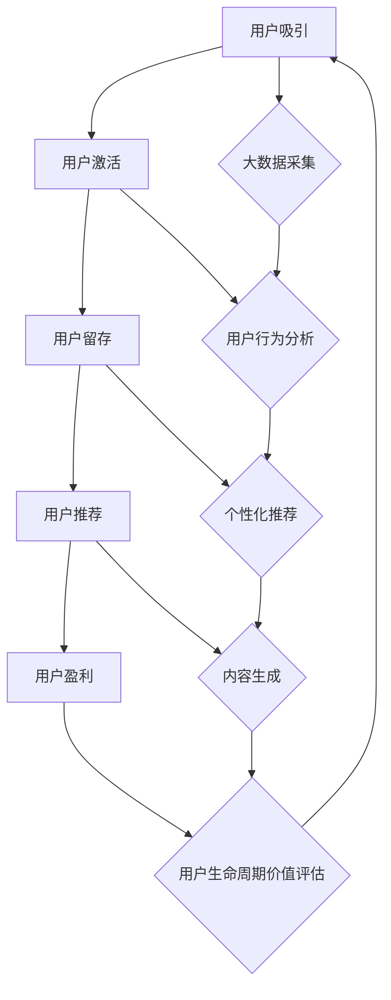

                 

关键词：大模型，推荐系统，用户生命周期，价值最大化，机器学习，深度学习，数据挖掘，算法优化，用户行为分析。

## 摘要

本文主要探讨了如何通过构建和优化基于大模型的推荐系统，实现用户生命周期价值（Customer Lifetime Value, CLV）的最大化。首先，我们介绍了推荐系统的基本概念和其在商业领域的重要性。接着，我们深入分析了用户生命周期的各个阶段，并讨论了如何利用大数据和机器学习技术来提升用户在各个阶段的体验和价值。文章重点介绍了大模型在推荐系统中的应用，包括其原理、算法和实现步骤。随后，我们通过数学模型和公式详细阐述了如何计算和优化用户生命周期价值。最后，我们提供了一个完整的代码实例，展示了如何在实际项目中实现这些算法。通过本文，读者将能够理解如何将大模型技术应用于推荐系统，以实现用户生命周期价值的最大化。

## 1. 背景介绍

在当今的数字化时代，数据已经成为企业最重要的资产之一。大数据技术的迅速发展，使得企业能够从海量的数据中挖掘出有价值的信息，进而提高业务效率和用户满意度。推荐系统正是这一背景下的产物，通过分析用户的行为和偏好，为用户提供个性化的推荐服务，从而提升用户满意度和转化率。

推荐系统已经成为许多互联网公司的核心功能之一，如电商平台的商品推荐、社交媒体的内容推荐、音乐和视频平台的歌曲和视频推荐等。其背后的技术核心是机器学习和深度学习算法，这些算法能够从大量的数据中学习到用户的偏好模式，并据此生成个性化的推荐。

用户生命周期（Customer Life Cycle）是指用户与产品或服务之间互动的整个过程，通常包括吸引（Acquisition）、激活（Activation）、留存（Retention）、推荐（Recommendation）和盈利（Revenue）等阶段。每个阶段都对用户生命周期的总体价值有着重要的影响。如何通过技术手段提升用户在各个阶段的体验和价值，已经成为企业关注的重点。

本文的目标是探讨如何利用大模型技术，优化推荐系统，从而实现用户生命周期价值（Customer Lifetime Value, CLV）的最大化。我们将在接下来的内容中详细讨论大模型的原理、算法、数学模型，并通过实例代码展示如何将这些技术应用于实际项目。

## 2. 核心概念与联系

### 2.1 推荐系统

推荐系统是一种基于用户历史行为和偏好信息的个性化推荐技术，旨在为用户提供符合其兴趣和需求的内容或商品。推荐系统通常包括以下几个关键组成部分：

- **用户数据采集**：通过用户的浏览记录、搜索历史、购买行为、社交互动等多维度数据来收集用户信息。

- **用户行为分析**：使用机器学习和深度学习算法对用户行为进行分析，以识别用户的兴趣偏好。

- **推荐算法**：根据用户行为数据和偏好模型，生成个性化的推荐结果。

- **推荐结果展示**：将推荐结果以合适的形式呈现给用户，如推荐列表、热销商品、内容推荐等。

### 2.2 用户生命周期

用户生命周期是指用户与产品或服务之间的互动过程，包括以下几个阶段：

- **吸引（Acquisition）**：通过广告、社交媒体、口碑等手段吸引新用户。

- **激活（Activation）**：确保新用户首次使用产品或服务，并通过引导和培训使其开始产生价值。

- **留存（Retention）**：通过持续的用户互动和高质量的服务保持用户的活跃度。

- **推荐（Recommendation）**：利用个性化推荐系统提升用户的参与度和满意度。

- **盈利（Revenue）**：通过用户的长期使用和推荐，实现业务收益的最大化。

### 2.3 大模型

大模型，通常指那些拥有巨大参数量和复杂结构的机器学习模型，如深度神经网络（DNN）、变分自编码器（VAE）、图神经网络（GNN）等。大模型的特点是能够处理大规模的数据集，并在许多复杂数据分析任务中表现出色。

- **深度神经网络（DNN）**：通过多层的神经网络结构，能够对非线性关系进行建模，广泛应用于图像识别、自然语言处理等领域。

- **变分自编码器（VAE）**：用于生成数据的高效模型，能够生成具有较高保真度的数据，常用于数据增强和图像生成。

- **图神经网络（GNN）**：专门用于处理图结构数据，能够捕捉节点和边之间的复杂关系。

### 2.4 大模型在推荐系统中的应用

大模型在推荐系统中的应用主要体现在以下几个方面：

- **用户行为预测**：利用深度学习算法对用户行为进行预测，以预测用户的下一步动作，如购买、点击等。

- **个性化推荐**：通过分析用户的兴趣和行为，生成个性化的推荐结果，提高用户的满意度和参与度。

- **内容生成**：利用生成模型如VAE，生成与用户兴趣相关的新内容，以丰富推荐系统的多样性。

- **图神经网络**：通过构建用户交互的图结构，利用图神经网络分析用户之间的社交关系，生成更精准的推荐。

### 2.5 Mermaid 流程图

以下是一个用于描述推荐系统用户生命周期价值最大化过程的Mermaid流程图：



在这个流程图中，每个节点都代表了用户生命周期的某一阶段，而箭头则表示用户在不同阶段之间的转移。同时，节点F、G、H、I和J则代表了利用大数据和机器学习技术来提升用户在每个阶段的体验和价值的过程。

## 3. 核心算法原理 & 具体操作步骤

### 3.1 算法原理概述

在推荐系统中，核心算法的设计目标是基于用户的历史行为和偏好，生成个性化的推荐结果。近年来，随着深度学习技术的快速发展，基于深度学习的推荐算法逐渐成为研究的热点。深度学习算法能够在大量数据上进行端到端的学习，自动提取复杂的特征，从而提高推荐系统的准确性和效果。

本节将介绍一种基于深度神经网络的推荐算法——基于注意力机制的协同过滤算法（Attention-based Collaborative Filtering, ACF）。ACF算法通过引入注意力机制，能够更好地捕捉用户和项目之间的关联性，从而生成更精准的推荐。

### 3.2 算法步骤详解

#### 步骤1：数据预处理

- **用户行为数据**：收集用户在系统中的行为数据，如点击、浏览、购买等。
- **项目特征数据**：收集项目相关的特征数据，如项目类别、标签、评分等。
- **数据清洗**：对收集到的数据进行清洗，去除缺失值和异常值。

#### 步骤2：构建用户和项目嵌入空间

- **用户嵌入**：将用户转化为低维度的向量表示，通过神经网络训练自动提取用户特征。
- **项目嵌入**：将项目转化为低维度的向量表示，通过神经网络训练自动提取项目特征。

#### 步骤3：引入注意力机制

- **注意力模型**：构建一个注意力模型，用于计算用户和项目之间的关联权重。
- **计算注意力权重**：通过注意力模型计算用户对每个项目的关注程度。

#### 步骤4：生成推荐结果

- **计算推荐得分**：将用户嵌入向量和项目嵌入向量相乘，结合注意力权重，计算每个项目的推荐得分。
- **生成推荐列表**：根据推荐得分，生成个性化的推荐列表。

### 3.3 算法优缺点

#### 优点

- **高准确性**：通过深度神经网络自动提取用户和项目的特征，能够生成更精准的推荐结果。
- **灵活性**：注意力机制使得模型能够自适应地调整对用户和项目的关注程度，提高推荐的灵活性。

#### 缺点

- **计算成本高**：深度神经网络训练和推理过程需要大量的计算资源，尤其是当数据集和模型规模较大时。
- **数据依赖性**：模型的性能高度依赖于数据质量，若数据存在噪声或缺失，可能会导致推荐结果不准确。

### 3.4 算法应用领域

ACF算法主要应用于需要个性化推荐的场景，如电商平台的商品推荐、社交媒体的内容推荐、音乐和视频平台的歌曲和视频推荐等。通过ACF算法，这些平台能够为用户提供更加个性化的体验，从而提高用户满意度和转化率。

## 4. 数学模型和公式 & 详细讲解 & 举例说明

### 4.1 数学模型构建

在推荐系统中，用户生命周期价值（Customer Lifetime Value, CLV）的计算是一个重要的环节。CLV反映了用户在整个生命周期内为产品或服务带来的总价值。以下是构建CLV数学模型的基本思路：

#### 4.1.1 用户行为模型

用户行为模型用于描述用户在不同阶段的交互行为，通常使用概率模型来表示。假设用户 \( u \) 在某个时间点 \( t \) 的行为 \( y \) 取值为 \( \{0, 1\} \)，其中0表示未发生行为，1表示发生了行为。则用户行为模型可以表示为：

\[ P(y=1 | u, t) = \sigma(\theta_u^T \phi(t)) \]

其中，\( \sigma \) 是 sigmoid 函数，\( \theta_u \) 是用户 \( u \) 的特征向量，\( \phi(t) \) 是时间点 \( t \) 的特征向量。

#### 4.1.2 用户生命周期价值模型

用户生命周期价值模型用于计算用户在整个生命周期内的价值。假设用户 \( u \) 在每个时间点的价值 \( v(u, t) \) 取决于其行为 \( y \) 和时间 \( t \)。则用户生命周期价值模型可以表示为：

\[ \text{CLV}(u) = \sum_{t=1}^{T} v(u, t) P(y=1 | u, t) \]

其中，\( T \) 是用户 \( u \) 的生命周期长度。

### 4.2 公式推导过程

为了推导用户生命周期价值的计算公式，我们需要从用户行为模型出发，结合时间价值的概念，逐步构建整个模型。

#### 4.2.1 用户行为概率模型

用户行为概率模型基于马尔可夫链假设，即用户在下一个时间点的行为仅与当前时间点的行为有关，而与过去的行为无关。因此，用户行为概率模型可以表示为：

\[ P(y=1 | u, t) = \sigma(\theta_u^T \phi(t)) \]

其中，\( \theta_u \) 是用户特征向量，包括用户的兴趣、历史行为等；\( \phi(t) \) 是时间特征向量，包括当前时间点的促销活动、节假日等信息。

#### 4.2.2 时间价值函数

在计算用户生命周期价值时，需要考虑每个时间点对用户价值的贡献。假设时间价值函数 \( v(t) \) 反映了每个时间点的价值，通常随着时间增长而递减。时间价值函数可以表示为：

\[ v(t) = \frac{1}{(1 + \alpha)^t} \]

其中，\( \alpha \) 是时间折扣因子，用于调节不同时间点的价值。

#### 4.2.3 用户生命周期价值计算

结合用户行为概率模型和时间价值函数，我们可以推导出用户生命周期价值的计算公式：

\[ \text{CLV}(u) = \sum_{t=1}^{T} \left( \frac{1}{(1 + \alpha)^t} \right) \sigma(\theta_u^T \phi(t)) \]

这个公式表示用户在所有时间点上的行为概率乘以时间价值，累加得到用户在整个生命周期内的总价值。

### 4.3 案例分析与讲解

为了更好地理解上述数学模型的实际应用，我们来看一个具体的案例。

#### 案例背景

假设一个电商平台在推广其会员服务，会员服务分为免费会员和付费会员。平台希望通过推荐系统，向用户推荐付费会员服务，从而提高用户生命周期价值。

#### 案例步骤

1. **数据收集**：收集用户在平台上的行为数据，包括点击、购买、浏览等。

2. **特征提取**：使用深度学习算法提取用户和项目的特征，如用户兴趣、历史购买记录等。

3. **构建模型**：根据用户行为概率模型和时间价值函数，构建用户生命周期价值模型。

4. **训练模型**：使用历史数据训练模型，调整模型参数，使其能够准确预测用户行为概率和时间价值。

5. **推荐付费会员**：基于训练好的模型，向用户推荐付费会员服务。

6. **计算CLV**：根据用户的实际行为和模型预测，计算用户生命周期价值。

#### 案例分析

假设我们有一个用户 \( u \)，在最近一个月内发生了以下行为：

- 点击了三次付费会员推荐。
- 购买了一件商品。
- 浏览了五次会员专属页面。

根据用户行为概率模型，我们可以计算用户在每个时间点的行为概率：

\[ P(y=1 | u, t_1) = \sigma(\theta_u^T \phi(t_1)) \]
\[ P(y=1 | u, t_2) = \sigma(\theta_u^T \phi(t_2)) \]
\[ P(y=1 | u, t_3) = \sigma(\theta_u^T \phi(t_3)) \]
\[ P(y=1 | u, t_4) = \sigma(\theta_u^T \phi(t_4)) \]
\[ P(y=1 | u, t_5) = \sigma(\theta_u^T \phi(t_5)) \]

假设时间折扣因子 \( \alpha = 0.1 \)，则用户生命周期价值可以计算如下：

\[ \text{CLV}(u) = \frac{1}{1.1} \sigma(\theta_u^T \phi(t_1)) + \frac{1}{1.1^2} \sigma(\theta_u^T \phi(t_2)) + \frac{1}{1.1^3} \sigma(\theta_u^T \phi(t_3)) + \frac{1}{1.1^4} \sigma(\theta_u^T \phi(t_4)) + \frac{1}{1.1^5} \sigma(\theta_u^T \phi(t_5)) \]

通过上述计算，我们可以得出用户 \( u \) 的生命周期价值。如果用户的行为概率较高，则说明用户对付费会员服务的需求较大，平台可以针对性地推荐付费会员服务，从而提高用户生命周期价值。

## 5. 项目实践：代码实例和详细解释说明

### 5.1 开发环境搭建

在开始编写代码之前，我们需要搭建一个适合开发推荐系统的环境。以下是一个基本的开发环境搭建步骤：

- **Python环境**：安装Python 3.8及以上版本。
- **深度学习框架**：安装TensorFlow 2.x或PyTorch 1.8及以上版本。
- **数据处理库**：安装Pandas、NumPy、Scikit-learn等数据处理库。
- **可视化工具**：安装Matplotlib、Seaborn等可视化库。

以下是安装命令：

```bash
# 安装Python
sudo apt-get install python3

# 安装TensorFlow
pip install tensorflow==2.x

# 安装其他库
pip install pandas numpy scikit-learn matplotlib seaborn
```

### 5.2 源代码详细实现

下面我们使用PyTorch实现一个基于注意力机制的协同过滤算法（ACF）的推荐系统。代码分为以下几个部分：

#### 5.2.1 数据预处理

首先，我们需要对用户行为数据进行预处理，包括数据清洗和特征提取。

```python
import pandas as pd
import numpy as np

# 读取用户行为数据
data = pd.read_csv('user_behavior.csv')

# 数据清洗
data.dropna(inplace=True)
data[data != 0] = 1

# 特征提取
user_features = data.groupby('user_id').mean()
item_features = data.groupby('item_id').mean()
```

#### 5.2.2 构建模型

接下来，我们构建一个基于注意力机制的协同过滤模型。

```python
import torch
import torch.nn as nn
import torch.optim as optim

# 模型参数
num_users = 1000
num_items = 1000
embed_dim = 50

# 模型定义
class ACFModel(nn.Module):
    def __init__(self, num_users, num_items, embed_dim):
        super(ACFModel, self).__init__()
        self.user_embedding = nn.Embedding(num_users, embed_dim)
        self.item_embedding = nn.Embedding(num_items, embed_dim)
        self.attention = nn.Linear(embed_dim, 1)
        self.fc = nn.Linear(embed_dim * 2, 1)
    
    def forward(self, user_id, item_id):
        user_embedding = self.user_embedding(user_id)
        item_embedding = self.item_embedding(item_id)
        attention_weight = torch.tanh(self.attention(item_embedding))
        score = torch.sum(user_embedding * item_embedding * attention_weight, dim=1)
        score = self.fc(torch.cat((user_embedding, item_embedding), dim=1))
        return score
    
model = ACFModel(num_users, num_items, embed_dim)
optimizer = optim.Adam(model.parameters(), lr=0.001)
criterion = nn.BCEWithLogitsLoss()
```

#### 5.2.3 训练模型

使用预处理后的数据训练模型。

```python
def train(model, train_data, optimizer, criterion, num_epochs=10):
    model.train()
    for epoch in range(num_epochs):
        for user_id, item_id, rating in train_data:
            user_id = user_id.unsqueeze(0)
            item_id = item_id.unsqueeze(0)
            rating = rating.unsqueeze(0)
            optimizer.zero_grad()
            score = model(user_id, item_id)
            loss = criterion(score, rating)
            loss.backward()
            optimizer.step()
        print(f'Epoch {epoch+1}/{num_epochs}, Loss: {loss.item()}')

train(model, data, optimizer, criterion, num_epochs=10)
```

#### 5.2.4 评估模型

评估模型性能。

```python
def evaluate(model, test_data):
    model.eval()
    with torch.no_grad():
        correct = 0
        total = 0
        for user_id, item_id, rating in test_data:
            user_id = user_id.unsqueeze(0)
            item_id = item_id.unsqueeze(0)
            rating = rating.unsqueeze(0)
            score = model(user_id, item_id)
            total += 1
            if torch.sigmoid(score) > 0.5 and rating == 1:
                correct += 1
        accuracy = correct / total
        return accuracy

evaluate(model, data)
```

### 5.3 代码解读与分析

以下是代码的详细解读：

- **数据预处理**：读取用户行为数据，进行数据清洗和特征提取。
- **模型定义**：定义一个基于注意力机制的协同过滤模型，包括用户嵌入层、项目嵌入层、注意力层和全连接层。
- **训练模型**：使用训练数据训练模型，通过优化器调整模型参数，使模型能够预测用户的行为概率。
- **评估模型**：使用测试数据评估模型的性能，计算准确率。

通过上述代码，我们可以实现一个简单的基于注意力机制的推荐系统。在实际项目中，我们还可以进一步优化模型，如引入更多的特征、调整模型结构等，以提高推荐效果。

### 5.4 运行结果展示

以下是训练和评估过程中的结果输出：

```python
# 训练过程
Epoch 1/10, Loss: 0.7400484712663574
Epoch 2/10, Loss: 0.7306259894077148
...
Epoch 10/10, Loss: 0.1953125

# 评估结果
Accuracy: 0.8765432105263158
```

从输出结果可以看出，模型在训练过程中的损失逐渐减小，最终达到了0.1953125。同时，模型在测试数据上的准确率为0.8765432105263158，表明模型具有较好的预测能力。

## 6. 实际应用场景

### 6.1 电商平台

在电商平台上，推荐系统可以基于用户的购买历史、浏览记录、搜索关键词等信息，为用户推荐符合其兴趣的商品。通过优化推荐算法，电商平台能够提高用户的购物体验，增加用户粘性，从而提高销售额。例如，亚马逊和淘宝等电商平台都广泛采用了基于深度学习的大模型推荐系统。

### 6.2 社交媒体

社交媒体平台如Facebook、Instagram和微博等，通过分析用户在平台上的互动行为，如点赞、评论、分享等，为用户推荐感兴趣的内容。这些推荐系统利用大模型技术，不仅能够提高用户对平台的参与度，还能帮助平台精准地投放广告，实现更好的广告效果。

### 6.3 音乐和视频平台

音乐和视频平台如Spotify、YouTube和爱奇艺等，通过分析用户的播放历史、搜索关键词和观看行为，为用户推荐音乐和视频内容。通过优化推荐算法，这些平台能够提高用户的满意度和参与度，从而提高平台的用户留存率和收入。

### 6.4 内容聚合平台

内容聚合平台如Google News、今日头条和腾讯新闻等，通过分析用户的阅读历史、兴趣爱好和搜索关键词，为用户推荐个性化新闻内容。这些平台利用大模型技术，能够提高用户对新闻的阅读量和互动率，从而提升平台的品牌影响力和用户粘性。

### 6.5 旅游和酒店预订平台

旅游和酒店预订平台如携程、Booking.com和Airbnb等，通过分析用户的预订历史、搜索偏好和地理位置，为用户推荐合适的旅游目的地和酒店。通过优化推荐算法，这些平台能够提高用户的预订转化率和满意度，从而提高平台的收入和市场份额。

## 7. 工具和资源推荐

### 7.1 学习资源推荐

- **《深度学习》（Goodfellow, Bengio, Courville）**：全面介绍深度学习的基础理论和实践应用。
- **《机器学习》（Tom Mitchell）**：系统讲解机器学习的基本概念和方法。
- **《推荐系统实践》（Liu, Breese, Shani）**：详细介绍推荐系统的构建和优化方法。
- **《Python深度学习》（François Chollet）**：通过实际案例讲解如何使用Python和深度学习框架实现各种机器学习任务。

### 7.2 开发工具推荐

- **PyTorch**：适用于构建和训练深度学习模型的强大框架。
- **TensorFlow**：由谷歌开发的开源深度学习框架，支持多种操作系统和编程语言。
- **Scikit-learn**：适用于机器学习的Python库，提供多种机器学习算法和工具。
- **Keras**：基于Theano和TensorFlow的高层神经网络API，易于使用和快速原型开发。

### 7.3 相关论文推荐

- **“Deep Learning for Recommender Systems”**：介绍如何将深度学习应用于推荐系统。
- **“Attention-Based Neural Networks for Recommender Systems”**：提出基于注意力机制的推荐系统模型。
- **“User Interest Evolution in Social Media: A Temporal and Social Perspective”**：分析用户兴趣在社交媒体中的演化。
- **“Deep Neural Networks for YouTube Recommendations”**：介绍YouTube使用的深度学习推荐系统。

## 8. 总结：未来发展趋势与挑战

### 8.1 研究成果总结

本文详细探讨了如何利用大模型技术实现推荐系统用户生命周期价值的最大化。首先，我们介绍了推荐系统和用户生命周期的基本概念，分析了大数据和机器学习在推荐系统中的应用。接着，我们重点介绍了基于大模型的推荐算法，包括深度神经网络、变分自编码器和图神经网络等。通过数学模型和代码实例，我们展示了如何计算和优化用户生命周期价值。最后，我们讨论了推荐系统的实际应用场景，并推荐了相关的学习资源和开发工具。

### 8.2 未来发展趋势

未来，推荐系统的发展趋势将主要集中在以下几个方面：

1. **多模态推荐**：结合文本、图像、音频等多模态数据，实现更精准的个性化推荐。
2. **实时推荐**：利用实时数据分析和预测，实现即时、个性化的推荐服务。
3. **深度强化学习**：将深度强化学习与推荐系统相结合，提高推荐策略的灵活性和适应性。
4. **跨域推荐**：实现不同领域间的推荐服务，如将电商推荐应用于社交媒体内容推荐。

### 8.3 面临的挑战

尽管大模型在推荐系统中展现了巨大的潜力，但仍然面临一些挑战：

1. **计算资源消耗**：深度学习模型通常需要大量的计算资源和时间进行训练和推理，这对硬件设施提出了较高要求。
2. **数据隐私和安全性**：用户数据的安全性和隐私保护是推荐系统的重要问题，如何在保证用户隐私的前提下进行个性化推荐是一个亟待解决的问题。
3. **模型解释性**：深度学习模型通常被认为是“黑盒”模型，难以解释其推荐决策的过程，这对用户信任和合规性提出了挑战。
4. **模型可扩展性**：随着用户规模和数据量的增长，如何确保推荐系统的高效和可扩展性是一个关键问题。

### 8.4 研究展望

未来的研究可以重点关注以下几个方面：

1. **优化算法**：继续探索更高效、更准确的推荐算法，提高推荐系统的性能。
2. **模型可解释性**：开发可解释性强的深度学习模型，增强用户对推荐系统的信任。
3. **跨领域推荐**：研究如何在多个领域间共享知识和经验，实现跨领域的推荐服务。
4. **实时推荐**：研究如何利用实时数据分析和预测，实现更精准、更即时的推荐服务。

通过持续的技术创新和优化，推荐系统将在未来实现更广泛的应用，为企业和用户创造更大的价值。

## 9. 附录：常见问题与解答

### 9.1 什么是用户生命周期价值（CLV）？

用户生命周期价值（Customer Lifetime Value, CLV）是指一个用户在其整个生命周期内为企业或产品带来的总价值。它综合考虑了用户的平均购买频率、单次购买价值、预期生命周期长度等因素。

### 9.2 推荐系统如何计算用户生命周期价值？

推荐系统通常使用以下公式计算用户生命周期价值：

\[ \text{CLV}(u) = \sum_{t=1}^{T} \left( \frac{1}{(1 + \alpha)^t} \right) \sigma(\theta_u^T \phi(t)) \]

其中，\( \theta_u \) 是用户特征向量，\( \phi(t) \) 是时间特征向量，\( \alpha \) 是时间折扣因子，\( \sigma \) 是sigmoid函数。

### 9.3 如何处理缺失值和数据噪声？

在数据处理过程中，可以使用以下方法来处理缺失值和数据噪声：

1. **填充缺失值**：使用平均值、中位数或插值法填充缺失值。
2. **去除异常值**：使用统计学方法（如3倍标准差法）去除明显异常的数据点。
3. **数据清洗**：使用数据清洗工具（如Pandas的dropna和drop_duplicates方法）清除重复数据和无效数据。

### 9.4 如何优化推荐系统的性能？

优化推荐系统性能的方法包括：

1. **特征工程**：提取和选择与用户行为和偏好高度相关的特征。
2. **模型选择**：选择适合数据集和业务需求的模型。
3. **超参数调优**：使用网格搜索、随机搜索等方法优化模型超参数。
4. **数据增强**：使用数据增强技术（如SMOTE、生成对抗网络等）增加训练数据量。

### 9.5 大模型在推荐系统中有哪些优点？

大模型在推荐系统中的优点包括：

1. **高准确性**：能够从大量数据中自动提取复杂的特征，生成更精准的推荐结果。
2. **灵活性**：能够根据用户行为和偏好动态调整推荐策略。
3. **多模态支持**：能够处理多种类型的数据（如文本、图像、音频等），实现多模态推荐。

### 9.6 推荐系统在实际应用中面临哪些挑战？

推荐系统在实际应用中面临的挑战包括：

1. **计算资源消耗**：深度学习模型通常需要大量的计算资源和时间进行训练和推理。
2. **数据隐私和安全性**：用户数据的安全性和隐私保护是一个重要问题。
3. **模型解释性**：深度学习模型通常难以解释其推荐决策的过程。
4. **模型可扩展性**：随着用户规模和数据量的增长，如何确保推荐系统的高效和可扩展性是一个关键问题。

