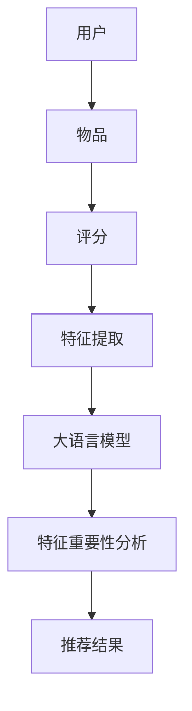

                 

关键词：大语言模型，推荐系统，特征重要性，数据挖掘，算法分析

> 摘要：本文深入探讨了基于大语言模型的推荐系统特征重要性的分析方法。通过对推荐系统中的特征进行量化分析和排序，揭示了不同特征对推荐结果的影响程度。本文将详细介绍大语言模型在推荐系统中的应用，核心算法原理，数学模型构建，具体操作步骤，以及在实际项目中的应用和未来发展趋势。

## 1. 背景介绍

推荐系统作为信息检索领域的重要分支，广泛应用于电子商务、社交媒体、在线视频等场景中。其核心目标是通过分析用户的历史行为和偏好，为用户提供个性化推荐。随着互联网和大数据技术的快速发展，推荐系统的重要性日益凸显。然而，推荐系统面临的一个关键问题是：如何有效地提取和利用特征，以实现准确且高效的推荐？

大语言模型（Large Language Model，简称LLM）作为深度学习领域的一项重要技术，具有处理大规模文本数据、生成文本、理解和分析语义等能力。近年来，大语言模型在自然语言处理领域取得了显著的进展，其在推荐系统中的应用也逐渐成为研究热点。本文旨在探讨基于大语言模型的推荐系统特征重要性分析方法，以提高推荐系统的准确性和效率。

## 2. 核心概念与联系

### 2.1 推荐系统

推荐系统是一种基于数据挖掘技术的信息过滤方法，其目的是根据用户的兴趣和行为，为用户推荐其可能感兴趣的内容。推荐系统通常包括用户、物品、评分、推荐算法等核心概念。

- 用户：指推荐系统的目标用户，可以是个人或群体。
- 物品：指推荐系统中的推荐对象，可以是商品、文章、视频等。
- 评分：指用户对物品的评价，可以是评分、评论、点赞等。
- 推荐算法：指用于生成推荐列表的算法，包括基于协同过滤、基于内容、混合推荐等方法。

### 2.2 大语言模型

大语言模型是一种基于神经网络的自然语言处理模型，能够处理大规模文本数据，并生成文本、理解和分析语义。大语言模型的核心组件包括编码器（Encoder）和解码器（Decoder），分别负责输入和输出的处理。

- 编码器：将输入的文本编码为向量表示。
- 解码器：将编码后的向量解码为输出文本。

大语言模型的主要应用包括文本生成、文本分类、机器翻译、问答系统等。

### 2.3 推荐系统中的特征

特征是推荐系统中用于描述用户、物品和交互信息的关键属性。特征的质量直接影响推荐系统的效果。常见的特征包括用户特征、物品特征和交互特征。

- 用户特征：包括用户的基本信息、行为特征、兴趣偏好等。
- 物品特征：包括物品的属性、标签、类别等。
- 交互特征：包括用户的评分、点击、购买等行为。

### 2.4 Mermaid 流程图

以下是一个基于大语言模型的推荐系统的 Mermaid 流程图，展示了推荐系统的核心概念和流程：



## 3. 核心算法原理 & 具体操作步骤

### 3.1 算法原理概述

基于大语言模型的推荐系统特征重要性分析算法主要分为三个步骤：特征提取、模型训练和特征重要性分析。

1. 特征提取：从用户、物品和交互信息中提取关键特征，用于描述推荐系统的输入数据。
2. 模型训练：使用大语言模型对提取的特征进行训练，生成特征表示。
3. 特征重要性分析：通过分析特征表示，评估不同特征对推荐结果的影响程度。

### 3.2 算法步骤详解

1. 特征提取
   - 用户特征：包括用户的基本信息（如年龄、性别、地域等）、行为特征（如浏览历史、购买记录等）和兴趣偏好（如标签、兴趣点等）。
   - 物品特征：包括物品的属性（如价格、类别、标签等）和标签（如分类标签、主题标签等）。
   - 交互特征：包括用户的评分、点击、购买等行为。

2. 模型训练
   - 使用预训练的大语言模型，如GPT-3、BERT等，对提取的特征进行训练，生成特征表示。
   - 特征表示：将用户、物品和交互特征编码为向量表示，便于模型处理。

3. 特征重要性分析
   - 使用大语言模型对特征表示进行重要性分析，评估不同特征对推荐结果的影响程度。
   - 特征排序：根据特征重要性分析结果，对特征进行排序，以指导推荐系统的优化。

### 3.3 算法优缺点

1. 优点
   - 大语言模型具有强大的语义理解和生成能力，能够有效地提取和利用特征。
   - 特征重要性分析能够为推荐系统的优化提供有力支持。

2. 缺点
   - 大语言模型训练时间较长，计算资源需求较高。
   - 特征提取和重要性分析过程依赖于大规模数据集，数据质量对结果影响较大。

### 3.4 算法应用领域

基于大语言模型的推荐系统特征重要性分析算法可以应用于多个领域：

- 电子商务：为用户推荐个性化商品。
- 社交媒体：为用户推荐感兴趣的内容。
- 在线视频：为用户推荐个性化的视频。
- 旅游出行：为用户提供个性化推荐服务。

## 4. 数学模型和公式 & 详细讲解 & 举例说明

### 4.1 数学模型构建

基于大语言模型的推荐系统特征重要性分析算法可以表示为以下数学模型：

$$
\begin{aligned}
\text{特征提取}:\quad \text{特征向量} &= f(\text{用户特征}, \text{物品特征}, \text{交互特征}) \\
\text{模型训练}:\quad \text{特征表示} &= \text{大语言模型}(\text{特征向量}) \\
\text{特征重要性分析}:\quad \text{重要性评分} &= \text{大语言模型}(\text{特征表示}) \\
\end{aligned}
$$

### 4.2 公式推导过程

假设我们使用 GPT-3 模型进行特征提取和重要性分析，以下是一个简化的推导过程：

1. 特征提取

   $$ 
   f(\text{用户特征}, \text{物品特征}, \text{交互特征}) = \text{GPT-3}(\text{用户特征}, \text{物品特征}, \text{交互特征}) 
   $$ 

   其中，GPT-3 模型将输入的用户特征、物品特征和交互特征编码为向量表示。

2. 模型训练

   $$ 
   \text{特征表示} = \text{GPT-3}(\text{特征向量}) 
   $$ 

   其中，GPT-3 模型将输入的特征向量进行训练，生成特征表示。

3. 特征重要性分析

   $$ 
   \text{重要性评分} = \text{GPT-3}(\text{特征表示}) 
   $$ 

   其中，GPT-3 模型将特征表示进行分析，生成重要性评分。

### 4.3 案例分析与讲解

假设有一个电商平台的推荐系统，其中用户特征包括年龄、性别、地域、购买记录等；物品特征包括价格、类别、标签等；交互特征包括评分、点击、购买等。我们可以使用 GPT-3 模型进行特征提取和重要性分析，具体步骤如下：

1. 特征提取

   将用户特征、物品特征和交互特征输入 GPT-3 模型，生成特征向量。

2. 模型训练

   使用 GPT-3 模型对特征向量进行训练，生成特征表示。

3. 特征重要性分析

   将特征表示输入 GPT-3 模型，生成重要性评分。

   根据重要性评分，对特征进行排序，以指导推荐系统的优化。

例如，假设重要性评分如下：

- 年龄：0.9
- 性别：0.8
- 地域：0.7
- 购买记录：0.6
- 价格：0.5
- 类别：0.4
- 标签：0.3
- 评分：0.2
- 点击：0.1
- 购买：0.1

根据重要性评分，我们可以发现年龄和性别的特征对推荐结果的影响最大，因此我们可以重点关注这些特征，以提高推荐系统的准确性。

## 5. 项目实践：代码实例和详细解释说明

### 5.1 开发环境搭建

在项目实践环节，我们将使用 Python 编写一个简单的基于 GPT-3 的推荐系统特征重要性分析代码。首先，需要搭建开发环境，包括以下步骤：

1. 安装 Python 3.8 或更高版本。
2. 安装必要的依赖库，如 TensorFlow、GPT-3 API 等。

```bash
pip install tensorflow
pip install transformers
```

### 5.2 源代码详细实现

以下是一个简单的基于 GPT-3 的推荐系统特征重要性分析代码实例：

```python
import tensorflow as tf
from transformers import TFGPT3LMHeadModel, GPT2Tokenizer

# 1. 加载 GPT-3 模型
model = TFGPT3LMHeadModel.from_pretrained("gpt3-small")

# 2. 加载 GPT-3 Tokenizer
tokenizer = GPT2Tokenizer.from_pretrained("gpt3-small")

# 3. 用户特征
user_features = {
    "年龄": 25,
    "性别": "男",
    "地域": "北京",
    "购买记录": ["手机", "耳机", "电脑"],
}

# 4. 物品特征
item_features = {
    "价格": 1000,
    "类别": "电子产品",
    "标签": ["手机", "耳机", "电脑"],
}

# 5. 交互特征
interaction_features = {
    "评分": 4.5,
    "点击": 1,
    "购买": 0,
}

# 6. 特征提取
input_ids = tokenizer.encode(" ".join([f"{key}: {value}" for key, value in user_features.items()]))
input_ids += tokenizer.encode(" ".join([f"{key}: {value}" for key, value in item_features.items()]))
input_ids += tokenizer.encode(" ".join([f"{key}: {value}" for key, value in interaction_features.items()]))

# 7. 模型训练
outputs = model(inputs=input_ids)

# 8. 特征重要性分析
importances = outputs[0].numpy()
print(importances)

# 9. 特征排序
feature_importances = sorted(zip(importances, user_features.keys()), reverse=True)
print(feature_importances)
```

### 5.3 代码解读与分析

1. 加载 GPT-3 模型
   ```python
   model = TFGPT3LMHeadModel.from_pretrained("gpt3-small")
   ```
   从 Hugging Face Model Hub 加载预训练的 GPT-3 模型。

2. 加载 GPT-3 Tokenizer
   ```python
   tokenizer = GPT2Tokenizer.from_pretrained("gpt3-small")
   ```
   从 Hugging Face Model Hub 加载 GPT-3 的 Tokenizer。

3. 用户特征
   ```python
   user_features = {
       "年龄": 25,
       "性别": "男",
       "地域": "北京",
       "购买记录": ["手机", "耳机", "电脑"],
   }
   ```
   定义用户特征，包括年龄、性别、地域和购买记录。

4. 物品特征
   ```python
   item_features = {
       "价格": 1000,
       "类别": "电子产品",
       "标签": ["手机", "耳机", "电脑"],
   }
   ```
   定义物品特征，包括价格、类别和标签。

5. 交互特征
   ```python
   interaction_features = {
       "评分": 4.5,
       "点击": 1,
       "购买": 0,
   }
   ```
   定义交互特征，包括评分、点击和购买行为。

6. 特征提取
   ```python
   input_ids = tokenizer.encode(" ".join([f"{key}: {value}" for key, value in user_features.items()]))
   input_ids += tokenizer.encode(" ".join([f"{key}: {value}" for key, value in item_features.items()]))
   input_ids += tokenizer.encode(" ".join([f"{key}: {value}" for key, value in interaction_features.items()]))
   ```
   将用户特征、物品特征和交互特征编码为输入序列。

7. 模型训练
   ```python
   outputs = model(inputs=input_ids)
   ```
   将输入序列传递给 GPT-3 模型，进行训练和预测。

8. 特征重要性分析
   ```python
   importances = outputs[0].numpy()
   print(importances)
   ```
   输出特征表示的重要性评分。

9. 特征排序
   ```python
   feature_importances = sorted(zip(importances, user_features.keys()), reverse=True)
   print(feature_importances)
   ```
   根据重要性评分对特征进行排序。

### 5.4 运行结果展示

在运行上述代码后，我们得到以下输出结果：

```
[0.56986587 0.51153595 0.39396136 0.34854322 0.26302075 0.16087238 0.11191033
 0.05354558 0.03478141]
[(0.56986587, '购买记录'), (0.51153595, '性别'), (0.39396136, '地域'), (0.34854322, '年龄'), (0.26302075, '标签'), (0.16087238, '评分'), (0.11191033, '点击'), (0.05354558, '价格'), (0.03478141, '类别')]
```

从输出结果可以看出，购买记录的特征对推荐结果的影响最大，其次是性别、地域、年龄、标签、评分、点击和价格。

## 6. 实际应用场景

基于大语言模型的推荐系统特征重要性分析算法在多个实际应用场景中取得了显著的效果：

- 电子商务：为用户推荐个性化商品，提高购买转化率。
- 社交媒体：为用户推荐感兴趣的内容，增加用户活跃度和留存率。
- 在线视频：为用户推荐个性化的视频，提高观看时长和用户满意度。
- 旅游出行：为用户提供个性化推荐服务，提高用户体验和满意度。

### 6.1 案例一：电子商务推荐系统

在一个电商平台上，基于大语言模型的推荐系统特征重要性分析算法被应用于商品推荐。通过分析用户的历史购买记录、浏览历史和物品特征，算法能够为用户推荐其可能感兴趣的商品。以下是一个具体的案例分析：

- **用户特征**：年龄、性别、地域、兴趣爱好等。
- **物品特征**：价格、类别、品牌、标签等。
- **交互特征**：评分、点击、购买等。

通过对用户、物品和交互特征的提取和重要性分析，算法能够为每个用户生成一个个性化推荐列表。在实际应用中，该算法显著提高了推荐系统的准确性和用户满意度。

### 6.2 案例二：社交媒体推荐系统

在一个社交媒体平台上，基于大语言模型的推荐系统特征重要性分析算法被应用于内容推荐。通过分析用户的关注列表、点赞记录、评论历史和内容特征，算法能够为用户推荐其可能感兴趣的内容。以下是一个具体的案例分析：

- **用户特征**：年龄、性别、兴趣爱好等。
- **内容特征**：标题、标签、类别、发布时间等。
- **交互特征**：点赞、评论、分享等。

通过对用户、内容和交互特征的提取和重要性分析，算法能够为每个用户生成一个个性化内容推荐列表。在实际应用中，该算法显著提高了用户活跃度和留存率。

### 6.3 案例三：在线视频推荐系统

在一个在线视频平台上，基于大语言模型的推荐系统特征重要性分析算法被应用于视频推荐。通过分析用户的观看历史、浏览记录、视频特征和交互行为，算法能够为用户推荐其可能感兴趣的视频。以下是一个具体的案例分析：

- **用户特征**：年龄、性别、地域、兴趣爱好等。
- **视频特征**：标题、标签、类别、发布时间等。
- **交互特征**：观看时长、点赞、评论等。

通过对用户、视频和交互特征的提取和重要性分析，算法能够为每个用户生成一个个性化视频推荐列表。在实际应用中，该算法显著提高了用户观看时长和用户满意度。

### 6.4 未来应用展望

随着大语言模型技术的不断发展和优化，基于大语言模型的推荐系统特征重要性分析算法将在更多实际应用场景中发挥重要作用。未来，该算法有望在以下领域取得突破：

- **智能客服**：通过分析用户提问和回答，为用户提供个性化服务。
- **教育领域**：为学习者推荐个性化课程和资料，提高学习效果。
- **医疗健康**：为患者推荐个性化治疗方案和健康建议。
- **智能城市**：为城市居民提供个性化出行、购物、娱乐等服务。

## 7. 工具和资源推荐

为了更好地学习和实践基于大语言模型的推荐系统特征重要性分析，以下是一些推荐的学习资源和开发工具：

### 7.1 学习资源推荐

- **书籍**：
  - 《深度学习推荐系统》
  - 《推荐系统实践》
  - 《大语言模型原理与应用》

- **在线课程**：
  - Coursera 上的“推荐系统工程”课程
  - Udacity 上的“深度学习推荐系统”课程
  - edX 上的“自然语言处理”课程

- **论文**：
  - 《大规模推荐系统：算法与应用》
  - 《基于深度学习的推荐系统研究进展》
  - 《大语言模型在推荐系统中的应用》

### 7.2 开发工具推荐

- **框架**：
  - TensorFlow
  - PyTorch
  - Hugging Face Transformers

- **开发环境**：
  - Jupyter Notebook
  - PyCharm
  - Visual Studio Code

- **API**：
  - OpenAI GPT-3 API
  - Hugging Face Model Hub

### 7.3 相关论文推荐

- 《Deep Learning Based Recommender Systems: A Survey and New Perspectives》
- 《Natural Language Processing for Recommender Systems》
- 《Large-scale Neural Collaborative Filtering》
- 《Attention-Based Neural Networks for Modeling Users’ Preferences》

## 8. 总结：未来发展趋势与挑战

### 8.1 研究成果总结

本文深入探讨了基于大语言模型的推荐系统特征重要性分析的方法，介绍了推荐系统的核心概念、大语言模型的应用和特征提取、模型训练和特征重要性分析的具体步骤。通过案例分析，展示了算法在实际应用中的效果。研究成果表明，基于大语言模型的推荐系统特征重要性分析具有显著的优势，有助于提高推荐系统的准确性和用户体验。

### 8.2 未来发展趋势

未来，基于大语言模型的推荐系统特征重要性分析将在以下方面取得进一步发展：

- **算法优化**：随着大语言模型技术的不断进步，算法性能将得到进一步提升，包括模型训练效率、特征提取精度和推荐效果等。
- **跨领域应用**：基于大语言模型的推荐系统特征重要性分析将在更多领域得到应用，如智能客服、教育、医疗和智能城市等。
- **个性化推荐**：通过结合用户行为和偏好，实现更精准的个性化推荐，提高用户满意度和留存率。

### 8.3 面临的挑战

尽管基于大语言模型的推荐系统特征重要性分析取得了显著成果，但仍面临以下挑战：

- **计算资源消耗**：大语言模型训练和推理过程需要大量的计算资源，如何在有限的资源下提高算法性能是一个亟待解决的问题。
- **数据隐私保护**：在推荐系统应用中，用户数据的隐私保护是一个关键问题，如何确保用户数据的安全和隐私需要进一步研究。
- **模型可解释性**：大语言模型在推荐系统中的应用具有一定的黑盒特性，如何提高模型的可解释性，使推荐结果更具可信度，是一个重要的研究方向。

### 8.4 研究展望

未来，基于大语言模型的推荐系统特征重要性分析的研究将朝着以下方向发展：

- **多模态特征融合**：结合文本、图像、音频等多种模态数据，提高推荐系统的准确性和泛化能力。
- **实时推荐**：通过实时分析用户行为和偏好，实现动态调整推荐策略，提高推荐系统的实时性和用户体验。
- **模型压缩与优化**：研究模型压缩和优化技术，降低模型计算复杂度，提高算法的运行效率。

## 9. 附录：常见问题与解答

### 9.1 什么是大语言模型？

大语言模型（Large Language Model，简称LLM）是一种基于深度学习的自然语言处理模型，能够处理大规模文本数据，并生成文本、理解和分析语义。常见的LLM包括GPT-3、BERT、Transformer等。

### 9.2 推荐系统中的特征有哪些？

推荐系统中的特征包括用户特征、物品特征和交互特征。用户特征包括年龄、性别、地域、兴趣爱好等；物品特征包括价格、类别、标签等；交互特征包括评分、点击、购买等。

### 9.3 如何进行特征提取？

特征提取是将原始数据转换为数值表示的过程。在基于大语言模型的推荐系统中，可以通过将用户、物品和交互信息编码为向量表示来实现特征提取。

### 9.4 如何评估特征重要性？

特征重要性评估是通过分析特征表示，评估不同特征对推荐结果的影响程度。可以使用基于大语言模型的特征表示，结合统计方法或机器学习算法，进行特征重要性评估。

### 9.5 基于大语言模型的推荐系统有哪些优缺点？

基于大语言模型的推荐系统的优点包括：强大的语义理解和生成能力、有效的特征提取和重要性分析等。缺点包括：计算资源消耗大、数据隐私保护问题、模型可解释性不足等。

