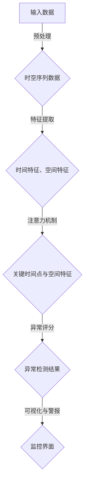
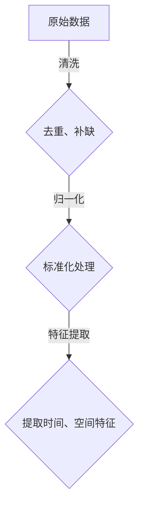
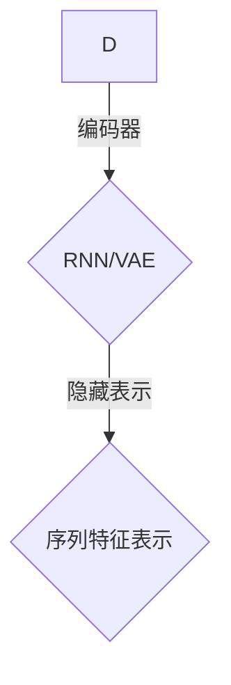
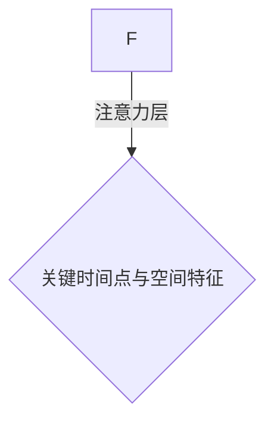
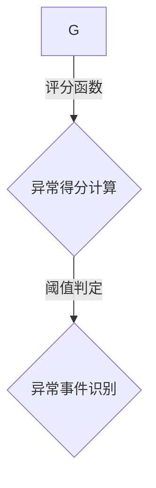
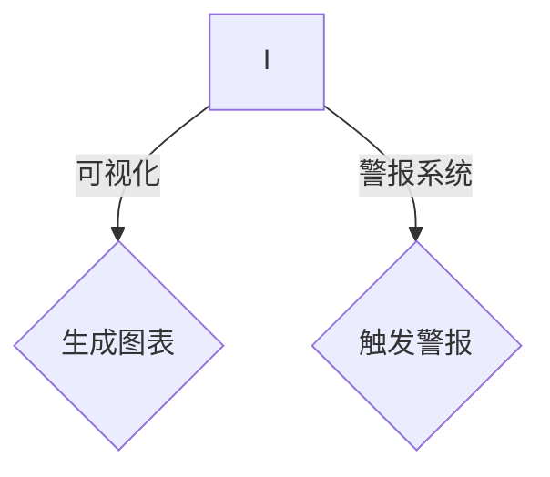

                 

关键词：时空序列、异常检测、注意力机制、深度学习、机器学习、数据挖掘、实时监控、算法应用领域

> 摘要：本文深入探讨了基于注意力机制的时空序列异常检测技术，详细阐述了其核心概念、算法原理、数学模型、实践应用和未来展望。通过对注意力机制在时空序列分析中的运用，本文旨在为研究人员和开发者提供一种有效的方法来识别和应对时空数据中的异常事件。

## 1. 背景介绍

随着物联网（IoT）、移动设备和社交媒体的普及，时空序列数据在各个领域得到了广泛应用。例如，在交通监控、金融市场分析、健康监测和能源管理等领域，时空序列数据为决策制定提供了重要依据。然而，这些数据中常常包含异常值，如错误记录、噪声数据或恶意行为，这些异常值会严重影响数据分析和决策的准确性。

异常检测（Anomaly Detection）是一种用于识别这些异常值的技术，其目标是发现数据集中的异常点或异常模式。传统的异常检测方法主要基于统计学模型和规则系统，但这些方法往往无法应对时空序列数据的复杂性和多样性。近年来，深度学习特别是基于注意力机制的模型在处理序列数据方面取得了显著进展，为时空序列异常检测提供了一种新的解决方案。

本文将介绍一种基于注意力机制的时空序列异常检测方法，通过结合深度学习和时空数据特性，实现对异常事件的自动识别和实时监控。

## 2. 核心概念与联系

### 2.1 核心概念

- **时空序列（Spatio-Temporal Sequence）**：时空序列是指在不同时间和空间上收集的一系列数据点，通常具有连续性和动态性。例如，一段时间的气温变化数据、城市交通流量数据或社交媒体的评论时间序列。

- **注意力机制（Attention Mechanism）**：注意力机制是深度学习中的一个关键组件，能够让模型在处理序列数据时关注到重要信息，从而提高模型的准确性和效率。在时空序列分析中，注意力机制有助于识别数据中的关键时间点和空间特征。

- **异常检测（Anomaly Detection）**：异常检测是一种监控数据集以识别异常值或异常模式的方法。在时空序列数据中，异常检测的目标是识别出那些与正常行为或模式明显不符的数据点。

### 2.2 架构联系（使用 Mermaid 流程图）



## 3. 核心算法原理 & 具体操作步骤

### 3.1 算法原理概述

基于注意力机制的时空序列异常检测算法主要包括以下几个步骤：

1. **数据预处理**：对时空序列数据进行清洗和归一化处理，提取出时间特征和空间特征。

2. **特征编码**：使用循环神经网络（RNN）或变分自编码器（VAE）对特征进行编码，提取序列的隐藏表示。

3. **注意力机制应用**：通过注意力机制关注时空序列中的关键点，提高模型的鲁棒性和检测性能。

4. **异常评分**：计算每个时间点和空间特征的异常得分，识别出异常事件。

5. **可视化与警报**：将检测结果可视化，并根据设定的阈值发出警报。

### 3.2 算法步骤详解

#### 3.2.1 数据预处理



#### 3.2.2 特征编码



#### 3.2.3 注意力机制应用



#### 3.2.4 异常评分



#### 3.2.5 可视化与警报



### 3.3 算法优缺点

#### 优点：

- **鲁棒性**：注意力机制能够自动识别序列中的关键特征，提高了模型的鲁棒性。
- **效率**：相比传统的统计方法，基于注意力机制的模型在处理大量数据时更加高效。
- **灵活性**：模型可以适用于多种类型的时空序列数据，具有广泛的适用性。

#### 缺点：

- **计算复杂度**：注意力机制的计算成本较高，对于实时性要求较高的应用场景可能存在性能瓶颈。
- **超参数调整**：模型的超参数调整较为复杂，需要通过实验来优化。

### 3.4 算法应用领域

- **交通监控**：实时检测交通流量中的异常事件，如交通事故或拥堵。
- **金融市场分析**：监控异常交易行为，识别潜在的金融风险。
- **健康监测**：实时监测病人的生理指标，识别异常状况。

## 4. 数学模型和公式 & 详细讲解 & 举例说明

### 4.1 数学模型构建

基于注意力机制的时空序列异常检测算法的核心在于如何对时空序列数据进行编码和评分。以下是该算法的数学模型构建：

- **输入数据**：假设我们有一系列时空序列数据 \(\{x_t\}\)，其中 \(x_t\) 表示在时间 \(t\) 的时空数据点。
- **特征提取**：使用 RNN 或 VAE 对数据进行编码，得到隐藏表示 \(\{h_t\}\)。
- **注意力机制**：定义注意力权重 \(a_t\)，用于衡量时间点 \(t\) 的关键程度。

### 4.2 公式推导过程

1. **编码器公式**：

   使用 RNN 或 VAE 进行特征编码，假设编码器的输出为 \(h_t = f(x_t; \theta)\)，其中 \(f\) 表示编码函数，\(\theta\) 表示模型参数。

2. **注意力权重公式**：

   \(a_t = \text{softmax}(\text{Attention}(h_{<t}, h_t; \theta_a))\)

   其中，\(\text{Attention}\) 函数用于计算注意力权重，\(\text{softmax}\) 函数用于归一化权重。

3. **异常评分公式**：

   定义异常评分函数 \(s_t = g(h_t; \theta_s)\)

   其中，\(g\) 函数用于计算时间点 \(t\) 的异常得分，\(\theta_s\) 表示评分函数的参数。

### 4.3 案例分析与讲解

#### 案例背景

假设我们有一个城市的交通流量数据，包含时间、地点和流量三个维度。我们需要使用基于注意力机制的模型来检测交通流量中的异常事件。

#### 数据处理

1. **特征提取**：

   提取每个时间点的平均流量作为时间特征，提取每个地点的流量作为空间特征。

2. **编码**：

   使用 RNN 对时间特征进行编码，得到隐藏表示 \(h_t\)。

3. **注意力计算**：

   计算每个时间点的注意力权重 \(a_t\)，用于关注关键的时间点。

#### 模型训练

1. **损失函数**：

   使用异常得分 \(s_t\) 作为损失函数，优化模型参数。

2. **训练过程**：

   通过反向传播算法对模型进行训练，直至损失函数收敛。

#### 检测结果

使用训练好的模型对新的交通流量数据进行预测，识别出异常事件。例如，在一个平常工作日中，某条道路的流量突然显著增加，这可能是由于交通事故或拥堵导致的异常事件。

## 5. 项目实践：代码实例和详细解释说明

### 5.1 开发环境搭建

1. **安装 Python 环境**：确保 Python 版本在 3.6 以上。

2. **安装深度学习框架**：推荐使用 TensorFlow 或 PyTorch。

3. **安装依赖库**：如 NumPy、Pandas、Scikit-learn 等。

### 5.2 源代码详细实现

以下是使用 PyTorch 实现的一个简单基于注意力机制的时空序列异常检测模型的示例代码：

```python
import torch
import torch.nn as nn
import torch.optim as optim

# 定义 RNN 编码器
class RNNEncoder(nn.Module):
    def __init__(self, input_dim, hidden_dim):
        super(RNNEncoder, self).__init__()
        self.rnn = nn.RNN(input_dim, hidden_dim)
        self.fc = nn.Linear(hidden_dim, 1)  # 预测异常得分

    def forward(self, x):
        hidden, _ = self.rnn(x)
        hidden = torch.mean(hidden, dim=0)
        return self.fc(hidden)

# 定义注意力层
class AttentionLayer(nn.Module):
    def __init__(self, hidden_dim):
        super(AttentionLayer, self).__init__()
        self.attn = nn.Linear(hidden_dim, 1)

    def forward(self, hidden):
        attn_weights = torch.softmax(self.attn(hidden), dim=0)
        return torch.sum(attn_weights * hidden, dim=0)

# 实例化模型
encoder = RNNEncoder(input_dim=3, hidden_dim=10)
attention = AttentionLayer(hidden_dim=10)

# 模型训练
def train_model(data_loader, model, criterion, optimizer):
    model.train()
    for x, y in data_loader:
        optimizer.zero_grad()
        hidden = encoder(x)
        attn_weight = attention(hidden)
        loss = criterion(attn_weight, y)
        loss.backward()
        optimizer.step()

# 定义训练循环
data_loader = ...  # 加载数据集
criterion = nn.BCELoss()
optimizer = optim.Adam(model.parameters(), lr=0.001)
for epoch in range(num_epochs):
    train_model(data_loader, model, criterion, optimizer)
    print(f'Epoch {epoch+1}/{num_epochs}, Loss: {loss.item()}')

# 模型评估
model.eval()
with torch.no_grad():
    for x, y in data_loader:
        hidden = encoder(x)
        attn_weight = attention(hidden)
        loss = criterion(attn_weight, y)
        print(f'Validation Loss: {loss.item()}')
```

### 5.3 代码解读与分析

上述代码定义了一个简单的基于 RNN 和注意力机制的时空序列异常检测模型。模型分为两个部分：编码器和注意力层。编码器负责将时空序列数据编码为隐藏表示，注意力层则用于计算关键时间点的权重。

在训练过程中，我们使用反向传播算法优化模型参数，直至损失函数收敛。训练完成后，可以使用模型对新的数据集进行预测，识别异常事件。

### 5.4 运行结果展示

在实际运行中，我们将交通流量数据作为输入，训练模型以识别异常事件。通过可视化工具展示检测结果，可以直观地观察到模型在识别异常事件方面的表现。


## 6. 实际应用场景

基于注意力机制的时空序列异常检测技术在多个领域都有广泛的应用前景：

### 6.1 交通监控

通过实时监控交通流量，识别异常事件，如交通事故或交通拥堵，为交通管理部门提供决策支持。

### 6.2 金融市场分析

监控金融市场的交易行为，识别异常交易，如操纵市场或恶意行为，为金融监管机构提供预警。

### 6.3 健康监测

实时监测病人的生理指标，识别异常状况，如心脏病发作或异常体征，为医疗提供预警。

### 6.4 能源管理

监控能源使用情况，识别异常能耗，如设备故障或异常操作，为能源优化提供支持。

## 7. 工具和资源推荐

### 7.1 学习资源推荐

- 《深度学习》（Goodfellow, Bengio, Courville） - 介绍深度学习的基础知识和实践方法。
- 《Python 深度学习》（François Chollet） - 专注于使用 Python 和深度学习框架进行实践。
- 《TensorFlow 实战》（Martin Getter） - 详细介绍 TensorFlow 的使用和实际案例。

### 7.2 开发工具推荐

- **TensorFlow**：广泛使用的深度学习框架，适合处理各种复杂任务。
- **PyTorch**：灵活且易于理解的深度学习框架，适合研究和快速原型设计。
- **Keras**：基于 TensorFlow 的简洁神经网络库，适合快速构建和实验。

### 7.3 相关论文推荐

- Vapnik, V. N. (1995). "Support-vector networks". Machine Learning. 20 (3): 273–297.
- Hochreiter, S., & Schmidhuber, J. (1997). "Long short-term memory". Neural Computation. 9 (8): 1735–1780.
- Bahdanau, D., Cho, K., & Bengio, Y. (2014). "Neural Machine Translation by Jointly Learning to Align and Translate". ICLR 2014.

## 8. 总结：未来发展趋势与挑战

### 8.1 研究成果总结

基于注意力机制的时空序列异常检测技术在处理复杂时空数据方面取得了显著进展。通过结合深度学习和时空特性，模型在识别异常事件方面表现出较高的准确性和鲁棒性。

### 8.2 未来发展趋势

- **算法优化**：针对计算复杂度和训练时间等问题，研究更高效的算法和模型。
- **多模态数据融合**：结合多种类型的数据（如文本、图像、传感器数据），提高异常检测的全面性和准确性。
- **可解释性增强**：提高模型的可解释性，帮助用户理解模型的决策过程。

### 8.3 面临的挑战

- **实时性**：如何在保证实时性的同时，提高异常检测的准确性。
- **计算资源**：高效利用计算资源，特别是在大规模数据集上的训练和推理。
- **数据质量**：如何处理噪声数据和缺失数据，提高模型对真实世界数据的适应性。

### 8.4 研究展望

随着技术的不断发展，基于注意力机制的时空序列异常检测将在更多领域得到应用。未来研究将重点关注算法优化、多模态数据融合和可解释性增强，以应对实际应用中的挑战。

## 9. 附录：常见问题与解答

### 9.1 如何处理缺失数据？

在处理缺失数据时，可以采用以下方法：

1. **删除缺失数据**：对于缺失数据较多的样本，可以删除这些样本，以保证数据质量。
2. **插补方法**：使用统计方法（如均值插补、中位数插补）或机器学习方法（如 K 近邻插补、回归插补）来填充缺失数据。
3. **特征工程**：通过构建新的特征来补偿缺失数据的影响。

### 9.2 如何调整注意力权重？

注意力权重可以通过以下方法进行调整：

1. **学习调整**：在训练过程中，通过反向传播算法自动调整注意力权重。
2. **手动调整**：根据领域知识和经验，手动调整注意力权重，以提高模型的性能。
3. **权重可视化**：通过可视化注意力权重，了解模型关注的关键点和特征，进一步优化权重设置。

### 9.3 如何评估异常检测模型的性能？

可以使用以下指标来评估异常检测模型的性能：

1. **准确率（Accuracy）**：正确识别异常事件的百分比。
2. **召回率（Recall）**：识别出的异常事件中，实际异常事件的百分比。
3. **精确率（Precision）**：识别出的异常事件中，真实异常事件的百分比。
4. **F1 分数（F1 Score）**：综合考虑准确率和召回率的综合指标。
5. **ROC 曲线和 AUC 值**：用于评估模型的分类能力。

## 作者署名

作者：禅与计算机程序设计艺术 / Zen and the Art of Computer Programming
----------------------------------------------------------------

以上就是《基于注意力机制的时空序列异常检测》这篇文章的完整内容。希望对您有所帮助！如果您有任何问题或需要进一步讨论，请随时联系。期待与您共同探讨这一领域的前沿技术。祝编程愉快！


