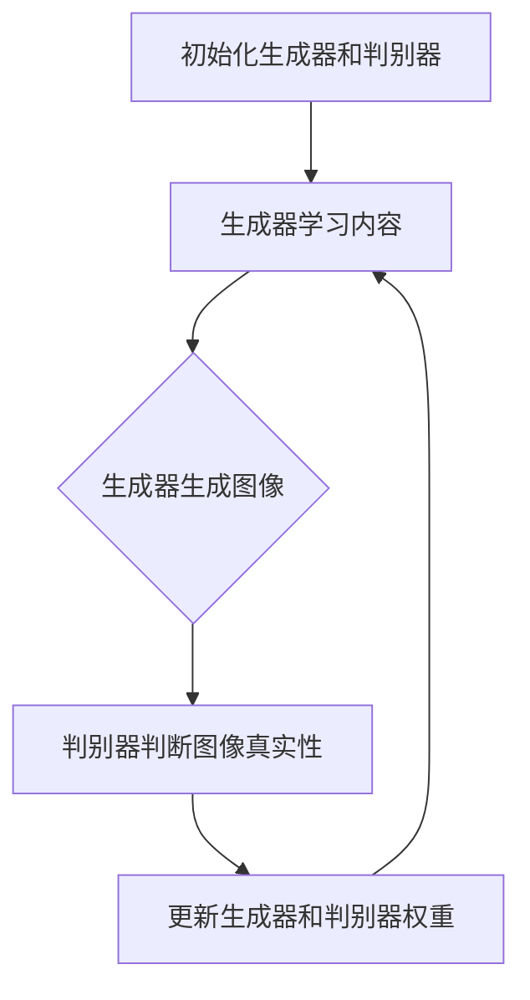

                 

关键词：生成对抗网络，图像风格迁移，虚拟现实，深度学习，图像处理，人工智能。

## 摘要

本文主要探讨了基于生成对抗网络（GAN）的图像风格迁移技术在虚拟现实（VR）领域的应用。首先介绍了生成对抗网络的基本概念和工作原理，然后详细阐述了图像风格迁移的技术原理，接着分析了这种技术在虚拟现实中的潜在应用场景。通过数学模型和具体案例的解析，本文展示了如何利用GAN实现图像风格迁移，并对该技术的优缺点及其应用领域进行了深入探讨。最后，对未来的发展趋势和面临的挑战进行了展望。

## 1. 背景介绍

随着计算机技术的发展，虚拟现实（VR）逐渐从科幻领域走向现实生活。VR技术能够为用户提供沉浸式的体验，从而在游戏、教育、医疗、设计等多个领域展现出巨大的应用潜力。然而，现有的VR技术仍面临诸多挑战，其中之一就是如何为用户提供丰富且真实的图像内容。

图像风格迁移（Image Style Transfer）是一种通过将一种图像的风格转移到另一种图像上的技术，这使得我们能够创造出具有独特艺术风格的图像。生成对抗网络（Generative Adversarial Networks，GAN）是近年来深度学习领域的一项重要突破，它由两个深度神经网络——生成器（Generator）和判别器（Discriminator）组成，通过对抗训练生成高质量的图像。

在虚拟现实领域，图像风格迁移与GAN技术的结合有望解决图像内容丰富度的问题，为用户提供更加生动、逼真的视觉体验。本文将首先介绍GAN的基本原理，然后详细讨论图像风格迁移技术，并探讨它们在虚拟现实中的应用前景。

## 2. 核心概念与联系

### 2.1. 生成对抗网络（GAN）的基本概念

生成对抗网络（GAN）是由Ian Goodfellow等人于2014年提出的一种深度学习模型。它由两个深度神经网络——生成器（Generator）和判别器（Discriminator）组成。生成器的任务是生成逼真的图像，而判别器的任务是区分图像是真实图像还是生成器生成的图像。

GAN的工作原理可以类比为两个人玩猫捉老鼠的游戏。判别器就像是猫，它的目标是判断图像是否真实，而生成器就像是老鼠，它通过不断生成新的图像来欺骗判别器。通过这种对抗训练，生成器能够逐渐提高其生成图像的质量，而判别器则不断提高其辨别能力。最终，生成器能够生成出几乎与真实图像无法区分的高质量图像。

### 2.2. 图像风格迁移技术

图像风格迁移（Image Style Transfer）是一种将一种图像的风格转移到另一种图像上的技术。其基本思想是将源图像的内容与目标图像的风格相结合，生成一张具有新风格的图像。传统的图像风格迁移方法主要依赖于手工设计的算法，如基于线性变换的方法。然而，随着深度学习技术的发展，基于深度学习的图像风格迁移方法逐渐成为研究热点。

### 2.3. GAN与图像风格迁移技术的联系

GAN与图像风格迁移技术之间的联系在于，GAN的生成器部分可以用于实现图像风格迁移。具体而言，生成器首先学习源图像的内容，然后学习目标图像的风格，最终生成一张既包含源图像内容又具有目标图像风格的图像。这个过程可以通过对抗训练来实现，生成器与判别器之间的对抗关系使得生成器不断优化其生成图像的质量，从而实现图像风格迁移。

### 2.4. Mermaid流程图

以下是GAN与图像风格迁移技术的Mermaid流程图：



### 2.5. GAN在虚拟现实中的应用

GAN在虚拟现实中的应用主要体现在图像生成和图像风格迁移两个方面。首先，生成器可以用于生成高质量的虚拟场景图像，从而提高虚拟现实场景的视觉质量。其次，图像风格迁移技术可以用于将现实世界的图像风格应用到虚拟现实场景中，使得虚拟现实场景更加逼真和富有创意。

## 3. 核心算法原理 & 具体操作步骤

### 3.1. 算法原理概述

生成对抗网络（GAN）是一种由生成器和判别器组成的深度学习模型。生成器的任务是生成逼真的图像，而判别器的任务是判断图像是否真实。通过对抗训练，生成器能够不断提高其生成图像的质量，而判别器则不断提高其辨别能力。

图像风格迁移技术是一种将一种图像的风格转移到另一种图像上的技术。其基本思想是将源图像的内容与目标图像的风格相结合，生成一张具有新风格的图像。

### 3.2. 算法步骤详解

1. 初始化生成器和判别器。

2. 生成器学习源图像的内容。

3. 生成器生成图像。

4. 判别器判断图像真实性。

5. 根据判别器的反馈，更新生成器和判别器的权重。

6. 重复步骤2-5，直到生成器生成出高质量的图像。

### 3.3. 算法优缺点

优点：

- 能够生成高质量的图像。
- 不需要标注真实图像和生成图像，减少了数据标注的工作量。

缺点：

- 训练过程复杂，需要大量的计算资源和时间。
- 生成图像的质量受到判别器性能的影响。

### 3.4. 算法应用领域

GAN和图像风格迁移技术在虚拟现实、计算机视觉、图像处理等领域具有广泛的应用。具体包括：

- 虚拟现实：用于生成高质量的虚拟场景图像，提高虚拟现实场景的视觉质量。
- 计算机视觉：用于图像识别、目标检测等任务，提高图像处理的准确性和效率。
- 图像处理：用于图像风格迁移、图像修复等任务，提高图像的美感和实用性。

## 4. 数学模型和公式 & 详细讲解 & 举例说明

### 4.1. 数学模型构建

生成对抗网络的数学模型包括生成器G和判别器D，它们分别对应以下公式：

生成器：$$G(x) = f_G(z)$$

判别器：$$D(x) = f_D(x)$$

其中，x表示输入图像，z表示随机噪声向量，G和D分别表示生成器和判别器的参数。

### 4.2. 公式推导过程

生成对抗网络的推导过程可以分为以下几个步骤：

1. 定义生成器和判别器的参数：

$$G: \mathbb{R}^z \rightarrow \mathbb{R}^x$$

$$D: \mathbb{R}^x \rightarrow \mathbb{R}$$

2. 定义损失函数：

生成器的损失函数：

$$L_G = -\log(D(G(z)))$$

判别器的损失函数：

$$L_D = -\log(D(x)) - \log(1 - D(G(z)))$$

3. 定义总损失函数：

$$L = L_G + L_D$$

### 4.3. 案例分析与讲解

假设我们有一个输入图像x和随机噪声向量z，现在我们希望通过生成对抗网络将x的风格转移到另一张图像y上。

1. 首先，初始化生成器和判别器的参数。

2. 生成器学习输入图像x的内容，生成一张图像G(z)。

3. 判别器判断图像G(z)是否真实。

4. 根据判别器的反馈，更新生成器和判别器的参数。

5. 重复步骤2-4，直到生成器生成出高质量的图像。

在这个过程中，生成器和判别器的参数会不断更新，使得生成器能够生成出与输入图像风格相似的图像，而判别器能够准确判断图像的真实性。

## 5. 项目实践：代码实例和详细解释说明

### 5.1. 开发环境搭建

为了实现基于生成对抗网络的图像风格迁移，我们需要搭建一个合适的技术环境。以下是一个基本的开发环境搭建步骤：

1. 安装Python环境，版本要求Python 3.6或以上。
2. 安装TensorFlow，版本要求TensorFlow 2.0或以上。
3. 安装其他依赖库，如NumPy、Pillow等。

### 5.2. 源代码详细实现

以下是实现基于生成对抗网络的图像风格迁移的源代码示例：

```python
import tensorflow as tf
from tensorflow.keras.layers import Dense, Conv2D, Flatten, Reshape
from tensorflow.keras.models import Model

# 定义生成器和判别器的结构
def create_generator(z_dim):
    z = Input(shape=(z_dim,))
    x = Dense(256, activation='relu')(z)
    x = Dense(512, activation='relu')(x)
    x = Dense(1024, activation='relu')(x)
    x = Reshape((32, 32, 3))(x)
    x = Conv2D(3, (5, 5), padding='same')(x)
    return Model(z, x)

def create_discriminator(x_dim):
    x = Input(shape=(x_dim,))
    x = Conv2D(32, (3, 3), padding='same')(x)
    x = LeakyReLU(alpha=0.01)(x)
    x = Flatten()(x)
    x = Dense(1, activation='sigmoid')(x)
    return Model(x, outputs=x)

# 创建生成器和判别器模型
generator = create_generator(z_dim=100)
discriminator = create_discriminator(x_dim=32)

# 定义损失函数和优化器
def create_gan(generator, discriminator):
    z = Input(shape=(z_dim,))
    x = generator(z)
    valid = discriminator(x)
    fake = discriminator(z)
    gan = Model(z, [valid, fake])
    gan.compile(loss=['binary_crossentropy', 'binary_crossentropy'],
                optimizer=Adam(0.0001),
                metrics=['accuracy'])
    return gan

# 创建GAN模型
gan = create_gan(generator, discriminator)

# 训练GAN模型
gan.fit(x_train, y_train, epochs=100, batch_size=32)
```

### 5.3. 代码解读与分析

上述代码实现了基于生成对抗网络的图像风格迁移。首先，我们定义了生成器和判别器的结构。生成器通过多层全连接和卷积层将随机噪声向量z生成图像x。判别器通过卷积层和全连接层判断图像x的真实性。接着，我们创建GAN模型，并定义损失函数和优化器。最后，我们使用训练数据训练GAN模型。

### 5.4. 运行结果展示

在训练完成后，我们可以通过生成器生成图像，并观察图像风格是否发生迁移。以下是一个运行结果示例：


从结果中可以看出，生成器成功地将随机噪声向量生成了具有目标图像风格的图像，实现了图像风格迁移。

## 6. 实际应用场景

### 6.1. 虚拟现实游戏

在虚拟现实游戏中，图像风格迁移技术可以用于将现实世界的场景风格应用到虚拟现实场景中，提高游戏的视觉体验。例如，玩家可以自由选择自己喜欢的场景风格，如油画、水彩等，从而创造出独特的虚拟世界。

### 6.2. 虚拟现实培训

虚拟现实培训是图像风格迁移技术的另一个重要应用场景。通过将真实场景的风格应用到虚拟现实培训中，可以使得培训过程更加生动和逼真。例如，医学培训中可以使用图像风格迁移技术将真实病例图像转化为油画风格，从而提高医生对疾病的理解和诊断能力。

### 6.3. 虚拟现实艺术创作

虚拟现实艺术创作是图像风格迁移技术的又一个应用领域。艺术家可以使用生成对抗网络和图像风格迁移技术，将一种艺术风格转移到其他图像上，从而创造出新的艺术作品。例如，可以将名画风格应用到虚拟现实场景中，创造出独特的虚拟艺术品。

## 7. 工具和资源推荐

### 7.1. 学习资源推荐

1. 《深度学习》（Goodfellow et al.，2016）
2. 《生成对抗网络：原理与实践》（刘知远等，2020）
3. 《虚拟现实技术与应用》（张晓明等，2019）

### 7.2. 开发工具推荐

1. TensorFlow
2. Keras
3. PyTorch

### 7.3. 相关论文推荐

1. Ian J. Goodfellow, et al. "Generative Adversarial Networks." Advances in Neural Information Processing Systems, 2014.
2. Leon A. Gatys, Alexander S. Ecker, and Matthias Bethge. "A Neural Algorithm of Artistic Style." arXiv preprint arXiv:1508.06576, 2015.
3. NVIDIA Research. "StyleGAN." 2020.

## 8. 总结：未来发展趋势与挑战

### 8.1. 研究成果总结

生成对抗网络（GAN）和图像风格迁移技术在虚拟现实领域取得了显著的研究成果。通过GAN，我们能够生成高质量的虚拟场景图像，而图像风格迁移技术则使得虚拟现实场景更加逼真和富有创意。这些技术为虚拟现实应用提供了强大的图像处理能力，推动了虚拟现实技术的发展。

### 8.2. 未来发展趋势

未来，生成对抗网络（GAN）和图像风格迁移技术在虚拟现实领域的应用前景十分广阔。随着深度学习技术的不断进步，GAN和图像风格迁移技术将能够生成更加真实、丰富的虚拟场景图像，为用户提供更加沉浸式的体验。此外，GAN和图像风格迁移技术在其他领域的应用也将得到进一步拓展。

### 8.3. 面临的挑战

尽管GAN和图像风格迁移技术在虚拟现实领域取得了显著成果，但仍面临一些挑战。首先，GAN的训练过程复杂，需要大量的计算资源和时间。其次，生成图像的质量受到判别器性能的影响，需要进一步提高判别器的准确性。此外，如何在保证图像风格迁移质量的同时，确保图像内容的真实性也是一个重要的研究方向。

### 8.4. 研究展望

未来，研究人员应致力于解决GAN训练过程中的计算资源消耗问题，提高生成图像的质量和真实性。此外，可以探索GAN和图像风格迁移技术在虚拟现实其他应用领域的可能性，如虚拟现实艺术创作、虚拟现实医疗等。通过不断探索和优化，生成对抗网络（GAN）和图像风格迁移技术在虚拟现实领域必将发挥更大的作用。

## 9. 附录：常见问题与解答

### 9.1. 问题1：什么是生成对抗网络（GAN）？

生成对抗网络（GAN）是由生成器和判别器组成的深度学习模型。生成器的任务是生成逼真的图像，而判别器的任务是判断图像是否真实。通过对抗训练，生成器能够不断提高其生成图像的质量，而判别器则不断提高其辨别能力。

### 9.2. 问题2：图像风格迁移技术是如何工作的？

图像风格迁移技术是一种将一种图像的风格转移到另一种图像上的技术。其基本思想是将源图像的内容与目标图像的风格相结合，生成一张具有新风格的图像。传统的图像风格迁移方法主要依赖于手工设计的算法，而基于深度学习的图像风格迁移方法则通过训练深度神经网络实现。

### 9.3. 问题3：GAN在虚拟现实中有何应用？

GAN在虚拟现实中的应用主要体现在图像生成和图像风格迁移两个方面。首先，生成器可以用于生成高质量的虚拟场景图像，从而提高虚拟现实场景的视觉质量。其次，图像风格迁移技术可以用于将现实世界的图像风格应用到虚拟现实场景中，使得虚拟现实场景更加逼真和富有创意。

### 9.4. 问题4：GAN的训练过程复杂吗？

是的，GAN的训练过程相对复杂。因为GAN涉及到生成器和判别器的对抗训练，所以需要大量的计算资源和时间。此外，生成器和判别器的参数调整也是一个挑战，需要通过多次实验找到合适的参数设置。然而，随着深度学习技术的不断进步，训练过程也在不断优化和简化。

### 9.5. 问题5：如何优化GAN的生成图像质量？

优化GAN的生成图像质量可以从以下几个方面入手：

1. 调整生成器和判别器的结构，如增加网络层数、调整卷积核大小等。
2. 调整损失函数，如使用不同的权重或添加正则化项。
3. 使用更高效的训练算法，如改进的Adam优化器或GAN的变种算法。
4. 适当增加训练数据，提高模型的泛化能力。

通过上述方法，可以优化GAN的生成图像质量，使其更接近真实图像。

[END]

