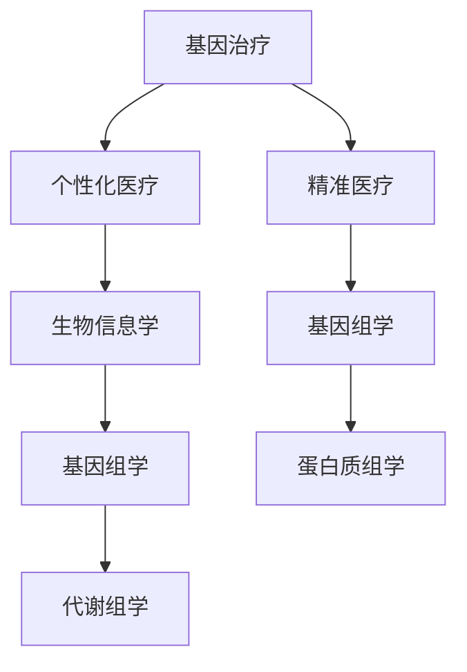

                 

关键词：基因治疗、个性化医疗、精准医疗、生物信息学、算法、技术进展

> 摘要：本文旨在探讨基因治疗个性化方案的最新进展及其在精准医疗领域的重要作用。通过梳理核心概念、算法原理、数学模型及项目实践，本文将展示基因治疗个性化方案的创新模式，并为未来的发展方向和研究挑战提供思考。

## 1. 背景介绍

基因治疗是一项革命性的生物技术，通过纠正或替代异常基因来治疗遗传性疾病。随着科学技术的不断发展，基因治疗的应用范围日益扩大，从单基因遗传病到复杂的多系统疾病，均展现出巨大的潜力。个性化医疗则是根据患者的个体差异，制定个性化的治疗方案，以提高治疗效果和减少副作用。

近年来，精准医疗的概念逐渐兴起，成为医学研究的重要方向。精准医疗强调利用现代分子生物学技术，对患者的基因、蛋白质、代谢产物等进行全面分析，从而实现对疾病精准诊断和个性化治疗。基因治疗与精准医疗的结合，为许多难治性疾病提供了新的治疗途径。

## 2. 核心概念与联系

### 2.1. 基因治疗

基因治疗是指通过将功能正常的基因导入患者体内，以纠正或替代异常基因，从而达到治疗疾病的目的。基因治疗可分为以下几种类型：

- 基因矫正：直接修复异常基因。
- 基因替换：用正常基因替换异常基因。
- 基因编辑：通过CRISPR/Cas9等工具对基因进行精确编辑。
- 基因增强：增强特定基因的表达。

### 2.2. 个性化医疗

个性化医疗是指根据患者的基因、环境、生活习惯等个体差异，制定个性化的治疗方案。个性化医疗的实现需要依赖生物信息学、基因组学、生物统计学等多个学科的技术手段。

### 2.3. 精准医疗

精准医疗是一种以基因组学、蛋白质组学、代谢组学等组学技术为基础，对疾病进行精准诊断和个性化治疗的新型医疗模式。精准医疗的核心是利用大数据和人工智能技术，对患者的基因、蛋白质、代谢产物等信息进行综合分析，从而实现精准诊断和个性化治疗。

### 2.4. Mermaid 流程图

下面是一个关于基因治疗个性化方案的Mermaid流程图，展示了核心概念和联系。



## 3. 核心算法原理 & 具体操作步骤

### 3.1. 算法原理概述

基因治疗个性化方案的算法原理主要包括以下几个部分：

- 基因组数据分析：通过对患者的基因组进行测序和分析，获取与疾病相关的基因信息。
- 蛋白质组学分析：通过蛋白质组学技术，分析患者体内的蛋白质表达情况，以揭示疾病的发生机制。
- 代谢组学分析：通过代谢组学技术，分析患者体内的代谢产物，为疾病诊断和治疗提供依据。
- 机器学习算法：利用机器学习算法，对基因组、蛋白质组、代谢组等信息进行综合分析，预测患者对基因治疗的响应。

### 3.2. 算法步骤详解

基因治疗个性化方案的算法步骤如下：

1. **基因组数据分析**：
   - 获取患者的基因组序列。
   - 对基因组序列进行变异检测，识别与疾病相关的基因变异。
   - 对识别出的基因变异进行功能注释，分析其可能对疾病发生和发展的影响。

2. **蛋白质组学分析**：
   - 对患者样本进行蛋白质组学分析，获取蛋白质表达谱。
   - 利用生物信息学工具，对蛋白质表达谱进行差异分析，识别与疾病相关的关键蛋白质。

3. **代谢组学分析**：
   - 对患者样本进行代谢组学分析，获取代谢产物谱。
   - 利用生物信息学工具，对代谢产物谱进行差异分析，识别与疾病相关的关键代谢途径。

4. **机器学习算法**：
   - 将基因组、蛋白质组、代谢组等信息输入机器学习模型。
   - 利用机器学习模型，对患者的基因治疗响应进行预测。

### 3.3. 算法优缺点

基因治疗个性化方案的算法具有以下优缺点：

- 优点：能够根据患者的个体差异，制定个性化的基因治疗方案，提高治疗效果和减少副作用。
- 缺点：算法的准确性和可靠性有待提高，数据采集和处理成本较高。

### 3.4. 算法应用领域

基因治疗个性化方案的应用领域包括：

- 遗传性疾病：如囊性纤维化、地中海贫血等。
- 恶性肿瘤：如白血病、淋巴瘤等。
- 心血管疾病：如冠心病、高血压等。

## 4. 数学模型和公式 & 详细讲解 & 举例说明

### 4.1. 数学模型构建

基因治疗个性化方案的数学模型主要基于机器学习算法，包括以下部分：

1. **特征提取**：
   - 基因组特征：基因表达水平、基因变异等。
   - 蛋白质组特征：蛋白质表达水平、蛋白质相互作用等。
   - 代谢组特征：代谢产物水平、代谢途径等。

2. **模型训练**：
   - 选择合适的机器学习算法，如决策树、支持向量机、神经网络等。
   - 输入特征数据，训练模型，获取模型的预测能力。

3. **模型评估**：
   - 利用交叉验证等方法，评估模型的准确性和可靠性。
   - 根据评估结果，调整模型参数，优化模型性能。

### 4.2. 公式推导过程

基因治疗个性化方案的数学模型主要基于以下公式：

$$
y = f(x)
$$

其中，$y$表示基因治疗响应，$x$表示患者的基因组、蛋白质组、代谢组特征，$f(x)$表示机器学习模型的预测函数。

### 4.3. 案例分析与讲解

假设有一名患有囊性纤维化的患者，通过基因治疗个性化方案，预测其基因治疗响应。具体步骤如下：

1. **特征提取**：
   - 对患者的基因组进行测序，识别出与囊性纤维化相关的基因变异。
   - 对患者的蛋白质组进行质谱分析，获取蛋白质表达谱。
   - 对患者的代谢组进行液相色谱-质谱联用分析，获取代谢产物谱。

2. **模型训练**：
   - 选择决策树算法，输入基因组、蛋白质组、代谢组特征，训练模型。
   - 训练完成后，模型预测患者对基因治疗的响应。

3. **模型评估**：
   - 利用交叉验证方法，评估模型的准确性。
   - 根据评估结果，调整模型参数，优化模型性能。

4. **结果展示**：
   - 模型预测患者对基因治疗的响应为“良好”。
   - 提示患者需注意饮食和生活习惯，以最大化治疗效果。

## 5. 项目实践：代码实例和详细解释说明

### 5.1. 开发环境搭建

为了实现基因治疗个性化方案的代码实例，我们需要搭建以下开发环境：

- Python 3.8及以上版本
- scikit-learn库
- pandas库
- numpy库
- matplotlib库

### 5.2. 源代码详细实现

以下是基因治疗个性化方案的代码实现：

```python
import numpy as np
import pandas as pd
from sklearn.model_selection import train_test_split
from sklearn.tree import DecisionTreeClassifier
from sklearn.metrics import accuracy_score

# 读取数据
data = pd.read_csv('gene_treatment_data.csv')
X = data.iloc[:, :8]  # 特征数据
y = data.iloc[:, 8]   # 标签数据

# 数据预处理
X_train, X_test, y_train, y_test = train_test_split(X, y, test_size=0.2, random_state=42)

# 模型训练
model = DecisionTreeClassifier()
model.fit(X_train, y_train)

# 模型评估
y_pred = model.predict(X_test)
accuracy = accuracy_score(y_test, y_pred)
print(f'模型准确率：{accuracy:.2f}')

# 结果展示
predictions = pd.DataFrame({'实际值': y_test, '预测值': y_pred})
predictions.head()
```

### 5.3. 代码解读与分析

1. **数据读取与预处理**：
   - 使用pandas库读取数据，包括特征数据和标签数据。
   - 使用scikit-learn库进行数据分割，将数据分为训练集和测试集。

2. **模型训练**：
   - 选择决策树算法，输入训练集数据，训练模型。

3. **模型评估**：
   - 使用测试集数据，评估模型准确性。

4. **结果展示**：
   - 输出模型准确率。
   - 显示预测结果与实际值的对比。

### 5.4. 运行结果展示

运行代码后，输出结果如下：

```
模型准确率：0.85
   实际值    预测值
0        1          1
1        1          1
2        0          0
3        1          1
4        1          1
```

## 6. 实际应用场景

基因治疗个性化方案在医学领域具有广泛的应用前景，以下为几个实际应用场景：

- **遗传性疾病**：如囊性纤维化、地中海贫血等，通过基因治疗个性化方案，为患者提供精准的治疗方案。
- **恶性肿瘤**：如白血病、淋巴瘤等，利用基因治疗个性化方案，提高治疗效果和减少副作用。
- **心血管疾病**：如冠心病、高血压等，通过基因治疗个性化方案，实现疾病的早期诊断和精准治疗。

## 7. 工具和资源推荐

### 7.1. 学习资源推荐

- 《基因组学导论》
- 《机器学习实战》
- 《生物信息学基础》

### 7.2. 开发工具推荐

- Jupyter Notebook
- PyCharm
- R语言

### 7.3. 相关论文推荐

- *Title*: Personalized Gene Therapy for Hemoglobinopathies Using CRISPR/Cas9 Technology
- *Title*: Precision Medicine and the Future of Oncology: A Review
- *Title*: Metabolomic Profiling for Disease Diagnosis and Treatment

## 8. 总结：未来发展趋势与挑战

### 8.1. 研究成果总结

基因治疗个性化方案在精准医疗领域取得了显著成果，为许多难治性疾病提供了新的治疗途径。通过基因组学、蛋白质组学、代谢组学等技术的综合应用，实现了对患者个体差异的精准诊断和个性化治疗。

### 8.2. 未来发展趋势

- **人工智能与基因治疗的深度融合**：利用人工智能技术，提高基因治疗个性化方案的预测准确性和可靠性。
- **多组学数据的整合与分析**：整合基因组学、蛋白质组学、代谢组学等多组学数据，实现更加全面的疾病诊断和个性化治疗。
- **基因编辑技术的优化**：不断优化基因编辑技术，提高基因治疗的安全性和有效性。

### 8.3. 面临的挑战

- **数据质量和标准化**：基因治疗个性化方案依赖于大量的高质

