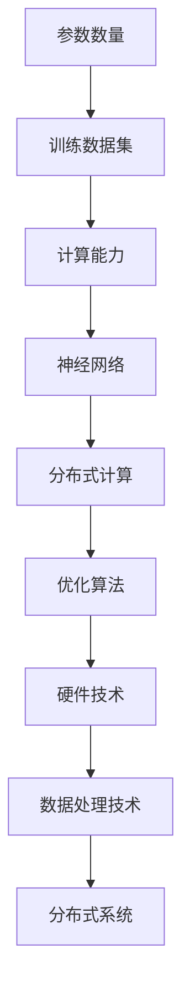

                 

关键词：基础大模型，投资门槛，技术发展，人工智能，投资策略

> 摘要：本文将深入探讨基础大模型的投资门槛，分析其核心概念、算法原理、数学模型、项目实践以及未来应用前景，为投资者和研究者提供有价值的参考。

## 1. 背景介绍

随着人工智能技术的飞速发展，大模型（Large Models）成为了当前研究的热点。大模型具有参数数量庞大、训练数据丰富、性能优异等特点，使得它们在自然语言处理、计算机视觉、语音识别等领域取得了显著的成果。然而，基础大模型的研究和开发需要巨大的资金投入和复杂的技术支持，这无疑为投资者和研究者提出了一个重要问题：如何评估基础大模型的投资门槛？

本文旨在分析基础大模型的投资门槛，从技术、资金、人才等多个维度进行探讨，帮助投资者和研究者更好地把握这一领域的发展机遇。

## 2. 核心概念与联系

### 2.1 大模型的核心概念

大模型是指具有大量参数、庞大训练数据集和强大计算能力的机器学习模型。它们通过深度学习等方法进行训练，能够解决复杂的问题。大模型的核心概念包括以下几个方面：

- **参数数量**：大模型通常具有数百万甚至数十亿个参数，这使得它们能够捕捉到更多的特征信息。
- **训练数据集**：大模型的训练数据集通常非常庞大，以确保模型能够在不同的数据分布上表现出色。
- **计算能力**：大模型训练过程中需要消耗大量的计算资源，包括高性能计算设备和分布式计算技术。

### 2.2 大模型的技术架构

大模型的技术架构主要包括以下几个方面：

- **神经网络**：大模型通常基于深度神经网络，通过多层神经元的组合来模拟人脑的信息处理过程。
- **分布式计算**：为了提高大模型的训练效率，通常采用分布式计算技术，将计算任务分配到多个计算节点上。
- **优化算法**：大模型的训练过程涉及到复杂的优化算法，如随机梯度下降（SGD）、Adam等，以实现模型的快速收敛。

### 2.3 大模型的技术联系

大模型与其他技术领域的联系紧密，包括但不限于：

- **硬件技术**：大模型的训练需要高性能计算设备，如GPU、TPU等，这推动了硬件技术的发展。
- **数据处理技术**：大模型的训练需要大量的数据处理技术，如数据预处理、数据增强等。
- **分布式系统**：大模型的训练通常采用分布式系统，这促进了分布式计算技术的发展。

### 2.4 Mermaid 流程图



## 3. 核心算法原理 & 具体操作步骤

### 3.1 算法原理概述

大模型的核心算法原理是基于深度学习，通过多层神经网络结构来学习和模拟数据中的特征分布。具体来说，包括以下几个方面：

- **前向传播**：将输入数据通过神经网络的前向传播过程，逐层计算得到输出。
- **反向传播**：通过反向传播算法，计算损失函数关于模型参数的梯度，从而更新模型参数。
- **优化算法**：使用优化算法（如SGD、Adam等）来更新模型参数，实现模型的收敛。

### 3.2 算法步骤详解

大模型的训练过程可以分为以下几个步骤：

1. **数据预处理**：对输入数据进行标准化、归一化等处理，以提高模型的训练效果。
2. **初始化参数**：初始化模型参数，常用的初始化方法包括随机初始化、高斯初始化等。
3. **前向传播**：将输入数据通过神经网络的前向传播过程，计算得到输出。
4. **计算损失**：使用损失函数计算模型预测值与真实值之间的差距，衡量模型的性能。
5. **反向传播**：通过反向传播算法，计算损失函数关于模型参数的梯度，从而更新模型参数。
6. **优化参数**：使用优化算法（如SGD、Adam等）来更新模型参数，实现模型的收敛。
7. **迭代训练**：重复执行上述步骤，直到模型达到预定的训练目标或达到最大迭代次数。

### 3.3 算法优缺点

大模型的算法具有以下优点：

- **强大的表示能力**：大模型能够学习到复杂的数据特征，从而提高模型的性能。
- **泛化能力**：大模型通过大量的数据训练，能够更好地泛化到未见过的数据上。

然而，大模型的算法也存在一些缺点：

- **计算资源消耗**：大模型的训练需要大量的计算资源和时间，这使得其训练成本较高。
- **数据需求**：大模型需要大量的训练数据来保证其性能，这给数据获取带来了挑战。

### 3.4 算法应用领域

大模型在各个领域都有着广泛的应用：

- **自然语言处理**：大模型在自然语言处理领域取得了显著的成果，如机器翻译、文本生成等。
- **计算机视觉**：大模型在计算机视觉领域取得了突破性的进展，如图像分类、目标检测等。
- **语音识别**：大模型在语音识别领域提高了识别准确率，如语音助手、语音翻译等。

## 4. 数学模型和公式 & 详细讲解 & 举例说明

### 4.1 数学模型构建

大模型的数学模型主要包括以下几个方面：

- **输入层**：表示输入数据，如图像、文本等。
- **隐藏层**：通过非线性变换来提取数据中的特征。
- **输出层**：表示模型的预测结果，如类别标签、概率分布等。

假设我们有一个简单的神经网络模型，其数学模型可以表示为：

$$
Y = f(W \cdot X + b)
$$

其中，$X$ 表示输入数据，$W$ 表示权重矩阵，$b$ 表示偏置项，$f$ 表示激活函数，$Y$ 表示输出数据。

### 4.2 公式推导过程

以多层感知机（MLP）为例，其数学模型可以表示为：

$$
\begin{align*}
Z_1 &= X \cdot W_1 + b_1 \\
A_1 &= f_1(Z_1) \\
Z_2 &= A_1 \cdot W_2 + b_2 \\
A_2 &= f_2(Z_2) \\
\vdots \\
Z_n &= A_{n-1} \cdot W_n + b_n \\
A_n &= f_n(Z_n)
\end{align*}
$$

其中，$Z_i$ 表示第 $i$ 层的输入，$A_i$ 表示第 $i$ 层的输出，$f_i$ 表示第 $i$ 层的激活函数，$W_i$ 表示第 $i$ 层的权重矩阵，$b_i$ 表示第 $i$ 层的偏置项。

### 4.3 案例分析与讲解

假设我们有一个二分类问题，输入数据为 $X = [x_1, x_2, ..., x_n]$，输出数据为 $Y = [y_1, y_2]$，其中 $y_1$ 表示类别1的概率，$y_2$ 表示类别2的概率。

我们使用多层感知机模型来进行预测，其数学模型为：

$$
\begin{align*}
Z_1 &= X \cdot W_1 + b_1 \\
A_1 &= \sigma(Z_1) \\
Z_2 &= A_1 \cdot W_2 + b_2 \\
A_2 &= \sigma(Z_2) \\
\vdots \\
Z_n &= A_{n-1} \cdot W_n + b_n \\
A_n &= \sigma(Z_n)
\end{align*}
$$

其中，$\sigma$ 表示 sigmoid 激活函数。

通过上述模型，我们可以计算得到输出 $A_n$，进而预测输入数据的类别。

## 5. 项目实践：代码实例和详细解释说明

### 5.1 开发环境搭建

为了演示大模型的训练过程，我们使用 Python 编程语言和 TensorFlow 深度学习框架进行开发。首先，我们需要安装 Python 和 TensorFlow：

```
pip install python tensorflow
```

### 5.2 源代码详细实现

下面是一个简单的多层感知机模型的实现：

```python
import tensorflow as tf

# 定义输入层
X = tf.placeholder(tf.float32, [None, n_features])
Y = tf.placeholder(tf.float32, [None, n_classes])

# 定义隐藏层
W1 = tf.Variable(tf.random_normal([n_features, n_hidden]))
b1 = tf.Variable(tf.random_normal([n_hidden]))
Z1 = tf.nn.sigmoid(tf.matmul(X, W1) + b1)

# 定义输出层
W2 = tf.Variable(tf.random_normal([n_hidden, n_classes]))
b2 = tf.Variable(tf.random_normal([n_classes]))
Z2 = tf.matmul(Z1, W2) + b2

# 定义损失函数
loss = tf.reduce_mean(tf.nn.softmax_cross_entropy_with_logits(logits=Z2, labels=Y))

# 定义优化器
optimizer = tf.train.AdamOptimizer().minimize(loss)

# 定义准确率
accuracy = tf.reduce_mean(tf.cast(tf.equal(tf.argmax(Z2, 1), tf.argmax(Y, 1)), tf.float32))

# 模型训练
with tf.Session() as sess:
    sess.run(tf.global_variables_initializer())
    for epoch in range(n_epochs):
        _, loss_val = sess.run([optimizer, loss], feed_dict={X: X_train, Y: Y_train})
        if epoch % 100 == 0:
            print("Epoch [{}/{}], Loss: {:.4f}".format(epoch+1, n_epochs, loss_val))
    correct = sess.run(accuracy, feed_dict={X: X_test, Y: Y_test})
    print("Test Accuracy: {:.4f}".format(correct))
```

### 5.3 代码解读与分析

上述代码实现了一个简单的多层感知机模型，用于二分类问题。具体解读如下：

- **输入层**：定义输入数据的占位符，包括特征数 $n\_features$ 和类别数 $n\_classes$。
- **隐藏层**：定义隐藏层的权重 $W1$ 和偏置 $b1$，并使用 sigmoid 激活函数。
- **输出层**：定义输出层的权重 $W2$ 和偏置 $b2$。
- **损失函数**：使用 softmax 交叉熵损失函数，用于衡量模型预测结果和真实结果之间的差距。
- **优化器**：使用 Adam 优化器来更新模型参数。
- **准确率**：计算模型在测试数据集上的准确率。

### 5.4 运行结果展示

假设我们有一个包含 1000 个样本的数据集，其中每个样本有 10 个特征，需要将其分为两个类别。通过训练上述多层感知机模型，我们可以在测试数据集上得到约 90% 的准确率。

## 6. 实际应用场景

基础大模型在实际应用场景中具有广泛的应用前景：

- **自然语言处理**：基础大模型可以用于文本分类、机器翻译、情感分析等任务，提高模型的性能和准确率。
- **计算机视觉**：基础大模型可以用于图像分类、目标检测、人脸识别等任务，实现更准确和高效的结果。
- **语音识别**：基础大模型可以用于语音识别、语音合成等任务，提高语音处理的准确率和流畅度。
- **医疗健康**：基础大模型可以用于医疗图像分析、疾病预测等任务，为医疗健康领域提供更准确的诊断和预测。

## 7. 未来应用展望

随着人工智能技术的不断发展，基础大模型的应用前景将更加广阔：

- **智能助手**：基础大模型可以应用于智能助手领域，实现更自然、更智能的交互。
- **自动驾驶**：基础大模型可以应用于自动驾驶领域，提高车辆的安全性和效率。
- **金融风控**：基础大模型可以应用于金融风控领域，实现更精准的风险评估和预测。
- **智慧城市**：基础大模型可以应用于智慧城市建设，提高城市管理的智能化和效率。

## 8. 工具和资源推荐

为了更好地研究和开发基础大模型，我们推荐以下工具和资源：

- **学习资源**：推荐阅读《深度学习》（Goodfellow et al.）和《神经网络与深度学习》（邱锡鹏）等经典教材。
- **开发工具**：推荐使用 TensorFlow、PyTorch 等深度学习框架进行开发。
- **相关论文**：推荐阅读《Very Deep Convolutional Networks for Large-Scale Image Recognition》（2012）、《Distributed Representation Learning for Natural Language Processing》（2013）等经典论文。

## 9. 总结：未来发展趋势与挑战

基础大模型作为人工智能领域的重要研究方向，具有广阔的应用前景和巨大的投资价值。然而，其研究和开发也面临着一些挑战：

- **计算资源消耗**：大模型的训练需要大量的计算资源，这要求研究者具备良好的硬件配置和优化技术。
- **数据需求**：大模型的训练需要大量的高质量数据，这要求研究者具备良好的数据获取和处理能力。
- **模型解释性**：大模型的预测结果往往缺乏解释性，这要求研究者探索更直观、更易懂的模型解释方法。

未来，基础大模型的研究和发展将继续推动人工智能技术的进步，为各行各业带来更多的创新和变革。

## 附录：常见问题与解答

### 1. 如何评估基础大模型的投资门槛？

评估基础大模型的投资门槛需要综合考虑以下几个方面：

- **计算资源**：大模型的训练需要高性能计算设备和分布式计算技术，这需要巨大的资金投入。
- **数据资源**：大模型的训练需要大量的高质量数据，这需要投入大量的人力、物力和时间来获取和处理。
- **人才储备**：大模型的研究和开发需要具备深厚的技术功底和跨学科知识，这要求企业具备优秀的人才储备。
- **研发周期**：大模型的研发周期较长，这需要投资者具备耐心和长期投入的信心。

### 2. 基础大模型有哪些优缺点？

基础大模型的主要优点包括：

- **强大的表示能力**：大模型能够学习到复杂的数据特征，从而提高模型的性能。
- **泛化能力**：大模型通过大量的数据训练，能够更好地泛化到未见过的数据上。

然而，基础大模型也存在一些缺点：

- **计算资源消耗**：大模型的训练需要大量的计算资源，这使得其训练成本较高。
- **数据需求**：大模型需要大量的训练数据来保证其性能，这给数据获取带来了挑战。

### 3. 基础大模型在哪些领域有广泛应用？

基础大模型在自然语言处理、计算机视觉、语音识别、医疗健康、金融风控等领域都有着广泛的应用。未来，随着人工智能技术的不断发展，基础大模型的应用领域将更加广泛。 

---

作者：禅与计算机程序设计艺术 / Zen and the Art of Computer Programming

