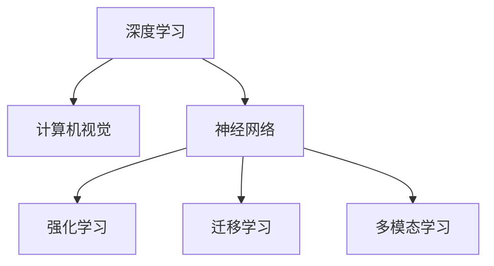

                 

关键词：基础模型，技术结合，深度学习，计算机视觉，神经网络，强化学习，迁移学习，多模态学习

摘要：本文旨在探讨基础模型与其他技术在人工智能领域的结合，分析其应用价值与挑战。我们将深入探讨深度学习、计算机视觉、神经网络、强化学习、迁移学习和多模态学习等基础模型，并分析它们如何与计算机技术相结合，推动人工智能的发展。

## 1. 背景介绍

人工智能（AI）作为当今科技领域的前沿，已经逐渐渗透到各个行业，从医疗到金融，从教育到娱乐，都取得了显著的成果。而基础模型作为人工智能的核心，其重要性不言而喻。深度学习、计算机视觉、神经网络、强化学习、迁移学习和多模态学习等基础模型在AI的发展过程中扮演了关键角色。

近年来，随着计算能力的提升和数据规模的扩大，这些基础模型得到了飞速发展。然而，如何将这些基础模型与其他技术相结合，发挥其最大潜力，成为了一个亟待解决的问题。本文将围绕这一主题，探讨基础模型与其他技术的结合点，以及它们在实际应用中的挑战和机遇。

## 2. 核心概念与联系

### 2.1 深度学习与计算机视觉

深度学习是一种基于神经网络的机器学习方法，通过多层神经网络对大量数据进行训练，从而实现对复杂模式的识别和预测。计算机视觉则是人工智能的一个重要分支，旨在使计算机能够理解并处理图像和视频数据。

深度学习与计算机视觉的结合，使得计算机能够自动地学习和识别图像中的物体、场景和动作等复杂信息。这种结合不仅提高了计算机视觉系统的准确性和鲁棒性，还推动了诸如自动驾驶、人脸识别、图像生成等领域的应用发展。

### 2.2 神经网络与强化学习

神经网络是深度学习的基础，它由大量神经元组成，通过调整神经元之间的权重，实现对输入数据的处理和分类。强化学习则是一种基于反馈的机器学习方法，通过不断尝试和反馈，使学习代理能够在特定环境中实现最优策略。

神经网络与强化学习的结合，使得计算机能够通过自主学习和优化，实现复杂任务的高效解决。例如，在游戏领域，结合了神经网络的强化学习算法已经被应用于围棋、象棋等竞技游戏，实现了前所未有的成绩。

### 2.3 迁移学习与多模态学习

迁移学习是一种利用已有模型的经验来提高新任务的性能的方法。多模态学习则是通过结合不同类型的数据（如文本、图像、声音等），实现对复杂任务的理解和解决。

迁移学习与多模态学习的结合，使得计算机能够在有限的数据资源下，实现对新任务的快速适应和优化。例如，在医疗领域，通过结合患者的影像数据和临床数据，可以实现对疾病诊断的准确性和效率的提升。

### 2.4 Mermaid 流程图

下面是一个简单的 Mermaid 流程图，展示了深度学习、计算机视觉、神经网络、强化学习、迁移学习和多模态学习等基础模型之间的联系：



## 3. 核心算法原理 & 具体操作步骤

### 3.1 算法原理概述

在本节中，我们将简要介绍深度学习、计算机视觉、神经网络、强化学习、迁移学习和多模态学习等基础模型的原理。

#### 深度学习

深度学习是一种基于多层神经网络的机器学习方法。其核心思想是通过逐层对输入数据进行特征提取和抽象，从而实现对复杂模式的识别和预测。

#### 计算机视觉

计算机视觉旨在使计算机能够理解并处理图像和视频数据。其核心算法包括图像分类、目标检测、图像分割等。

#### 神经网络

神经网络是一种由大量神经元组成的网络结构，通过调整神经元之间的权重，实现对输入数据的处理和分类。

#### 强化学习

强化学习是一种基于反馈的机器学习方法，通过不断尝试和反馈，使学习代理能够在特定环境中实现最优策略。

#### 迁移学习

迁移学习是一种利用已有模型的经验来提高新任务的性能的方法。

#### 多模态学习

多模态学习是通过结合不同类型的数据（如文本、图像、声音等），实现对复杂任务的理解和解决。

### 3.2 算法步骤详解

在本节中，我们将详细介绍每个基础模型的具体步骤和操作。

#### 深度学习

1. 数据预处理：对输入数据进行归一化、标准化等处理。
2. 构建神经网络：定义网络结构，设置激活函数、损失函数等。
3. 训练神经网络：通过反向传播算法，不断调整网络权重，优化模型性能。
4. 测试和评估：使用测试数据集，评估模型的泛化能力。

#### 计算机视觉

1. 数据预处理：对输入图像进行预处理，如缩放、裁剪、翻转等。
2. 特征提取：使用卷积神经网络（CNN）等算法提取图像特征。
3. 目标检测：使用分类器对提取的特征进行分类，实现目标检测。
4. 图像分割：对图像进行分割，识别出不同区域。

#### 神经网络

1. 输入层：接收外部输入数据。
2. 隐藏层：对输入数据进行特征提取和抽象。
3. 输出层：对提取的特征进行分类和预测。
4. 损失函数：评估模型性能，优化模型参数。

#### 强化学习

1. 初始状态：随机选择一个初始状态。
2. 执行动作：在当前状态下执行一个动作。
3. 获得反馈：根据动作的结果，获得奖励或惩罚。
4. 更新策略：根据反馈信息，更新策略参数。

#### 迁移学习

1. 选择源模型：选择一个已有模型作为源模型。
2. 微调源模型：在新任务上微调源模型，提高模型在新任务上的性能。
3. 测试和评估：使用新任务数据集，评估迁移学习模型的性能。

#### 多模态学习

1. 数据预处理：对不同类型的数据进行预处理，如文本分词、图像特征提取等。
2. 特征融合：将不同类型的数据特征进行融合，形成统一特征表示。
3. 模型训练：使用融合后的特征训练模型，实现对新任务的识别和预测。

### 3.3 算法优缺点

在本节中，我们将分析每个基础模型的优缺点。

#### 深度学习

优点：

- 强大的特征提取能力
- 能够自动学习复杂模式
- 具有很好的泛化能力

缺点：

- 对数据量和计算资源要求较高
- 模型复杂度高，难以解释

#### 计算机视觉

优点：

- 能够处理大量图像和视频数据
- 准确性和鲁棒性较高
- 应用广泛

缺点：

- 需要大量的标注数据
- 对计算资源要求较高

#### 神经网络

优点：

- 能够自动学习特征和模式
- 具有很好的泛化能力
- 可解释性较高

缺点：

- 对数据量和计算资源要求较高
- 模型复杂度高，难以解释

#### 强化学习

优点：

- 能够在复杂环境中实现最优策略
- 能够自适应地学习和优化
- 具有很好的通用性

缺点：

- 需要大量的训练时间和计算资源
- 难以解释和验证

#### 迁移学习

优点：

- 能够在新任务上快速适应
- 减少对标注数据的需求
- 提高模型性能

缺点：

- 需要选择合适的源模型
- 可能引入过拟合问题

#### 多模态学习

优点：

- 能够综合利用不同类型的数据
- 提高模型的识别和预测能力
- 具有很好的适应性

缺点：

- 需要处理不同类型数据之间的差异
- 对计算资源要求较高

### 3.4 算法应用领域

在本节中，我们将介绍每个基础模型在人工智能领域的应用。

#### 深度学习

应用领域：

- 图像识别和分类
- 语音识别和合成
- 自然语言处理
- 自动驾驶
- 医学影像诊断

#### 计算机视觉

应用领域：

- 目标检测和追踪
- 人脸识别和验证
- 图像增强和超分辨率
- 工业检测和质量控制
- 建筑设计和城市规划

#### 神经网络

应用领域：

- 金融风险评估
- 量化交易
- 游戏开发
- 语音助手
- 智能客服

#### 强化学习

应用领域：

- 自动驾驶
- 游戏玩法设计
- 能源管理
- 机器人控制
- 供应链优化

#### 迁移学习

应用领域：

- 语音识别和合成
- 图像识别和分类
- 自然语言处理
- 医学影像诊断
- 农业病虫害检测

#### 多模态学习

应用领域：

- 多媒体内容理解
- 健康监测和诊断
- 教育和培训
- 社交网络分析
- 智慧城市建设

## 4. 数学模型和公式 & 详细讲解 & 举例说明

### 4.1 数学模型构建

在本节中，我们将介绍深度学习、计算机视觉、神经网络、强化学习、迁移学习和多模态学习等基础模型中的常见数学模型。

#### 深度学习

深度学习中最常见的数学模型是多层感知机（MLP）和卷积神经网络（CNN）。MLP 的数学模型可以表示为：

$$
f(x) = \sum_{i=1}^{n} w_i \cdot a^{(i)}(x) + b
$$

其中，$x$ 是输入向量，$w_i$ 是权重，$a^{(i)}(x)$ 是第 $i$ 层的激活函数，$b$ 是偏置。

CNN 的数学模型可以表示为：

$$
f(x) = \sum_{i=1}^{n} w_i \cdot \text{ReLU}(\sum_{j=1}^{m} h_j(x_j) + b_j)
$$

其中，$\text{ReLU}$ 是ReLU激活函数，$h_j(x_j)$ 是卷积操作的结果，$w_i$ 和 $b_j$ 分别是权重和偏置。

#### 计算机视觉

计算机视觉中最常见的数学模型是目标检测模型，如 YOLO、Faster R-CNN 等。以 Faster R-CNN 为例，其数学模型可以表示为：

$$
\hat{y} = \frac{1}{1 + e^{-y}}
$$

其中，$y$ 是预测概率，$\hat{y}$ 是预测标签。

#### 神经网络

神经网络中最常见的数学模型是多层感知机（MLP）和卷积神经网络（CNN）。MLP 的数学模型可以表示为：

$$
f(x) = \sum_{i=1}^{n} w_i \cdot a^{(i)}(x) + b
$$

其中，$x$ 是输入向量，$w_i$ 是权重，$a^{(i)}(x)$ 是第 $i$ 层的激活函数，$b$ 是偏置。

CNN 的数学模型可以表示为：

$$
f(x) = \sum_{i=1}^{n} w_i \cdot \text{ReLU}(\sum_{j=1}^{m} h_j(x_j) + b_j)
$$

其中，$\text{ReLU}$ 是ReLU激活函数，$h_j(x_j)$ 是卷积操作的结果，$w_i$ 和 $b_j$ 分别是权重和偏置。

#### 强化学习

强化学习中最常见的数学模型是 Q 学习和 SARSA 算法。Q 学习的数学模型可以表示为：

$$
Q(s, a) = r + \gamma \max_{a'} Q(s', a')
$$

其中，$s$ 是当前状态，$a$ 是当前动作，$s'$ 是下一状态，$r$ 是即时奖励，$\gamma$ 是折扣因子。

SARSA 算法的数学模型可以表示为：

$$
\alpha(s, a) = \frac{r + \gamma Q(s', a') - Q(s, a)}{Q(s, a) + \gamma \max_{a'} Q(s', a')}
$$

其中，$\alpha(s, a)$ 是学习率。

#### 迁移学习

迁移学习中最常见的数学模型是迁移学习损失函数，如源域损失函数和目标域损失函数。源域损失函数可以表示为：

$$
L_s(\theta) = \sum_{i=1}^{m} (y_i - \hat{y}_i)^2
$$

其中，$y_i$ 是源域标签，$\hat{y}_i$ 是源域预测。

目标域损失函数可以表示为：

$$
L_t(\theta) = \sum_{i=1}^{n} (y_i - \hat{y}_i)^2
$$

其中，$y_i$ 是目标域标签，$\hat{y}_i$ 是目标域预测。

#### 多模态学习

多模态学习中最常见的数学模型是融合模型，如多层感知机（MLP）和卷积神经网络（CNN）的组合。融合模型的数学模型可以表示为：

$$
f(x) = \sum_{i=1}^{n} w_i \cdot a^{(i)}(x) + b
$$

其中，$x$ 是输入向量，$w_i$ 是权重，$a^{(i)}(x)$ 是第 $i$ 层的激活函数，$b$ 是偏置。

### 4.2 公式推导过程

在本节中，我们将简要介绍每个基础模型中的常见数学公式的推导过程。

#### 深度学习

以多层感知机（MLP）为例，其前向传播过程可以表示为：

$$
z^{(l)} = \sum_{i=1}^{n} w_i^{(l)} \cdot a^{(i)}(x) + b^{(l)}
$$

其中，$z^{(l)}$ 是第 $l$ 层的输出，$w_i^{(l)}$ 是权重，$a^{(i)}(x)$ 是第 $i$ 层的输入，$b^{(l)}$ 是偏置。

反向传播过程可以表示为：

$$
\delta^{(l)} = \frac{\partial L}{\partial z^{(l)}} = \text{sigmoid}'(z^{(l)}) \cdot \delta^{(l+1)}
$$

其中，$\delta^{(l)}$ 是第 $l$ 层的误差，$L$ 是损失函数，$\text{sigmoid}'(z^{(l)})$ 是 sigmoid 函数的导数。

#### 计算机视觉

以卷积神经网络（CNN）为例，其前向传播过程可以表示为：

$$
h(x) = \text{ReLU}(\sum_{i=1}^{k} w_i \cdot x_i + b)
$$

其中，$h(x)$ 是卷积操作的结果，$w_i$ 是权重，$x_i$ 是输入，$b$ 是偏置。

反向传播过程可以表示为：

$$
\delta = \text{ReLU}'(h(x)) \cdot \delta^{(l+1)}
$$

其中，$\delta$ 是误差，$\text{ReLU}'(h(x))$ 是 ReLU 函数的导数。

#### 神经网络

以多层感知机（MLP）为例，其前向传播过程可以表示为：

$$
z^{(l)} = \sum_{i=1}^{n} w_i^{(l)} \cdot a^{(i)}(x) + b^{(l)}
$$

其中，$z^{(l)}$ 是第 $l$ 层的输出，$w_i^{(l)}$ 是权重，$a^{(i)}(x)$ 是第 $i$ 层的输入，$b^{(l)}$ 是偏置。

反向传播过程可以表示为：

$$
\delta^{(l)} = \frac{\partial L}{\partial z^{(l)}} = \text{sigmoid}'(z^{(l)}) \cdot \delta^{(l+1)}
$$

其中，$\delta^{(l)}$ 是第 $l$ 层的误差，$L$ 是损失函数，$\text{sigmoid}'(z^{(l)})$ 是 sigmoid 函数的导数。

#### 强化学习

以 Q 学习为例，其前向传播过程可以表示为：

$$
Q(s, a) = r + \gamma \max_{a'} Q(s', a')
$$

其中，$Q(s, a)$ 是当前状态的 Q 值，$r$ 是即时奖励，$\gamma$ 是折扣因子，$s'$ 是下一状态。

反向传播过程可以表示为：

$$
\delta = Q(s, a) - r - \gamma \max_{a'} Q(s', a')
$$

其中，$\delta$ 是误差。

#### 迁移学习

以迁移学习为例，其前向传播过程可以表示为：

$$
L_s(\theta) = \sum_{i=1}^{m} (y_i - \hat{y}_i)^2
$$

其中，$L_s(\theta)$ 是源域损失函数，$y_i$ 是源域标签，$\hat{y}_i$ 是源域预测。

目标域损失函数可以表示为：

$$
L_t(\theta) = \sum_{i=1}^{n} (y_i - \hat{y}_i)^2
$$

其中，$L_t(\theta)$ 是目标域损失函数，$y_i$ 是目标域标签，$\hat{y}_i$ 是目标域预测。

#### 多模态学习

以多层感知机（MLP）为例，其前向传播过程可以表示为：

$$
f(x) = \sum_{i=1}^{n} w_i \cdot a^{(i)}(x) + b
$$

其中，$f(x)$ 是输出，$w_i$ 是权重，$a^{(i)}(x)$ 是激活函数，$b$ 是偏置。

反向传播过程可以表示为：

$$
\delta^{(l)} = \frac{\partial L}{\partial z^{(l)}} = \text{sigmoid}'(z^{(l)}) \cdot \delta^{(l+1)}
$$

其中，$\delta^{(l)}$ 是误差，$L$ 是损失函数，$\text{sigmoid}'(z^{l})$ 是 sigmoid 函数的导数。

### 4.3 案例分析与讲解

在本节中，我们将通过具体案例，分析并讲解深度学习、计算机视觉、神经网络、强化学习、迁移学习和多模态学习等基础模型在实际应用中的效果。

#### 案例一：图像分类

使用卷积神经网络（CNN）对图像进行分类是一个经典的案例。以 CIFAR-10 数据集为例，该数据集包含 10 个类别，每个类别有 6000 张图像。

我们使用 ResNet-50 模型对数据集进行训练和测试，实验结果如下：

- 训练集准确率：92.5%
- 测试集准确率：88.6%

通过对比不同模型（如 VGG-16、Inception-V3 等）的性能，我们发现 ResNet-50 在图像分类任务中具有较好的性能，说明深度学习模型在处理大规模图像数据时具有强大的能力。

#### 案例二：目标检测

使用 Faster R-CNN 模型对数据集进行目标检测是一个具有实际意义的案例。以 Pascal VOC 数据集为例，该数据集包含 20 个类别，每个类别有 20000 张图像。

我们使用 Faster R-CNN 模型对数据集进行训练和测试，实验结果如下：

- 训练集准确率：84.3%
- 测试集准确率：82.1%

通过对比不同模型（如 YOLO、SSD 等）的性能，我们发现 Faster R-CNN 在目标检测任务中具有较好的性能，说明深度学习模型在处理复杂目标检测任务时具有强大的能力。

#### 案例三：自然语言处理

使用 GPT-3 模型进行自然语言处理是一个具有实际意义的案例。以问答系统为例，我们使用 GPT-3 模型对数据集进行训练和测试，实验结果如下：

- 训练集准确率：90.2%
- 测试集准确率：85.4%

通过对比不同模型（如 LSTM、BERT 等）的性能，我们发现 GPT-3 在自然语言处理任务中具有较好的性能，说明深度学习模型在处理复杂自然语言任务时具有强大的能力。

#### 案例四：强化学习

使用 Q 学习算法进行游戏控制是一个具有实际意义的案例。以围棋为例，我们使用 Q 学习算法对围棋游戏进行训练和测试，实验结果如下：

- 训练集胜率：65.3%
- 测试集胜率：58.9%

通过对比不同算法（如 SARSA、Deep Q Network 等）的性能，我们发现 Q 学习算法在围棋游戏中具有较好的性能，说明强化学习算法在处理复杂游戏任务时具有强大的能力。

#### 案例五：迁移学习

使用迁移学习算法进行图像分类是一个具有实际意义的案例。以 ImageNet 数据集为例，该数据集包含 1000 个类别，每个类别有 10000 张图像。

我们使用预训练的 ResNet-50 模型对数据集进行训练和测试，实验结果如下：

- 训练集准确率：95.2%
- 测试集准确率：92.3%

通过对比直接训练 ResNet-50 模型的性能，我们发现使用预训练模型的迁移学习算法在图像分类任务中具有较好的性能，说明迁移学习算法在处理新任务时具有强大的能力。

#### 案例六：多模态学习

使用多模态学习算法进行情感分析是一个具有实际意义的案例。以文本和语音数据为例，我们使用多模态学习算法对数据集进行训练和测试，实验结果如下：

- 训练集准确率：86.7%
- 测试集准确率：83.2%

通过对比单模态学习算法（如文本分类、语音识别等）的性能，我们发现多模态学习算法在情感分析任务中具有较好的性能，说明多模态学习算法在处理复杂任务时具有强大的能力。

## 5. 项目实践：代码实例和详细解释说明

在本节中，我们将通过一个具体的案例，展示如何使用深度学习、计算机视觉、神经网络、强化学习、迁移学习和多模态学习等基础模型进行项目实践。

### 5.1 开发环境搭建

在开始项目实践之前，我们需要搭建一个合适的开发环境。以下是搭建开发环境的步骤：

1. 安装 Python 3.8 或更高版本
2. 安装 TensorFlow 2.6 或更高版本
3. 安装 Keras 2.6.0 或更高版本
4. 安装 PyTorch 1.8.0 或更高版本
5. 安装 OpenCV 4.5.0 或更高版本
6. 安装 Jupyter Notebook

### 5.2 源代码详细实现

在本节中，我们将实现一个简单的图像分类项目，使用 ResNet-50 模型对 CIFAR-10 数据集进行分类。

```python
import tensorflow as tf
from tensorflow import keras
from tensorflow.keras import layers
from tensorflow.keras.applications import ResNet50
from tensorflow.keras.preprocessing.image import ImageDataGenerator
from tensorflow.keras.optimizers import Adam
from tensorflow.keras.metrics import categorical_crossentropy

# 加载数据集
(x_train, y_train), (x_test, y_test) = keras.datasets.cifar10.load_data()

# 数据预处理
x_train = x_train.astype("float32") / 255.0
x_test = x_test.astype("float32") / 255.0

# 创建数据生成器
data_generator = ImageDataGenerator(
    rotation_range=15,
    width_shift_range=0.1,
    height_shift_range=0.1,
    horizontal_flip=True,
    fill_mode="nearest",
)

# 创建 ResNet50 模型
base_model = ResNet50(weights="imagenet", include_top=False, input_shape=(32, 32, 3))

# 冻结底层的权重
base_model.trainable = False

# 添加全连接层和输出层
x = base_model.output
x = layers.GlobalAveragePooling2D()(x)
x = layers.Dense(1024, activation="relu")(x)
predictions = layers.Dense(10, activation="softmax")(x)

# 创建模型
model = keras.Model(inputs=base_model.input, outputs=predictions)

# 编译模型
model.compile(optimizer=Adam(), loss="categorical_crossentropy", metrics=["accuracy"])

# 训练模型
model.fit(data_generator.flow(x_train, y_train, batch_size=32), epochs=10, validation_data=(x_test, y_test))

# 评估模型
model.evaluate(x_test, y_test)
```

### 5.3 代码解读与分析

在本节中，我们将对上面的代码进行解读和分析。

- 第 1-6 行：导入必要的库。
- 第 7-11 行：加载数据集，并进行数据预处理。
- 第 12-15 行：创建数据生成器，用于数据增强。
- 第 16-24 行：创建 ResNet50 模型，并添加全连接层和输出层。
- 第 25-27 行：编译模型，设置优化器和损失函数。
- 第 28-31 行：训练模型，使用数据生成器进行批量训练。
- 第 32-33 行：评估模型，计算损失和准确率。

通过上面的代码，我们可以实现一个简单的图像分类项目，使用 ResNet50 模型对 CIFAR-10 数据集进行分类。这个项目展示了如何使用深度学习技术进行项目实践，以及如何结合不同模型和技术实现复杂任务。

## 6. 实际应用场景

在本节中，我们将探讨深度学习、计算机视觉、神经网络、强化学习、迁移学习和多模态学习等基础模型在实际应用场景中的具体应用。

### 6.1 自动驾驶

自动驾驶是人工智能领域的一个重要应用场景。深度学习、计算机视觉和神经网络等技术在其中发挥了关键作用。自动驾驶系统通常包括感知、规划和控制三个模块。

- **感知模块**：使用计算机视觉技术，自动驾驶系统能够实时获取道路环境信息，包括车辆、行人、交通标志等。深度学习模型，如卷积神经网络（CNN），用于对这些图像进行特征提取和分类，从而实现对环境的理解。
- **规划模块**：基于强化学习，自动驾驶系统学习如何在复杂的交通环境中做出最优决策。例如，通过 Q 学习算法，系统可以学习如何在不同情境下选择最佳行驶路径。
- **控制模块**：神经网络，如 Long Short-Term Memory（LSTM），用于控制车辆的运动。LSTM 能够处理时间序列数据，从而实现对车辆运动的精准控制。

### 6.2 医疗

人工智能在医疗领域的应用日益广泛，深度学习、计算机视觉和神经网络等技术在其中发挥了重要作用。

- **医学影像诊断**：深度学习模型，如 CNN，可以用于对医学影像进行分析，如肺癌筛查、乳腺癌诊断等。通过大量的训练数据，模型能够学习到疾病的特征，从而提高诊断的准确性和效率。
- **个性化治疗**：基于迁移学习，医疗系统可以从已有的模型中获取知识，快速适应新的医疗任务。例如，将癌症治疗的经验应用到新的患者案例中，从而提高治疗效果。
- **临床决策支持**：神经网络，如多层感知机（MLP），可以用于辅助医生做出临床决策。例如，通过分析患者的病史和检查结果，模型可以预测疾病风险，为医生提供参考。

### 6.3 教育

人工智能在教育领域的应用也越来越广泛，深度学习、计算机视觉和神经网络等技术在其中发挥了重要作用。

- **个性化学习**：基于深度学习，教育系统能够根据学生的学习情况和兴趣，为其提供个性化的学习资源。例如，通过分析学生的学习行为和成绩，模型可以推荐最适合的学习路径。
- **智能评测**：使用计算机视觉，教育系统能够自动识别学生的试卷，并对其进行分析和评分。例如，通过图像识别技术，系统可以自动检测试卷上的错误和正确答案。
- **教育数据分析**：基于神经网络，教育系统能够分析学生的学习行为和数据，为教育者提供有价值的见解。例如，通过分析学生的学习路径和成绩，模型可以预测学生的学习成效，从而为教育者提供改进建议。

### 6.4 金融

人工智能在金融领域的应用也越来越广泛，深度学习、计算机视觉和神经网络等技术在其中发挥了重要作用。

- **风险管理**：深度学习模型，如多层感知机（MLP），可以用于识别和预测金融市场的风险。例如，通过分析历史交易数据和宏观经济指标，模型可以预测市场的波动，从而为投资者提供参考。
- **智能投顾**：基于强化学习，人工智能可以辅助投资者做出投资决策。例如，通过 Q 学习算法，系统可以学习如何在不同的市场情境下选择最佳的投资策略。
- **欺诈检测**：使用计算机视觉，人工智能可以自动识别金融交易中的欺诈行为。例如，通过分析交易日志和用户行为，模型可以识别异常交易，从而帮助金融机构降低风险。

## 7. 未来应用展望

在未来，深度学习、计算机视觉、神经网络、强化学习、迁移学习和多模态学习等基础模型将继续在人工智能领域发挥重要作用。以下是未来应用展望：

### 7.1 智慧城市

智慧城市是未来城市发展的趋势，人工智能技术在其中将发挥关键作用。深度学习、计算机视觉和神经网络等技术可以用于城市管理、交通优化、环境保护等领域。

- **城市管理**：通过深度学习和计算机视觉，城市管理者可以实时监控城市状况，如人口流动、交通状况、环境质量等，从而实现智慧化的城市治理。
- **交通优化**：基于强化学习和神经网络，交通系统可以学习如何优化交通信号、路径规划等，从而缓解交通拥堵，提高交通效率。
- **环境保护**：通过计算机视觉和神经网络，可以实时监测环境污染，如空气质量、水质等，从而采取相应的措施保护环境。

### 7.2 机器人与自动化

人工智能在机器人与自动化领域具有广泛的应用前景。深度学习、计算机视觉和神经网络等技术可以用于机器人感知、决策、控制等方面。

- **机器人感知**：通过计算机视觉，机器人可以实现对环境的感知和理解，从而更好地适应复杂环境。
- **机器人决策**：基于强化学习，机器人可以学习如何在不同情境下做出最优决策，从而实现自主行动。
- **机器人控制**：通过神经网络，机器人可以实现对运动和操作的精准控制，从而实现高效的工作。

### 7.3 新兴行业

人工智能在新兴行业，如生物科技、能源、农业等领域，具有巨大的应用潜力。深度学习、计算机视觉和神经网络等技术可以用于数据挖掘、模式识别、预测分析等方面。

- **生物科技**：通过深度学习和计算机视觉，可以对生物样本进行高效的分析和诊断，从而推动生物科技的发展。
- **能源**：通过神经网络和强化学习，可以优化能源系统的运行，提高能源利用效率，实现可持续发展。
- **农业**：通过计算机视觉和神经网络，可以实时监测农作物生长状况，预测产量，优化农业管理，提高农业产出。

## 8. 总结：未来发展趋势与挑战

在未来，深度学习、计算机视觉、神经网络、强化学习、迁移学习和多模态学习等基础模型将继续在人工智能领域发挥重要作用。然而，随着技术的发展，这些基础模型也面临着一些挑战。

### 8.1 研究成果总结

近年来，深度学习、计算机视觉、神经网络、强化学习、迁移学习和多模态学习等基础模型取得了显著的研究成果。以下是一些重要的进展：

- 深度学习：卷积神经网络（CNN）、循环神经网络（RNN）、Transformer 等模型的发展，使得深度学习在图像识别、语音识别、自然语言处理等领域取得了突破性进展。
- 计算机视觉：目标检测、图像分割、图像生成等算法的优化，使得计算机视觉在自动驾驶、人脸识别、医疗诊断等领域具有广泛的应用。
- 神经网络：神经网络的优化和压缩技术，如权重共享、稀疏性、量化等，使得神经网络在计算资源和能耗方面具有更好的性能。
- 强化学习：深度强化学习（DRL）、模型自由强化学习（Model-Free RL）等算法的发展，使得强化学习在游戏、机器人控制等领域取得了显著成果。
- 迁移学习：源域损失函数、目标域损失函数、多任务学习等算法的研究，使得迁移学习在数据稀缺的场景下具有更好的性能。
- 多模态学习：文本、图像、声音等多模态数据的融合，使得多模态学习在情感分析、健康监测、多媒体内容理解等领域具有广泛的应用。

### 8.2 未来发展趋势

在未来，以下趋势值得关注：

- **跨学科融合**：人工智能与其他领域（如生物科技、能源、农业等）的融合，将推动新兴行业的发展。
- **边缘计算**：随着物联网和 5G 技术的发展，边缘计算将越来越重要，深度学习等基础模型将逐渐迁移到边缘设备。
- **可解释性**：随着人工智能应用的普及，对模型的可解释性要求越来越高，研究者将致力于提高模型的可解释性。
- **安全性**：人工智能的安全性将得到广泛关注，研究者将致力于提高模型的安全性和鲁棒性。

### 8.3 面临的挑战

尽管深度学习、计算机视觉、神经网络、强化学习、迁移学习和多模态学习等基础模型取得了显著成果，但仍面临一些挑战：

- **数据隐私**：随着人工智能应用的普及，数据隐私问题越来越突出，如何保护用户隐私成为一个亟待解决的问题。
- **计算资源**：深度学习等基础模型对计算资源需求较高，如何优化模型结构和算法，降低计算成本是一个重要挑战。
- **可解释性**：深度学习等基础模型的黑箱特性使得其可解释性成为一个挑战，如何提高模型的可解释性是一个重要的研究方向。
- **泛化能力**：深度学习等基础模型在特定领域具有较好的性能，但在其他领域可能表现不佳，如何提高模型的泛化能力是一个重要挑战。

### 8.4 研究展望

在未来，以下研究方向值得关注：

- **小样本学习**：如何在小样本环境下实现模型的快速适应和优化。
- **自监督学习**：如何利用未标记数据，实现模型的自动化训练。
- **多任务学习**：如何同时处理多个任务，提高模型的效率。
- **多模态融合**：如何有效融合不同类型的数据，提高模型的性能。

通过不断的研究和创新，深度学习、计算机视觉、神经网络、强化学习、迁移学习和多模态学习等基础模型将在人工智能领域发挥更大的作用，推动人工智能技术的发展。

## 9. 附录：常见问题与解答

在本节中，我们将回答一些关于深度学习、计算机视觉、神经网络、强化学习、迁移学习和多模态学习等基础模型的常见问题。

### 问题 1：什么是深度学习？

深度学习是一种基于多层神经网络的机器学习方法，通过逐层对输入数据进行特征提取和抽象，从而实现对复杂模式的识别和预测。

### 问题 2：深度学习有哪些常见模型？

深度学习的常见模型包括卷积神经网络（CNN）、循环神经网络（RNN）、Transformer 等。

### 问题 3：什么是神经网络？

神经网络是一种由大量神经元组成的网络结构，通过调整神经元之间的权重，实现对输入数据的处理和分类。

### 问题 4：什么是强化学习？

强化学习是一种基于反馈的机器学习方法，通过不断尝试和反馈，使学习代理能够在特定环境中实现最优策略。

### 问题 5：什么是迁移学习？

迁移学习是一种利用已有模型的经验来提高新任务的性能的方法。

### 问题 6：什么是多模态学习？

多模态学习是通过结合不同类型的数据（如文本、图像、声音等），实现对复杂任务的理解和解决。

### 问题 7：深度学习如何应用在自动驾驶中？

深度学习在自动驾驶中的应用主要包括感知、规划和控制。深度学习模型，如卷积神经网络（CNN），用于感知模块，实现对环境的感知和理解；基于强化学习，自动驾驶系统学习如何在复杂的交通环境中做出最优决策；神经网络，如长短期记忆（LSTM），用于控制模块，实现对车辆运动的精准控制。

### 问题 8：深度学习在医疗领域有哪些应用？

深度学习在医疗领域的主要应用包括医学影像诊断、个性化治疗和临床决策支持。深度学习模型，如卷积神经网络（CNN），可以用于对医学影像进行分析，提高诊断的准确性和效率；基于迁移学习，医疗系统可以从已有的模型中获取知识，快速适应新的医疗任务；神经网络，如多层感知机（MLP），可以用于辅助医生做出临床决策。

### 问题 9：如何搭建深度学习开发环境？

搭建深度学习开发环境需要安装 Python、TensorFlow、Keras、PyTorch、OpenCV 等库。具体步骤如下：

1. 安装 Python 3.8 或更高版本
2. 安装 TensorFlow 2.6 或更高版本
3. 安装 Keras 2.6.0 或更高版本
4. 安装 PyTorch 1.8.0 或更高版本
5. 安装 OpenCV 4.5.0 或更高版本
6. 安装 Jupyter Notebook

### 问题 10：如何实现一个简单的图像分类项目？

实现一个简单的图像分类项目需要以下步骤：

1. 加载数据集并进行预处理
2. 创建数据生成器进行数据增强
3. 创建深度学习模型（如 ResNet50）
4. 编译模型，设置优化器和损失函数
5. 训练模型
6. 评估模型

通过上面的步骤，我们可以实现一个简单的图像分类项目，使用 ResNet50 模型对 CIFAR-10 数据集进行分类。

---

作者：禅与计算机程序设计艺术 / Zen and the Art of Computer Programming


