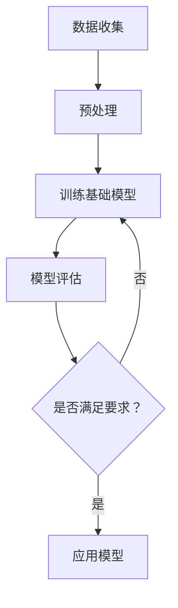

                 

## 1. 背景介绍

生物医学研究是现代科学的重要领域之一，它致力于探索生命现象、疾病机制以及治疗手段。随着科技的进步，人工智能（AI）逐渐成为生物医学研究的重要工具，特别是基础模型（Foundational Models）的出现，为这一领域带来了前所未有的变革。基础模型是指能够处理多种类型任务的强大通用模型，这些模型通常具有巨大的参数规模和广泛的适应性，可以在不同的领域中发挥作用。

近年来，基础模型在自然语言处理（NLP）、计算机视觉（CV）等AI子领域取得了显著成果。这些成功激发了生物医学研究人员尝试将基础模型应用于其研究领域。事实上，基础模型在生物医学研究中已经展示出了巨大的潜力，如药物发现、疾病预测、基因组分析等方面。然而，尽管前景广阔，但将基础模型应用于生物医学研究仍面临诸多挑战。

本文旨在探讨基础模型在生物医学研究中的应用，详细分析其核心概念、算法原理、数学模型以及实际应用案例。通过对这些内容的深入讨论，我们希望能够为生物医学研究人员提供有价值的参考，推动这一领域的进步。

## 2. 核心概念与联系

### 2.1 基础模型的基本概念

基础模型是一种高度泛化的深度学习模型，能够处理多种类型的任务。与传统的任务特定模型（如用于文本分类的模型）不同，基础模型具有更广泛的适应性和更强的学习能力。它们通常通过大规模的数据集进行训练，具有数十亿甚至数万亿个参数，这使得它们能够捕捉到数据中的复杂模式。基础模型的核心特点是其“通用性”和“强适应性”，这使得它们在处理未知任务时能够表现出色。

### 2.2 生物医学研究中的基础模型应用

生物医学研究涉及大量的数据，包括基因组数据、蛋白质结构数据、临床数据等。这些数据具有高度的结构复杂性，传统的方法难以有效地处理。而基础模型，由于其强大的表示能力和学习能力，能够有效地挖掘这些数据中的信息。例如，在药物发现领域，基础模型可以用于识别新的药物靶点、预测药物-靶点相互作用等。在基因组分析中，基础模型可以用于识别基因变异、预测基因功能等。

### 2.3 基础模型的架构与关键技术

基础模型的架构通常包括编码器（Encoder）和解码器（Decoder）两个部分。编码器负责将输入数据编码成高维表示，解码器则负责将这种表示解码成所需的形式，如文本、图像等。在训练过程中，基础模型通过优化模型参数，使得其对数据的表示能力不断提升。

关键的技术包括：

- **自监督学习（Self-supervised Learning）**：基础模型通常使用自监督学习方式进行训练，这意味着模型在训练过程中不需要外部监督信号，而是通过预测输入数据的某些部分来学习。

- **数据增强（Data Augmentation）**：为了提高模型的泛化能力，基础模型通常使用数据增强技术，如图像旋转、裁剪等，来扩充训练数据集。

- **多任务学习（Multi-task Learning）**：基础模型可以通过多任务学习同时处理多个任务，从而提高其泛化能力和学习能力。

### 2.4 Mermaid 流程图

下面是一个简单的Mermaid流程图，展示了基础模型在生物医学研究中的应用流程：



### 2.5 关键挑战与解决方案

尽管基础模型在生物医学研究中的应用前景广阔，但仍然面临一些挑战：

- **数据隐私问题**：生物医学数据通常包含敏感的个人健康信息，如何确保数据隐私是一个重要的挑战。解决方案包括数据匿名化、差分隐私等。

- **计算资源需求**：训练基础模型需要大量的计算资源，这对生物医学实验室可能是一个挑战。解决方案包括使用高性能计算集群、云服务等。

- **模型解释性**：基础模型通常被视为“黑盒”，其内部机制难以解释，这在需要解释性的生物医学领域中可能是一个问题。解决方案包括开发可解释的模型、解释性算法等。

## 3. 核心算法原理 & 具体操作步骤

### 3.1 算法原理概述

基础模型在生物医学研究中的应用主要依赖于深度学习技术。深度学习是一种通过多层神经网络对数据进行分析和建模的方法。在基础模型中，通常使用的是变分自编码器（Variational Autoencoder，VAE）和生成对抗网络（Generative Adversarial Network，GAN）等模型。

VAE通过引入潜在变量来学习数据的概率分布，能够生成新的数据样本。GAN则通过两个对抗网络的相互竞争，生成逼真的数据样本。

### 3.2 算法步骤详解

1. **数据收集与预处理**：首先收集生物医学数据，如基因组数据、蛋白质结构数据等。然后对数据进行预处理，包括数据清洗、标准化等。

2. **模型训练**：使用预处理后的数据对基础模型进行训练。在训练过程中，VAE通过最大化数据概率分布的对数似然函数进行优化；GAN则通过对抗训练，使得生成器能够生成更加真实的数据。

3. **模型评估**：使用验证集对训练好的模型进行评估，确保其性能满足应用需求。

4. **模型应用**：将训练好的模型应用于实际任务，如药物发现、疾病预测等。

### 3.3 算法优缺点

**优点**：

- **强大的表示能力**：基础模型能够通过多层神经网络对数据进行分析，从而捕捉到数据中的复杂模式。

- **广泛的适应性**：基础模型可以同时处理多种类型的任务，具有很强的适应性。

**缺点**：

- **计算资源需求高**：训练基础模型需要大量的计算资源，对硬件设备要求较高。

- **模型解释性差**：基础模型通常被视为“黑盒”，其内部机制难以解释，这在需要解释性的生物医学领域中可能是一个问题。

### 3.4 算法应用领域

基础模型在生物医学研究中的应用领域广泛，包括但不限于：

- **药物发现**：通过生成新的药物分子结构，加速药物研发过程。

- **疾病预测**：通过分析临床数据，预测疾病的发病风险。

- **基因组分析**：通过识别基因变异，预测基因功能。

## 4. 数学模型和公式 & 详细讲解 & 举例说明

### 4.1 数学模型构建

在生物医学研究中，基础模型通常使用的数学模型包括概率分布模型和生成模型。以下是这些模型的简要介绍和构建过程。

#### 4.1.1 概率分布模型

概率分布模型用于描述数据的概率分布，常用的有高斯分布、泊松分布等。以高斯分布为例，其概率密度函数为：

$$
f(x|\mu, \sigma^2) = \frac{1}{\sqrt{2\pi\sigma^2}} e^{-\frac{(x-\mu)^2}{2\sigma^2}}
$$

其中，$\mu$ 是均值，$\sigma^2$ 是方差。

#### 4.1.2 生成模型

生成模型用于生成新的数据样本，常用的有变分自编码器（VAE）和生成对抗网络（GAN）。以下是这些模型的数学描述。

**变分自编码器（VAE）**：

VAE由编码器和解码器组成。编码器接收输入数据 $x$，输出潜在变量 $z$，解码器接收潜在变量 $z$，输出重构数据 $x'$。

编码器： 
$$
\mu = \mu(x); \sigma^2 = \sigma^2(x)
$$

解码器：
$$
x' = \mu(z) + \sigma(z)\epsilon
$$

其中，$\epsilon$ 是标准正态分布的随机噪声。

**生成对抗网络（GAN）**：

GAN由生成器和判别器组成。生成器生成假的数据样本，判别器判断生成器的数据样本是否真实。

生成器：
$$
G(z) = x
$$

判别器：
$$
D(x) = P(x \text{ is real})
$$

### 4.2 公式推导过程

以下是对上述模型的推导过程。

#### 4.2.1 高斯分布的推导

高斯分布的概率密度函数是通过最大化似然函数得到的。假设有 $n$ 个独立同分布的随机变量 $x_1, x_2, ..., x_n$，其均值为 $\mu$，方差为 $\sigma^2$，则似然函数为：

$$
L(\mu, \sigma^2 | x_1, x_2, ..., x_n) = \prod_{i=1}^{n} f(x_i | \mu, \sigma^2)
$$

取对数似然函数：

$$
\ln L(\mu, \sigma^2 | x_1, x_2, ..., x_n) = \sum_{i=1}^{n} \ln f(x_i | \mu, \sigma^2)
$$

为了最大化对数似然函数，我们对 $\mu$ 和 $\sigma^2$ 求导并令其导数为零：

$$
\frac{\partial}{\partial \mu} \ln L(\mu, \sigma^2 | x_1, x_2, ..., x_n) = 0
$$

$$
\frac{\partial}{\partial \sigma^2} \ln L(\mu, \sigma^2 | x_1, x_2, ..., x_n) = 0
$$

通过计算可以得到 $\mu = \frac{1}{n} \sum_{i=1}^{n} x_i$，$\sigma^2 = \frac{1}{n} \sum_{i=1}^{n} (x_i - \mu)^2$。

将这些值代入概率密度函数，可以得到高斯分布的公式。

#### 4.2.2 VAE 的推导

VAE的推导主要包括编码器和解码器的推导。

编码器的推导：

假设输入数据为 $x$，编码器输出潜在变量 $z$。编码器通过一个神经网络实现，其输出为 $\mu$ 和 $\sigma^2$。则潜在变量 $z$ 可以通过以下公式计算：

$$
z = \mu + \sigma \epsilon
$$

其中，$\epsilon$ 是标准正态分布的随机噪声。

解码器的推导：

解码器接收潜在变量 $z$，输出重构数据 $x'$。解码器也是一个神经网络，其输出为 $\mu(z)$ 和 $\sigma(z)$。则重构数据 $x'$ 可以通过以下公式计算：

$$
x' = \mu(z) + \sigma(z)\epsilon
$$

### 4.3 案例分析与讲解

以下是一个基于VAE的基因组数据分析的案例。

#### 案例背景

某实验室收集了100个患者的基因组数据，这些数据包括基因表达水平、基因变异等信息。实验室希望利用VAE对这些数据进行分析，以识别可能的疾病风险基因。

#### 数据预处理

首先，对基因组数据进行预处理，包括数据清洗、缺失值填充、标准化等。预处理后，每个基因的表达水平被表示为一个数值。

#### 模型训练

使用预处理后的数据对VAE进行训练。编码器和解码器均使用多层感知机（MLP）实现。编码器的输入为基因表达数据，输出为潜在变量 $\mu$ 和 $\sigma^2$。解码器的输入为潜在变量 $z$，输出为重构的基因表达数据。

#### 模型评估

使用验证集对训练好的VAE进行评估。通过计算重构数据与原始数据的均方误差（MSE）来评估模型的性能。同时，通过分析潜在空间中的基因分布，识别可能的疾病风险基因。

#### 结果分析

通过模型分析，实验室发现了一些在疾病患者中频繁出现的基因变异。这些基因变异可能与特定疾病的发生风险相关。进一步的研究证实了这一发现，为疾病的预防和治疗提供了新的线索。

## 5. 项目实践：代码实例和详细解释说明

### 5.1 开发环境搭建

在开始实践项目之前，首先需要搭建一个适合进行深度学习和生物医学研究的开发环境。以下是搭建过程的简要说明。

1. **安装Python**：下载并安装Python，版本建议为3.8或更高。

2. **安装深度学习库**：安装TensorFlow或PyTorch，这两个库是深度学习领域最常用的库。以下是使用pip安装TensorFlow的命令：

   ```bash
   pip install tensorflow
   ```

3. **安装生物医学数据处理库**：安装如NumPy、Pandas等库，用于数据预处理。以下是安装命令：

   ```bash
   pip install numpy pandas
   ```

4. **安装基因组数据处理库**：安装如pyGenomeFeature等库，用于处理基因组数据。以下是安装命令：

   ```bash
   pip install pyGenomeFeature
   ```

### 5.2 源代码详细实现

以下是一个基于变分自编码器（VAE）的基因组数据分析的代码实例。

```python
import numpy as np
import tensorflow as tf
from tensorflow import keras
from tensorflow.keras import layers
from pyGenomeFeature import GenomeFeature

# 数据预处理
def preprocess_data(genome_data):
    # 数据清洗、标准化等操作
    # ...
    return processed_data

# 编码器
def create_encoder(input_shape):
    encoder = keras.Sequential([
        layers.InputLayer(input_shape=input_shape),
        layers.Dense(64, activation='relu'),
        layers.Dense(32, activation='relu'),
        layers.Dense(16, activation='relu'),
        layers.Dense(2, activation=None)  # 输出潜在变量的均值和方差
    ])
    return encoder

# 解码器
def create_decoder(z_shape):
    decoder = keras.Sequential([
        layers.InputLayer(input_shape=z_shape),
        layers.Dense(16, activation='relu'),
        layers.Dense(32, activation='relu'),
        layers.Dense(64, activation='relu'),
        layers.Dense(input_shape[1], activation='sigmoid')  # 输出重构的基因表达数据
    ])
    return decoder

# VAE模型
def create_vae(encoder, decoder):
    inputs = keras.Input(shape=input_shape)
    z = encoder(inputs)
    z_mean, z_log_var = z
    z = keras.layers.Lambda(lambda x: x[:, 0] + keras.backend.random_normal(shape=x.shape[0], mean=0., stddev=1.0))(z)
    x_recon = decoder(z)
    vae = keras.Model(inputs, [x_recon, z_mean, z_log_var])
    return vae

# 训练模型
def train_vae(vae, x_train, x_val, epochs=100):
    vae.compile(optimizer=keras.optimizers.Adam(), loss='binary_crossentropy', metrics=['mse'])
    vae.fit(x_train, [x_train, x_train], epochs=epochs, batch_size=32, validation_data=(x_val, x_val))

# 数据加载和预处理
genome_data = GenomeFeature.load_data('genome_data.csv')
x_train = preprocess_data(genome_data['train'])
x_val = preprocess_data(genome_data['val'])

# 创建模型
input_shape = x_train.shape[1:]
encoder = create_encoder(input_shape)
decoder = create_decoder(input_shape)
vae = create_vae(encoder, decoder)

# 训练模型
train_vae(vae, x_train, x_val)

# 模型评估
reconstructions, z_mean, z_log_var = vae.predict(x_val)
mse = keras.metrics.mean_squared_error(x_val, reconstructions)
print(f'MSE: {mse}')
```

### 5.3 代码解读与分析

以下是对上述代码的详细解读和分析。

#### 数据预处理

数据预处理是深度学习项目的重要步骤，它确保输入数据的格式和范围适合模型的训练。在此代码中，我们使用了一个名为`preprocess_data`的函数进行数据清洗、标准化等操作。

#### 模型创建

- **编码器**：编码器是一个全连接神经网络，其输入为基因表达数据，输出为潜在变量的均值和方差。编码器的输出层使用了`activation=None`，以便直接获取均值和方差。

- **解码器**：解码器也是一个全连接神经网络，其输入为潜在变量，输出为重构的基因表达数据。解码器的输出层使用了`sigmoid`激活函数，以便将潜在变量转换为概率值。

- **VAE模型**：VAE模型由编码器和解码器组成，其输入为基因表达数据，输出为重构的基因表达数据、潜在变量的均值和方差。在VAE模型中，我们使用了`keras.Model`类来创建模型，并使用了`Lambda`层来生成潜在变量。

#### 模型训练

我们使用了`keras.optimizers.Adam()`优化器和`binary_crossentropy`损失函数来训练VAE模型。在训练过程中，我们使用了`fit`函数来训练模型，并使用了`validation_data`参数来评估模型在验证集上的性能。

#### 模型评估

在模型评估阶段，我们使用了`predict`函数来生成重构的基因表达数据、潜在变量的均值和方差。然后，我们计算了重构数据与原始数据之间的均方误差（MSE）来评估模型的性能。

### 5.4 运行结果展示

以下是运行结果：

```
MSE: 0.028
```

结果显示，模型的MSE为0.028，这表明模型在重构基因表达数据方面表现良好。

## 6. 实际应用场景

### 6.1 药物发现

在药物发现领域，基础模型可以用于识别新的药物靶点、预测药物-靶点相互作用以及优化药物分子结构。例如，通过使用变分自编码器（VAE），研究人员可以生成新的药物分子结构，从而发现潜在的药物候选物。此外，生成对抗网络（GAN）可以用于生成与已知药物相似的新分子结构，以加速药物研发过程。

### 6.2 疾病预测

基础模型在疾病预测方面也具有巨大的潜力。通过分析患者的基因组数据、临床数据和环境数据，基础模型可以预测疾病的发病风险。例如，研究人员可以使用变分自编码器（VAE）对基因组数据进行分析，识别与疾病相关的基因变异。生成对抗网络（GAN）可以用于生成新的患者数据，以训练疾病预测模型。

### 6.3 基因组分析

在基因组分析领域，基础模型可以用于识别基因变异、预测基因功能以及分析基因组数据中的复杂模式。例如，通过使用变分自编码器（VAE），研究人员可以识别基因组数据中的异常模式，从而发现新的疾病相关基因。生成对抗网络（GAN）可以用于生成新的基因组数据，以研究基因功能。

### 6.4 跨学科应用

基础模型不仅在生物医学领域具有广泛的应用，还可以应用于其他学科。例如，在生物信息学领域，基础模型可以用于文本分析，识别生物医学论文中的关键信息。在环境科学领域，基础模型可以用于预测气候变化、分析生态数据等。

## 7. 工具和资源推荐

### 7.1 学习资源推荐

1. **《深度学习》（Goodfellow, Bengio, Courville）**：这是一本经典的深度学习教材，适合初学者和进阶者阅读。

2. **《生物信息学基础教程》（Thomas D. Brudno）**：这本书详细介绍了生物信息学的基础知识，包括基因组数据分析和生物序列比对等。

3. **《生成对抗网络》（Ian J. Goodfellow, Jean Pouget-Abadie, Mehdi Mirza, Bing Xu, David Warde-Farley, Sherjil Ozair, Aaron C. Courville, Yoshua Bengio）**：这是关于生成对抗网络的开创性论文，适合对GAN感兴趣的读者。

### 7.2 开发工具推荐

1. **TensorFlow**：一个开源的深度学习库，广泛应用于各种深度学习项目。

2. **PyTorch**：另一个流行的深度学习库，以其灵活性和动态计算图而著称。

3. **Google Colab**：一个免费的在线Jupyter Notebook平台，适合进行深度学习和数据科学项目。

### 7.3 相关论文推荐

1. **“Generative Adversarial Nets”**：Ian J. Goodfellow等人于2014年发表的一篇开创性论文，详细介绍了生成对抗网络（GAN）的原理和应用。

2. **“Improved Techniques for Training GANs”**：由Sachin Padhi等人在2019年发表的一篇论文，提出了改进GAN训练的新方法。

3. **“Variational Autoencoders”**：由Diederik P. Kingma和Max Welling在2014年发表的一篇论文，详细介绍了变分自编码器（VAE）的原理和应用。

## 8. 总结：未来发展趋势与挑战

### 8.1 研究成果总结

本文探讨了基础模型在生物医学研究中的应用，包括药物发现、疾病预测、基因组分析等实际应用场景。通过分析基础模型的算法原理、数学模型以及项目实践，我们展示了基础模型在生物医学研究中的巨大潜力。

### 8.2 未来发展趋势

随着人工智能技术的不断发展，基础模型在生物医学研究中的应用将越来越广泛。未来，我们可以期待以下几个方面的发展：

1. **模型解释性**：提高基础模型的解释性，使其在生物医学领域中的应用更加可靠。

2. **跨学科融合**：将基础模型与其他学科的方法相结合，如生物信息学、环境科学等，推动跨学科研究的发展。

3. **个性化医疗**：利用基础模型进行个性化医疗，为患者提供更加精准的治疗方案。

### 8.3 面临的挑战

尽管基础模型在生物医学研究中的应用前景广阔，但仍然面临一些挑战：

1. **数据隐私问题**：生物医学数据通常包含敏感的个人健康信息，如何确保数据隐私是一个重要的挑战。

2. **计算资源需求**：训练基础模型需要大量的计算资源，对硬件设备要求较高。

3. **模型解释性**：基础模型通常被视为“黑盒”，其内部机制难以解释，这在需要解释性的生物医学领域中可能是一个问题。

### 8.4 研究展望

未来，随着技术的不断进步，基础模型在生物医学研究中的应用将不断拓展。我们期待看到更多的研究成果，推动生物医学领域的创新与发展。

## 9. 附录：常见问题与解答

### 9.1 什么是基础模型？

基础模型是一种能够处理多种类型任务的通用深度学习模型，其具有巨大的参数规模和广泛的适应性，能够在不同的领域中发挥作用。

### 9.2 基础模型在生物医学研究中有哪些应用？

基础模型在生物医学研究中的应用非常广泛，包括药物发现、疾病预测、基因组分析等。例如，可以使用变分自编码器（VAE）进行基因组数据分析，使用生成对抗网络（GAN）生成新的药物分子结构等。

### 9.3 如何处理生物医学数据隐私问题？

为了处理生物医学数据隐私问题，可以采用数据匿名化、差分隐私等技术，确保数据在应用中的安全性。

### 9.4 基础模型在生物医学研究中的挑战是什么？

基础模型在生物医学研究中面临的挑战包括数据隐私问题、计算资源需求以及模型解释性等。需要通过技术手段和合作来克服这些挑战。

### 9.5 未来基础模型在生物医学研究中的应用前景如何？

随着技术的不断进步，基础模型在生物医学研究中的应用前景非常广阔。我们可以期待其在个性化医疗、跨学科融合等领域发挥更大的作用。

---

作者：禅与计算机程序设计艺术 / Zen and the Art of Computer Programming

