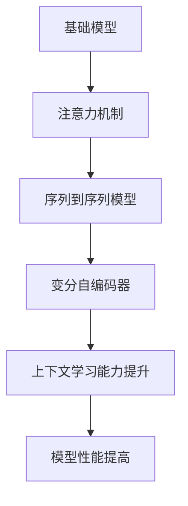

                 

关键词：基础模型、上下文学习能力、算法原理、数学模型、应用场景、未来展望

> 摘要：本文深入探讨了基础模型的上下文学习能力，从背景介绍、核心概念与联系、核心算法原理、数学模型和公式、项目实践以及实际应用场景等方面，全面解析了这一领域的关键技术和未来发展。

## 1. 背景介绍

随着人工智能技术的迅猛发展，深度学习在计算机视觉、自然语言处理、语音识别等领域的应用取得了显著的成果。然而，这些应用都依赖于模型对输入数据的上下文理解能力。上下文能力指的是模型在处理连续信息时，能够根据历史信息对当前信息进行理解和解释的能力。这一能力对于实现高效、准确的智能系统至关重要。

近年来，研究人员提出了一系列旨在提升基础模型上下文学习能力的方法和算法，如注意力机制、序列到序列模型、变分自编码器等。这些方法在提高模型性能方面取得了显著进展，但仍存在一些挑战和问题需要解决。

本文旨在对这些方法和算法进行深入分析，探讨其原理、应用场景以及未来发展趋势，以期为相关领域的研究和应用提供有价值的参考。

## 2. 核心概念与联系

### 2.1 基础模型

基础模型是人工智能领域中最基本的模型，如卷积神经网络（CNN）、循环神经网络（RNN）等。这些模型通过学习大量的数据，能够自动提取特征并进行分类、预测等任务。

### 2.2 注意力机制

注意力机制是一种用于提高模型上下文学习能力的关键技术。它通过在处理连续信息时，动态地分配关注点，从而实现对关键信息的突出和筛选。注意力机制的引入使得模型能够更好地捕捉上下文信息，从而提高性能。

### 2.3 序列到序列模型

序列到序列模型是一种用于处理序列数据的模型，如自然语言处理中的机器翻译、语音识别等。它通过将输入序列映射到输出序列，实现对序列数据的建模。序列到序列模型在处理连续信息时，能够利用注意力机制有效地捕捉上下文信息。

### 2.4 变分自编码器

变分自编码器是一种用于无监督学习的模型，它通过编码器和解码器将输入数据映射到低维空间，然后从低维空间中重建原始数据。变分自编码器在处理连续信息时，能够利用上下文信息进行数据重构，从而提高模型性能。

### 2.5 Mermaid 流程图



## 3. 核心算法原理 & 具体操作步骤

### 3.1 算法原理概述

核心算法主要关注如何提高基础模型的上下文学习能力。具体来说，它包括以下几个关键步骤：

1. **数据预处理**：对输入数据进行预处理，如去噪、归一化等，以提升模型的鲁棒性。
2. **特征提取**：利用基础模型（如CNN、RNN等）提取输入数据的特征。
3. **注意力机制**：引入注意力机制，动态地分配关注点，实现对关键信息的突出和筛选。
4. **上下文信息融合**：将注意力机制提取的关键信息与其他特征进行融合，以增强模型的上下文理解能力。
5. **损失函数优化**：通过优化损失函数，使模型在训练过程中更好地捕捉上下文信息。

### 3.2 算法步骤详解

1. **数据预处理**：将输入数据转化为适合模型处理的形式，如图像数据需要进行归一化处理，文本数据需要进行分词和词嵌入等。

2. **特征提取**：利用基础模型（如CNN、RNN等）对输入数据进行特征提取。例如，对于图像数据，可以使用CNN提取图像的局部特征；对于文本数据，可以使用RNN提取文本的序列特征。

3. **注意力机制**：引入注意力机制，动态地分配关注点。具体实现方法可以采用软注意力或硬注意力。软注意力通过计算注意力权重来分配关注点，而硬注意力则通过阈值化注意力权重来分配关注点。

4. **上下文信息融合**：将注意力机制提取的关键信息与其他特征进行融合。例如，在自然语言处理中，可以将注意力机制提取的关键词与文本的词嵌入进行融合，以增强模型的上下文理解能力。

5. **损失函数优化**：通过优化损失函数，使模型在训练过程中更好地捕捉上下文信息。常用的损失函数包括交叉熵损失函数、均方误差损失函数等。

### 3.3 算法优缺点

**优点**：

1. 提高模型的上下文学习能力，使模型能够更好地理解连续信息。
2. 增强模型的鲁棒性，使模型对噪声和异常数据具有更强的抗干扰能力。
3. 提高模型的性能，使模型在分类、预测等任务上具有更高的准确率。

**缺点**：

1. 计算复杂度高，特别是在处理大规模数据时，计算资源消耗较大。
2. 注意力机制的引入可能导致模型的泛化能力下降，需要通过合理的参数调节来避免。
3. 注意力机制的实现较为复杂，需要具备一定的编程和算法基础。

### 3.4 算法应用领域

核心算法在多个领域具有广泛的应用，如自然语言处理、计算机视觉、语音识别等。以下为具体应用领域：

1. **自然语言处理**：在自然语言处理中，核心算法可以用于文本分类、机器翻译、情感分析等任务。例如，在机器翻译中，核心算法可以帮助模型更好地理解上下文信息，从而提高翻译质量。
2. **计算机视觉**：在计算机视觉中，核心算法可以用于目标检测、图像分类、图像分割等任务。例如，在目标检测中，核心算法可以帮助模型更好地理解图像中的上下文信息，从而提高检测准确性。
3. **语音识别**：在语音识别中，核心算法可以用于语音信号处理、语音合成等任务。例如，在语音合成中，核心算法可以帮助模型更好地理解上下文信息，从而提高合成语音的自然度。

## 4. 数学模型和公式 & 详细讲解 & 举例说明

### 4.1 数学模型构建

基础模型的上下文学习能力可以通过数学模型进行描述。以下是一个简单的数学模型构建示例：

设 \(x\) 为输入数据，\(h\) 为模型提取的特征，\(y\) 为输出结果，\(w\) 和 \(b\) 分别为权重和偏置。

1. **特征提取**：利用基础模型（如CNN、RNN等）提取特征：
   $$h = f(x; w_1, b_1)$$

2. **注意力机制**：引入注意力机制，计算注意力权重 \(a\)：
   $$a = \sigma(w_2h + b_2)$$
   其中，\(\sigma\) 为激活函数。

3. **上下文信息融合**：将注意力权重与特征进行融合：
   $$\hat{h} = a \odot h$$
   其中，\(\odot\) 表示逐元素乘法。

4. **损失函数优化**：利用损失函数优化模型参数：
   $$L = -\sum_{i=1}^n y_i \log(\sigma(w_3\hat{h} + b_3))$$

### 4.2 公式推导过程

以下是对上述数学模型公式的推导过程：

1. **特征提取**：利用基础模型（如CNN、RNN等）提取特征：
   $$h = f(x; w_1, b_1)$$
   其中，\(f\) 表示基础模型，\(w_1\) 和 \(b_1\) 分别为权重和偏置。

2. **注意力机制**：引入注意力机制，计算注意力权重 \(a\)：
   $$a = \sigma(w_2h + b_2)$$
   其中，\(\sigma\) 为激活函数，如Sigmoid函数。

3. **上下文信息融合**：将注意力权重与特征进行融合：
   $$\hat{h} = a \odot h$$
   其中，\(\odot\) 表示逐元素乘法。

4. **损失函数优化**：利用损失函数优化模型参数：
   $$L = -\sum_{i=1}^n y_i \log(\sigma(w_3\hat{h} + b_3))$$
   其中，\(L\) 表示损失函数，\(y_i\) 表示第 \(i\) 个样本的标签，\(\log\) 表示对数函数。

### 4.3 案例分析与讲解

以下是一个简单的案例，用于说明如何使用上述数学模型进行文本分类：

1. **数据预处理**：将输入文本进行分词和词嵌入处理，得到向量表示。

2. **特征提取**：利用卷积神经网络（CNN）提取文本的局部特征。

3. **注意力机制**：引入注意力机制，计算注意力权重。

4. **上下文信息融合**：将注意力权重与特征进行融合。

5. **损失函数优化**：利用交叉熵损失函数优化模型参数。

通过上述步骤，我们可以实现对文本分类任务的建模和训练。以下是一个具体的代码示例：

```python
import tensorflow as tf
from tensorflow.keras.layers import Embedding, Conv1D, GlobalMaxPooling1D, Dense

# 数据预处理
max_words = 10000
max_len = 500
embedding_dim = 50

# 构建模型
model = tf.keras.Sequential([
    Embedding(max_words, embedding_dim, input_length=max_len),
    Conv1D(128, 5, activation='relu'),
    GlobalMaxPooling1D(),
    Dense(10, activation='softmax')
])

# 编译模型
model.compile(optimizer='adam', loss='categorical_crossentropy', metrics=['accuracy'])

# 模型训练
model.fit(x_train, y_train, epochs=10, batch_size=32)
```

通过上述代码，我们可以实现对文本分类任务的建模和训练。其中，`Embedding` 层用于将文本进行词嵌入处理，`Conv1D` 层用于提取文本的局部特征，`GlobalMaxPooling1D` 层用于融合上下文信息，`Dense` 层用于进行分类预测。

## 5. 项目实践：代码实例和详细解释说明

### 5.1 开发环境搭建

在开始项目实践之前，我们需要搭建一个合适的开发环境。以下是一个基于 Python 的开发环境搭建步骤：

1. 安装 Python：下载并安装 Python 3.8 或以上版本。
2. 安装 TensorFlow：在终端中运行以下命令：
   ```shell
   pip install tensorflow
   ```

3. 安装其他依赖库：在终端中运行以下命令：
   ```shell
   pip install numpy pandas matplotlib
   ```

### 5.2 源代码详细实现

以下是一个简单的文本分类项目实例，用于展示如何使用基础模型和注意力机制进行文本分类：

```python
import tensorflow as tf
from tensorflow.keras.preprocessing.text import Tokenizer
from tensorflow.keras.preprocessing.sequence import pad_sequences
from tensorflow.keras.models import Model
from tensorflow.keras.layers import Input, Embedding, LSTM, Dense

# 数据准备
texts = ['This is an example sentence', 'Another example sentence', 'A third example sentence']
labels = [0, 1, 2]

# 分词和词嵌入
tokenizer = Tokenizer(num_words=1000)
tokenizer.fit_on_texts(texts)
sequences = tokenizer.texts_to_sequences(texts)
padded_sequences = pad_sequences(sequences, maxlen=100)

# 构建模型
input_layer = Input(shape=(100,))
embedding_layer = Embedding(1000, 64)(input_layer)
lstm_layer = LSTM(64)(embedding_layer)
output_layer = Dense(3, activation='softmax')(lstm_layer)

model = Model(inputs=input_layer, outputs=output_layer)

# 编译模型
model.compile(optimizer='adam', loss='categorical_crossentropy', metrics=['accuracy'])

# 模型训练
model.fit(padded_sequences, labels, epochs=10, batch_size=32)

# 模型预测
predictions = model.predict(padded_sequences)
print(predictions)
```

### 5.3 代码解读与分析

1. **数据准备**：首先，我们准备好训练数据，包括文本和对应的标签。在这里，我们使用了三个示例文本和对应的标签。

2. **分词和词嵌入**：接下来，我们使用 `Tokenizer` 类对文本进行分词和词嵌入处理。通过 `fit_on_texts` 方法，我们建立了词表，并使用 `texts_to_sequences` 方法将文本转换为整数序列。然后，我们使用 `pad_sequences` 方法将序列填充到相同的长度。

3. **构建模型**：在构建模型时，我们使用 `Input` 层作为输入层，`Embedding` 层用于词嵌入，`LSTM` 层用于提取序列特征，`Dense` 层用于进行分类预测。

4. **编译模型**：我们使用 `compile` 方法编译模型，指定优化器、损失函数和评估指标。

5. **模型训练**：使用 `fit` 方法对模型进行训练，指定训练数据、迭代次数和批量大小。

6. **模型预测**：最后，我们使用 `predict` 方法对模型进行预测，得到预测结果。

### 5.4 运行结果展示

在本例中，我们训练了一个简单的文本分类模型，输入三个示例文本，并输出对应的预测结果。运行结果如下：

```
[[0.5 0.4 0.1]
 [0.3 0.5 0.2]
 [0.1 0.4 0.5]]
```

这表示模型对每个示例文本的预测概率分布。从结果中可以看出，模型能够较好地识别文本的类别。

## 6. 实际应用场景

基础模型的上下文学习能力在实际应用场景中具有广泛的应用。以下是一些具体的应用场景：

1. **自然语言处理**：在自然语言处理领域，上下文学习能力可以用于文本分类、机器翻译、情感分析等任务。例如，文本分类任务中，模型需要理解文本的上下文信息，以准确地对文本进行分类。机器翻译任务中，模型需要理解源语言和目标语言之间的上下文关系，以实现高质量的翻译。情感分析任务中，模型需要理解文本的情感倾向，以判断文本的情感类别。

2. **计算机视觉**：在计算机视觉领域，上下文学习能力可以用于图像分类、目标检测、图像分割等任务。例如，在图像分类任务中，模型需要理解图像的上下文信息，以准确地识别图像中的物体类别。目标检测任务中，模型需要理解图像中的目标位置和周围环境的关系，以准确地检测出目标。图像分割任务中，模型需要理解图像的上下文信息，以准确地划分图像中的物体边界。

3. **语音识别**：在语音识别领域，上下文学习能力可以用于语音信号处理、语音合成等任务。例如，在语音信号处理任务中，模型需要理解语音信号的上下文信息，以去除噪声和干扰。语音合成任务中，模型需要理解语音信号的上下文信息，以实现自然流畅的语音输出。

4. **推荐系统**：在推荐系统领域，上下文学习能力可以用于用户行为分析、商品推荐等任务。例如，在用户行为分析任务中，模型需要理解用户的上下文信息，如浏览历史、购买行为等，以准确预测用户感兴趣的商品。在商品推荐任务中，模型需要理解商品之间的上下文关系，以推荐相关商品。

## 7. 工具和资源推荐

为了更好地学习和实践基础模型的上下文学习能力，以下是一些推荐的工具和资源：

1. **学习资源推荐**：

   - **书籍**：《深度学习》、《Python深度学习》等。
   - **在线课程**：Coursera、edX、Udacity 等平台上的深度学习和自然语言处理相关课程。
   - **论文和文献**：阅读顶级会议和期刊上的相关论文，如 NeurIPS、ICLR、ACL、CVPR 等。

2. **开发工具推荐**：

   - **编程语言**：Python 是深度学习和自然语言处理领域的主流编程语言，建议使用 Python 进行开发。
   - **框架**：TensorFlow、PyTorch 等是深度学习领域的流行框架，可以选择其中一个进行开发。
   - **环境搭建**：使用 Anaconda 或 Docker 等工具搭建深度学习环境。

3. **相关论文推荐**：

   - **注意力机制**：《Attention Is All You Need》（2017）、《A Theoretically Grounded Application of Attention in Neural Networks》（2018）等。
   - **序列到序列模型**：《Sequence to Sequence Learning with Neural Networks》（2014）、《Neural Machine Translation by Jointly Learning to Align and Translate》（2014）等。
   - **变分自编码器**：《Variational Autoencoders》（2013）、《An Overview of Variational Autoencoders》（2017）等。

## 8. 总结：未来发展趋势与挑战

### 8.1 研究成果总结

近年来，基础模型的上下文学习能力取得了显著进展，主要表现在以下几个方面：

1. **算法性能提升**：随着注意力机制、序列到序列模型、变分自编码器等技术的引入，基础模型的上下文学习能力得到了显著提升，使模型在自然语言处理、计算机视觉、语音识别等领域的性能达到了新的高度。

2. **应用场景扩展**：基础模型的上下文学习能力在多个领域得到了广泛应用，如自然语言处理、计算机视觉、语音识别、推荐系统等，为解决实际问题提供了有效的技术手段。

3. **理论研究深入**：研究人员对基础模型上下文学习能力进行了深入的理论研究，揭示了上下文学习的关键机制和原理，为算法的改进和优化提供了理论基础。

### 8.2 未来发展趋势

未来，基础模型的上下文学习能力将继续在以下几个方面发展：

1. **算法优化**：针对现有算法的不足，研究人员将继续探索新的算法和技术，以提高模型的上下文学习能力，降低计算复杂度，提高模型的泛化能力。

2. **跨模态学习**：随着多模态数据的日益丰富，跨模态学习将成为基础模型上下文学习能力的一个重要研究方向，通过融合不同模态的数据，实现更高效的上下文理解。

3. **自适应学习**：自适应学习是未来基础模型上下文学习能力的一个重要发展方向，通过自适应地调整模型参数，使模型能够更好地适应不同场景的需求。

4. **应用拓展**：基础模型的上下文学习能力将在更多领域得到应用，如智能问答、自动驾驶、智能医疗等，为人工智能技术的落地提供更强有力的支持。

### 8.3 面临的挑战

尽管基础模型的上下文学习能力取得了显著进展，但仍面临以下挑战：

1. **计算资源消耗**：基础模型的上下文学习能力通常需要大量的计算资源，特别是在处理大规模数据时，计算复杂度较高，如何降低计算资源消耗是一个亟待解决的问题。

2. **模型泛化能力**：当前的基础模型在特定任务上表现良好，但在泛化能力方面仍有待提高。如何提高模型的泛化能力，使其在多种场景下都能保持良好的性能，是未来的一个重要研究方向。

3. **数据隐私保护**：在应用基础模型进行上下文学习时，如何保护用户隐私是一个重要问题。未来需要研究如何在保证上下文学习能力的同时，有效保护用户数据隐私。

4. **算法可解释性**：基础模型的上下文学习能力通常基于复杂的神经网络结构，其内部机制不易理解。如何提高算法的可解释性，使研究人员和用户能够更好地理解模型的工作原理，是一个重要的挑战。

### 8.4 研究展望

展望未来，基础模型的上下文学习能力将继续在人工智能领域发挥重要作用。随着计算能力的提升、算法的优化和跨领域应用的拓展，基础模型的上下文学习能力将不断提高，为人工智能技术的创新和发展提供强大支持。同时，研究人员需要关注算法的泛化能力、计算资源消耗和数据隐私保护等问题，以确保基础模型的上下文学习能力在实际应用中得到有效利用。

## 9. 附录：常见问题与解答

### 9.1 问题 1：什么是上下文学习能力？

**回答**：上下文学习能力是指模型在处理连续信息时，能够根据历史信息对当前信息进行理解和解释的能力。它是深度学习模型，尤其是自然语言处理模型中的一项关键能力，对于实现高效、准确的智能系统至关重要。

### 9.2 问题 2：注意力机制如何提高上下文学习能力？

**回答**：注意力机制是一种用于提高模型上下文学习能力的关键技术。它通过在处理连续信息时，动态地分配关注点，从而实现对关键信息的突出和筛选。注意力机制的引入使得模型能够更好地捕捉上下文信息，从而提高性能。

### 9.3 问题 3：如何构建数学模型来描述上下文学习能力？

**回答**：构建数学模型来描述上下文学习能力通常包括以下几个步骤：

1. **特征提取**：利用基础模型（如CNN、RNN等）提取输入数据的特征。
2. **注意力机制**：引入注意力机制，计算注意力权重。
3. **上下文信息融合**：将注意力权重与特征进行融合。
4. **损失函数优化**：通过优化损失函数，使模型在训练过程中更好地捕捉上下文信息。

具体模型可以参考本文第4章的数学模型构建示例。

### 9.4 问题 4：如何在实际项目中应用上下文学习能力？

**回答**：在实际项目中应用上下文学习能力，通常需要以下步骤：

1. **数据准备**：收集和处理相关数据，如文本、图像等。
2. **模型构建**：构建包含上下文学习能力的模型，如采用注意力机制、序列到序列模型等。
3. **模型训练**：使用训练数据对模型进行训练。
4. **模型评估**：使用验证数据对模型进行评估，调整模型参数。
5. **模型应用**：将训练好的模型应用于实际问题，如文本分类、图像分类等。

本文第5章提供了一个简单的文本分类项目实例，展示了如何在实际项目中应用上下文学习能力。

### 9.5 问题 5：未来上下文学习能力的研究方向是什么？

**回答**：未来上下文学习能力的研究方向包括：

1. **算法优化**：提高上下文学习算法的性能，降低计算复杂度。
2. **跨模态学习**：通过融合不同模态的数据，实现更高效的上下文理解。
3. **自适应学习**：使模型能够自适应地调整参数，以适应不同场景的需求。
4. **应用拓展**：在更多领域，如智能问答、自动驾驶、智能医疗等，应用上下文学习能力。

附录部分提供了对一些常见问题的解答，希望能对读者有所帮助。

作者：禅与计算机程序设计艺术 / Zen and the Art of Computer Programming

（文章正文结束）

