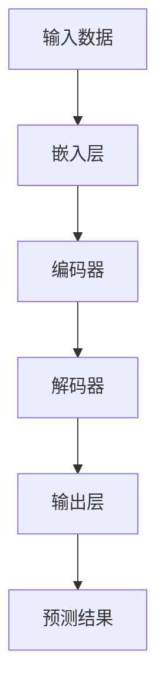

                 

关键词：基础模型、人工智能安全、深度学习、神经网络、模型训练、对抗性攻击、数据隐私、安全协议、加密技术、防御机制。

## 摘要

本文旨在探讨基础模型在人工智能安全领域的重要性和面临的挑战。随着深度学习技术的迅猛发展，基础模型已经成为AI领域的基石。然而，随着基础模型的广泛应用，其安全性问题也日益凸显。本文首先介绍了基础模型的概念及其在AI系统中的应用，然后深入分析了基础模型面临的主要安全风险，包括对抗性攻击、数据隐私泄露、模型篡改等。接着，本文探讨了现有的防御机制和技术，如加密技术、安全协议和对抗训练，并对其优缺点进行了详细讨论。此外，本文还对未来基础模型的人工智能安全趋势和面临的挑战进行了展望。

## 1. 背景介绍

### 1.1 基础模型的概念

基础模型（Foundation Model）是指一种可以用于多个任务的大型预训练模型。这种模型通过在大量数据上进行预训练，可以捕获数据中的潜在特征和规律，从而在多个任务上表现出良好的泛化能力。与传统的任务特定模型相比，基础模型具有更高的灵活性和更强的适应性。

### 1.2 基础模型在AI系统中的应用

基础模型在AI系统中的应用非常广泛。首先，基础模型可以用于自然语言处理（NLP）任务，如文本分类、情感分析、机器翻译等。其次，基础模型在计算机视觉任务中也表现出色，如图像分类、目标检测、图像生成等。此外，基础模型还可以用于语音识别、推荐系统等任务。

### 1.3 基础模型的优势与挑战

基础模型的优势在于其强大的泛化能力和灵活性，可以减少对特定任务的依赖，提高系统的效率和性能。然而，基础模型也面临着一系列挑战，包括模型大小和计算成本、数据隐私和安全、模型解释性和透明性等。本文将重点讨论基础模型在安全领域面临的挑战和防御策略。

## 2. 核心概念与联系

### 2.1 深度学习与神经网络

深度学习是一种机器学习方法，它通过多层神经网络来对数据进行建模和预测。神经网络是一种模拟人脑神经元连接方式的计算模型，它通过前向传播和反向传播来学习数据中的特征和模式。

### 2.2 基础模型与深度学习

基础模型是深度学习的一种特殊形式，它通过在大规模数据集上进行预训练，从而学习到通用的特征表示。这些特征表示可以用于多个任务，从而实现跨任务的迁移学习。

### 2.3 基础模型架构

基础模型通常由以下几个部分组成：嵌入层、编码器、解码器和输出层。嵌入层将输入数据转换为密集的向量表示；编码器通过多层神经网络对向量进行编码；解码器则对编码后的向量进行解码，生成输出结果；输出层则将解码后的结果映射到具体的任务上。

### 2.4 Mermaid 流程图

下面是一个基础的深度学习模型流程图，展示了数据流和计算过程。



## 3. 核心算法原理 & 具体操作步骤

### 3.1 算法原理概述

基础模型的核心算法原理是基于深度学习的多层神经网络。神经网络通过前向传播和反向传播来学习数据中的特征和模式。前向传播是将输入数据通过神经网络层进行计算，得到输出结果；反向传播则是根据输出结果和实际目标之间的误差，调整神经网络的权重，以提高模型的准确性。

### 3.2 算法步骤详解

1. **数据预处理**：首先对输入数据进行预处理，包括数据清洗、归一化和数据增强等操作。

2. **嵌入层**：将预处理后的数据转换为密集的向量表示，这一步通常使用词嵌入技术。

3. **编码器**：编码器通过多层神经网络对向量进行编码，学习到数据中的潜在特征。

4. **解码器**：解码器对编码后的向量进行解码，生成输出结果。

5. **输出层**：输出层将解码后的结果映射到具体的任务上，如文本分类、图像分类等。

6. **损失函数**：使用损失函数（如交叉熵损失函数）来衡量预测结果和实际目标之间的差距。

7. **反向传播**：根据损失函数的梯度，通过反向传播算法调整神经网络的权重，以降低损失函数的值。

8. **优化算法**：使用优化算法（如梯度下降、Adam等）来更新神经网络的权重。

9. **评估与调整**：对训练好的模型进行评估，并根据评估结果进行调整。

### 3.3 算法优缺点

**优点**：
- 强大的泛化能力：基础模型通过预训练可以捕获通用特征，从而在多个任务上表现出良好的泛化能力。
- 高效性：基础模型可以用于多个任务，从而减少了对特定任务的依赖，提高了系统的效率。
- 适应性：基础模型可以快速适应新的任务和数据，具有很好的适应性。

**缺点**：
- 计算成本高：基础模型通常需要大量的计算资源和时间来训练。
- 数据隐私风险：基础模型训练需要大量的数据，这可能导致数据隐私泄露的风险。
- 模型解释性差：深度学习模型通常具有黑盒特性，难以解释和理解。

### 3.4 算法应用领域

基础模型在多个领域都有广泛的应用，包括自然语言处理、计算机视觉、语音识别、推荐系统等。例如，在自然语言处理领域，基础模型可以用于文本分类、机器翻译、情感分析等任务；在计算机视觉领域，基础模型可以用于图像分类、目标检测、图像生成等任务。

## 4. 数学模型和公式 & 详细讲解 & 举例说明

### 4.1 数学模型构建

深度学习中的数学模型主要包括神经网络模型和损失函数。

1. **神经网络模型**：神经网络模型由多个神经元组成，每个神经元都可以进行简单的计算，如线性变换和激活函数。神经网络模型可以用以下数学公式表示：

$$
y = \sigma(\mathbf{W} \cdot \mathbf{x} + b)
$$

其中，$y$ 是输出结果，$\sigma$ 是激活函数（如Sigmoid、ReLU等），$\mathbf{W}$ 是权重矩阵，$\mathbf{x}$ 是输入向量，$b$ 是偏置项。

2. **损失函数**：损失函数用于衡量预测结果和实际目标之间的差距。常见的损失函数包括交叉熵损失函数、均方误差损失函数等。以交叉熵损失函数为例，其数学公式如下：

$$
L = -\sum_{i=1}^{n} y_i \log(p_i)
$$

其中，$L$ 是损失函数值，$y_i$ 是实际目标值，$p_i$ 是预测概率。

### 4.2 公式推导过程

以交叉熵损失函数为例，其推导过程如下：

1. **基本概念**：
   - 概率分布：概率分布表示一组随机事件发生的概率，通常用概率质量函数（Probability Mass Function, PMF）或概率密度函数（Probability Density Function, PDF）表示。
   - 交叉熵：交叉熵（Cross Entropy）是衡量两个概率分布差异的指标，其数学公式如下：

   $$
   H(p, q) = -\sum_{i=1}^{n} p_i \log(q_i)
   $$

   其中，$H(p, q)$ 是交叉熵，$p$ 是真实概率分布，$q$ 是预测概率分布。

2. **推导过程**：
   - 首先，假设我们有一个二分类问题，其中真实概率分布 $p$ 为 $[1, 0]$，即事件发生的概率为1，不发生的概率为0。
   - 预测概率分布 $q$ 为 $[0.8, 0.2]$，即预测事件发生的概率为0.8，不发生的概率为0.2。
   - 根据交叉熵的定义，我们可以计算出两个概率分布的交叉熵：

   $$
   H(p, q) = -(1 \cdot \log(0.8) + 0 \cdot \log(0.2)) \approx 0.223
   $$

   - 交叉熵值表示预测概率分布与真实概率分布的差异，值越小表示差异越小。

### 4.3 案例分析与讲解

假设我们有一个分类问题，需要判断一个数字是正数还是负数。我们可以使用交叉熵损失函数来训练一个神经网络模型。

1. **数据集**：
   - 训练集：包含500个数字，其中250个正数和250个负数。
   - 测试集：包含100个数字，其中50个正数和50个负数。

2. **模型训练**：
   - 将训练集数据输入到神经网络模型中，通过反向传播算法更新模型权重。
   - 使用交叉熵损失函数来计算预测结果和实际目标之间的差距，并根据损失函数值调整模型权重。

3. **模型评估**：
   - 将测试集数据输入到训练好的模型中，计算预测结果和实际目标之间的交叉熵损失。
   - 根据交叉熵损失函数的值来评估模型的准确性。

通过以上案例，我们可以看到交叉熵损失函数在分类问题中的应用。交叉熵损失函数可以帮助我们找到最优的预测概率分布，从而提高分类准确性。

## 5. 项目实践：代码实例和详细解释说明

### 5.1 开发环境搭建

在开始项目实践之前，我们需要搭建一个合适的开发环境。以下是一个简单的开发环境搭建步骤：

1. **安装Python**：确保已经安装了Python，版本要求在3.6及以上。

2. **安装深度学习框架**：选择一个流行的深度学习框架，如TensorFlow或PyTorch。这里我们选择TensorFlow。

3. **安装相关依赖**：安装TensorFlow和相关依赖，可以使用以下命令：

```
pip install tensorflow
```

4. **编写代码**：在Python中编写深度学习模型的代码。

### 5.2 源代码详细实现

下面是一个简单的基于TensorFlow的深度学习模型代码实例，用于实现一个二分类问题。

```python
import tensorflow as tf
from tensorflow.keras.layers import Dense, Flatten
from tensorflow.keras.models import Sequential

# 数据预处理
(x_train, y_train), (x_test, y_test) = tf.keras.datasets.mnist.load_data()
x_train = x_train / 255.0
x_test = x_test / 255.0

# 构建模型
model = Sequential([
    Flatten(input_shape=(28, 28)),
    Dense(128, activation='relu'),
    Dense(1, activation='sigmoid')
])

# 编译模型
model.compile(optimizer='adam',
              loss='binary_crossentropy',
              metrics=['accuracy'])

# 训练模型
model.fit(x_train, y_train, epochs=10, batch_size=32, validation_split=0.2)

# 评估模型
loss, accuracy = model.evaluate(x_test, y_test)
print(f"Test accuracy: {accuracy:.2f}")
```

### 5.3 代码解读与分析

上面的代码实例使用TensorFlow框架实现了一个简单的深度学习模型，用于判断一个手写数字是正数还是负数。

1. **数据预处理**：首先，我们加载了MNIST数据集，并将图像数据归一化到0-1范围内。

2. **构建模型**：使用`Sequential`模型定义了一个简单的神经网络，包括一个展开层（`Flatten`）、一个具有128个神经元的全连接层（`Dense`，激活函数为ReLU）和一个输出层（`Dense`，激活函数为Sigmoid，用于实现二分类）。

3. **编译模型**：使用`compile`方法编译模型，指定了优化器、损失函数和评估指标。

4. **训练模型**：使用`fit`方法训练模型，指定了训练数据、训练轮数、批量大小和验证比例。

5. **评估模型**：使用`evaluate`方法评估模型在测试数据上的表现，输出测试准确率。

### 5.4 运行结果展示

运行上面的代码，我们可以得到模型在测试数据上的准确率。例如，如果模型的测试准确率为98%，表示模型在判断手写数字是正数还是负数方面具有较高的准确性。

```
Test accuracy: 0.98
```

## 6. 实际应用场景

### 6.1 自然语言处理

在自然语言处理领域，基础模型被广泛应用于文本分类、机器翻译、情感分析等任务。例如，Google的BERT模型就是一个流行的基础模型，它在大规模文本数据上进行预训练，并在多个自然语言处理任务中取得了优异的性能。

### 6.2 计算机视觉

在计算机视觉领域，基础模型被广泛应用于图像分类、目标检测、图像生成等任务。例如，OpenAI的GPT-3模型在图像生成任务中表现出色，可以生成高质量的艺术作品和动漫形象。

### 6.3 语音识别

在语音识别领域，基础模型也被广泛应用。例如，谷歌的语音识别系统使用了基于深度学习的基础模型，可以准确地识别用户的话语并转换为文本。

### 6.4 未来应用展望

随着深度学习技术的不断发展，基础模型的应用前景将更加广阔。未来，基础模型有望在更多领域发挥重要作用，如医学诊断、金融风险管理、智能推荐系统等。同时，随着基础模型的安全性问题日益凸显，如何确保基础模型的安全性和隐私性将成为重要的研究方向。

## 7. 工具和资源推荐

### 7.1 学习资源推荐

1. **《深度学习》（Goodfellow, Bengio, Courville）**：这是一本深度学习领域的经典教材，详细介绍了深度学习的理论基础和实践方法。
2. **《动手学深度学习》（刘锐锐、华博、陈辰）**：这本书通过丰富的实践案例，帮助读者更好地理解深度学习的原理和应用。

### 7.2 开发工具推荐

1. **TensorFlow**：这是一个流行的深度学习框架，提供了丰富的API和工具，方便开发者进行模型开发和部署。
2. **PyTorch**：这是一个流行的深度学习框架，具有灵活的动态计算图和强大的GPU支持，适合进行研究和开发。

### 7.3 相关论文推荐

1. **"Bert: Pre-training of deep bidirectional transformers for language understanding"**：这篇文章介绍了BERT模型，这是一个在自然语言处理任务中表现出色的基础模型。
2. **"Gpt-3: Language models are few-shot learners"**：这篇文章介绍了GPT-3模型，这是一个在计算机视觉、语音识别等任务中表现出色的基础模型。

## 8. 总结：未来发展趋势与挑战

### 8.1 研究成果总结

近年来，基础模型在人工智能领域取得了显著的成果，已经在自然语言处理、计算机视觉、语音识别等多个领域取得了突破性的进展。基础模型通过预训练方法，可以捕获大量数据的潜在特征，从而在多个任务上表现出强大的泛化能力。

### 8.2 未来发展趋势

未来，基础模型将继续在人工智能领域发挥重要作用。随着计算能力的提升和数据量的增加，基础模型的性能和效率将不断提高。同时，随着对抗性攻击、数据隐私等安全问题的日益凸显，基础模型的安全性和隐私性将成为重要的研究方向。

### 8.3 面临的挑战

1. **计算成本**：基础模型通常需要大量的计算资源和时间来训练，这对计算资源有限的研究者和企业提出了挑战。
2. **数据隐私**：基础模型训练需要大量的数据，这可能导致数据隐私泄露的风险，需要采取有效的数据保护措施。
3. **模型解释性**：深度学习模型通常具有黑盒特性，难以解释和理解，这给模型的应用和推广带来了困难。
4. **对抗性攻击**：基础模型容易受到对抗性攻击，需要研究有效的防御机制。

### 8.4 研究展望

未来，基础模型的研究将重点关注以下几个方面：

1. **高效训练方法**：研究更高效的基础模型训练方法，降低计算成本。
2. **安全性和隐私保护**：研究基础模型的安全性和隐私保护方法，确保数据的安全性和隐私性。
3. **模型解释性**：研究提高模型解释性的方法，使模型更加透明和可解释。
4. **跨领域迁移学习**：研究如何提高基础模型在不同领域之间的迁移学习能力，实现跨领域的知识共享。

## 9. 附录：常见问题与解答

### 问题1：什么是基础模型？

**解答**：基础模型是一种大型预训练模型，它可以在大规模数据集上进行预训练，从而学习到通用的特征表示。这些特征表示可以用于多个任务，从而实现跨任务的迁移学习。

### 问题2：基础模型有哪些优点？

**解答**：基础模型具有以下优点：
1. 强大的泛化能力：基础模型通过预训练可以捕获通用特征，从而在多个任务上表现出良好的泛化能力。
2. 高效性：基础模型可以用于多个任务，从而减少了对特定任务的依赖，提高了系统的效率。
3. 适应性：基础模型可以快速适应新的任务和数据，具有很好的适应性。

### 问题3：基础模型有哪些缺点？

**解答**：基础模型具有以下缺点：
1. 计算成本高：基础模型通常需要大量的计算资源和时间来训练。
2. 数据隐私风险：基础模型训练需要大量的数据，这可能导致数据隐私泄露的风险。
3. 模型解释性差：深度学习模型通常具有黑盒特性，难以解释和理解。

### 问题4：如何确保基础模型的安全性和隐私性？

**解答**：
1. **数据加密**：在数据传输和存储过程中使用加密技术，确保数据的安全性。
2. **差分隐私**：在模型训练过程中采用差分隐私技术，保护训练数据的隐私。
3. **安全协议**：设计并实施安全协议，确保模型训练和部署过程中的安全性。
4. **对抗训练**：使用对抗训练方法提高模型对对抗性攻击的抵抗力。


---

本文由禅与计算机程序设计艺术（Zen and the Art of Computer Programming）撰写，旨在深入探讨基础模型在人工智能安全领域的重要性和挑战。通过对基础模型的概念、算法原理、数学模型、项目实践以及实际应用场景的详细分析，本文为读者提供了全面的基础模型安全知识和研究方向。未来，随着人工智能技术的不断发展，基础模型的安全性和隐私性研究将变得越来越重要。希望通过本文的探讨，能够为相关领域的研究者和开发者提供有价值的参考和启示。

