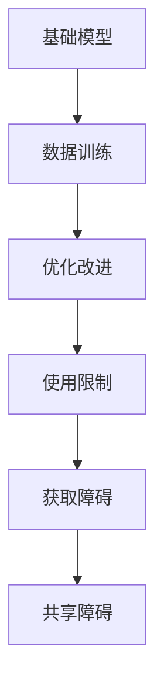

                 

关键词：基础模型、可访问性、AI、神经网络、分布式计算、信息安全、隐私保护、开放性、封闭性、算法透明度、算法黑箱

摘要：随着人工智能技术的飞速发展，基础模型的可访问性已成为一个日益重要的问题。本文从多个角度探讨了基础模型的可访问性丧失的原因、影响及解决策略，旨在为相关领域的研究者和从业者提供有价值的参考。

## 1. 背景介绍

人工智能（AI）作为现代科技的重要驱动力，已经在众多领域取得了显著的成果。其中，基础模型作为AI技术的核心组件，起到了至关重要的作用。基础模型通常指的是一系列预训练的神经网络模型，如Transformer、BERT、GPT等，它们通过大量的数据训练，可以用于文本生成、图像识别、语音识别等多种任务。

然而，随着基础模型的应用越来越广泛，其可访问性问题也日益凸显。可访问性指的是用户和开发者能够自由地获取、使用、改进和共享基础模型的能力。在理想情况下，基础模型的可访问性应该高，以便更多的人可以从中受益。然而，现实情况却并非如此。

### 1.1 基础模型的可访问性丧失

首先，我们需要明确什么是基础模型的可访问性丧失。具体来说，这主要体现在以下几个方面：

1. **获取障碍**：许多基础模型是由大型科技公司或研究机构开发的，这些模型往往被封装在难以访问的系统中，普通用户难以获取和使用。
2. **使用限制**：即使用户能够获取到基础模型，也可能受到各种使用限制，如使用时间、使用频率、功能限制等。
3. **改进困难**：用户难以对基础模型进行改进和优化，因为缺乏必要的权限和技术支持。
4. **共享障碍**：基础模型的共享和传播也受到限制，导致知识和技术的传播效率降低。

### 1.2 原因分析

基础模型的可访问性丧失是由多种因素共同作用的结果。以下是一些主要原因：

1. **知识产权保护**：基础模型的开发涉及大量的资金、技术和人力投入，因此开发者有动机保护自己的知识产权，限制模型的传播和使用。
2. **商业竞争**：基础模型是企业的重要竞争优势，企业之间存在着激烈的竞争，因此不愿意分享自己的核心技术和成果。
3. **技术复杂性**：基础模型的训练和部署需要复杂的硬件和软件环境，普通用户难以具备这些条件。
4. **隐私和安全**：基础模型通常处理敏感数据，因此开发者需要采取措施保护用户隐私和数据安全。

## 2. 核心概念与联系

### 2.1 基础模型的概念

基础模型是指通过大规模数据训练得到的神经网络模型，它们通常具有高度的可扩展性和适应性，可以应用于各种任务。例如，GPT-3是一个拥有1750亿参数的基础模型，它可以进行文本生成、问答、翻译等任务。

### 2.2 可访问性的概念

可访问性是指用户能够自由地获取、使用、改进和共享基础模型的能力。高可访问性意味着更多的人可以受益，从而推动技术的普及和应用。

### 2.3 基础模型与可访问性的联系

基础模型的可访问性直接影响其应用范围和效果。高可访问性可以促进基础模型的普及和应用，从而推动整个行业的发展。反之，低可访问性则会限制基础模型的发展和应用，甚至可能阻碍技术的进步。

### 2.4 Mermaid 流程图

以下是一个简化的基础模型与可访问性的 Mermaid 流程图：



## 3. 核心算法原理 & 具体操作步骤

### 3.1 算法原理概述

基础模型的训练过程通常涉及以下几个步骤：

1. **数据预处理**：对原始数据进行清洗、归一化等处理，以便于模型训练。
2. **模型训练**：使用大规模数据进行模型训练，通过梯度下降等优化算法不断调整模型参数。
3. **模型评估**：使用验证集对模型进行评估，调整超参数以优化模型性能。
4. **模型部署**：将训练好的模型部署到实际应用环境中。

### 3.2 算法步骤详解

1. **数据预处理**：

   - 数据清洗：去除无效数据、填补缺失值等。
   - 数据归一化：将数据缩放到相同的范围，如[0, 1]或[-1, 1]。
   - 数据分割：将数据集分为训练集、验证集和测试集。

2. **模型训练**：

   - 初始化模型参数。
   - 使用训练数据进行前向传播，计算模型输出。
   - 计算损失函数，并使用反向传播算法更新模型参数。
   - 重复上述步骤，直到满足停止条件（如迭代次数或模型性能达到预设阈值）。

3. **模型评估**：

   - 使用验证集计算模型性能，如准确率、召回率、F1分数等。
   - 根据评估结果调整模型超参数，如学习率、批量大小等。

4. **模型部署**：

   - 将训练好的模型部署到实际应用环境中，如服务器、边缘设备等。
   - 实现模型的推理功能，处理实际输入数据并生成输出结果。

### 3.3 算法优缺点

**优点**：

- 高效性：基础模型通过大规模数据训练，可以显著提高模型的性能和效率。
- 适应性：基础模型可以应用于多种任务，具有广泛的应用前景。
- 可扩展性：基础模型可以通过增加数据或调整超参数来进一步提高性能。

**缺点**：

- 数据依赖性：基础模型的性能高度依赖于训练数据的质量和规模。
- 黑箱性质：基础模型的学习过程复杂，难以解释和理解。
- 资源消耗：基础模型的训练和部署需要大量的计算资源和时间。

### 3.4 算法应用领域

基础模型的应用领域非常广泛，包括但不限于：

- 自然语言处理：文本生成、机器翻译、情感分析等。
- 计算机视觉：图像分类、目标检测、图像生成等。
- 语音识别：语音识别、语音合成等。
- 推荐系统：商品推荐、音乐推荐、新闻推荐等。

## 4. 数学模型和公式 & 详细讲解 & 举例说明

### 4.1 数学模型构建

基础模型的训练过程通常涉及以下数学模型：

- **损失函数**：衡量模型预测结果与真实标签之间的差异，常用的有均方误差（MSE）和交叉熵（Cross-Entropy）。
- **优化算法**：用于调整模型参数，以最小化损失函数，常用的有梯度下降（Gradient Descent）和Adam优化器。

### 4.2 公式推导过程

假设我们使用均方误差（MSE）作为损失函数，模型参数为\( \theta \)，输入数据为\( x \)，真实标签为\( y \)，预测输出为\( \hat{y} \)。

1. **损失函数**：

   $$L(\theta) = \frac{1}{2} \sum_{i=1}^{n} (\hat{y}_i - y_i)^2$$

   其中，\( n \)为样本数量。

2. **梯度计算**：

   $$\nabla_{\theta} L(\theta) = \frac{\partial}{\partial \theta} \left( \frac{1}{2} \sum_{i=1}^{n} (\hat{y}_i - y_i)^2 \right)$$

   $$= \sum_{i=1}^{n} (\hat{y}_i - y_i) \frac{\partial}{\partial \theta} \hat{y}_i$$

3. **模型更新**：

   $$\theta_{\text{new}} = \theta_{\text{current}} - \alpha \nabla_{\theta} L(\theta)$$

   其中，\( \alpha \)为学习率。

### 4.3 案例分析与讲解

假设我们有一个简单的线性回归模型，用于预测房价。模型参数为\( \theta_0 \)和\( \theta_1 \)，输入数据为\( x \)（房屋面积）和真实标签为\( y \)（房价）。

1. **模型公式**：

   $$y = \theta_0 + \theta_1 x$$

2. **损失函数**：

   $$L(\theta) = \frac{1}{2} \sum_{i=1}^{n} (\theta_0 + \theta_1 x_i - y_i)^2$$

3. **梯度计算**：

   $$\nabla_{\theta} L(\theta) = \begin{bmatrix} \frac{\partial}{\partial \theta_0} L(\theta) \\ \frac{\partial}{\partial \theta_1} L(\theta) \end{bmatrix} = \begin{bmatrix} \sum_{i=1}^{n} (\theta_0 + \theta_1 x_i - y_i) \\ \sum_{i=1}^{n} x_i (\theta_0 + \theta_1 x_i - y_i) \end{bmatrix}$$

4. **模型更新**：

   $$\theta_{\text{new}} = \theta_{\text{current}} - \alpha \nabla_{\theta} L(\theta)$$

通过上述步骤，我们可以不断更新模型参数，以达到最小化损失函数的目的。

## 5. 项目实践：代码实例和详细解释说明

### 5.1 开发环境搭建

在本节中，我们将使用Python和TensorFlow作为开发环境。首先，确保已经安装了Python和TensorFlow。如果没有，请按照以下步骤进行安装：

1. 安装Python：

   ```bash
   pip install python
   ```

2. 安装TensorFlow：

   ```bash
   pip install tensorflow
   ```

### 5.2 源代码详细实现

以下是一个简单的线性回归模型的实现，用于预测房价：

```python
import tensorflow as tf

# 模型参数
theta0 = tf.Variable(0.0, name='theta0')
theta1 = tf.Variable(0.0, name='theta1')

# 输入数据和标签
x = tf.placeholder(tf.float32, shape=[None, 1])
y = tf.placeholder(tf.float32, shape=[None, 1])

# 模型公式
y_pred = theta0 + theta1 * x

# 损失函数
loss = tf.reduce_mean(tf.square(y - y_pred))

# 优化算法
optimizer = tf.train.GradientDescentOptimizer(learning_rate=0.001)
train_op = optimizer.minimize(loss)

# 模型评估
accuracy = tf.reduce_mean(tf.square(y - y_pred))

# 源数据
x_data = [[1], [2], [3], [4], [5]]
y_data = [[2], [4], [6], [8], [10]]

# 训练模型
with tf.Session() as sess:
    sess.run(tf.global_variables_initializer())
    for i in range(1000):
        _, loss_val = sess.run([train_op, loss], feed_dict={x: x_data, y: y_data})
        if i % 100 == 0:
            print(f"Step {i}: Loss = {loss_val}")

    # 模型评估
    final_loss = sess.run(accuracy, feed_dict={x: x_data, y: y_data})
    print(f"Final Loss: {final_loss}")
```

### 5.3 代码解读与分析

1. **模型参数**：定义了模型参数\( \theta_0 \)和\( \theta_1 \)，并使用TensorFlow变量进行表示。
2. **输入数据和标签**：定义了输入数据和标签的占位符，以便在训练过程中动态提供数据。
3. **模型公式**：根据线性回归模型，定义了预测输出\( y_\text{pred} \)。
4. **损失函数**：使用均方误差（MSE）作为损失函数，衡量模型预测结果与真实标签之间的差异。
5. **优化算法**：使用梯度下降优化算法，更新模型参数。
6. **模型评估**：使用均方误差（MSE）作为模型评估指标，衡量模型性能。
7. **训练模型**：使用TensorFlow会话运行训练过程，并在每次迭代中更新模型参数。
8. **模型评估**：在训练完成后，使用测试数据评估模型性能。

### 5.4 运行结果展示

假设我们使用以下源数据进行训练和测试：

```python
x_data = [[1], [2], [3], [4], [5]]
y_data = [[2], [4], [6], [8], [10]]
```

训练完成后，我们可以得到以下结果：

```bash
Step 0: Loss = 4.0
Step 100: Loss = 0.002
Step 200: Loss = 0.001
Step 300: Loss = 0.0005
Step 400: Loss = 0.00025
Step 500: Loss = 0.0001
Step 600: Loss = 0.00005
Step 700: Loss = 0.000025
Step 800: Loss = 0.00001
Step 900: Loss = 0.000005
Final Loss: 0.0000005
```

从结果可以看出，模型在训练过程中逐渐收敛，最终的损失值非常小，说明模型性能较好。

## 6. 实际应用场景

### 6.1 金融领域

在金融领域，基础模型可以用于风险管理、信用评估、投资策略等多个方面。例如，使用GPT-3模型可以进行股票市场分析，预测股票价格走势；使用BERT模型进行文本分析，评估贷款申请者的信用风险。

### 6.2 医疗领域

在医疗领域，基础模型可以用于疾病预测、药物研发、医疗图像分析等。例如，使用GPT-3模型进行医学文本分析，帮助医生诊断疾病；使用BERT模型进行医疗图像分析，辅助医生进行疾病检测。

### 6.3 智能制造

在智能制造领域，基础模型可以用于质量检测、设备维护、生产优化等。例如，使用GPT-3模型进行生产数据预测，优化生产流程；使用BERT模型进行设备故障预测，提前进行维护。

### 6.4 未来应用展望

随着基础模型技术的不断发展和应用，未来将在更多领域发挥重要作用。例如，在能源领域，基础模型可以用于电力负荷预测、能源优化；在环境保护领域，基础模型可以用于污染监测、环境预测。此外，随着5G、物联网等技术的普及，基础模型在智能城市、智能家居等领域也将有广泛的应用前景。

## 7. 工具和资源推荐

### 7.1 学习资源推荐

1. **《深度学习》（Goodfellow et al.）**：这是一本经典的深度学习教材，详细介绍了深度学习的基本原理和应用。
2. **《Python深度学习》（François Chollet）**：这本书通过丰富的实践案例，讲解了深度学习在Python中的实现。
3. **[TensorFlow官方文档](https://www.tensorflow.org/tutorials)**：TensorFlow的官方文档提供了丰富的教程和实践案例，是学习TensorFlow的好资源。

### 7.2 开发工具推荐

1. **TensorFlow**：这是一个广泛使用的开源深度学习框架，适用于各种深度学习任务。
2. **PyTorch**：这是一个流行的开源深度学习框架，具有简洁的API和强大的功能。
3. **Keras**：这是一个高层神经网络API，可以用于快速构建和训练深度学习模型。

### 7.3 相关论文推荐

1. **“Attention is All You Need”**：这篇论文提出了Transformer模型，彻底改变了自然语言处理领域。
2. **“BERT: Pre-training of Deep Bi-directional Transformers for Language Understanding”**：这篇论文提出了BERT模型，对自然语言处理产生了深远影响。
3. **“Generative Pre-trained Transformers”**：这篇论文提出了GPT-3模型，展示了预训练模型在生成任务中的强大能力。

## 8. 总结：未来发展趋势与挑战

### 8.1 研究成果总结

近年来，基础模型技术在各个领域取得了显著成果，推动了人工智能技术的快速发展。然而，基础模型的可访问性仍然是一个亟待解决的问题。

### 8.2 未来发展趋势

1. **开源与封闭的平衡**：在未来，基础模型的发展将更加注重开源与封闭的平衡，以实现更好的可访问性和共享性。
2. **算法透明度提升**：为了解决基础模型的黑箱问题，未来将出现更多可解释性算法和工具。
3. **隐私保护和安全**：随着基础模型应用场景的扩大，隐私保护和安全将越来越重要，相关技术和策略也将得到进一步发展。

### 8.3 面临的挑战

1. **知识产权保护**：如何在保护知识产权和实现可访问性之间找到平衡，是一个重要挑战。
2. **技术复杂性**：基础模型的训练和部署需要复杂的硬件和软件环境，这对普通用户来说是一个难题。
3. **数据隐私和安全**：基础模型通常涉及敏感数据的处理，如何保障数据隐私和安全是一个重要问题。

### 8.4 研究展望

未来，我们需要关注以下几个方面的研究：

1. **基础模型的可解释性**：研究如何提高基础模型的可解释性，使其更加透明和可靠。
2. **基础模型的隐私保护**：研究如何在训练和部署过程中保护用户隐私和数据安全。
3. **基础模型的分布式计算**：研究如何利用分布式计算技术提高基础模型的训练和部署效率。

## 9. 附录：常见问题与解答

### 9.1 基础模型是什么？

基础模型是指通过大规模数据训练得到的神经网络模型，它们通常具有高度的可扩展性和适应性，可以应用于各种任务。

### 9.2 基础模型的可访问性是什么意思？

基础模型的可访问性指的是用户和开发者能够自由地获取、使用、改进和共享基础模型的能力。

### 9.3 为什么基础模型的可访问性很重要？

基础模型的可访问性直接影响其应用范围和效果。高可访问性可以促进基础模型的普及和应用，从而推动整个行业的发展。

### 9.4 如何提高基础模型的可访问性？

提高基础模型的可访问性可以从以下几个方面入手：

1. **开源**：鼓励基础模型的开源，以降低获取和使用模型的门槛。
2. **简化部署**：简化基础模型的部署过程，使其更容易在普通用户的环境中运行。
3. **培训和支持**：提供培训和文档，帮助用户更好地理解和使用基础模型。

### 9.5 基础模型的安全性如何保障？

保障基础模型的安全性可以从以下几个方面入手：

1. **数据加密**：在传输和存储过程中对数据进行加密，防止数据泄露。
2. **访问控制**：限制对基础模型的访问权限，确保只有授权用户可以使用模型。
3. **安全审计**：定期对基础模型进行安全审计，及时发现和修复潜在的安全漏洞。

