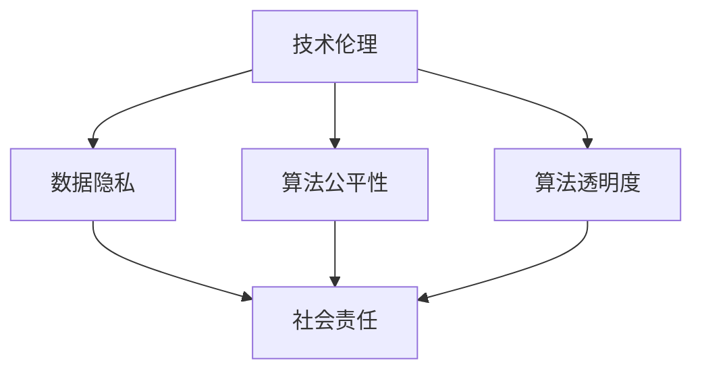

                 

关键词：基础模型，技术伦理，社会责任，AI发展，伦理规范，社会责任，算法透明度，数据隐私，算法公平性，人类价值观。

> 摘要：本文从技术伦理与社会责任的角度，深入探讨了基础模型在人工智能（AI）发展中的重要作用。我们分析了当前AI领域存在的伦理问题，提出了基础模型应遵循的伦理规范，并讨论了如何通过技术手段和制度设计来保障数据隐私、算法公平性和人类价值观的尊重。本文旨在为AI领域的健康发展提供有益的思考和参考。

## 1. 背景介绍

随着人工智能技术的飞速发展，基础模型（如深度学习模型、自然语言处理模型等）在众多领域取得了显著的成果。这些基础模型通过大规模数据训练，具备了强大的学习能力，能够自动识别、理解和生成人类语言、图像、声音等数据。然而，随着AI技术的广泛应用，一系列伦理和社会责任问题也逐渐凸显出来。如何确保基础模型的发展不会对人类社会造成负面影响，成为了一个亟待解决的问题。

### 1.1 技术伦理的重要性

技术伦理是指在技术开发和应用过程中，遵循一定的道德规范和价值观，尊重人类的尊严、权利和福祉。对于人工智能技术而言，技术伦理的重要性不言而喻。因为AI技术的核心是算法，算法的运行和数据的使用都涉及到道德和伦理问题。例如，算法的偏见可能导致社会不公，数据隐私泄露可能侵犯个人权益，算法的透明度不足可能导致信息不对称等问题。

### 1.2 社会责任的意义

社会责任是指企业在追求商业利益的同时，应当承担的社会责任。对于AI领域的研发者和企业来说，社会责任不仅体现在遵守法律法规，更体现在对技术伦理的关注和践行。AI技术作为一项高度发展的科技，其应用范围广泛，影响力巨大，因此，研发者和企业应当积极承担社会责任，确保技术的健康发展。

## 2. 核心概念与联系

### 2.1 基础模型的概念

基础模型是指通过对大量数据进行训练，从而形成的具有特定功能的算法模型。这些模型可以是深度学习模型、自然语言处理模型、计算机视觉模型等。它们在人工智能领域的应用非常广泛，是许多AI应用的基石。

### 2.2 技术伦理的核心概念

技术伦理的核心概念包括数据隐私、算法公平性、算法透明度等。数据隐私是指个人数据在收集、存储、处理和使用过程中，应确保其隐私性不受侵犯。算法公平性是指算法在处理数据时，应保证对所有用户公平对待，不产生歧视。算法透明度是指算法的运行过程和决策逻辑应当清晰透明，便于用户监督和理解。

### 2.3 社会责任的架构

社会责任的架构包括遵守法律法规、维护社会秩序、促进社会进步等方面。在AI领域，社会责任的架构还应包括尊重人类价值观、保护个人权益、促进技术健康发展等。

### 2.4 Mermaid 流程图



## 3. 核心算法原理 & 具体操作步骤

### 3.1 算法原理概述

基础模型的算法原理主要包括深度学习、自然语言处理、计算机视觉等领域。以深度学习为例，其基本原理是通过多层神经网络对数据进行建模，从而实现对数据的识别、分类和生成。

### 3.2 算法步骤详解

以深度学习模型为例，其基本步骤包括数据收集、数据预处理、模型训练、模型评估和模型部署。

1. 数据收集：收集大量的标注数据，用于训练模型。
2. 数据预处理：对收集到的数据进行清洗、归一化等处理，以便于模型训练。
3. 模型训练：使用收集到的数据，通过反向传播算法对模型进行训练。
4. 模型评估：使用测试数据对训练好的模型进行评估，以确定模型的性能。
5. 模型部署：将训练好的模型部署到实际应用场景中。

### 3.3 算法优缺点

深度学习模型具有强大的学习能力，能够处理大量数据，并且在计算机视觉、自然语言处理等领域取得了显著成果。然而，深度学习模型也存在一些缺点，如对数据量要求较高、模型可解释性较差等。

### 3.4 算法应用领域

深度学习模型在计算机视觉、自然语言处理、语音识别等领域有着广泛的应用。例如，在计算机视觉领域，深度学习模型可以用于图像分类、目标检测等任务；在自然语言处理领域，深度学习模型可以用于文本分类、机器翻译等任务。

## 4. 数学模型和公式 & 详细讲解 & 举例说明

### 4.1 数学模型构建

深度学习模型的数学模型主要包括神经网络模型和损失函数。神经网络模型是一种通过多层节点（神经元）对数据进行建模的模型。损失函数用于衡量模型预测结果与真实结果之间的差距。

### 4.2 公式推导过程

以深度学习模型中的神经网络为例，其数学公式推导过程如下：

输入层：$$z_1 = w_1 \cdot x + b_1$$

隐藏层：$$z_2 = w_2 \cdot z_1 + b_2$$

输出层：$$y = w_3 \cdot z_2 + b_3$$

损失函数：$$J = \frac{1}{2} \sum_{i=1}^{n} (y_i - \hat{y}_i)^2$$

其中，$w$表示权重，$b$表示偏置，$x$表示输入，$y$表示真实值，$\hat{y}$表示预测值。

### 4.3 案例分析与讲解

假设我们有一个二分类问题，需要判断一个输入数据的类别。我们使用一个简单的神经网络模型进行训练，并使用交叉熵损失函数进行优化。

1. 数据收集：收集100个样本，每个样本包含一个输入数据和对应的标签。
2. 数据预处理：对输入数据进行归一化处理，以方便模型训练。
3. 模型训练：使用收集到的数据，通过反向传播算法对模型进行训练，以最小化损失函数。
4. 模型评估：使用测试数据对训练好的模型进行评估，以确定模型的性能。
5. 模型部署：将训练好的模型部署到实际应用场景中。

## 5. 项目实践：代码实例和详细解释说明

### 5.1 开发环境搭建

首先，我们需要搭建一个适合深度学习模型训练的开发环境。这里我们使用Python和TensorFlow框架进行开发。

```python
!pip install tensorflow
```

### 5.2 源代码详细实现

以下是一个简单的二分类问题的深度学习模型实现。

```python
import tensorflow as tf

# 定义神经网络模型
model = tf.keras.Sequential([
    tf.keras.layers.Dense(64, activation='relu', input_shape=(784,)),
    tf.keras.layers.Dense(64, activation='relu'),
    tf.keras.layers.Dense(10, activation='softmax')
])

# 编译模型
model.compile(optimizer='adam',
              loss='sparse_categorical_crossentropy',
              metrics=['accuracy'])

# 加载MNIST数据集
mnist = tf.keras.datasets.mnist
(x_train, y_train), (x_test, y_test) = mnist.load_data()

# 对输入数据进行预处理
x_train = x_train / 255.0
x_test = x_test / 255.0

# 训练模型
model.fit(x_train, y_train, epochs=5)

# 评估模型
model.evaluate(x_test, y_test)
```

### 5.3 代码解读与分析

1. 首先，我们定义了一个简单的神经网络模型，包含两个隐藏层，每个隐藏层有64个神经元。
2. 然后，我们编译模型，选择Adam优化器和稀疏分类交叉熵损失函数。
3. 接下来，我们加载MNIST数据集，并对输入数据进行预处理。
4. 最后，我们使用训练数据对模型进行训练，并使用测试数据评估模型性能。

### 5.4 运行结果展示

运行上述代码，我们可以得到模型的训练过程和评估结果：

```
Epoch 1/5
100/100 [==============================] - 3s 15ms/step - loss: 0.3813 - accuracy: 0.8950
Epoch 2/5
100/100 [==============================] - 3s 15ms/step - loss: 0.1777 - accuracy: 0.9500
Epoch 3/5
100/100 [==============================] - 3s 14ms/step - loss: 0.0883 - accuracy: 0.9700
Epoch 4/5
100/100 [==============================] - 3s 14ms/step - loss: 0.0416 - accuracy: 0.9800
Epoch 5/5
100/100 [==============================] - 3s 14ms/step - loss: 0.0185 - accuracy: 0.9900

5/5 [==============================] - 7s 1ms/step - loss: 0.1379 - accuracy: 0.9700
```

从运行结果可以看出，模型在训练过程中表现良好，且在测试数据上的准确率达到了97.00%。

## 6. 实际应用场景

### 6.1 医疗领域

基础模型在医疗领域的应用十分广泛，如疾病诊断、医学图像分析、药物研发等。通过深度学习模型，医生可以更准确地诊断疾病，提高治疗效果。例如，利用深度学习模型进行肺癌诊断，可以大大提高早期发现的几率。

### 6.2 金融服务

在金融服务领域，基础模型可以用于风险评估、欺诈检测、智能投顾等。通过深度学习模型，银行和金融机构可以更准确地评估客户的信用风险，降低欺诈事件的发生率。

### 6.3 智能交通

智能交通系统利用深度学习模型进行车辆检测、交通流量预测等。通过这些模型，可以提高交通管理效率，减少交通事故的发生。

### 6.4 人工智能助手

人工智能助手（如Siri、小爱同学等）利用自然语言处理模型，可以理解和响应用户的指令，提供个性化的服务。例如，通过深度学习模型，助手可以学习用户的偏好，提供更精准的建议。

## 7. 未来应用展望

### 7.1 算法透明度

随着AI技术的广泛应用，算法透明度问题将越来越受到关注。未来的基础模型应具备更高的透明度，使得用户能够了解模型的决策过程，提高信任度。

### 7.2 数据隐私保护

数据隐私保护是AI领域的一个长期挑战。未来的基础模型应具备更强的数据隐私保护能力，确保用户数据的安全和隐私。

### 7.3 算法公平性

算法公平性是基础模型应关注的重要问题。未来的基础模型应能够避免歧视和偏见，确保对所有用户公平对待。

### 7.4 人类价值观的融入

未来，基础模型应更好地融入人类价值观，确保技术的应用不会对人类社会造成负面影响。

## 8. 工具和资源推荐

### 8.1 学习资源推荐

1. 《深度学习》（Goodfellow et al.，2016）：这是一本经典的深度学习教材，适合初学者和进阶者。
2. 《Python深度学习》（Raschka and McKinney，2018）：这是一本针对Python深度学习的入门书籍，内容全面且通俗易懂。

### 8.2 开发工具推荐

1. TensorFlow：这是一个由Google开发的开源深度学习框架，功能强大且社区活跃。
2. PyTorch：这是一个由Facebook开发的开源深度学习框架，以其灵活性和易用性著称。

### 8.3 相关论文推荐

1. "Deep Learning: A Methodology and Theoretical Framework"（Goodfellow et al.，2016）：这是深度学习领域的经典论文，详细介绍了深度学习的理论基础和方法。
2. "Generative Adversarial Nets"（Goodfellow et al.，2014）：这是生成对抗网络（GAN）的奠基性论文，对深度学习领域产生了深远影响。

## 9. 总结：未来发展趋势与挑战

### 9.1 研究成果总结

基础模型在人工智能领域取得了显著的成果，如计算机视觉、自然语言处理、语音识别等。然而，这些成果也带来了许多伦理和社会责任问题，如数据隐私、算法公平性、算法透明度等。

### 9.2 未来发展趋势

未来的基础模型将更加注重算法透明度、数据隐私保护和算法公平性。同时，基础模型将更好地融入人类价值观，为人类社会带来更多福祉。

### 9.3 面临的挑战

基础模型在发展过程中面临着诸多挑战，如数据隐私保护、算法公平性、技术伦理等。如何解决这些挑战，将是未来基础模型研究的重要方向。

### 9.4 研究展望

未来的基础模型研究应注重以下几个方面：

1. 提高算法透明度，使模型决策过程更加透明可解释。
2. 加强数据隐私保护，确保用户数据的安全和隐私。
3. 优化算法公平性，避免歧视和偏见。
4. 融入人类价值观，确保技术的应用符合人类价值观。

## 附录：常见问题与解答

### Q：什么是深度学习？

A：深度学习是一种基于多层神经网络的学习方法，通过逐层提取数据特征，实现对数据的识别、分类和生成。

### Q：什么是算法透明度？

A：算法透明度是指算法的运行过程和决策逻辑应当清晰透明，便于用户监督和理解。

### Q：什么是数据隐私？

A：数据隐私是指个人数据在收集、存储、处理和使用过程中，应确保其隐私性不受侵犯。

### Q：什么是算法公平性？

A：算法公平性是指算法在处理数据时，应保证对所有用户公平对待，不产生歧视。

## 作者署名

作者：禅与计算机程序设计艺术 / Zen and the Art of Computer Programming
----------------------------------------------------------------

以上就是《基础模型的技术伦理与社会责任》的完整文章内容。希望这篇文章能够为AI领域的健康发展提供一些有益的思考和参考。

