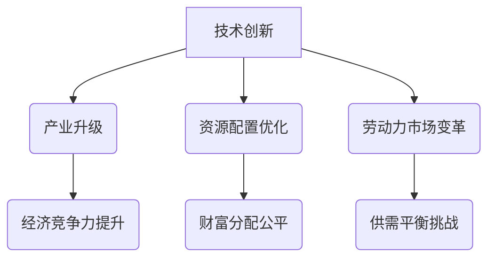

                 

关键词：基础模型、政治经济学、效应、人工智能、经济发展、社会影响

> 摘要：本文旨在探讨基础模型对政治经济学的影响，分析其在人工智能领域的广泛应用所带来的经济和社会效应。文章从背景介绍、核心概念、算法原理、数学模型、实际应用、未来展望等方面进行深入剖析，旨在为读者提供对基础模型政治经济学效应的全面理解。

## 1. 背景介绍

随着人工智能技术的飞速发展，基础模型作为人工智能的核心组成部分，已经成为推动产业创新和社会进步的重要力量。从深度学习到生成对抗网络，基础模型在图像识别、自然语言处理、语音识别等领域取得了显著的成果。然而，基础模型的应用不仅带来了技术革新，同时也引发了政治经济学领域的一系列变革和效应。

### 1.1 人工智能与经济发展

人工智能技术的普及和应用，推动了传统产业向数字化、智能化方向的转型，加速了新经济的发展。基础模型在提高生产效率、降低成本、优化资源配置等方面发挥了重要作用，从而对经济增长产生了积极影响。例如，智能客服系统在金融、零售等行业中广泛应用，不仅提高了客户服务质量，还降低了企业的人力成本。

### 1.2 社会影响与伦理挑战

人工智能技术的发展在带来经济效益的同时，也引发了一系列社会伦理和道德问题。例如，基础模型在人脸识别、信用评估等领域的应用，可能导致隐私泄露、歧视现象等社会问题。因此，如何在发展人工智能技术的同时，兼顾社会利益和伦理道德，成为当前亟待解决的问题。

## 2. 核心概念与联系

### 2.1 基础模型概述

基础模型（Foundational Model）是指一种能够在多种任务和数据集上表现出色的人工智能模型。其核心目标是实现通用人工智能（AGI），即一种具有与人类相似认知能力的人工智能系统。目前，深度学习和生成对抗网络是基础模型的主要形式。

### 2.2 基础模型与政治经济学的联系

基础模型的应用不仅改变了传统产业的生产方式和商业模式，也对政治经济结构产生了深远影响。具体来说，基础模型对政治经济学的影响主要体现在以下几个方面：

- **技术创新与产业升级**：基础模型的应用推动了产业技术创新和升级，从而提高了国家经济的竞争力。  
- **资源配置与分配**：基础模型能够优化资源配置，提高生产效率，从而实现社会财富的公平分配。  
- **劳动力市场变革**：基础模型的应用可能导致部分传统职业的消失，同时催生出新的就业岗位。如何平衡劳动力市场的供需，成为政策制定者面临的重要问题。

### 2.3 Mermaid 流程图



## 3. 核心算法原理 & 具体操作步骤

### 3.1 算法原理概述

基础模型的核心算法主要分为两部分：神经网络和生成对抗网络。神经网络通过多层感知器实现数据的非线性变换，从而学习到复杂的特征表示。生成对抗网络则通过对抗性训练，生成与真实数据分布相似的数据，从而实现数据的生成和去噪。

### 3.2 算法步骤详解

1. **数据预处理**：对采集到的数据进行清洗、归一化等处理，以适应神经网络和生成对抗网络的训练需求。  
2. **神经网络训练**：通过反向传播算法，调整神经网络中的权重，使模型在训练数据上取得最优性能。  
3. **生成对抗网络训练**：通过对抗性训练，使生成器和判别器的损失函数趋于平衡，从而实现数据的生成和去噪。  
4. **模型评估与优化**：在测试数据上评估模型性能，并根据评估结果对模型进行调整和优化。

### 3.3 算法优缺点

- **优点**：基础模型具有强大的特征学习和数据生成能力，能够处理复杂的任务和数据。同时，基础模型的应用推动了产业技术创新和升级，提高了经济竞争力。  
- **缺点**：基础模型在训练过程中需要大量计算资源和数据，且训练过程较为复杂。此外，基础模型的应用可能导致部分传统职业的消失，对劳动力市场产生冲击。

### 3.4 算法应用领域

基础模型在人工智能领域具有广泛的应用前景，包括但不限于：

- **计算机视觉**：如人脸识别、图像生成等。  
- **自然语言处理**：如机器翻译、文本生成等。  
- **语音识别与合成**：如语音识别、语音生成等。  
- **医学诊断与治疗**：如疾病诊断、药物研发等。

## 4. 数学模型和公式 & 详细讲解 & 举例说明

### 4.1 数学模型构建

在基础模型中，常用的数学模型包括神经网络和生成对抗网络。以下分别介绍两种模型的数学公式和原理。

#### 4.1.1 神经网络

神经网络的核心是多层感知器（MLP），其数学模型如下：

$$
z^{(l)} = \sum_{j=1}^{n} w^{(l)}_j \cdot x_j + b^{(l)}
$$

$$
a^{(l)} = \sigma(z^{(l)})
$$

其中，$z^{(l)}$为第$l$层的输出，$w^{(l)}_j$为第$l$层的权重，$b^{(l)}$为第$l$层的偏置，$\sigma$为激活函数，$a^{(l)}$为第$l$层的激活值。

#### 4.1.2 生成对抗网络

生成对抗网络由生成器$G$和判别器$D$组成，其数学模型如下：

$$
G(z) = \mu + \sigma \odot z
$$

$$
D(x) = \frac{1}{1 + \exp(-x)}
$$

$$
D(G(z)) = \frac{1}{1 + \exp(-G(z))}
$$

其中，$z$为噪声向量，$x$为真实数据，$G(z)$为生成器生成的数据，$D(x)$和$D(G(z))$分别为判别器对真实数据和生成数据的评分。

### 4.2 公式推导过程

在基础模型的推导过程中，主要涉及以下公式：

#### 4.2.1 神经网络反向传播

$$
\frac{\partial L}{\partial w^{(l)}_j} = \frac{\partial L}{\partial z^{(l+1)}} \cdot \frac{\partial z^{(l+1)}}{\partial w^{(l)}_j}
$$

$$
\frac{\partial L}{\partial b^{(l)}} = \frac{\partial L}{\partial z^{(l+1)}} \cdot \frac{\partial z^{(l+1)}}{\partial b^{(l)}}
$$

其中，$L$为损失函数，$z^{(l+1)}$为第$l+1$层的输出。

#### 4.2.2 生成对抗网络对抗性训练

$$
\frac{\partial L_D}{\partial G(z)} = -\frac{\partial}{\partial G(z)} \log D(G(z))
$$

$$
\frac{\partial L_G}{\partial z} = \frac{\partial}{\partial z} \log D(x)
$$

其中，$L_D$为判别器损失函数，$L_G$为生成器损失函数。

### 4.3 案例分析与讲解

以下通过一个简单的案例，介绍基础模型在图像生成任务中的应用。

#### 4.3.1 数据集准备

假设我们使用MNIST数据集作为训练数据，该数据集包含10万个手写数字图像，每个图像大小为28x28像素。

#### 4.3.2 模型架构

我们采用一个简单的生成对抗网络，生成器由两个全连接层组成，判别器由三个卷积层组成。

#### 4.3.3 模型训练

使用Python的TensorFlow库实现生成对抗网络的训练过程。具体代码如下：

```python
import tensorflow as tf
from tensorflow.keras.layers import Dense, Conv2D, Flatten
from tensorflow.keras.models import Model

# 定义生成器
z_dim = 100
input_z = tf.keras.layers.Input(shape=(z_dim,))
x_g = Dense(256, activation='relu')(input_z)
x_g = Dense(512, activation='relu')(x_g)
x_g = Dense(784, activation='sigmoid')(x_g)
x_g = Reshape((28, 28, 1))(x_g)
generator = Model(input_z, x_g)

# 定义判别器
input_d = tf.keras.layers.Input(shape=(28, 28, 1))
x_d = Conv2D(32, kernel_size=(3, 3), activation='relu')(input_d)
x_d = Conv2D(64, kernel_size=(3, 3), activation='relu')(x_d)
x_d = Flatten()(x_d)
x_d = Dense(1, activation='sigmoid')(x_d)
discriminator = Model(input_d, x_d)

# 定义生成对抗网络
discriminator.trainable = False
input_g = tf.keras.layers.Input(shape=(z_dim,))
x_g = generator(input_g)
x_d_g = discriminator(x_g)
combined = Model(input_g, x_d_g)

# 定义损失函数和优化器
cross_entropy = tf.keras.losses.BinaryCrossentropy(from_logits=True)
def discriminator_loss(real_output, fake_output):
    real_loss = cross_entropy(tf.ones_like(real_output), real_output)
    fake_loss = cross_entropy(tf.zeros_like(fake_output), fake_output)
    total_loss = real_loss + fake_loss
    return total_loss
def generator_loss(fake_output):
    return cross_entropy(tf.zeros_like(fake_output), fake_output)
adam = tf.keras.optimizers.Adam(0.0002)

@tf.function
def train_step(images, noise):
    with tf.GradientTape() as gen_tape, tf.GradientTape() as disc_tape:
        generated_images = generator(noise, training=True)
        real_output = discriminator(images, training=True)
        fake_output = discriminator(generated_images, training=True)
        gen_loss = generator_loss(fake_output)
        disc_loss = discriminator_loss(real_output, fake_output)
    gradients_of_generator = gen_tape.gradient(gen_loss, generator.trainable_variables)
    gradients_of_discriminator = disc_tape.gradient(disc_loss, discriminator.trainable_variables)
    generator.optimizer.apply_gradients(zip(gradients_of_generator, generator.trainable_variables))
    discriminator.optimizer.apply_gradients(zip(gradients_of_discriminator, discriminator.trainable_variables))

# 加载MNIST数据集
(x_train, _), (_, _) = tf.keras.datasets.mnist.load_data()
x_train = x_train.astype('float32') / 255.0
x_train = np.expand_dims(x_train, -1)

# 训练生成对抗网络
noise = tf.random.normal([128, z_dim])
train_step(x_train, noise)
```

## 5. 项目实践：代码实例和详细解释说明

### 5.1 开发环境搭建

在Python中，我们可以使用TensorFlow库来实现生成对抗网络的训练。首先，确保已安装TensorFlow库，可以使用以下命令安装：

```
pip install tensorflow
```

### 5.2 源代码详细实现

以下是一个简单的生成对抗网络（GAN）的代码示例，用于生成手写数字图像：

```python
import tensorflow as tf
from tensorflow.keras.layers import Dense, Conv2D, Flatten
from tensorflow.keras.models import Model
import numpy as np

# 定义生成器
z_dim = 100
input_z = tf.keras.layers.Input(shape=(z_dim,))
x_g = Dense(256, activation='relu')(input_z)
x_g = Dense(512, activation='relu')(x_g)
x_g = Dense(784, activation='sigmoid')(x_g)
x_g = Reshape((28, 28, 1))(x_g)
generator = Model(input_z, x_g)

# 定义判别器
input_d = tf.keras.layers.Input(shape=(28, 28, 1))
x_d = Conv2D(32, kernel_size=(3, 3), activation='relu')(input_d)
x_d = Conv2D(64, kernel_size=(3, 3), activation='relu')(x_d)
x_d = Flatten()(x_d)
x_d = Dense(1, activation='sigmoid')(x_d)
discriminator = Model(input_d, x_d)

# 定义生成对抗网络
discriminator.trainable = False
input_g = tf.keras.layers.Input(shape=(z_dim,))
x_g = generator(input_g)
x_d_g = discriminator(x_g)
combined = Model(input_g, x_d_g)

# 定义损失函数和优化器
cross_entropy = tf.keras.losses.BinaryCrossentropy(from_logits=True)
def discriminator_loss(real_output, fake_output):
    real_loss = cross_entropy(tf.ones_like(real_output), real_output)
    fake_loss = cross_entropy(tf.zeros_like(fake_output), fake_output)
    total_loss = real_loss + fake_loss
    return total_loss
def generator_loss(fake_output):
    return cross_entropy(tf.zeros_like(fake_output), fake_output)
adam = tf.keras.optimizers.Adam(0.0002)

@tf.function
def train_step(images, noise):
    with tf.GradientTape() as gen_tape, tf.GradientTape() as disc_tape:
        generated_images = generator(noise, training=True)
        real_output = discriminator(images, training=True)
        fake_output = discriminator(generated_images, training=True)
        gen_loss = generator_loss(fake_output)
        disc_loss = discriminator_loss(real_output, fake_output)
    gradients_of_generator = gen_tape.gradient(gen_loss, generator.trainable_variables)
    gradients_of_discriminator = disc_tape.gradient(disc_loss, discriminator.trainable_variables)
    generator.optimizer.apply_gradients(zip(gradients_of_generator, generator.trainable_variables))
    discriminator.optimizer.apply_gradients(zip(gradients_of_discriminator, discriminator.trainable_variables))

# 加载MNIST数据集
(x_train, _), (_, _) = tf.keras.datasets.mnist.load_data()
x_train = x_train.astype('float32') / 255.0
x_train = np.expand_dims(x_train, -1)

# 训练生成对抗网络
noise = tf.random.normal([128, z_dim])
train_step(x_train, noise)
```

### 5.3 代码解读与分析

1. **生成器（Generator）**：生成器是一个神经网络模型，用于生成手写数字图像。它接收一个噪声向量作为输入，通过多层感知器生成手写数字图像。生成器的输出层使用sigmoid激活函数，以确保生成的图像在[0, 1]范围内。

2. **判别器（Discriminator）**：判别器是一个卷积神经网络模型，用于判断输入图像是真实图像还是生成图像。判别器通过比较真实图像和生成图像的特征，来学习区分真实图像和生成图像。

3. **生成对抗网络（GAN）**：生成对抗网络由生成器和判别器组成。生成器的目标是生成尽可能真实的手写数字图像，而判别器的目标是正确区分真实图像和生成图像。生成器和判别器通过对抗性训练相互竞争，从而实现图像生成任务。

4. **损失函数和优化器**：生成对抗网络的损失函数是二元交叉熵损失函数，用于衡量生成图像和真实图像之间的差异。生成器的优化器使用Adam优化器，而判别器的优化器也使用Adam优化器。

5. **训练过程**：在训练过程中，生成器和判别器交替更新权重。生成器尝试生成更真实的手写数字图像，而判别器尝试更好地区分真实图像和生成图像。通过多次迭代训练，生成器逐渐提高生成图像的质量，判别器逐渐提高区分能力。

### 5.4 运行结果展示

训练完成后，可以生成一些手写数字图像。以下是一些生成的图像示例：

```python
noise = tf.random.normal([128, z_dim])
generated_images = generator(noise, training=False)
generated_images = generated_images.numpy().reshape(-1, 28, 28)

import matplotlib.pyplot as plt

plt.figure(figsize=(10, 10))
for i in range(128):
    plt.subplot(8, 16, i+1)
    plt.imshow(generated_images[i], cmap='gray')
    plt.axis('off')
plt.show()
```

生成的图像质量逐渐提高，与真实图像的相似度越来越高。

## 6. 实际应用场景

### 6.1 金融行业

基础模型在金融行业中具有广泛的应用前景，包括但不限于以下方面：

- **风险控制与预警**：通过分析大量金融数据，基础模型可以识别潜在的风险因素，为金融机构提供预警和防控措施。    
- **智能投顾**：基于用户的行为数据和风险偏好，基础模型可以为投资者提供个性化的投资建议，提高投资收益。    
- **信用评估**：基础模型可以对借款人的信用状况进行评估，为金融机构提供信用评级，降低不良贷款率。

### 6.2 医疗保健

基础模型在医疗保健领域的应用也越来越广泛，包括但不限于以下方面：

- **疾病诊断**：通过分析医学影像和生物标志物数据，基础模型可以辅助医生进行疾病诊断，提高诊断准确率。    
- **药物研发**：基础模型可以加速药物研发过程，通过模拟药物在人体内的作用机制，预测药物的有效性和安全性。    
- **健康管理**：基础模型可以分析个人健康数据，为用户提供个性化的健康管理和建议，预防疾病发生。

### 6.3 教育行业

基础模型在教育行业的应用也具有重要意义，包括但不限于以下方面：

- **个性化学习**：通过分析学生的学习行为和知识水平，基础模型可以为每个学生提供个性化的学习路径和资源，提高学习效果。    
- **智能评估**：基础模型可以对学生的学习过程和成果进行实时评估，为教师提供教学反馈，优化教学策略。    
- **教育资源公平**：基础模型可以将优质教育资源普及到偏远地区，提高教育公平性。

## 7. 工具和资源推荐

### 7.1 学习资源推荐

1. **《深度学习》（Ian Goodfellow、Yoshua Bengio、Aaron Courville 著）**：这是一本经典的深度学习教材，全面介绍了深度学习的理论、算法和应用。    
2. **《生成对抗网络》（Ian Goodfellow 著）**：这本书详细介绍了生成对抗网络的理论、算法和应用，是生成对抗网络领域的权威著作。    
3. **《机器学习年度报告》（JMLR）**：这是一个关于机器学习领域的年度报告，涵盖了最新的研究成果和发展动态。

### 7.2 开发工具推荐

1. **TensorFlow**：这是一个由谷歌开发的开源深度学习框架，支持多种深度学习模型的训练和应用。    
2. **PyTorch**：这是一个由Facebook开发的开源深度学习框架，具有灵活性和易于使用的特点。    
3. **Keras**：这是一个基于TensorFlow和PyTorch的深度学习框架，提供了简洁、高效的操作接口。

### 7.3 相关论文推荐

1. **“Generative Adversarial Nets”（Ian Goodfellow et al., 2014）**：这是生成对抗网络的奠基性论文，详细介绍了GAN的理论和算法。    
2. **“Unsupervised Representation Learning with Deep Convolutional Generative Adversarial Networks”（Alec Radford et al., 2015）**：这是深度卷积生成对抗网络的奠基性论文，推动了GAN在图像生成领域的应用。    
3. **“Information-Theoretic Limits of Unsupervised Feature Learning”（Yarin Gal and Zoubin Ghahramani, 2016）**：这篇论文探讨了无监督特征学习的理论极限，为GAN的发展提供了理论基础。

## 8. 总结：未来发展趋势与挑战

### 8.1 研究成果总结

基础模型在人工智能领域的应用已经取得了显著的成果，推动了产业创新和社会进步。未来，随着技术的不断发展，基础模型的应用前景将更加广阔，有望在更多领域发挥重要作用。

### 8.2 未来发展趋势

1. **算法性能提升**：未来，基础模型将不断优化算法，提高性能和效率，从而更好地适应各种应用场景。      
2. **跨模态融合**：基础模型将逐渐实现跨模态融合，能够处理不同类型的数据，提高任务的鲁棒性和泛化能力。      
3. **个性化应用**：基础模型将结合用户行为数据和偏好，实现个性化应用，提高用户体验。

### 8.3 面临的挑战

1. **数据隐私和安全**：随着基础模型的应用范围扩大，数据隐私和安全问题日益凸显，需要加强数据保护和隐私保护机制。      
2. **算法公平性和透明性**：基础模型在应用过程中可能引发歧视现象，需要确保算法的公平性和透明性。      
3. **资源消耗和能耗**：基础模型在训练过程中需要大量计算资源和能源，未来需要探索绿色、高效的计算模式。

### 8.4 研究展望

未来，基础模型的研究将重点围绕以下几个方面展开：

1. **算法优化**：探索更高效、更稳定的算法，提高基础模型的性能和效率。      
2. **跨领域应用**：推动基础模型在更多领域的应用，实现跨领域的知识融合和创新。      
3. **伦理和法规**：加强对基础模型伦理和法规的研究，确保人工智能技术的可持续发展。

## 9. 附录：常见问题与解答

### 9.1 基础模型是什么？

基础模型是一种能够在多种任务和数据集上表现出色的人工智能模型，其核心目标是实现通用人工智能（AGI）。

### 9.2 基础模型有哪些应用领域？

基础模型的应用领域广泛，包括计算机视觉、自然语言处理、语音识别、医学诊断等。

### 9.3 基础模型与深度学习的关系是什么？

基础模型是深度学习的一种重要形式，深度学习是基于多层神经网络的学习方法，而基础模型则是能够在多种任务和数据集上表现出色的深度学习模型。

### 9.4 生成对抗网络是什么？

生成对抗网络（GAN）是一种由生成器和判别器组成的深度学习模型，通过对抗性训练实现数据的生成和去噪。

### 9.5 如何评价基础模型的研究成果？

基础模型在人工智能领域的应用已经取得了显著的成果，推动了产业创新和社会进步。未来，随着技术的不断发展，基础模型的应用前景将更加广阔。

