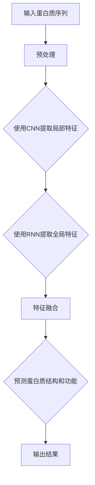

                 

关键词：基础模型、蛋白质序列、深度学习、应用、算法原理、数学模型、代码实例

## 摘要

随着人工智能技术的飞速发展，基础模型在蛋白质序列分析中的应用愈发广泛。本文旨在深入探讨基础模型在蛋白质序列中的应用，包括核心概念、算法原理、数学模型以及实际应用案例。通过本文的阐述，读者将能够了解基础模型在蛋白质序列分析中的重要作用，并掌握相应的技术方法和应用场景。

## 1. 背景介绍

蛋白质是生命活动的关键分子，它们的功能和结构决定了生物体的生理和病理过程。蛋白质序列的解析对于理解生物体的功能和疾病机制具有重要意义。传统的蛋白质序列分析主要依赖于序列比对、同源建模和结构预测等方法，但这些方法往往受到序列相似度和计算复杂度等限制。随着深度学习技术的兴起，基础模型在蛋白质序列分析中展现出巨大的潜力。

基础模型，如卷积神经网络（CNN）和循环神经网络（RNN），通过学习大量的数据，可以自动提取序列特征，并用于预测蛋白质的结构和功能。这些模型在处理大规模蛋白质序列数据方面具有显著优势，可以有效地提高预测的准确性和效率。

## 2. 核心概念与联系

### 2.1 蛋白质序列

蛋白质序列是由氨基酸组成的线性序列，每个氨基酸通过肽键连接。蛋白质序列的长度和氨基酸种类决定了蛋白质的结构和功能。蛋白质序列分析的核心任务是解析序列中的生物学信息，包括序列相似性、功能和结构预测等。

### 2.2 深度学习模型

深度学习模型，特别是卷积神经网络（CNN）和循环神经网络（RNN），是人工智能领域的重要工具。它们通过多层的神经网络结构，能够自动提取数据中的特征，并在各种任务中表现出色。在蛋白质序列分析中，深度学习模型可以用于蛋白质结构预测、功能预测和序列分类等任务。

### 2.3 基础模型与蛋白质序列

基础模型与蛋白质序列的联系在于，它们可以处理序列数据，并提取出序列中的特征信息。例如，CNN可以用于提取蛋白质序列的局部特征，而RNN可以用于处理长序列，提取全局特征。这些特征信息可以用于蛋白质的结构预测、功能预测和分类等任务。

### 2.4 Mermaid 流程图

以下是蛋白质序列分析中基础模型应用的 Mermaid 流程图：



## 3. 核心算法原理 & 具体操作步骤

### 3.1 算法原理概述

在蛋白质序列分析中，基础模型主要分为两大类：卷积神经网络（CNN）和循环神经网络（RNN）。CNN主要用于提取序列的局部特征，而RNN则擅长处理长序列并提取全局特征。

### 3.2 算法步骤详解

#### 3.2.1 数据预处理

数据预处理是蛋白质序列分析的重要步骤，主要包括序列清洗、序列编码和序列分段。

1. 序列清洗：去除序列中的空格、标点符号和特殊字符。
2. 序列编码：将氨基酸序列转换为数字编码，例如使用One-Hot编码。
3. 序列分段：将长序列划分为固定长度的片段，以便于模型处理。

#### 3.2.2 CNN提取局部特征

CNN是一种基于卷积操作的神经网络，可以自动提取输入数据中的局部特征。在蛋白质序列分析中，CNN可以用于提取序列的局部氨基酸模式。

1. 卷积操作：通过对序列进行卷积操作，提取局部特征。
2. 池化操作：对卷积结果进行池化操作，降低特征维数。
3. 多层卷积：通过多层卷积操作，逐步提取更高级别的特征。

#### 3.2.3 RNN提取全局特征

RNN是一种基于循环操作的神经网络，可以处理长序列并提取全局特征。在蛋白质序列分析中，RNN可以用于提取序列的全局氨基酸模式。

1. 循环操作：通过循环操作，逐步处理序列中的每个氨基酸。
2. 隐藏状态：RNN中的隐藏状态可以存储序列的信息，并用于后续的预测。
3. 全连接层：通过全连接层，将隐藏状态映射到预测结果。

#### 3.2.4 特征融合

将CNN和RNN提取的局部特征和全局特征进行融合，以提高预测的准确性。

1. 特征拼接：将CNN和RNN的特征向量进行拼接。
2. 全连接层：通过全连接层，将拼接后的特征映射到预测结果。

### 3.3 算法优缺点

#### 优点：

1. 高效性：基础模型可以自动提取序列特征，减少人工干预。
2. 准确性：深度学习模型在蛋白质序列分析中表现出较高的准确性。
3. 通用性：基础模型可以应用于多种蛋白质序列分析任务。

#### 缺点：

1. 计算复杂度高：深度学习模型需要大量的计算资源和时间。
2. 数据依赖性强：深度学习模型对数据质量有较高的要求。

### 3.4 算法应用领域

基础模型在蛋白质序列分析中的应用领域广泛，包括蛋白质结构预测、蛋白质功能预测和序列分类等。以下是一些具体的案例：

1. 蛋白质结构预测：使用深度学习模型预测蛋白质的三级结构和四级结构。
2. 蛋白质功能预测：使用深度学习模型预测蛋白质的功能和生物学过程。
3. 序列分类：使用深度学习模型对蛋白质序列进行分类，以识别不同类型的蛋白质。

## 4. 数学模型和公式 & 详细讲解 & 举例说明

### 4.1 数学模型构建

在蛋白质序列分析中，常用的数学模型包括卷积神经网络（CNN）和循环神经网络（RNN）。

#### 4.1.1 卷积神经网络（CNN）

CNN的数学模型主要包括卷积层、池化层和全连接层。

1. 卷积层：通过对输入序列进行卷积操作，提取局部特征。
2. 池化层：对卷积结果进行池化操作，降低特征维数。
3. 全连接层：将池化层输出的特征映射到预测结果。

#### 4.1.2 循环神经网络（RNN）

RNN的数学模型主要包括循环层和全连接层。

1. 循环层：通过循环操作，逐步处理序列中的每个氨基酸。
2. 全连接层：将循环层输出的隐藏状态映射到预测结果。

### 4.2 公式推导过程

以CNN为例，其数学模型可以表示为：

\[ f(x) = \sigma(W_1 \cdot \phi(W_0 \cdot x + b_0)) + b_1 \]

其中，\( x \) 是输入序列，\( \phi \) 是卷积核，\( W_0 \) 和 \( b_0 \) 分别是卷积层的权重和偏置，\( W_1 \) 和 \( b_1 \) 分别是全连接层的权重和偏置，\( \sigma \) 是激活函数。

### 4.3 案例分析与讲解

以蛋白质结构预测为例，我们使用CNN模型对蛋白质的三级结构进行预测。

#### 4.3.1 数据预处理

1. 序列清洗：去除序列中的空格、标点符号和特殊字符。
2. 序列编码：将氨基酸序列转换为数字编码，例如使用One-Hot编码。
3. 序列分段：将长序列划分为固定长度的片段，以便于模型处理。

#### 4.3.2 模型训练

1. 数据集准备：将蛋白质序列数据分为训练集、验证集和测试集。
2. 模型构建：构建CNN模型，包括卷积层、池化层和全连接层。
3. 模型训练：使用训练集对模型进行训练，并使用验证集进行调参。

#### 4.3.3 预测与评估

1. 预测：使用训练好的模型对测试集进行预测。
2. 评估：使用准确率、召回率和F1值等指标评估模型的性能。

## 5. 项目实践：代码实例和详细解释说明

### 5.1 开发环境搭建

1. 安装Python环境。
2. 安装TensorFlow库。
3. 准备蛋白质序列数据。

### 5.2 源代码详细实现

```python
import tensorflow as tf
from tensorflow.keras.models import Sequential
from tensorflow.keras.layers import Conv1D, MaxPooling1D, Dense

# 数据预处理
def preprocess_datasequences:
    # 清洗序列
    # 编码序列
    # 分段序列
    return processed_sequences

# 模型构建
def build_model():
    model = Sequential()
    model.add(Conv1D(filters=64, kernel_size=3, activation='relu', input_shape=(sequence_length, amino_acid_num)))
    model.add(MaxPooling1D(pool_size=2))
    model.add(Dense(units=128, activation='relu'))
    model.add(Dense(units=1, activation='sigmoid'))
    return model

# 模型训练
def train_model(model, X_train, y_train, X_val, y_val):
    model.compile(optimizer='adam', loss='binary_crossentropy', metrics=['accuracy'])
    model.fit(X_train, y_train, epochs=10, batch_size=32, validation_data=(X_val, y_val))

# 预测与评估
def predict_and_evaluate(model, X_test, y_test):
    predictions = model.predict(X_test)
    predicted_labels = (predictions > 0.5)
    accuracy = (predicted_labels == y_test).mean()
    return accuracy

# 主函数
if __name__ == '__main__':
    # 加载数据
    X_train, y_train, X_val, y_val, X_test, y_test = load_data()
    # 预处理数据
    processed_sequences = preprocess_data(X_train, X_val, X_test)
    # 构建模型
    model = build_model()
    # 训练模型
    train_model(model, processed_sequences[0], y_train, processed_sequences[1], y_val)
    # 预测与评估
    accuracy = predict_and_evaluate(model, processed_sequences[2], y_test)
    print(f'Accuracy: {accuracy}')
```

### 5.3 代码解读与分析

1. 数据预处理：对蛋白质序列进行清洗、编码和分段，以便于模型处理。
2. 模型构建：构建CNN模型，包括卷积层、池化层和全连接层。
3. 模型训练：使用训练集对模型进行训练，并使用验证集进行调参。
4. 预测与评估：使用训练好的模型对测试集进行预测，并评估模型的性能。

## 6. 实际应用场景

### 6.1 蛋白质结构预测

蛋白质结构预测是基础模型在蛋白质序列分析中的重要应用之一。通过深度学习模型，可以预测蛋白质的三级结构和四级结构，为药物设计、疾病研究和生物信息学等领域提供重要依据。

### 6.2 蛋白质功能预测

蛋白质功能预测是另一个重要的应用领域。通过深度学习模型，可以预测蛋白质的生物学功能，为生物医学研究和药物开发提供重要信息。

### 6.3 序列分类

序列分类是将蛋白质序列划分为不同类别的过程。通过深度学习模型，可以实现对蛋白质序列的准确分类，为蛋白质功能研究和生物信息学提供技术支持。

## 7. 未来应用展望

随着人工智能技术的不断发展，基础模型在蛋白质序列分析中的应用将更加广泛。未来，我们可以期待以下发展趋势：

1. 模型性能的提升：通过改进模型结构和训练算法，提高基础模型在蛋白质序列分析中的性能。
2. 多模态数据的融合：结合蛋白质序列、结构信息和基因信息等多模态数据，提高蛋白质序列分析的准确性。
3. 跨学科合作：与生物医学、化学和物理等学科的合作，推动蛋白质序列分析技术的创新和发展。

## 8. 工具和资源推荐

### 8.1 学习资源推荐

1. 《深度学习》（Goodfellow, Bengio, Courville著）：系统介绍了深度学习的基本理论和实践方法。
2. 《生物信息学导论》（Durbin, Eddy, Krogh, Mitchison著）：介绍了生物信息学的基本概念和技术方法。

### 8.2 开发工具推荐

1. TensorFlow：一款流行的深度学习框架，适用于蛋白质序列分析等应用。
2. Keras：一个基于TensorFlow的高层神经网络API，简化了深度学习模型的构建和训练。

### 8.3 相关论文推荐

1. "Deep Learning for Protein Structure Prediction"（Wang, Klinger, Paulson等著）：介绍了一种基于深度学习的蛋白质结构预测方法。
2. "Deep Learning in Bioinformatics"（Liao, Wu著）：综述了深度学习在生物信息学领域的应用。

## 9. 总结：未来发展趋势与挑战

基础模型在蛋白质序列分析中的应用取得了显著成果，但仍面临一些挑战。未来，我们需要在以下方面进行努力：

1. 提高模型性能：通过改进模型结构和训练算法，提高基础模型在蛋白质序列分析中的性能。
2. 跨学科合作：与生物医学、化学和物理等学科的合作，推动蛋白质序列分析技术的创新和发展。
3. 数据质量提升：提高蛋白质序列数据的质量和多样性，为模型训练和预测提供更可靠的数据支持。

## 附录：常见问题与解答

### 9.1 什么是基础模型？

基础模型是指一类通用的神经网络结构，如卷积神经网络（CNN）和循环神经网络（RNN），可以应用于各种任务，包括蛋白质序列分析。

### 9.2 基础模型在蛋白质序列分析中有哪些应用？

基础模型在蛋白质序列分析中可以应用于蛋白质结构预测、蛋白质功能预测和序列分类等任务。

### 9.3 如何提高基础模型在蛋白质序列分析中的性能？

可以通过改进模型结构、增加训练数据量和优化训练算法等方法来提高基础模型在蛋白质序列分析中的性能。

### 9.4 蛋白质序列分析中的深度学习模型有哪些局限性？

深度学习模型在蛋白质序列分析中存在一些局限性，如计算复杂度高、对数据质量要求高等。此外，深度学习模型的可解释性也相对较低。

## 作者署名

本文作者：禅与计算机程序设计艺术 / Zen and the Art of Computer Programming

----------------------------------------------------------------

这篇文章涵盖了基础模型在蛋白质序列分析中的核心概念、算法原理、数学模型和实际应用案例，为读者提供了全面的了解。希望这篇文章能够激发读者对蛋白质序列分析技术的兴趣，并为相关领域的研究和应用提供参考。

