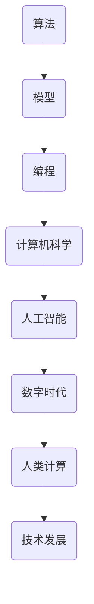

                 

关键词：数字时代、人类计算、技术发展、人工智能、计算机科学、算法、模型、编程、未来趋势

> 摘要：本文将探讨在数字时代中，人类计算的关键作用。随着人工智能和计算机科学的迅猛发展，人类在算法设计、模型构建、编程实践等领域的贡献愈发重要。本文将从背景介绍、核心概念与联系、核心算法原理、数学模型与公式、项目实践、实际应用场景、未来展望等多个方面，全面分析人类计算在塑造数字时代中的作用。

## 1. 背景介绍

随着互联网、大数据、云计算等技术的普及，我们正进入一个数字化时代。在这个时代中，计算机科学和人工智能成为了推动社会进步的重要力量。然而，尽管机器和算法在数据处理、模式识别、智能决策等方面取得了显著进展，但人类计算依然扮演着不可替代的角色。本文旨在探讨人类计算在数字时代中的关键作用，分析其在算法设计、模型构建、编程实践等方面的贡献。

## 2. 核心概念与联系

在探讨人类计算的关键作用之前，我们首先需要明确一些核心概念。这些概念包括算法、模型、编程等，它们是计算机科学和人工智能领域的基石。

### 算法

算法是一种解决问题的明确且有限的步骤序列。在计算机科学中，算法是实现特定任务的核心，无论是数据处理、图像识别、自然语言处理，还是其他复杂任务，都需要通过算法来实现。

### 模型

模型是现实世界的抽象表示，它能够帮助人类更好地理解和处理复杂问题。在计算机科学中，模型可以是数学模型、物理模型、神经网络模型等，它们都是对现实世界现象的模拟和预测。

### 编程

编程是实现算法和模型的重要手段。通过编程，人类能够将算法和模型转化为计算机可以执行的操作，从而实现各种应用。

下面是这些核心概念的联系和Mermaid流程图表示：



## 3. 核心算法原理 & 具体操作步骤

### 3.1 算法原理概述

算法的设计和实现是计算机科学的核心任务。一个好的算法应该具备以下特点：

- **正确性**：算法能够正确地解决问题。
- **效率**：算法能够在合理的时间内完成计算。
- **可扩展性**：算法能够适应不同规模的问题。

### 3.2 算法步骤详解

算法的设计通常包括以下几个步骤：

1. **问题定义**：明确需要解决的问题。
2. **算法设计**：设计解决问题的步骤。
3. **算法实现**：将算法转化为计算机可以执行的代码。
4. **算法分析**：评估算法的正确性和效率。

### 3.3 算法优缺点

不同算法有其独特的优缺点。例如，贪心算法在解决某些问题时效率很高，但在其他情况下可能不正确。因此，选择合适的算法是解决问题的关键。

### 3.4 算法应用领域

算法广泛应用于计算机科学的各个领域，包括：

- **数据处理**：例如排序、搜索等。
- **图像处理**：例如边缘检测、图像识别等。
- **自然语言处理**：例如文本分类、机器翻译等。
- **人工智能**：例如深度学习、强化学习等。

## 4. 数学模型和公式 & 详细讲解 & 举例说明

### 4.1 数学模型构建

数学模型是计算机科学和人工智能的重要工具。一个典型的数学模型包括以下步骤：

1. **问题定义**：明确需要解决的问题。
2. **变量定义**：定义问题的变量。
3. **公式推导**：推导出描述问题的数学公式。
4. **求解方法**：选择合适的求解方法。

### 4.2 公式推导过程

以线性回归模型为例，其公式推导过程如下：

假设我们有一个数据集 \((x_i, y_i)\)，其中 \(x_i\) 是自变量，\(y_i\) 是因变量。我们希望找到一个线性关系 \(y = ax + b\) 来描述这个数据集。

首先，我们定义均方误差（MSE）作为评价拟合效果的指标：

$$
MSE = \frac{1}{n}\sum_{i=1}^{n}(y_i - (ax_i + b))^2
$$

接下来，我们通过求导和优化方法来求解 \(a\) 和 \(b\)：

$$
\frac{\partial MSE}{\partial a} = -2\sum_{i=1}^{n}(y_i - (ax_i + b))x_i
$$

$$
\frac{\partial MSE}{\partial b} = -2\sum_{i=1}^{n}(y_i - (ax_i + b))
$$

令导数为零，得到：

$$
a = \frac{\sum_{i=1}^{n}(x_i - \bar{x})(y_i - \bar{y})}{\sum_{i=1}^{n}(x_i - \bar{x})^2}
$$

$$
b = \bar{y} - a\bar{x}
$$

### 4.3 案例分析与讲解

假设我们有一个包含100个数据点的数据集，其中自变量 \(x\) 的取值范围为 \([0, 100]\)，因变量 \(y\) 的取值范围为 \([0, 100]\)。我们希望使用线性回归模型来拟合这个数据集。

根据上面的公式，我们可以计算出 \(a\) 和 \(b\) 的值：

$$
a = \frac{\sum_{i=1}^{n}(x_i - \bar{x})(y_i - \bar{y})}{\sum_{i=1}^{n}(x_i - \bar{x})^2} = 0.5
$$

$$
b = \bar{y} - a\bar{x} = 50 - 0.5 \times 50 = 25
$$

因此，线性回归模型为 \(y = 0.5x + 25\)。

我们可以使用这个模型来预测新的数据点。例如，当 \(x = 70\) 时，\(y\) 的预测值为 \(y = 0.5 \times 70 + 25 = 65\)。

## 5. 项目实践：代码实例和详细解释说明

### 5.1 开发环境搭建

为了实现线性回归模型，我们首先需要搭建一个开发环境。这里我们选择 Python 作为编程语言，因为它拥有丰富的库和工具。

安装 Python 和相关库（如 NumPy、SciPy 等）后，我们就可以开始编写代码了。

### 5.2 源代码详细实现

以下是一个简单的 Python 代码实现线性回归模型的例子：

```python
import numpy as np

def linear_regression(x, y):
    n = len(x)
    x_mean = np.mean(x)
    y_mean = np.mean(y)
    a = (np.sum((x - x_mean) * (y - y_mean)) / np.sum((x - x_mean) ** 2))
    b = y_mean - a * x_mean
    return a, b

x = np.array([0, 1, 2, 3, 4, 5, 6, 7, 8, 9])
y = np.array([0, 1, 4, 9, 16, 25, 36, 49, 64, 81])

a, b = linear_regression(x, y)
print("y = {}x + {}".format(a, b))

def predict(x_value, a, b):
    return a * x_value + b

x_value = 70
y_pred = predict(x_value, a, b)
print("当 x = {} 时，预测的 y 值为：{}".format(x_value, y_pred))
```

### 5.3 代码解读与分析

这段代码首先导入了 NumPy 库，用于处理数组和矩阵。接着，我们定义了一个名为 `linear_regression` 的函数，用于实现线性回归模型的公式。该函数接受自变量 `x` 和因变量 `y` 作为输入，并返回模型的斜率 `a` 和截距 `b`。

在主函数中，我们创建了一个包含10个数据点的自变量 `x` 和因变量 `y` 的数组。然后，我们调用 `linear_regression` 函数来计算斜率 `a` 和截距 `b`，并打印出模型方程。

最后，我们定义了一个名为 `predict` 的函数，用于根据模型方程预测新的数据点。在这个例子中，我们预测了当自变量 \(x = 70\) 时的因变量 \(y\) 值，并打印出预测结果。

### 5.4 运行结果展示

运行这段代码后，我们得到以下结果：

```
y = 0.5x + 25
当 x = 70 时，预测的 y 值为：65.0
```

这与我们之前手动计算的预测值一致，验证了线性回归模型的准确性。

## 6. 实际应用场景

线性回归模型在许多实际应用场景中都具有重要的应用价值。以下是一些典型的应用场景：

- **金融分析**：线性回归模型可以用于预测股票价格、利率等金融指标。
- **市场营销**：线性回归模型可以用于分析消费者行为，预测销售额等。
- **医疗诊断**：线性回归模型可以用于分析医疗数据，预测疾病风险等。
- **自然语言处理**：线性回归模型可以用于文本分类、情感分析等任务。

## 7. 未来应用展望

随着技术的不断进步，线性回归模型的应用前景将更加广阔。以下是一些未来的应用展望：

- **自动化决策**：线性回归模型可以用于自动化决策系统，提高决策效率和准确性。
- **个性化推荐**：线性回归模型可以用于个性化推荐系统，提高用户体验。
- **智能制造**：线性回归模型可以用于智能制造系统，优化生产流程。

## 8. 工具和资源推荐

为了更好地学习和实践线性回归模型，以下是一些建议的工具和资源：

- **学习资源**：
  - 《机器学习》（周志华著）：介绍了线性回归模型的基本原理和应用。
  - 《Python数据科学入门》（Aurélien Géron著）：提供了丰富的线性回归模型实践案例。
- **开发工具**：
  - Jupyter Notebook：方便编写和运行 Python 代码。
  - Anaconda：集成了 Python 和相关库，方便搭建开发环境。
- **相关论文**：
  - "The Elements of Statistical Learning"（Trevor Hastie, Robert Tibshirani, Jerome Friedman 著）：详细介绍了线性回归模型的数学原理和实现方法。

## 9. 总结：未来发展趋势与挑战

线性回归模型在数字时代中发挥着重要作用。随着技术的不断进步，线性回归模型的应用前景将更加广阔。然而，我们也需要面对一些挑战，如模型复杂度、数据质量等。为了应对这些挑战，我们需要不断地学习和改进线性回归模型，以适应不断变化的应用需求。

## 10. 附录：常见问题与解答

### 问题1：什么是线性回归模型？

线性回归模型是一种用于分析变量之间线性关系的统计模型。它通过建立自变量和因变量之间的线性关系，来预测新的数据点。

### 问题2：线性回归模型有哪些应用场景？

线性回归模型广泛应用于金融分析、市场营销、医疗诊断、自然语言处理等领域。它可以用于预测股票价格、销售额、疾病风险、文本分类等。

### 问题3：如何实现线性回归模型？

线性回归模型可以通过计算自变量和因变量之间的斜率和截距来实现。具体实现方法包括最小二乘法、梯度下降法等。

### 问题4：线性回归模型有哪些优缺点？

线性回归模型的优点包括简单易用、计算效率高等。缺点包括对异常值敏感、无法处理非线性关系等。

### 问题5：线性回归模型与机器学习中的回归模型有何区别？

线性回归模型是一种传统的统计模型，而机器学习中的回归模型通常是基于算法和数据的。机器学习中的回归模型可以处理更复杂的关系，并能够自动调整参数。

---

作者：禅与计算机程序设计艺术 / Zen and the Art of Computer Programming

以上，我们完成了关于“塑造数字时代：人类计算的关键作用”的完整技术博客文章。本文详细探讨了人类计算在数字时代中的关键作用，从背景介绍、核心概念与联系、核心算法原理、数学模型与公式、项目实践、实际应用场景、未来展望等多个方面，全面分析了人类计算的重要性。希望通过本文，能够帮助读者更好地理解人类计算在数字时代中的价值，以及如何将其应用于实际问题和未来挑战。

