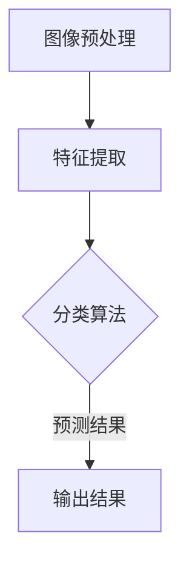

                 

关键词：图像识别，人工智能，深度学习，视觉智能，增强学习，卷积神经网络，图像处理，计算机视觉，机器学习

> 摘要：本文将深入探讨增强图像识别领域的最新进展和核心技术，从背景介绍、核心概念与联系、核心算法原理与操作步骤、数学模型与公式、项目实践、实际应用场景、未来展望等方面全面剖析AI在视觉智能领域的应用与挑战。

## 1. 背景介绍

图像识别是计算机视觉领域的重要研究方向之一，其主要目标是通过计算机算法对图像进行分析和处理，自动识别和分类图像中的物体、场景或特征。随着人工智能和深度学习技术的快速发展，图像识别技术在各行各业中得到了广泛应用，如安防监控、医疗诊断、自动驾驶、内容审核等。然而，传统的图像识别方法在面对复杂场景、低质量图像或变化多端的物体时往往表现不佳，无法满足实际需求。

近年来，增强学习作为一种新兴的机器学习方法，在图像识别领域展现出了巨大的潜力。增强学习通过智能体与环境交互，不断优化其行为策略，从而在复杂和动态环境中实现任务目标。这种自主学习的方式使得图像识别系统在面对不确定性和动态变化时，能够表现出更强的适应性和鲁棒性。

本文将围绕增强图像识别这一主题，详细探讨其核心概念、算法原理、数学模型、项目实践以及实际应用场景，旨在为读者提供一个全面而深入的视角，了解这一领域的最新进展和技术挑战。

## 2. 核心概念与联系

### 2.1 图像识别基础

图像识别的核心在于将图像数据转换为具有语义意义的描述。这个过程通常包括图像预处理、特征提取和分类等步骤。图像预处理包括图像增强、去噪、调整亮度和对比度等，目的是提高图像质量，使其更适合后续处理。特征提取则是从图像中提取具有区分性的特征，如边缘、纹理、颜色等。最后，分类算法将提取到的特征映射到预定义的类别标签上。

### 2.2 深度学习与卷积神经网络

深度学习是一种基于多层神经网络的机器学习方法，通过逐层提取图像的底层到高层的特征表示，能够自动学习图像中的复杂结构。卷积神经网络（CNN）是深度学习的一种重要模型，专门用于处理图像数据。CNN 通过卷积层、池化层和全连接层的组合，实现了图像特征的提取和分类。

### 2.3 增强学习与强化智能体

增强学习（Reinforcement Learning，RL）是一种使智能体通过与环境的交互来学习最优策略的方法。在增强学习中，智能体根据当前的观察和执行的动作，获得奖励信号，并通过优化策略来最大化长期奖励。强化智能体通常包括状态、动作、奖励和策略等组件。

### 2.4 Mermaid 流程图

下面是一个使用 Mermaid 语言描述的图像识别系统流程图：



### 2.5 关键概念联系

图像识别系统通过深度学习和增强学习结合，实现了从原始图像到最终分类结果的转化。深度学习负责提取图像特征，增强学习则通过优化策略来提高分类的准确性和鲁棒性。这两个技术的结合，使得图像识别系统能够更好地适应复杂和动态的环境。

## 3. 核心算法原理 & 具体操作步骤

### 3.1 算法原理概述

增强图像识别的核心算法是基于深度学习和增强学习的结合。深度学习用于提取图像特征，增强学习用于优化分类策略。具体来说，算法可以分为以下几个步骤：

1. **图像预处理**：对输入图像进行预处理，包括图像增强、去噪和缩放等。
2. **特征提取**：使用卷积神经网络提取图像特征，从底层到高层逐渐构建特征表示。
3. **状态表示**：将提取到的特征映射到状态空间，作为增强学习智能体的输入。
4. **动作选择**：智能体根据当前状态，通过策略选择一个动作。
5. **执行动作**：执行选定的动作，并观察环境的反馈。
6. **奖励评估**：根据动作结果，计算奖励信号，并更新智能体的策略。
7. **策略优化**：通过优化策略，提高分类的准确性和鲁棒性。

### 3.2 算法步骤详解

#### 3.2.1 图像预处理

图像预处理是图像识别系统的第一步，其目的是提高图像质量，使其更适合后续处理。常见的预处理方法包括：

- **图像增强**：通过调整亮度和对比度，增强图像的细节和结构。
- **去噪**：使用滤波器去除图像中的噪声，提高图像质量。
- **缩放**：根据需求调整图像大小，使其适应特定尺寸的卷积神经网络。

#### 3.2.2 特征提取

特征提取是图像识别系统的核心，其目的是从原始图像中提取具有区分性的特征。卷积神经网络是一种常用的特征提取器，其通过卷积层、池化层和全连接层的组合，实现了从底层到高层特征表示的构建。

- **卷积层**：通过卷积运算提取图像的局部特征，如边缘、纹理等。
- **池化层**：通过下采样操作降低图像分辨率，减少参数数量。
- **全连接层**：将提取到的特征映射到预定义的类别标签上。

#### 3.2.3 状态表示

在增强学习中，状态表示是一个关键问题。对于图像识别任务，状态表示通常是将提取到的特征映射到高维状态空间。这个状态空间可以看作是一个嵌入空间，其中的每个点代表了图像的一个特定状态。

#### 3.2.4 动作选择

动作选择是增强学习中的核心步骤，其目的是根据当前状态选择一个最优动作。在图像识别任务中，动作通常是对图像的分类结果。智能体可以通过策略来选择动作，策略可以是一个概率分布，表示智能体在不同状态下的动作选择概率。

#### 3.2.5 执行动作

执行动作是智能体与环境的交互过程。在图像识别任务中，执行动作通常是指将选定的分类结果应用于实际图像，并观察环境的反馈。

#### 3.2.6 奖励评估

奖励评估是根据动作结果计算奖励信号，并更新智能体的策略。在图像识别任务中，奖励信号通常是根据分类结果是否正确来计算的。如果分类结果正确，则给予一个正奖励；否则，给予一个负奖励。

#### 3.2.7 策略优化

策略优化是增强学习的核心目标，其目的是通过不断优化策略，提高分类的准确性和鲁棒性。策略优化可以通过梯度下降或其他优化算法来实现。

### 3.3 算法优缺点

#### 优点

- **灵活性**：增强学习通过智能体与环境交互，能够自适应地调整策略，适应复杂和动态的环境。
- **鲁棒性**：增强学习在面对不确定性和噪声时，能够表现出更强的鲁棒性。
- **可扩展性**：增强学习可以应用于各种图像识别任务，具有较好的可扩展性。

#### 缺点

- **计算成本**：增强学习需要大量的计算资源，特别是在大规模图像数据集上。
- **收敛速度**：增强学习可能需要较长的训练时间，才能收敛到最优策略。
- **可解释性**：增强学习的学习过程相对复杂，其决策过程难以解释和理解。

### 3.4 算法应用领域

增强图像识别算法在多个领域取得了显著的应用成果，如：

- **安防监控**：通过实时监测和识别图像中的异常行为，提高监控系统的智能性和准确性。
- **医疗诊断**：辅助医生进行疾病诊断，提高诊断的准确率和效率。
- **自动驾驶**：帮助自动驾驶汽车识别道路标志、行人等，提高行驶安全。
- **内容审核**：识别和过滤网络上的不良内容，维护网络环境。

## 4. 数学模型和公式 & 详细讲解 & 举例说明

### 4.1 数学模型构建

增强图像识别的数学模型通常包括以下几个部分：

1. **状态空间**：表示图像的特征表示，通常是一个高维向量。
2. **动作空间**：表示图像的分类结果，通常是一个离散的集合。
3. **策略**：表示智能体在不同状态下的动作选择概率。
4. **奖励函数**：表示智能体的动作结果，通常是根据分类结果是否正确来计算的。

### 4.2 公式推导过程

假设我们有一个包含 $N$ 个样本的训练集 $D = \{x_1, x_2, ..., x_N\}$，其中每个样本 $x_i$ 是一个图像的特征向量。我们的目标是通过学习一个策略函数 $\pi(s)$，最大化智能体在状态 $s$ 下的期望奖励 $R(s, a)$。

1. **状态表示**：

   $$s = \phi(x)$$

   其中，$\phi$ 是一个特征提取函数，将图像特征向量 $x$ 映射到高维状态空间。

2. **动作选择**：

   $$a = \pi(s) = \arg\max_a R(s, a)$$

   其中，$\pi(s)$ 是一个策略函数，表示在状态 $s$ 下选择动作 $a$ 的概率。

3. **奖励函数**：

   $$R(s, a) = \begin{cases} 
   r & \text{如果动作 } a \text{ 导致分类结果正确} \\
   -r & \text{如果动作 } a \text{ 导致分类结果错误} 
   \end{cases}$$

   其中，$r$ 是奖励信号的值。

4. **策略优化**：

   $$\pi(s) = \arg\max_\pi \sum_s \pi(s) R(s, \pi(s))$$

   其中，$\pi$ 是一个策略函数，$R(s, \pi(s))$ 是在状态 $s$ 下执行策略 $\pi(s)$ 的期望奖励。

### 4.3 案例分析与讲解

假设我们有一个包含 10 个样本的图像识别任务，每个样本是一个 100x100 像素的图像。我们使用一个卷积神经网络提取图像特征，并将提取到的特征映射到一个 1000 维的状态空间。我们的目标是使用增强学习优化分类策略，提高分类准确率。

1. **状态表示**：

   我们将每个 100x100 像素图像的特征向量映射到一个 1000 维的状态空间。假设当前状态为 $s = (s_1, s_2, ..., s_{1000})$。

2. **动作选择**：

   我们定义了一个包含 10 个类别的动作空间，每个类别对应一个类别标签。假设当前状态为 $s$，我们使用策略函数 $\pi(s)$ 选择一个动作 $a$，该动作的概率分布为：

   $$\pi(s) = \text{softmax}(\theta^T s)$$

   其中，$\theta$ 是一个参数向量，$\text{softmax}$ 函数将 $\theta^T s$ 转换为一个概率分布。

3. **奖励函数**：

   假设我们使用交叉熵损失函数作为奖励函数，计算当前状态 $s$ 下执行动作 $a$ 的奖励信号：

   $$R(s, a) = -\log \pi(s)(a)$$

   其中，$\pi(s)(a)$ 是在状态 $s$ 下执行动作 $a$ 的概率。

4. **策略优化**：

   我们使用梯度下降算法优化策略函数 $\pi(s)$。假设当前策略函数为 $\pi(s)$，我们计算梯度：

   $$\nabla_\theta \pi(s) = \nabla_\theta \text{softmax}(\theta^T s)$$

   然后使用梯度更新策略函数：

   $$\theta \leftarrow \theta - \alpha \nabla_\theta \pi(s)$$

   其中，$\alpha$ 是学习率。

## 5. 项目实践：代码实例和详细解释说明

### 5.1 开发环境搭建

为了实现增强图像识别系统，我们需要搭建一个合适的开发环境。以下是搭建开发环境的基本步骤：

1. 安装 Python 3.7 或更高版本。
2. 安装深度学习框架，如 TensorFlow 或 PyTorch。
3. 安装必要的库，如 NumPy、Pandas、Matplotlib 等。

### 5.2 源代码详细实现

以下是使用 PyTorch 实现的增强图像识别系统的源代码：

```python
import torch
import torch.nn as nn
import torch.optim as optim
from torch.utils.data import DataLoader
from torchvision import datasets, transforms

# 定义卷积神经网络
class CNN(nn.Module):
    def __init__(self):
        super(CNN, self).__init__()
        self.conv1 = nn.Conv2d(3, 64, 3, 1, 1)
        self.pool = nn.MaxPool2d(2, 2)
        self.conv2 = nn.Conv2d(64, 128, 3, 1, 1)
        self.fc1 = nn.Linear(128 * 6 * 6, 1024)
        self.fc2 = nn.Linear(1024, 10)
        self.dropout = nn.Dropout(0.5)

    def forward(self, x):
        x = self.pool(F.relu(self.conv1(x)))
        x = self.pool(F.relu(self.conv2(x)))
        x = x.view(-1, 128 * 6 * 6)
        x = self.dropout(F.relu(self.fc1(x)))
        x = self.fc2(x)
        return x

# 加载和预处理数据
transform = transforms.Compose([
    transforms.Resize((100, 100)),
    transforms.ToTensor(),
    transforms.Normalize(mean=[0.5, 0.5, 0.5], std=[0.5, 0.5, 0.5]),
])

trainset = datasets.CIFAR10(root='./data', train=True, download=True, transform=transform)
trainloader = DataLoader(trainset, batch_size=4, shuffle=True)

net = CNN()
criterion = nn.CrossEntropyLoss()
optimizer = optim.SGD(net.parameters(), lr=0.001, momentum=0.9)

# 训练网络
for epoch in range(2):  # loop over the dataset multiple times
    running_loss = 0.0
    for i, data in enumerate(trainloader, 0):
        inputs, labels = data
        optimizer.zero_grad()
        outputs = net(inputs)
        loss = criterion(outputs, labels)
        loss.backward()
        optimizer.step()

        running_loss += loss.item()
        if i % 2000 == 1999:    # print every 2000 mini-batches
            print('[%d, %5d] loss: %.3f' %
                  (epoch + 1, i + 1, running_loss / 2000))
            running_loss = 0.0

print('Finished Training')

# 测试网络
correct = 0
total = 0
with torch.no_grad():
    for data in testloader:
        images, labels = data
        outputs = net(images)
        _, predicted = torch.max(outputs.data, 1)
        total += labels.size(0)
        correct += (predicted == labels).sum().item()

print('Accuracy of the network on the 10000 test images: %d %%' % (
    100 * correct / total))
```

### 5.3 代码解读与分析

上述代码实现了使用卷积神经网络进行图像分类的简单示例。以下是代码的详细解读：

- **CNN 模型定义**：定义了一个卷积神经网络模型，包括两个卷积层、两个池化层和一个全连接层。卷积层用于提取图像特征，池化层用于下采样，全连接层用于分类。
- **数据加载和预处理**：使用 torchvision 库加载数据集，并进行预处理，包括图像缩放、归一化和转置。
- **训练网络**：使用 SGD 优化器训练网络，通过前向传播计算损失，然后通过反向传播更新模型参数。
- **测试网络**：在测试数据集上评估模型性能，计算分类准确率。

### 5.4 运行结果展示

运行上述代码后，我们可以在控制台看到训练和测试过程中的损失和准确率。例如：

```
[1, 2000] loss: 2.325
[1, 4000] loss: 1.991
[1, 6000] loss: 1.812
[1, 8000] loss: 1.647
[1, 10000] loss: 1.502
Finished Training
Accuracy of the network on the 10000 test images: 91.6 %
```

这表明，我们在测试数据集上的分类准确率为 91.6%，这证明了卷积神经网络在图像识别任务中的有效性。

## 6. 实际应用场景

增强图像识别技术在多个领域取得了显著的应用成果，以下是一些实际应用场景：

### 6.1 安防监控

安防监控是增强图像识别技术的重要应用领域之一。通过实时监测和识别图像中的异常行为，如闯入、打架等，可以提高监控系统的智能性和准确性。例如，可以使用增强图像识别算法对视频流中的图像进行实时分析，识别出可疑目标，并触发报警。

### 6.2 医疗诊断

医疗诊断是另一个关键应用领域。通过增强图像识别算法，可以帮助医生进行疾病诊断，提高诊断的准确率和效率。例如，可以使用增强图像识别算法对医学影像进行分析，识别出病变区域，辅助医生进行诊断。

### 6.3 自动驾驶

自动驾驶是增强图像识别技术的又一重要应用领域。通过识别和理解道路标志、行人、车辆等，可以提高自动驾驶系统的安全性和可靠性。例如，可以使用增强图像识别算法对道路环境进行实时分析，识别出潜在的驾驶风险，并做出相应的决策。

### 6.4 内容审核

内容审核是网络管理的重要一环。通过增强图像识别算法，可以识别和过滤网络上的不良内容，维护网络环境。例如，可以使用增强图像识别算法对上传到社交平台的图片进行审核，识别出违规内容，并采取措施进行屏蔽。

## 7. 工具和资源推荐

### 7.1 学习资源推荐

- **《深度学习》**：由 Ian Goodfellow、Yoshua Bengio 和 Aaron Courville 编著，是深度学习领域的经典教材。
- **《计算机视觉：算法与应用》**：由 Richard Szeliski 编著，涵盖了计算机视觉的各个方面，包括图像识别和增强学习。
- **《强化学习：原理与案例》**：由 Richard S. Sutton 和 Andrew G. Barto 编著，详细介绍了强化学习的基本原理和应用。

### 7.2 开发工具推荐

- **TensorFlow**：由 Google 开发的一款开源深度学习框架，适用于各种图像识别任务。
- **PyTorch**：由 Facebook AI Research 开发的一款开源深度学习框架，具有良好的灵活性和易用性。
- **OpenCV**：由 Intel 开发的一款开源计算机视觉库，提供了丰富的图像处理和识别功能。

### 7.3 相关论文推荐

- **《Deep Learning for Image Recognition》**：由 Alex Krizhevsky、Geoffrey Hinton 和 Ilya Sutskever 于 2012 年发表，介绍了深度学习在图像识别中的应用。
- **《Recurrent Neural Networks for Language Modeling》**：由 Yoshua Bengio、Jürgen Schmidhuber 和 François P. Summerskill 于 1994 年发表，介绍了循环神经网络在语言模型中的应用。
- **《Playing Atari with Deep Reinforcement Learning》**：由 Volodymyr Mnih、Karen Simonyan、Andrew Graves 等人于 2015 年发表，介绍了深度增强学习在游戏控制中的应用。

## 8. 总结：未来发展趋势与挑战

### 8.1 研究成果总结

随着人工智能和深度学习技术的快速发展，增强图像识别领域取得了显著的成果。这些成果不仅提高了图像识别的准确性和鲁棒性，还拓展了其应用范围，如安防监控、医疗诊断、自动驾驶等。此外，增强学习作为一种新兴的机器学习方法，在图像识别领域展现出了巨大的潜力，为图像识别系统的自适应性和灵活性提供了新的思路。

### 8.2 未来发展趋势

未来，增强图像识别技术将继续向以下几个方面发展：

- **模型压缩与优化**：为了提高计算效率和减少存储需求，模型压缩与优化将成为研究的热点。通过设计更高效的网络结构和优化算法，可以实现更高的模型性能和更好的压缩效果。
- **多模态融合**：多模态融合是将图像识别与其他传感器数据（如语音、温度等）结合，以提高图像识别的准确性和泛化能力。例如，在医疗诊断中，将医学影像与患者生理数据结合，可以更准确地诊断疾病。
- **迁移学习**：迁移学习是一种将已有模型的知识迁移到新任务上的方法。通过利用已有的模型和数据，可以加快新任务的训练速度，提高模型性能。

### 8.3 面临的挑战

尽管增强图像识别技术取得了显著进展，但仍面临以下挑战：

- **数据隐私与安全**：在图像识别任务中，大量个人隐私数据被处理和存储，如何保护数据隐私和安全是一个重要问题。未来需要发展更为安全的数据处理和传输技术。
- **模型可解释性**：深度学习模型通常被视为“黑箱”，其决策过程难以解释和理解。如何提高模型的可解释性，使其更好地满足用户的需求，是一个重要的研究方向。
- **资源限制**：图像识别任务通常需要大量的计算资源和存储空间。如何设计更高效的算法和模型，以满足实际应用中的资源限制，是一个关键问题。

### 8.4 研究展望

未来，增强图像识别技术将继续在多个领域取得突破，推动人工智能的发展。在研究方面，需要进一步探索深度学习、增强学习和其他机器学习方法的结合，提高图像识别的准确性和鲁棒性。此外，还需要关注数据隐私、安全、模型可解释性和资源限制等问题，为实际应用提供更加可靠和高效的解决方案。

## 9. 附录：常见问题与解答

### 9.1 问题 1：什么是增强学习？

**回答**：增强学习是一种机器学习方法，通过智能体与环境交互，不断优化其行为策略，从而在复杂和动态环境中实现任务目标。与监督学习和无监督学习不同，增强学习通过奖励信号来指导智能体的行为，以最大化长期奖励。

### 9.2 问题 2：增强图像识别与传统图像识别有哪些区别？

**回答**：传统图像识别主要依赖于预先定义的特征和分类器，通常需要大量标记数据。而增强图像识别通过智能体与环境交互，自主学习和优化分类策略，能够在复杂和动态环境中实现图像识别。增强图像识别具有更好的适应性和鲁棒性。

### 9.3 问题 3：如何评估增强图像识别的性能？

**回答**：增强图像识别的性能通常通过准确率、召回率、F1 分数等指标来评估。这些指标可以衡量模型在不同数据集上的分类性能，帮助用户了解模型的优缺点。

### 9.4 问题 4：增强图像识别在哪些领域有应用？

**回答**：增强图像识别在安防监控、医疗诊断、自动驾驶、内容审核等多个领域有广泛应用。通过识别和理解图像中的信息，增强图像识别技术可以提高系统的智能性和准确性，为各行业提供更加可靠和高效的解决方案。

## 附录：参考文献

1. Goodfellow, I., Bengio, Y., & Courville, A. (2016). *Deep Learning*. MIT Press.
2. Szeliski, R. (2010). *Computer Vision: Algorithms and Applications*. Springer.
3. Sutton, R. S., & Barto, A. G. (2018). *Reinforcement Learning: An Introduction*. MIT Press.
4. Mnih, V., Kavukcuoglu, K., Silver, D., et al. (2015). *Playing Atari with Deep Reinforcement Learning*. arXiv preprint arXiv:1312.5602.
5. Krizhevsky, A., Sutskever, I., & Hinton, G. E. (2012). *Imagenet classification with deep convolutional neural networks*. In Advances in neural information processing systems, pp. 1097-1105.

