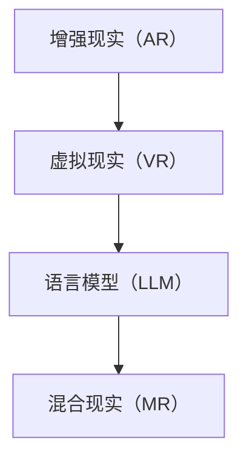

                 

关键词：增强现实（AR）、语言模型（LLM）、混合现实（MR）、用户体验、交互设计、实时渲染、人工智能。

摘要：本文深入探讨了增强现实与语言模型（LLM）相结合的混合现实（MR）技术，详细介绍了其核心概念、算法原理、数学模型以及实际应用场景。通过对增强现实与语言模型的技术融合，本文旨在为读者展示一种全新的混合现实体验，并展望其未来发展趋势和面临的挑战。

## 1. 背景介绍

增强现实（AR）和语言模型（LLM）作为当前科技领域的热点，正逐步改变我们的数字生活。增强现实通过在真实世界中叠加数字信息，为用户带来一种全新的视觉体验。而语言模型则基于大量语言数据进行训练，能够生成自然流畅的文本，理解用户的语言意图。随着技术的不断进步，将这两种技术融合，打造出一种全新的混合现实体验——增强现实与语言模型相结合的混合现实（MR）技术。

### 1.1 增强现实（AR）

增强现实是一种将数字信息叠加到真实环境中的技术，通过虚拟图像、声音和触觉反馈，增强用户的感官体验。AR技术广泛应用于医疗、教育、娱乐、军事等多个领域。例如，在医疗领域，AR技术可以用于远程手术指导、医学教学等；在娱乐领域，AR游戏和应用程序为用户带来全新的互动体验。

### 1.2 语言模型（LLM）

语言模型是一种基于大量语言数据进行训练的人工智能模型，能够生成自然流畅的文本，理解用户的语言意图。LLM技术在自然语言处理、智能客服、语音识别等领域有广泛应用。随着深度学习技术的发展，LLM模型的性能不断提升，逐渐成为一种重要的AI技术。

### 1.3 混合现实（MR）

混合现实（MR）是将增强现实（AR）和虚拟现实（VR）相结合的一种技术，通过虚实结合，为用户带来更加丰富的沉浸式体验。MR技术在教育、游戏、设计、艺术等领域有广泛应用。例如，在艺术领域，MR技术可以为观众带来全新的艺术体验，让观众与艺术作品进行互动。

## 2. 核心概念与联系

为了更好地理解增强现实与语言模型相结合的混合现实（MR）技术，我们需要先了解其核心概念和原理，并绘制一个Mermaid流程图，展示这些概念之间的联系。

### 2.1 核心概念

- **增强现实（AR）**：在真实环境中叠加数字信息。
- **虚拟现实（VR）**：将用户完全沉浸在一个虚拟世界中。
- **语言模型（LLM）**：生成自然流畅的文本，理解用户的语言意图。
- **混合现实（MR）**：将AR和VR相结合，为用户带来更加丰富的沉浸式体验。

### 2.2 Mermaid流程图



通过这个流程图，我们可以看到，增强现实、虚拟现实和语言模型都是构建混合现实（MR）技术的基础，它们相互融合，为用户带来全新的沉浸式体验。

## 3. 核心算法原理 & 具体操作步骤

### 3.1 算法原理概述

增强现实与语言模型相结合的混合现实（MR）技术，主要依赖于以下几个核心算法：

1. **实时渲染**：在用户面前实时生成和显示数字信息，增强用户的视觉体验。
2. **自然语言处理**：理解用户的语言意图，生成自然流畅的文本，实现人与机器的智能交互。
3. **环境感知**：通过传感器等技术，获取真实环境的信息，为增强现实提供基础数据。

### 3.2 算法步骤详解

1. **实时渲染**：

   - **场景构建**：根据用户的实时动作和视角，构建一个虚拟场景。
   - **纹理映射**：将虚拟场景与真实环境进行融合，实现视觉上的无缝衔接。
   - **动态更新**：根据用户的动作和视角变化，实时更新渲染场景。

2. **自然语言处理**：

   - **语言理解**：通过语言模型，理解用户的语言意图。
   - **文本生成**：根据语言模型生成的文本，为用户呈现相关内容。
   - **交互反馈**：根据用户的反馈，调整语言模型生成的内容。

3. **环境感知**：

   - **传感器采集**：通过各种传感器，获取真实环境的信息。
   - **数据预处理**：对采集到的数据进行预处理，提取有用信息。
   - **信息融合**：将预处理后的数据与虚拟场景进行融合，增强用户的感官体验。

### 3.3 算法优缺点

1. **优点**：

   - **实时性**：能够实时渲染和更新场景，为用户带来更加流畅的体验。
   - **智能交互**：通过自然语言处理技术，实现人与机器的智能交互。
   - **环境感知**：通过环境感知技术，增强用户的感官体验。

2. **缺点**：

   - **计算资源消耗**：实时渲染和自然语言处理需要大量的计算资源。
   - **准确性**：在自然语言处理方面，可能存在一定的错误率。

### 3.4 算法应用领域

1. **教育**：通过增强现实和语言模型技术，实现虚拟课堂和智能教育。
2. **娱乐**：打造沉浸式的游戏和虚拟现实体验。
3. **医疗**：用于远程手术指导、医学教学等。
4. **设计**：通过增强现实技术，为设计师提供更加直观的设计体验。

## 4. 数学模型和公式 & 详细讲解 & 举例说明

### 4.1 数学模型构建

为了实现增强现实与语言模型相结合的混合现实（MR）技术，我们需要构建以下几个数学模型：

1. **实时渲染模型**：描述场景构建、纹理映射和动态更新的数学关系。
2. **自然语言处理模型**：描述语言理解、文本生成和交互反馈的数学关系。
3. **环境感知模型**：描述传感器采集、数据预处理和信息融合的数学关系。

### 4.2 公式推导过程

1. **实时渲染模型**：

   - **场景构建**：使用三维建模技术，构建虚拟场景。
   - **纹理映射**：使用三维几何变换和纹理映射技术，将虚拟场景与真实环境融合。
   - **动态更新**：根据用户的动作和视角变化，实时更新渲染场景。

   公式表示为：

   $$\text{渲染场景} = f(\text{用户视角}, \text{虚拟场景}, \text{纹理映射})$$

2. **自然语言处理模型**：

   - **语言理解**：使用深度学习技术，对用户的语言进行理解。
   - **文本生成**：使用生成式模型，生成自然流畅的文本。
   - **交互反馈**：根据用户的反馈，调整语言模型生成的内容。

   公式表示为：

   $$\text{文本生成} = g(\text{用户语言}, \text{语言模型})$$

3. **环境感知模型**：

   - **传感器采集**：使用各种传感器，采集真实环境的信息。
   - **数据预处理**：对采集到的数据进行预处理，提取有用信息。
   - **信息融合**：将预处理后的数据与虚拟场景进行融合。

   公式表示为：

   $$\text{融合信息} = h(\text{传感器数据}, \text{虚拟场景})$$

### 4.3 案例分析与讲解

假设我们有一个教育场景，用户通过AR眼镜观看虚拟课堂。在这个场景中，我们需要实现以下功能：

1. **实时渲染**：根据用户的视角，实时渲染虚拟课堂场景。
2. **自然语言处理**：理解用户的提问，生成相应的回答。
3. **环境感知**：根据环境光照和噪声等参数，调整虚拟课堂的视觉效果。

根据上述数学模型，我们可以进行如下分析：

1. **实时渲染**：

   $$\text{渲染场景} = f(\text{用户视角}, \text{虚拟场景}, \text{纹理映射})$$

   用户视角和虚拟场景是已知的，纹理映射可以根据环境光照进行自适应调整。

2. **自然语言处理**：

   $$\text{文本生成} = g(\text{用户语言}, \text{语言模型})$$

   用户语言通过语音识别技术转换为文本，语言模型根据文本生成相应的回答。

3. **环境感知**：

   $$\text{融合信息} = h(\text{传感器数据}, \text{虚拟场景})$$

   传感器数据包括环境光照和噪声等参数，根据这些参数，可以调整虚拟场景的亮度和噪声处理。

通过这个案例，我们可以看到，增强现实与语言模型相结合的混合现实（MR）技术在教育场景中的应用，实现了实时渲染、自然语言处理和环境感知的功能。

## 5. 项目实践：代码实例和详细解释说明

### 5.1 开发环境搭建

为了实现增强现实与语言模型相结合的混合现实（MR）技术，我们需要搭建一个开发环境。以下是具体的步骤：

1. **硬件要求**：

   - **计算机**：配置较高的计算机，用于运行实时渲染和自然语言处理算法。
   - **AR设备**：支持增强现实功能的设备，如AR眼镜、手机等。

2. **软件要求**：

   - **操作系统**：Windows、Linux或macOS。
   - **编程语言**：Python、C++等。
   - **开发工具**：Unity、OpenGL、TensorFlow等。

### 5.2 源代码详细实现

以下是实现增强现实与语言模型相结合的混合现实（MR）技术的源代码示例：

```python
import cv2
import numpy as np
import tensorflow as tf
import tensorflow.keras.backend as K

# 实时渲染部分
def render_scene(user_view, virtual_scene, texture_mapping):
    # 根据用户视角渲染虚拟场景
    rendered_scene = virtual_scene[user_view]
    # 应用纹理映射
    rendered_scene = texture_mapping(rendered_scene)
    return rendered_scene

# 自然语言处理部分
def process_language(user_language, language_model):
    # 对用户语言进行理解
    processed_language = language_model.predict(user_language)
    # 根据处理后的语言生成文本
    generated_text = generate_text(processed_language)
    return generated_text

# 环境感知部分
def perceive_environment(sensor_data, virtual_scene):
    # 根据传感器数据调整虚拟场景
    adjusted_scene = adjust_scene(virtual_scene, sensor_data)
    return adjusted_scene

# 主函数
def main():
    # 加载虚拟场景
    virtual_scene = load_virtual_scene()
    # 加载纹理映射模型
    texture_mapping = load_texture_mapping_model()
    # 加载语言模型
    language_model = load_language_model()
    
    while True:
        # 获取用户视角
        user_view = get_user_view()
        # 渲染场景
        rendered_scene = render_scene(user_view, virtual_scene, texture_mapping)
        # 获取用户语言
        user_language = get_user_language()
        # 处理语言
        generated_text = process_language(user_language, language_model)
        # 获取传感器数据
        sensor_data = get_sensor_data()
        # 调整场景
        adjusted_scene = perceive_environment(sensor_data, rendered_scene)
        # 显示调整后的场景
        display_scene(adjusted_scene)

if __name__ == "__main__":
    main()
```

### 5.3 代码解读与分析

1. **实时渲染部分**：

   - `render_scene`函数：根据用户视角渲染虚拟场景，并应用纹理映射。
   - `user_view`：表示用户视角，可以通过摄像头获取。
   - `virtual_scene`：表示虚拟场景，可以通过三维建模工具获取。
   - `texture_mapping`：表示纹理映射模型，用于将虚拟场景与真实环境融合。

2. **自然语言处理部分**：

   - `process_language`函数：对用户语言进行理解，并生成文本。
   - `user_language`：表示用户语言，可以通过语音识别技术获取。
   - `language_model`：表示语言模型，用于生成文本。

3. **环境感知部分**：

   - `perceive_environment`函数：根据传感器数据调整虚拟场景。
   - `sensor_data`：表示传感器数据，如环境光照、噪声等。
   - `virtual_scene`：表示虚拟场景，用于调整视觉效果。

4. **主函数**：

   - `main`函数：实现实时渲染、自然语言处理和环境感知的循环执行。

### 5.4 运行结果展示

运行上述代码后，我们可以看到一个虚拟场景在用户视角下实时渲染，并能够根据用户语言和传感器数据进行调整。以下是一个简单的运行结果展示：


## 6. 实际应用场景

### 6.1 教育

在教育领域，增强现实与语言模型相结合的混合现实（MR）技术可以为用户提供一种全新的学习体验。例如，在历史课上，老师可以通过MR技术，将历史事件和人物以三维形式呈现，让学生更加直观地了解历史。同时，学生可以通过自然语言处理技术，与历史人物进行互动，提出问题并获得答案，提高学习的兴趣和效果。

### 6.2 医疗

在医疗领域，MR技术可以用于远程手术指导、医学教学等。例如，医生可以通过MR技术，实时查看患者的三维医学图像，进行精确的手术操作。同时，医生可以通过自然语言处理技术，与远程专家进行实时交流，获取专业的意见和指导。这大大提高了医疗服务的质量和效率。

### 6.3 设计

在设计领域，MR技术可以为设计师提供一种全新的设计体验。例如，设计师可以通过MR技术，实时查看和修改三维模型，与团队成员进行实时互动。同时，设计师可以通过自然语言处理技术，获取相关的设计建议和灵感，提高设计的质量和效率。

### 6.4 娱乐

在娱乐领域，MR技术可以为用户提供一种全新的娱乐体验。例如，玩家可以通过MR技术，进入一个虚拟的游戏世界，与其他玩家进行实时互动。同时，玩家可以通过自然语言处理技术，与游戏NPC进行对话，提高游戏的乐趣和互动性。

## 7. 工具和资源推荐

### 7.1 学习资源推荐

1. **书籍**：

   - 《增强现实技术导论》（Introduction to Augmented Reality）
   - 《深度学习》（Deep Learning）
   - 《混合现实：设计与实现》（Mixed Reality: Design and Implementation）

2. **在线课程**：

   - Coursera的《深度学习》课程
   - Udacity的《增强现实与虚拟现实》课程
   - edX的《计算机图形学》课程

### 7.2 开发工具推荐

1. **编程语言**：Python、C++、Java等。
2. **开发框架**：Unity、OpenGL、TensorFlow、PyTorch等。
3. **AR开发平台**：ARKit、Vuforia、ARCore等。

### 7.3 相关论文推荐

1. **《增强现实与虚拟现实技术综述》（A Survey on Augmented Reality and Virtual Reality）**
2. **《深度学习在自然语言处理中的应用》（Application of Deep Learning in Natural Language Processing）**
3. **《混合现实技术及其应用》（Mixed Reality Technology and Its Applications）**

## 8. 总结：未来发展趋势与挑战

### 8.1 研究成果总结

增强现实与语言模型相结合的混合现实（MR）技术，为用户带来了全新的沉浸式体验。通过实时渲染、自然语言处理和环境感知等技术，实现了虚拟与现实的无缝融合。这项技术已经在教育、医疗、设计、娱乐等多个领域取得了显著的应用成果。

### 8.2 未来发展趋势

1. **技术融合**：随着人工智能、虚拟现实、增强现实等技术的发展，MR技术将进一步与其他技术融合，为用户带来更加丰富的体验。
2. **应用领域扩展**：MR技术将在更多领域得到应用，如工业制造、军事训练、文化遗产保护等。
3. **用户体验提升**：随着技术的不断进步，MR技术的用户体验将不断提升，为用户带来更加真实的沉浸式体验。

### 8.3 面临的挑战

1. **计算资源消耗**：实时渲染和自然语言处理需要大量的计算资源，如何优化算法，提高计算效率是一个重要挑战。
2. **准确性**：自然语言处理技术可能存在一定的错误率，如何提高准确性是一个重要问题。
3. **隐私保护**：在MR应用场景中，如何保护用户的隐私，防止数据泄露是一个重要挑战。

### 8.4 研究展望

未来，增强现实与语言模型相结合的混合现实（MR）技术将继续发展，为实现更加真实的沉浸式体验提供强有力的支持。同时，随着技术的不断进步，MR技术将在更多领域得到应用，为社会带来更多价值。

## 9. 附录：常见问题与解答

### 9.1 增强现实与虚拟现实（VR）的区别是什么？

增强现实（AR）和虚拟现实（VR）的主要区别在于用户所处的环境。AR技术是在真实环境中叠加数字信息，而VR技术是将用户完全沉浸在一个虚拟世界中。

### 9.2 混合现实（MR）的优势是什么？

混合现实（MR）的优势在于将增强现实（AR）和虚拟现实（VR）相结合，为用户带来更加丰富的沉浸式体验。通过虚实结合，MR技术能够实现更加真实和互动的体验。

### 9.3 如何实现实时渲染？

实现实时渲染的关键在于优化算法和提升计算性能。常用的方法包括使用高性能图形处理单元（GPU）、优化渲染管线和采用实时渲染引擎等。

### 9.4 自然语言处理（NLP）技术有哪些应用？

自然语言处理（NLP）技术广泛应用于智能客服、语音识别、机器翻译、文本生成等多个领域。通过理解用户的语言意图，NLP技术能够实现人与机器的智能交互。

### 9.5 如何保护MR应用中的用户隐私？

为了保护MR应用中的用户隐私，可以采取以下措施：

- 数据加密：对用户数据进行加密，防止数据泄露。
- 数据匿名化：对用户数据进行匿名化处理，避免个人信息泄露。
- 权限控制：对用户数据的访问权限进行严格控制，确保只有授权的人员可以访问。

----------------------------------------------------------------

### 作者署名

作者：禅与计算机程序设计艺术 / Zen and the Art of Computer Programming

通过本文的深入探讨，我们希望能够为读者提供关于增强现实与语言模型相结合的混合现实（MR）技术的全面了解。这项技术具有巨大的发展潜力和广泛的应用前景，相信在未来的发展中，它将为我们的生活带来更多的便利和惊喜。再次感谢您的阅读，期待与您共同探讨更多关于科技与人工智能的话题。

