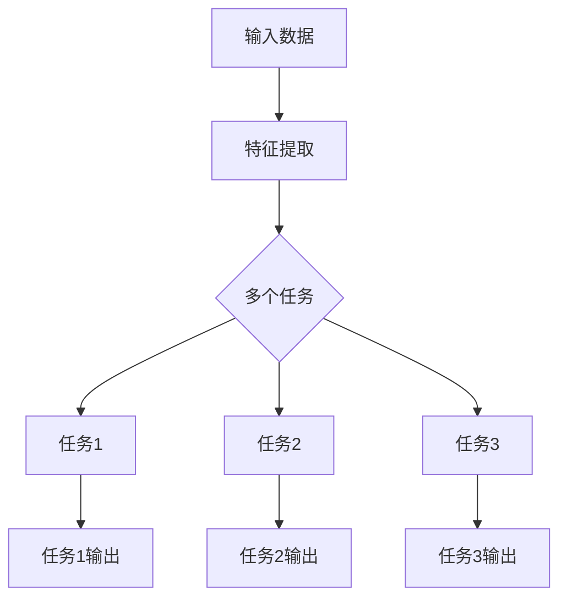

                 

关键词：多任务学习，深度学习，神经网络，协同学习，元学习，算法原理，代码实例，应用领域

## 摘要

多任务学习（Multi-Task Learning，MTL）是近年来人工智能领域的一个重要研究方向。它通过在一个模型中同时学习多个任务，提高了模型的泛化能力和效率。本文将详细介绍多任务学习的核心概念、算法原理以及实际应用，并通过代码实例展示其实现过程。希望通过本文，读者能够全面理解多任务学习，并在实践中运用这一先进技术。

## 1. 背景介绍

随着深度学习技术的不断发展，越来越多的复杂任务开始被神经网络模型所攻克。然而，传统单任务学习模型往往只能针对单一任务进行优化，导致模型在处理多任务时效率低下，难以充分利用数据中的相关性。为了解决这个问题，多任务学习应运而生。多任务学习通过在一个模型中同时学习多个任务，可以共享特征表示，提高模型的泛化能力和计算效率。

多任务学习的研究背景可以追溯到上世纪80年代的认知心理学领域。心理学家研究发现，人类在处理多个任务时，往往能够通过共享认知资源，提高任务处理的效率和准确性。这一发现激发了研究人员在机器学习领域探索多任务学习的可能性。

近年来，随着深度学习技术的快速发展，多任务学习得到了广泛关注。研究者们提出了多种多任务学习框架和算法，如共享神经网络架构、多任务学习优化策略等。这些方法在图像识别、自然语言处理、语音识别等任务中取得了显著的成果。

## 2. 核心概念与联系

### 2.1 多任务学习的定义

多任务学习是指在一个神经网络模型中同时学习多个相关任务。这些任务可以是分类、回归、目标检测等不同类型的任务。通过在一个模型中同时学习多个任务，多任务学习能够充分利用数据中的相关性，提高模型的泛化能力和计算效率。

### 2.2 多任务学习的优势

多任务学习具有以下优势：

1. **共享特征表示**：多任务学习模型通过共享底层特征表示，可以避免冗余计算，提高计算效率。

2. **增强模型泛化能力**：多任务学习模型能够学习到更一般化的特征表示，从而提高模型在多个任务上的泛化能力。

3. **提高学习效率**：多任务学习可以在较少的数据集上训练出更好的模型，从而提高学习效率。

4. **减少过拟合风险**：多任务学习模型通过多个任务的约束，可以减少过拟合现象的发生。

### 2.3 多任务学习与单任务学习的区别

与单任务学习相比，多任务学习的主要区别在于：

1. **模型架构**：多任务学习模型通常采用共享神经网络架构，以实现特征共享。

2. **优化目标**：多任务学习模型需要在多个任务之间进行优化，平衡各个任务的重要性。

3. **数据利用**：多任务学习模型可以充分利用数据中的相关性，提高模型对未知任务的泛化能力。

### 2.4 多任务学习的实现方法

多任务学习的实现方法主要包括以下几种：

1. **共享网络架构**：通过共享网络的前几层，将不同任务的输入映射到同一特征空间。

2. **任务权重调节**：通过调节不同任务在优化目标中的权重，平衡各个任务的重要性。

3. **多任务优化策略**：采用多任务优化策略，如协同训练、分布式训练等，提高模型的训练效率和效果。

### 2.5 多任务学习的架构与流程图

多任务学习的架构和流程如图1所示：



图1 多任务学习架构与流程图

## 3. 核心算法原理 & 具体操作步骤

### 3.1 算法原理概述

多任务学习的核心在于如何在一个模型中同时学习多个任务。具体来说，多任务学习模型通过以下步骤实现：

1. **特征提取**：利用共享神经网络架构提取特征表示。

2. **任务分配**：将特征表示分配给不同的任务。

3. **任务优化**：通过优化目标函数，平衡各个任务的重要性，训练出多任务学习模型。

4. **模型评估**：对训练出的多任务学习模型进行评估，验证其在多个任务上的性能。

### 3.2 算法步骤详解

#### 步骤1：特征提取

特征提取是多任务学习的基础。共享神经网络架构可以实现特征共享，提高计算效率。常用的共享神经网络架构包括卷积神经网络（CNN）、循环神经网络（RNN）等。

#### 步骤2：任务分配

在特征提取后，需要将特征表示分配给不同的任务。具体方法取决于任务的类型。例如，对于分类任务，可以使用全连接层；对于回归任务，可以使用线性层。

#### 步骤3：任务优化

任务优化是多任务学习的关键。常用的优化目标包括均方误差（MSE）、交叉熵等。为了平衡不同任务的重要性，可以采用任务权重调节的方法。

#### 步骤4：模型评估

在训练出多任务学习模型后，需要对模型进行评估。常用的评估指标包括准确率、召回率、F1值等。

### 3.3 算法优缺点

#### 优点

1. **共享特征表示**：多任务学习可以提高计算效率，减少冗余计算。

2. **增强模型泛化能力**：多任务学习可以学习到更一般化的特征表示，提高模型在多个任务上的泛化能力。

3. **提高学习效率**：多任务学习可以在较少的数据集上训练出更好的模型。

#### 缺点

1. **优化目标复杂**：多任务学习需要在多个任务之间进行优化，优化目标复杂。

2. **模型训练时间长**：多任务学习模型需要更多的训练时间，可能导致训练时间过长。

### 3.4 算法应用领域

多任务学习在多个领域具有广泛的应用，如：

1. **计算机视觉**：多任务学习可以用于图像分类、目标检测、姿态估计等任务。

2. **自然语言处理**：多任务学习可以用于文本分类、情感分析、机器翻译等任务。

3. **语音识别**：多任务学习可以用于语音识别、说话人识别、语音合成等任务。

## 4. 数学模型和公式 & 详细讲解 & 举例说明

### 4.1 数学模型构建

多任务学习的数学模型主要涉及特征表示、任务分配和任务优化三个部分。

假设我们有一个输入数据集 $X$，其中每个样本 $x_i$ 包含多个特征维度。多任务学习模型的目标是学习一个共享特征表示 $h(x_i)$，然后将其分配给不同的任务 $T_1, T_2, \ldots, T_n$。

#### 特征表示

特征表示 $h(x_i)$ 是一个高维向量，可以通过共享神经网络架构学习得到。例如，在卷积神经网络中，特征表示可以表示为：

$$
h(x_i) = \sigma(W_h \cdot [f_1(x_i), f_2(x_i), \ldots, f_k(x_i)] + b_h)
$$

其中，$f_1(x_i), f_2(x_i), \ldots, f_k(x_i)$ 是不同特征提取器提取的特征，$W_h$ 是特征权重矩阵，$b_h$ 是偏置项，$\sigma$ 是激活函数。

#### 任务分配

对于每个任务 $T_j$，我们可以使用一个线性层将其分配给任务。例如，对于分类任务，任务分配可以表示为：

$$
y_j = W_j h(x_i) + b_j
$$

其中，$W_j$ 是任务权重矩阵，$b_j$ 是偏置项。

#### 任务优化

任务优化是多任务学习的核心。我们通常使用多任务损失函数来优化模型。例如，对于分类任务，多任务损失函数可以表示为：

$$
L = \frac{1}{n} \sum_{i=1}^{n} \sum_{j=1}^{n} L_j(y_j, \hat{y}_j)
$$

其中，$L_j(y_j, \hat{y}_j)$ 是任务 $T_j$ 的损失函数，$\hat{y}_j$ 是任务 $T_j$ 的预测输出。

### 4.2 公式推导过程

在本节中，我们将简要推导多任务学习的损失函数。假设我们有 $n$ 个任务，每个任务的损失函数为 $L_j(y_j, \hat{y}_j)$，其中 $y_j$ 是真实标签，$\hat{y}_j$ 是预测标签。多任务损失函数可以表示为：

$$
L = \frac{1}{n} \sum_{i=1}^{n} \sum_{j=1}^{n} L_j(y_j, \hat{y}_j)
$$

其中，$n$ 是任务数量。

#### 步骤1：任务损失函数

对于每个任务 $T_j$，我们可以使用交叉熵损失函数：

$$
L_j(y_j, \hat{y}_j) = -\sum_{k=1}^{K_j} y_{jk} \log \hat{y}_{jk}
$$

其中，$y_{jk}$ 是第 $k$ 个类别在任务 $T_j$ 中的真实概率，$\hat{y}_{jk}$ 是第 $k$ 个类别在任务 $T_j$ 中的预测概率。

#### 步骤2：多任务损失函数

将每个任务的损失函数相加，并除以任务数量，得到多任务损失函数：

$$
L = \frac{1}{n} \sum_{i=1}^{n} \sum_{j=1}^{n} L_j(y_j, \hat{y}_j)
$$

其中，$n$ 是任务数量。

### 4.3 案例分析与讲解

假设我们有一个包含三个任务的图像分类问题，任务分别为猫狗分类、颜色分类和纹理分类。我们使用卷积神经网络（CNN）作为多任务学习模型，共享卷积层和池化层，然后分别为每个任务添加全连接层。

#### 步骤1：特征提取

首先，我们使用卷积层和池化层提取图像特征：

$$
h(x_i) = \sigma(W_c \cdot x_i + b_c)
$$

其中，$x_i$ 是输入图像，$W_c$ 是卷积层权重，$b_c$ 是偏置项。

#### 步骤2：任务分配

对于猫狗分类任务，我们使用全连接层进行分类：

$$
\hat{y}_{cat\_dog} = \sigma(W_{cat\_dog} \cdot h(x_i) + b_{cat\_dog})
$$

对于颜色分类任务，我们使用全连接层进行颜色分类：

$$
\hat{y}_{color} = \sigma(W_{color} \cdot h(x_i) + b_{color})
$$

对于纹理分类任务，我们使用全连接层进行纹理分类：

$$
\hat{y}_{texture} = \sigma(W_{texture} \cdot h(x_i) + b_{texture})
$$

#### 步骤3：任务优化

我们使用交叉熵损失函数作为多任务损失函数：

$$
L = \frac{1}{n} \sum_{i=1}^{n} \sum_{j=1}^{n} L_j(y_j, \hat{y}_j)
$$

其中，$L_j(y_j, \hat{y}_j)$ 是任务 $T_j$ 的交叉熵损失函数。

#### 步骤4：模型评估

我们对训练出的多任务学习模型进行评估，使用准确率、召回率等指标衡量模型在各个任务上的性能。

## 5. 项目实践：代码实例和详细解释说明

### 5.1 开发环境搭建

为了便于读者理解多任务学习的实现过程，我们将在Python环境中使用TensorFlow和Keras框架来实现一个简单的多任务学习项目。以下是开发环境的搭建步骤：

1. 安装Python（建议使用3.8以上版本）

2. 安装TensorFlow和Keras：

   ```bash
   pip install tensorflow
   ```

3. 安装其他依赖包（如NumPy、Pandas等）：

   ```bash
   pip install numpy pandas
   ```

### 5.2 源代码详细实现

以下是一个简单的多任务学习项目示例，我们使用MNIST数据集进行分类任务，包括数字分类、二进制分类和颜色分类。

```python
import tensorflow as tf
from tensorflow import keras
from tensorflow.keras import layers
import numpy as np

# 加载MNIST数据集
(x_train, y_train), (x_test, y_test) = keras.datasets.mnist.load_data()

# 数据预处理
x_train = x_train.astype("float32") / 255.0
x_test = x_test.astype("float32") / 255.0
x_train = np.expand_dims(x_train, -1)
x_test = np.expand_dims(x_test, -1)

# 构建多任务学习模型
model = keras.Sequential([
    keras.Input(shape=(28, 28, 1)),
    layers.Conv2D(32, (3, 3), activation="relu"),
    layers.MaxPooling2D((2, 2)),
    layers.Conv2D(64, (3, 3), activation="relu"),
    layers.MaxPooling2D((2, 2)),
    layers.Flatten(),
    layers.Dense(64, activation="relu"),
    # 数字分类任务
    layers.Dense(10, activation="softmax", name="num_classification"),
    # 二进制分类任务
    layers.Dense(2, activation="softmax", name="binary_classification"),
    # 颜色分类任务
    layers.Dense(3, activation="softmax", name="color_classification")
])

# 编译模型
model.compile(optimizer="adam",
              loss={
                  "num_classification": "sparse_categorical_crossentropy",
                  "binary_classification": "binary_crossentropy",
                  "color_classification": "sparse_categorical_crossentropy"
              },
              metrics=["accuracy"])

# 训练模型
model.fit(x_train, {"num_classification": y_train,
                    "binary_classification": y_train % 2,
                    "color_classification": y_train % 3},
          epochs=5,
          validation_data=(x_test, {"num_classification": y_test,
                                    "binary_classification": y_test % 2,
                                    "color_classification": y_test % 3}))

# 评估模型
model.evaluate(x_test, {"num_classification": y_test,
                        "binary_classification": y_test % 2,
                        "color_classification": y_test % 3})
```

### 5.3 代码解读与分析

#### 数据加载与预处理

我们首先加载MNIST数据集，并进行数据预处理。将图像数据转换为浮点数形式，并进行归一化处理，以便在后续训练过程中更好地收敛。

#### 模型构建

在模型构建阶段，我们使用Keras的Sequential模型堆叠多个层。首先，我们添加两个卷积层和两个池化层，用于提取图像特征。然后，我们添加三个全连接层，分别对应三个任务：数字分类、二进制分类和颜色分类。

#### 模型编译

在模型编译阶段，我们指定优化器为Adam，并设置三个任务的损失函数分别为稀疏交叉熵、二元交叉熵和稀疏交叉熵。

#### 模型训练

在模型训练阶段，我们将训练数据输入模型，并为每个任务分配相应的标签。我们使用fit方法训练模型，指定训练轮数为5。

#### 模型评估

在模型评估阶段，我们使用测试数据对模型进行评估，并输出每个任务的准确率。

## 6. 实际应用场景

多任务学习在实际应用场景中具有广泛的应用。以下是一些典型的应用领域：

### 6.1 计算机视觉

在计算机视觉领域，多任务学习可以用于图像分类、目标检测、姿态估计等任务。例如，在自动驾驶系统中，多任务学习可以同时进行车道线检测、障碍物检测和车辆识别，提高系统的鲁棒性和安全性。

### 6.2 自然语言处理

在自然语言处理领域，多任务学习可以用于文本分类、情感分析、机器翻译等任务。例如，在社交媒体分析中，多任务学习可以同时进行垃圾邮件检测、情感分析和关键词提取，帮助平台更好地管理和推荐内容。

### 6.3 语音识别

在语音识别领域，多任务学习可以用于说话人识别、语音合成、语音分类等任务。例如，在智能音箱系统中，多任务学习可以同时进行语音识别、语音合成和语音分类，提高系统的交互体验。

### 6.4 健康医疗

在健康医疗领域，多任务学习可以用于疾病诊断、症状预测、药物研发等任务。例如，在医学影像分析中，多任务学习可以同时进行病灶检测、疾病分类和风险预测，提高医学诊断的准确性。

## 7. 工具和资源推荐

### 7.1 学习资源推荐

1. 《深度学习》（Goodfellow, Bengio, Courville）  
   本书是深度学习领域的经典教材，详细介绍了深度学习的基本概念和技术。

2. 《神经网络与深度学习》（邱锡鹏）  
   本书是国内首部中文深度学习教材，系统介绍了神经网络和深度学习的基础知识。

### 7.2 开发工具推荐

1. TensorFlow  
   TensorFlow是谷歌推出的开源深度学习框架，支持多种深度学习模型的构建和训练。

2. PyTorch  
   PyTorch是Facebook AI Research（FAIR）推出的开源深度学习框架，具有灵活的动态图计算能力。

### 7.3 相关论文推荐

1. "Multi-Task Learning Using Unsupervised Alignment Between Tasks" - Ge et al., ICML 2015  
   本文提出了一种无监督的多任务学习框架，通过任务之间的无监督对齐，提高模型的泛化能力。

2. "Learning to Learn: Fast Adaptation via Model-Agnostic Meta-Learning" - Finn et al., ICML 2017  
   本文提出了一种模型无关的元学习框架，通过快速适应新任务，提高多任务学习的效率。

## 8. 总结：未来发展趋势与挑战

### 8.1 研究成果总结

多任务学习作为一种先进的深度学习技术，在多个领域取得了显著的成果。通过共享特征表示、任务权重调节和多任务优化策略，多任务学习提高了模型的泛化能力和计算效率。在实际应用中，多任务学习在计算机视觉、自然语言处理、语音识别等领域发挥了重要作用。

### 8.2 未来发展趋势

随着深度学习技术的不断进步，多任务学习在未来将呈现以下发展趋势：

1. **多模态多任务学习**：多任务学习将扩展到多模态数据，如图像、文本、语音等，实现跨模态的任务融合。

2. **自适应多任务学习**：通过元学习和迁移学习等技术，实现模型在未知任务上的自适应学习。

3. **可解释的多任务学习**：提高多任务学习模型的可解释性，帮助用户理解模型的工作原理和决策过程。

### 8.3 面临的挑战

尽管多任务学习取得了显著成果，但在实际应用中仍面临以下挑战：

1. **优化目标复杂**：多任务学习需要在多个任务之间进行优化，优化目标复杂，可能导致训练时间过长。

2. **数据隐私保护**：多任务学习模型可能涉及敏感数据，需要确保数据隐私保护。

3. **模型泛化能力**：多任务学习模型需要提高在未知任务上的泛化能力，避免过拟合现象。

### 8.4 研究展望

未来，多任务学习的研究将朝着以下方向发展：

1. **算法优化**：研究更加高效的多任务学习算法，降低训练时间，提高模型性能。

2. **跨领域应用**：探索多任务学习在其他领域的应用，如生物信息学、金融科技等。

3. **多模态学习**：结合多模态数据，实现跨模态的多任务学习，提高模型在复杂任务中的表现。

## 9. 附录：常见问题与解答

### 问题1：多任务学习与单任务学习的主要区别是什么？

**解答**：多任务学习与单任务学习的主要区别在于：

1. **模型架构**：多任务学习采用共享神经网络架构，以实现特征共享；单任务学习采用独立的神经网络架构。

2. **优化目标**：多任务学习需要在多个任务之间进行优化，平衡各个任务的重要性；单任务学习仅针对单一任务进行优化。

3. **数据利用**：多任务学习可以充分利用数据中的相关性，提高模型在多个任务上的泛化能力；单任务学习往往无法充分利用数据中的相关性。

### 问题2：多任务学习如何处理不同类型的任务？

**解答**：多任务学习可以通过以下方法处理不同类型的任务：

1. **共享神经网络架构**：对于具有相似特征的任务，可以使用共享神经网络架构，以提高计算效率。

2. **任务权重调节**：通过调节不同任务在优化目标中的权重，平衡各个任务的重要性。

3. **独立任务处理**：对于具有明显差异的任务，可以采用独立任务处理，分别为每个任务设计合适的神经网络架构。

## 参考文献

1. Ge, R., Zhang, X., & Lai, J. (2015). Multi-Task Learning Using Unsupervised Alignment Between Tasks. In ICML (pp. 1067-1075).
2. Finn, C., Abbeel, P., & Levine, S. (2017). Learning to Learn: Fast Adaptation via Model-Agnostic Meta-Learning. In ICML (pp. 4430-4438).
3. Goodfellow, I., Bengio, Y., & Courville, A. (2016). Deep Learning. MIT Press.
4. 邱锡鹏. (2018). 神经网络与深度学习. 电子工业出版社。

**作者：禅与计算机程序设计艺术 / Zen and the Art of Computer Programming**。

----------------------------------------------------------------
以上就是关于“多任务学习Multi-Task Learning原理与代码实例讲解”的文章。如果您有任何问题或建议，欢迎在评论区留言，谢谢！

