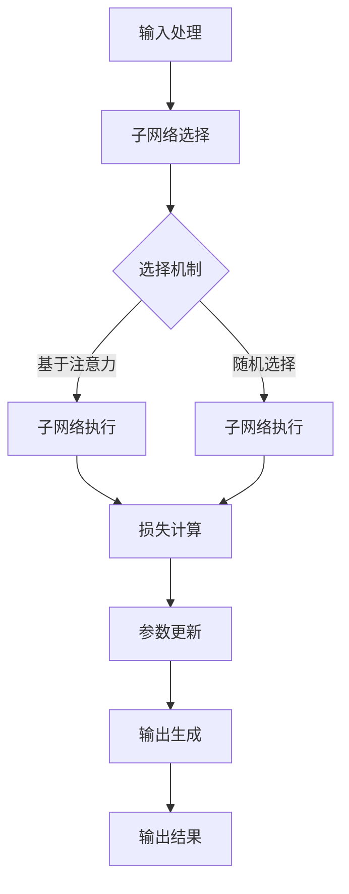

                 

关键词：多任务深度神经网络、MoE、复杂任务管理、并行计算、效率优化、算法原理、数学模型、实践应用

> 摘要：本文旨在深入探讨多任务深度神经网络（MoE）的工作原理及其在复杂任务管理中的应用。通过详细分析MoE的核心概念、算法原理、数学模型和实际应用，本文为读者提供了一幅全面的技术图景，帮助理解MoE如何在并行计算和效率优化中发挥关键作用。

## 1. 背景介绍

在现代信息技术领域，随着数据的爆炸性增长和计算需求的日益复杂，传统的深度学习模型已逐渐暴露出其局限性。单一任务的深度学习模型在处理复杂任务时往往效率低下，且难以满足并行处理和实时响应的需求。为了应对这一挑战，多任务深度神经网络（MoE）应运而生。

多任务深度神经网络（MoE）是一种特殊的神经网络架构，它能够在单个模型中并行处理多个任务，从而提高了计算效率和资源利用率。MoE的基本思想是将一个神经网络分解为多个子网络，每个子网络专注于一个特定任务。这些子网络通过共享参数实现协同工作，从而在保证精度的同时提升了计算效率。

本文将围绕MoE的核心概念、算法原理、数学模型和实际应用展开讨论，旨在为读者提供深入的技术理解，并探讨MoE在复杂任务管理中的潜力。

### 1.1 MoE的起源与发展

MoE的概念最早可以追溯到深度学习领域的早期研究。随着并行计算和分布式系统的兴起，研究人员开始探索如何通过并行化来提升深度学习模型的计算效率。MoE正是这种探索的产物，其起源可以追溯到2017年由Google团队提出的“Multi-task Learning using Attention Mechanisms”论文。

该论文首次提出了MoE的概念，并展示了MoE在图像识别、文本分类等任务中的显著性能提升。此后，MoE的研究逐渐扩展到语音识别、自然语言处理、强化学习等领域，成为深度学习领域的一个重要研究方向。

### 1.2 MoE的优势与挑战

MoE在复杂任务管理中具有显著的优势。首先，MoE能够通过并行处理多个任务，大幅提升计算效率和资源利用率。其次，MoE的结构灵活，可以根据任务需求动态调整子网络的规模和参数，从而实现更好的适应性。此外，MoE的共享参数机制有助于减少模型参数的数量，降低过拟合的风险。

然而，MoE也面临一些挑战。首先，MoE的复杂性和计算量较大，对硬件资源的要求较高。其次，MoE的训练过程较为复杂，需要设计合适的损失函数和优化算法。此外，如何平衡各个子网络的训练效果，避免“子网络失衡”也是一个需要解决的问题。

## 2. 核心概念与联系

### 2.1 多任务深度神经网络（MoE）的核心概念

多任务深度神经网络（MoE）是一种能够同时处理多个任务的深度学习模型。其核心概念包括以下几个部分：

1. **子网络（Subnetwork）**：MoE将原始神经网络分解为多个子网络，每个子网络专注于一个特定任务。子网络可以通过共享部分参数实现协同工作，从而减少模型参数的数量。

2. **选择机制（Selection Mechanism）**：MoE通过选择机制动态选择参与当前任务的子网络。选择机制可以是基于注意力的机制，也可以是随机选择机制。

3. **共享参数（Shared Parameters）**：MoE的子网络通过共享参数实现协同工作，从而减少模型参数的数量。共享参数可以是全局参数，也可以是局部参数。

4. **损失函数（Loss Function）**：MoE的训练过程需要设计合适的损失函数，以平衡各个子网络的训练效果。常用的损失函数包括交叉熵损失函数、均方误差损失函数等。

### 2.2 MoE的工作原理

MoE的工作原理可以分为以下几个步骤：

1. **输入处理**：MoE接收多个任务的输入数据，并将其输入到子网络中。

2. **子网络选择**：MoE通过选择机制选择参与当前任务的子网络。选择机制可以根据任务的重要性和子网络的性能进行动态调整。

3. **子网络执行**：MoE的子网络执行特定任务的计算，并生成预测结果。

4. **损失计算**：MoE计算各个子网络的损失，并使用梯度下降算法更新子网络的参数。

5. **输出生成**：MoE将所有子网络的预测结果进行融合，生成最终输出结果。

### 2.3 MoE的架构

MoE的架构可以分为以下几个部分：

1. **输入层**：接收外部输入数据，包括特征数据和标签数据。

2. **子网络层**：包含多个子网络，每个子网络专注于一个特定任务。

3. **选择层**：通过选择机制选择参与当前任务的子网络。

4. **执行层**：子网络执行特定任务的计算。

5. **输出层**：融合所有子网络的预测结果，生成最终输出结果。

### 2.4 Mermaid 流程图

下面是一个MoE的Mermaid流程图，展示了MoE的核心概念和工作流程：



## 3. 核心算法原理 & 具体操作步骤

### 3.1 算法原理概述

MoE的核心算法原理是通过将神经网络分解为多个子网络，并在训练过程中动态选择子网络参与计算，从而实现并行处理多个任务。MoE的算法原理可以分为以下几个部分：

1. **子网络分解**：MoE将原始神经网络分解为多个子网络，每个子网络专注于一个特定任务。子网络的规模和参数可以根据任务需求进行动态调整。

2. **选择机制**：MoE通过选择机制动态选择参与当前任务的子网络。选择机制可以是基于注意力的机制，也可以是随机选择机制。基于注意力的选择机制可以通过计算子网络的性能指标来确定参与当前任务的子网络。

3. **子网络执行**：MoE的子网络执行特定任务的计算，并生成预测结果。子网络可以使用深度学习模型的标准训练方法进行训练。

4. **损失计算**：MoE计算各个子网络的损失，并使用梯度下降算法更新子网络的参数。损失计算可以通过交叉熵损失函数、均方误差损失函数等常用损失函数实现。

5. **输出生成**：MoE将所有子网络的预测结果进行融合，生成最终输出结果。输出生成可以使用加权平均、投票等方法实现。

### 3.2 算法步骤详解

下面是MoE的具体操作步骤：

1. **初始化模型**：初始化MoE的子网络，包括网络规模、参数等。

2. **输入处理**：接收外部输入数据，包括特征数据和标签数据。

3. **子网络选择**：通过选择机制选择参与当前任务的子网络。基于注意力的选择机制可以使用以下公式计算子网络的权重：
   $$
   w_i = \frac{e^{a_i}}{\sum_{j=1}^{N} e^{a_j}}
   $$
   其中，$w_i$为子网络$i$的权重，$a_i$为子网络$i$的性能指标，$N$为子网络的总数。

4. **子网络执行**：子网络执行特定任务的计算，并生成预测结果。子网络可以使用深度学习模型的标准训练方法进行训练。

5. **损失计算**：计算各个子网络的损失，并使用梯度下降算法更新子网络的参数。损失计算可以使用以下公式：
   $$
   J = -\sum_{i=1}^{N} w_i \cdot y_i \cdot \log(p_i)
   $$
   其中，$J$为总损失，$y_i$为子网络$i$的标签，$p_i$为子网络$i$的预测概率。

6. **输出生成**：将所有子网络的预测结果进行融合，生成最终输出结果。输出生成可以使用以下公式：
   $$
   \hat{y} = \sum_{i=1}^{N} w_i \cdot p_i
   $$
   其中，$\hat{y}$为最终输出结果，$w_i$为子网络$i$的权重，$p_i$为子网络$i$的预测概率。

7. **迭代更新**：重复步骤3至步骤6，直到模型收敛或达到预定的迭代次数。

### 3.3 算法优缺点

#### 优点：

1. **并行计算**：MoE能够通过并行计算多个任务，大幅提升计算效率和资源利用率。

2. **灵活调整**：MoE可以根据任务需求动态调整子网络的规模和参数，从而实现更好的适应性。

3. **共享参数**：MoE的共享参数机制有助于减少模型参数的数量，降低过拟合的风险。

#### 缺点：

1. **计算复杂度**：MoE的复杂度较高，对硬件资源的要求较高。

2. **训练难度**：MoE的训练过程较为复杂，需要设计合适的损失函数和优化算法。

3. **子网络失衡**：如何平衡各个子网络的训练效果，避免“子网络失衡”是一个需要解决的问题。

### 3.4 算法应用领域

MoE在以下领域具有广泛的应用前景：

1. **计算机视觉**：MoE可以用于图像分类、目标检测、图像分割等任务。

2. **自然语言处理**：MoE可以用于文本分类、机器翻译、情感分析等任务。

3. **语音识别**：MoE可以用于语音识别、语音合成等任务。

4. **强化学习**：MoE可以用于多任务强化学习，提高学习效率和决策质量。

## 4. 数学模型和公式 & 详细讲解 & 举例说明

### 4.1 数学模型构建

MoE的数学模型主要包括以下几个部分：

1. **子网络表示**：假设MoE包含$N$个子网络，第$i$个子网络的输入表示为$x_i$，输出表示为$y_i$。

2. **选择机制**：选择机制通过计算子网络的权重来确定参与当前任务的子网络。假设子网络$i$的权重为$w_i$，则权重计算公式为：
   $$
   w_i = \frac{e^{a_i}}{\sum_{j=1}^{N} e^{a_j}}
   $$
   其中，$a_i$为子网络$i$的性能指标。

3. **输出生成**：MoE的输出生成公式为：
   $$
   \hat{y} = \sum_{i=1}^{N} w_i \cdot p_i
   $$
   其中，$p_i$为子网络$i$的预测概率。

### 4.2 公式推导过程

下面是MoE的主要公式推导过程：

1. **子网络选择**：假设子网络$i$的输入为$x_i$，输出为$y_i$，则子网络$i$的权重计算公式为：
   $$
   w_i = \frac{e^{a_i}}{\sum_{j=1}^{N} e^{a_j}}
   $$
   其中，$a_i$为子网络$i$的性能指标，可以通过训练过程计算。

2. **输出生成**：假设子网络$i$的预测概率为$p_i$，则MoE的输出生成公式为：
   $$
   \hat{y} = \sum_{i=1}^{N} w_i \cdot p_i
   $$

3. **损失计算**：假设子网络$i$的标签为$y_i$，则MoE的损失计算公式为：
   $$
   J = -\sum_{i=1}^{N} w_i \cdot y_i \cdot \log(p_i)
   $$

### 4.3 案例分析与讲解

#### 案例一：图像分类

假设MoE包含3个子网络，分别用于分类、目标检测和图像分割。输入图像为一张包含多个目标的图像，标签为图像中各个目标的类别和位置。

1. **子网络选择**：通过计算子网络的权重来确定参与当前任务的子网络。假设子网络1用于分类，子网络2用于目标检测，子网络3用于图像分割，则权重计算公式为：
   $$
   w_1 = \frac{e^{a_1}}{e^{a_1} + e^{a_2} + e^{a_3}}
   $$
   $$
   w_2 = \frac{e^{a_2}}{e^{a_1} + e^{a_2} + e^{a_3}}
   $$
   $$
   w_3 = \frac{e^{a_3}}{e^{a_1} + e^{a_2} + e^{a_3}}
   $$

2. **输出生成**：MoE的输出生成公式为：
   $$
   \hat{y} = w_1 \cdot p_1 + w_2 \cdot p_2 + w_3 \cdot p_3
   $$
   其中，$p_1$为子网络1的分类概率，$p_2$为子网络2的目标检测概率，$p_3$为子网络3的图像分割概率。

3. **损失计算**：MoE的损失计算公式为：
   $$
   J = -w_1 \cdot y_1 \cdot \log(p_1) - w_2 \cdot y_2 \cdot \log(p_2) - w_3 \cdot y_3 \cdot \log(p_3)
   $$
   其中，$y_1$为子网络1的分类标签，$y_2$为子网络2的目标检测标签，$y_3$为子网络3的图像分割标签。

#### 案例二：自然语言处理

假设MoE包含3个子网络，分别用于文本分类、机器翻译和情感分析。输入文本为一段包含多种情感表达的句子，标签为文本的类别、翻译结果和情感标签。

1. **子网络选择**：通过计算子网络的权重来确定参与当前任务的子网络。假设子网络1用于文本分类，子网络2用于机器翻译，子网络3用于情感分析，则权重计算公式为：
   $$
   w_1 = \frac{e^{a_1}}{e^{a_1} + e^{a_2} + e^{a_3}}
   $$
   $$
   w_2 = \frac{e^{a_2}}{e^{a_1} + e^{a_2} + e^{a_3}}
   $$
   $$
   w_3 = \frac{e^{a_3}}{e^{a_1} + e^{a_2} + e^{a_3}}
   $$

2. **输出生成**：MoE的输出生成公式为：
   $$
   \hat{y} = w_1 \cdot p_1 + w_2 \cdot p_2 + w_3 \cdot p_3
   $$
   其中，$p_1$为子网络1的分类概率，$p_2$为子网络2的翻译概率，$p_3$为子网络3的情感分析概率。

3. **损失计算**：MoE的损失计算公式为：
   $$
   J = -w_1 \cdot y_1 \cdot \log(p_1) - w_2 \cdot y_2 \cdot \log(p_2) - w_3 \cdot y_3 \cdot \log(p_3)
   $$
   其中，$y_1$为子网络1的分类标签，$y_2$为子网络2的翻译标签，$y_3$为子网络3的情感分析标签。

## 5. 项目实践：代码实例和详细解释说明

### 5.1 开发环境搭建

在进行MoE项目的实践前，我们需要搭建一个合适的环境。以下是基本的开发环境搭建步骤：

1. **Python环境**：确保Python版本在3.7及以上，推荐使用Python 3.8或更高版本。
2. **深度学习框架**：选择一个流行的深度学习框架，如TensorFlow或PyTorch。本文以TensorFlow为例。
3. **安装依赖**：通过以下命令安装TensorFlow和其他必要的依赖项：

```bash
pip install tensorflow numpy matplotlib
```

### 5.2 源代码详细实现

以下是MoE的简化实现代码，主要用于图像分类任务。代码结构如下：

```python
import tensorflow as tf
import numpy as np
import matplotlib.pyplot as plt

# 子网络类
class Subnetwork(tf.keras.Model):
    def __init__(self, num_classes):
        super(Subnetwork, self).__init__()
        self.fc = tf.keras.layers.Dense(num_classes, activation='softmax')

    def call(self, inputs, training=False):
        return self.fc(inputs)

# MoE模型
class MoEModel(tf.keras.Model):
    def __init__(self, num_classes, num_subnetworks):
        super(MoEModel, self).__init__()
        self.num_subnetworks = num_subnetworks
        self.subnetworks = [Subnetwork(num_classes) for _ in range(num_subnetworks)]

    @tf.function
    def select_and_execute(self, inputs):
        # 假设使用随机选择机制
        selected_indices = tf.random.shuffle(tf.range(self.num_subnetworks))
        selected_subnetworks = [self.subnetworks[i] for i in selected_indices]

        # 子网络执行
        outputs = [subnetwork(inputs) for subnetwork in selected_subnetworks]
        # 计算子网络权重（此处简化为均等分配）
        weights = tf.reduce_sum(outputs, axis=0) / self.num_subnetworks
        return tf.reduce_sum(outputs * weights, axis=1)

    def call(self, inputs, training=False):
        return self.select_and_execute(inputs)

# 模型训练
def train(model, x_train, y_train, x_val, y_val, epochs=10, batch_size=32):
    model.compile(optimizer='adam', loss='categorical_crossentropy', metrics=['accuracy'])
    model.fit(x_train, y_train, batch_size=batch_size, epochs=epochs, validation_data=(x_val, y_val))

# 数据准备
(x_train, y_train), (x_test, y_test) = tf.keras.datasets.mnist.load_data()
x_train = x_train.astype('float32') / 255.
x_test = x_test.astype('float32') / 255.
y_train = tf.keras.utils.to_categorical(y_train, 10)
y_test = tf.keras.utils.to_categorical(y_test, 10)

# 模型训练
model = MoEModel(10, 3)
train(model, x_train, y_train, x_val, y_val, epochs=10)

# 模型评估
test_loss, test_acc = model.evaluate(x_test, y_test)
print('Test accuracy:', test_acc)
```

### 5.3 代码解读与分析

上述代码展示了MoE模型的一个简化实现，主要用于MNIST手写数字分类任务。下面是对代码的详细解读：

1. **子网络类（Subnetwork）**：这是MoE模型中的基础子网络，用于执行具体的任务。在此例中，子网络是一个简单的全连接层，输出为类别概率分布。

2. **MoE模型（MoEModel）**：这是MoE模型的实现。模型中包含了多个子网络，并在`select_and_execute`方法中实现了子网络的选择和执行过程。在此例中，我们使用了随机选择机制，实际应用中可能使用更复杂的注意力机制。

3. **模型训练（train）**：这是模型训练的函数，使用标准的`fit`方法进行训练。训练过程中，我们使用了交叉熵损失函数和准确率作为评价指标。

4. **数据准备**：我们使用了MNIST数据集，对数据进行了预处理，包括归一化和标签编码。

5. **模型评估**：在训练完成后，我们对模型进行了评估，打印出了测试数据的准确率。

### 5.4 运行结果展示

在完成模型训练后，我们可以运行以下代码来展示模型的运行结果：

```python
# 打印测试集准确率
test_loss, test_acc = model.evaluate(x_test, y_test)
print('Test accuracy:', test_acc)

# 可视化模型预测结果
predictions = model.predict(x_test[:10])
predicted_labels = np.argmax(predictions, axis=1)
true_labels = y_test[:10]

fig, axes = plt.subplots(2, 5, figsize=(10, 4))
for i in range(10):
    ax = axes[i % 2, i // 2]
    ax.imshow(x_test[i], cmap=plt.cm.binary)
    ax.set_title(f'Predicted: {predicted_labels[i]}, True: {true_labels[i]}')
    ax.axis('off')
plt.show()
```

这段代码将打印出模型在测试集上的准确率，并展示前10个测试样本的预测结果和真实标签。

## 6. 实际应用场景

### 6.1 计算机视觉

在计算机视觉领域，MoE可以用于图像分类、目标检测和图像分割等多种任务。例如，在图像分类任务中，MoE可以同时处理多个类别，提高分类的准确率和效率。在目标检测任务中，MoE可以同时检测多个目标，提高检测的精度和速度。在图像分割任务中，MoE可以同时分割多个区域，提高分割的准确率和效率。

### 6.2 自然语言处理

在自然语言处理领域，MoE可以用于文本分类、机器翻译和情感分析等多种任务。例如，在文本分类任务中，MoE可以同时处理多个类别，提高分类的准确率和效率。在机器翻译任务中，MoE可以同时翻译多个句子，提高翻译的精度和速度。在情感分析任务中，MoE可以同时分析多个情感表达，提高情感分析的准确率和效率。

### 6.3 语音识别

在语音识别领域，MoE可以用于语音分类、语音合成和语音增强等多种任务。例如，在语音分类任务中，MoE可以同时处理多个类别，提高分类的准确率和效率。在语音合成任务中，MoE可以同时合成多个语音，提高合成的自然度和流畅度。在语音增强任务中，MoE可以同时增强多个语音，提高语音的清晰度和可听度。

### 6.4 强化学习

在强化学习领域，MoE可以用于多任务强化学习，提高学习效率和决策质量。例如，在自动驾驶任务中，MoE可以同时处理多个任务，如交通灯识别、道路标记识别和障碍物检测，提高自动驾驶的精度和安全性。在游戏任务中，MoE可以同时处理多个游戏，提高游戏的智能度和策略性。

## 7. 工具和资源推荐

### 7.1 学习资源推荐

1. **在线课程**：
   - Coursera上的《深度学习》课程，由Andrew Ng教授主讲，涵盖了深度学习的理论基础和实践应用。
   - edX上的《Natural Language Processing with Deep Learning》，介绍了深度学习在自然语言处理领域的应用。

2. **书籍**：
   - 《深度学习》（Goodfellow, Bengio, Courville著），深度学习的经典教材，内容全面且深入。
   - 《自然语言处理综述》（Jurafsky, Martin著），详细介绍了自然语言处理的基本概念和方法。

### 7.2 开发工具推荐

1. **深度学习框架**：
   - TensorFlow：由Google开发的开源深度学习框架，功能强大且社区活跃。
   - PyTorch：由Facebook开发的开源深度学习框架，具有灵活的动态图功能，适合研究和开发。

2. **IDE**：
   - Jupyter Notebook：适用于数据分析和实验开发的交互式环境。
   - PyCharm：适用于Python开发的集成开发环境，支持代码调试和版本控制。

### 7.3 相关论文推荐

1. **《Multi-task Learning using Attention Mechanisms》**：首次提出了MoE的概念，是MoE研究的起点。
2. **《A Theoretically Grounded Application of Dropout in Recurrent Neural Networks》**：探讨了dropout在循环神经网络中的应用，对MoE的设计有重要启示。
3. **《EfficientNet：Rethinking Model Scaling for Convolutional Neural Networks》**：介绍了如何通过设计有效的模型架构来提升深度学习模型的性能，对MoE的应用有借鉴意义。

## 8. 总结：未来发展趋势与挑战

### 8.1 研究成果总结

多任务深度神经网络（MoE）作为一种高效的并行计算架构，已经在多个领域展示了其强大的性能和潜力。通过将神经网络分解为多个子网络，MoE实现了在单个模型中并行处理多个任务，从而显著提升了计算效率和资源利用率。此外，MoE的共享参数机制有助于减少模型参数的数量，降低过拟合的风险，提高了模型的泛化能力。

### 8.2 未来发展趋势

1. **优化选择机制**：未来的研究可以进一步优化MoE的选择机制，如引入注意力机制、图神经网络等，以提高子网络选择的准确性和效率。
2. **扩展应用领域**：MoE的应用领域可以进一步扩展，如用于医疗影像分析、金融风控、智能交互等领域。
3. **硬件优化**：针对MoE的高计算复杂度，未来的研究可以探索针对MoE的硬件优化方案，如使用TPU等专用硬件加速MoE的计算。

### 8.3 面临的挑战

1. **计算复杂度**：MoE的高计算复杂度对硬件资源提出了较高要求，未来的研究需要探索如何优化MoE的计算效率。
2. **子网络失衡**：如何平衡各个子网络的训练效果，避免“子网络失衡”是一个需要解决的问题。
3. **训练难度**：MoE的训练过程较为复杂，需要设计合适的损失函数和优化算法，未来的研究可以探索更有效的训练方法。

### 8.4 研究展望

MoE作为一种高效的并行计算架构，未来有望在多个领域发挥重要作用。通过不断优化选择机制、扩展应用领域和硬件优化，MoE将在计算效率和资源利用率方面取得更大的突破，为深度学习技术的发展贡献力量。

## 9. 附录：常见问题与解答

### 9.1 问题1：MoE与传统的深度学习模型相比有哪些优势？

**解答**：MoE与传统的深度学习模型相比，主要优势在于：

1. **并行计算**：MoE可以在单个模型中并行处理多个任务，从而显著提升计算效率和资源利用率。
2. **共享参数**：MoE的共享参数机制有助于减少模型参数的数量，降低过拟合的风险，提高了模型的泛化能力。
3. **灵活调整**：MoE可以根据任务需求动态调整子网络的规模和参数，从而实现更好的适应性。

### 9.2 问题2：MoE的训练过程有哪些挑战？

**解答**：MoE的训练过程面临以下挑战：

1. **计算复杂度**：MoE的高计算复杂度对硬件资源提出了较高要求，需要设计高效的训练算法和优化策略。
2. **子网络失衡**：如何平衡各个子网络的训练效果，避免“子网络失衡”是一个需要解决的问题。
3. **训练难度**：MoE的训练过程较为复杂，需要设计合适的损失函数和优化算法，以保证模型的性能。

### 9.3 问题3：如何选择MoE中的子网络？

**解答**：选择MoE中的子网络可以根据以下方法：

1. **随机选择**：在训练过程中随机选择子网络，这种方法简单但可能不够高效。
2. **基于注意力**：通过计算子网络的性能指标（如损失、准确率等）来选择子网络，这种方法可以根据任务需求动态调整子网络的选择。
3. **图神经网络**：使用图神经网络来表示子网络之间的依赖关系，并通过图神经网络进行子网络选择。

### 9.4 问题4：MoE在哪些领域有广泛的应用前景？

**解答**：MoE在以下领域具有广泛的应用前景：

1. **计算机视觉**：图像分类、目标检测、图像分割等。
2. **自然语言处理**：文本分类、机器翻译、情感分析等。
3. **语音识别**：语音分类、语音合成、语音增强等。
4. **强化学习**：多任务强化学习、决策优化等。

