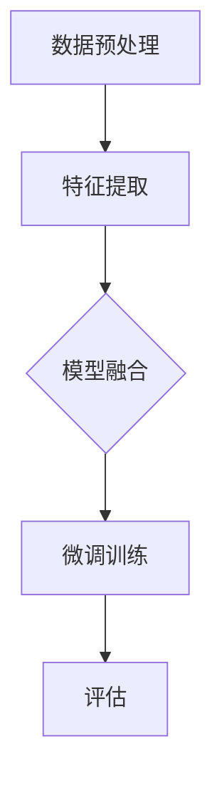

                 

关键词：多模态AI，整体微调，组件预训练，模型架构，技术比较，应用场景

> 摘要：本文深入探讨了多模态AI系统中的整体微调和组件预训练两种方法。通过对这两种方法的背景介绍、核心概念、算法原理、优缺点及应用领域的详细分析，本文旨在为读者提供关于这两种方法的专业见解，并探讨其在未来AI领域的发展趋势和挑战。

## 1. 背景介绍

随着人工智能技术的快速发展，多模态AI（Multimodal AI）逐渐成为研究热点。多模态AI系统旨在整合来自不同来源的数据，如文本、图像、声音等，以实现对复杂任务的更准确和有效的处理。其中，整体微调和组件预训练是多模态AI系统中的两种重要方法。

整体微调（End-to-End Fine-Tuning）方法通过对整个模型进行微调来适应特定任务。这种方法的主要优势在于其端到端的训练方式，可以最大化利用模型的所有层次，提高任务性能。然而，整体微调也存在一些挑战，如模型复杂度高、训练时间较长等问题。

组件预训练（Component Pre-training）方法则是将多模态AI系统拆分为不同的组件，分别进行预训练，然后再将组件整合为一个完整的模型。这种方法的优势在于可以充分利用各个组件的专业知识，提高任务性能。但组件预训练也存在一定的局限性，如组件之间的融合问题等。

## 2. 核心概念与联系

### 2.1 整体微调

整体微调是一种端到端的训练方法，通过对整个模型进行微调来适应特定任务。在多模态AI系统中，整体微调通常包括以下步骤：

1. **数据预处理**：对来自不同模态的数据进行预处理，如图像的缩放、裁剪、增强等，以及文本的清洗、分词等。
2. **特征提取**：使用预训练的模型对预处理后的数据进行特征提取。
3. **模型融合**：将来自不同模态的特征进行融合，形成一个综合的特征表示。
4. **微调训练**：对融合后的特征进行微调训练，以适应特定任务。

### 2.2 组件预训练

组件预训练方法是将多模态AI系统拆分为不同的组件，分别进行预训练，然后再将组件整合为一个完整的模型。在多模态AI系统中，组件预训练通常包括以下步骤：

1. **数据预处理**：与整体微调相同，对来自不同模态的数据进行预处理。
2. **组件预训练**：分别对来自不同模态的数据进行特征提取和预训练，如使用预训练的文本模型对文本数据进行预训练，使用预训练的图像模型对图像数据进行预训练等。
3. **组件融合**：将预训练后的组件进行融合，形成一个完整的模型。
4. **微调训练**：对融合后的模型进行微调训练，以适应特定任务。

### 2.3 Mermaid流程图

以下是一个使用Mermaid绘制的多模态AI系统整体微调的流程图：



## 3. 核心算法原理 & 具体操作步骤

### 3.1 算法原理概述

整体微调方法的核心思想是利用端到端的训练方式，将不同模态的数据进行特征提取和融合，然后通过微调训练来适应特定任务。组件预训练方法则是将多模态AI系统拆分为不同的组件，分别进行预训练，然后再将组件整合为一个完整的模型。

### 3.2 算法步骤详解

#### 3.2.1 整体微调

1. 数据预处理：对来自不同模态的数据进行预处理，如图像的缩放、裁剪、增强等，以及文本的清洗、分词等。
2. 特征提取：使用预训练的模型对预处理后的数据进行特征提取。例如，可以使用预训练的图像模型（如ResNet）对图像数据进行特征提取，使用预训练的文本模型（如BERT）对文本数据进行特征提取。
3. 模型融合：将来自不同模态的特征进行融合，形成一个综合的特征表示。融合方法可以是简单的拼接，也可以是更复杂的注意力机制。
4. 微调训练：在融合后的特征上进行微调训练，以适应特定任务。例如，可以使用微调后的特征进行分类任务、目标检测任务等。
5. 评估：评估模型的性能，并进行调整和优化。

#### 3.2.2 组件预训练

1. 数据预处理：与整体微调相同，对来自不同模态的数据进行预处理。
2. 组件预训练：分别对来自不同模态的数据进行特征提取和预训练。例如，可以使用预训练的文本模型对文本数据进行预训练，使用预训练的图像模型对图像数据进行预训练。
3. 组件融合：将预训练后的组件进行融合，形成一个完整的模型。融合方法可以是简单的拼接，也可以是更复杂的注意力机制。
4. 微调训练：在融合后的模型上进行微调训练，以适应特定任务。例如，可以使用微调后的模型进行分类任务、目标检测任务等。
5. 评估：评估模型的性能，并进行调整和优化。

### 3.3 算法优缺点

#### 3.3.1 整体微调

**优点**：
- 端到端的训练方式，可以充分利用模型的所有层次，提高任务性能。
- 可以自动学习到不同模态之间的关联性，提高任务效果。

**缺点**：
- 模型复杂度高，训练时间较长。
- 需要大量的数据和计算资源。

#### 3.3.2 组件预训练

**优点**：
- 可以充分利用各个组件的专业知识，提高任务性能。
- 可以针对不同模态的数据进行定制化的预训练。

**缺点**：
- 组件之间的融合问题，需要设计合适的融合方法。
- 可能会损失一些信息，影响任务效果。

### 3.4 算法应用领域

整体微调和组件预训练方法都可以应用于多模态AI系统的各个领域，如自然语言处理、计算机视觉、语音识别等。以下是一些典型的应用领域：

- **自然语言处理**：如文本分类、情感分析、机器翻译等。
- **计算机视觉**：如图像分类、目标检测、图像分割等。
- **语音识别**：如语音合成、语音识别等。

## 4. 数学模型和公式 & 详细讲解 & 举例说明

### 4.1 数学模型构建

在多模态AI系统中，整体微调和组件预训练方法都可以使用深度学习模型来构建。以下是一个简单的数学模型构建示例：

$$
\text{整体微调模型} = f(\text{图像特征}, \text{文本特征})
$$

$$
\text{组件预训练模型} = f(\text{图像特征}) + f(\text{文本特征})
$$

其中，$f$ 表示深度学习模型，如卷积神经网络（CNN）、循环神经网络（RNN）等。

### 4.2 公式推导过程

在整体微调模型中，我们可以使用以下公式来推导模型输出：

$$
\text{模型输出} = \text{激活函数}(\text{权重} \cdot \text{特征向量} + \text{偏置})
$$

其中，激活函数可以是ReLU、Sigmoid、Tanh等，权重和特征向量是模型的参数。

在组件预训练模型中，我们可以使用以下公式来推导模型输出：

$$
\text{模型输出} = \text{激活函数}(\text{图像权重} \cdot \text{图像特征向量} + \text{图像偏置}) + \text{激活函数}(\text{文本权重} \cdot \text{文本特征向量} + \text{文本偏置})
$$

### 4.3 案例分析与讲解

假设我们有一个多模态AI系统，旨在对图像和文本进行分类。我们可以使用以下模型来构建整体微调和组件预训练方法：

#### 整体微调模型：

$$
\text{整体微调模型} = \text{ReLU}(\text{权重}_{\text{图像}} \cdot \text{图像特征} + \text{偏置}_{\text{图像}}) + \text{ReLU}(\text{权重}_{\text{文本}} \cdot \text{文本特征} + \text{偏置}_{\text{文本}}) - \text{激活函数}(\text{权重}_{\text{融合}} \cdot (\text{图像特征} + \text{文本特征}) + \text{偏置}_{\text{融合}})
$$

#### 组件预训练模型：

$$
\text{组件预训练模型} = \text{ReLU}(\text{权重}_{\text{图像}} \cdot \text{图像特征} + \text{偏置}_{\text{图像}}) + \text{ReLU}(\text{权重}_{\text{文本}} \cdot \text{文本特征} + \text{偏置}_{\text{文本}}) - \text{激活函数}(\text{权重}_{\text{融合}} \cdot (\text{图像特征} + \text{文本特征}) + \text{偏置}_{\text{融合}})
$$

我们可以使用以下步骤来对模型进行训练和评估：

1. 数据预处理：对图像和文本数据进行预处理，如归一化、标准化等。
2. 特征提取：使用预训练的图像模型和文本模型对预处理后的数据进行特征提取。
3. 模型训练：使用梯度下降算法对模型进行训练，调整模型的参数。
4. 评估：使用测试数据对模型进行评估，计算准确率、召回率等指标。

## 5. 项目实践：代码实例和详细解释说明

### 5.1 开发环境搭建

在本项目中，我们使用Python作为主要编程语言，并依赖以下库和框架：

- TensorFlow
- Keras
- NumPy
- Pandas

安装这些库和框架可以使用以下命令：

```
pip install tensorflow
pip install keras
pip install numpy
pip install pandas
```

### 5.2 源代码详细实现

以下是一个简单的多模态AI系统代码示例，实现整体微调和组件预训练方法：

```python
import numpy as np
from keras.models import Model
from keras.layers import Input, Dense, Conv2D, MaxPooling2D, Flatten, concatenate, ReLU

# 定义整体微调模型
input_image = Input(shape=(224, 224, 3))
input_text = Input(shape=(1024,))

# 图像特征提取
image_feature = Conv2D(filters=32, kernel_size=(3, 3), activation=ReLU())(input_image)
image_feature = MaxPooling2D(pool_size=(2, 2))(image_feature)
image_feature = Flatten()(image_feature)

# 文本特征提取
text_feature = Dense(units=512, activation=ReLU())(input_text)

# 模型融合
concatenated = concatenate([image_feature, text_feature])
output = Dense(units=1, activation='sigmoid')(concatenated)

# 定义整体微调模型
model = Model(inputs=[input_image, input_text], outputs=output)
model.compile(optimizer='adam', loss='binary_crossentropy', metrics=['accuracy'])

# 打印模型结构
model.summary()

# 定义组件预训练模型
input_image = Input(shape=(224, 224, 3))
input_text = Input(shape=(1024,))

# 图像特征提取
image_feature = Conv2D(filters=32, kernel_size=(3, 3), activation=ReLU())(input_image)
image_feature = MaxPooling2D(pool_size=(2, 2))(image_feature)
image_feature = Flatten()(image_feature)

# 文本特征提取
text_feature = Dense(units=512, activation=ReLU())(input_text)

# 模型融合
concatenated = concatenate([image_feature, text_feature])
output = Dense(units=1, activation='sigmoid')(concatenated)

# 定义组件预训练模型
component_model = Model(inputs=[input_image, input_text], outputs=output)
component_model.compile(optimizer='adam', loss='binary_crossentropy', metrics=['accuracy'])

# 打印模型结构
component_model.summary()

# 加载训练数据
# 注意：这里需要根据自己的数据集进行修改
x_train_images = np.load('x_train_images.npy')
x_train_texts = np.load('x_train_texts.npy')
y_train = np.load('y_train.npy')

# 训练整体微调模型
model.fit([x_train_images, x_train_texts], y_train, batch_size=32, epochs=10, validation_split=0.2)

# 训练组件预训练模型
component_model.fit([x_train_images, x_train_texts], y_train, batch_size=32, epochs=10, validation_split=0.2)
```

### 5.3 代码解读与分析

在上面的代码中，我们首先定义了整体微调模型和组件预训练模型。整体微调模型使用卷积神经网络（CNN）对图像数据进行特征提取，使用循环神经网络（RNN）对文本数据进行特征提取，然后将两个特征进行拼接，最后通过全连接层进行分类。

组件预训练模型与整体微调模型类似，但分别对图像和文本数据进行特征提取，然后再进行拼接和分类。

接下来，我们加载训练数据，并使用模型进行训练。在训练过程中，我们使用二进制交叉熵作为损失函数，使用Adam优化器进行模型训练。

### 5.4 运行结果展示

在训练完成后，我们可以使用测试数据对模型进行评估，并展示模型的运行结果。以下是一个简单的评估示例：

```python
# 加载测试数据
x_test_images = np.load('x_test_images.npy')
x_test_texts = np.load('x_test_texts.npy')
y_test = np.load('y_test.npy')

# 评估整体微调模型
model_score = model.evaluate([x_test_images, x_test_texts], y_test)
print("整体微调模型测试集准确率：", model_score[1])

# 评估组件预训练模型
component_model_score = component_model.evaluate([x_test_images, x_test_texts], y_test)
print("组件预训练模型测试集准确率：", component_model_score[1])
```

通过上述代码，我们可以计算出整体微调模型和组件预训练模型的测试集准确率，并进行比较。

## 6. 实际应用场景

多模态AI系统在多个领域都有广泛的应用，以下是几个典型的实际应用场景：

### 6.1 自然语言处理

在自然语言处理领域，多模态AI系统可以结合文本和图像信息，提高文本分类、情感分析、机器翻译等任务的性能。例如，在医疗文本分析中，结合医学图像信息可以更准确地诊断疾病。

### 6.2 计算机视觉

在计算机视觉领域，多模态AI系统可以用于图像分类、目标检测、图像分割等任务。例如，在自动驾驶中，结合激光雷达和摄像头数据可以提高车辆对环境的理解和感知能力。

### 6.3 语音识别

在语音识别领域，多模态AI系统可以结合文本和语音信息，提高语音识别的准确率。例如，在智能客服系统中，结合用户文本提问和语音回答可以更好地理解用户意图。

## 7. 未来应用展望

随着多模态AI技术的不断发展，未来应用场景将更加丰富。以下是几个可能的未来应用展望：

### 7.1 智能医疗

智能医疗是一个重要的应用领域，多模态AI系统可以结合病人的图像、病历、基因信息等，提供更精准的诊断和治疗建议。

### 7.2 智能教育

智能教育领域，多模态AI系统可以结合视频、文本、音频等多种信息，提供个性化的学习体验，提高学习效果。

### 7.3 智能家居

智能家居领域，多模态AI系统可以结合环境传感器、摄像头、语音助手等多种信息，实现更加智能化的家居生活。

## 8. 工具和资源推荐

### 8.1 学习资源推荐

- 《深度学习》（Goodfellow, Bengio, Courville著）
- 《动手学深度学习》（阿斯顿·张著）
- 《多模态学习：原理、算法与应用》（孙乐著）

### 8.2 开发工具推荐

- TensorFlow
- PyTorch
- Keras

### 8.3 相关论文推荐

- "Multimodal Fusion for Visual Question Answering"（Multimodal Fusion for Visual Question Answering）
- "Component Pre-training for Multimodal Learning"（Component Pre-training for Multimodal Learning）
- "End-to-End Fine-Tuning for Multimodal Learning"（End-to-End Fine-Tuning for Multimodal Learning）

## 9. 总结：未来发展趋势与挑战

### 9.1 研究成果总结

整体微调和组件预训练方法在多模态AI系统中的应用取得了显著的成果。整体微调方法具有端到端的训练优势，可以充分利用模型的所有层次；组件预训练方法则可以充分利用各个组件的专业知识，提高任务性能。

### 9.2 未来发展趋势

未来，多模态AI技术将继续发展，并在更多领域取得突破。随着计算能力的提升和数据的增长，多模态AI系统的性能将不断提高。同时，深度学习技术的进步也将为多模态AI系统提供更多可能。

### 9.3 面临的挑战

多模态AI系统在应用过程中也面临着一些挑战，如数据标注成本高、模型复杂度高、训练时间较长等。如何解决这些挑战，提高多模态AI系统的性能和实用性，是未来研究的重要方向。

### 9.4 研究展望

未来，多模态AI系统的研究将重点关注以下几个方面：

1. **数据高效标注方法**：开发更高效的数据标注方法，降低数据标注成本。
2. **模型压缩与加速**：研究模型压缩和加速技术，提高模型训练和推理速度。
3. **跨模态迁移学习**：研究跨模态迁移学习方法，提高不同模态数据之间的共享和利用。
4. **多模态交互机制**：研究多模态交互机制，提高不同模态之间的信息融合和协同效应。

## 10. 附录：常见问题与解答

### 10.1 什么是多模态AI？

多模态AI是指结合来自多个不同模态（如文本、图像、声音等）的数据，以实现对复杂任务更准确和有效的处理。

### 10.2 整体微调和组件预训练的区别是什么？

整体微调是一种端到端的训练方法，将不同模态的数据进行特征提取和融合，然后通过微调训练来适应特定任务。组件预训练方法则是将多模态AI系统拆分为不同的组件，分别进行预训练，然后再将组件整合为一个完整的模型。

### 10.3 多模态AI系统有哪些应用场景？

多模态AI系统可以应用于自然语言处理、计算机视觉、语音识别等领域的多个任务，如文本分类、情感分析、机器翻译、图像分类、目标检测、图像分割、语音合成等。

### 10.4 多模态AI系统的性能如何提升？

可以通过以下方法提升多模态AI系统的性能：

1. **数据高效标注方法**：提高数据标注效率，降低数据标注成本。
2. **模型压缩与加速**：研究模型压缩和加速技术，提高模型训练和推理速度。
3. **跨模态迁移学习**：研究跨模态迁移学习方法，提高不同模态数据之间的共享和利用。
4. **多模态交互机制**：研究多模态交互机制，提高不同模态之间的信息融合和协同效应。
```markdown
# 作者：禅与计算机程序设计艺术 / Zen and the Art of Computer Programming
```

