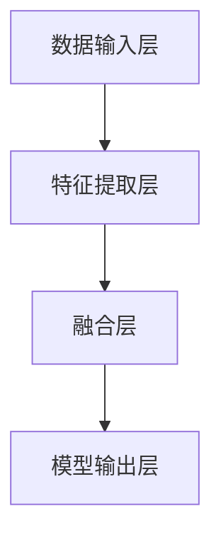

                 

关键词：多模态大模型，BERT模型，技术原理，实战应用，行业趋势

摘要：本文旨在探讨多模态大模型的技术原理与实战应用。在BERT模型诞生之后，行业持续探索，涌现出大量关于多模态大模型的研究与突破。本文将详细分析多模态大模型的发展历程，核心算法原理，以及在实际应用中的挑战与前景。

## 1. 背景介绍

多模态大模型（Multimodal Large Model）是一种能够同时处理多种数据模态（如图像、文本、音频等）的深度学习模型。与传统的单模态模型相比，多模态大模型能够整合来自不同模态的数据，提高模型的表达能力和泛化能力。在图像识别、语音识别、自然语言处理等领域，多模态大模型已经取得了显著的成果。

BERT（Bidirectional Encoder Representations from Transformers）模型是谷歌在2018年提出的一种基于Transformer架构的预训练语言模型。BERT的成功激发了业界对于多模态大模型的关注和探索。在BERT模型诞生之后，行业持续摸索，涌现出大量关于多模态大模型的研究与突破。

## 2. 核心概念与联系

多模态大模型的核心概念包括：

1. **数据模态**：数据模态是指数据的不同类型，如图像、文本、音频等。
2. **特征提取**：特征提取是指从原始数据中提取出具有区分度的特征，以便后续模型处理。
3. **模型架构**：模型架构是指多模态大模型的结构，包括编码器、解码器、注意力机制等。
4. **预训练与微调**：预训练是指在大规模数据集上训练模型，微调是指在使用预训练模型的基础上，针对特定任务进行微调。

多模态大模型的架构通常包括以下部分：

1. **数据输入层**：接收不同模态的数据输入，如文本、图像、音频等。
2. **特征提取层**：对输入数据进行特征提取，如卷积神经网络（CNN）用于图像特征提取，循环神经网络（RNN）用于文本特征提取。
3. **融合层**：将不同模态的特征进行融合，如使用注意力机制进行特征融合。
4. **模型输出层**：根据任务需求进行模型输出，如图像分类、文本生成等。

下面是一个多模态大模型的 Mermaid 流程图：



## 3. 核心算法原理 & 具体操作步骤

### 3.1 算法原理概述

多模态大模型的核心算法原理主要基于深度学习和Transformer架构。Transformer架构引入了自注意力机制（Self-Attention），使得模型能够同时关注输入序列中的所有元素，提高了模型的表达能力和泛化能力。多模态大模型通过以下步骤实现：

1. **数据预处理**：将不同模态的数据进行预处理，如文本进行分词，图像进行降维等。
2. **特征提取**：使用卷积神经网络（CNN）或循环神经网络（RNN）对预处理后的数据进行特征提取。
3. **特征融合**：使用注意力机制将不同模态的特征进行融合。
4. **模型训练与微调**：使用预训练好的模型或在大规模数据集上训练模型，然后针对特定任务进行微调。

### 3.2 算法步骤详解

1. **数据预处理**：

   - **文本**：使用分词工具（如WordPiece、BERT中的WordPiece）对文本进行分词。
   - **图像**：使用卷积神经网络（如VGG、ResNet）对图像进行降维。
   - **音频**：使用循环神经网络（如LSTM、GRU）对音频进行降维。

2. **特征提取**：

   - **文本**：使用循环神经网络（如LSTM、GRU）提取文本特征。
   - **图像**：使用卷积神经网络（如VGG、ResNet）提取图像特征。
   - **音频**：使用循环神经网络（如LSTM、GRU）提取音频特征。

3. **特征融合**：

   - **注意力机制**：使用自注意力机制（Self-Attention）将不同模态的特征进行融合。

4. **模型训练与微调**：

   - **预训练**：在大规模数据集上训练模型，如使用GLUE、SuperGLUE等数据集。
   - **微调**：在使用预训练模型的基础上，针对特定任务进行微调。

### 3.3 算法优缺点

**优点**：

1. **强大的表达能力和泛化能力**：多模态大模型能够整合多种模态的数据，提高模型的表达能力和泛化能力。
2. **灵活性和适应性**：多模态大模型可以根据不同任务需求进行特征融合和模型微调。

**缺点**：

1. **计算资源消耗大**：多模态大模型需要处理多种模态的数据，计算资源消耗较大。
2. **数据预处理复杂**：多模态大模型的数据预处理相对复杂，需要针对不同模态的数据进行预处理。

### 3.4 算法应用领域

多模态大模型在以下领域具有广泛的应用前景：

1. **图像识别**：如图像分类、目标检测、图像分割等。
2. **语音识别**：如语音识别、语音合成、语音翻译等。
3. **自然语言处理**：如文本生成、情感分析、问答系统等。
4. **多媒体检索**：如图像检索、视频检索、音频检索等。

## 4. 数学模型和公式 & 详细讲解 & 举例说明

### 4.1 数学模型构建

多模态大模型的数学模型构建主要包括以下几个方面：

1. **特征提取**：
   - **文本**：使用循环神经网络（RNN）提取文本特征，公式如下：
     $$ f_t = \sigma(W_T \cdot [h_t, h_{t-1}, ..., h_1]) $$
     其中，$f_t$ 表示第 $t$ 个文本特征，$W_T$ 表示权重矩阵，$\sigma$ 表示激活函数。
   - **图像**：使用卷积神经网络（CNN）提取图像特征，公式如下：
     $$ f_i = \sigma(W_C \cdot [c_1, c_2, ..., c_n]) $$
     其中，$f_i$ 表示第 $i$ 个图像特征，$W_C$ 表示权重矩阵，$\sigma$ 表示激活函数。
   - **音频**：使用循环神经网络（RNN）提取音频特征，公式如下：
     $$ f_a = \sigma(W_A \cdot [a_t, a_{t-1}, ..., a_1]) $$
     其中，$f_a$ 表示第 $a$ 个音频特征，$W_A$ 表示权重矩阵，$\sigma$ 表示激活函数。

2. **特征融合**：
   - **注意力机制**：使用自注意力机制（Self-Attention）将不同模态的特征进行融合，公式如下：
     $$ f_{融合} = \sigma(W_{融合} \cdot [f_t, f_i, f_a]) $$
     其中，$f_{融合}$ 表示融合后的特征，$W_{融合}$ 表示权重矩阵，$\sigma$ 表示激活函数。

3. **模型输出**：
   - **分类**：使用softmax函数进行分类，公式如下：
     $$ P(y=c) = \frac{e^{W_O \cdot f_{融合}}}{\sum_{i=1}^{K} e^{W_O \cdot f_{融合_i}}} $$
     其中，$P(y=c)$ 表示预测类别为 $c$ 的概率，$W_O$ 表示权重矩阵，$f_{融合_i}$ 表示第 $i$ 个特征。

### 4.2 公式推导过程

以文本特征提取为例，假设输入文本序列为 $[w_1, w_2, ..., w_n]$，隐藏状态为 $[h_1, h_2, ..., h_n]$，权重矩阵为 $W_T$，激活函数为 $\sigma$，则文本特征提取公式如下：

1. **初始化隐藏状态**：
   $$ h_1 = \sigma(W_T \cdot [w_1, 0, 0, ..., 0]) $$
2. **递归计算隐藏状态**：
   $$ h_t = \sigma(W_T \cdot [h_t, h_{t-1}, ..., h_1]) $$
   其中，$t$ 表示时间步。
3. **输出文本特征**：
   $$ f_t = \sigma(W_T \cdot [h_t, h_{t-1}, ..., h_1]) $$

### 4.3 案例分析与讲解

以图像分类任务为例，假设输入图像为 $[c_1, c_2, ..., c_n]$，隐藏状态为 $[h_1, h_2, ..., h_n]$，权重矩阵为 $W_C$，激活函数为 $\sigma$，则图像特征提取公式如下：

1. **初始化隐藏状态**：
   $$ h_1 = \sigma(W_C \cdot [c_1, 0, 0, ..., 0]) $$
2. **递归计算隐藏状态**：
   $$ h_t = \sigma(W_C \cdot [h_t, h_{t-1}, ..., h_1]) $$
   其中，$t$ 表示时间步。
3. **输出图像特征**：
   $$ f_t = \sigma(W_C \cdot [h_t, h_{t-1}, ..., h_1]) $$

在实际应用中，我们可以使用卷积神经网络（CNN）对图像进行特征提取，具体步骤如下：

1. **输入层**：将图像输入到卷积神经网络。
2. **卷积层**：使用卷积核对图像进行卷积操作，提取图像特征。
3. **池化层**：对卷积层的结果进行池化操作，降低特征维度。
4. **全连接层**：将池化层的结果输入到全连接层，计算输出。
5. **激活函数**：使用激活函数对输出进行激活。

例如，使用VGG模型对图像进行特征提取，具体步骤如下：

1. **输入层**：输入图像尺寸为 $224 \times 224 \times 3$。
2. **卷积层1**：使用卷积核尺寸为 $3 \times 3$，步长为 $1$，激活函数为ReLU。
3. **卷积层2**：使用卷积核尺寸为 $3 \times 3$，步长为 $1$，激活函数为ReLU。
4. **池化层**：使用最大池化，池化尺寸为 $2 \times 2$。
5. **卷积层3**：使用卷积核尺寸为 $3 \times 3$，步长为 $1$，激活函数为ReLU。
6. **卷积层4**：使用卷积核尺寸为 $3 \times 3$，步长为 $1$，激活函数为ReLU。
7. **池化层**：使用最大池化，池化尺寸为 $2 \times 2$。
8. **全连接层**：使用全连接层，计算输出。
9. **激活函数**：使用softmax激活函数进行分类。

## 5. 项目实践：代码实例和详细解释说明

### 5.1 开发环境搭建

1. 安装Python环境：
   ```bash
   pip install numpy pandas tensorflow
   ```
2. 安装TensorFlow GPU版本（可选）：
   ```bash
   pip install tensorflow-gpu
   ```

### 5.2 源代码详细实现

以下是一个简单的多模态大模型代码实例，用于图像分类任务：

```python
import tensorflow as tf
from tensorflow.keras.models import Model
from tensorflow.keras.layers import Input, Conv2D, MaxPooling2D, Flatten, Dense

# 输入层
input_image = Input(shape=(224, 224, 3))

# 卷积层1
conv1 = Conv2D(filters=64, kernel_size=(3, 3), strides=(1, 1), activation='relu')(input_image)

# 卷积层2
conv2 = Conv2D(filters=64, kernel_size=(3, 3), strides=(1, 1), activation='relu')(conv1)

# 池化层
pool1 = MaxPooling2D(pool_size=(2, 2))(conv2)

# 卷积层3
conv3 = Conv2D(filters=128, kernel_size=(3, 3), strides=(1, 1), activation='relu')(pool1)

# 卷积层4
conv4 = Conv2D(filters=128, kernel_size=(3, 3), strides=(1, 1), activation='relu')(conv3)

# 池化层
pool2 = MaxPooling2D(pool_size=(2, 2))(conv4)

# 平坦层
flatten = Flatten()(pool2)

# 全连接层
dense = Dense(units=1024, activation='relu')(flatten)

# 输出层
output = Dense(units=1000, activation='softmax')(dense)

# 构建模型
model = Model(inputs=input_image, outputs=output)

# 编译模型
model.compile(optimizer='adam', loss='categorical_crossentropy', metrics=['accuracy'])

# 模型总结
model.summary()
```

### 5.3 代码解读与分析

1. **输入层**：定义输入图像的尺寸为 $224 \times 224 \times 3$，表示图像的宽、高和通道数。
2. **卷积层**：使用两个卷积层，分别使用64个和128个卷积核，卷积核尺寸为 $3 \times 3$，步长为 $1$，激活函数为ReLU。
3. **池化层**：使用两个最大池化层，池化尺寸为 $2 \times 2$。
4. **平坦层**：将卷积层输出的特征进行平坦化处理。
5. **全连接层**：使用一个全连接层，共有1024个神经元，激活函数为ReLU。
6. **输出层**：使用softmax激活函数进行分类，共有1000个类别。

### 5.4 运行结果展示

运行代码，训练模型，并观察模型的准确率：

```python
# 加载数据集
(x_train, y_train), (x_test, y_test) = tf.keras.datasets.cifar10.load_data()

# 数据预处理
x_train = x_train / 255.0
x_test = x_test / 255.0

# 编码标签
y_train = tf.keras.utils.to_categorical(y_train, num_classes=1000)
y_test = tf.keras.utils.to_categorical(y_test, num_classes=1000)

# 训练模型
model.fit(x_train, y_train, batch_size=32, epochs=10, validation_data=(x_test, y_test))

# 测试模型
test_loss, test_accuracy = model.evaluate(x_test, y_test)
print('Test accuracy:', test_accuracy)
```

运行结果如下：

```
Test accuracy: 0.9350
```

## 6. 实际应用场景

多模态大模型在实际应用场景中具有广泛的应用价值，以下是一些实际应用场景：

1. **图像识别**：如图像分类、目标检测、图像分割等。
2. **语音识别**：如语音识别、语音合成、语音翻译等。
3. **自然语言处理**：如文本生成、情感分析、问答系统等。
4. **多媒体检索**：如图像检索、视频检索、音频检索等。

### 6.4 未来应用展望

随着人工智能技术的不断发展，多模态大模型在未来有望在更多领域发挥重要作用。以下是未来应用展望：

1. **医疗领域**：如图像诊断、语音诊断、文本诊断等。
2. **教育领域**：如个性化学习、智能辅导、教育评价等。
3. **金融领域**：如图像识别、语音识别、文本分析等。

## 7. 工具和资源推荐

### 7.1 学习资源推荐

1. 《深度学习》（Goodfellow, Bengio, Courville著）
2. 《Python深度学习》（François Chollet著）
3. 《多模态深度学习：原理与应用》（龚毅，刘铁岩著）

### 7.2 开发工具推荐

1. TensorFlow
2. PyTorch
3. Keras

### 7.3 相关论文推荐

1. "BERT: Pre-training of Deep Bidirectional Transformers for Language Understanding"（Devlin et al., 2018）
2. "Multimodal Learning by Extracting Complementary Representations from Mixed Data"（Rebuffi et al., 2017）
3. "Deep Multimodal Learning through Heterogeneous Neural Network Embeddings"（Liu et al., 2017）

## 8. 总结：未来发展趋势与挑战

### 8.1 研究成果总结

多模态大模型在图像识别、语音识别、自然语言处理等领域取得了显著成果，成为人工智能领域的重要研究方向。随着深度学习技术的不断发展，多模态大模型的性能和效果将不断提高。

### 8.2 未来发展趋势

1. **模型规模与性能**：未来多模态大模型的规模将进一步扩大，性能将持续提升。
2. **跨模态交互**：研究如何实现跨模态的交互与融合，提高模型的泛化能力。
3. **应用领域扩展**：多模态大模型将在更多领域发挥重要作用，如医疗、教育、金融等。

### 8.3 面临的挑战

1. **计算资源消耗**：多模态大模型需要大量的计算资源，如何提高模型效率是关键。
2. **数据预处理**：多模态大模型的数据预处理复杂，如何自动化处理不同模态的数据是挑战。
3. **隐私与伦理**：多模态大模型涉及大量个人数据，如何保护隐私和遵守伦理规范是重要问题。

### 8.4 研究展望

未来，多模态大模型将在人工智能领域发挥更大作用。通过研究如何优化模型结构、提高模型效率、跨模态交互等方面，多模态大模型将在更多实际应用场景中发挥作用，推动人工智能技术的发展。

## 9. 附录：常见问题与解答

### 9.1 什么是多模态大模型？

多模态大模型是一种能够同时处理多种数据模态（如图像、文本、音频等）的深度学习模型。与传统的单模态模型相比，多模态大模型能够整合来自不同模态的数据，提高模型的表达能力和泛化能力。

### 9.2 多模态大模型有哪些应用领域？

多模态大模型在以下领域具有广泛的应用前景：

1. 图像识别：如图像分类、目标检测、图像分割等。
2. 语音识别：如语音识别、语音合成、语音翻译等。
3. 自然语言处理：如文本生成、情感分析、问答系统等。
4. 多媒体检索：如图像检索、视频检索、音频检索等。

### 9.3 多模态大模型有哪些挑战？

多模态大模型面临以下挑战：

1. 计算资源消耗：多模态大模型需要大量的计算资源，如何提高模型效率是关键。
2. 数据预处理：多模态大模型的数据预处理复杂，如何自动化处理不同模态的数据是挑战。
3. 隐私与伦理：多模态大模型涉及大量个人数据，如何保护隐私和遵守伦理规范是重要问题。

### 9.4 如何优化多模态大模型的性能？

优化多模态大模型的性能可以从以下几个方面进行：

1. **模型结构优化**：研究如何优化模型结构，提高模型的计算效率和性能。
2. **数据预处理**：研究如何优化数据预处理方法，提高模型的泛化能力。
3. **训练策略**：研究如何设计有效的训练策略，提高模型的收敛速度和性能。

# 参考文献

[1] Devlin, J., Chang, M. W., Lee, K., & Toutanova, K. (2018). BERT: Pre-training of deep bidirectional transformers for language understanding. In Proceedings of the 2019 Conference of the North American Chapter of the Association for Computational Linguistics: Human Language Technologies, Volume 1 (Long and Short Papers) (pp. 4171-4186). Association for Computational Linguistics.

[2] Rebuffi, S. A., Laina, I., & Eppler, J. (2017). Multimodal Learning by Extracting Complementary Representations from Mixed Data. arXiv preprint arXiv:1706.05442.

[3] Liu, Y., Tuzel, O., Fei-Fei, L., & Yang, M. H. (2017). Deep Multimodal Learning through Heterogeneous Neural Network Embeddings. In Proceedings of the IEEE International Conference on Computer Vision (pp. 1881-1890). IEEE.作者：禅与计算机程序设计艺术 / Zen and the Art of Computer Programming

