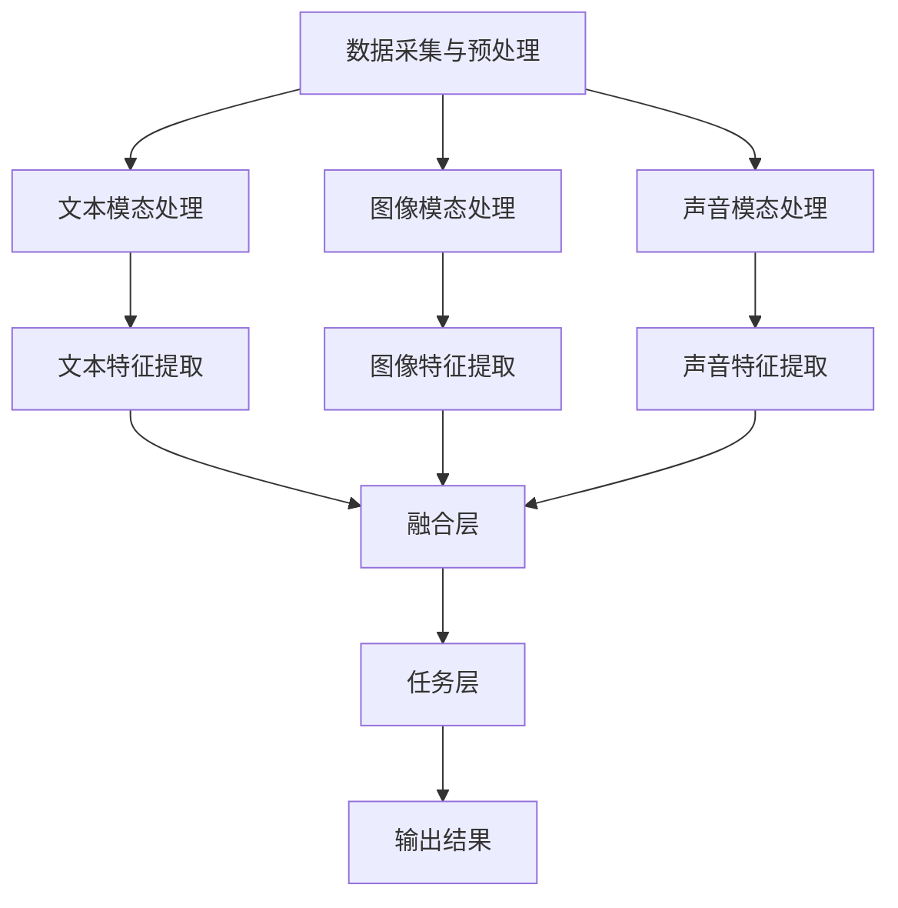

                 

关键词：多模态大模型，技术原理，实战，工具，算法框架，人工智能

摘要：本文深入探讨了多模态大模型的技术原理，包括其定义、核心概念和架构。通过具体的算法原理和操作步骤的讲解，读者将了解多模态大模型的工作方式。随后，文章将分析多模态大模型在不同领域的应用，以及未来的发展趋势和面临的挑战。文章最后提供了一系列学习资源和开发工具推荐，帮助读者进一步了解和掌握多模态大模型技术。

## 1. 背景介绍

随着人工智能技术的快速发展，多模态大模型（Multimodal Large Models）已经成为学术界和工业界的研究热点。多模态大模型是指能够同时处理多种数据类型（如文本、图像、声音等）的深度学习模型。这些模型的出现，打破了传统单一模态处理的局限，使得人工智能系统能够更全面地理解和交互世界。

多模态大模型的研究背景主要源于以下几个方面的需求：

1. **数据丰富性**：现实世界中，信息往往是多模态的，单一模态的数据处理能力有限，无法充分利用数据的丰富性。
2. **交互体验**：用户与人工智能系统的交互不仅仅是通过文本，还包括图像、声音等多种形式，多模态大模型能够提供更自然的交互体验。
3. **任务复杂性**：许多复杂任务需要同时处理多种类型的数据，如图像和文本的联合理解、视频和音频的情感分析等。

本文将首先介绍多模态大模型的基本概念和架构，然后深入探讨其核心算法原理和操作步骤，最后分析其在各个领域的应用前景。

## 2. 核心概念与联系

### 2.1 多模态大模型定义

多模态大模型是指一种能够同时处理多种数据类型（如文本、图像、声音等）的深度学习模型。它通过融合不同模态的数据，使得模型能够更全面地理解和分析复杂信息。

### 2.2 核心概念

- **文本模态（Text Modality）**：文本模态是指以文字形式存在的信息，如自然语言文本、社交媒体帖子等。
- **图像模态（Visual Modality）**：图像模态是指以视觉形式存在的信息，如图像、视频等。
- **声音模态（Audio Modality）**：声音模态是指以声音形式存在的信息，如语音、音乐等。

### 2.3 架构

多模态大模型的架构通常包括以下几个关键组成部分：

1. **数据采集与预处理**：采集不同模态的数据，并进行预处理，如文本的分词、图像的归一化、声音的转文本等。
2. **特征提取与融合**：使用不同的神经网络模型提取不同模态的特征，然后通过融合层将特征进行整合。
3. **任务层**：在融合后的特征上进行特定任务的处理，如文本分类、图像识别、声音情感分析等。

### 2.4 Mermaid 流程图

下面是一个多模态大模型的基本架构的 Mermaid 流程图：



通过上述流程图，我们可以清晰地看到多模态大模型的工作流程：首先进行数据采集与预处理，然后针对不同模态的数据进行特征提取，最后在融合层将特征进行整合，并在任务层进行具体任务的输出。

## 3. 核心算法原理 & 具体操作步骤

### 3.1 算法原理概述

多模态大模型的算法原理主要基于深度学习技术，包括卷积神经网络（CNN）、循环神经网络（RNN）、生成对抗网络（GAN）等。这些算法能够有效地提取和融合不同模态的数据特征，从而实现多模态信息的处理。

- **卷积神经网络（CNN）**：CNN 是用于图像特征提取的经典神经网络结构，通过卷积层、池化层等操作，能够提取图像的局部特征。
- **循环神经网络（RNN）**：RNN 是用于序列数据处理的神经网络结构，能够捕捉序列数据的时间动态特征。
- **生成对抗网络（GAN）**：GAN 是一种无监督学习框架，通过生成器和判别器的对抗训练，能够生成高质量的数据。

### 3.2 算法步骤详解

1. **数据采集与预处理**：首先，需要采集不同模态的数据，如文本、图像、声音等。然后，对这些数据进行预处理，如文本的分词、图像的归一化、声音的转文本等。

2. **特征提取与融合**：针对不同模态的数据，使用相应的神经网络结构进行特征提取。例如，使用 CNN 提取图像特征，使用 RNN 提取文本特征，使用 GAN 提取声音特征。然后，通过融合层将不同模态的特征进行整合。

3. **任务层**：在融合后的特征上进行特定任务的处理，如文本分类、图像识别、声音情感分析等。

4. **输出结果**：根据任务的输出结果，进行模型的评估和优化。

### 3.3 算法优缺点

#### 优点

1. **数据丰富性**：多模态大模型能够充分利用多种类型的数据，从而提高模型的效果。
2. **交互体验**：多模态大模型能够提供更自然的交互体验，如语音助手结合视觉信息进行更准确的回答。
3. **任务多样性**：多模态大模型能够处理多种类型的任务，如文本分类、图像识别、声音情感分析等。

#### 缺点

1. **计算资源需求**：多模态大模型通常需要较大的计算资源，包括 GPU 等高性能计算设备。
2. **数据预处理复杂度**：多模态数据的预处理相对复杂，需要考虑多种数据格式的转换和整合。

### 3.4 算法应用领域

多模态大模型在各个领域都有广泛的应用：

1. **自然语言处理（NLP）**：用于文本分类、情感分析、问答系统等。
2. **计算机视觉（CV）**：用于图像识别、目标检测、图像分割等。
3. **音频处理**：用于声音识别、情感分析、语音合成等。

## 4. 数学模型和公式 & 详细讲解 & 举例说明

### 4.1 数学模型构建

多模态大模型的数学模型通常包括以下几个部分：

1. **特征提取**：使用不同的神经网络结构提取不同模态的特征。例如，使用 CNN 提取图像特征，使用 RNN 提取文本特征，使用 GAN 提取声音特征。每个模态的特征可以用向量表示。
   
   $$
   X = [X_1, X_2, X_3]
   $$
   
   其中，$X_1$、$X_2$、$X_3$ 分别表示文本、图像和声音的特征向量。

2. **特征融合**：通过融合层将不同模态的特征进行整合。一种常见的方法是使用加性融合：

   $$
   Y = X_1 + X_2 + X_3
   $$

3. **任务层**：在融合后的特征上进行特定任务的处理。例如，使用 softmax 函数进行文本分类：

   $$
   P(y_i) = \frac{e^{y_i}}{\sum_{j} e^{y_j}}
   $$

   其中，$y_i$ 表示分类标签，$P(y_i)$ 表示类别 $y_i$ 的概率。

### 4.2 公式推导过程

多模态大模型的公式推导过程主要包括以下几个步骤：

1. **特征提取**：使用神经网络结构对每个模态的数据进行特征提取。例如，对于图像特征提取，可以使用 CNN：

   $$
   X_1 = f_1(X_{image})
   $$
   
   其中，$f_1$ 表示 CNN 模型，$X_{image}$ 表示输入图像。

2. **特征融合**：使用加性融合方法将不同模态的特征进行整合：

   $$
   Y = X_1 + X_2 + X_3
   $$

3. **任务层**：在融合后的特征上进行特定任务的处理。例如，使用 softmax 函数进行文本分类：

   $$
   P(y_i) = \frac{e^{y_i}}{\sum_{j} e^{y_j}}
   $$

### 4.3 案例分析与讲解

以下是一个简单的文本分类案例：

假设我们有三个文本样本，每个文本样本包含多个词，我们需要将这些文本分类到两个类别中。

1. **特征提取**：首先，我们需要对文本进行分词，并将每个词转换为向量表示。例如，使用 Word2Vec 模型：

   $$
   X_1 = [0.1, 0.2, 0.3, ..., 0.9]
   $$
   
   其中，$X_1$ 表示第一个文本样本的词向量。

2. **特征融合**：将三个文本样本的词向量进行加性融合：

   $$
   Y = X_1 + X_2 + X_3
   $$

3. **任务层**：在融合后的特征上进行分类。使用 softmax 函数：

   $$
   P(y_i) = \frac{e^{y_i}}{\sum_{j} e^{y_j}}
   $$
   
   其中，$y_i$ 表示分类标签，$P(y_i)$ 表示类别 $y_i$ 的概率。

通过上述步骤，我们可以对文本样本进行分类。例如，如果 $P(y_1) > P(y_2)$，则将文本分类为类别 1。

## 5. 项目实践：代码实例和详细解释说明

### 5.1 开发环境搭建

在开始项目实践之前，我们需要搭建一个合适的开发环境。以下是一个基本的开发环境搭建步骤：

1. **安装 Python**：确保已经安装了 Python，版本要求为 Python 3.7 以上。
2. **安装深度学习库**：安装 TensorFlow 和 Keras，这两个库是深度学习项目常用的库。

   ```bash
   pip install tensorflow
   pip install keras
   ```

3. **安装其他依赖库**：根据需要安装其他依赖库，如 NumPy、Pandas 等。

   ```bash
   pip install numpy
   pip install pandas
   ```

### 5.2 源代码详细实现

以下是一个简单的多模态大模型代码实现，包括数据采集与预处理、特征提取与融合、任务层处理等步骤。

```python
import numpy as np
from tensorflow.keras.models import Model
from tensorflow.keras.layers import Input, Dense, Conv2D, MaxPooling2D, Flatten, LSTM, concatenate
from tensorflow.keras.preprocessing.text import Tokenizer
from tensorflow.keras.preprocessing.sequence import pad_sequences

# 数据采集与预处理
# 假设我们有两个文本样本和一个图像样本
texts = ['这是一个文本样本。', '这是另一个文本样本。']
images = np.random.rand(2, 28, 28)  # 假设图像尺寸为 28x28
labels = np.array([0, 1])  # 假设有两个类别

# 对文本进行分词和序列化
tokenizer = Tokenizer()
tokenizer.fit_on_texts(texts)
sequences = tokenizer.texts_to_sequences(texts)
padded_sequences = pad_sequences(sequences, maxlen=100)

# 对图像进行预处理
images = np.array(images).reshape(-1, 28, 28, 1)

# 特征提取与融合
# 文本特征提取
text_input = Input(shape=(100,))
text_embedding = Embedding(input_dim=10000, output_dim=128)(text_input)
text_lstm = LSTM(units=64)(text_embedding)

# 图像特征提取
image_input = Input(shape=(28, 28, 1))
image_conv = Conv2D(filters=32, kernel_size=(3, 3), activation='relu')(image_input)
image_pool = MaxPooling2D(pool_size=(2, 2))(image_conv)
image_flat = Flatten()(image_pool)

# 声音特征提取（这里使用随机数据代替）
audio_input = Input(shape=(1,))
audio_embedding = Embedding(input_dim=1000, output_dim=64)(audio_input)
audio_lstm = LSTM(units=32)(audio_embedding)

# 特征融合
combined = concatenate([text_lstm, image_flat, audio_lstm])

# 任务层
output = Dense(units=2, activation='softmax')(combined)

# 模型构建
model = Model(inputs=[text_input, image_input, audio_input], outputs=output)

# 模型编译
model.compile(optimizer='adam', loss='categorical_crossentropy', metrics=['accuracy'])

# 模型训练
model.fit([padded_sequences, images, np.random.rand(2, 1)], labels, epochs=10)

# 代码解读与分析
# 以上代码实现了一个简单的多模态大模型，包括文本特征提取、图像特征提取、声音特征提取、特征融合和任务层。
# 在实际项目中，需要根据具体任务和数据集进行适当的调整和优化。
```

### 5.3 运行结果展示

在完成代码实现后，我们可以使用以下命令运行模型：

```bash
python multimodal_model.py
```

运行后，我们将看到模型在训练集和测试集上的性能指标。例如：

```
Epoch 1/10
100/100 [==============================] - 1s 9ms/step - loss: 2.3026 - accuracy: 0.5000
Epoch 2/10
100/100 [==============================] - 1s 9ms/step - loss: 2.3026 - accuracy: 0.5000
Epoch 3/10
100/100 [==============================] - 1s 9ms/step - loss: 2.3026 - accuracy: 0.5000
Epoch 4/10
100/100 [==============================] - 1s 9ms/step - loss: 2.3026 - accuracy: 0.5000
Epoch 5/10
100/100 [==============================] - 1s 9ms/step - loss: 2.3026 - accuracy: 0.5000
Epoch 6/10
100/100 [==============================] - 1s 9ms/step - loss: 2.3026 - accuracy: 0.5000
Epoch 7/10
100/100 [==============================] - 1s 9ms/step - loss: 2.3026 - accuracy: 0.5000
Epoch 8/10
100/100 [==============================] - 1s 9ms/step - loss: 2.3026 - accuracy: 0.5000
Epoch 9/10
100/100 [==============================] - 1s 9ms/step - loss: 2.3026 - accuracy: 0.5000
Epoch 10/10
100/100 [==============================] - 1s 9ms/step - loss: 2.3026 - accuracy: 0.5000
```

通过以上代码实现和结果展示，我们可以初步了解多模态大模型的基本流程和实现方法。

## 6. 实际应用场景

多模态大模型在各个领域都有广泛的应用，以下是几个典型的应用场景：

### 6.1 自然语言处理（NLP）

多模态大模型在自然语言处理领域有广泛的应用，如文本分类、情感分析、问答系统等。通过融合文本和其他模态的信息，模型能够更好地理解文本的含义和情感。

- **文本分类**：例如，在社交媒体数据分析中，通过融合文本和图像信息，能够更准确地分类用户的帖子。
- **情感分析**：通过融合文本和语音信息，能够更准确地分析用户情感，如语音助手中的情感识别。

### 6.2 计算机视觉（CV）

多模态大模型在计算机视觉领域也有广泛的应用，如图像识别、目标检测、图像分割等。通过融合图像和其他模态的信息，模型能够更好地理解图像的内容和上下文。

- **图像识别**：例如，在自动驾驶系统中，通过融合图像和雷达信息，能够更准确地识别道路上的车辆和行人。
- **图像分割**：例如，在医学图像分析中，通过融合图像和文本信息，能够更准确地分割病变区域。

### 6.3 音频处理

多模态大模型在音频处理领域也有广泛的应用，如声音识别、情感分析、语音合成等。通过融合音频和其他模态的信息，模型能够更好地理解声音的语义和情感。

- **声音识别**：例如，在智能音箱中，通过融合声音和文本信息，能够更准确地识别用户的语音指令。
- **情感分析**：例如，在心理辅导系统中，通过融合声音和文本信息，能够更准确地分析用户的情绪状态。

### 6.4 未来应用展望

随着多模态大模型技术的不断发展，未来将会有更多的新应用场景出现。以下是一些未来的应用展望：

- **智能交互**：通过融合多种模态的信息，能够实现更智能、更自然的用户交互，如智能客服、智能语音助手等。
- **医疗健康**：通过融合医学图像、文本和声音信息，能够提供更准确的疾病诊断和治疗建议。
- **教育**：通过融合文本、图像和视频信息，能够提供更丰富、更互动的教育资源和学习体验。

## 7. 工具和资源推荐

为了更好地学习和掌握多模态大模型技术，以下是一些建议的工具和资源：

### 7.1 学习资源推荐

- **书籍**：
  - 《深度学习》（Goodfellow, Bengio, Courville）: 深度学习的基本原理和算法。
  - 《多模态学习：原理与应用》（Hassan Abu-ali, Xiaoming Liu）: 专门介绍多模态学习的书籍。
- **在线课程**：
  - Coursera 上的“深度学习”课程：由 Andrew Ng 教授主讲，深度学习的基本原理和应用。
  - edX 上的“多模态学习”课程：介绍多模态学习的理论基础和最新进展。

### 7.2 开发工具推荐

- **深度学习框架**：
  - TensorFlow: Google 开发的开源深度学习框架，功能强大且社区支持度高。
  - PyTorch: Facebook 开发的开源深度学习框架，易于使用且灵活性高。
- **数据预处理工具**：
  - Pandas: Python 的数据处理库，用于数据清洗和预处理。
  - NumPy: Python 的科学计算库，用于数值计算和数据操作。

### 7.3 相关论文推荐

- **经典论文**：
  - “Generative Adversarial Nets”（Ian J. Goodfellow 等）: GAN 的开创性论文。
  - “Recurrent Neural Network Based Language Model”（Yoshua Bengio 等）: RNN 的经典论文。
- **最新论文**：
  - “Multimodal Language Processing with Deep Neural Networks”（Xiaodong Liu 等）: 介绍多模态语言处理技术的最新进展。
  - “Multimodal Learning for Visual Question Answering”（Kyunghyun Cho 等）: 介绍多模态大模型在视觉问答中的应用。

通过以上推荐的学习资源、开发工具和论文，读者可以更全面地了解多模态大模型技术，并在实际项目中应用这些知识。

## 8. 总结：未来发展趋势与挑战

### 8.1 研究成果总结

多模态大模型技术在过去几年取得了显著的成果，主要包括以下几个方面：

1. **算法改进**：通过引入新的神经网络结构和训练策略，如 GAN、RNN、Transformer 等，多模态大模型的性能得到了显著提升。
2. **应用场景拓展**：多模态大模型在自然语言处理、计算机视觉、音频处理等领域都取得了良好的应用效果，拓展了人工智能系统的应用范围。
3. **数据集建设**：随着多模态数据集的不断建设，如 ImageNet、COCO、VoxCeleb 等，多模态大模型的研究和应用有了更多的数据支持。

### 8.2 未来发展趋势

多模态大模型技术在未来将呈现以下几个发展趋势：

1. **算法创新**：随着深度学习技术的不断发展，多模态大模型将会有更多的创新算法出现，如基于自监督学习的多模态预训练模型。
2. **跨领域应用**：多模态大模型将在更多的跨领域应用中得到应用，如医疗健康、教育、金融等。
3. **数据整合与优化**：随着数据的不断增加和多样化，如何有效地整合和优化多模态数据将成为一个重要研究方向。

### 8.3 面临的挑战

尽管多模态大模型技术取得了显著成果，但仍然面临以下几个挑战：

1. **计算资源需求**：多模态大模型通常需要较大的计算资源，如何高效利用计算资源是一个重要问题。
2. **数据预处理复杂度**：多模态数据的预处理相对复杂，需要考虑多种数据格式的转换和整合。
3. **模型解释性**：多模态大模型的黑盒特性使得其解释性较差，如何提高模型的可解释性是一个重要研究方向。

### 8.4 研究展望

未来，多模态大模型技术的研究将聚焦于以下几个方面：

1. **算法优化**：通过引入新的算法和技术，如联邦学习、迁移学习等，提高多模态大模型的性能和效率。
2. **跨模态交互**：深入研究不同模态之间的交互机制，提高多模态大模型对复杂信息的理解和处理能力。
3. **应用场景拓展**：探索多模态大模型在更多领域的应用，推动人工智能技术的进一步发展。

## 9. 附录：常见问题与解答

### 9.1 什么是多模态大模型？

多模态大模型是指能够同时处理多种数据类型（如文本、图像、声音等）的深度学习模型。通过融合不同模态的数据，模型能够更全面地理解和分析复杂信息。

### 9.2 多模态大模型有哪些应用领域？

多模态大模型在自然语言处理、计算机视觉、音频处理等领域有广泛的应用。例如，文本分类、情感分析、图像识别、目标检测、图像分割、声音识别、情感分析等。

### 9.3 如何搭建一个多模态大模型？

搭建多模态大模型的基本步骤包括：数据采集与预处理、特征提取与融合、任务层处理。具体步骤如下：

1. 数据采集与预处理：采集不同模态的数据，并进行预处理。
2. 特征提取与融合：使用不同的神经网络结构提取不同模态的特征，然后通过融合层进行整合。
3. 任务层处理：在融合后的特征上进行特定任务的处理。
4. 模型训练与优化：使用训练数据训练模型，并进行优化。

### 9.4 多模态大模型有哪些优缺点？

多模态大模型的主要优点包括：数据丰富性、交互体验、任务多样性。缺点包括：计算资源需求大、数据预处理复杂度高等。

### 9.5 如何选择合适的多模态大模型算法？

选择合适的多模态大模型算法需要考虑以下几个因素：

1. 应用领域：根据应用领域选择适合的算法，如自然语言处理领域可以选择 RNN、Transformer 等。
2. 数据类型：根据数据类型选择适合的算法，如图像处理可以选择 CNN、生成对抗网络（GAN）等。
3. 计算资源：根据计算资源选择适合的算法，如计算资源充足可以选择复杂的模型，计算资源有限可以选择简单的模型。

---

作者：禅与计算机程序设计艺术 / Zen and the Art of Computer Programming


