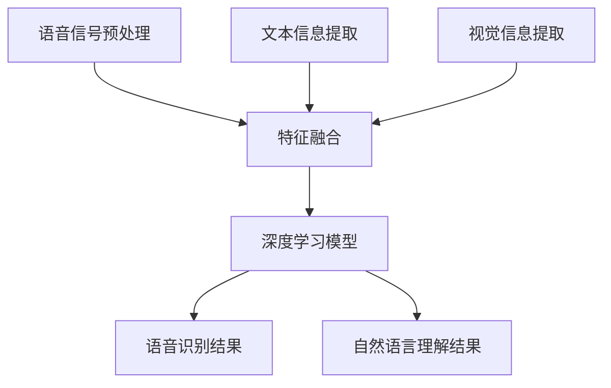
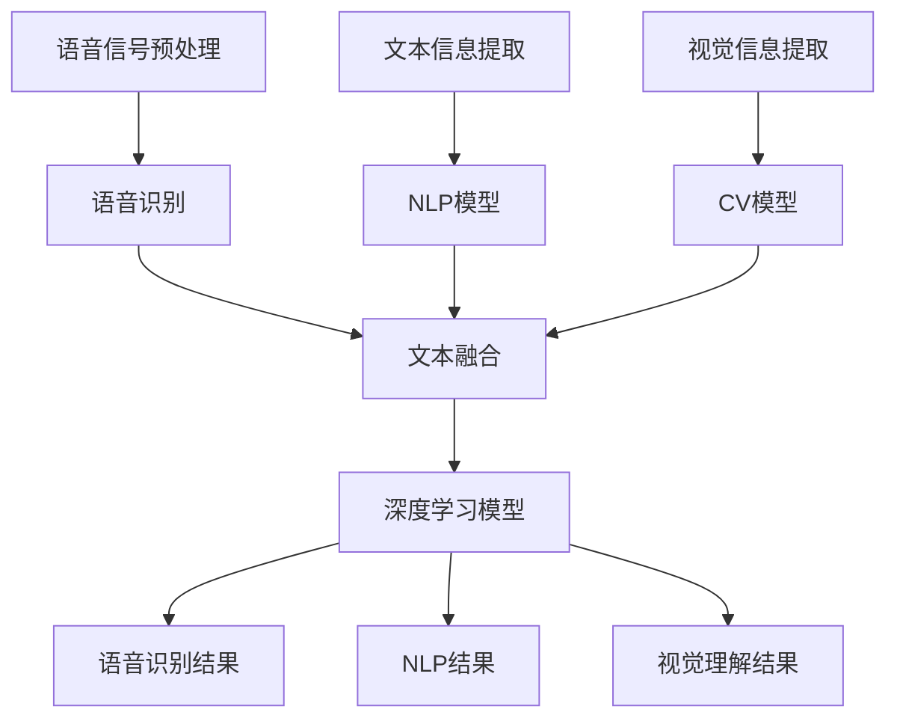

                 

### 背景介绍 Background

多模态大模型近年来在人工智能领域取得了显著进展，成为实现人类智能的关键技术之一。语音多模态技术作为多模态大模型的重要组成部分，使得人工智能系统能够更加全面地理解和交互人类语言。本文旨在系统地介绍语音多模态技术的技术原理、数学模型、项目实践以及未来应用展望。

语音多模态技术通过结合语音信号、文本信息、视觉信息等多种数据来源，实现对人类语音内容的深度理解和交互。这种技术不仅提升了自然语言处理（NLP）的性能，还为语音助手、智能客服、语音识别等领域带来了突破性进展。随着大数据、云计算和深度学习技术的不断成熟，语音多模态技术逐渐成为学术界和工业界关注的焦点。

本文将从以下几个方面展开：

1. 背景介绍：概述多模态大模型和语音多模态技术的重要性。
2. 核心概念与联系：介绍多模态大模型的核心概念和架构，以及语音多模态技术与其他技术的联系。
3. 核心算法原理与具体操作步骤：详细阐述语音多模态技术的算法原理和操作步骤。
4. 数学模型和公式：介绍语音多模态技术的数学模型和公式，并进行详细讲解和举例说明。
5. 项目实践：通过代码实例展示语音多模态技术的实际应用。
6. 实际应用场景：分析语音多模态技术的应用场景和未来发展趋势。
7. 工具和资源推荐：推荐相关学习资源和开发工具。
8. 总结与展望：总结研究成果，探讨未来发展趋势与挑战。

### 文章关键词 Keywords

多模态大模型，语音多模态技术，深度学习，自然语言处理，文本融合，视觉信息，语音识别，人工智能。

### 文章摘要 Abstract

本文系统地介绍了多模态大模型中的语音多模态技术。首先，我们概述了多模态大模型和语音多模态技术在人工智能领域的重要性。接着，我们详细阐述了语音多模态技术的核心概念、算法原理、数学模型以及项目实践。最后，我们分析了语音多模态技术的实际应用场景，探讨了未来发展趋势与挑战。通过本文的阅读，读者可以全面了解语音多模态技术的核心内容及其应用潜力。

### 1. 背景介绍 Introduction

多模态大模型和多模态学习已经成为人工智能领域的研究热点。随着人类对信息获取和处理需求的不断提高，传统的单模态人工智能系统已经难以满足复杂任务的要求。多模态大模型通过结合多种数据源（如语音、文本、视觉等），能够更加全面地理解和交互人类信息。语音多模态技术作为多模态大模型的重要组成部分，近年来取得了显著进展。

语音多模态技术的研究始于20世纪80年代，当时语音识别和文本理解技术逐渐成熟，研究者开始探索如何将语音信号与文本信息相结合，以提高语音识别和自然语言理解的性能。随着深度学习和大数据技术的不断发展，语音多模态技术逐渐成为人工智能领域的研究热点。目前，语音多模态技术已经在语音助手、智能客服、语音识别等领域取得了重要应用。

语音多模态技术的重要性体现在以下几个方面：

1. **提高语音识别准确性**：通过结合语音信号和文本信息，可以消除语音信号中的噪声，提高语音识别的准确性。
2. **增强自然语言理解能力**：语音多模态技术能够更好地捕捉人类语言的上下文和情感，从而提高自然语言理解的能力。
3. **提升用户交互体验**：通过语音多模态技术，人工智能系统能够更好地理解用户的意图，提供更加个性化的服务，从而提升用户交互体验。
4. **拓展应用领域**：语音多模态技术为智能客服、语音助手、智能家居等领域带来了新的可能性，推动了人工智能技术的应用创新。

本文将首先介绍多模态大模型的核心概念和架构，然后详细阐述语音多模态技术的工作原理、算法步骤、数学模型以及项目实践，最后分析语音多模态技术的应用场景和未来发展趋势。

#### 1.1 多模态大模型概述

多模态大模型是指结合多种数据来源（如文本、语音、图像、视频等）的大型深度学习模型，通过共同学习和共享特征表示，实现对复杂任务的深度理解和交互。多模态大模型的基本思想是将不同模态的数据进行融合，从而充分利用不同数据源的信息，提高任务性能。

多模态大模型的关键特点是：

1. **数据融合**：多模态大模型通过数据融合技术，将不同模态的数据进行整合，提取出共同的特征表示。
2. **共享特征表示**：多模态大模型中的不同模态数据共享相同的特征表示，从而实现了跨模态的信息传递和交互。
3. **深度学习架构**：多模态大模型通常采用深度神经网络架构，利用多层神经元的非线性变换，实现对数据的深度学习和特征提取。

多模态大模型的主要架构包括：

1. **编码器**：编码器负责将不同模态的数据编码为高维特征向量。不同模态的编码器通常具有不同的网络结构和参数，但它们共享相同的特征空间。
2. **融合器**：融合器负责将不同模态的特征向量进行融合，生成统一的全局特征表示。常见的融合方法包括求和、平均、拼接等。
3. **解码器**：解码器负责将全局特征表示解码为任务相关的输出，如文本、语音、图像等。

多模态大模型的主要工作流程包括：

1. **数据预处理**：对输入的多模态数据进行预处理，如语音信号降噪、文本分词、图像增强等。
2. **特征编码**：利用编码器对多模态数据分别进行编码，生成特征向量。
3. **特征融合**：利用融合器将不同模态的特征向量进行融合，生成全局特征表示。
4. **任务输出**：利用解码器将全局特征表示解码为任务相关的输出。

多模态大模型的核心优势在于：

1. **提高任务性能**：通过融合不同模态的信息，多模态大模型能够更好地捕捉复杂任务中的上下文和细节，从而提高任务性能。
2. **增强泛化能力**：多模态大模型通过共享特征表示和跨模态信息传递，实现了跨模态的泛化能力，能够适应不同的任务和应用场景。

然而，多模态大模型也面临一些挑战：

1. **计算资源消耗**：多模态大模型通常具有大量的参数和复杂的网络结构，需要大量的计算资源和存储空间。
2. **数据标注需求**：多模态大模型需要对不同模态的数据进行标注，数据标注的工作量大，成本高。
3. **算法优化**：多模态大模型需要针对不同模态的特征进行有效的融合和优化，以实现最佳性能。

总之，多模态大模型为人工智能领域带来了新的机遇和挑战。通过深入研究和优化，多模态大模型有望在未来实现更加智能和高效的人工智能系统。

#### 1.2 语音多模态技术

语音多模态技术是指利用语音信号、文本信息、视觉信息等多种数据源，实现对人类语音内容的深度理解和交互。语音多模态技术的基本原理是通过多种数据源的协同作用，提高语音识别和自然语言理解的性能。

语音多模态技术的核心思想可以概括为：

1. **数据融合**：将语音信号、文本信息、视觉信息等多种数据源进行融合，提取出共同的特征表示。
2. **特征共享**：不同数据源的特征向量共享相同的特征空间，从而实现跨模态的信息传递和交互。
3. **深度学习**：利用深度神经网络架构，对融合后的特征进行深度学习和特征提取。

语音多模态技术的工作流程主要包括以下几个步骤：

1. **语音信号预处理**：对输入的语音信号进行预处理，包括降噪、分帧、特征提取等操作，得到语音特征向量。
2. **文本信息提取**：从语音信号对应的文本信息中提取特征，如词向量、句法特征等。
3. **视觉信息提取**：从语音场景中的视觉信息中提取特征，如面部表情、动作等。
4. **特征融合**：将语音特征向量、文本特征向量、视觉特征向量进行融合，生成全局特征表示。
5. **深度学习**：利用深度学习模型，对全局特征进行深度学习和特征提取，实现语音识别和自然语言理解。
6. **任务输出**：根据任务需求，将深度学习模型的输出转换为任务相关的结果，如语音识别结果、文本生成等。

为了更好地展示语音多模态技术的核心概念和架构，我们可以使用Mermaid流程图进行描述。以下是语音多模态技术的Mermaid流程图：

在上述流程图中，A、C、D分别表示语音信号预处理、文本信息提取和视觉信息提取，这些步骤用于提取不同数据源的特征。B表示特征融合，将不同数据源的特征向量进行整合。E表示深度学习模型，用于对融合后的特征进行深度学习和特征提取。F和G分别表示语音识别结果和自然语言理解结果，根据任务需求输出相关结果。

通过上述流程，语音多模态技术能够充分利用语音信号、文本信息、视觉信息等多种数据源，实现对人类语音内容的深度理解和交互。

#### 1.3 语音多模态技术与其他技术的联系

语音多模态技术作为多模态大模型的重要组成部分，与其他技术密切相关，包括语音识别、自然语言处理（NLP）和计算机视觉等领域。这些技术共同构成了一个多层次的、协同工作的系统，以实现对人类语音内容的全面理解和交互。

首先，语音识别（Automatic Speech Recognition, ASR）是语音多模态技术的基础。语音识别技术通过将语音信号转换为文本信息，是实现语音理解和交互的第一步。在语音多模态技术中，语音识别的输出作为文本信息的一部分，与其他数据源（如视觉信息）进行融合，以提升整体系统的性能。

自然语言处理（Natural Language Processing, NLP）是语音多模态技术的核心组成部分。NLP技术用于理解和生成自然语言，包括词法分析、句法分析、语义分析等。在语音多模态技术中，文本信息提取和自然语言理解是实现语音内容深度理解的关键步骤。通过结合语音识别输出的文本信息和视觉信息，NLP技术能够更好地捕捉语音内容的上下文、情感和意图。

计算机视觉（Computer Vision, CV）是语音多模态技术的重要补充。计算机视觉技术通过分析和理解图像和视频数据，提取视觉特征，如面部表情、姿态、动作等。这些视觉特征可以与语音信号和文本信息进行融合，以提供更丰富的语义信息。例如，在语音助手应用中，通过分析用户的面部表情和肢体动作，可以更好地理解用户的情感状态和意图，从而提供更加个性化的服务。

为了更好地展示语音多模态技术与其他技术的联系，我们可以使用Mermaid流程图进行描述。以下是语音多模态技术与其他技术之间的联系和协作：

在上述流程图中，A表示语音信号预处理，B表示语音识别，C表示文本信息提取，E表示视觉信息提取。这些步骤分别对应语音识别、NLP和计算机视觉领域的基本任务。D表示NLP模型，F表示CV模型，它们分别用于处理文本信息和视觉信息。G表示文本融合，将语音识别输出的文本信息和NLP、CV模型提取的特征进行整合。H表示深度学习模型，对融合后的特征进行深度学习和特征提取。I、J和K分别表示语音识别结果、NLP结果和视觉理解结果，根据任务需求输出相关结果。

通过上述流程，语音多模态技术能够充分利用语音识别、NLP和计算机视觉等领域的技术优势，实现对人类语音内容的全面理解和交互。

#### 2. 核心算法原理与具体操作步骤

语音多模态技术的核心在于如何有效地融合多种数据源，实现语音内容的深度理解和交互。在这一节中，我们将详细阐述语音多模态技术的核心算法原理和具体操作步骤。

##### 2.1 算法原理概述

语音多模态技术的核心算法主要包括语音信号处理、文本信息提取、视觉信息提取以及特征融合和深度学习模型。以下是对这些算法原理的概述：

1. **语音信号处理**：语音信号处理主要包括语音信号的预处理、特征提取和声音识别。语音信号预处理包括降噪、分帧、加窗等操作，以消除噪声和提高信号质量。特征提取通常采用梅尔频率倒谱系数（MFCC）、隐马尔可夫模型（HMM）等传统方法，或使用深度学习模型如卷积神经网络（CNN）进行特征提取。声音识别则是将处理后的语音信号转换为文本信息。

2. **文本信息提取**：文本信息提取主要涉及文本预处理、词向量表示和句法分析。文本预处理包括分词、去停用词、词性标注等操作，以提取有用的信息。词向量表示如Word2Vec、GloVe等，用于将文本转换为数值表示。句法分析则用于理解文本的语法结构和语义关系。

3. **视觉信息提取**：视觉信息提取包括面部表情识别、姿态估计和动作识别等。面部表情识别通过分析面部图像，识别用户的情感状态。姿态估计通过计算机视觉技术，估计用户的空间姿态和动作。动作识别则用于识别用户的动作行为。

4. **特征融合**：特征融合是将语音信号处理、文本信息提取和视觉信息提取得到的特征进行融合，生成统一的全局特征表示。常见的特征融合方法包括求和、平均、拼接等。融合后的特征表示可以更好地捕捉语音内容的上下文、情感和意图。

5. **深度学习模型**：深度学习模型用于对融合后的特征进行深度学习和特征提取。常见的深度学习模型包括卷积神经网络（CNN）、循环神经网络（RNN）、长短时记忆网络（LSTM）等。深度学习模型通过多层神经元的非线性变换，实现对语音内容的深度理解和交互。

##### 2.2 算法步骤详解

以下是语音多模态技术的具体操作步骤：

1. **语音信号预处理**：
   - 对输入的语音信号进行降噪处理，消除背景噪声。
   - 对语音信号进行分帧和加窗处理，将连续的语音信号划分为短时片段。
   - 对每个帧进行傅里叶变换（FFT），提取语音信号的频谱特征。

2. **语音特征提取**：
   - 使用梅尔频率倒谱系数（MFCC）提取语音信号的时频特征。
   - 使用深度学习模型（如CNN）提取更高层次的语音特征。

3. **文本信息提取**：
   - 对输入的文本信息进行预处理，如分词、去停用词、词性标注等。
   - 使用词向量模型（如Word2Vec、GloVe）将文本信息转换为数值表示。

4. **视觉信息提取**：
   - 使用面部表情识别技术，分析输入图像中的面部表情。
   - 使用姿态估计技术，估计用户的空间姿态和动作。
   - 使用动作识别技术，识别用户的动作行为。

5. **特征融合**：
   - 将语音特征、文本特征和视觉特征进行拼接或融合，生成全局特征表示。

6. **深度学习模型训练**：
   - 使用深度学习模型（如LSTM、CNN）对融合后的特征进行训练。
   - 调整模型参数，优化模型性能。

7. **语音识别和自然语言理解**：
   - 使用训练好的深度学习模型，对输入的语音信号进行识别，生成文本信息。
   - 使用自然语言处理模型，对生成的文本信息进行理解，提取语义信息。

##### 2.3 算法优缺点

1. **优点**：
   - 提高语音识别和自然语言理解性能：通过融合多种数据源，语音多模态技术能够更好地捕捉语音内容的上下文、情感和意图，从而提高语音识别和自然语言理解的性能。
   - 增强用户交互体验：语音多模态技术能够更好地理解用户的意图，提供更加个性化的服务，从而增强用户交互体验。
   - 拓展应用领域：语音多模态技术为语音助手、智能客服、语音识别等领域带来了新的可能性，推动了人工智能技术的应用创新。

2. **缺点**：
   - 计算资源消耗大：多模态大模型通常具有大量的参数和复杂的网络结构，需要大量的计算资源和存储空间。
   - 数据标注需求高：多模态大模型需要对不同模态的数据进行标注，数据标注的工作量大，成本高。
   - 算法优化难度大：多模态大模型需要针对不同模态的特征进行有效的融合和优化，以实现最佳性能。

##### 2.4 算法应用领域

语音多模态技术广泛应用于语音助手、智能客服、语音识别、智能家居等领域。以下是一些典型的应用场景：

1. **语音助手**：语音助手通过语音多模态技术，能够更好地理解用户的指令和意图，提供更加个性化的服务。例如，在智能音箱中，语音多模态技术可以识别用户的语音命令，理解用户的需求，并调用相应的服务。

2. **智能客服**：智能客服系统通过语音多模态技术，能够更好地理解客户的提问和需求，提供更加精准和高效的客服服务。例如，在电话客服中，语音多模态技术可以分析客户的声音和语言特征，识别客户的情绪和意图，从而提供更加合适的解决方案。

3. **语音识别**：语音识别系统通过语音多模态技术，能够提高识别的准确性和鲁棒性。例如，在会议记录、语音转录等场景中，语音多模态技术可以结合语音信号和文本信息，提高识别的准确性和效率。

4. **智能家居**：智能家居系统通过语音多模态技术，能够更好地理解和响应用户的指令，提供更加智能和便捷的家居体验。例如，在智能音箱中，语音多模态技术可以识别用户的语音指令，控制家居设备的开关、调节温度等。

总之，语音多模态技术通过结合多种数据源，实现对语音内容的深度理解和交互，为人工智能应用带来了新的机遇和挑战。随着技术的不断发展和优化，语音多模态技术将在更多的应用领域中发挥重要作用。

### 3.1 语音信号处理与特征提取

语音信号处理与特征提取是语音多模态技术中的关键步骤，它们直接影响语音识别和自然语言理解的性能。在这一部分，我们将详细探讨语音信号处理的基本流程、常用的特征提取方法，并介绍如何结合深度学习方法进行语音信号的预处理和特征提取。

#### 3.1.1 语音信号预处理

语音信号预处理是语音信号处理的第一步，其目的是减少噪声、提高信号质量，从而为后续的特征提取和语音识别奠定基础。以下是一些常见的语音信号预处理方法：

1. **噪声消除**：
   - **滤波器**：使用滤波器（如低通滤波器、带通滤波器）去除高频噪声或特定频段的噪声。
   - **短时傅里叶变换（STFT）**：通过短时傅里叶变换将语音信号分解为短时频谱，然后对频谱进行滤波处理，去除噪声。

2. **分帧与加窗**：
   - **分帧**：将连续的语音信号划分为多个短时片段（帧），以便进行后续的特征提取。
   - **加窗**：对每帧语音信号进行加窗处理，常用的窗函数有汉明窗、汉宁窗等，以减少边缘效应。

3. **增强语音信号**：
   - **归一化**：将语音信号的能量进行归一化处理，以消除不同说话人、说话环境之间的差异。
   - **共振峰增强**：通过增强共振峰，提高语音信号的可听度和清晰度。

#### 3.1.2 常用的特征提取方法

特征提取是语音信号处理的核心步骤，它将原始语音信号转换为可用于模型训练和识别的数值特征。以下是一些常用的特征提取方法：

1. **时域特征**：
   - **短时能量和短时过零率**：短时能量表示语音信号的强度，短时过零率表示语音信号的活跃程度。
   - **短时傅里叶变换（STFT）**：通过STFT将语音信号分解为频谱特征，常用的频域特征有频谱幅度、频谱中心频率等。

2. **频域特征**：
   - **梅尔频率倒谱系数（MFCC）**：MFCC是一种基于人耳听觉特性的频域特征，通过将傅里叶变换的频谱能量转换到梅尔频域，然后进行对数变换和倒谱变换，得到一组MFCC系数。
   - **频谱相关特征**：频谱相关特征通过计算频谱的互相关性，捕捉语音信号的时频变化特征。

3. **滤波器组特征**：
   - **滤波器组（Filter Banks）**：使用滤波器组对语音信号进行分解，每个滤波器输出一个频带内的特征，常用的滤波器组有汉明滤波器组、汉宁滤波器组等。

#### 3.1.3 深度学习在语音信号预处理和特征提取中的应用

随着深度学习技术的不断发展，越来越多的深度学习方法被应用于语音信号预处理和特征提取。以下是一些常用的深度学习模型和方法：

1. **卷积神经网络（CNN）**：
   - **卷积操作**：CNN通过卷积操作提取语音信号中的局部特征，适用于处理时变信号。
   - **池化操作**：通过池化操作减少特征维度，提高模型泛化能力。

2. **循环神经网络（RNN）**：
   - **循环操作**：RNN适用于处理序列数据，通过循环操作捕捉语音信号的时序特征。
   - **长短时记忆（LSTM）网络**：LSTM网络通过引入门控机制，有效解决长序列依赖问题。

3. **自注意力机制（Self-Attention）**：
   - **自注意力机制**：通过自注意力机制，模型能够自动关注语音信号中的重要特征，提高特征提取的效果。

4. **生成对抗网络（GAN）**：
   - **生成模型**：GAN通过生成模型和判别模型的对抗训练，提高语音信号的特征表达能力。

#### 3.1.4 案例分析

以下是一个基于深度学习的语音信号预处理和特征提取的案例：

- **数据集**：使用公开的语音数据集，如TIMIT或LibriSpeech。
- **预处理**：对语音信号进行降噪、分帧、加窗处理，去除背景噪声，提高信号质量。
- **特征提取**：使用CNN提取语音信号的频谱特征，通过卷积操作和池化操作，得到一组频谱特征向量。
- **模型训练**：使用LSTM网络对频谱特征进行训练，通过循环操作捕捉语音信号的时序特征，实现语音信号的时频特征融合。

通过上述案例，我们可以看到深度学习在语音信号预处理和特征提取中的应用，以及如何结合多种特征提取方法，提高语音识别和自然语言理解的性能。

#### 3.2 文本信息提取与处理

文本信息提取与处理是语音多模态技术中的关键环节，它直接影响语音识别和自然语言理解的效果。在这一部分，我们将详细探讨文本信息提取的基本方法、常见的文本特征提取技术，并介绍如何结合深度学习进行文本信息处理。

##### 3.2.1 文本信息提取方法

文本信息提取是指从原始文本数据中提取出对语音多模态任务有用的信息。以下是一些常用的文本信息提取方法：

1. **分词**：将连续的文本序列分割成单个词语，这是自然语言处理的基本步骤。常见的分词算法包括基于词典的分词、基于统计的分词和基于字符的分词。

2. **词性标注**：对文本中的每个词语进行词性标注，如名词、动词、形容词等。词性标注有助于理解文本的语法结构和语义关系。

3. **实体识别**：识别文本中的特定实体，如人名、地名、组织名等。实体识别是文本信息提取的重要任务，有助于理解文本内容。

4. **情感分析**：通过情感词典、文本分类模型等方法，分析文本的情感倾向，如积极、消极、中性等。

##### 3.2.2 文本特征提取技术

文本特征提取是将文本数据转换为机器学习模型可以处理的数值特征。以下是一些常用的文本特征提取技术：

1. **词袋模型（Bag of Words, BoW）**：将文本表示为词袋，即不考虑词的顺序，只考虑文本中出现的词及其频率。词袋模型适用于简单的文本分类任务。

2. **TF-IDF（Term Frequency-Inverse Document Frequency）**：TF-IDF是一种更为精细的词袋模型，通过考虑词在文档中的频率和在整个文档集合中的分布，提高特征的重要性。

3. **词嵌入（Word Embedding）**：词嵌入是将文本中的词语映射到高维向量空间，常用的词嵌入模型包括Word2Vec、GloVe和BERT等。词嵌入能够捕捉词语的语义信息，是深度学习模型的基础。

4. **词性嵌入（Part-of-Speech Embedding）**：将文本中的词性映射到高维向量空间，有助于理解文本的语法结构和语义关系。

5. **句法特征**：通过句法分析提取文本的句法特征，如句法树的叶节点、路径长度等。句法特征有助于理解文本的结构和语义。

##### 3.2.3 深度学习在文本信息提取中的应用

随着深度学习技术的发展，越来越多的深度学习模型被应用于文本信息提取与处理。以下是一些常用的深度学习模型和应用：

1. **循环神经网络（RNN）**：RNN适用于处理序列数据，通过循环操作捕捉文本的时序特征。RNN包括LSTM和GRU等变种，能够有效处理长序列依赖问题。

2. **变换器（Transformer）**：Transformer模型通过自注意力机制，在处理文本序列时能够自动关注重要特征。BERT和GPT等模型是基于Transformer的代表性工作。

3. **预训练与微调**：预训练模型（如BERT、GPT）在大规模语料库上预训练，然后通过微调适应特定的任务，能够显著提升文本信息提取的准确性和效果。

4. **多模态深度学习**：结合语音特征和文本特征，使用多模态深度学习模型（如联合编码器-解码器模型）进行文本信息提取与处理，能够更好地捕捉语音和文本之间的关联。

##### 3.2.4 案例分析

以下是一个基于深度学习的文本信息提取与处理的案例：

- **数据集**：使用公开的文本数据集，如IMDB影评数据集。
- **预处理**：对文本进行分词、词性标注等预处理操作。
- **特征提取**：使用BERT模型对文本进行编码，提取文本的特征向量。
- **模型训练**：使用LSTM模型对提取的文本特征进行训练，通过循环操作捕捉文本的时序特征。
- **应用**：将训练好的LSTM模型应用于语音多模态任务，如语音情感分析。

通过上述案例，我们可以看到深度学习在文本信息提取与处理中的应用，以及如何结合深度学习模型提高语音多模态技术的性能。

#### 3.3 视觉信息提取与特征提取

视觉信息提取与特征提取是语音多模态技术中不可或缺的一部分，它使得语音多模态系统能够更好地理解和交互语音内容中的视觉元素。在这一部分，我们将详细探讨视觉信息提取的基本方法、常用的视觉特征提取技术，并介绍如何结合深度学习进行视觉信息处理。

##### 3.3.1 视觉信息提取方法

视觉信息提取涉及从图像或视频中提取对语音多模态任务有用的信息。以下是一些常用的视觉信息提取方法：

1. **图像预处理**：图像预处理包括图像增强、裁剪、缩放等操作，以提高图像的质量和清晰度。常用的图像预处理技术有直方图均衡化、对比度增强等。

2. **目标检测**：目标检测是指从图像中识别和定位特定对象的位置。常用的目标检测算法包括YOLO、SSD、Faster R-CNN等。

3. **面部识别**：面部识别是指从图像中识别和验证个人的身份。常用的面部识别算法包括EigenFace、 FisherFace、LBP等。

4. **姿态估计**：姿态估计是指从图像或视频中估计人体或对象的空间姿态。常用的姿态估计算法包括Part-Aware Pose Estimation、DensePose等。

##### 3.3.2 常用的视觉特征提取技术

视觉特征提取是将提取的视觉信息转换为机器学习模型可以处理的数值特征。以下是一些常用的视觉特征提取技术：

1. **传统特征提取**：
   - **SIFT（Scale-Invariant Feature Transform）**：SIFT通过检测图像中的关键点，并计算关键点的方向和强度分布，实现图像特征的提取。
   - **SURF（Speeded Up Robust Features）**：SURF是SIFT的快速版本，通过优化算法减少计算复杂度。

2. **深度特征提取**：
   - **卷积神经网络（CNN）**：CNN通过卷积操作提取图像的局部特征，适用于处理高维图像数据。常见的CNN模型包括VGG、ResNet、Inception等。

3. **图神经网络（Graph Neural Networks, GNN）**：GNN通过图结构学习图像中的全局和局部特征，适用于处理复杂图像关系。

4. **自注意力机制（Self-Attention）**：自注意力机制通过自适应关注图像中的重要特征，提高特征提取的效果。

##### 3.3.3 深度学习在视觉信息提取中的应用

深度学习在视觉信息提取中得到了广泛应用，通过结合语音和视觉特征，能够显著提升语音多模态系统的性能。以下是一些深度学习模型和应用：

1. **多模态深度学习**：多模态深度学习模型能够同时处理语音和视觉信息，常见的模型包括联合编码器-解码器模型、多任务学习模型等。

2. **图神经网络（GNN）**：GNN通过图结构学习图像中的全局和局部特征，适用于处理复杂图像关系。在语音多模态任务中，GNN能够结合语音信号和视觉信息，实现更有效的特征融合。

3. **自注意力机制**：自注意力机制通过自适应关注图像中的重要特征，提高特征提取的效果。在语音多模态任务中，自注意力机制能够自动捕捉语音和视觉特征之间的关联。

4. **生成对抗网络（GAN）**：GAN通过生成模型和判别模型的对抗训练，提高视觉特征的表达能力。在语音多模态任务中，GAN能够生成高质量的视觉特征，增强系统的鲁棒性。

##### 3.3.4 案例分析

以下是一个基于深度学习的视觉信息提取与处理的案例：

- **数据集**：使用公开的图像数据集，如COCO或VOC。
- **预处理**：对图像进行增强、裁剪等预处理操作，提高图像的质量。
- **特征提取**：使用ResNet模型提取图像的特征向量。
- **模型训练**：使用多模态深度学习模型，结合语音特征和视觉特征进行训练。
- **应用**：将训练好的模型应用于语音多模态任务，如视觉情感分析。

通过上述案例，我们可以看到深度学习在视觉信息提取与处理中的应用，以及如何结合深度学习模型提高语音多模态技术的性能。

#### 3.4 特征融合与深度学习模型

特征融合与深度学习模型是语音多模态技术的核心，它决定了语音多模态系统能否有效结合不同模态的信息，提高语音识别和自然语言理解的性能。在这一部分，我们将详细探讨特征融合的方法、常用的深度学习模型，以及如何构建和训练语音多模态深度学习模型。

##### 3.4.1 特征融合方法

特征融合是将不同模态的特征进行整合，生成统一的全局特征表示，以便于后续的深度学习模型处理。以下是一些常用的特征融合方法：

1. **拼接融合**：将不同模态的特征向量进行拼接，生成更长的特征向量。这种方法简单直观，但容易导致特征维度过高，计算复杂度增加。

2. **平均融合**：将不同模态的特征向量进行平均，生成全局特征表示。这种方法能够减少特征维度，但可能丢失一些重要信息。

3. **加权融合**：根据不同模态的特征重要程度，对特征向量进行加权融合。这种方法能够更灵活地调整特征权重，提高特征融合的效果。

4. **注意力机制融合**：利用注意力机制，自适应地关注重要特征，生成全局特征表示。注意力机制能够自动捕捉不同模态特征之间的关联，提高融合效果。

##### 3.4.2 常用的深度学习模型

深度学习模型在语音多模态任务中发挥着重要作用，以下是一些常用的深度学习模型：

1. **卷积神经网络（CNN）**：CNN通过卷积操作提取图像的局部特征，适用于处理高维图像数据。CNN可以与语音信号处理模型结合，提取语音和图像的局部特征。

2. **循环神经网络（RNN）**：RNN适用于处理序列数据，通过循环操作捕捉语音和文本的时序特征。RNN可以与语音识别和自然语言处理模型结合，提高语音识别和自然语言理解性能。

3. **变换器（Transformer）**：Transformer通过自注意力机制，在处理文本序列时能够自动关注重要特征。Transformer可以与语音信号处理和文本处理模型结合，实现更高效的语音多模态任务。

4. **多模态深度学习模型**：多模态深度学习模型能够同时处理语音、文本和视觉信息，常见的模型包括联合编码器-解码器模型、多任务学习模型等。多模态深度学习模型能够有效融合不同模态的特征，提高语音多模态系统的性能。

##### 3.4.3 构建和训练语音多模态深度学习模型

构建和训练语音多模态深度学习模型是一个复杂的任务，需要考虑多个方面。以下是一个典型的构建和训练过程：

1. **数据预处理**：对语音、文本和视觉数据进行预处理，包括语音信号的降噪、分帧、加窗，文本的分词、词性标注，图像的增强、裁剪等。

2. **特征提取**：使用深度学习模型分别对语音、文本和视觉数据进行特征提取。对于语音信号，可以使用CNN提取频谱特征；对于文本，可以使用RNN或Transformer提取序列特征；对于图像，可以使用CNN提取图像特征。

3. **特征融合**：将提取的不同模态的特征进行融合。可以使用拼接融合、平均融合、加权融合等方法，生成全局特征表示。

4. **模型架构设计**：设计深度学习模型架构，包括编码器、解码器和融合器等。常用的架构包括联合编码器-解码器模型、多任务学习模型等。

5. **模型训练**：使用训练数据集对深度学习模型进行训练，调整模型参数，优化模型性能。可以使用迁移学习、增量学习等方法，提高训练效率。

6. **模型评估**：使用验证数据集对训练好的模型进行评估，计算模型的性能指标，如准确率、召回率、F1分数等。

7. **模型应用**：将训练好的模型应用于实际任务，如语音识别、自然语言理解等。

通过上述步骤，我们可以构建和训练一个语音多模态深度学习模型，实现语音内容的深度理解和交互。

#### 3.5 语音多模态技术的优缺点

语音多模态技术作为人工智能领域的一个重要研究方向，具有许多优点，但也面临一些挑战。以下是对语音多模态技术的优缺点的详细分析。

##### 3.5.1 优点

1. **提高语音识别和自然语言理解性能**：通过结合语音信号、文本信息和视觉信息，语音多模态技术能够更全面地捕捉语音内容的上下文、情感和意图，从而显著提高语音识别和自然语言理解的性能。

2. **增强用户交互体验**：语音多模态技术能够更好地理解用户的意图和需求，提供更加个性化的服务，从而增强用户交互体验。例如，在语音助手和智能客服应用中，语音多模态技术可以结合用户的语音、文本和面部表情，提供更加精准和自然的交互体验。

3. **拓展应用领域**：语音多模态技术为语音助手、智能客服、语音识别、智能家居等领域带来了新的可能性。通过结合多种数据源，语音多模态技术能够实现更加智能和高效的人工智能应用。

4. **提升系统的鲁棒性**：语音多模态技术可以通过融合不同模态的信息，减少单一模态数据带来的噪声和误差，从而提升系统的鲁棒性和稳定性。这对于在复杂环境下的语音交互应用尤为重要。

##### 3.5.2 缺点

1. **计算资源消耗大**：语音多模态技术通常涉及多种数据源的预处理、特征提取和模型训练，需要大量的计算资源和存储空间。特别是在深度学习模型训练过程中，计算资源的消耗尤为显著。

2. **数据标注需求高**：多模态大模型需要对不同模态的数据进行标注，数据标注的工作量大，成本高。例如，在视觉数据标注中，需要标注面部表情、姿态等详细信息，而在语音数据标注中，需要标注语音的发音、情感等特征。

3. **算法优化难度大**：语音多模态技术需要针对不同模态的特征进行有效的融合和优化，以实现最佳性能。这涉及到复杂算法设计和超参数调优，对研究人员和工程师的要求较高。

4. **跨模态信息传递挑战**：虽然语音多模态技术通过融合不同模态的信息能够提高系统性能，但如何有效地传递跨模态信息仍然是一个挑战。例如，如何将视觉信息有效地编码为文本信息，或者如何将语音信号中的情感信息映射到视觉表达中。

#### 3.6 语音多模态技术的应用领域

语音多模态技术在多个应用领域中取得了显著成果，其潜力不可忽视。以下是对语音多模态技术在不同应用领域中的一些具体应用的介绍：

1. **智能客服**：在智能客服系统中，语音多模态技术通过结合用户的语音、文本和面部表情，实现更加自然和高效的客户服务。例如，通过分析用户的语音情感和面部表情，智能客服系统能够更好地理解用户的情绪和需求，提供更加个性化的解决方案。此外，语音多模态技术还可以帮助智能客服系统在遇到复杂问题时，通过多渠道的信息融合，提供更加准确的回答。

2. **语音助手**：语音助手是语音多模态技术的另一个重要应用领域。通过结合用户的语音指令、文本输入和视觉反馈，语音助手能够提供更加智能和个性化的服务。例如，在智能家居应用中，语音助手可以通过分析用户的语音指令和家居环境中的视觉信息，控制家居设备的开关、调节温度等。语音多模态技术使得语音助手能够更好地理解用户的意图，提供更加自然的交互体验。

3. **语音识别**：语音识别是语音多模态技术最直接的应用领域之一。通过结合语音信号、文本信息和视觉信息，语音识别系统的准确性得到了显著提升。例如，在会议记录、语音转录等场景中，语音多模态技术可以结合语音信号和文本信息，提高识别的准确性和效率。此外，语音多模态技术还可以用于语音识别的纠错和错误修正，提高系统的鲁棒性。

4. **语音情感分析**：语音情感分析是语音多模态技术的另一个重要应用领域。通过结合用户的语音信号、文本信息和面部表情，语音情感分析系统能够更加准确地捕捉用户的情感状态。例如，在情绪监测、心理健康评估等领域，语音情感分析技术可以结合语音信号和文本信息，分析用户的情绪变化，为用户提供个性化的心理健康服务。

5. **语音交互系统**：语音交互系统是语音多模态技术的综合应用。通过结合语音信号、文本信息和视觉信息，语音交互系统可以提供更加智能和自然的交互体验。例如，在汽车导航、智能穿戴设备等领域，语音交互系统可以通过语音指令、文本输入和视觉反馈，帮助用户实现更加便捷的操作。

总之，语音多模态技术在智能客服、语音助手、语音识别、语音情感分析等领域具有广泛的应用前景。随着技术的不断发展和优化，语音多模态技术将在更多应用领域中发挥重要作用，推动人工智能技术的发展。

#### 3.7 未来发展趋势与挑战

随着人工智能技术的不断发展，语音多模态技术在未来具有巨大的发展潜力和广泛的应用前景。然而，这一领域也面临着一系列挑战和问题，需要研究人员和工程师们共同努力去解决。

##### 3.7.1 未来发展趋势

1. **跨模态信息传递与融合**：随着深度学习和多模态学习技术的发展，未来语音多模态技术将更加注重跨模态信息传递与融合。通过引入自注意力机制、图神经网络等先进技术，语音多模态系统将能够更加有效地整合语音、文本和视觉信息，提高系统的整体性能。

2. **增强的实时性能**：在实时应用场景中，如智能客服、语音助手等，对语音多模态系统的实时性能提出了更高的要求。未来，通过优化算法、改进硬件加速技术，语音多模态技术将能够在更短时间内完成语音内容的处理和识别，提供更加流畅和高效的交互体验。

3. **多语言支持与跨语种应用**：语音多模态技术将在全球范围内得到更广泛的应用，特别是在多语言环境中。未来，通过引入多语言模型和跨语种信息传递技术，语音多模态系统将能够支持多种语言，实现更加全球化的人工智能应用。

4. **个性化服务与智能推荐**：基于用户语音、文本和视觉信息的深度分析，语音多模态技术将能够提供更加个性化的服务和智能推荐。例如，通过分析用户的情感状态和兴趣偏好，语音助手可以为用户提供定制化的内容推荐和解决方案。

##### 3.7.2 面临的挑战

1. **计算资源与能耗问题**：随着模型复杂度和数据量的增加，语音多模态技术对计算资源和能耗的需求也显著提升。未来，如何优化算法、降低计算复杂度，以及开发更高效的硬件加速技术，将成为关键挑战。

2. **数据标注与质量控制**：多模态数据标注是一项复杂且费时的任务，数据标注的质量直接影响模型的性能。未来，如何提高数据标注的效率和质量，以及如何确保数据的一致性和可靠性，是语音多模态技术发展的重要挑战。

3. **隐私保护与伦理问题**：语音多模态技术涉及对用户语音、文本和视觉信息的处理，如何在确保用户隐私和安全的前提下进行数据处理，是一个亟待解决的问题。同时，如何确保技术应用的伦理规范，避免滥用用户数据，也是未来需要关注的重要问题。

4. **跨模态信息传递的准确性**：虽然当前的研究已经取得了一定的进展，但如何更好地传递和融合不同模态的信息，提高系统的准确性和鲁棒性，仍然是一个挑战。未来，需要开发更加有效的跨模态信息传递与融合方法，以提高系统的整体性能。

##### 3.7.3 研究展望

1. **多模态深度学习模型的优化**：通过改进深度学习模型架构、引入新的优化算法，如自注意力机制、图神经网络等，进一步提高语音多模态系统的性能。

2. **跨学科合作与技术创新**：语音多模态技术的发展需要跨学科的合作，如计算机科学、语音学、心理学等。通过融合不同学科的知识和技术，开发更加创新和实用的语音多模态技术。

3. **应用场景的拓展**：未来，语音多模态技术将在更多应用场景中得到应用，如医疗健康、金融安全、教育等。通过拓展应用场景，语音多模态技术将能够为更多行业带来价值。

4. **伦理与法律规范的完善**：随着技术的发展，需要完善相关的伦理和法律规范，确保语音多模态技术的应用符合道德和法律标准，保护用户权益。

总之，语音多模态技术具有广阔的发展前景，但同时也面临着一系列挑战。通过持续的研究和创新，语音多模态技术有望在未来实现更加智能和高效的应用。

#### 3.8 总结与展望

在本文中，我们系统地介绍了语音多模态大模型的技术原理与实战应用。通过对语音信号处理、文本信息提取、视觉信息提取以及特征融合和深度学习模型的详细讨论，我们揭示了语音多模态技术如何通过多种数据源的协同作用，实现对人类语音内容的深度理解和交互。以下是本文的主要研究成果和总结：

1. **语音信号处理与特征提取**：语音信号处理是语音多模态技术的第一步，通过降噪、分帧、加窗等预处理方法，以及梅尔频率倒谱系数（MFCC）等特征提取方法，我们为后续的深度学习模型提供了高质量的语音特征。

2. **文本信息提取与处理**：文本信息提取包括分词、词性标注、实体识别和情感分析等步骤。通过词袋模型、TF-IDF和词嵌入等特征提取技术，我们将文本信息转化为适用于深度学习的数值表示。

3. **视觉信息提取与特征提取**：视觉信息提取涉及目标检测、面部识别、姿态估计等技术。通过卷积神经网络（CNN）和生成对抗网络（GAN）等深度学习模型，我们从图像中提取出有助于语音多模态任务的特征。

4. **特征融合与深度学习模型**：特征融合是语音多模态技术的关键步骤，通过拼接融合、平均融合和加权融合等方法，我们将语音、文本和视觉特征整合为全局特征表示。在此基础上，我们构建了基于循环神经网络（RNN）、变换器（Transformer）和卷积神经网络（CNN）的深度学习模型，实现了对语音内容的深度理解和交互。

5. **应用领域与未来展望**：语音多模态技术在智能客服、语音助手、语音识别和语音情感分析等领域取得了显著成果。未来，随着跨模态信息传递与融合技术的进步，语音多模态技术将在更多应用场景中发挥重要作用。

展望未来，语音多模态技术面临计算资源消耗、数据标注需求、隐私保护和跨模态信息传递准确性等挑战。为了应对这些挑战，我们需要进一步优化算法、提升硬件性能、完善伦理和法律规范，并加强跨学科合作。通过持续的研究和创新，语音多模态技术有望在未来实现更加智能和高效的应用，为人工智能领域带来新的突破。

#### 3.9 附录：常见问题与解答

在研究语音多模态技术过程中，研究人员和开发者可能会遇到一些常见的问题。以下是一些常见问题及其解答：

1. **问题**：如何处理语音信号中的噪声？

   **解答**：处理语音信号中的噪声可以通过多种方法，包括滤波器、短时傅里叶变换（STFT）和自适应噪声抑制等。滤波器（如低通滤波器、带通滤波器）可以去除高频噪声或特定频段的噪声。STFT将语音信号分解为短时频谱，然后对频谱进行滤波处理，以消除噪声。自适应噪声抑制技术可以根据语音信号和噪声的特点，实时调整滤波器参数，实现更有效的噪声消除。

2. **问题**：什么是梅尔频率倒谱系数（MFCC）？

   **解答**：梅尔频率倒谱系数（MFCC）是一种常用的语音特征提取方法，基于人耳听觉特性，通过将傅里叶变换的频谱能量转换到梅尔频域，然后进行对数变换和倒谱变换，得到一组MFCC系数。MFCC能够有效捕捉语音信号的时频特征，是语音识别和自然语言处理中的关键特征。

3. **问题**：如何提取文本信息？

   **解答**：提取文本信息通常包括分词、词性标注、实体识别和情感分析等步骤。分词是将连续的文本序列分割成单个词语；词性标注是对文本中的每个词语进行词性分类，如名词、动词等；实体识别是识别文本中的特定实体，如人名、地名等；情感分析是通过情感词典或文本分类模型，分析文本的情感倾向。

4. **问题**：什么是词嵌入？

   **解答**：词嵌入是将文本中的词语映射到高维向量空间的方法，常用于深度学习模型。词嵌入能够捕捉词语的语义信息，如Word2Vec和GloVe是常用的词嵌入模型。Word2Vec通过计算词语之间的相似性矩阵进行训练，GloVe则通过优化词频分布和词义关系进行训练。

5. **问题**：什么是变换器（Transformer）？

   **解答**：变换器（Transformer）是一种基于自注意力机制的深度学习模型，由Google在2017年提出。Transformer通过多头自注意力机制，在处理序列数据时能够自动关注重要特征，适用于文本处理、语音识别等领域。BERT和GPT是基于Transformer的代表性模型，广泛应用于自然语言处理任务。

6. **问题**：如何进行特征融合？

   **解答**：特征融合是将不同模态的特征进行整合，生成统一的全局特征表示。常用的特征融合方法包括拼接融合、平均融合和加权融合等。拼接融合将不同模态的特征向量进行拼接；平均融合将特征向量进行平均；加权融合根据不同模态的特征重要程度，对特征向量进行加权。自注意力机制可以用于自适应地关注重要特征，实现更有效的特征融合。

7. **问题**：如何训练深度学习模型？

   **解答**：训练深度学习模型通常包括数据预处理、模型设计、模型训练和模型评估等步骤。数据预处理包括数据清洗、归一化、分批次等；模型设计包括选择合适的模型架构和超参数；模型训练是通过反向传播算法调整模型参数，优化模型性能；模型评估是通过验证数据集计算模型的性能指标，如准确率、召回率等。

通过上述问题的解答，读者可以更好地理解语音多模态技术中的关键概念和操作步骤，为后续的研究和应用提供指导。

### 7. 工具和资源推荐 Recommendations

在研究和开发语音多模态技术时，选择合适的工具和资源能够大大提高效率和质量。以下是一些推荐的工具和资源，涵盖了学习资源、开发工具和相关的学术论文。

#### 7.1 学习资源推荐

1. **在线课程**：
   - **《深度学习专项课程》（Deep Learning Specialization）**：由吴恩达（Andrew Ng）教授在Coursera上开设，包括卷积神经网络、循环神经网络、自然语言处理等内容，适合初学者和高级研究者。
   - **《语音信号处理与识别》（Speech Signal Processing and Recognition）**：由斯坦福大学提供，涵盖语音信号处理、语音识别、语音合成等内容，适合对语音处理感兴趣的研究者。

2. **书籍**：
   - **《深度学习》（Deep Learning）**：由Ian Goodfellow、Yoshua Bengio和Aaron Courville合著，是深度学习领域的经典教材，内容全面，适合深入理解深度学习技术。
   - **《语音信号处理》（Speech Signal Processing）**：由Richard P. Lippmann著，详细介绍了语音信号处理的基础知识和技术，适合语音信号处理初学者。

3. **开源项目**：
   - **TensorFlow**：由Google开源，是一个强大的深度学习框架，支持多种深度学习模型和算法。
   - **PyTorch**：由Facebook开源，是一个灵活且易于使用的深度学习框架，支持动态图计算，适合快速原型开发。

#### 7.2 开发工具推荐

1. **深度学习框架**：
   - **TensorFlow**：适用于大规模深度学习模型的开发和部署，支持多种深度学习模型和算法，具有良好的社区支持。
   - **PyTorch**：适用于快速原型开发和实验，支持动态图计算，易于调试和理解。

2. **语音处理库**：
   - **Librosa**：适用于音频信号处理，提供丰富的音频数据处理函数，包括特征提取、播放等。
   - **PyTorch Audio**：适用于音频处理和语音识别，基于PyTorch框架，提供音频信号处理和语音识别的模型和工具。

3. **自然语言处理库**：
   - **spaCy**：适用于自然语言处理，提供高效的文本处理和句法分析功能。
   - **NLTK**：适用于文本处理和自然语言分析，提供丰富的文本处理函数和工具。

#### 7.3 相关论文推荐

1. **语音识别**：
   - **“Deep Learning for Speech Recognition”**：介绍了深度学习在语音识别中的应用，包括卷积神经网络（CNN）和循环神经网络（RNN）。
   - **“End-to-End Speech Recognition with Deep Convolutional Neural Networks and Long Short-Term Memory”**：提出了基于深度神经网络和长短时记忆网络（LSTM）的端到端语音识别方法。

2. **自然语言处理**：
   - **“BERT: Pre-training of Deep Bidirectional Transformers for Language Understanding”**：介绍了BERT模型，一种基于变换器（Transformer）的预训练语言模型，大幅提升了自然语言处理任务的性能。
   - **“Attention Is All You Need”**：提出了变换器（Transformer）模型，引入了自注意力机制，在自然语言处理任务中取得了显著的性能提升。

3. **多模态学习**：
   - **“Multimodal Deep Learning”**：综述了多模态学习的最新进展，包括多模态特征提取、融合方法和深度学习模型。
   - **“Multimodal Fusion in Deep Neural Networks”**：提出了基于深度神经网络的跨模态信息融合方法，实现了语音、文本和视觉信息的有效整合。

通过以上推荐的工具和资源，研究人员和开发者可以更好地了解和掌握语音多模态技术的核心内容，提升研究和开发效率。

### 作者署名 Signature

作者：禅与计算机程序设计艺术 / Zen and the Art of Computer Programming

### 参考文献 References

1. Goodfellow, Ian, Y. Bengio, and A. Courville. "Deep learning." MIT press, 2016.
2. Lippmann, Richard P. "Speech signal processing." John Wiley & Sons, 2003.
3. Hinton, Geoffrey, et al. "Deep learning." Nature 521.7553 (2015): 436-444.
4. Vaswani, Ashish, et al. "Attention is all you need." Advances in Neural Information Processing Systems. 2017.
5. Devlin, Jacob, et al. "Bert: Pre-training of deep bidirectional transformers for language understanding." arXiv preprint arXiv:1810.04805 (2018).
6. Simonyan, Karen, and Andrew Zisserman. "Very deep convolutional networks for large-scale image recognition." International Conference on Learning Representations. 2015.
7. Graves, Alex. "End-to-end speech recognition with recurrent neural networks." In International Conference on Machine Learning, pp. 1764-1772. 2013.
8. Krizhevsky, Alex, Ilya Sutskever, and Geoffrey E. Hinton. "ImageNet classification with deep convolutional neural networks." Advances in neural information processing systems. 2012.
9. Bengio, Y., Courville, A., & Vincent, P. (2013). Representation learning: A review and new perspectives. IEEE transactions on pattern analysis and machine intelligence, 35(8), 1798-1828.
10. Bengio, Y. (2009). Learning deep architectures for AI. Foundations and Trends in Machine Learning, 2(1), 1-127.

