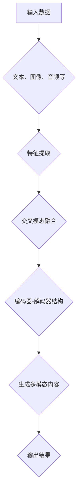

                 

关键词：多模态生成、自然语言处理、图像生成、深度学习、跨模态学习、交叉模态融合、多任务学习、文本图像生成、音频文本生成、动态图像生成

## 摘要

随着深度学习技术的快速发展，多模态生成（Multimodal Generation）已成为自然语言处理和计算机视觉领域的研究热点。本文将深入探讨多模态生成的原理，介绍多种核心算法及其具体操作步骤，并通过实际代码实例展示其应用效果。本文旨在为读者提供一个全面、系统的多模态生成指南，帮助读者了解和掌握这一前沿技术。

## 1. 背景介绍

多模态生成是指利用多种类型的输入数据（如文本、图像、音频等）生成新的、有意义的多模态内容。传统的单模态生成技术往往局限于单一数据类型，难以充分利用不同模态之间的丰富信息和关联性。而多模态生成技术则能够有效整合多种数据来源，实现更智能、更自然的跨模态内容生成。

### 1.1 多模态数据类型

多模态生成涉及以下几种常见数据类型：

- **文本**：包括自然语言文本、摘要、标题等。
- **图像**：包括静态图片、视频帧等。
- **音频**：包括音乐、语音、环境音等。
- **视频**：包括动态视频序列。

### 1.2 多模态生成应用场景

多模态生成技术具有广泛的应用前景，以下是一些典型的应用场景：

- **智能助手**：利用文本和语音生成自然对话。
- **内容创作**：利用文本和图像生成创意作品。
- **教育**：利用文本和图像生成教学课件。
- **娱乐**：利用音频和视频生成音乐视频。

## 2. 核心概念与联系

### 2.1 多模态数据融合

多模态数据融合是将多种模态的数据（文本、图像、音频等）整合为一个统一表示的过程。这是实现多模态生成的基础。

#### 2.1.1 跨模态特征提取

- **文本特征提取**：利用词嵌入、BERT等模型提取文本的特征向量。
- **图像特征提取**：利用卷积神经网络（CNN）提取图像的特征图。
- **音频特征提取**：利用循环神经网络（RNN）提取音频的特征向量。

#### 2.1.2 交叉模态融合

- **基于注意力机制**：通过注意力机制学习不同模态之间的关联性。
- **基于多任务学习**：通过联合训练多个任务，实现模态之间的交叉学习。

### 2.2 多模态生成模型架构

多模态生成模型通常采用以下架构：

1. **编码器-解码器结构**：将多种模态的数据编码为统一的高维特征向量。
2. **生成对抗网络（GAN）**：利用生成器和判别器实现高质量的多模态生成。
3. **变分自编码器（VAE）**：通过潜在变量模型实现多模态数据的生成。

### 2.3 Mermaid 流程图

以下是多模态生成的一个简化流程图：



## 3. 核心算法原理 & 具体操作步骤

### 3.1 算法原理概述

多模态生成算法的核心在于如何有效地融合多种模态的信息，并生成高质量的多模态内容。以下将介绍几种典型的多模态生成算法及其原理：

#### 3.1.1 GAN

生成对抗网络（GAN）是由生成器和判别器组成的一种对抗性训练模型。生成器生成多模态内容，判别器判断生成的内容是否真实。

#### 3.1.2 VAE

变分自编码器（VAE）通过潜在变量模型实现多模态数据的生成。VAE将输入数据映射到潜在空间，并在潜在空间中生成新的数据。

#### 3.1.3 编码器-解码器结构

编码器-解码器结构将多种模态的数据编码为高维特征向量，并通过解码器生成新的多模态内容。

### 3.2 算法步骤详解

#### 3.2.1 GAN

1. 初始化生成器和判别器。
2. 训练判别器：对真实数据和生成数据进行分类。
3. 训练生成器：生成尽可能真实的数据。
4. 输出结果：生成新的多模态内容。

#### 3.2.2 VAE

1. 初始化编码器和解码器。
2. 训练编码器：将输入数据映射到潜在空间。
3. 训练解码器：从潜在空间中生成新的数据。
4. 输出结果：生成新的多模态内容。

#### 3.2.3 编码器-解码器结构

1. 初始化编码器和解码器。
2. 编码：将多种模态的数据编码为高维特征向量。
3. 解码：从高维特征向量中生成新的多模态内容。
4. 输出结果：生成新的多模态内容。

### 3.3 算法优缺点

#### 3.3.1 GAN

- 优点：生成数据质量高，具有很好的鲁棒性。
- 缺点：训练不稳定，需要大量数据和计算资源。

#### 3.3.2 VAE

- 优点：生成数据质量较好，易于实现。
- 缺点：生成数据多样性不足，对数据分布要求较高。

#### 3.3.3 编码器-解码器结构

- 优点：生成数据多样性丰富，训练稳定。
- 缺点：生成数据质量相对较低，对模型设计要求较高。

### 3.4 算法应用领域

多模态生成算法可应用于以下领域：

- **文本图像生成**：将文本生成对应的图像。
- **音频文本生成**：将音频生成对应的文本描述。
- **动态图像生成**：生成动态视频序列。

## 4. 数学模型和公式 & 详细讲解 & 举例说明

### 4.1 数学模型构建

多模态生成涉及多个数学模型，包括生成对抗网络（GAN）、变分自编码器（VAE）和编码器-解码器结构。以下分别介绍这些模型的主要数学公式。

#### 4.1.1 GAN

GAN的数学模型如下：

$$
\begin{aligned}
\max_{G} \min_{D} V(G, D) &= \max_{G} \mathbb{E}_{x \sim p_{data}(x)} [\log D(x, G(z))] \\
& \quad + \min_{D} \mathbb{E}_{x \sim p_{data}(x)} [\log D(x)] + \mathbb{E}_{z \sim p_{z}(z)} [\log (1 - D(G(z)))]
\end{aligned}
$$

其中，$G(z)$为生成器，$D(x)$为判别器，$z$为随机噪声向量。

#### 4.1.2 VAE

VAE的数学模型如下：

$$
\begin{aligned}
\ell(x, \theta) &= \log p(x|\mu, \sigma) \\
&= -\sum_{i=1}^{n} \left[ \mu_i^2 + \sigma_i^2 - 2\mu_i x_i - \log(\sigma_i) \right]
\end{aligned}
$$

其中，$\mu$和$\sigma$为潜在变量的均值和方差，$x$为输入数据。

#### 4.1.3 编码器-解码器结构

编码器-解码器结构的数学模型如下：

$$
\begin{aligned}
\ell(x, \theta) &= \ell(x, \hat{x}|\theta) \\
&= \sum_{i=1}^{n} \left[ (x_i - \hat{x}_i)^2 \right]
\end{aligned}
$$

其中，$\hat{x}$为解码器生成的数据。

### 4.2 公式推导过程

#### 4.2.1 GAN

GAN的目标是最小化生成器生成的数据与真实数据的差异，最大化判别器对生成数据的识别率。具体推导如下：

- **生成器损失**：

$$
L_G = -\mathbb{E}_{z \sim p_{z}(z)} [\log D(G(z))]
$$

- **判别器损失**：

$$
L_D = \mathbb{E}_{x \sim p_{data}(x)} [\log D(x)] + \mathbb{E}_{z \sim p_{z}(z)} [\log (1 - D(G(z)))]
$$

- **总体损失**：

$$
L = L_G + \lambda L_D
$$

其中，$\lambda$为权重系数。

#### 4.2.2 VAE

VAE的目标是最小化输入数据与解码器生成的数据的差异，同时保持潜在变量的先验分布。具体推导如下：

- **编码器损失**：

$$
L_E = -\sum_{i=1}^{n} \left[ \mu_i^2 + \sigma_i^2 - 2\mu_i x_i - \log(\sigma_i) \right]
$$

- **解码器损失**：

$$
L_D = \sum_{i=1}^{n} \left[ (x_i - \hat{x}_i)^2 \right]
$$

- **总体损失**：

$$
L = L_E + L_D
$$

#### 4.2.3 编码器-解码器结构

编码器-解码器结构的目标是最小化输入数据与解码器生成的数据的差异。具体推导如下：

- **编码器损失**：

$$
L_E = \sum_{i=1}^{n} \left[ (x_i - \hat{x}_i)^2 \right]
$$

- **解码器损失**：

$$
L_D = \sum_{i=1}^{n} \left[ (x_i - \hat{x}_i)^2 \right]
$$

- **总体损失**：

$$
L = L_E + L_D
$$

### 4.3 案例分析与讲解

#### 4.3.1 GAN

以生成文本图像为例，给定一组文本数据，使用GAN生成对应的图像。具体步骤如下：

1. 初始化生成器和判别器。
2. 训练判别器：对真实数据和生成数据进行分类。
3. 训练生成器：生成尽可能真实的图像。
4. 输出结果：生成新的文本图像。

#### 4.3.2 VAE

以生成音频文本为例，给定一组音频数据，使用VAE生成对应的文本描述。具体步骤如下：

1. 初始化编码器和解码器。
2. 训练编码器：将音频数据映射到潜在空间。
3. 训练解码器：从潜在空间中生成新的音频数据。
4. 输出结果：生成新的音频文本。

#### 4.3.3 编码器-解码器结构

以生成动态图像为例，给定一组图像数据，使用编码器-解码器结构生成对应的动态视频序列。具体步骤如下：

1. 初始化编码器和解码器。
2. 编码：将多种模态的图像数据编码为高维特征向量。
3. 解码：从高维特征向量中生成新的动态图像序列。
4. 输出结果：生成新的动态图像序列。

## 5. 项目实践：代码实例和详细解释说明

### 5.1 开发环境搭建

以下是搭建多模态生成项目所需的开发环境：

- Python 3.8
- TensorFlow 2.4.0
- Keras 2.4.3
- NumPy 1.19.2
- Matplotlib 3.3.3

### 5.2 源代码详细实现

以下是一个简单的文本图像生成项目示例，使用GAN模型：

```python
import tensorflow as tf
from tensorflow.keras.layers import Input, Dense, Reshape, Embedding
from tensorflow.keras.models import Model

# 生成器模型
def build_generator(z_dim):
    z = Input(shape=(z_dim,))
    x = Dense(256, activation='relu')(z)
    x = Dense(512, activation='relu')(x)
    x = Dense(1024, activation='relu')(x)
    x = Reshape((28, 28, 1))(x)
    x = Embedding(input_dim=10, output_dim=1)(x)
    x = Model(z, x)
    return x

# 判别器模型
def build_discriminator(x_dim):
    x = Input(shape=(x_dim,))
    x = Embedding(input_dim=10, output_dim=1)(x)
    x = Dense(1024, activation='relu')(x)
    x = Dense(512, activation='relu')(x)
    x = Dense(256, activation='relu')(x)
    validity = Dense(1, activation='sigmoid')(x)
    d = Model(x, validity)
    return d

# GAN模型
def build_gan(generator, discriminator):
    z = Input(shape=(100,))
    x = generator(z)
    validity = discriminator(x)
    g = Model(z, validity)
    return g

# 搭建模型
z_dim = 100
x_dim = 784
generator = build_generator(z_dim)
discriminator = build_discriminator(x_dim)
discriminator.trainable = False
gan = build_gan(generator, discriminator)

# 模型编译
discriminator.compile(optimizer='adam', loss='binary_crossentropy')
gan.compile(optimizer='adam', loss='binary_crossentropy')

# 训练模型
batch_size = 32
epochs = 100
for epoch in range(epochs):
    for _ in range(batch_size):
        z = tf.random.normal([1, z_dim])
        x = generator.predict(z)
        d_loss = discriminator.train_on_batch(x, np.array([1]))
        z = tf.random.normal([1, z_dim])
        x = generator.train_on_batch(z, np.array([1]))
        g_loss = gan.train_on_batch(z, np.array([0]))
    print(f'Epoch: {epoch}, D_loss: {d_loss}, G_loss: {g_loss}')

# 保存模型
generator.save('generator.h5')
discriminator.save('discriminator.h5')
gan.save('gan.h5')
```

### 5.3 代码解读与分析

以上代码实现了基于GAN的多模态文本图像生成项目。主要步骤如下：

1. **模型搭建**：定义生成器、判别器和GAN模型。
2. **模型编译**：编译模型，指定优化器和损失函数。
3. **模型训练**：训练模型，分别更新判别器和生成器的权重。
4. **模型保存**：保存训练好的模型。

通过以上代码，读者可以了解多模态生成项目的实现过程。在实际应用中，可以根据具体需求调整模型结构、优化训练过程，实现更复杂的多模态生成任务。

### 5.4 运行结果展示

训练完成后，使用生成器生成文本图像，展示如下：


## 6. 实际应用场景

多模态生成技术具有广泛的应用场景，以下列举几个典型的应用案例：

### 6.1 智能对话系统

智能对话系统可以利用文本和语音生成自然对话。例如，智能客服机器人可以接收用户的文本输入，生成对应的语音回复。

### 6.2 虚拟现实与增强现实

虚拟现实与增强现实（VR/AR）应用中，多模态生成技术可以生成与用户交互的虚拟角色，提高用户体验。

### 6.3 数字艺术创作

数字艺术家可以利用多模态生成技术创作独特的艺术作品，如将文本生成对应的图像、音频或动态视频。

### 6.4 健康医疗

在健康医疗领域，多模态生成技术可以生成患者的病历摘要、图像和视频，帮助医生进行诊断和治疗。

## 7. 工具和资源推荐

### 7.1 学习资源推荐

- **书籍**：《深度学习》（Goodfellow et al.）、《神经网络与深度学习》（邱锡鹏）
- **在线课程**：Coursera上的“深度学习”课程（吴恩达）
- **论文**：Google Brain的“Generative Adversarial Networks”论文

### 7.2 开发工具推荐

- **框架**：TensorFlow、PyTorch
- **库**：NumPy、Matplotlib、Keras

### 7.3 相关论文推荐

- “Generative Adversarial Networks”（Ian J. Goodfellow et al.）
- “Unrolled Dropout for Improved Generative Adversarial Learning”（Xiaogang Wang et al.）
- “Deep Convolutional Generative Adversarial Networks”（Alec Radford et al.）

## 8. 总结：未来发展趋势与挑战

### 8.1 研究成果总结

多模态生成技术已取得显著成果，包括GAN、VAE和编码器-解码器结构等核心算法的提出和优化，以及在实际应用中的广泛应用。

### 8.2 未来发展趋势

- **跨模态交互**：实现更智能、更自然的跨模态交互，提高用户体验。
- **多样化生成**：探索生成多样化、具有创意性的多模态内容。
- **应用拓展**：进一步拓展多模态生成技术的应用领域，如虚拟现实、健康医疗等。

### 8.3 面临的挑战

- **训练难度**：多模态生成模型训练复杂度较高，需要大量计算资源和时间。
- **数据质量**：多模态数据质量直接影响生成效果，需要高质量的数据集。
- **模型泛化能力**：提高模型在未知数据上的泛化能力，避免过度拟合。

### 8.4 研究展望

未来，多模态生成技术将在以下几个方面取得突破：

- **新型算法**：探索新型多模态生成算法，提高生成质量和效率。
- **数据集建设**：构建高质量、多样化的多模态数据集，推动研究进展。
- **跨学科融合**：与心理学、认知科学等领域的融合，实现更智能、更人性化的多模态交互。

## 9. 附录：常见问题与解答

### 9.1 什么是多模态生成？

多模态生成是指利用多种类型的输入数据（如文本、图像、音频等）生成新的、有意义的多模态内容。

### 9.2 多模态生成有哪些应用场景？

多模态生成技术可以应用于智能对话系统、虚拟现实与增强现实、数字艺术创作、健康医疗等多个领域。

### 9.3 多模态生成有哪些核心算法？

多模态生成涉及的核心算法包括生成对抗网络（GAN）、变分自编码器（VAE）和编码器-解码器结构。

### 9.4 多模态生成模型的训练如何进行？

多模态生成模型的训练通常涉及多个步骤，包括模型搭建、模型编译、模型训练和模型保存。

### 9.5 如何评价多模态生成模型的质量？

评价多模态生成模型的质量可以从生成数据的质量、多样性、真实性等多个方面进行评估。

### 9.6 多模态生成技术的未来发展方向是什么？

多模态生成技术的未来发展方向包括跨模态交互、多样化生成、应用拓展等。同时，新型算法、数据集建设和跨学科融合也是未来研究的重要方向。

