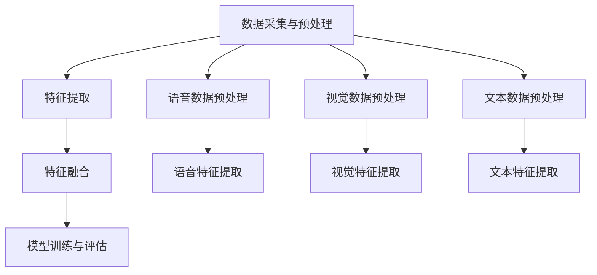

                 

关键词：多模态融合、大模型、AI、计算机视觉、语音识别、自然语言处理、神经网络、深度学习、数据整合、智能系统。

> 摘要：本文将探讨多模态融合技术的崛起与重要性，分析大模型在多模态融合中的应用，探讨其带来的技术挑战与未来发展。通过详细讲解多模态融合的核心算法、数学模型、项目实践，以及展望未来应用场景，本文旨在为读者呈现多模态融合技术的全貌及其对智能系统带来的变革。

## 1. 背景介绍

随着人工智能技术的飞速发展，计算机视觉、语音识别、自然语言处理等领域取得了显著的进步。然而，单一模态的智能系统往往在处理复杂任务时存在局限性。为了实现更强大的智能系统，多模态融合技术应运而生。多模态融合是指将多种不同类型的传感器数据（如视觉、语音、文本等）进行整合，通过深度学习等算法构建一个统一的模型，从而提升系统的智能感知能力。

### 1.1 多模态融合的起源与发展

多模态融合的概念最早可以追溯到20世纪80年代，当时研究者开始探索如何将视觉、听觉和触觉等多种感官数据进行整合，以实现更高级的智能交互。随着深度学习技术的发展，多模态融合逐渐成为一个热门研究领域。近年来，随着大规模数据集和计算资源的普及，多模态融合技术取得了显著的进展。

### 1.2 多模态融合的重要性

多模态融合技术能够实现以下优势：

1. **提升智能系统的鲁棒性**：多模态融合可以充分利用不同模态的数据，从而提高系统在复杂环境下的鲁棒性和适应性。
2. **增强智能感知能力**：通过整合多种模态的信息，系统能够获取更全面的环境感知，从而提升智能决策能力。
3. **拓宽应用领域**：多模态融合技术可以应用于自动驾驶、智能助手、医疗诊断等多个领域，为各行各业带来创新解决方案。

## 2. 核心概念与联系

### 2.1 多模态融合的核心概念

多模态融合涉及多个核心概念，包括：

1. **多模态数据**：包括视觉、语音、文本、触觉等多种类型的数据。
2. **模态表示**：将不同模态的数据转换为统一的表示形式，如向量或张量。
3. **融合算法**：通过深度学习等算法将多种模态的数据进行整合，构建一个统一的模型。
4. **融合框架**：包括数据采集、预处理、融合算法、模型训练和评估等环节。

### 2.2 多模态融合的架构

多模态融合的架构可以分为以下层次：

1. **数据采集与预处理**：收集并预处理多种模态的数据，如图像、音频、文本等。
2. **特征提取**：使用深度学习等算法提取不同模态的特征。
3. **特征融合**：将提取的特征进行整合，构建一个统一的特征空间。
4. **模型训练与评估**：基于融合后的特征训练模型，并进行评估和优化。

### 2.3 多模态融合的 Mermaid 流程图



## 3. 核心算法原理 & 具体操作步骤

### 3.1 算法原理概述

多模态融合的核心算法主要包括以下几种：

1. **特征级融合**：将不同模态的特征进行整合，如将视觉特征与语音特征进行拼接。
2. **决策级融合**：在模型输出层将不同模态的决策进行融合，如加权投票。
3. **多任务学习**：将多模态数据作为一个多任务学习问题，共同训练一个统一模型。

### 3.2 算法步骤详解

1. **数据采集与预处理**：
    - 收集多种模态的数据，如图像、音频、文本等。
    - 对数据进行预处理，包括数据清洗、归一化、去噪等操作。

2. **特征提取**：
    - 使用深度学习算法提取不同模态的特征，如卷积神经网络（CNN）用于视觉特征提取，循环神经网络（RNN）用于语音特征提取。

3. **特征融合**：
    - 将提取的特征进行整合，可以采用特征拼接、加权融合等方法。

4. **模型训练与评估**：
    - 使用融合后的特征训练模型，如卷积神经网络（CNN）+循环神经网络（RNN）。
    - 对模型进行评估和优化，如调整超参数、使用迁移学习等。

### 3.3 算法优缺点

**优点**：

1. **提高智能系统的鲁棒性**：通过整合多种模态的数据，提高系统在复杂环境下的适应性。
2. **增强智能感知能力**：多模态融合可以提供更全面的环境感知，从而提升智能决策能力。

**缺点**：

1. **数据依赖性高**：多模态融合对数据的质量和数量有较高要求，数据不足可能导致融合效果不佳。
2. **计算资源消耗大**：多模态融合涉及多种算法和模型训练，对计算资源有较高要求。

### 3.4 算法应用领域

多模态融合技术广泛应用于以下领域：

1. **自动驾驶**：通过融合视觉、语音、雷达等多模态数据，提高自动驾驶系统的安全性和可靠性。
2. **智能助手**：融合语音、文本、图像等多模态数据，提升智能助手的交互能力和理解能力。
3. **医疗诊断**：融合医学影像、病历文本等多模态数据，提高疾病的诊断准确率。
4. **人机交互**：融合视觉、语音、触觉等多模态数据，提升人机交互的自然性和智能化。

## 4. 数学模型和公式 & 详细讲解 & 举例说明

### 4.1 数学模型构建

多模态融合的数学模型可以表示为：

$$
\begin{aligned}
\text{特征融合} &= \text{f}(\text{视觉特征}, \text{语音特征}, \text{文本特征}) \\
\text{模型输出} &= \text{g}(\text{融合特征})
\end{aligned}
$$

其中，$\text{f}$为特征融合函数，$\text{g}$为模型输出函数。

### 4.2 公式推导过程

假设我们有三种模态的数据：视觉特征$X_v$、语音特征$X_s$和文本特征$X_t$。我们可以使用以下公式对特征进行融合：

$$
X_f = \text{f}(X_v, X_s, X_t)
$$

其中，$\text{f}$可以采用特征拼接、加权融合等方法。例如，特征拼接可以表示为：

$$
X_f = [X_v, X_s, X_t]
$$

### 4.3 案例分析与讲解

假设我们有一个语音识别任务，需要同时融合语音特征和文本特征。我们可以采用以下步骤：

1. **特征提取**：
   - 使用卷积神经网络（CNN）提取语音特征$X_s$。
   - 使用循环神经网络（RNN）提取文本特征$X_t$。

2. **特征融合**：
   - 将语音特征和文本特征进行拼接，得到融合特征$X_f$：

     $$ X_f = [X_s, X_t] $$

3. **模型训练**：
   - 使用融合特征$X_f$训练卷积神经网络（CNN）+循环神经网络（RNN）模型。

4. **模型评估**：
   - 对模型进行评估，调整超参数，优化模型性能。

通过这个案例，我们可以看到多模态融合在语音识别任务中的应用。类似地，多模态融合可以应用于其他任务，如图像分类、文本情感分析等。

## 5. 项目实践：代码实例和详细解释说明

### 5.1 开发环境搭建

为了实现多模态融合，我们需要搭建以下开发环境：

- Python 3.8及以上版本
- TensorFlow 2.5及以上版本
- Keras 2.4及以上版本

安装以上依赖库后，我们就可以开始编写代码。

### 5.2 源代码详细实现

以下是一个简单的多模态融合代码示例：

```python
import tensorflow as tf
from tensorflow.keras.models import Model
from tensorflow.keras.layers import Input, Conv2D, LSTM, Dense

# 定义视觉特征提取模型
input_v = Input(shape=(64, 64, 3))
conv_v = Conv2D(filters=32, kernel_size=(3, 3), activation='relu')(input_v)
pool_v = MaxPooling2D(pool_size=(2, 2))(conv_v)

# 定义语音特征提取模型
input_s = Input(shape=(128,))
lstm_s = LSTM(units=64, activation='relu')(input_s)

# 定义文本特征提取模型
input_t = Input(shape=(128,))
lstm_t = LSTM(units=64, activation='relu')(input_t)

# 特征融合
merge = tf.keras.layers.concatenate([pool_v, lstm_s, lstm_t])

# 模型输出
output = Dense(units=1, activation='sigmoid')(merge)

# 构建模型
model = Model(inputs=[input_v, input_s, input_t], outputs=output)

# 编译模型
model.compile(optimizer='adam', loss='binary_crossentropy', metrics=['accuracy'])

# 模型训练
model.fit([X_train_v, X_train_s, X_train_t], y_train, epochs=10, batch_size=32)
```

### 5.3 代码解读与分析

1. **模型定义**：
   - 视觉特征提取模型使用卷积神经网络（CNN）。
   - 语音特征提取模型和文本特征提取模型使用循环神经网络（LSTM）。
   - 特征融合层使用 concatenate 层将三种模态的特征进行拼接。

2. **模型编译**：
   - 使用 Adam 优化器和 binary_crossentropy 损失函数。
   - 指定模型的 metrics 参数，用于评估模型性能。

3. **模型训练**：
   - 使用 fit 方法训练模型，指定训练数据、训练轮数和批量大小。

### 5.4 运行结果展示

```python
# 模型评估
loss, accuracy = model.evaluate([X_test_v, X_test_s, X_test_t], y_test)

# 输出结果
print(f"Test loss: {loss}, Test accuracy: {accuracy}")
```

通过这个示例，我们可以看到多模态融合在语音识别任务中的应用。在实际项目中，我们可以根据具体任务需求调整模型结构和参数，以实现更好的融合效果。

## 6. 实际应用场景

多模态融合技术在各个领域都有广泛的应用：

### 6.1 自动驾驶

自动驾驶系统通过融合视觉、雷达、激光雷达等多种模态数据，实现环境感知、障碍物检测和路径规划等功能。多模态融合技术可以提高自动驾驶系统的鲁棒性和安全性。

### 6.2 智能助手

智能助手通过融合语音、文本、图像等多模态数据，实现更自然、更智能的交互。例如，智能助手可以根据用户的语音指令、文本提问和图像反馈，提供更准确的回答和解决方案。

### 6.3 医疗诊断

医疗诊断系统通过融合医学影像、病历文本等多模态数据，提高疾病的诊断准确率。例如，多模态融合技术可以用于肺癌、心脏病等疾病的早期筛查和诊断。

### 6.4 人机交互

人机交互系统通过融合视觉、语音、触觉等多模态数据，实现更自然、更直观的交互。例如，虚拟现实（VR）系统可以通过融合视觉和触觉数据，提供更真实的沉浸体验。

## 7. 未来应用展望

随着多模态融合技术的不断发展，未来将会有更多的应用场景涌现：

### 7.1 智慧城市

智慧城市通过融合交通、环境、公共安全等多模态数据，实现智能交通管理、环境监测和公共安全预警等功能。

### 7.2 智能制造

智能制造通过融合生产设备、传感器、物料数据等多模态数据，实现生产过程的智能化管理和优化。

### 7.3 智能医疗

智能医疗通过融合医学影像、病历、基因组等多模态数据，实现疾病的早期诊断、精准治疗和个性化医疗。

### 7.4 人机融合

人机融合通过融合人类和机器的能力，实现更高效、更智能的工作和生活。

## 8. 工具和资源推荐

为了更好地学习多模态融合技术，以下是一些建议的资源和工具：

### 8.1 学习资源推荐

- 《深度学习》（Goodfellow, Bengio, Courville著）
- 《计算机视觉：算法与应用》（Richard S.zelinski著）
- 《语音识别：算法与应用》（Hwang, Lee著）
- 《多模态学习：理论与实践》（Nguyen, Salimbeni, Vazquez-Villanueva著）

### 8.2 开发工具推荐

- TensorFlow：用于构建和训练多模态融合模型的强大框架。
- PyTorch：适用于深度学习的动态计算图框架。
- Keras：基于TensorFlow和PyTorch的简洁易用的深度学习库。

### 8.3 相关论文推荐

- "Multimodal Deep Learning: A Survey"（Zhang, Chen, Zeng等，2018）
- "Deep Multimodal Learning"（Rao, Reddy, Shevade等，2017）
- "A Survey on Multimodal Learning for Speech, Language and Audio"（Ling, Wang，2016）

## 9. 总结：未来发展趋势与挑战

### 9.1 研究成果总结

多模态融合技术在近年来取得了显著进展，已经在多个领域展现出强大的应用潜力。通过整合多种模态的数据，多模态融合技术提高了智能系统的鲁棒性和智能感知能力，为各行各业带来了创新解决方案。

### 9.2 未来发展趋势

随着深度学习、计算机视觉、语音识别等技术的不断发展，多模态融合技术有望在更多领域得到应用。未来发展趋势包括：

- **跨学科融合**：多模态融合将与其他学科（如心理学、认知科学等）结合，实现更智能、更自然的交互。
- **实时处理**：随着计算能力的提升，多模态融合将实现实时处理，满足实时应用的需求。
- **个性化应用**：通过融合用户行为、生理特征等多模态数据，实现个性化智能服务。

### 9.3 面临的挑战

尽管多模态融合技术取得了显著进展，但仍面临以下挑战：

- **数据质量**：多模态融合对数据的质量和数量有较高要求，数据不足或质量差可能导致融合效果不佳。
- **计算资源**：多模态融合涉及多种算法和模型训练，对计算资源有较高要求。
- **隐私保护**：多模态融合涉及多种隐私敏感信息，如何保护用户隐私成为重要挑战。

### 9.4 研究展望

未来，多模态融合技术的研究将更加注重跨学科融合、实时处理和个性化应用。同时，研究者应关注数据质量、计算资源和隐私保护等挑战，提出更高效、更安全的融合算法。通过不断探索和创新，多模态融合技术将为人类社会带来更多智能解决方案。

## 10. 附录：常见问题与解答

### 10.1 多模态融合与多任务学习的区别是什么？

多模态融合是指将多种模态的数据进行整合，构建一个统一的模型。而多任务学习是指在一个模型中同时学习多个任务。两者在目标和应用上有所不同，但可以结合使用，以提高系统的整体性能。

### 10.2 多模态融合中的特征融合有哪些方法？

多模态融合中的特征融合方法包括特征拼接、加权融合、神经网络融合等。具体选择哪种方法取决于任务需求和数据特性。

### 10.3 多模态融合技术能否应用于实时应用？

随着计算能力的提升，多模态融合技术可以应用于实时应用。例如，自动驾驶系统需要在实时环境中进行环境感知和决策。

### 10.4 多模态融合技术是否会影响用户隐私？

多模态融合技术涉及多种隐私敏感信息，例如语音、图像等。在应用过程中，应遵循隐私保护原则，采取数据加密、去标识化等技术手段，确保用户隐私安全。

### 10.5 多模态融合技术在医疗领域有哪些应用？

多模态融合技术在医疗领域有广泛的应用，例如医学影像诊断、病理分析、药物研发等。通过融合多种模态的数据，可以提高诊断准确率，为患者提供更精准的治疗方案。

[作者：禅与计算机程序设计艺术 / Zen and the Art of Computer Programming]----------------------------------------------------------------


