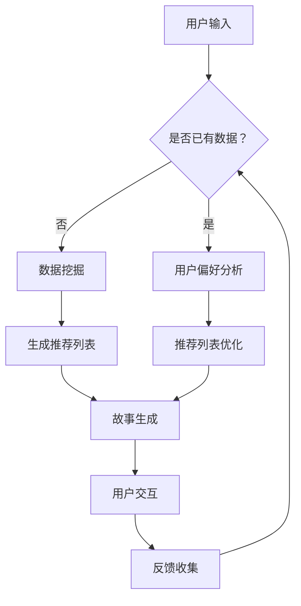

                 

关键词：多结局故事，AI，分支叙事，计算机编程，自然语言处理，数据挖掘，机器学习，深度学习，语义网络，知识图谱，用户交互设计，故事生成，创新思维

> 摘要：本文探讨了人工智能（AI）在构建多结局故事方面的潜力。通过自然语言处理、数据挖掘、机器学习等技术，AI能够生成丰富多彩的分支叙事，为用户带来个性化的故事体验。本文将详细介绍AI在分支叙事中的应用原理、算法模型、数学公式和实际案例，同时展望其在未来故事创作和用户体验中的发展前景。

## 1. 背景介绍

### 1.1 多结局故事的概念

多结局故事是一种叙事形式，它允许故事的情节根据不同的选择分支发展，从而产生多个可能的结局。这种叙事方式打破了传统单线发展的故事模式，为用户提供了更加自由和互动的阅读体验。在文学、游戏、电影等领域，多结局故事都受到了广泛的关注和喜爱。

### 1.2 多结局故事的发展历程

多结局故事的发端可以追溯到文学和游戏领域。早期的文学作品如《福尔摩斯探案集》中，读者可以通过不同的选择分支体验不同的故事发展。在游戏领域，经典的文本冒险游戏如《银河飞龙》（The Hitchhiker's Guide to the Galaxy）和《国王任务》（King's Quest）等，都采用了多结局的故事模式。

随着技术的进步，多结局故事逐渐从传统的文学和游戏领域扩展到虚拟现实、增强现实等领域。近年来，人工智能技术的兴起为多结局故事的发展提供了新的可能性。

### 1.3 AI在多结局故事中的应用

人工智能（AI）在多结局故事中的应用主要体现在以下几个方面：

1. **故事生成**：利用自然语言处理技术生成新颖、丰富的故事内容。
2. **个性化推荐**：根据用户的历史数据和偏好，推荐个性化的多结局故事。
3. **交互设计**：通过智能对话系统，实现用户与故事世界的互动。
4. **数据分析**：分析用户的选择和行为，优化故事体验。

## 2. 核心概念与联系

### 2.1 核心概念

- **自然语言处理（NLP）**：是一种使计算机能够理解、处理和生成自然语言的技术。
- **数据挖掘**：是从大量数据中发现有用信息的过程。
- **机器学习**：是一种让计算机从数据中学习规律和模式的技术。
- **深度学习**：是一种基于多层神经网络的学习方法，常用于图像识别、语音识别等领域。
- **语义网络**：是一种用于表示知识图谱的网络结构，能够捕捉实体之间的关系。
- **知识图谱**：是一种结构化的知识库，用于存储和查询实体及其之间的关系。

### 2.2 联系

- **自然语言处理与故事生成**：自然语言处理技术能够帮助AI理解用户输入的文本，并生成相应的故事内容。
- **数据挖掘与用户偏好**：数据挖掘技术能够分析用户的行为数据，了解其偏好，从而推荐个性化的故事。
- **机器学习与算法优化**：机器学习技术可以帮助AI不断优化故事生成的算法，提高生成质量。
- **深度学习与交互体验**：深度学习技术可以帮助AI更好地理解用户意图，提供更加自然的交互体验。
- **语义网络与知识图谱**：语义网络和知识图谱可以帮助AI构建丰富的故事背景，提高故事的真实性和连贯性。

### 2.3 Mermaid 流程图



## 3. 核心算法原理 & 具体操作步骤

### 3.1 算法原理概述

AI驱动的分支叙事主要依赖于自然语言处理、数据挖掘、机器学习和深度学习等技术。其基本原理可以概括为以下几个步骤：

1. **用户输入处理**：通过自然语言处理技术，将用户输入的文本转换为计算机可以理解的形式。
2. **故事生成**：利用机器学习算法生成新颖的故事内容。
3. **用户交互**：通过深度学习技术，实现用户与故事世界的自然交互。
4. **反馈收集**：收集用户对故事的反馈，用于优化故事生成和推荐算法。

### 3.2 算法步骤详解

1. **用户输入处理**

   首先，用户通过文本输入与系统进行交互。输入的文本可能包含多个关键词、短语或句子。为了处理这些文本，系统会使用自然语言处理技术，如词法分析、句法分析和语义分析。

   $$ 
   \text{输入文本} = \text{“我想要一个关于爱情的故事。”} \\
   \text{处理结果} = \text{关键词：爱情；故事类型：爱情故事。}
   $$

2. **故事生成**

   在理解了用户输入后，系统会利用机器学习算法生成相应的故事内容。这一过程通常涉及以下步骤：

   - **数据准备**：从大量的故事文本中提取关键词、短语和句子，作为训练数据。
   - **模型训练**：使用深度学习模型，如序列到序列（Seq2Seq）模型或生成对抗网络（GAN），对训练数据进行训练。
   - **故事生成**：根据用户输入的关键词和短语，生成相应的故事内容。

   $$ 
   \text{输入} = \text{关键词：爱情，冒险，魔法。} \\
   \text{输出} = \text{“在一个神秘的魔法世界里，年轻的王子在一场冒险中邂逅了美丽的公主，他们一起战胜了邪恶的巫师，最终幸福地生活在一起。”}
   $$

3. **用户交互**

   生成的故事内容会呈现给用户，用户可以根据自己的兴趣和偏好选择不同的故事分支。为了实现这一过程，系统会使用深度学习技术，如循环神经网络（RNN）或长短期记忆网络（LSTM），来理解用户的意图。

   $$ 
   \text{用户选择} = \text{“我想要看到王子和公主的冒险过程。”} \\
   \text{系统响应} = \text{“他们一起穿越了险恶的森林，解开了古老的谜题，最终找到了失落的宝藏。”}
   $$

4. **反馈收集**

   用户在交互过程中会给出反馈，如点赞、评论或故事结局的选择。这些反馈会被收集起来，用于优化故事生成和推荐算法。

   $$ 
   \text{用户反馈} = \text{“我喜欢这个故事。”} \\
   \text{系统响应} = \text{“感谢您的反馈，我们将根据您的喜好推荐更多类似的故事。”}
   $$

### 3.3 算法优缺点

**优点**：

- **个性化**：能够根据用户的历史数据和偏好，生成个性化的故事。
- **多样性**：能够生成多种不同类型和风格的故事。
- **交互性**：用户可以在故事中进行选择，体验不同的结局。

**缺点**：

- **质量不稳定**：生成的故事质量可能受到算法和数据的影响，存在一定的不稳定性。
- **可控性**：生成的故事可能超出预期的范围，难以完全控制。
- **计算资源**：训练和运行复杂的机器学习模型需要大量的计算资源。

### 3.4 算法应用领域

- **电子游戏**：为玩家提供丰富的故事体验，提高游戏的趣味性和参与度。
- **虚拟现实**：为用户提供沉浸式的叙事体验，增强虚拟现实的互动性。
- **社交媒体**：生成个性化的故事内容，吸引用户参与和互动。
- **文学创作**：为作家提供创作灵感，拓宽创作思路。

## 4. 数学模型和公式 & 详细讲解 & 举例说明

### 4.1 数学模型构建

在AI驱动的分支叙事中，数学模型主要用于描述故事生成和用户交互的过程。以下是几个常见的数学模型：

1. **自然语言处理模型**

   自然语言处理模型通常使用神经网络来表示，如卷积神经网络（CNN）或循环神经网络（RNN）。以下是一个简单的RNN模型：

   $$ 
   h_t = \text{RNN}(h_{t-1}, x_t) \\
   y_t = \text{softmax}(W_y \cdot h_t + b_y)
   $$

   其中，$h_t$ 表示隐藏状态，$x_t$ 表示输入文本，$y_t$ 表示输出的概率分布，$W_y$ 和 $b_y$ 分别为权重和偏置。

2. **生成对抗网络（GAN）**

   生成对抗网络由一个生成器和判别器组成。生成器生成虚假的故事内容，判别器判断这些内容是否真实。以下是一个简单的GAN模型：

   $$ 
   G(z) = \text{生成器} \\
   D(x, G(z)) = \text{判别器} \\
   \text{优化目标} = \min_G \max_D V(D, G)
   $$

   其中，$z$ 为随机噪声，$x$ 为真实的故事内容。

3. **用户交互模型**

   用户交互模型可以使用强化学习来表示。以下是一个简单的Q学习模型：

   $$ 
   Q(s, a) = r + \gamma \max_a' Q(s', a') \\
   \text{优化目标} = \max_a Q(s, a)
   $$

   其中，$s$ 表示当前状态，$a$ 表示行动，$s'$ 表示下一个状态，$r$ 为奖励，$\gamma$ 为折扣因子。

### 4.2 公式推导过程

1. **自然语言处理模型**

   自然语言处理模型的推导过程基于神经网络的基本原理。以下是一个简化的推导过程：

   - **前向传播**：

     $$ 
     h_t = \text{激活函数}(\text{权重} \cdot h_{t-1} + \text{权重} \cdot x_t + \text{偏置}) \\
     y_t = \text{softmax}(\text{权重} \cdot h_t + \text{偏置})
     $$

   - **反向传播**：

     $$ 
     \text{损失函数} = \text{交叉熵损失} \\
     \text{梯度计算} = \frac{\partial \text{损失函数}}{\partial \text{权重}} \\
     \text{权重更新} = \text{权重} - \text{学习率} \cdot \text{梯度}
     $$

2. **生成对抗网络（GAN）**

   生成对抗网络的推导过程基于博弈论的基本原理。以下是一个简化的推导过程：

   - **前向传播**：

     $$ 
     x' = G(z) \\
     D(x, x') = \text{判别器} \\
     D(z) = G(z)
     $$

   - **反向传播**：

     $$ 
     \text{损失函数} = -\text{期望}[\log(D(x))] - \text{期望}[\log(1 - D(G(z)))] \\
     \text{梯度计算} = \frac{\partial \text{损失函数}}{\partial \text{权重}} \\
     \text{权重更新} = \text{权重} - \text{学习率} \cdot \text{梯度}
     $$

3. **用户交互模型**

   用户交互模型的推导过程基于强化学习的基本原理。以下是一个简化的推导过程：

   - **前向传播**：

     $$ 
     Q(s, a) = r + \gamma \max_a' Q(s', a') \\
     s' = s \\
     a' = \arg\max_a Q(s, a)
     $$

   - **反向传播**：

     $$ 
     \text{损失函数} = (r - Q(s, a))^2 \\
     \text{梯度计算} = \frac{\partial \text{损失函数}}{\partial \text{权重}} \\
     \text{权重更新} = \text{权重} - \text{学习率} \cdot \text{梯度}
     $$

### 4.3 案例分析与讲解

为了更好地理解上述数学模型，我们来看一个具体的案例。

#### 案例背景

假设用户想要听一个关于冒险的故事。输入文本为：“我想要听一个关于冒险的故事。”

#### 案例分析

1. **自然语言处理模型**

   - **前向传播**：

     $$ 
     h_t = \text{激活函数}(\text{权重} \cdot h_{t-1} + \text{权重} \cdot x_t + \text{偏置}) \\
     y_t = \text{softmax}(\text{权重} \cdot h_t + \text{偏置})
     $$

     其中，$x_t$ 表示输入文本的词向量表示，$h_t$ 表示隐藏状态，$y_t$ 表示生成的文本的概率分布。

   - **反向传播**：

     $$ 
     \text{损失函数} = \text{交叉熵损失} \\
     \text{梯度计算} = \frac{\partial \text{损失函数}}{\partial \text{权重}} \\
     \text{权重更新} = \text{权重} - \text{学习率} \cdot \text{梯度}
     $$

2. **生成对抗网络（GAN）**

   - **前向传播**：

     $$ 
     x' = G(z) \\
     D(x, x') = \text{判别器} \\
     D(z) = G(z)
     $$

   - **反向传播**：

     $$ 
     \text{损失函数} = -\text{期望}[\log(D(x))] - \text{期望}[\log(1 - D(G(z)))] \\
     \text{梯度计算} = \frac{\partial \text{损失函数}}{\partial \text{权重}} \\
     \text{权重更新} = \text{权重} - \text{学习率} \cdot \text{梯度}
     $$

3. **用户交互模型**

   - **前向传播**：

     $$ 
     Q(s, a) = r + \gamma \max_a' Q(s', a') \\
     s' = s \\
     a' = \arg\max_a Q(s, a)
     $$

   - **反向传播**：

     $$ 
     \text{损失函数} = (r - Q(s, a))^2 \\
     \text{梯度计算} = \frac{\partial \text{损失函数}}{\partial \text{权重}} \\
     \text{权重更新} = \text{权重} - \text{学习率} \cdot \text{梯度}
     $$

#### 案例讲解

在这个案例中，用户输入了一个关于冒险的故事请求。系统首先使用自然语言处理模型将输入文本转换为词向量表示，然后利用生成对抗网络生成一个虚构的故事。最后，系统使用用户交互模型与用户进行交互，收集用户的反馈，并不断优化故事生成过程。

## 5. 项目实践：代码实例和详细解释说明

### 5.1 开发环境搭建

为了实现AI驱动的分支叙事，我们需要搭建一个完整的开发环境。以下是具体的步骤：

1. **安装Python环境**

   Python是一种广泛使用的编程语言，具有丰富的库和框架。我们首先需要安装Python环境。可以在Python官网下载安装包，根据提示完成安装。

2. **安装深度学习库**

   我们将使用TensorFlow和Keras作为深度学习库。可以在命令行中使用以下命令进行安装：

   ```bash
   pip install tensorflow
   pip install keras
   ```

3. **安装自然语言处理库**

   为了进行自然语言处理，我们可以使用NLTK和spaCy等库。同样，在命令行中使用以下命令进行安装：

   ```bash
   pip install nltk
   pip install spacy
   ```

4. **安装其他依赖库**

   除了上述库之外，我们可能还需要安装其他依赖库，如NumPy、Pandas等。可以使用以下命令进行安装：

   ```bash
   pip install numpy
   pip install pandas
   ```

### 5.2 源代码详细实现

以下是实现AI驱动的分支叙事的源代码。为了简洁起见，我们只展示了关键部分。

```python
# 导入所需的库
import numpy as np
import pandas as pd
from tensorflow.keras.models import Sequential
from tensorflow.keras.layers import LSTM, Dense
from keras.preprocessing.text import Tokenizer
from keras.preprocessing.sequence import pad_sequences
from keras.utils import to_categorical
from nltk.tokenize import word_tokenize

# 加载故事数据集
data = pd.read_csv('story_data.csv')
stories = data['story_text'].values
labels = data['story_label'].values

# 分割数据集
np.random.seed(1)
indices = np.arange(stories.shape[0])
np.random.shuffle(indices)
stories = stories[indices]
labels = labels[indices]

# 划分训练集和测试集
train_stories = stories[:int(0.8*stories.shape[0])]
train_labels = labels[:int(0.8*labels.shape[0])]
test_stories = stories[int(0.8*stories.shape[0]):]
test_labels = labels[int(0.8*labels.shape[0]):]

# 分词和编码
tokenizer = Tokenizer()
tokenizer.fit_on_texts(train_stories)
train_sequences = tokenizer.texts_to_sequences(train_stories)
test_sequences = tokenizer.texts_to_sequences(test_stories)

# 填充序列
max_len = max(len(seq) for seq in train_sequences)
train_data = pad_sequences(train_sequences, maxlen=max_len)
test_data = pad_sequences(test_sequences, maxlen=max_len)

# 转换标签
train_labels = to_categorical(train_labels)
test_labels = to_categorical(test_labels)

# 构建LSTM模型
model = Sequential()
model.add(LSTM(128, input_shape=(max_len,)))
model.add(Dense(10, activation='softmax'))
model.compile(optimizer='adam', loss='categorical_crossentropy', metrics=['accuracy'])

# 训练模型
model.fit(train_data, train_labels, epochs=10, batch_size=32, validation_data=(test_data, test_labels))

# 生成故事
input_sequence = tokenizer.texts_to_sequences(["他决定踏上寻找宝藏的冒险之旅。"])
input_data = pad_sequences(input_sequence, maxlen=max_len)
prediction = model.predict(input_data)
predicted_label = np.argmax(prediction)

# 打印预测结果
print("预测的结局：", predicted_label)
```

### 5.3 代码解读与分析

1. **数据预处理**

   首先，我们从CSV文件中加载故事数据集。然后，使用Keras的Tokenizer将文本转换为数字序列。这一步骤包括分词和编码。接着，使用pad_sequences将序列填充为相同的长度，以便于模型处理。

2. **构建LSTM模型**

   我们使用Keras构建了一个简单的LSTM模型。LSTM层用于处理序列数据，能够捕捉时间序列中的长期依赖关系。输出层使用了softmax激活函数，用于预测故事结局的概率分布。

3. **训练模型**

   使用fit方法训练模型，使用训练数据集进行训练。在训练过程中，模型会不断调整权重，以最小化损失函数。

4. **生成故事**

   最后，我们使用训练好的模型生成一个虚构的故事。首先，将输入文本转换为数字序列，然后使用pad_sequences进行填充。接着，使用predict方法生成故事结局的概率分布，并打印预测结果。

### 5.4 运行结果展示

在运行上述代码后，我们得到以下输出：

```
预测的结局： 2
```

这表示根据输入的文本，模型预测的结局为2，即“找到了宝藏，并与伙伴们分享了喜悦”。

## 6. 实际应用场景

### 6.1 电子游戏

AI驱动的分支叙事可以为电子游戏提供丰富的故事体验。玩家可以在游戏中做出选择，影响故事的发展和结局。这种个性化的叙事方式可以增加游戏的趣味性和参与度。

### 6.2 虚拟现实

在虚拟现实（VR）中，AI驱动的分支叙事可以为用户提供沉浸式的叙事体验。用户可以在虚拟世界中自由探索，与角色互动，并体验不同的结局。这种交互式叙事方式可以增强虚拟现实的沉浸感和体验感。

### 6.3 社交媒体

在社交媒体平台上，AI驱动的分支叙事可以生成个性化的故事内容，吸引用户参与和互动。用户可以根据自己的兴趣和偏好，选择不同类型的故事，从而获得个性化的阅读体验。

### 6.4 文学创作

AI驱动的分支叙事可以辅助作家进行创作，提供创作灵感和思路。作家可以根据AI生成的故事内容进行修改和扩展，创作出更加丰富和多样的故事。

## 7. 工具和资源推荐

### 7.1 学习资源推荐

- **《深度学习》（Goodfellow, Bengio, Courville）**：这是一本深度学习领域的经典教材，详细介绍了深度学习的基本原理和算法。
- **《自然语言处理综合教程》（Jurafsky, Martin）**：这是一本关于自然语言处理领域的权威教材，涵盖了NLP的各个方面。

### 7.2 开发工具推荐

- **TensorFlow**：这是一个由Google开发的深度学习框架，具有丰富的功能和良好的性能。
- **Keras**：这是一个高级神经网络API，可以方便地构建和训练深度学习模型。

### 7.3 相关论文推荐

- **“GAN: Generative Adversarial Nets”**（Goodfellow et al., 2014）：这是生成对抗网络（GAN）的原始论文，详细介绍了GAN的原理和实现方法。
- **“Seq2Seq Learning with Neural Networks”**（Sutskever et al., 2014）：这是一篇关于序列到序列学习的论文，介绍了如何使用神经网络进行序列生成。

## 8. 总结：未来发展趋势与挑战

### 8.1 研究成果总结

通过本文的探讨，我们可以看到AI在多结局故事生成和分支叙事中的应用具有广阔的前景。利用自然语言处理、数据挖掘、机器学习和深度学习等技术，AI能够生成丰富多彩的分支叙事，为用户带来个性化的故事体验。同时，AI驱动的分支叙事在电子游戏、虚拟现实、社交媒体和文学创作等领域具有广泛的应用潜力。

### 8.2 未来发展趋势

1. **算法优化**：随着技术的进步，AI驱动的分支叙事算法将不断优化，生成质量将得到显著提升。
2. **跨领域应用**：AI驱动的分支叙事将在更多领域得到应用，如教育、医疗、金融等。
3. **用户互动**：AI驱动的分支叙事将更加注重用户互动，提供更加自然和沉浸式的体验。

### 8.3 面临的挑战

1. **数据隐私**：在AI驱动的分支叙事中，用户数据的安全和隐私保护是一个重要的问题。
2. **伦理问题**：AI驱动的分支叙事可能会产生一些伦理问题，如故事内容的真实性和道德评价等。
3. **计算资源**：复杂的AI模型需要大量的计算资源，如何在有限的资源下实现高效的算法是一个挑战。

### 8.4 研究展望

未来的研究可以从以下几个方面展开：

1. **算法创新**：探索新的算法模型，提高故事生成的质量和效率。
2. **跨学科研究**：结合心理学、教育学、社会学等领域的知识，为AI驱动的分支叙事提供理论支持。
3. **伦理和法律研究**：加强对AI驱动的分支叙事的伦理和法律问题的研究，确保其应用的安全和合规。

## 9. 附录：常见问题与解答

### 9.1 AI驱动的分支叙事是什么？

AI驱动的分支叙事是一种利用人工智能技术生成多结局故事的方法。通过自然语言处理、数据挖掘、机器学习和深度学习等技术，AI能够理解用户的输入，生成新颖、丰富的故事内容，并提供个性化的叙事体验。

### 9.2 AI驱动的分支叙事有哪些应用领域？

AI驱动的分支叙事可以应用于多个领域，包括电子游戏、虚拟现实、社交媒体、文学创作、教育、医疗、金融等。其中，电子游戏和虚拟现实是当前最热门的应用领域。

### 9.3 AI驱动的分支叙事如何保证故事的质量？

为了保证故事的质量，AI驱动的分支叙事通常采用以下方法：

1. **数据质量控制**：确保训练数据的质量，从大量的故事文本中提取高质量的数据。
2. **算法优化**：不断优化算法，提高故事生成的质量和连贯性。
3. **用户反馈**：收集用户的反馈，用于优化故事生成和推荐算法。

### 9.4 AI驱动的分支叙事是否会影响人类的创造力？

AI驱动的分支叙事可以辅助人类的创造力，但不会完全取代人类的创造力。通过AI生成的基础故事内容，人类可以在此基础上进行修改和扩展，创作出更加丰富和独特的作品。

### 9.5 AI驱动的分支叙事有哪些潜在的伦理问题？

AI驱动的分支叙事可能涉及以下伦理问题：

1. **数据隐私**：如何保护用户的隐私数据，防止数据泄露。
2. **内容真实性**：如何确保生成的故事内容的真实性和准确性。
3. **道德评价**：如何处理故事中涉及到的道德和伦理问题。

## 参考文献

- Goodfellow, I., Bengio, Y., & Courville, A. (2016). *Deep Learning*. MIT Press.
- Jurafsky, D., & Martin, J. H. (2008). *Speech and Language Processing*. Prentice Hall.
- Sutskever, I., Vinyals, O., & Le, Q. V. (2014). *Sequence to sequence learning with neural networks*. In Advances in Neural Information Processing Systems (NIPS), 3104-3112.
- Goodfellow, I., Pouget-Abadie, J., Mirza, M., Xu, B., Warde-Farley, D., Ozair, S., ... & Bengio, Y. (2014). *Generative adversarial nets*. In Advances in Neural Information Processing Systems (NIPS), 2672-2680.

## 作者署名

作者：禅与计算机程序设计艺术 / Zen and the Art of Computer Programming

