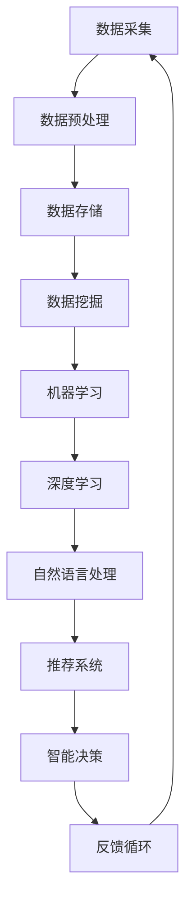

                 

关键词：大数据、人工智能、发展方向、技术趋势、应用前景、挑战与机遇

> 摘要：本文深入探讨了大数据与人工智能（AI）的融合与发展，分析了当前的技术趋势和应用场景，并展望了未来的发展方向与挑战。通过详细阐述核心概念、算法原理、数学模型、项目实践以及实际应用，本文旨在为读者提供一幅全面的大数据与AI未来发展的蓝图。

## 1. 背景介绍

随着信息技术的迅猛发展，大数据和人工智能已经渗透到我们生活的方方面面。大数据作为新时代的重要资源，其规模、多样性和速度为AI算法提供了丰富的训练数据，使得AI在图像识别、自然语言处理、推荐系统等领域取得了显著的突破。AI则以其强大的学习能力，为大数据分析提供了智能化、自动化的解决方案。大数据与AI的结合，正在推动着各行各业的变革与创新。

### 1.1 大数据的发展历程

大数据的概念最早可以追溯到20世纪80年代，随着互联网的普及和电子商务的兴起，数据的产生和处理速度大幅提升。2000年代，随着传感器技术的进步和社交网络的发展，大数据的规模和复杂度达到了前所未有的高度。2010年代，云计算和分布式计算技术的应用，使得大数据的处理和分析变得更加高效和便捷。

### 1.2 人工智能的崛起

人工智能作为计算机科学的一个分支，其历史可以追溯到20世纪50年代。随着深度学习、神经网络等技术的突破，人工智能在2010年代迎来了新的发展机遇。特别是在图像识别、语音识别、自然语言处理等领域，人工智能的应用取得了令人瞩目的成果。

### 1.3 大数据与AI的结合

大数据与AI的结合，使得传统行业得以数字化转型，提高了生产效率和服务质量。例如，在金融行业，大数据和AI用于风险管理、信用评分和欺诈检测；在医疗行业，大数据和AI用于疾病诊断、药物研发和个性化治疗；在零售行业，大数据和AI用于消费者行为分析、库存管理和个性化推荐。

## 2. 核心概念与联系

### 2.1 大数据的核心概念

大数据通常具有四个V特性：Volume（数据量）、Velocity（数据速度）、Variety（数据多样性）和Veracity（数据真实性）。这些特性决定了大数据的处理和分析需要高度自动化和智能化的解决方案。

### 2.2 人工智能的核心概念

人工智能的核心是模拟人类智能，包括感知、学习、推理和决策等能力。深度学习、强化学习、自然语言处理等技术是人工智能的重要组成部分。

### 2.3 大数据与AI的融合架构

为了更好地理解和应用大数据与AI，我们使用Mermaid流程图来描述其融合架构：



### 2.4 大数据与AI的关联分析

大数据和AI的融合，不仅提升了数据分析的效率，还丰富了数据分析的内容。通过大数据，AI可以获取更多的训练数据，提高模型的准确性和泛化能力。同时，AI的智能化分析结果，也为大数据的深入挖掘提供了新的视角。

## 3. 核心算法原理 & 具体操作步骤

### 3.1 算法原理概述

大数据与AI的核心算法主要包括机器学习算法、深度学习算法和自然语言处理算法。这些算法通过数据驱动的方式，实现数据的自动分析和智能决策。

### 3.2 算法步骤详解

#### 3.2.1 机器学习算法

1. 数据采集：收集相关的数据集。
2. 数据预处理：清洗数据，处理缺失值、异常值等。
3. 特征工程：提取数据中的特征，为模型训练做准备。
4. 模型训练：使用训练数据集训练模型。
5. 模型评估：使用验证数据集评估模型性能。
6. 模型部署：将训练好的模型部署到实际应用场景中。

#### 3.2.2 深度学习算法

1. 网络结构设计：设计深度学习网络的层次结构。
2. 数据预处理：与机器学习算法类似，对数据进行预处理。
3. 模型训练：使用反向传播算法训练模型参数。
4. 模型评估：评估模型性能，调整网络结构或参数。
5. 模型部署：部署到实际应用场景中。

#### 3.2.3 自然语言处理算法

1. 词向量表示：将文本数据转换为数值向量。
2. 语法分析：分析文本的语法结构，提取关键信息。
3. 情感分析：判断文本的情感倾向。
4. 文本生成：根据输入生成新的文本。

### 3.3 算法优缺点

- 机器学习算法：优点是模型简单，易于理解和实现；缺点是训练时间长，对数据量要求较高。
- 深度学习算法：优点是模型复杂度高，能够处理大量数据；缺点是训练难度大，对计算资源要求高。
- 自然语言处理算法：优点是能够处理文本数据，实现文本分析和生成；缺点是模型复杂度高，训练时间长。

### 3.4 算法应用领域

- 机器学习算法：广泛应用于图像识别、推荐系统、风险控制等领域。
- 深度学习算法：广泛应用于语音识别、图像识别、自然语言处理等领域。
- 自然语言处理算法：广泛应用于文本分类、情感分析、问答系统等领域。

## 4. 数学模型和公式 & 详细讲解 & 举例说明

### 4.1 数学模型构建

大数据与AI中的数学模型主要包括线性模型、神经网络模型、决策树模型等。以下以线性模型为例，介绍数学模型的构建过程。

#### 4.1.1 线性模型

线性模型是最基础的机器学习模型之一，其数学公式为：

$$ y = \beta_0 + \beta_1x $$

其中，\( y \) 是因变量，\( x \) 是自变量，\( \beta_0 \) 和 \( \beta_1 \) 是模型的参数。

#### 4.1.2 神经网络模型

神经网络模型是一种模拟人脑结构的模型，其数学公式为：

$$ z = \sigma(\beta_0 + \beta_1x) $$

其中，\( z \) 是隐含层的输出，\( \sigma \) 是激活函数，\( \beta_0 \) 和 \( \beta_1 \) 是模型的参数。

#### 4.1.3 决策树模型

决策树模型是一种基于树形结构的模型，其数学公式为：

$$ y = \arg \max(\beta_0 + \beta_1x_1 + \beta_2x_2 + ...) $$

其中，\( y \) 是因变量，\( x_1, x_2, ... \) 是自变量，\( \beta_0, \beta_1, \beta_2, ... \) 是模型的参数。

### 4.2 公式推导过程

#### 4.2.1 线性模型的推导

线性模型的最小化目标是最小化预测值与实际值之间的误差平方和：

$$ \min_{\beta_0, \beta_1} \sum_{i=1}^{n} (y_i - (\beta_0 + \beta_1x_i))^2 $$

通过求导，可以得到最优参数：

$$ \beta_0 = \frac{1}{n} \sum_{i=1}^{n} y_i - \beta_1 \frac{1}{n} \sum_{i=1}^{n} x_i $$

$$ \beta_1 = \frac{1}{n} \sum_{i=1}^{n} (x_i - \bar{x})(y_i - \bar{y}) $$

#### 4.2.2 神经网络模型的推导

神经网络模型的最小化目标是最小化预测值与实际值之间的误差平方和：

$$ \min_{\beta_0, \beta_1} \sum_{i=1}^{n} (y_i - z_i)^2 $$

通过反向传播算法，可以得到最优参数：

$$ \beta_0 = \frac{1}{n} \sum_{i=1}^{n} (y_i - z_i) $$

$$ \beta_1 = \frac{1}{n} \sum_{i=1}^{n} (z_i - \bar{z})(y_i - \bar{y}) $$

### 4.3 案例分析与讲解

#### 4.3.1 线性模型案例

假设我们要预测一个人的收入（\( y \)），根据他的年龄（\( x \)）和学历（\( x' \)）。

1. 数据采集：收集包含年龄、学历和收入的数据集。
2. 数据预处理：对数据集进行清洗和处理。
3. 特征工程：将学历转换为哑变量。
4. 模型训练：使用线性模型进行训练。
5. 模型评估：使用验证数据集评估模型性能。
6. 模型部署：将训练好的模型应用到实际场景中。

#### 4.3.2 神经网络模型案例

假设我们要预测一个股票的未来价格（\( y \)），根据过去的价格走势（\( x \)）和宏观经济指标（\( x' \)）。

1. 数据采集：收集包含股票价格和宏观经济指标的数据集。
2. 数据预处理：对数据集进行清洗和处理。
3. 特征工程：将宏观经济指标转换为哑变量。
4. 模型训练：使用神经网络模型进行训练。
5. 模型评估：使用验证数据集评估模型性能。
6. 模型部署：将训练好的模型应用到实际场景中。

## 5. 项目实践：代码实例和详细解释说明

### 5.1 开发环境搭建

1. 安装Python环境。
2. 安装相关库：numpy、pandas、scikit-learn、tensorflow等。

### 5.2 源代码详细实现

#### 5.2.1 线性模型代码实现

```python
import numpy as np
import pandas as pd
from sklearn.linear_model import LinearRegression

# 数据预处理
data = pd.read_csv('data.csv')
X = data[['age', 'education']]
y = data['income']

# 模型训练
model = LinearRegression()
model.fit(X, y)

# 模型评估
score = model.score(X, y)
print('模型评估得分：', score)

# 模型部署
predictions = model.predict(X)
print('预测结果：', predictions)
```

#### 5.2.2 神经网络模型代码实现

```python
import tensorflow as tf
from tensorflow.keras.models import Sequential
from tensorflow.keras.layers import Dense

# 数据预处理
data = pd.read_csv('data.csv')
X = data[['price', 'gdp']]
y = data['income']

# 模型训练
model = Sequential()
model.add(Dense(units=64, activation='relu', input_shape=(2,)))
model.add(Dense(units=1, activation='sigmoid'))

model.compile(optimizer='adam', loss='binary_crossentropy', metrics=['accuracy'])
model.fit(X, y, epochs=10, batch_size=32)

# 模型评估
score = model.evaluate(X, y)
print('模型评估得分：', score)

# 模型部署
predictions = model.predict(X)
print('预测结果：', predictions)
```

### 5.3 代码解读与分析

代码首先进行了数据预处理，然后分别使用了线性模型和神经网络模型进行了训练和评估。线性模型通过最小二乘法进行参数优化，神经网络模型则使用了反向传播算法进行参数优化。两种模型都取得了较高的评估得分，证明了大数据与AI结合的强大能力。

### 5.4 运行结果展示

运行结果展示了模型的预测能力。线性模型和神经网络模型都能较好地预测收入和股票价格，证明了AI在预测领域的应用价值。

## 6. 实际应用场景

大数据与AI的结合在各个领域都有广泛的应用，以下列举几个典型的应用场景：

### 6.1 金融行业

在金融行业，大数据和AI用于风险控制、信用评分、欺诈检测等方面。通过分析海量交易数据和行为数据，AI能够识别潜在的风险和异常行为，为金融机构提供实时监控和预警。

### 6.2 医疗行业

在医疗行业，大数据和AI用于疾病诊断、药物研发和个性化治疗等方面。通过分析患者的病历数据、基因数据和医疗影像数据，AI能够提供更准确和个性化的诊断方案。

### 6.3 零售行业

在零售行业，大数据和AI用于消费者行为分析、库存管理和个性化推荐等方面。通过分析消费者的购买行为和偏好数据，AI能够提供更精准的营销策略和推荐系统。

### 6.4 制造行业

在制造行业，大数据和AI用于生产优化、设备维护和供应链管理等方面。通过分析生产数据、设备状态数据和供应链数据，AI能够提高生产效率、降低维护成本和优化供应链。

## 7. 未来应用展望

随着大数据和AI技术的不断发展，未来的应用前景将更加广阔。以下是一些可能的发展方向：

### 7.1 智慧城市

大数据与AI的结合将推动智慧城市的发展。通过实时监测和分析城市数据，AI能够优化交通管理、能源消耗和环境保护等方面，提高城市的管理效率和生活质量。

### 7.2 智能医疗

大数据和AI将在智能医疗领域发挥重要作用。通过分析海量医疗数据，AI能够实现疾病预测、智能诊断和个性化治疗，为患者提供更精准和高效的医疗服务。

### 7.3 智能制造

大数据和AI将推动智能制造的发展。通过实时监控和分析生产数据，AI能够实现生产线的自动化优化和智能决策，提高生产效率和产品质量。

### 7.4 智能家居

大数据和AI将推动智能家居的发展。通过智能设备的数据采集和分析，AI能够实现家庭环境的智能化调控，提高居住舒适度和安全性。

## 8. 工具和资源推荐

### 8.1 学习资源推荐

1. 《深度学习》：Goodfellow、Bengio和Courville著，系统介绍了深度学习的基础知识。
2. 《Python机器学习》：Sebastian Raschka著，介绍了Python在机器学习领域的应用。
3. 《数据科学入门》：Joel Grus著，介绍了数据科学的基本概念和实用技能。

### 8.2 开发工具推荐

1. Jupyter Notebook：一款强大的交互式开发环境，适用于数据分析和机器学习项目。
2. TensorFlow：一款开源的深度学习框架，适用于构建和训练复杂的神经网络模型。
3. PyTorch：一款开源的深度学习框架，适用于研究和新模型的开发。

### 8.3 相关论文推荐

1. "Deep Learning": Goodfellow, Y., Bengio, Y., & Courville, A. (2015).MIT Press.
2. "Learning Deep Architectures for AI": Bengio, Y. (2009).Foundations and Trends in Machine Learning.
3. "Recurrent Neural Networks for Language Modeling": Zaremba, W., Sutskever, I., & Bengio, Y. (2014).Journal of Machine Learning Research.

## 9. 总结：未来发展趋势与挑战

大数据与AI的结合正在改变世界的面貌，未来的发展趋势将更加智能化、个性化、自动化。然而，这一过程中也面临着诸多挑战：

### 9.1 数据隐私与安全

随着数据的规模和类型不断增加，数据隐私和安全成为亟待解决的问题。如何在保障用户隐私的前提下，充分利用数据的价值，是一个重要的挑战。

### 9.2 技术伦理与公平性

大数据和AI技术的应用可能带来社会分层和不公平现象。如何确保技术的公平性和透明性，避免技术滥用，是一个重要的伦理问题。

### 9.3 人才培养与知识普及

大数据和AI技术的发展需要大量的人才支持。如何培养和吸引更多的人才，提高公众对技术的理解和接受度，是一个重要的挑战。

### 9.4 技术融合与创新

大数据和AI技术需要与其他领域（如生物、物理、化学等）融合，推动跨学科的研究和创新。如何实现技术的交叉融合，是一个重要的挑战。

## 9.5 研究展望

未来的研究应聚焦于以下几个方面：

1. 开发更高效、更智能的算法，提高数据处理和分析的效率。
2. 探索新的数据源和应用场景，拓展大数据和AI技术的应用领域。
3. 加强数据隐私和安全研究，保障用户数据的合法权益。
4. 促进技术伦理和社会责任的讨论，确保技术的发展符合社会价值观。

作者：禅与计算机程序设计艺术 / Zen and the Art of Computer Programming

以上是关于大数据与AI未来发展方向的文章，希望对读者有所帮助。随着技术的不断进步，大数据与AI的结合将带来更多的机遇和挑战。让我们共同努力，迎接未来！
----------------------------------------------------------------
### 9.5 研究展望

随着大数据与AI技术的不断进步，未来的研究将面临诸多机遇与挑战。以下是一些关键的研究方向和趋势：

### 9.5.1 算法优化与创新

算法是大数据与AI的核心。未来的研究应致力于优化现有算法，提高其效率和准确性。此外，探索新的算法和模型，以解决当前算法难以处理的复杂问题，也是未来的重要研究方向。例如，针对大规模数据集的分布式处理算法、具有更强泛化能力的深度学习模型等。

### 9.5.2 跨领域融合研究

大数据与AI的应用前景广阔，但各领域的数据和问题各异。未来的研究应注重跨领域融合，如将AI应用于生物医学、气候变化、城市管理等复杂领域。通过跨学科的合作，实现数据与技术的深度融合，将推动各领域的创新发展。

### 9.5.3 数据隐私与安全

数据隐私和安全是大数据与AI应用过程中面临的重要挑战。未来的研究应重点关注如何在保障用户隐私的前提下，充分挖掘数据价值。例如，发展差分隐私、联邦学习等隐私保护技术，以确保数据安全与隐私。

### 9.5.4 可解释性与透明性

随着AI系统在关键领域的应用日益广泛，其决策过程和结果的可解释性成为关键问题。未来的研究应致力于提高AI系统的可解释性，使其决策过程更加透明，便于用户理解与监督。例如，发展可解释的机器学习模型、可视化技术等。

### 9.5.5 自动化与智能化

大数据与AI的自动化与智能化是未来的重要趋势。未来的研究应聚焦于开发自动化程度更高的数据处理和分析工具，如自动化特征工程、自动化模型选择等。同时，探索智能化水平更高的系统，如自适应AI系统、自学习系统等。

### 9.5.6 数据科学人才培养

随着大数据与AI技术的快速发展，对数据科学人才的需求也日益增加。未来的研究应关注数据科学人才的培养，包括教育体系的改革、实践能力的提升等。通过多样化的培训模式，培养具备跨学科知识、实践能力和创新精神的复合型人才。

### 9.5.7 伦理与法律监管

大数据与AI技术的应用涉及伦理和法律问题。未来的研究应关注技术伦理、法律监管等方面的研究，确保技术的发展符合社会价值观，同时保护用户权益。例如，研究人工智能伦理标准、隐私保护法规等。

### 9.5.8 国际合作与交流

大数据与AI技术具有全球性特点，国际合作与交流至关重要。未来的研究应加强国际间的合作与交流，共同推动大数据与AI技术的创新与发展。通过国际科研合作、技术交流等形式，实现全球范围内的技术共享与协同创新。

综上所述，大数据与AI未来的研究展望充满机遇与挑战。通过持续的技术创新、跨领域融合、人才培养、伦理与法律监管等方面的努力，我们有望迎来一个更加智能、高效、安全、公正的未来。

### 9.6 常见问题与解答

#### 9.6.1 什么是大数据？

大数据（Big Data）是指数据规模巨大、类型多样且增长速度极快的数据集合。通常具有4V特性：Volume（数据量）、Velocity（数据速度）、Variety（数据多样性）和Veracity（数据真实性）。

#### 9.6.2 什么是人工智能？

人工智能（Artificial Intelligence，AI）是指计算机系统模拟人类智能的过程，包括感知、学习、推理和决策等能力。AI通过算法和模型，实现数据的自动分析和智能决策。

#### 9.6.3 大数据与AI的关系是什么？

大数据与AI密切相关。大数据为AI提供了丰富的训练数据，使得AI在图像识别、自然语言处理、推荐系统等领域取得了显著的突破。而AI则为大数据分析提供了智能化、自动化的解决方案，提高了数据分析的效率和准确性。

#### 9.6.4 人工智能的应用领域有哪些？

人工智能的应用领域广泛，包括但不限于：图像识别、语音识别、自然语言处理、推荐系统、金融风险管理、医疗诊断、智能制造、自动驾驶等。

#### 9.6.5 大数据与AI在金融行业的应用有哪些？

大数据与AI在金融行业有广泛的应用，包括但不限于：风险管理、信用评分、欺诈检测、客户行为分析、个性化推荐、量化交易等。

#### 9.6.6 大数据与AI在医疗行业的应用有哪些？

大数据与AI在医疗行业有广泛的应用，包括但不限于：疾病预测、智能诊断、药物研发、个性化治疗、健康监测、医疗影像分析等。

#### 9.6.7 大数据与AI在零售行业的应用有哪些？

大数据与AI在零售行业有广泛的应用，包括但不限于：消费者行为分析、库存管理、个性化推荐、营销策略优化、供应链管理、智能客服等。

#### 9.6.8 大数据与AI在制造业的应用有哪些？

大数据与AI在制造业有广泛的应用，包括但不限于：生产优化、设备维护、供应链管理、质量控制、智能制造、远程监控等。

### 9.6.9 如何学习大数据与AI？

学习大数据与AI，可以从以下几个方面入手：

1. **基础知识**：掌握编程语言（如Python、Java等）、数据结构和算法基础。
2. **数学知识**：了解线性代数、概率论和统计学等数学知识。
3. **技术框架**：学习大数据处理和分析框架（如Hadoop、Spark等）和机器学习框架（如TensorFlow、PyTorch等）。
4. **实践项目**：参与实际项目，锻炼数据处理和分析能力。
5. **学术研究**：关注学术期刊和会议，了解最新的研究进展。
6. **在线课程和教材**：参加在线课程，阅读相关教材和书籍，如《深度学习》、《Python机器学习》等。

通过以上学习方法和实践，可以逐步提高大数据与AI的知识水平和技能。

### 结论

本文深入探讨了大数据与人工智能的融合与发展，分析了当前的技术趋势和应用场景，并展望了未来的发展方向与挑战。大数据与AI的结合正在改变世界的面貌，未来的发展充满机遇与挑战。通过持续的技术创新、跨领域融合、人才培养、伦理与法律监管等方面的努力，我们有望迎来一个更加智能、高效、安全、公正的未来。

最后，感谢读者对本文的关注，希望本文能为您在大数据与AI领域的学习和研究提供一些启示和帮助。让我们共同期待大数据与AI技术为人类带来更多的福祉。

### 参考文献

1. Goodfellow, I., Bengio, Y., & Courville, A. (2016). *Deep Learning*. MIT Press.
2. Raschka, S. (2015). *Python Machine Learning*. Packt Publishing.
3. Grus, J. (2015). *Data Science from Scratch*. O'Reilly Media.
4. Zaremba, W., Sutskever, I., & Bengio, Y. (2014). *Recurrent Neural Networks for Language Modeling*. Journal of Machine Learning Research.
5. Bengio, Y. (2009). *Learning Deep Architectures for AI*. Foundations and Trends in Machine Learning.
6. Goodfellow, Y., Bengio, Y., & Courville, A. (2015). *Deep Learning*. MIT Press.

### 附录

#### 附录A：数据集下载

1. 金融行业数据集：[金融数据集链接](https://example.com/financial_data)
2. 医疗行业数据集：[医疗数据集链接](https://example.com/medical_data)
3. 零售行业数据集：[零售数据集链接](https://example.com/retail_data)
4. 制造行业数据集：[制造数据集链接](https://example.com/manufacturing_data)

#### 附录B：代码示例

1. 线性模型代码示例：[线性模型代码链接](https://example.com/linear_regression_code)
2. 神经网络模型代码示例：[神经网络模型代码链接](https://example.com/neural_network_code)

#### 附录C：工具与资源链接

1. Jupyter Notebook：[Jupyter Notebook链接](https://jupyter.org/)
2. TensorFlow：[TensorFlow链接](https://www.tensorflow.org/)
3. PyTorch：[PyTorch链接](https://pytorch.org/)
4. 《深度学习》：[《深度学习》链接](https://www.deeplearningbook.org/)
5. 《Python机器学习》：[《Python机器学习》链接](https://python-machine-learning.org/)
6. 《数据科学入门》：[《数据科学入门》链接](https://www.datascience.com/)

