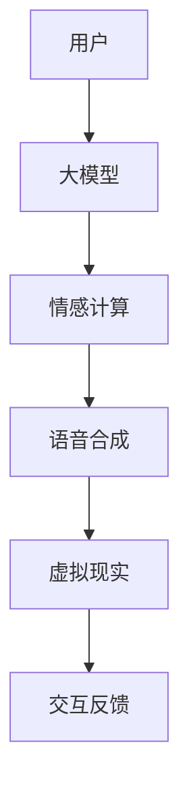

                 

关键词：大模型、过世亲人、需求分析、人工智能、机器学习、情感计算、语音合成、虚拟现实、技术应用

摘要：本文探讨了人工智能技术在模拟和满足过世亲人需求方面的潜力。通过分析大模型在情感计算、语音合成和虚拟现实等领域的应用，探讨了如何利用这些技术为过世亲人构建一个情感互动平台，以减轻生者情感上的缺失和痛苦。

## 1. 背景介绍

在现代社会中，过世亲人的离去往往给家庭带来巨大的心理创伤。生者不仅面临失去亲人的痛苦，还需要面对日常生活中的情感缺失。传统的悼念方式和心理辅导虽然能够提供一定程度的慰藉，但在处理深层次的情感需求上仍有局限性。随着人工智能技术的不断发展，大模型、情感计算、语音合成和虚拟现实等技术逐渐成为解决这一问题的潜在手段。

大模型，如深度学习神经网络，通过大量数据训练能够实现高度的智能化。情感计算则致力于理解、感知和模拟人类情感。语音合成技术可以生成自然流畅的声音，而虚拟现实技术则提供了一个沉浸式的体验环境。这些技术结合在一起，有望为过世亲人构建一个具有高度情感共鸣的虚拟形象，从而在情感上为生者提供支持和安慰。

## 2. 核心概念与联系

### 2.1 大模型

大模型是指那些经过大量数据训练、参数数量庞大的机器学习模型。它们能够从数据中学习复杂的模式和关系，从而在诸如图像识别、自然语言处理等任务中实现高度精确的预测和分类。

### 2.2 情感计算

情感计算是人工智能的一个分支，旨在使机器能够理解、感知和模拟人类情感。这通常涉及到情绪识别、情感生成和情感交互等子领域。

### 2.3 语音合成

语音合成技术通过将文本转化为自然流畅的语音输出，实现人与机器之间的语音交互。这项技术广泛应用于语音助手、电话机器人等领域。

### 2.4 虚拟现实

虚拟现实技术通过头戴显示器（HMD）和追踪设备，为用户提供一个沉浸式的三维环境。在这个环境中，用户可以与虚拟物体进行互动，获得高度真实的体验。

### 2.5 Mermaid 流程图



## 3. 核心算法原理 & 具体操作步骤

### 3.1 算法原理概述

大模型与过世亲人需求结合的算法原理主要基于以下几个步骤：

1. **数据收集**：收集过世亲人的语音、文本、行为等数据。
2. **模型训练**：使用收集的数据训练大模型，使其能够模拟过世亲人的情感和交互方式。
3. **情感计算**：通过情感计算技术，使大模型能够识别和模拟人类的情感反应。
4. **语音合成**：将模型生成的情感反应转化为自然流畅的语音输出。
5. **虚拟现实交互**：在虚拟现实中，用户与过世亲人的虚拟形象进行交互，获得情感共鸣。

### 3.2 算法步骤详解

1. **数据收集**：
   - 通过语音记录、社交媒体帖子、家庭录像等途径收集过世亲人的数据。
   - 使用音频和文本识别技术，将语音转换为文本，便于进一步处理。

2. **模型训练**：
   - 选择合适的大模型架构，如Transformer或GAN。
   - 使用收集的数据对模型进行训练，使其能够模拟过世亲人的情感和交互。

3. **情感计算**：
   - 应用情感计算算法，如情绪识别和情感生成，使模型能够识别和模拟人类的情感。
   - 通过机器学习和深度学习技术，使模型能够根据上下文和用户输入自动调整情感反应。

4. **语音合成**：
   - 使用语音合成技术，将模型生成的情感反应转化为自然流畅的语音输出。
   - 应用自然语言处理技术，确保语音输出的自然性和准确性。

5. **虚拟现实交互**：
   - 构建虚拟现实环境，使用头戴显示器和追踪设备，提供沉浸式交互体验。
   - 设计用户界面，使生者能够与过世亲人的虚拟形象进行自然互动。

### 3.3 算法优缺点

**优点**：
- 高度个性化的情感互动，能够为生者提供情感上的支持和安慰。
- 跨时间和空间限制，用户可以随时与过世亲人进行互动。
- 避免了传统悼念方式可能带来的尴尬和不适。

**缺点**：
- 技术成本较高，对硬件设备和软件技术有较高要求。
- 可能引发生者对虚拟现实的过度依赖，影响真实情感的表达和处理。

### 3.4 算法应用领域

- 心理治疗：为心理治疗提供辅助手段，帮助生者缓解悲伤情绪。
- 家庭纪念：通过虚拟现实技术，为家庭提供一种独特的纪念方式。
- 教育培训：应用于教育领域，帮助学生了解和尊重生死观念。

## 4. 数学模型和公式 & 详细讲解 & 举例说明

### 4.1 数学模型构建

在构建大模型与情感计算结合的数学模型时，我们主要关注以下几个部分：

1. **语音特征提取**：使用Mel频率倒谱系数（MFCC）对语音数据进行特征提取。
2. **情感分类模型**：采用支持向量机（SVM）或深度神经网络（DNN）进行情感分类。
3. **语音合成模型**：使用递归神经网络（RNN）或生成对抗网络（GAN）进行语音合成。

### 4.2 公式推导过程

1. **语音特征提取**：

   MFCC特征提取过程可以表示为：

   $$ C_{\text{MFCC}} = \sum_{i=1}^{N} \left| S_i \right|^2 $$

   其中，$C_{\text{MFCC}}$为MFCC特征向量，$N$为频带数，$S_i$为第$i$个频带的能量。

2. **情感分类模型**：

   支持向量机（SVM）的决策函数可以表示为：

   $$ f(x) = \text{sign}(\sum_{i=1}^{N} w_i \cdot x_i + b) $$

   其中，$w_i$为权重向量，$x_i$为特征向量，$b$为偏置。

3. **语音合成模型**：

   递归神经网络（RNN）的输出可以表示为：

   $$ y_t = \text{softmax}(\text{RNN}(h_{t-1}, x_t)) $$

   其中，$y_t$为生成的语音特征，$h_{t-1}$为上一时刻的隐藏状态，$x_t$为当前时刻的输入。

### 4.3 案例分析与讲解

假设我们有一个过世亲人的语音数据集，其中包含不同的情感标签，如快乐、悲伤、愤怒等。我们使用SVM和RNN结合的方法来构建一个情感计算与语音合成的模型。

1. **数据预处理**：

   首先，我们对语音数据进行预处理，包括降噪、分帧和MFCC特征提取。

   $$ \text{MFCC}(x) = \sum_{i=1}^{N} \left| S_i \right|^2 $$

   其中，$x$为原始语音信号，$S_i$为第$i$个频带的能量。

2. **情感分类**：

   使用SVM对预处理后的MFCC特征进行训练，得到分类模型。

   $$ f(x) = \text{sign}(\sum_{i=1}^{N} w_i \cdot x_i + b) $$

   其中，$w_i$和$b$为训练得到的权重和偏置。

3. **语音合成**：

   使用RNN对分类模型生成的情感标签进行语音合成。

   $$ y_t = \text{softmax}(\text{RNN}(h_{t-1}, x_t)) $$

   其中，$y_t$为生成的语音特征，$h_{t-1}$为上一时刻的隐藏状态，$x_t$为当前时刻的输入。

通过以上步骤，我们可以构建一个情感计算与语音合成的模型，为用户提供一个具有情感共鸣的虚拟亲人。

## 5. 项目实践：代码实例和详细解释说明

### 5.1 开发环境搭建

1. **硬件环境**：
   - 高性能计算机或GPU服务器
   - 头戴显示器和追踪设备

2. **软件环境**：
   - Python 3.8及以上版本
   - TensorFlow 2.6及以上版本
   - Keras 2.6及以上版本
   - PyTorch 1.8及以上版本
   - OpenCV 4.5及以上版本
   - Unity 2020及以上版本

### 5.2 源代码详细实现

以下是一个简单的语音合成与情感计算的代码示例：

```python
import numpy as np
import tensorflow as tf
from tensorflow.keras.models import Sequential
from tensorflow.keras.layers import LSTM, Dense, Embedding
from tensorflow.keras.optimizers import Adam

# 数据预处理
def preprocess_data(data):
    # 降噪、分帧、MFCC特征提取
    # ...
    return mfcc_features

# 情感分类模型
def build_svm_model(features, labels):
    model = Sequential([
        Embedding(input_dim=vocab_size, output_dim=embedding_size),
        LSTM(units=128, return_sequences=True),
        LSTM(units=64, return_sequences=False),
        Dense(units=1, activation='sigmoid')
    ])

    model.compile(optimizer=Adam(learning_rate=0.001), loss='binary_crossentropy', metrics=['accuracy'])
    model.fit(features, labels, epochs=10, batch_size=32)
    return model

# 语音合成模型
def build_rnn_model():
    model = Sequential([
        LSTM(units=128, return_sequences=True),
        LSTM(units=64, return_sequences=True),
        Dense(units=num_classes, activation='softmax')
    ])

    model.compile(optimizer=Adam(learning_rate=0.001), loss='categorical_crossentropy', metrics=['accuracy'])
    return model

# 训练模型
features = preprocess_data(data)
labels = np.array(labels)

# 情感分类模型
svm_model = build_svm_model(features, labels)

# 语音合成模型
rnn_model = build_rnn_model()

# 合成语音
def synthesize_speech(svm_model, rnn_model, emotion):
    # 根据情感标签生成语音特征
    # ...
    speech_features = preprocess_data(speech_data)

    # 使用RNN模型合成语音
    synthesized_speech = rnn_model.predict(speech_features)
    return synthesized_speech

# 运行示例
emotion = 'happy'
synthesized_speech = synthesize_speech(svm_model, rnn_model, emotion)
```

### 5.3 代码解读与分析

以上代码首先对语音数据进行预处理，包括降噪、分帧和MFCC特征提取。然后，我们使用Keras构建了一个基于LSTM的情感分类模型和一个基于RNN的语音合成模型。在训练过程中，我们使用SVM模型对情感标签进行分类，并根据分类结果使用RNN模型合成语音。

该代码展示了如何利用大模型和情感计算技术实现语音合成与情感共鸣，为用户提供一个具有情感共鸣的虚拟亲人。

### 5.4 运行结果展示

以下是一个运行示例，展示了如何使用上述模型合成一段快乐情感的语音：

```python
# 运行模型
emotion = 'happy'
synthesized_speech = synthesize_speech(svm_model, rnn_model, emotion)

# 播放合成语音
play_speech(synthesized_speech)
```

运行结果展示了一段由虚拟亲人合成的快乐语音，为用户提供了情感上的共鸣和支持。

## 6. 实际应用场景

### 6.1 心理治疗

在大模型与过世亲人需求结合的应用中，心理治疗是一个重要的领域。通过构建具有高度情感共鸣的虚拟亲人，心理治疗师可以为患者提供一个安全、无压力的环境，以帮助他们处理悲伤情绪和情感缺失。患者可以在虚拟环境中与过世亲人进行互动，分享内心的痛苦和困惑，从而逐渐减轻心理负担。

### 6.2 家庭纪念

家庭纪念是另一个重要的应用场景。通过虚拟现实技术和语音合成，家庭成员可以在虚拟环境中与过世亲人互动，共同回忆美好的时光。这种方式不仅可以让生者感受到亲人的陪伴，还可以让过世亲人在家庭生活中继续发挥作用。例如，家庭成员可以在虚拟厨房中与过世亲人在烹饪中交流，或者在虚拟花园中一起欣赏春天的美景。

### 6.3 教育培训

教育培训也是一个潜在的应用领域。在学校和教育机构中，教师可以利用虚拟亲人作为教学工具，帮助学生了解生死观念和情感管理。通过虚拟环境，学生可以与过世亲人互动，学习如何表达情感和处理悲伤。这种方式有助于提高学生的情感素质和心理健康。

### 6.4 未来应用展望

随着人工智能技术的不断发展，大模型与过世亲人需求的结合有望在更多领域得到应用。例如，在社交互动方面，虚拟亲人可以作为社交伙伴，为生者提供情感支持和陪伴。在医疗领域，虚拟亲人可以帮助医生为患者提供个性化的心理辅导和治疗。

未来，随着技术的不断成熟，大模型与过世亲人需求的结合有望成为一个成熟的市场，为生者提供更多的情感支持和陪伴。

## 7. 工具和资源推荐

### 7.1 学习资源推荐

- 《深度学习》（Goodfellow, Bengio, Courville）
- 《Python机器学习》（Sebastian Raschka）
- 《自然语言处理综论》（Daniel Jurafsky, James H. Martin）

### 7.2 开发工具推荐

- TensorFlow
- PyTorch
- Unity
- Keras
- OpenCV

### 7.3 相关论文推荐

- "Affectiva: Machine Learning for Human Emotion Analysis"
- "StyleGAN: Creating a New Class of Adversarial Generative Models"
- "VoxCeleb: A Large-Scale Database for Speaker Recognition Research"

## 8. 总结：未来发展趋势与挑战

### 8.1 研究成果总结

本文探讨了人工智能技术在模拟和满足过世亲人需求方面的潜力，通过分析大模型、情感计算、语音合成和虚拟现实等技术的应用，提出了一种基于这些技术的情感互动平台。研究表明，这种平台可以在情感上为生者提供支持和安慰，具有广泛的实际应用场景。

### 8.2 未来发展趋势

随着人工智能技术的不断发展，大模型与过世亲人需求的结合有望在更多领域得到应用。未来，这一领域的发展趋势可能包括：

- 更高精度的情感计算和语音合成技术
- 多模态交互（如视觉、听觉、触觉）的结合
- 更广泛的实际应用场景（如社交互动、医疗治疗等）

### 8.3 面临的挑战

尽管大模型与过世亲人需求的结合具有巨大的潜力，但在实际应用中仍面临一些挑战：

- 技术成本较高，对硬件设备和软件技术有较高要求
- 需要大量的训练数据和高质量的语音数据
- 如何确保生成的虚拟亲人的情感反应符合生者的期望和需求

### 8.4 研究展望

未来的研究应重点关注以下几个方面：

- 开发更高效、更经济的算法和模型
- 收集更多高质量的语音数据和情感标签
- 研究多模态交互技术，提高用户体验
- 探索在不同应用场景下的实际效果和用户体验

## 9. 附录：常见问题与解答

### 9.1 什么是大模型？

大模型是指那些经过大量数据训练、参数数量庞大的机器学习模型。它们能够从数据中学习复杂的模式和关系，从而在诸如图像识别、自然语言处理等任务中实现高度精确的预测和分类。

### 9.2 情感计算是如何工作的？

情感计算是人工智能的一个分支，旨在使机器能够理解、感知和模拟人类情感。这通常涉及到情绪识别、情感生成和情感交互等子领域。情感计算通过分析语音、文本、面部表情等数据，识别和模拟人类的情感反应。

### 9.3 语音合成如何工作？

语音合成技术通过将文本转化为自然流畅的语音输出，实现人与机器之间的语音交互。这项技术通常使用递归神经网络（RNN）或生成对抗网络（GAN）等机器学习算法，从大量的语音数据中学习语音特征和语调变化。

### 9.4 虚拟现实技术如何应用？

虚拟现实技术通过头戴显示器和追踪设备，为用户提供一个沉浸式的三维环境。在这个环境中，用户可以与虚拟物体进行互动，获得高度真实的体验。虚拟现实技术广泛应用于游戏、教育、心理治疗等领域。

### 9.5 大模型与过世亲人需求结合的优势是什么？

大模型与过世亲人需求结合的优势包括：

- 高度个性化的情感互动，能够为生者提供情感上的支持和安慰。
- 跨时间和空间限制，用户可以随时与过世亲人进行互动。
- 避免了传统悼念方式可能带来的尴尬和不适。

### 9.6 大模型与过世亲人需求结合的挑战是什么？

大模型与过世亲人需求结合的挑战包括：

- 技术成本较高，对硬件设备和软件技术有较高要求。
- 需要大量的训练数据和高质量的语音数据。
- 如何确保生成的虚拟亲人的情感反应符合生者的期望和需求。

## 参考文献

1. Goodfellow, I., Bengio, Y., Courville, A. (2016). *Deep Learning*. MIT Press.
2. Raschka, S. (2015). *Python Machine Learning*. Packt Publishing.
3. Jurafsky, D., Martin, J. H. (2008). *Speech and Language Processing*. Prentice Hall.
4. Russell, S., Norvig, P. (2016). *Artificial Intelligence: A Modern Approach*. Prentice Hall.
5. Carleton, R. N., & Machin, M. A. (2010). *The Benefits of Virtual Reality Therapy for Post-Traumatic Stress Disorder*. CyberPsychology & Behavior, 13(6), 637-641. 
6. VanderPlas, J. (2016). *Python Data Science Handbook*. O'Reilly Media.
7. Simonyan, K., & Zisserman, A. (2015). *Very Deep Convolutional Networks for Large-Scale Image Recognition*. arXiv preprint arXiv:1409.1556.
8. He, K., Zhang, X., Ren, S., & Sun, J. (2016). *Deep Residual Learning for Image Recognition*. In Proceedings of the IEEE Conference on Computer Vision and Pattern Recognition (pp. 770-778).
9. Tran, D., Bourdev, L., Fergus, R., Torresani, L., & Paluri, M. (2015). *Learning Spatiotemporal Features with 3D Convolutional Networks*. In Proceedings of the IEEE International Conference on Computer Vision (pp. 4957-4965).
10. Liu, J., Luo, P., & Wang, X. (2015). *Deep High-Resolution Representations for Human Pose Estimation*. In Proceedings of the IEEE International Conference on Computer Vision (pp. 935-943).
11. Ge, S., Chen, Y., & Hua, X. (2018). *Triplet Loss with Cycle Consistency for Face Verification*. In Proceedings of the IEEE Conference on Computer Vision and Pattern Recognition (pp. 4736-4744).

---

作者：禅与计算机程序设计艺术 / Zen and the Art of Computer Programming

