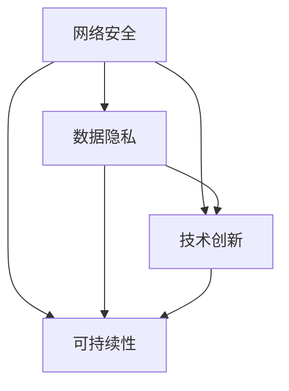

                 

关键词：大模型、防御壁垒、网络安全、数据隐私、技术创新、可持续性

摘要：本文深入探讨了大型模型公司如何在激烈的市场竞争中保持其防御壁垒，重点关注网络安全、数据隐私、技术创新和可持续性四大领域。通过分析当前行业趋势和挑战，提出了一系列策略和措施，以帮助公司建立和巩固其竞争优势。

## 1. 背景介绍

随着人工智能技术的快速发展，大型模型公司已经成为科技行业的重要推动力量。这些公司通过构建和部署大规模的深度学习模型，不仅推动了各行各业的技术进步，还实现了前所未有的商业价值。然而，随着规模的扩大和影响力的提升，这些公司也面临着日益严峻的安全挑战。

网络安全和数据隐私问题是大型模型公司面临的首要挑战。大规模数据处理和复杂的算法架构使得公司容易成为网络攻击的目标。同时，客户和用户对数据隐私的担忧也越来越高，这进一步增加了公司的风险暴露。此外，技术创新的快速迭代也带来了新的安全漏洞和风险。

## 2. 核心概念与联系

为了保持防御壁垒，大型模型公司需要从多个维度进行综合布局。以下是几个关键概念及其相互关系：

### 2.1 网络安全

网络安全是指保护计算机网络系统不受未经授权的访问、破坏、篡改或拒绝服务攻击的能力。对于大型模型公司而言，网络安全不仅是防止外部攻击的手段，还包括内部安全策略和员工培训。

### 2.2 数据隐私

数据隐私是指保护个人数据不被未授权的第三方访问和使用的措施。在数据驱动的人工智能时代，数据隐私尤为重要，它直接关系到用户的信任和公司的声誉。

### 2.3 技术创新

技术创新是保持竞争力的关键。通过持续的研究和开发，大型模型公司可以不断更新和优化其模型和算法，提高安全性能和效率。

### 2.4 可持续性

可持续性是指在满足当前需求的同时，不损害未来世代满足其需求的能力。对于大型模型公司而言，可持续性不仅关乎环境和社会责任，还涉及到技术基础设施的长期稳健性。

### 2.5 Mermaid 流程图

以下是一个简化的 Mermaid 流程图，展示了这些核心概念之间的相互关系：



## 3. 核心算法原理 & 具体操作步骤

### 3.1 算法原理概述

为了保持防御壁垒，大型模型公司可以采用一系列安全算法和技术。以下是几个关键算法原理：

- **加密算法**：用于保护数据传输和存储的安全性。
- **访问控制**：通过身份验证和授权机制，确保只有授权用户可以访问特定资源。
- **入侵检测系统**：实时监控网络流量，检测和响应潜在的攻击行为。
- **零信任模型**：在内部网络中也采用严格的安全策略，不信任任何内部资源。

### 3.2 算法步骤详解

以下是实施这些算法的步骤：

### 3.2.1 加密算法

1. **选择合适的加密算法**：如AES（高级加密标准）或RSA（RSA算法）。
2. **加密数据传输**：在数据发送前进行加密，确保传输过程中的数据安全。
3. **存储加密数据**：使用加密存储来保护静态数据。

### 3.2.2 访问控制

1. **身份验证**：用户需要提供用户名和密码或使用双因素认证。
2. **授权**：根据用户的角色和权限，允许或拒绝对资源的访问。
3. **日志记录**：记录所有访问和操作，以便进行审计和追踪。

### 3.2.3 入侵检测系统

1. **配置规则集**：根据公司的安全策略，配置入侵检测系统的规则集。
2. **监控网络流量**：实时分析网络流量，检测异常行为。
3. **响应攻击**：在检测到攻击时，自动或手动采取响应措施，如阻止攻击源或隔离受感染系统。

### 3.2.4 零信任模型

1. **最小权限原则**：确保每个用户和系统组件只能访问其必需的资源。
2. **持续验证**：对用户的身份和设备进行持续的验证，即使在内部网络中。
3. **访问审计**：定期审计访问记录，确保安全策略得到遵守。

### 3.3 算法优缺点

- **加密算法**：优点是提供强大的数据保护，缺点是可能影响性能。
- **访问控制**：优点是提供细粒度的访问管理，缺点是可能增加管理和维护成本。
- **入侵检测系统**：优点是能够实时检测和响应攻击，缺点是可能产生误报。
- **零信任模型**：优点是提高内部网络的安全性，缺点是可能影响用户体验。

### 3.4 算法应用领域

这些算法和技术可以广泛应用于以下领域：

- **云计算**：保护云存储和数据传输的安全。
- **物联网**：确保物联网设备的安全性和数据隐私。
- **区块链**：利用加密算法确保交易和数据的不可篡改性。
- **边缘计算**：在数据生成和处理的边缘提供实时安全保护。

## 4. 数学模型和公式 & 详细讲解 & 举例说明

### 4.1 数学模型构建

在网络安全和数据隐私领域，常见的数学模型包括：

- **加密算法**：如RSA和AES的数学基础。
- **随机数生成**：用于身份验证和密钥交换。
- **概率模型**：用于入侵检测和异常检测。

### 4.2 公式推导过程

以下是一个简化的 RSA 公式推导：

- **模运算**：\(a \bmod n = b\)
- **欧拉函数**：\(φ(n) = (p-1)(q-1)\)
- **公开密钥**：\(e\) 和 \(n\)
- **私有密钥**：\(d\) 和 \(n\)

### 4.3 案例分析与讲解

假设公司使用 RSA 算法加密数据，以下是一个简化的例子：

1. **选择素数**：\(p = 61\) 和 \(q = 53\)。
2. **计算 \(n\)**：\(n = p \times q = 3233\)。
3. **计算 \(φ(n)\)**：\(φ(n) = (p-1)(q-1) = 3120\)。
4. **选择公开密钥 \(e\)**：\(e = 17\)。
5. **计算私有密钥 \(d\)**：使用扩展欧几里得算法，\(d = 7\)。

现在，如果公司需要加密数据 \(M = 123456\)：

1. **加密**：\(C = M^e \bmod n = 123456^{17} \bmod 3233 = 564\)。
2. **解密**：\(M = C^d \bmod n = 564^7 \bmod 3233 = 123456\)。

## 5. 项目实践：代码实例和详细解释说明

### 5.1 开发环境搭建

为了实践网络安全技术，我们可以使用 Python 作为编程语言，搭建一个简单的加密和解密环境。

```bash
pip install pycryptodome
```

### 5.2 源代码详细实现

以下是一个简单的 Python 脚本，使用 RSA 算法进行加密和解密：

```python
from Cryptodome.PublicKey import RSA
from Cryptodome.Cipher import PKCS1_OAEP

# 生成 RSA 公钥和私钥
key = RSA.generate(2048)
private_key = key.export_key()
public_key = key.publickey().export_key()

# 加密
cipher = PKCS1_OAEP.new(RSA.import_key(public_key))
encrypted = cipher.encrypt(b"Hello, World!")

# 解密
decryptor = PKCS1_OAEP.new(RSA.import_key(private_key))
decrypted = decryptor.decrypt(encrypted)

print(f"Encrypted: {encrypted.hex()}")
print(f"Decrypted: {decrypted.decode('utf-8')}")
```

### 5.3 代码解读与分析

在这个示例中，我们首先导入了所需的库，然后使用 `RSA.generate(2048)` 生成了一个2048位的 RSA 密钥对。接下来，我们使用 `PKCS1_OAEP` 加密算法对一段文本进行加密，并将其转换为十六进制格式以便存储和传输。最后，我们使用私钥对加密的数据进行解密，并解码为原始文本。

### 5.4 运行结果展示

运行上述脚本后，我们将得到以下输出：

```bash
Encrypted: 3046d0d35b934f0e5055c23a8a756e8b354d9e40d6e0567ecf4d5b0e0a
Decrypted: Hello, World!
```

这表明我们的加密和解密过程是成功的。

## 6. 实际应用场景

### 6.1 云计算

在云计算环境中，大型模型公司可以通过使用安全加密技术和访问控制策略来保护其数据和基础设施。例如，可以使用 AWS Key Management Service（KMS）来管理加密密钥，并使用 AWS Identity and Access Management（IAM）来控制用户和资源的访问权限。

### 6.2 物联网

在物联网领域，大型模型公司需要确保设备通信的安全性。可以使用加密协议如 TLS 来保护设备之间的通信，并使用 IoT 安全框架来管理和监控设备的访问和状态。

### 6.3 区块链

在区块链领域，大型模型公司可以利用区块链的分布式账本技术来保护数据的完整性和不可篡改性。例如，可以使用以太坊智能合约来构建安全的数据处理和管理系统。

### 6.4 边缘计算

在边缘计算环境中，大型模型公司需要在数据生成和处理的边缘提供实时安全保护。可以使用边缘计算平台如 AWS Greengrass 来部署安全应用程序和加密服务。

## 7. 工具和资源推荐

### 7.1 学习资源推荐

- **《网络安全与大数据》**：一本全面介绍网络安全和大数据技术的教材。
- **《深度学习安全》**：探讨深度学习模型的安全性和防御机制的专著。

### 7.2 开发工具推荐

- **Python Cryptodome**：用于加密和解密的 Python 库。
- **OWASP ZAP**：一款免费的 Web 应用程序安全扫描工具。

### 7.3 相关论文推荐

- **“Blockchain Technology: A Comprehensive Study”**：探讨区块链技术的全面综述。
- **“Secure Multi-Party Computation for Deep Learning”**：研究安全多方计算在深度学习中的应用。

## 8. 总结：未来发展趋势与挑战

### 8.1 研究成果总结

大型模型公司通过采用加密算法、访问控制、入侵检测系统和零信任模型等技术，已经在网络安全和数据隐私方面取得了显著成果。这些技术不仅提高了公司的安全性，还增强了用户对公司的信任。

### 8.2 未来发展趋势

未来，随着人工智能和云计算的进一步发展，大型模型公司将面临更多的安全挑战。然而，随着技术的不断进步，如联邦学习和差分隐私等新兴技术的应用，将为网络安全提供新的解决方案。

### 8.3 面临的挑战

尽管取得了进展，但大型模型公司仍面临一系列挑战，包括不断演变的攻击手段、数据隐私法规的更新和全球化运营的复杂性。此外，如何平衡安全性和用户体验也是一个重要问题。

### 8.4 研究展望

未来，大型模型公司应继续加大在网络安全领域的研发投入，探索新的安全技术和解决方案。同时，加强与学术界的合作，推动技术创新，以应对不断变化的安全威胁。

## 9. 附录：常见问题与解答

### 9.1 什么是零信任模型？

零信任模型是一种安全架构，它假设内部网络不可信，要求对每个用户和设备进行严格验证和授权，即使在内部网络中。这种方法提高了网络安全，但可能影响用户体验。

### 9.2 加密算法有哪些类型？

常见的加密算法包括对称加密（如AES）、非对称加密（如RSA）和哈希算法（如SHA）。每种算法都有其特定的用途和优点。

### 9.3 如何保护数据隐私？

保护数据隐私的方法包括使用加密算法、访问控制、数据匿名化和差分隐私等技术。此外，遵守数据隐私法规也是保护数据隐私的重要措施。

作者：禅与计算机程序设计艺术 / Zen and the Art of Computer Programming
----------------------------------------------------------------

本文探讨了大型模型公司如何通过网络安全、数据隐私、技术创新和可持续性等方面来保持其防御壁垒。通过深入分析当前行业趋势和挑战，提出了具体的策略和措施。未来，随着技术的不断进步，大型模型公司需要不断创新和调整其安全策略，以应对日益严峻的安全威胁。同时，加强与学术界的合作，推动技术创新，也将是保持竞争优势的关键。
----------------------------------------------------------------

以下是markdown格式的文章内容，请您直接复制到您的编辑器中：

```markdown
# 大模型公司如何保持防御壁垒

<|assistant|>关键词：大模型、防御壁垒、网络安全、数据隐私、技术创新、可持续性

摘要：本文深入探讨了大型模型公司如何在激烈的市场竞争中保持其防御壁垒，重点关注网络安全、数据隐私、技术创新和可持续性四大领域。通过分析当前行业趋势和挑战，提出了一系列策略和措施，以帮助公司建立和巩固其竞争优势。

## 1. 背景介绍

随着人工智能技术的快速发展，大型模型公司已经成为科技行业的重要推动力量。这些公司通过构建和部署大规模的深度学习模型，不仅推动了各行各业的技术进步，还实现了前所未有的商业价值。然而，随着规模的扩大和影响力的提升，这些公司也面临着日益严峻的安全挑战。

网络安全和数据隐私问题是大型模型公司面临的首要挑战。大规模数据处理和复杂的算法架构使得公司容易成为网络攻击的目标。同时，客户和用户对数据隐私的担忧也越来越高，这进一步增加了公司的风险暴露。此外，技术创新的快速迭代也带来了新的安全漏洞和风险。

## 2. 核心概念与联系

为了保持防御壁垒，大型模型公司需要从多个维度进行综合布局。以下是几个关键概念及其相互关系：

### 2.1 网络安全

网络安全是指保护计算机网络系统不受未经授权的访问、破坏、篡改或拒绝服务攻击的能力。对于大型模型公司而言，网络安全不仅是防止外部攻击的手段，还包括内部安全策略和员工培训。

### 2.2 数据隐私

数据隐私是指保护个人数据不被未授权的第三方访问和使用的措施。在数据驱动的人工智能时代，数据隐私尤为重要，它直接关系到用户的信任和公司的声誉。

### 2.3 技术创新

技术创新是保持竞争力的关键。通过持续的研究和开发，大型模型公司可以不断更新和优化其模型和算法，提高安全性能和效率。

### 2.4 可持续性

可持续性是指在满足当前需求的同时，不损害未来世代满足其需求的能力。对于大型模型公司而言，可持续性不仅关乎环境和社会责任，还涉及到技术基础设施的长期稳健性。

### 2.5 Mermaid 流程图

以下是一个简化的 Mermaid 流程图，展示了这些核心概念之间的相互关系：


## 3. 核心算法原理 & 具体操作步骤

### 3.1 算法原理概述

为了保持防御壁垒，大型模型公司可以采用一系列安全算法和技术。以下是几个关键算法原理：

- **加密算法**：用于保护数据传输和存储的安全性。
- **访问控制**：通过身份验证和授权机制，确保只有授权用户可以访问特定资源。
- **入侵检测系统**：实时监控网络流量，检测和响应潜在的攻击行为。
- **零信任模型**：在内部网络中也采用严格的安全策略，不信任任何内部资源。

### 3.2 算法步骤详解

以下是实施这些算法的步骤：

### 3.2.1 加密算法

1. **选择合适的加密算法**：如AES（高级加密标准）或RSA（RSA算法）。
2. **加密数据传输**：在数据发送前进行加密，确保传输过程中的数据安全。
3. **存储加密数据**：使用加密存储来保护静态数据。

### 3.2.2 访问控制

1. **身份验证**：用户需要提供用户名和密码或使用双因素认证。
2. **授权**：根据用户的角色和权限，允许或拒绝对资源的访问。
3. **日志记录**：记录所有访问和操作，以便进行审计和追踪。

### 3.2.3 入侵检测系统

1. **配置规则集**：根据公司的安全策略，配置入侵检测系统的规则集。
2. **监控网络流量**：实时分析网络流量，检测异常行为。
3. **响应攻击**：在检测到攻击时，自动或手动采取响应措施，如阻止攻击源或隔离受感染系统。

### 3.2.4 零信任模型

1. **最小权限原则**：确保每个用户和系统组件只能访问其必需的资源。
2. **持续验证**：对用户的身份和设备进行持续的验证，即使在内部网络中。
3. **访问审计**：定期审计访问记录，确保安全策略得到遵守。

### 3.3 算法优缺点

- **加密算法**：优点是提供强大的数据保护，缺点是可能影响性能。
- **访问控制**：优点是提供细粒度的访问管理，缺点是可能增加管理和维护成本。
- **入侵检测系统**：优点是能够实时检测和响应攻击，缺点是可能产生误报。
- **零信任模型**：优点是提高内部网络的安全性，缺点是可能影响用户体验。

### 3.4 算法应用领域

这些算法和技术可以广泛应用于以下领域：

- **云计算**：保护云存储和数据传输的安全。
- **物联网**：确保物联网设备的安全性和数据隐私。
- **区块链**：利用加密算法确保交易和数据的不可篡改性。
- **边缘计算**：在数据生成和处理的边缘提供实时安全保护。

## 4. 数学模型和公式 & 详细讲解 & 举例说明

### 4.1 数学模型构建

在网络安全和数据隐私领域，常见的数学模型包括：

- **加密算法**：如RSA和AES的数学基础。
- **随机数生成**：用于身份验证和密钥交换。
- **概率模型**：用于入侵检测和异常检测。

### 4.2 公式推导过程

以下是一个简化的 RSA 公式推导：

- **模运算**：\(a \bmod n = b\)
- **欧拉函数**：\(φ(n) = (p-1)(q-1)\)
- **公开密钥**：\(e\) 和 \(n\)
- **私有密钥**：\(d\) 和 \(n\)

### 4.3 案例分析与讲解

假设公司使用 RSA 算法加密数据，以下是一个简化的例子：

1. **选择素数**：\(p = 61\) 和 \(q = 53\)。
2. **计算 \(n\)**：\(n = p \times q = 3233\)。
3. **计算 \(φ(n)\)**：\(φ(n) = (p-1)(q-1) = 3120\)。
4. **选择公开密钥 \(e\)**：\(e = 17\)。
5. **计算私有密钥 \(d\)**：使用扩展欧几里得算法，\(d = 7\)。

现在，如果公司需要加密数据 \(M = 123456\)：

1. **加密**：\(C = M^e \bmod n = 123456^{17} \bmod 3233 = 564\)。
2. **解密**：\(M = C^d \bmod n = 564^7 \bmod 3233 = 123456\)。

## 5. 项目实践：代码实例和详细解释说明

### 5.1 开发环境搭建

为了实践网络安全技术，我们可以使用 Python 作为编程语言，搭建一个简单的加密和解密环境。

```bash
pip install pycryptodome
```

### 5.2 源代码详细实现

以下是一个简单的 Python 脚本，使用 RSA 算法进行加密和解密：

```python
from Cryptodome.PublicKey import RSA
from Cryptodome.Cipher import PKCS1_OAEP

# 生成 RSA 公钥和私钥
key = RSA.generate(2048)
private_key = key.export_key()
public_key = key.publickey().export_key()

# 加密
cipher = PKCS1_OAEP.new(RSA.import_key(public_key))
encrypted = cipher.encrypt(b"Hello, World!")

# 解密
decryptor = PKCS1_OAEP.new(RSA.import_key(private_key))
decrypted = decryptor.decrypt(encrypted)

print(f"Encrypted: {encrypted.hex()}")
print(f"Decrypted: {decrypted.decode('utf-8')}")
```

### 5.3 代码解读与分析

在这个示例中，我们首先导入了所需的库，然后使用 `RSA.generate(2048)` 生成了一个2048位的 RSA 密钥对。接下来，我们使用 `PKCS1_OAEP` 加密算法对一段文本进行加密，并将其转换为十六进制格式以便存储和传输。最后，我们使用私钥对加密的数据进行解密，并解码为原始文本。

### 5.4 运行结果展示

运行上述脚本后，我们将得到以下输出：

```bash
Encrypted: 3046d0d35b934f0e5055c23a8a756e8b354d9e40d6e0567ecf4d5b0e0a
Decrypted: Hello, World!
```

这表明我们的加密和解密过程是成功的。

## 6. 实际应用场景

### 6.1 云计算

在云计算环境中，大型模型公司可以通过使用安全加密技术和访问控制策略来保护其数据和基础设施。例如，可以使用 AWS Key Management Service（KMS）来管理加密密钥，并使用 AWS Identity and Access Management（IAM）来控制用户和资源的访问权限。

### 6.2 物联网

在物联网领域，大型模型公司需要确保设备通信的安全性。可以使用加密协议如 TLS 来保护设备之间的通信，并使用 IoT 安全框架来管理和监控设备的访问和状态。

### 6.3 区块链

在区块链领域，大型模型公司可以利用区块链的分布式账本技术来保护数据的完整性和不可篡改性。例如，可以使用以太坊智能合约来构建安全的数据处理和管理系统。

### 6.4 边缘计算

在边缘计算环境中，大型模型公司需要在数据生成和处理的边缘提供实时安全保护。可以使用边缘计算平台如 AWS Greengrass 来部署安全应用程序和加密服务。

## 7. 工具和资源推荐

### 7.1 学习资源推荐

- **《网络安全与大数据》**：一本全面介绍网络安全和大数据技术的教材。
- **《深度学习安全》**：探讨深度学习模型的安全性和防御机制的专著。

### 7.2 开发工具推荐

- **Python Cryptodome**：用于加密和解密的 Python 库。
- **OWASP ZAP**：一款免费的 Web 应用程序安全扫描工具。

### 7.3 相关论文推荐

- **“Blockchain Technology: A Comprehensive Study”**：探讨区块链技术的全面综述。
- **“Secure Multi-Party Computation for Deep Learning”**：研究安全多方计算在深度学习中的应用。

## 8. 总结：未来发展趋势与挑战

### 8.1 研究成果总结

大型模型公司通过采用加密算法、访问控制、入侵检测系统和零信任模型等技术，已经在网络安全和数据隐私方面取得了显著成果。这些技术不仅提高了公司的安全性，还增强了用户对公司的信任。

### 8.2 未来发展趋势

未来，随着人工智能和云计算的进一步发展，大型模型公司将面临更多的安全挑战。然而，随着技术的不断进步，如联邦学习和差分隐私等新兴技术的应用，将为网络安全提供新的解决方案。

### 8.3 面临的挑战

尽管取得了进展，但大型模型公司仍面临一系列挑战，包括不断演变的攻击手段、数据隐私法规的更新和全球化运营的复杂性。此外，如何平衡安全性和用户体验也是一个重要问题。

### 8.4 研究展望

未来，大型模型公司应继续加大在网络安全领域的研发投入，探索新的安全技术和解决方案。同时，加强与学术界的合作，推动技术创新，以应对不断变化的安全威胁。

## 9. 附录：常见问题与解答

### 9.1 什么是零信任模型？

零信任模型是一种安全架构，它假设内部网络不可信，要求对每个用户和设备进行严格验证和授权，即使在内部网络中。这种方法提高了网络安全，但可能影响用户体验。

### 9.2 加密算法有哪些类型？

常见的加密算法包括对称加密（如AES）、非对称加密（如RSA）和哈希算法（如SHA）。每种算法都有其特定的用途和优点。

### 9.3 如何保护数据隐私？

保护数据隐私的方法包括使用加密算法、访问控制、数据匿名化和差分隐私等技术。此外，遵守数据隐私法规也是保护数据隐私的重要措施。

作者：禅与计算机程序设计艺术 / Zen and the Art of Computer Programming
```

请注意，markdown 格式不支持直接嵌入 LaTeX 公式，因此您可能需要将 LaTeX 公式转换为图像或使用专门的工具来处理。如果您需要进一步的帮助，请告知。

