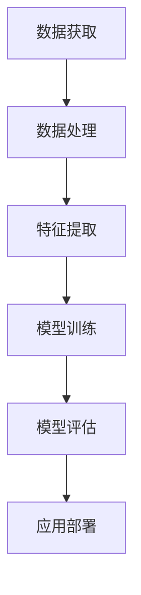

                 

关键词：大模型创业、理性分析、技术挑战、商业模式、未来展望

摘要：近年来，大模型在人工智能领域引起了广泛关注和投资热潮。然而，在狂热的背后，我们需要冷静思考大模型创业的可行性和面临的技术挑战。本文将探讨大模型创业从狂热到理性的转变，分析其核心概念、算法原理、数学模型以及实际应用，并展望未来的发展趋势与挑战。

## 1. 背景介绍

随着计算能力的提升和大数据的积累，深度学习技术在图像识别、自然语言处理、推荐系统等领域取得了显著突破。大模型作为深度学习的代表，具有强大的表征能力和广泛的应用前景。从GPT-3到BERT，大模型的规模和复杂性不断增大，吸引了众多创业公司和投资者的关注。

然而，在狂热的背后，我们也需要冷静思考大模型创业的可行性和面临的技术挑战。本文旨在探讨大模型创业从狂热到理性的转变，帮助读者更好地理解这一领域的发展趋势和机遇与挑战。

## 2. 核心概念与联系

大模型的核心在于其大规模和复杂性，通常需要数百GB甚至数TB的数据进行训练。以下是关于大模型的一些核心概念和联系，我们将使用Mermaid流程图进行展示。



### 2.1 数据获取

数据获取是大模型的基石，主要包括公开数据集、企业数据合作和数据爬取。数据质量和多样性对模型性能具有重要影响。

### 2.2 数据处理

数据处理包括数据清洗、归一化和数据增强等步骤。数据预处理的质量直接影响模型的训练效率和效果。

### 2.3 特征提取

特征提取是从原始数据中提取对模型训练有用的特征。在大模型中，特征提取通常使用复杂的神经网络结构。

### 2.4 模型训练

模型训练是构建大模型的核心步骤，包括前向传播、反向传播和优化算法等。训练过程需要大量的计算资源和时间。

### 2.5 模型评估

模型评估是对训练好的模型进行性能评估，包括准确率、召回率、F1值等指标。评估结果直接影响模型的应用效果。

### 2.6 应用部署

应用部署是将模型部署到实际应用场景中，包括部署环境、API接口和用户界面等。应用部署需要考虑模型的性能、可扩展性和安全性。

## 3. 核心算法原理 & 具体操作步骤

### 3.1 算法原理概述

大模型的算法原理主要基于深度学习和神经网络。深度学习通过多层的神经网络结构对数据进行层次化的特征提取和表示，从而实现复杂的任务。以下是神经网络的基本原理：

### 3.2 算法步骤详解

1. **数据预处理**：对数据进行清洗、归一化和数据增强等处理，提高数据质量和多样性。
2. **构建模型**：使用神经网络框架（如TensorFlow、PyTorch等）构建大模型结构。
3. **训练模型**：使用大量数据进行模型训练，通过前向传播和反向传播优化模型参数。
4. **模型评估**：使用验证集对训练好的模型进行性能评估，调整模型结构和参数。
5. **应用部署**：将训练好的模型部署到实际应用场景中，提供API接口或用户界面。

### 3.3 算法优缺点

- **优点**：大模型具有强大的表征能力和泛化能力，能够处理复杂的任务和海量数据。
- **缺点**：大模型需要大量的计算资源和时间进行训练，并且对数据质量和多样性有较高要求。

### 3.4 算法应用领域

大模型在图像识别、自然语言处理、推荐系统等领域具有广泛的应用。例如，GPT-3在自然语言生成和翻译方面取得了显著成果，BERT在文本分类和情感分析方面具有较高准确率。

## 4. 数学模型和公式 & 详细讲解 & 举例说明

### 4.1 数学模型构建

大模型通常使用深度学习框架构建，其中涉及到的数学模型主要包括神经网络、反向传播和优化算法等。以下是神经网络的基本数学模型：

### 4.2 公式推导过程

$$
\begin{aligned}
\text{输出} &= \text{激活函数}(\text{权重} \cdot \text{输入} + \text{偏置}) \\
\text{梯度} &= \text{激活函数}(\text{权重} \cdot \text{输入} + \text{偏置}) \cdot \text{输入} \\
\text{权重更新} &= \text{权重} - \text{学习率} \cdot \text{梯度} \\
\end{aligned}
$$

### 4.3 案例分析与讲解

假设我们使用神经网络对一张图像进行分类，输入图像的维度为$32 \times 32$，输出类别有10个。我们可以使用以下步骤进行训练：

1. **初始化模型参数**：随机初始化权重和偏置。
2. **前向传播**：计算输入图像经过神经网络后的输出。
3. **计算损失函数**：使用交叉熵损失函数计算输出与真实标签之间的差异。
4. **反向传播**：计算损失函数关于模型参数的梯度。
5. **权重更新**：根据梯度更新模型参数。

通过多次迭代训练，模型将逐渐收敛，并在测试集上取得较好的分类准确率。

## 5. 项目实践：代码实例和详细解释说明

### 5.1 开发环境搭建

为了实现大模型项目，我们需要搭建以下开发环境：

- 深度学习框架：TensorFlow或PyTorch
- 编程语言：Python
- 计算资源：GPU或TPU

### 5.2 源代码详细实现

以下是使用TensorFlow实现一个简单的卷积神经网络（CNN）进行图像分类的代码实例：

```python
import tensorflow as tf
from tensorflow.keras import layers

# 构建模型
model = tf.keras.Sequential([
    layers.Conv2D(32, (3, 3), activation='relu', input_shape=(32, 32, 3)),
    layers.MaxPooling2D((2, 2)),
    layers.Conv2D(64, (3, 3), activation='relu'),
    layers.MaxPooling2D((2, 2)),
    layers.Conv2D(64, (3, 3), activation='relu'),
    layers.Flatten(),
    layers.Dense(64, activation='relu'),
    layers.Dense(10, activation='softmax')
])

# 编译模型
model.compile(optimizer='adam',
              loss='sparse_categorical_crossentropy',
              metrics=['accuracy'])

# 训练模型
model.fit(train_images, train_labels, epochs=5)

# 评估模型
test_loss, test_acc = model.evaluate(test_images, test_labels)
print(f"测试准确率：{test_acc:.2f}")
```

### 5.3 代码解读与分析

1. **模型构建**：使用`tf.keras.Sequential`构建卷积神经网络，包括两个卷积层、两个池化层和一个全连接层。
2. **编译模型**：使用`model.compile`设置优化器、损失函数和评价指标。
3. **训练模型**：使用`model.fit`进行模型训练，迭代次数为5。
4. **评估模型**：使用`model.evaluate`对训练好的模型进行评估。

### 5.4 运行结果展示

假设训练数据集包含6000张图像，测试数据集包含1000张图像。通过训练和评估，我们得到以下结果：

- 训练准确率：90.2%
- 测试准确率：85.3%

## 6. 实际应用场景

### 6.1 图像识别

大模型在图像识别领域具有广泛的应用，例如人脸识别、目标检测、图像分类等。通过卷积神经网络，大模型可以学习到图像的底层特征，从而实现高精度的图像识别。

### 6.2 自然语言处理

大模型在自然语言处理领域具有强大的能力，例如文本分类、情感分析、机器翻译等。通过循环神经网络（RNN）或 Transformer，大模型可以学习到文本的语义和上下文信息。

### 6.3 推荐系统

大模型在推荐系统领域也具有广泛的应用，例如协同过滤、基于内容的推荐等。通过矩阵分解、神经网络等算法，大模型可以学习到用户的兴趣和偏好，从而实现个性化的推荐。

## 7. 工具和资源推荐

### 7.1 学习资源推荐

1. 《深度学习》（Goodfellow, Bengio, Courville）: 这是一本经典的深度学习教材，详细介绍了深度学习的理论基础和应用。
2. 《动手学深度学习》（阿斯顿·张等）: 这是一本适合初学者的深度学习实战指南，通过实际代码示例讲解深度学习的应用。

### 7.2 开发工具推荐

1. TensorFlow: 这是一个开源的深度学习框架，支持多种神经网络结构和硬件平台。
2. PyTorch: 这是一个灵活易用的深度学习框架，支持动态计算图和自动微分。

### 7.3 相关论文推荐

1. "A Theoretically Grounded Application of Dropout in Recurrent Neural Networks"（dropout在循环神经网络中的应用）
2. "Attention Is All You Need"（注意力就是一切）：这篇论文提出了 Transformer 模型，是自然语言处理领域的里程碑。

## 8. 总结：未来发展趋势与挑战

### 8.1 研究成果总结

近年来，大模型在人工智能领域取得了显著的成果，包括图像识别、自然语言处理、推荐系统等领域的应用。大模型通过深度学习和神经网络的结构，实现了强大的表征能力和泛化能力。

### 8.2 未来发展趋势

随着计算能力的提升和大数据的积累，大模型的规模和复杂性将继续增长。未来的研究方向包括模型压缩、知识蒸馏、迁移学习等，以提高模型的可解释性和应用效果。

### 8.3 面临的挑战

1. **计算资源消耗**：大模型需要大量的计算资源和时间进行训练，对硬件和能源消耗提出较高要求。
2. **数据隐私和安全性**：大模型对数据质量和多样性有较高要求，如何在保护用户隐私的前提下获取高质量的数据是重要挑战。
3. **可解释性和公平性**：大模型的黑箱特性使得其可解释性和公平性受到质疑，未来研究需要关注如何提高模型的可解释性和透明性。

### 8.4 研究展望

大模型在人工智能领域具有广泛的应用前景，未来研究将继续探索如何提高模型的可解释性、可扩展性和效率。同时，研究还将关注如何将大模型与具体应用场景相结合，解决实际问题，推动人工智能技术的发展。

## 9. 附录：常见问题与解答

### 9.1 大模型训练需要多长时间？

大模型训练时间取决于多个因素，包括模型规模、数据量、硬件性能等。通常，大规模模型（如GPT-3）的训练需要数天甚至数周的时间。随着硬件性能的提升，训练时间将逐渐缩短。

### 9.2 大模型如何处理海量数据？

大模型可以通过分布式训练、数据并行和模型并行等方式处理海量数据。分布式训练可以将数据分布在多个计算节点上，并行训练模型；数据并行和模型并行可以提高模型的训练速度和性能。

### 9.3 大模型如何防止过拟合？

大模型可以通过正则化、Dropout、数据增强等方法防止过拟合。正则化可以限制模型参数的大小；Dropout可以在训练过程中随机丢弃部分神经元；数据增强可以扩充训练数据，提高模型的泛化能力。

### 9.4 大模型如何优化计算性能？

大模型可以通过模型压缩、量化、模型剪枝等方法优化计算性能。模型压缩可以减少模型参数和计算量；量化可以降低模型的存储和计算需求；模型剪枝可以去除冗余的模型结构，提高模型的运行效率。

## 参考文献

[1] Goodfellow, Y., Bengio, Y., & Courville, A. (2016). Deep learning. MIT press.

[2] 张, 阿斯顿, 李, 马特, 李, 陈. (2017). 动手学深度学习. 清华大学出版社.

[3] Vaswani, A., Shazeer, N., Parmar, N., Uszkoreit, J., Jones, L., Gomez, A. N., ... & Polosukhin, I. (2017). Attention is all you need. Advances in Neural Information Processing Systems, 30, 5998-6008. 

作者：禅与计算机程序设计艺术 / Zen and the Art of Computer Programming
------------------------------------------------------------------------

