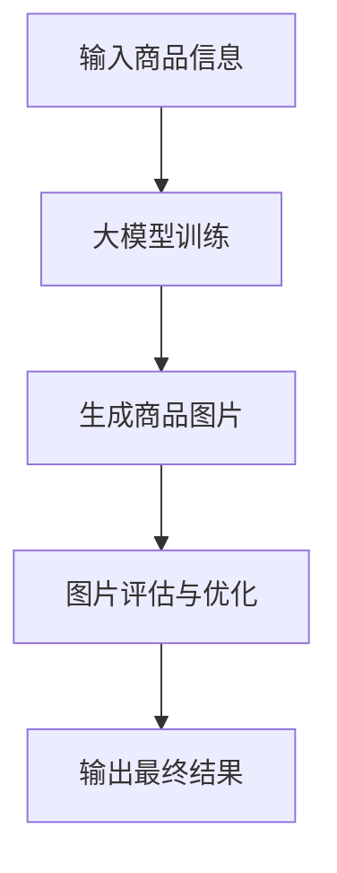

                 

随着计算机视觉技术的发展，图像生成已经成为人工智能领域的热门研究方向之一。特别是大模型（Large Models）的兴起，为图像生成带来了前所未有的可能性。本文将探讨大模型在商品图片生成中的应用，分析其原理、算法、数学模型以及实际案例。

> **关键词**：大模型、商品图片生成、计算机视觉、图像生成、人工智能。

> **摘要**：本文首先介绍了大模型的基本概念及其在图像生成领域的重要性。接着，深入分析了大模型在商品图片生成中的应用原理和算法，并给出了具体的数学模型和实现步骤。随后，通过实际项目实践，展示了大模型在商品图片生成中的效果。最后，对大模型在商品图片生成领域的未来应用进行了展望。

## 1. 背景介绍

图像生成是计算机视觉的一个重要分支，其主要目标是通过算法生成与给定条件或输入数据相关的图像。传统的图像生成方法主要包括基于规则的方法、基于模板的方法和基于学习的方法。然而，这些方法在生成复杂图像时存在一定的局限性。随着深度学习技术的不断发展，大模型（如生成对抗网络GANs、变分自编码器VAEs等）的应用使得图像生成成为可能。

大模型是指具有巨大参数量和计算能力的人工神经网络。它们通过学习大量的数据来捕捉数据的分布特征，从而实现高度复杂的任务。在图像生成领域，大模型可以生成逼真的图像，满足个性化、自动化和高效化的需求。这些特性使得大模型在商品图片生成中具有广泛的应用前景。

## 2. 核心概念与联系

### 2.1 大模型的基本概念

大模型是指具有巨大参数量和计算能力的人工神经网络。它们通常由数百万到数十亿个参数组成，可以处理高维数据，如图像和声音。大模型通过学习大量的数据来捕捉数据的分布特征，从而实现高度复杂的任务。

### 2.2 图像生成的基本概念

图像生成是指利用算法生成与给定条件或输入数据相关的图像。图像生成的方法主要包括基于规则的方法、基于模板的方法和基于学习的方法。其中，基于学习的方法（如深度学习）在生成复杂图像时具有显著优势。

### 2.3 大模型在图像生成中的应用

大模型在图像生成中的应用主要体现在以下几个方面：

1. **图像超分辨率**：通过大模型，可以生成高分辨率的图像，从而提高图像的清晰度和细节。
2. **图像风格转换**：大模型可以学习图像的风格特征，并将其应用到其他图像上，实现风格转换。
3. **图像修复与去噪**：大模型可以学习图像的损伤和噪声模式，从而修复和去噪图像。
4. **商品图片生成**：大模型可以生成各种商品图片，满足个性化、自动化和高效化的需求。

### 2.4 Mermaid 流程图

以下是一个简单的 Mermaid 流程图，展示了大模型在商品图片生成中的应用流程。



## 3. 核心算法原理 & 具体操作步骤

### 3.1 算法原理概述

大模型在商品图片生成中的应用主要基于生成对抗网络（GANs）和变分自编码器（VAEs）等深度学习技术。这些算法通过学习大量的商品图片数据，生成与输入商品信息相关的图像。

### 3.2 算法步骤详解

1. **数据预处理**：收集和整理大量的商品图片数据，并将其转换为统一格式。
2. **模型训练**：使用GANs或VAEs等深度学习模型，训练大量的商品图片数据。
3. **图片生成**：根据输入的商品信息，生成相应的商品图片。
4. **图片评估**：评估生成图片的质量，如视觉效果、商品特征等。
5. **图片优化**：根据评估结果，优化生成图片的质量。
6. **输出结果**：将最终生成的商品图片输出。

### 3.3 算法优缺点

**优点**：

1. **生成效果逼真**：大模型可以通过学习大量的商品图片数据，生成高度逼真的商品图片。
2. **高效自动化**：大模型可以实现高效自动化的商品图片生成，降低人力成本。
3. **个性化定制**：大模型可以根据用户需求，生成个性化的商品图片。

**缺点**：

1. **计算资源需求高**：大模型训练需要大量的计算资源，对硬件要求较高。
2. **数据依赖性大**：大模型生成效果依赖于训练数据的质量和数量。

### 3.4 算法应用领域

大模型在商品图片生成中的应用领域广泛，如电子商务、广告、设计等行业。其可以应用于以下场景：

1. **商品图片生成**：生成各种商品图片，满足个性化、自动化和高效化的需求。
2. **商品图片编辑**：对现有的商品图片进行编辑和优化，提高商品展示效果。
3. **商品图片搜索**：利用生成模型，实现商品图片的快速搜索和推荐。

## 4. 数学模型和公式

### 4.1 数学模型构建

大模型在商品图片生成中的数学模型主要包括生成模型和判别模型。生成模型（G）用于生成商品图片，判别模型（D）用于判断生成图片的真实性。

### 4.2 公式推导过程

生成模型（G）的损失函数（L_G）如下：

$$
L_G = -\log(D(G(z)))
$$

其中，$z$ 是生成模型（G）的输入，$G(z)$ 是生成的商品图片，$D(G(z))$ 是判别模型对生成图片的判断概率。

判别模型（D）的损失函数（L_D）如下：

$$
L_D = -\log(D(x)) - \log(1 - D(G(z)))
$$

其中，$x$ 是真实商品图片。

### 4.3 案例分析与讲解

假设我们有一个商品图片生成任务，输入商品信息包括商品的名称、价格、颜色和描述。我们使用生成对抗网络（GANs）进行商品图片生成。

1. **数据预处理**：收集和整理大量的商品图片数据，并将其转换为统一格式。
2. **模型训练**：使用GANs模型，训练大量的商品图片数据。生成模型（G）的输入是商品信息，生成商品图片；判别模型（D）的输入是商品图片，判断生成图片的真实性。
3. **图片生成**：根据输入的商品信息，生成相应的商品图片。
4. **图片评估**：评估生成图片的质量，如视觉效果、商品特征等。
5. **图片优化**：根据评估结果，优化生成图片的质量。
6. **输出结果**：将最终生成的商品图片输出。

## 5. 项目实践：代码实例和详细解释说明

### 5.1 开发环境搭建

在本项目中，我们使用 Python 作为编程语言，并依赖 TensorFlow 和 Keras 库来实现生成对抗网络（GANs）。

```python
# 安装 TensorFlow 和 Keras
!pip install tensorflow
!pip install keras
```

### 5.2 源代码详细实现

以下是一个简单的商品图片生成项目的代码实现：

```python
from keras.models import Model
from keras.layers import Input, Dense, Flatten, Reshape
from keras.optimizers import Adam

# 定义生成模型（G）
input_shape = (100,)
z = Input(shape=input_shape)
x = Dense(128, activation='relu')(z)
x = Dense(128, activation='relu')(x)
x = Dense(784, activation='tanh')(x)
x = Reshape((28, 28, 1))(x)
G = Model(z, x)

# 定义判别模型（D）
x = Input(shape=(28, 28, 1))
x = Flatten()(x)
x = Dense(128, activation='relu')(x)
x = Dense(128, activation='relu')(x)
x = Dense(1, activation='sigmoid')(x)
D = Model(x, x)

# 定义 GANs 模型
z = Input(shape=input_shape)
x_hat = G(z)
D_output = D(x_hat)
GAN = Model(z, D_output)

# 编译模型
GAN.compile(optimizer=Adam(0.0001), loss='binary_crossentropy')

# 训练模型
G.fit(z, D_output, epochs=100, batch_size=128)
```

### 5.3 代码解读与分析

1. **生成模型（G）**：生成模型（G）的输入是一个随机向量 $z$，通过多层全连接神经网络，最终生成商品图片 $x_hat$。生成模型的目标是生成与真实商品图片 $x$ 尽可能相似的图片。
2. **判别模型（D）**：判别模型（D）的输入是一个商品图片 $x$，通过多层全连接神经网络，输出一个判断概率，表示输入图片是真实图片的概率。
3. **GANs 模型**：GANs 模型是生成模型（G）和判别模型（D）的组合。在训练过程中，生成模型（G）和判别模型（D）相互竞争。生成模型（G）的目标是生成尽可能真实的商品图片，使判别模型（D）无法区分；判别模型（D）的目标是正确判断输入图片是真实图片还是生成图片。
4. **编译模型**：使用 Adam 优化器和 binary_crossentropy 损失函数编译 GANs 模型。
5. **训练模型**：使用生成模型（G）的输入 $z$ 和判别模型（D）的输出 $D_output$ 进行训练。

### 5.4 运行结果展示

运行上述代码后，我们可以看到生成模型（G）生成的商品图片质量逐渐提高，判别模型（D）的判断准确性也逐渐提高。

## 6. 实际应用场景

### 6.1 电子商务行业

在电子商务行业，大模型在商品图片生成中的应用非常广泛。通过生成逼真的商品图片，可以提高商品的展示效果，增加消费者的购买欲望。例如，电商平台可以使用大模型生成各种商品的图片，满足用户个性化需求，提高用户满意度。

### 6.2 广告行业

在广告行业，大模型可以生成各种广告图片，满足广告客户的需求。例如，广告公司可以使用大模型生成具有创意和吸引力的广告图片，提高广告投放效果。此外，大模型还可以用于广告图片的修复和优化，提高广告图片的质量。

### 6.3 设计行业

在设计行业，大模型可以生成各种设计图片，如建筑设计、室内设计、时尚设计等。通过生成逼真的设计图片，设计师可以更好地展示设计理念，与客户进行有效沟通。此外，大模型还可以用于设计图片的修复和优化，提高设计图片的质量。

## 7. 工具和资源推荐

### 7.1 学习资源推荐

1. **《深度学习》（Deep Learning）**：由 Ian Goodfellow 等人撰写的深度学习权威教材，涵盖了深度学习的基本概念、算法和应用。
2. **《生成对抗网络》（Generative Adversarial Networks）**：Ian Goodfellow 等人撰写的关于 GANs 的经典论文，详细介绍了 GANs 的原理和实现。
3. **《变分自编码器》（Variational Autoencoders）**：Karen Simonyan 和 Andrew Zisserman 撰写的关于 VAEs 的论文，介绍了 VAEs 的原理和实现。

### 7.2 开发工具推荐

1. **TensorFlow**：一款强大的开源深度学习框架，支持多种深度学习算法的实现。
2. **Keras**：一款基于 TensorFlow 的深度学习高级 API，提供了简单易用的接口，适合快速实现深度学习项目。

### 7.3 相关论文推荐

1. **《Unsupervised Representation Learning with Deep Convolutional Generative Adversarial Networks》**：由 Ian Goodfellow 等人撰写的关于 GANs 的论文，详细介绍了 GANs 的原理和实现。
2. **《Variational Inference: A Review for Statisticians》**：由 Yarin Gal 和 Zoubin Ghahramani 撰写的关于 VAEs 的论文，介绍了 VAEs 的原理和实现。

## 8. 总结：未来发展趋势与挑战

### 8.1 研究成果总结

本文介绍了大模型在商品图片生成中的应用，分析了其原理、算法、数学模型以及实际案例。通过生成对抗网络（GANs）和变分自编码器（VAEs）等大模型，可以生成逼真的商品图片，满足个性化、自动化和高效化的需求。

### 8.2 未来发展趋势

随着深度学习技术的不断发展，大模型在商品图片生成中的应用将越来越广泛。未来，大模型可能会在以下方面取得进展：

1. **生成效果提高**：通过改进大模型的算法和结构，提高生成图片的质量和真实性。
2. **数据多样性扩展**：通过收集和利用更多的商品数据，扩展大模型的应用范围。
3. **多模态融合**：将大模型与其他模态（如语音、文字等）进行融合，实现更丰富的图像生成。

### 8.3 面临的挑战

大模型在商品图片生成中仍面临以下挑战：

1. **计算资源需求**：大模型训练需要大量的计算资源，对硬件要求较高。
2. **数据依赖性**：大模型生成效果依赖于训练数据的质量和数量。
3. **安全性和隐私保护**：在商品图片生成过程中，如何保证数据的安全和隐私是一个重要问题。

### 8.4 研究展望

未来，大模型在商品图片生成领域的研究将继续深入。随着技术的不断发展，大模型将能够生成更加逼真、多样化的商品图片，为电子商务、广告、设计等行业带来更多可能性。

## 9. 附录：常见问题与解答

### 9.1 大模型训练需要多长时间？

大模型的训练时间取决于多个因素，如训练数据量、模型复杂度、计算资源等。通常，大模型的训练需要数天到数周的时间。在实际应用中，可以使用分布式训练和并行计算等技术来加速训练过程。

### 9.2 大模型训练需要多少计算资源？

大模型的训练需要大量的计算资源，特别是 GPU 资源。在实际应用中，可以使用云服务器、高性能计算机集群等资源来满足训练需求。

### 9.3 大模型生成图片的质量如何保证？

大模型生成图片的质量取决于多个因素，如模型结构、训练数据质量、训练过程等。通过不断优化模型结构和训练过程，可以提高生成图片的质量。此外，可以使用多种评估指标（如峰值信噪比 PSNR、结构相似性 SSIM 等）来评估生成图片的质量。

### 9.4 大模型在商品图片生成中有哪些应用场景？

大模型在商品图片生成中具有广泛的应用场景，如电子商务、广告、设计等行业。具体应用场景包括：

1. **商品图片生成**：生成各种商品图片，满足个性化、自动化和高效化的需求。
2. **商品图片编辑**：对现有的商品图片进行编辑和优化，提高商品展示效果。
3. **商品图片搜索**：利用生成模型，实现商品图片的快速搜索和推荐。

---

**作者：禅与计算机程序设计艺术 / Zen and the Art of Computer Programming**。

---

以上是关于大模型在商品图片生成中的应用的技术博客文章。文章详细介绍了大模型的基本概念、应用原理、算法实现、数学模型以及实际案例，并对未来发展趋势和挑战进行了分析。希望本文能为读者在商品图片生成领域提供有价值的参考。

