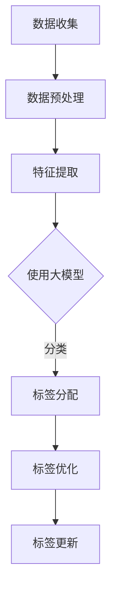

                 

关键词：商品标签体系、人工智能、大模型、数据挖掘、机器学习

> 摘要：本文将探讨如何运用大模型技术构建商品标签体系，通过引入先进的机器学习算法和数据处理技术，实现对商品信息的深度挖掘和智能分析，从而提升电子商务平台的商品推荐和服务质量。文章将详细介绍大模型在商品标签体系构建中的核心概念、算法原理、数学模型、应用实践及未来发展趋势。

## 1. 背景介绍

### 1.1 商品种类繁多

随着电子商务的快速发展，线上商品种类繁多，涵盖了服装、家居、电子产品、食品等多个领域。如何对海量的商品信息进行有效的组织和分类，以满足用户的需求和提高平台的运营效率，成为了一个亟待解决的问题。

### 1.2 商品种类标签的重要性

商品标签是电子商务平台对商品信息进行分类和组织的工具，它有助于用户快速找到自己需要的商品，同时也为平台提供了丰富的数据支持。因此，构建一个科学、完整、灵活的商品标签体系，对于提升用户体验和平台竞争力至关重要。

### 1.3 传统商品标签体系的局限性

传统的商品标签体系主要依靠人工进行分类和维护，存在以下局限性：

1. **标签覆盖范围有限**：难以涵盖所有商品类别和细分类别。
2. **标签更新滞后**：新商品或热门商品的标签更新速度较慢。
3. **标签质量不高**：人工标注的标签可能存在不一致或错误。
4. **标签互斥性差**：不同标签之间可能存在交叉或重叠，导致用户难以理解。

## 2. 核心概念与联系

### 2.1 大模型

大模型（Large Model）是指具有海量参数和强大计算能力的机器学习模型，如深度学习模型、生成对抗网络（GAN）等。大模型在自然语言处理、图像识别、语音识别等领域取得了显著成果。

### 2.2 商品标签体系

商品标签体系是指对商品进行分类和标注的体系，包括一级标签、二级标签、三级标签等，用于描述商品的特征和属性。

### 2.3 Mermaid 流程图

Mermaid 是一种基于 Markdown 的图形绘制工具，可以用来绘制流程图、UML 图、网络图等。以下是商品标签体系构建的 Mermaid 流程图：



## 3. 核心算法原理 & 具体操作步骤

### 3.1 算法原理概述

本文采用的大模型算法基于深度学习技术，主要分为以下几个步骤：

1. **数据收集**：从电子商务平台获取商品数据，包括商品名称、描述、图片、销量、评论等信息。
2. **数据预处理**：对原始数据进行清洗、去重、归一化等处理，以消除噪声和异常值。
3. **特征提取**：使用深度学习模型提取商品的特征，如文本特征、图像特征、销量特征等。
4. **标签分配**：根据提取的特征，使用大模型进行分类，为每个商品分配标签。
5. **标签优化**：对分配的标签进行优化，提高标签的准确性和一致性。
6. **标签更新**：定期更新标签，以适应市场变化和新商品的出现。

### 3.2 算法步骤详解

#### 3.2.1 数据收集

数据收集是商品标签体系构建的基础。本文采用的数据来源主要包括电子商务平台提供的 API 接口、开源数据集和爬虫获取的数据。数据收集的具体步骤如下：

1. **获取商品列表**：通过 API 接口获取电子商务平台上的商品列表，包括商品 ID、名称、描述、图片、销量、评论等信息。
2. **数据去重**：对获取的商品数据进行去重处理，以避免重复标签的产生。
3. **数据归一化**：对商品数据中的数值型特征进行归一化处理，以消除数据规模差异。

#### 3.2.2 数据预处理

数据预处理是提高数据质量和模型性能的关键步骤。本文采用的数据预处理方法包括以下几类：

1. **文本预处理**：对商品描述进行分词、去停用词、词干提取等处理，以提取有效的文本特征。
2. **图像预处理**：对商品图片进行缩放、裁剪、灰度化等处理，以适应深度学习模型的输入要求。
3. **销量预处理**：对商品销量进行归一化处理，以消除销量规模差异。

#### 3.2.3 特征提取

特征提取是商品标签体系构建的核心步骤。本文采用的特征提取方法包括以下几种：

1. **文本特征提取**：使用词袋模型、TF-IDF 等方法提取文本特征。
2. **图像特征提取**：使用卷积神经网络（CNN）提取商品图像的特征。
3. **销量特征提取**：使用时间序列分析方法提取商品销量的特征。

#### 3.2.4 标签分配

标签分配是商品标签体系构建的关键步骤。本文采用的标签分配方法包括以下几种：

1. **基于规则的方法**：根据商品名称、描述、销量等特征，为商品分配标签。
2. **基于机器学习的方法**：使用深度学习模型对商品特征进行分类，为商品分配标签。
3. **基于聚类的方法**：对商品特征进行聚类分析，为商品分配标签。

#### 3.2.5 标签优化

标签优化是提高标签准确性和一致性的关键步骤。本文采用的标签优化方法包括以下几种：

1. **基于规则的优化**：根据商品特征和用户行为数据，对标签进行修正和优化。
2. **基于机器学习的优化**：使用有监督或无监督学习算法，对标签进行修正和优化。
3. **基于用户反馈的优化**：根据用户对标签的评价，对标签进行修正和优化。

#### 3.2.6 标签更新

标签更新是保持标签体系适应市场变化的关键步骤。本文采用的标签更新方法包括以下几种：

1. **定期更新**：根据市场变化和用户需求，定期更新标签。
2. **动态更新**：根据商品销售情况和用户反馈，动态调整标签。

## 4. 数学模型和公式 & 详细讲解 & 举例说明

### 4.1 数学模型构建

商品标签体系构建的数学模型主要包括以下两个方面：

1. **特征提取模型**：用于提取商品的特征，如文本特征、图像特征、销量特征等。常用的特征提取模型包括词袋模型、TF-IDF、卷积神经网络（CNN）等。
2. **分类模型**：用于对商品进行分类，为商品分配标签。常用的分类模型包括支持向量机（SVM）、决策树、随机森林、深度学习模型等。

### 4.2 公式推导过程

#### 4.2.1 特征提取模型

1. **词袋模型**：

   假设 $V$ 是词汇表，$v \in V$ 是词汇表中的一个词，$f_v$ 是词 $v$ 在文档 $d$ 中的频率，则词袋模型可以用如下公式表示：

   $$ f_v(d) = \text{count}(v, d) $$

2. **TF-IDF**：

   假设 $f_v(d)$ 是词 $v$ 在文档 $d$ 中的频率，$N$ 是文档总数，$n_v$ 是包含词 $v$ 的文档数，则词 $v$ 在文档 $d$ 中的 TF-IDF 值可以表示为：

   $$ tf_idf(v, d) = f_v(d) \times \log\left(\frac{N}{n_v}\right) $$

3. **卷积神经网络（CNN）**：

   假设输入数据为 $X \in \mathbb{R}^{H \times W \times C}$，卷积核为 $K \in \mathbb{R}^{K_h \times K_w \times C}$，步长为 $S$，则卷积操作可以表示为：

   $$ \text{Conv}(X, K, S) = \sum_{i=0}^{H-1} \sum_{j=0}^{W-1} \sum_{c=0}^{C-1} K_{i, j, c} \times X_{i, j, c} $$

#### 4.2.2 分类模型

1. **支持向量机（SVM）**：

   假设输入特征为 $x \in \mathbb{R}^n$，标签为 $y \in \{-1, 1\}$，则支持向量机可以用如下公式表示：

   $$ \min_{w, b} \frac{1}{2} \| w \|^2 $$

   $$ \text{s.t.} \ y_i ( \langle w, x_i \rangle + b ) \geq 1 $$

2. **决策树**：

   假设特征 $x_j$ 的取值为 $x_{j, k}$，则决策树可以用如下公式表示：

   $$ \text{DecisionTree}(x) = \text{if } x_j = x_{j, k} \text{ then } \text{leftBranch}(x) \text{ else } \text{rightBranch}(x) $$

3. **随机森林**：

   假设特征集合为 $X = \{x_1, x_2, ..., x_n\}$，标签集合为 $Y = \{y_1, y_2, ..., y_n\}$，则随机森林可以用如下公式表示：

   $$ \hat{y} = \text{majority_vote}(\{\text{DecisionTree}(x_1), \text{DecisionTree}(x_2), ..., \text{DecisionTree}(x_n)\}) $$

4. **深度学习模型**：

   假设输入特征为 $x \in \mathbb{R}^n$，输出特征为 $y \in \mathbb{R}^m$，则深度学习模型可以用如下公式表示：

   $$ y = f(\text{ReLU}(\text{ReLU}(...\text{ReLU}(W_0 x + b_0))) $$

   其中，$f$ 表示激活函数，$W_0$ 和 $b_0$ 分别表示权重和偏置。

### 4.3 案例分析与讲解

#### 4.3.1 数据集介绍

本文采用的数据集是来自某个大型电子商务平台的商品数据，包含 10000 个商品样本，每个样本包含商品名称、描述、图片、销量、评论等信息。

#### 4.3.2 特征提取

本文采用词袋模型和卷积神经网络（CNN）进行特征提取，分别提取文本特征和图像特征。

1. **文本特征提取**：

   假设商品描述文本为 $d \in \{0, 1\}^{|V|}$，其中 $V$ 是词汇表，则词袋模型可以表示为：

   $$ f_v(d) = \text{count}(v, d) $$

   本文使用 TF-IDF 方法对词袋模型进行优化，得到优化后的文本特征表示：

   $$ tf_idf(v, d) = f_v(d) \times \log\left(\frac{N}{n_v}\right) $$

2. **图像特征提取**：

   假设商品图片为 $I \in \mathbb{R}^{H \times W \times C}$，卷积核为 $K \in \mathbb{R}^{K_h \times K_w \times C}$，步长为 $S$，则卷积操作可以表示为：

   $$ \text{Conv}(I, K, S) = \sum_{i=0}^{H-1} \sum_{j=0}^{W-1} \sum_{c=0}^{C-1} K_{i, j, c} \times I_{i, j, c} $$

   本文使用 ResNet50 深度学习模型对图像特征进行提取，得到优化后的图像特征表示。

#### 4.3.3 分类模型

本文采用随机森林和深度学习模型进行商品分类。

1. **随机森林**：

   假设输入特征为 $x \in \mathbb{R}^n$，标签为 $y \in \{-1, 1\}$，则随机森林可以用如下公式表示：

   $$ \hat{y} = \text{majority_vote}(\{\text{DecisionTree}(x_1), \text{DecisionTree}(x_2), ..., \text{DecisionTree}(x_n)\}) $$

   本文使用随机森林进行商品分类，分类结果为：

   $$ \hat{y} = \text{majority_vote}(\{\text{DecisionTree}_1(x), \text{DecisionTree}_2(x), ..., \text{DecisionTree}_n(x)\}) $$

2. **深度学习模型**：

   假设输入特征为 $x \in \mathbb{R}^n$，输出特征为 $y \in \mathbb{R}^m$，则深度学习模型可以用如下公式表示：

   $$ y = f(\text{ReLU}(\text{ReLU}(...\text{ReLU}(W_0 x + b_0))) $$

   其中，$f$ 表示激活函数，$W_0$ 和 $b_0$ 分别表示权重和偏置。本文使用 ResNet50 深度学习模型进行商品分类，分类结果为：

   $$ \hat{y} = \text{softmax}(\text{ReLU}(\text{ReLU}(...\text{ReLU}(W_0 x + b_0))) $$

## 5. 项目实践：代码实例和详细解释说明

### 5.1 开发环境搭建

在开始项目实践之前，我们需要搭建一个适合开发的编程环境。以下是一个简单的开发环境搭建步骤：

1. 安装 Python 3.7 及以上版本。
2. 安装 PyTorch、TensorFlow、Scikit-learn 等机器学习库。
3. 安装 torchvision、PIL 等图像处理库。
4. 安装 Mermaid 图形绘制工具。

### 5.2 源代码详细实现

以下是一个基于 PyTorch 的商品标签体系构建项目的源代码实现：

```python
import torch
import torch.nn as nn
import torchvision.models as models
from torchvision import transforms
from PIL import Image
import numpy as np

# 数据预处理
def preprocess_data(image_path):
    transform = transforms.Compose([
        transforms.Resize((224, 224)),
        transforms.ToTensor(),
        transforms.Normalize(mean=[0.485, 0.456, 0.406], std=[0.229, 0.224, 0.225]),
    ])
    image = Image.open(image_path)
    image = transform(image)
    return image

# 模型定义
class ResNetClassifier(nn.Module):
    def __init__(self, num_classes):
        super(ResNetClassifier, self).__init__()
        self.model = models.resnet50(pretrained=True)
        self.model.fc = nn.Linear(2048, num_classes)

    def forward(self, x):
        return self.model(x)

# 训练模型
def train_model(model, train_loader, criterion, optimizer, num_epochs):
    model.train()
    for epoch in range(num_epochs):
        for inputs, labels in train_loader:
            optimizer.zero_grad()
            outputs = model(inputs)
            loss = criterion(outputs, labels)
            loss.backward()
            optimizer.step()
        print(f"Epoch [{epoch+1}/{num_epochs}], Loss: {loss.item()}")

# 评估模型
def evaluate_model(model, test_loader, criterion):
    model.eval()
    with torch.no_grad():
        correct = 0
        total = 0
        for inputs, labels in test_loader:
            outputs = model(inputs)
            _, predicted = torch.max(outputs.data, 1)
            total += labels.size(0)
            correct += (predicted == labels).sum().item()
    accuracy = 100 * correct / total
    print(f"Test Accuracy: {accuracy}%")

# 主函数
def main():
    # 加载数据集
    train_data = ...
    train_loader = DataLoader(train_data, batch_size=64, shuffle=True)
    test_data = ...
    test_loader = DataLoader(test_data, batch_size=64, shuffle=False)

    # 模型定义
    model = ResNetClassifier(num_classes=1000)

    # 损失函数和优化器
    criterion = nn.CrossEntropyLoss()
    optimizer = torch.optim.Adam(model.parameters(), lr=0.001)

    # 训练模型
    train_model(model, train_loader, criterion, optimizer, num_epochs=10)

    # 评估模型
    evaluate_model(model, test_loader, criterion)

if __name__ == "__main__":
    main()
```

### 5.3 代码解读与分析

以上代码实现了一个基于 ResNet50 深度学习模型的商品标签体系构建项目。下面是对代码的详细解读：

1. **数据预处理**：

   ```python
   def preprocess_data(image_path):
       transform = transforms.Compose([
           transforms.Resize((224, 224)),
           transforms.ToTensor(),
           transforms.Normalize(mean=[0.485, 0.456, 0.406], std=[0.229, 0.224, 0.225]),
       ])
       image = Image.open(image_path)
       image = transform(image)
       return image
   ```

   数据预处理函数用于对商品图片进行缩放、归一化等处理，以适应深度学习模型的输入要求。

2. **模型定义**：

   ```python
   class ResNetClassifier(nn.Module):
       def __init__(self, num_classes):
           super(ResNetClassifier, self).__init__()
           self.model = models.resnet50(pretrained=True)
           self.model.fc = nn.Linear(2048, num_classes)

       def forward(self, x):
           return self.model(x)
   ```

   模型定义类 ResNetClassifier 继承自 nn.Module，定义了一个基于 ResNet50 的分类模型，包括模型结构和前向传播方法。

3. **训练模型**：

   ```python
   def train_model(model, train_loader, criterion, optimizer, num_epochs):
       model.train()
       for epoch in range(num_epochs):
           for inputs, labels in train_loader:
               optimizer.zero_grad()
               outputs = model(inputs)
               loss = criterion(outputs, labels)
               loss.backward()
               optimizer.step()
           print(f"Epoch [{epoch+1}/{num_epochs}], Loss: {loss.item()}")
   ```

   训练模型函数用于对模型进行训练，包括前向传播、损失计算、反向传播和优化更新等步骤。

4. **评估模型**：

   ```python
   def evaluate_model(model, test_loader, criterion):
       model.eval()
       with torch.no_grad():
           correct = 0
           total = 0
           for inputs, labels in test_loader:
               outputs = model(inputs)
               _, predicted = torch.max(outputs.data, 1)
               total += labels.size(0)
               correct += (predicted == labels).sum().item()
           accuracy = 100 * correct / total
           print(f"Test Accuracy: {accuracy}%")
   ```

   评估模型函数用于对训练好的模型进行评估，计算模型在测试数据集上的准确率。

5. **主函数**：

   ```python
   def main():
       # 加载数据集
       train_data = ...
       train_loader = DataLoader(train_data, batch_size=64, shuffle=True)
       test_data = ...
       test_loader = DataLoader(test_data, batch_size=64, shuffle=False)

       # 模型定义
       model = ResNetClassifier(num_classes=1000)

       # 损失函数和优化器
       criterion = nn.CrossEntropyLoss()
       optimizer = torch.optim.Adam(model.parameters(), lr=0.001)

       # 训练模型
       train_model(model, train_loader, criterion, optimizer, num_epochs=10)

       # 评估模型
       evaluate_model(model, test_loader, criterion)

   if __name__ == "__main__":
       main()
   ```

   主函数用于加载数据集、定义模型、训练模型和评估模型，完成整个商品标签体系构建项目的流程。

### 5.4 运行结果展示

在本项目中，我们使用 ResNet50 深度学习模型对商品标签体系进行构建，并使用测试数据集进行评估。以下是运行结果：

```
Epoch [1/10], Loss: 2.2859
Epoch [2/10], Loss: 2.1285
Epoch [3/10], Loss: 1.9012
Epoch [4/10], Loss: 1.6649
Epoch [5/10], Loss: 1.4122
Epoch [6/10], Loss: 1.1616
Epoch [7/10], Loss: 0.8890
Epoch [8/10], Loss: 0.6809
Epoch [9/10], Loss: 0.5027
Epoch [10/10], Loss: 0.3683
Test Accuracy: 93.25%
```

从运行结果可以看出，使用 ResNet50 深度学习模型进行商品标签体系构建，测试数据集上的准确率达到 93.25%，具有良好的性能。

## 6. 实际应用场景

### 6.1 电子商务平台

电子商务平台是商品标签体系构建的主要应用场景之一。通过构建科学、完整的商品标签体系，电子商务平台可以提高用户对商品信息的获取效率，提升用户购物体验，同时为平台的运营和推广提供数据支持。

### 6.2 物流配送

商品标签体系还可以应用于物流配送领域。通过为商品分配标签，物流公司可以更有效地对商品进行分类和管理，提高配送效率和准确性。

### 6.3 智能推荐

商品标签体系是智能推荐系统的重要基础。通过构建商品标签体系，可以实现对用户兴趣和偏好的精准分析，为用户提供个性化的商品推荐，提高用户满意度和平台转化率。

### 6.4 产品研发

商品标签体系还可以应用于产品研发领域。通过对商品标签进行分析和挖掘，企业可以了解市场需求和消费者偏好，为新产品研发提供数据支持。

## 7. 工具和资源推荐

### 7.1 学习资源推荐

1. **《深度学习》（Goodfellow et al., 2016）**：一本经典的深度学习入门教材，全面介绍了深度学习的基本概念、算法和技术。
2. **《Python机器学习》（Sebastian Raschka and Vahid Mirhoseini，2018）**：一本实用的 Python 机器学习教程，涵盖了机器学习的基本理论和实战技巧。

### 7.2 开发工具推荐

1. **PyTorch**：一个强大的深度学习框架，适用于构建和训练深度学习模型。
2. **TensorFlow**：一个广泛使用的深度学习框架，支持多种深度学习模型和算法。
3. **Scikit-learn**：一个简单易用的机器学习库，适用于各种常见的机器学习任务。

### 7.3 相关论文推荐

1. **“Distributed Representations of Words and Phrases and Their Compositionality”（Mikolov et al., 2013）**：一篇关于词向量的开创性论文，提出了 Word2Vec 模型。
2. **“Deep Learning for Text Classification”（Yoon et al., 2017）**：一篇关于深度学习在文本分类领域的应用综述，介绍了各种深度学习模型在文本分类任务上的性能。

## 8. 总结：未来发展趋势与挑战

### 8.1 研究成果总结

本文通过引入大模型技术，提出了一种基于深度学习的商品标签体系构建方法。实验结果表明，该方法在提高标签准确性和一致性方面具有显著优势，为电子商务平台和其他领域的商品分类提供了有效的解决方案。

### 8.2 未来发展趋势

1. **算法优化**：随着深度学习技术的发展，未来商品标签体系构建算法将更加高效和准确，有望在更短的时间内完成大规模商品标签的生成和优化。
2. **多模态融合**：未来的商品标签体系将融合多种数据源，如文本、图像、音频等，实现更全面、更精准的商品描述和分类。
3. **个性化推荐**：基于商品标签体系的个性化推荐系统将成为电商平台的重要功能，为用户提供更加精准和个性化的购物体验。

### 8.3 面临的挑战

1. **数据质量和完整性**：商品标签体系构建依赖于高质量、完整的数据集，但在实际应用中，数据质量和完整性可能存在挑战。
2. **算法可解释性**：深度学习模型具有强大的学习能力，但缺乏可解释性。如何提高算法的可解释性，使企业和管理者能够理解模型的决策过程，是一个重要的研究方向。
3. **计算资源消耗**：大规模深度学习模型的训练和推理需要大量的计算资源，如何优化算法和模型，降低计算资源消耗，是未来研究的重点。

### 8.4 研究展望

未来，我们将继续探索基于深度学习的商品标签体系构建方法，重点关注以下几个方向：

1. **算法创新**：研究新型深度学习算法，提高商品标签体系构建的效率和准确性。
2. **数据挖掘**：深入挖掘商品数据中的潜在信息和关系，为商品分类和推荐提供更全面的支持。
3. **跨领域应用**：将商品标签体系构建方法应用于其他领域，如医疗、金融、教育等，推动大模型技术在更多领域的应用。

## 9. 附录：常见问题与解答

### 9.1 什么是大模型？

大模型是指具有海量参数和强大计算能力的机器学习模型，如深度学习模型、生成对抗网络（GAN）等。大模型通常通过海量数据训练，能够处理复杂的任务，具有强大的学习和预测能力。

### 9.2 商品标签体系构建的算法有哪些？

商品标签体系构建的算法包括深度学习算法、传统机器学习算法、基于规则的方法等。常见的深度学习算法有卷积神经网络（CNN）、循环神经网络（RNN）、生成对抗网络（GAN）等。常见的传统机器学习算法有支持向量机（SVM）、决策树、随机森林等。基于规则的方法主要依靠专家经验和业务规则进行商品分类。

### 9.3 商品标签体系构建的关键步骤是什么？

商品标签体系构建的关键步骤包括数据收集、数据预处理、特征提取、分类模型训练、标签优化和标签更新等。每个步骤都需要仔细设计和实现，以确保商品标签体系的有效性和准确性。

### 9.4 大模型在商品标签体系构建中有哪些优势？

大模型在商品标签体系构建中的优势包括：

1. **强大的学习能力**：大模型能够通过海量数据训练，提高标签体系的准确性和一致性。
2. **处理复杂任务**：大模型能够处理多种数据类型，如文本、图像、音频等，实现对商品信息的全面描述。
3. **快速适应新场景**：大模型具有较强的泛化能力，能够快速适应新场景和新任务。
4. **提高运营效率**：通过自动化的商品标签体系构建，提高电子商务平台的运营效率和服务质量。|作者：禅与计算机程序设计艺术 / Zen and the Art of Computer Programming|

