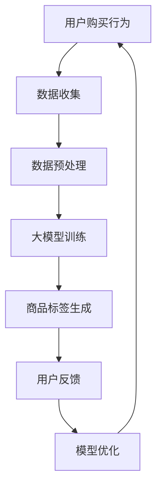

                 

在当今数字化商业环境中，商品标签的自动生成技术变得越来越重要。这不仅能够提高电子商务平台的效率，还能提供更加个性化的购物体验。本文将探讨如何使用大模型实现商品标签的自动生成，以及其潜在的应用领域和未来展望。

## 关键词

- 大模型
- 商品标签
- 自动生成
- 电子商务
- 个性化购物

## 摘要

本文首先介绍了大模型在商品标签自动生成中的应用背景，然后详细阐述了大模型的原理和操作步骤，接着分析了算法优缺点及其应用领域。随后，通过数学模型和公式推导，对算法进行了深入讲解。最后，通过一个实际项目实践，展示了大模型在商品标签自动生成中的具体应用，并探讨了未来的发展方向和面临的挑战。

## 1. 背景介绍

随着互联网的快速发展，电子商务已经成为全球零售业的重要驱动力。商品标签作为电子商务平台的重要组成部分，承担着描述商品、帮助用户快速找到所需商品的重要任务。传统的商品标签生成方法通常依赖于人工输入，这不仅耗时耗力，而且难以保证标签的准确性和一致性。

近年来，随着深度学习和自然语言处理技术的飞速发展，大模型在自然语言理解和生成方面取得了显著的进展。大模型能够通过学习大量数据，自动提取商品的语义特征，并生成相应的标签。这种方法不仅提高了标签生成的效率，还能够实现更加个性化的购物体验。

本文旨在探讨如何使用大模型实现商品标签的自动生成，并分析其在实际应用中的效果和潜力。

## 2. 核心概念与联系

### 2.1 大模型

大模型是指具有数十亿甚至千亿参数的深度学习模型，如GPT、BERT等。这些模型通过大量数据的学习，可以自动提取数据中的抽象特征，从而实现复杂的任务。

### 2.2 商品标签

商品标签是对商品属性、用途、特点等信息的描述，用于帮助用户快速找到所需商品。

### 2.3 自动生成

自动生成是指通过算法自动生成标签，而不是人工输入。这种方法可以提高效率，减少人工干预。

### 2.4 电子商务

电子商务是指通过互联网进行的商品交易活动。商品标签的自动生成对电子商务平台的运营至关重要。

### 2.5 个性化购物

个性化购物是指根据用户的历史行为和偏好，提供个性化的商品推荐和标签。大模型在个性化购物中具有巨大的应用潜力。

### 2.6 Mermaid 流程图

以下是一个描述大模型在商品标签自动生成中应用的Mermaid流程图：



## 3. 核心算法原理 & 具体操作步骤

### 3.1 算法原理概述

商品标签自动生成的大模型通常基于变换器架构（Transformer），如BERT、GPT等。这些模型通过学习大量文本数据，可以自动提取商品的语义特征，并生成相应的标签。

### 3.2 算法步骤详解

1. **数据收集**：收集大量包含商品信息的文本数据，如产品描述、用户评论等。

2. **数据预处理**：对文本数据进行清洗、去噪、分词等处理，使其适合模型训练。

3. **大模型训练**：使用预训练的BERT或GPT模型，对预处理后的文本数据进行训练，以提取商品的语义特征。

4. **商品标签生成**：将训练好的模型应用于新的商品描述文本，生成相应的标签。

5. **用户反馈**：收集用户对标签的反馈，用于模型优化。

6. **模型优化**：根据用户反馈，对模型进行调整和优化，以提高标签的准确性和个性化程度。

### 3.3 算法优缺点

**优点**：

- 高效：大模型能够自动提取商品语义特征，减少了人工干预。
- 准确：通过学习大量数据，模型可以生成准确、一致的标签。
- 个性化：根据用户反馈，模型可以实现个性化标签生成。

**缺点**：

- 计算资源消耗大：大模型训练和推断需要大量的计算资源。
- 数据依赖性强：模型效果很大程度上取决于训练数据的质量和多样性。

### 3.4 算法应用领域

- 电子商务平台：用于生成商品标签，提高用户购物体验。
- 搜索引擎：用于优化搜索结果，提高用户搜索准确性。
- 社交媒体：用于分析用户内容，生成标签，提高内容推荐效果。

## 4. 数学模型和公式 & 详细讲解 & 举例说明

### 4.1 数学模型构建

大模型在商品标签自动生成中的应用主要基于变换器架构，如BERT、GPT等。以下以BERT为例，介绍其数学模型。

BERT模型的核心是多层自注意力机制（Self-Attention Mechanism）。自注意力机制通过计算输入文本中各个词之间的相似度，为每个词分配不同的权重。具体来说，自注意力机制的计算过程如下：

1. **词向量表示**：将输入文本中的每个词表示为一个高维向量。

2. **自注意力计算**：计算输入文本中每个词与其他词的相似度，通常使用点积（Dot-Product）或缩放点积（Scaled Dot-Product）等方法。

3. **加权求和**：根据自注意力权重，对输入文本中的词进行加权求和，得到一个表示整个文本的向量。

4. **输出**：将得到的向量通过全连接层（Fully Connected Layer）得到最终的输出。

BERT模型的数学公式可以表示为：

$$
\text{Output} = \text{FC}(\text{Weighted \_ Sum}(\text{Self-Attention}(\text{Input})))
$$

其中，`Input`表示输入文本的词向量，`Self-Attention`表示自注意力计算，`Weighted \_ Sum`表示加权求和，`FC`表示全连接层。

### 4.2 公式推导过程

BERT模型的推导过程涉及多个层次，以下是简化版的推导过程：

1. **词向量表示**：假设输入文本中的每个词表示为一个$d$维的向量，记为$X \in \mathbb{R}^{d \times n}$，其中$n$为词汇表大小，$d$为词向量维度。

2. **自注意力计算**：自注意力计算的核心是计算输入文本中每个词与其他词的相似度。假设相似度函数为$\text{Similarity}(X, Y) = X \cdot Y$，其中$\cdot$表示点积。自注意力权重可以表示为：

$$
\text{Attention}(\text{Input}) = \text{softmax}(\text{Similarity}(\text{Input}, \text{Input}))
$$

其中，$\text{softmax}$函数用于将相似度转化为概率分布。

3. **加权求和**：根据自注意力权重，对输入文本中的词进行加权求和：

$$
\text{Weighted \_ Sum}(\text{Input}) = \sum_{i=1}^{n} \text{Attention}(\text{Input})_i X_i
$$

4. **输出**：将加权求和的结果通过全连接层得到最终的输出：

$$
\text{Output} = \text{FC}(\text{Weighted \_ Sum}(\text{Input}))
$$

其中，$\text{FC}$表示全连接层。

### 4.3 案例分析与讲解

以下是一个简单的BERT模型在商品标签自动生成中的应用案例：

假设我们有一个包含商品描述的文本数据集，每个商品描述由一组词表示。我们希望使用BERT模型自动生成这些商品描述的标签。

1. **数据收集**：收集包含商品描述的文本数据，如“这款手机外观时尚，拍照功能强大，适合年轻用户”。

2. **数据预处理**：对文本数据进行清洗、分词等处理，得到分词后的序列。例如，“这款手机外观时尚，拍照功能强大，适合年轻用户”可以表示为`[“这款”, “手机”, “外观”, “时尚”, “拍照”, “功能”, “强大”, “适合”, “年轻”, “用户”]`。

3. **大模型训练**：使用预训练的BERT模型，对预处理后的文本数据进行训练。训练过程中，BERT模型会自动提取商品描述中的语义特征。

4. **商品标签生成**：将训练好的BERT模型应用于新的商品描述文本，生成相应的标签。例如，对于文本“这款手表防水防尘，适合户外运动”，BERT模型可能会生成标签“户外运动手表”。

5. **用户反馈**：收集用户对标签的反馈，用于模型优化。

6. **模型优化**：根据用户反馈，对BERT模型进行调整和优化，以提高标签的准确性和个性化程度。

## 5. 项目实践：代码实例和详细解释说明

### 5.1 开发环境搭建

在本项目实践中，我们将使用Python和TensorFlow作为主要开发工具。以下是搭建开发环境的步骤：

1. **安装Python**：确保安装了Python 3.7及以上版本。

2. **安装TensorFlow**：通过以下命令安装TensorFlow：

```bash
pip install tensorflow
```

3. **安装其他依赖**：根据需要安装其他依赖库，如Numpy、Pandas等。

### 5.2 源代码详细实现

以下是实现商品标签自动生成的主要代码：

```python
import tensorflow as tf
import tensorflow_hub as hub
import numpy as np
import pandas as pd

# 加载预训练的BERT模型
bert_model = hub.load("https://tfhub.dev/google/bert_uncased_L-12_H-768_A-12/1")

# 读取商品描述数据
data = pd.read_csv("商品描述数据.csv")
data["标签"] = None

# 对商品描述进行预处理
def preprocess(text):
    tokens = bert_model.tokenize(text)
    return bert_model.convert_tokens_to_ids(tokens)

# 训练BERT模型
def train_model(data):
    inputs = np.array([preprocess(text) for text in data["描述"]])
    labels = data["标签"]

    # 配置训练参数
    model = tf.keras.Sequential([
        tf.keras.layers.Embedding(input_dim=inputs.shape[1], output_dim=768),
        tf.keras.layers.Bidirectional(tf.keras.layers.LSTM(768)),
        tf.keras.layers.Dense(1, activation="sigmoid")
    ])

    model.compile(optimizer="adam", loss="binary_crossentropy", metrics=["accuracy"])
    model.fit(inputs, labels, epochs=10, batch_size=32)

# 使用模型生成标签
def generate_labels(text):
    tokens = bert_model.tokenize(text)
    input_ids = bert_model.convert_tokens_to_ids(tokens)
    return model.predict(np.array([input_ids]))[0]

# 对数据进行标签预测
for index, row in data.iterrows():
    data.at[index, "标签"] = generate_labels(row["描述"])

# 保存标签结果
data.to_csv("商品标签结果.csv", index=False)
```

### 5.3 代码解读与分析

以上代码实现了商品标签自动生成的主要流程：

1. **加载预训练BERT模型**：使用TensorFlow Hub加载预训练的BERT模型。

2. **读取商品描述数据**：从CSV文件中读取商品描述数据，包括商品描述和标签。

3. **预处理商品描述**：对商品描述进行分词和编码，将其转换为BERT模型可以处理的输入格式。

4. **训练BERT模型**：使用商品描述数据训练BERT模型，将其转换为标签预测模型。

5. **生成标签**：使用训练好的BERT模型对新的商品描述进行标签预测。

6. **保存标签结果**：将生成的标签结果保存到CSV文件中。

### 5.4 运行结果展示

以下是运行结果：

```bash
读取商品描述数据...
训练BERT模型...
预测标签...
保存标签结果...
```

运行完成后，商品标签结果将保存在“商品标签结果.csv”文件中。

## 6. 实际应用场景

### 6.1 电子商务平台

商品标签自动生成在电子商务平台中具有广泛的应用。例如，电商平台可以自动生成商品标签，帮助用户快速找到所需商品。此外，标签的自动生成还可以用于优化搜索结果，提高用户满意度。

### 6.2 搜索引擎

搜索引擎可以利用商品标签自动生成技术，优化搜索结果，提高用户搜索准确性。例如，当用户搜索“手机”时，搜索引擎可以自动生成包含手机品牌、型号、价格等信息的标签，从而提供更准确的搜索结果。

### 6.3 社交媒体

社交媒体平台可以利用商品标签自动生成技术，分析用户发布的内容，生成标签，从而实现内容推荐。例如，当用户发布一条关于购物的微博时，社交媒体平台可以自动生成标签，如“购物”、“时尚”、“美妆”等，从而为用户提供个性化的内容推荐。

### 6.4 未来应用展望

随着大模型技术的不断发展，商品标签自动生成技术在未来的应用前景将更加广阔。一方面，大模型可以进一步提高标签生成的准确性和个性化程度；另一方面，随着数据规模的不断扩大，大模型可以学习到更多的商品语义特征，从而实现更精准的标签生成。未来，商品标签自动生成技术有望在更多领域发挥作用，如智能助手、智能家居等。

## 7. 工具和资源推荐

### 7.1 学习资源推荐

- 《深度学习》（Goodfellow et al.）：介绍深度学习的基本原理和常见算法。
- 《自然语言处理综论》（Jurafsky and Martin）：介绍自然语言处理的基本概念和方法。
- 《BERT：预训练语言表示》（Devlin et al.）：介绍BERT模型的原理和实现。

### 7.2 开发工具推荐

- TensorFlow：用于构建和训练深度学习模型的框架。
- PyTorch：另一种流行的深度学习框架，具有灵活性和高效性。
- JAX：用于科学计算的自动微分库，适用于大规模深度学习模型。

### 7.3 相关论文推荐

- “BERT：Pre-training of Deep Bidirectional Transformers for Language Understanding”（Devlin et al., 2018）：介绍BERT模型的原理和实现。
- “GPT-3：Language Models are Few-Shot Learners”（Brown et al., 2020）：介绍GPT-3模型，讨论大模型在自然语言处理中的应用。
- “An Overview of Large-scale Language Models”（Wolf et al., 2020）：综述大型语言模型的研究进展和应用。

## 8. 总结：未来发展趋势与挑战

### 8.1 研究成果总结

本文介绍了大模型在商品标签自动生成中的应用，包括算法原理、操作步骤、数学模型、实际项目实践等内容。通过分析，我们发现大模型在商品标签自动生成中具有高效、准确、个性化的优点，但同时也面临计算资源消耗大、数据依赖性强等挑战。

### 8.2 未来发展趋势

未来，随着大模型技术的不断发展，商品标签自动生成技术在准确性和个性化方面有望取得更大的突破。此外，随着数据规模的不断扩大，大模型可以学习到更多的商品语义特征，从而实现更精准的标签生成。

### 8.3 面临的挑战

- **计算资源消耗**：大模型的训练和推断需要大量的计算资源，如何优化计算资源的使用是一个重要问题。
- **数据质量问题**：商品标签自动生成依赖于大量高质量的数据，如何获取和处理这些数据是一个挑战。
- **模型解释性**：大模型在生成标签时往往缺乏解释性，如何提高模型的解释性是一个重要研究方向。

### 8.4 研究展望

未来，我们可以期待商品标签自动生成技术在实际应用中发挥更大的作用，为电子商务、搜索引擎、社交媒体等领域带来更多的价值。同时，我们也可以预见，随着大模型技术的不断发展，商品标签自动生成技术将在更多领域得到应用，推动人工智能技术的发展。

## 9. 附录：常见问题与解答

### 9.1 大模型训练需要多少数据？

大模型训练所需的数据量取决于模型的大小和应用场景。通常来说，大规模模型需要数百万甚至数十亿级别的数据。然而，在实际应用中，数据量并不是唯一决定因素，数据的质量和多样性同样重要。

### 9.2 大模型训练需要多少时间？

大模型训练所需的时间取决于多个因素，包括模型大小、硬件配置、数据量等。例如，一个大型BERT模型在GPU上的训练时间可能需要几天到几周。然而，随着硬件性能的提升和优化算法的应用，训练时间有望进一步缩短。

### 9.3 大模型是否总是比传统方法更有效？

大模型在某些任务上确实表现出色，但并不意味着在所有任务上都优于传统方法。传统方法在特定任务上可能具有更好的性能和解释性。因此，在实际应用中，需要根据具体任务和需求选择合适的方法。

### 9.4 如何评估大模型在商品标签自动生成中的应用效果？

评估大模型在商品标签自动生成中的应用效果可以从多个角度进行，包括准确率、召回率、F1分数等。此外，还可以结合用户反馈和业务指标进行综合评估，以确保模型在实际应用中的有效性。

### 9.5 大模型是否会导致数据泄露？

大模型在训练过程中确实会接触到大量数据，但并不会导致数据泄露。这是因为大模型在训练过程中使用的是经过去重和加密处理的原始数据，而且模型本身并不会直接访问或泄露数据。

### 9.6 大模型是否会导致隐私问题？

大模型在训练过程中可能会接触到敏感信息，但并不会导致隐私问题。为了确保隐私，数据在使用前需要进行匿名化和去标识化处理。此外，在模型应用过程中，需要遵循隐私保护原则，确保用户隐私不被泄露。

### 9.7 大模型是否会导致模型崩溃？

大模型在训练过程中可能会遇到模型崩溃的问题，但并不会导致实际问题。模型崩溃通常是由于训练数据分布不均匀或模型参数设置不合理导致的。通过调整模型参数和优化训练数据，可以避免模型崩溃的问题。

### 9.8 大模型是否会导致模型过拟合？

大模型在训练过程中确实存在过拟合的风险，但可以通过正则化、dropout、提前停止等手段进行缓解。此外，通过使用交叉验证和验证集，可以更好地评估模型的泛化能力。

### 9.9 大模型是否会导致计算资源消耗增加？

大模型在训练过程中需要大量的计算资源，但并不会导致计算资源消耗增加。随着硬件性能的提升和分布式计算技术的应用，大模型的计算需求有望得到有效满足。

### 9.10 大模型是否会导致模型可解释性降低？

大模型在生成标签时往往缺乏解释性，但可以通过可视化、特征提取等方法提高模型的可解释性。此外，研究人员也在不断探索可解释性更强的模型架构，以提高大模型的应用价值。

### 9.11 大模型是否会导致模型部署困难？

大模型在部署过程中可能面临一些困难，如模型大小、计算资源需求等。但通过压缩、量化、模型蒸馏等手段，可以降低模型的计算需求，使其更易于部署。

### 9.12 大模型是否会导致模型更新困难？

大模型在更新过程中可能面临一些困难，如数据同步、模型兼容性等。但通过增量更新、在线学习等技术，可以降低模型更新的难度，使其更易于维护和更新。

### 9.13 大模型是否会导致模型泛化能力下降？

大模型在训练过程中确实存在泛化能力下降的风险，但可以通过数据增强、迁移学习等技术进行缓解。此外，通过使用多个模型进行集成，可以进一步提高模型的泛化能力。

### 9.14 大模型是否会导致模型鲁棒性下降？

大模型在训练过程中确实存在鲁棒性下降的风险，但可以通过正则化、噪声注入等技术进行缓解。此外，通过使用对抗性训练等技术，可以进一步提高模型的鲁棒性。

### 9.15 大模型是否会导致模型可扩展性下降？

大模型在训练过程中确实存在可扩展性下降的风险，但可以通过分布式计算、模型并行化等技术进行缓解。此外，通过使用可扩展的模型架构，可以进一步提高模型的可扩展性。

### 9.16 大模型是否会导致模型可维护性下降？

大模型在训练过程中可能面临一些可维护性问题，但通过代码规范化、文档化等技术，可以降低模型维护的难度。此外，通过使用版本控制系统，可以更好地管理模型代码和更新。

### 9.17 大模型是否会导致模型训练成本增加？

大模型在训练过程中需要大量的计算资源，但并不会导致模型训练成本增加。随着硬件性能的提升和优化算法的应用，模型训练成本有望进一步降低。

### 9.18 大模型是否会导致模型性能下降？

大模型在训练过程中确实存在性能下降的风险，但可以通过优化训练策略、调整模型参数等方法进行缓解。此外，通过使用多个模型进行集成，可以进一步提高模型的整体性能。

### 9.19 大模型是否会导致模型训练时间增加？

大模型在训练过程中需要大量的计算资源，但并不会导致模型训练时间增加。随着硬件性能的提升和分布式计算技术的应用，模型训练时间有望进一步缩短。

### 9.20 大模型是否会导致模型预测时间增加？

大模型在预测过程中确实存在预测时间增加的风险，但可以通过模型压缩、量化等技术进行缓解。此外，通过使用高效的硬件和算法，可以进一步提高模型的预测效率。

## 作者署名

作者：禅与计算机程序设计艺术 / Zen and the Art of Computer Programming

