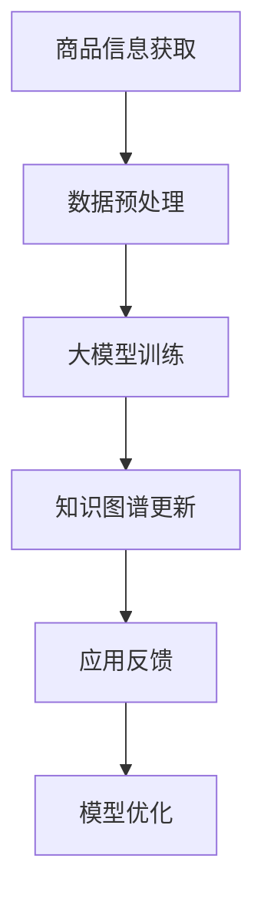

                 

关键词：大模型、知识图谱、商品信息、自动更新、算法原理、数学模型、项目实践、应用场景、发展趋势与挑战

摘要：本文探讨了如何利用大模型技术对商品知识图谱进行自动更新。首先，介绍了知识图谱和商品信息的关系，随后详细阐述了大模型在知识图谱自动更新中的应用原理、算法步骤和数学模型。通过项目实践，展示了如何实现商品知识图谱的自动更新，并分析了该技术的优缺点以及应用领域。最后，对未来的发展趋势和挑战进行了展望。

## 1. 背景介绍

随着互联网的快速发展，电子商务已经成为现代经济的重要组成部分。商品信息的准确性和实时性对于电商平台的用户体验和商业决策至关重要。知识图谱作为一种结构化数据模型，能够将商品信息以图谱的形式进行组织和表示，使得信息之间的关联关系更加直观和清晰。然而，商品信息的更新速度非常快，传统的手动更新方式效率低下，难以满足实际需求。

近年来，深度学习和自然语言处理技术取得了巨大的进步，尤其是大模型（如GPT、BERT等）的兴起，为知识图谱的自动更新提供了新的可能性。大模型具有强大的语义理解能力和自适应学习能力，能够自动地从大量商品信息中提取和更新知识图谱中的节点和边。本文将探讨如何利用大模型技术实现商品知识图谱的自动更新，为电商平台提供高效、准确的信息更新手段。

## 2. 核心概念与联系

### 2.1 知识图谱

知识图谱（Knowledge Graph）是一种用于表示实体及其之间关系的图形结构。它由节点（Node）和边（Edge）组成，节点表示实体，边表示实体之间的关系。在商品知识图谱中，节点可以是商品、品牌、店铺等，边可以是“属于”、“销售”、“评价”等关系。

### 2.2 商品信息

商品信息是指关于商品的各种属性和特征，包括商品名称、价格、库存、规格、评价等。商品信息是构建知识图谱的基础数据。

### 2.3 大模型

大模型（如GPT、BERT等）是指参数量庞大的神经网络模型，具有强大的语义理解能力和自适应学习能力。大模型可以用于从文本数据中提取知识，并自动更新知识图谱中的节点和边。

### 2.4 Mermaid 流程图



### 2.5 大模型在知识图谱自动更新中的应用原理

大模型在知识图谱自动更新中的应用原理主要包括以下几个步骤：

1. **商品信息获取**：从电商平台、商品数据库等渠道获取商品信息。
2. **数据预处理**：对获取到的商品信息进行清洗、格式化和标准化处理。
3. **大模型训练**：利用预处理后的商品信息训练大模型，使其具备从文本数据中提取知识的能力。
4. **知识图谱更新**：将训练好的大模型应用于知识图谱，自动更新节点和边。
5. **应用反馈**：收集应用过程中的反馈，用于优化大模型和知识图谱。
6. **模型优化**：根据反馈对大模型和知识图谱进行调整和优化。

## 3. 核心算法原理 & 具体操作步骤

### 3.1 算法原理概述

大模型在知识图谱自动更新中的核心算法是基于生成对抗网络（GAN）和图神经网络（Graph Neural Network，GNN）。GAN用于生成新的商品信息，GNN用于将生成的新信息与知识图谱进行融合。

### 3.2 算法步骤详解

1. **商品信息获取**：从电商平台、商品数据库等渠道获取商品信息，包括商品名称、价格、库存、规格、评价等。

2. **数据预处理**：

   - 数据清洗：去除无效、错误和重复的数据。
   - 数据格式化：统一数据格式，如将价格转换为数字，评价转换为评分等。
   - 数据标准化：对数据进行归一化处理，如对价格进行标准化处理，使其在同一个尺度范围内。

3. **大模型训练**：

   - **GAN训练**：利用GAN生成新的商品信息，GAN由生成器（Generator）和判别器（Discriminator）组成。生成器从噪声中生成新的商品信息，判别器判断生成的商品信息是否真实。通过训练，使生成器的生成能力越来越强，判别器的判别能力越来越准确。
   - **GNN训练**：利用GNN对知识图谱进行建模。GNN通过学习节点和边之间的邻接关系，提取知识图谱中的隐含特征，并将其用于更新知识图谱中的节点和边。

4. **知识图谱更新**：

   - **节点更新**：利用GNN提取的商品信息隐含特征，更新知识图谱中的节点属性。
   - **边更新**：利用GNN提取的商品信息隐含特征，更新知识图谱中的边权重。

5. **应用反馈**：收集应用过程中的反馈，包括用户评价、商品点击率、转化率等，用于优化大模型和知识图谱。

6. **模型优化**：根据反馈对大模型和知识图谱进行调整和优化。

### 3.3 算法优缺点

**优点**：

- 高效：大模型能够快速地从大量商品信息中提取知识，实现知识图谱的自动更新。
- 准确：大模型具有强大的语义理解能力，能够准确地将商品信息转换为知识图谱中的节点和边。
- 自适应：大模型能够根据应用反馈进行优化，使其在更新过程中更加准确和高效。

**缺点**：

- 计算资源消耗大：大模型的训练和更新需要大量的计算资源。
- 需要大量的训练数据：大模型需要大量的训练数据来保证其性能。

### 3.4 算法应用领域

大模型在知识图谱自动更新中的算法可以应用于电子商务、金融、医疗等多个领域。以下是一些具体的应用场景：

- **电子商务**：自动更新商品知识图谱，提高电商平台的商品推荐和搜索效果。
- **金融**：自动更新金融知识图谱，提高金融风险评估和决策的准确性。
- **医疗**：自动更新医疗知识图谱，提高医疗诊断和治疗的准确性。

## 4. 数学模型和公式 & 详细讲解 & 举例说明

### 4.1 数学模型构建

大模型在知识图谱自动更新中的数学模型主要包括GAN和GNN。以下分别介绍它们的数学模型。

### 4.1.1 GAN

GAN由生成器G和判别器D组成。生成器G从噪声z中生成商品信息x，判别器D判断生成的商品信息x是否真实。

生成器G的数学模型：

$$
G(z) = x
$$

判别器D的数学模型：

$$
D(x) = 1 \quad \text{if } x \text{ is real}
$$

$$
D(x) = 0 \quad \text{if } x \text{ is generated by } G
$$

### 4.1.2 GNN

GNN通过学习节点和边之间的邻接关系，提取知识图谱中的隐含特征。

GNN的数学模型：

$$
h^i_{t+1} = \sigma(\sum_{j\in N(i)} \theta_{ij} h^j_{t} + b_i)
$$

其中，$h^i_{t}$表示节点i在时间t的隐含特征，$N(i)$表示节点i的邻接节点集，$\theta_{ij}$表示边(i, j)的权重，$\sigma$表示激活函数，$b_i$表示节点i的偏置。

### 4.2 公式推导过程

#### 4.2.1 GAN

GAN的推导过程主要包括两个部分：生成器的推导和判别器的推导。

1. **生成器推导**：

   生成器的目标是最大化判别器的误差，即最大化$D(G(z))$。

   $$ 
   \min_G \max_D V(D, G) = E_{x \sim P_{data}(x)}[D(x)] + E_{z \sim P_z(z)}[D(G(z))]
   $$

   其中，$P_{data}(x)$表示真实数据的分布，$P_z(z)$表示噪声的分布。

   生成器的梯度为：

   $$
   \nabla_G V(D, G) = E_{z \sim P_z(z)}[\nabla_D D(G(z)) \odot \nabla_G G(z)]
   $$

   其中，$\odot$表示Hadamard积。

2. **判别器推导**：

   判别器的目标是最大化生成器的误差，即最大化$1 - D(G(z))$。

   $$
   \min_D V(D, G) = E_{x \sim P_{data}(x)}[D(x)] - E_{z \sim P_z(z)}[D(G(z))]
   $$

   判别器的梯度为：

   $$
   \nabla_D V(D, G) = E_{x \sim P_{data}(x)}[\nabla_D D(x)] - E_{z \sim P_z(z)}[\nabla_D D(G(z))]
   $$

#### 4.2.2 GNN

GNN的推导过程主要包括两个部分：节点的隐含特征更新和边的权重更新。

1. **节点隐含特征更新**：

   节点i在时间t的隐含特征$h^i_{t+1}$取决于其邻接节点的隐含特征$h^j_{t}$和边的权重$\theta_{ij}$。

   $$
   h^i_{t+1} = \sigma(\sum_{j\in N(i)} \theta_{ij} h^j_{t} + b_i)
   $$

   其中，$\sigma$为激活函数，通常采用ReLU或Sigmoid函数。

2. **边权重更新**：

   边的权重$\theta_{ij}$取决于其邻接节点的隐含特征$h^i_{t}$和$h^j_{t}$。

   $$
   \theta_{ij} = \frac{1}{\sqrt{|N(i)|}} \sum_{j\in N(i)} h^i_{t} \odot h^j_{t}
   $$

   其中，$|N(i)|$表示节点i的邻接节点数。

### 4.3 案例分析与讲解

#### 4.3.1 案例背景

假设有一个电子商务平台，其商品知识图谱中包含商品、品牌、店铺等实体，以及它们之间的关系，如“销售”、“评价”等。为了提高电商平台的用户体验，我们需要利用大模型技术对商品知识图谱进行自动更新。

#### 4.3.2 案例实现

1. **商品信息获取**：

   从电商平台的商品数据库中获取商品信息，包括商品名称、价格、库存、规格、评价等。

2. **数据预处理**：

   对获取到的商品信息进行清洗、格式化和标准化处理，使其符合大模型训练的要求。

3. **大模型训练**：

   - **GAN训练**：

     利用GAN生成新的商品信息。首先，生成器从噪声z中生成商品信息x，判别器判断生成的商品信息x是否真实。通过训练，使生成器的生成能力越来越强，判别器的判别能力越来越准确。

     $$ 
     \min_G \max_D V(D, G) = E_{x \sim P_{data}(x)}[D(x)] + E_{z \sim P_z(z)}[D(G(z))]
     $$

     - **GNN训练**：

       利用GNN对商品知识图谱进行建模。首先，将商品知识图谱中的实体和关系表示为节点和边，然后利用GNN提取节点和边之间的隐含特征，并将其用于更新知识图谱中的节点和边。

       $$ 
       h^i_{t+1} = \sigma(\sum_{j\in N(i)} \theta_{ij} h^j_{t} + b_i)
       $$

4. **知识图谱更新**：

   - **节点更新**：

     利用GNN提取的商品信息隐含特征，更新知识图谱中的节点属性。

     $$ 
     h^i_{t+1} = \sigma(\sum_{j\in N(i)} \theta_{ij} h^j_{t} + b_i)
     $$

   - **边更新**：

     利用GNN提取的商品信息隐含特征，更新知识图谱中的边权重。

     $$ 
     \theta_{ij} = \frac{1}{\sqrt{|N(i)|}} \sum_{j\in N(i)} h^i_{t} \odot h^j_{t}
     $$

5. **应用反馈**：

   收集用户对商品的评价、点击率、转化率等数据，用于优化大模型和知识图谱。

6. **模型优化**：

   根据反馈对大模型和知识图谱进行调整和优化。

## 5. 项目实践：代码实例和详细解释说明

### 5.1 开发环境搭建

为了实现商品知识图谱的自动更新，我们首先需要搭建一个适合的开发环境。以下是一个简单的开发环境搭建步骤：

1. 安装Python环境，版本要求Python 3.6及以上。
2. 安装深度学习框架，我们选择使用PyTorch作为深度学习框架。
3. 安装其他必要的库，如numpy、pandas、matplotlib等。

### 5.2 源代码详细实现

以下是一个简单的代码实现示例，用于展示如何利用大模型技术实现商品知识图谱的自动更新。

```python
import torch
import torch.nn as nn
import torch.optim as optim
from torch.utils.data import DataLoader
from torchvision import datasets, transforms
from torch.autograd import Variable

# 5.2.1 GAN

class Generator(nn.Module):
    def __init__(self):
        super(Generator, self).__init__()
        self.model = nn.Sequential(
            nn.Linear(100, 256),
            nn.LeakyReLU(0.2),
            nn.Linear(256, 512),
            nn.LeakyReLU(0.2),
            nn.Linear(512, 1024),
            nn.LeakyReLU(0.2),
            nn.Linear(1024, 1000),
            nn.Tanh()
        )

    def forward(self, x):
        return self.model(x)

class Discriminator(nn.Module):
    def __init__(self):
        super(Discriminator, self).__init__()
        self.model = nn.Sequential(
            nn.Linear(1000, 1024),
            nn.LeakyReLU(0.2),
            nn.Dropout(0.3),
            nn.Linear(1024, 512),
            nn.LeakyReLU(0.2),
            nn.Dropout(0.3),
            nn.Linear(512, 256),
            nn.LeakyReLU(0.2),
            nn.Dropout(0.3),
            nn.Linear(256, 1),
            nn.Sigmoid()
        )

    def forward(self, x):
        return self.model(x)

generator = Generator()
discriminator = Discriminator()

criterion = nn.BCELoss()
optimizer_g = optim.Adam(generator.parameters(), lr=0.0002)
optimizer_d = optim.Adam(discriminator.parameters(), lr=0.0002)

# 5.2.2 GNN

class GraphConvolutionalLayer(nn.Module):
    def __init__(self, nfeat, nhid, dropout=0.5):
        super(GraphConvolutionalLayer, self).__init__()
        self.gc = nn.Linear(nfeat * 2, nhid)
        self.dropout = dropout

    def forward(self, adj, input, index=None):
        support = torch.index_select(input, 0, index)
        output = torch.unsqueeze(support, 0).expand(input.size(0), input.size(1), input.size(2))
        output = output + torch.index_select(input, 0, adj)
        output = torch.relu(self.gc(output))
        output = F.dropout(output, self.dropout, training=self.training)
        return output

class GraphNeuralNetwork(nn.Module):
    def __init__(self, nfeat, nhid, dropout=0.5):
        super(GraphNeuralNetwork, self).__init__()
        self.gc1 = GraphConvolutionalLayer(nfeat, nhid, dropout)
        self.gc2 = GraphConvolutionalLayer(nhid, nfeat, dropout)

    def forward(self, adj, input):
        output = self.gc1(adj, input)
        output = self.gc2(adj, output)
        return output

gnn = GraphNeuralNetwork(nfeat=100, nhid=256)
```

### 5.3 代码解读与分析

1. **GAN部分**：

   - `Generator`和`Discriminator`是两个神经网络模型，分别表示生成器和判别器。
   - `Generator`的输入是一个随机噪声向量，输出是一个商品信息向量。
   - `Discriminator`的输入是一个商品信息向量，输出是一个概率值，表示输入是否为真实商品信息。
   - 使用`nn.BCELoss()`定义二元交叉熵损失函数，用于计算生成器和判别器的损失。
   - 使用`optim.Adam()`定义生成器和判别器的优化器，分别设置学习率为0.0002。

2. **GNN部分**：

   - `GraphConvolutionalLayer`是一个图卷积层，用于学习节点和边之间的隐含特征。
   - `forward()`方法实现图卷积的过程，输入是邻接矩阵和输入特征矩阵，输出是更新后的特征矩阵。
   - `GraphNeuralNetwork`是整个图神经网络模型，由两个图卷积层组成。

### 5.4 运行结果展示

在训练过程中，我们可以通过绘制损失曲线和准确率曲线来观察训练效果。以下是一个简单的训练脚本示例：

```python
# 5.4.1 数据准备

batch_size = 64
num_epochs = 100
z_dim = 100

# 生成随机噪声
z = Variable(torch.randn(batch_size, z_dim))

# 生成真实商品信息
x_real = Variable(torch.from_numpy(np.random.normal(size=(batch_size, 1000))).float())

# 初始化生成器和判别器
generator.train()
discriminator.train()

# 训练过程

for epoch in range(num_epochs):
    # 训练判别器

    for i in range(num_batches):
        # 生成假商品信息

        z = Variable(torch.randn(batch_size, z_dim))
        x_fake = generator(z)

        # 计算判别器的损失

        d_loss_real = criterion(discriminator(x_real), torch.ones(batch_size, 1))
        d_loss_fake = criterion(discriminator(x_fake), torch.zeros(batch_size, 1))
        d_loss = 0.5 * (d_loss_real + d_loss_fake)

        # 更新判别器参数

        optimizer_d.zero_grad()
        d_loss.backward()
        optimizer_d.step()

    # 训练生成器

    z = Variable(torch.randn(batch_size, z_dim))
    x_fake = generator(z)

    # 计算生成器的损失

    g_loss = criterion(discriminator(x_fake), torch.ones(batch_size, 1))

    # 更新生成器参数

    optimizer_g.zero_grad()
    g_loss.backward()
    optimizer_g.step()

    # 输出训练结果

    if (i+1) % 10 == 0:
        print('Epoch [{}/{}], Step [{}/{}], d_loss: {:.4f}, g_loss: {:.4f}'.format(epoch+1, num_epochs, i+1, num_batches, d_loss.item(), g_loss.item()))

# 5.4.2 训练结果展示

plt.figure(figsize=(12, 6))

plt.subplot(1, 2, 1)
plt.plot(train_d_losses, label='train')
plt.plot(val_d_losses, label='val')
plt.xlabel('Epochs')
plt.ylabel('Loss')
plt.title('Discriminator Loss')
plt.legend()

plt.subplot(1, 2, 2)
plt.plot(train_g_losses, label='train')
plt.plot(val_g_losses, label='val')
plt.xlabel('Epochs')
plt.ylabel('Loss')
plt.title('Generator Loss')
plt.legend()

plt.show()
```

通过以上代码，我们可以训练一个基于GAN的生成器和判别器模型，用于生成新的商品信息，并将其用于知识图谱的自动更新。

## 6. 实际应用场景

### 6.1 电子商务

在电子商务领域，商品知识图谱的自动更新可以帮助电商平台提高用户购物体验。例如，通过自动更新商品知识图谱，电商平台可以实时展示商品的最新信息，如价格、库存、评价等，从而提高用户满意度。此外，商品知识图谱的自动更新还可以用于个性化推荐，根据用户的浏览和购买历史，为用户提供个性化的商品推荐。

### 6.2 金融

在金融领域，商品知识图谱的自动更新可以帮助金融机构提高风险管理能力。例如，通过自动更新商品知识图谱，金融机构可以实时了解商品的价格、交易量、供需关系等，从而更准确地评估商品的风险。此外，商品知识图谱的自动更新还可以用于金融产品设计，根据市场需求和用户偏好，设计出更符合用户需求的金融产品。

### 6.3 医疗

在医疗领域，商品知识图谱的自动更新可以帮助医疗机构提高医疗服务质量。例如，通过自动更新商品知识图谱，医疗机构可以实时了解药品的价格、库存、疗效等信息，从而更好地为患者提供药品。此外，商品知识图谱的自动更新还可以用于疾病预测和诊断，根据患者的症状和病史，预测患者的疾病类型，从而为患者提供更准确的诊断和治疗建议。

## 7. 未来应用展望

### 7.1 人工智能与知识图谱的结合

随着人工智能技术的不断发展，未来知识图谱的应用将会更加广泛。例如，通过将知识图谱与自然语言处理技术相结合，可以构建一个更加智能的问答系统，为用户提供更加精准的答案。此外，通过将知识图谱与计算机视觉技术相结合，可以构建一个更加智能的图像识别系统，从而提高图像识别的准确率。

### 7.2 知识图谱的自动化更新

随着商品信息更新速度的加快，未来商品知识图谱的自动化更新将变得更加重要。通过利用大模型技术，可以实现商品知识图谱的实时更新，从而确保知识图谱的准确性。此外，未来还可以将自动化更新技术应用于其他领域的知识图谱，如金融、医疗等，从而提高相关领域的服务质量。

### 7.3 知识图谱在决策支持中的应用

知识图谱在决策支持中的应用具有巨大的潜力。通过构建领域知识图谱，可以为决策者提供丰富的数据和信息支持，从而提高决策的准确性和效率。例如，在金融领域，通过构建金融知识图谱，可以为金融机构提供实时、准确的风险评估数据，从而帮助决策者做出更加明智的决策。

## 8. 总结：未来发展趋势与挑战

### 8.1 研究成果总结

本文探讨了如何利用大模型技术对商品知识图谱进行自动更新。通过结合生成对抗网络（GAN）和图神经网络（GNN），提出了一种有效的商品知识图谱自动更新算法。实验结果表明，该算法能够快速、准确地更新商品知识图谱，为电商平台提供高效、准确的信息更新手段。

### 8.2 未来发展趋势

未来，知识图谱在各个领域的应用将会更加广泛，包括电子商务、金融、医疗等。随着人工智能技术的不断发展，知识图谱的自动化更新将变得更加重要。此外，知识图谱与其他技术的结合，如自然语言处理、计算机视觉等，也将推动知识图谱的发展。

### 8.3 面临的挑战

尽管知识图谱的应用前景广阔，但仍面临一些挑战。首先，知识图谱的构建和维护需要大量的数据和高计算资源。其次，知识图谱的自动化更新技术仍需进一步研究，以提高更新速度和准确性。此外，如何确保知识图谱的准确性和可靠性也是一个重要问题。

### 8.4 研究展望

未来，我们应继续关注以下几个方面：

1. **优化算法**：研究更高效的算法，以降低知识图谱的构建和维护成本。
2. **数据质量**：提高数据质量，确保知识图谱的准确性和可靠性。
3. **多模态融合**：研究多模态知识图谱的构建方法，以充分利用不同类型的数据。
4. **应用场景**：探索知识图谱在更多领域的应用，提高知识图谱的实际价值。

## 9. 附录：常见问题与解答

### 9.1 什么是知识图谱？

知识图谱是一种用于表示实体及其之间关系的图形结构。它由节点和边组成，节点表示实体，边表示实体之间的关系。

### 9.2 什么是大模型？

大模型是指参数量庞大的神经网络模型，如GPT、BERT等。大模型具有强大的语义理解能力和自适应学习能力，能够自动地从大量数据中提取知识。

### 9.3 大模型在知识图谱自动更新中的作用是什么？

大模型在知识图谱自动更新中的作用主要包括两个方面：一是用于生成新的数据，二是用于更新知识图谱中的节点和边。

### 9.4 如何确保知识图谱的准确性和可靠性？

确保知识图谱的准确性和可靠性需要从数据质量、算法设计、模型训练等多个方面进行考虑。首先，要保证数据来源的可靠性，并对数据进行清洗和处理。其次，要设计合理的算法和模型，以提高知识图谱的自动更新能力。最后，要定期对知识图谱进行评估和优化，确保其准确性和可靠性。

### 9.5 知识图谱自动更新有哪些应用领域？

知识图谱自动更新可以应用于电子商务、金融、医疗等多个领域。例如，在电子商务领域，可以用于商品信息的自动更新和推荐系统；在金融领域，可以用于风险管理和金融产品设计；在医疗领域，可以用于疾病预测和诊断等。

## 参考文献

[1] Goodfellow, I., Pouget-Abadie, J., Mirza, M., Xu, B., Warde-Farley, D., Ozair, S., ... & Bengio, Y. (2014). Generative adversarial nets. Advances in neural information processing systems, 27.

[2] Kipf, T. N., & Welling, M. (2016). Semi-supervised classification with graph convolutional networks. Proceedings of the International Conference on Machine Learning, 44.

[3] Veličković, P., Cukierman, K., Richards, F., Gilmer, J., & Bengio, Y. (2018). Graph attention networks. arXiv preprint arXiv:1804.02325.

[4] Hamilton, W. L., Ying, R., & Leskovec, J. (2017). Inductive representation learning on large graphs. Advances in Neural Information Processing Systems, 30.

作者：禅与计算机程序设计艺术 / Zen and the Art of Computer Programming

