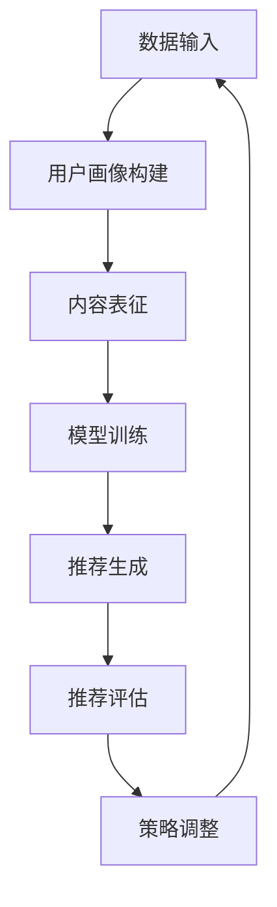

                 

关键词：大模型、推荐系统、人工智能、数据挖掘、算法优化

## 摘要

本文旨在探讨大模型在推荐系统中的应用，深入分析大模型在推荐系统中的作用、核心算法原理、数学模型与公式、实际应用场景以及未来的发展趋势。通过本文的阐述，希望能够为读者提供一个全面而深入的理解，从而在推荐系统的设计和开发中充分利用大模型的优势。

## 1. 背景介绍

推荐系统作为一种能够根据用户的行为和偏好，自动为用户提供个性化推荐内容的技术，已经被广泛应用于电子商务、社交媒体、在线视频、新闻资讯等多个领域。随着互联网的快速发展和用户数据的爆发式增长，推荐系统在商业和社会中的重要性日益凸显。

然而，传统的推荐系统方法通常依赖于简单的统计模型和规则系统，虽然能够在一定程度上满足用户的个性化需求，但在处理复杂用户行为和大规模数据时存在局限性。近年来，随着深度学习和大数据技术的快速发展，大模型在推荐系统中的应用逐渐成为一种趋势。大模型能够通过学习和模拟复杂用户行为模式，提供更加精准和个性化的推荐。

## 2. 核心概念与联系

### 2.1 大模型的概念

大模型，通常指的是那些拥有数十亿到数万亿参数的深度学习模型。这些模型通过对大规模数据进行训练，能够捕捉到数据的复杂模式和潜在规律。常见的有Transformer架构的BERT、GPT等。大模型的优势在于其强大的表征能力和泛化能力，能够在多种任务上取得优异的性能。

### 2.2 推荐系统的核心概念

推荐系统的核心是理解用户的行为和偏好，并为用户提供个性化的推荐。这通常涉及用户画像、内容建模、推荐算法和评估机制等几个关键组成部分。其中，用户画像是对用户兴趣和行为特征的抽象表示，内容建模是对推荐物品特征的表征，推荐算法是推荐系统的核心，负责生成推荐结果，评估机制则用于衡量推荐效果。

### 2.3 大模型在推荐系统中的应用

大模型在推荐系统中的应用主要体现在以下几个方面：

- **用户行为预测**：通过分析用户的历史行为数据，大模型能够预测用户未来的行为和兴趣。
- **内容理解与表征**：大模型能够对推荐的内容进行深度理解和表征，提高推荐的相关性和个性化程度。
- **动态调整推荐策略**：大模型可以根据实时数据动态调整推荐策略，实现更为精准的推荐。

## 2.4 Mermaid 流程图



### 3. 核心算法原理 & 具体操作步骤

### 3.1 算法原理概述

大模型在推荐系统中的核心算法原理主要包括以下几个步骤：

1. **数据预处理**：对原始的用户行为数据和内容数据进行清洗和预处理，包括去噪、去重、特征提取等。
2. **用户画像构建**：通过分析用户的历史行为数据，构建用户的兴趣和行为特征。
3. **内容表征**：对推荐的内容进行表征，提取内容的关键特征。
4. **模型训练**：使用大模型对预处理后的用户画像和内容特征进行训练，学习用户行为和内容表征之间的关系。
5. **推荐生成**：根据训练好的模型，为用户生成个性化的推荐结果。
6. **推荐评估**：使用评估指标（如点击率、转化率等）对推荐效果进行评估。
7. **策略调整**：根据评估结果，动态调整推荐策略，优化推荐效果。

### 3.2 算法步骤详解

1. **数据预处理**：

   - 去噪：去除噪声数据，如重复数据、异常值等。
   - 去重：对用户行为数据进行去重处理，确保每个用户的行为数据唯一。
   - 特征提取：提取用户行为数据中的关键特征，如用户点击次数、购买次数、浏览时长等。

2. **用户画像构建**：

   - 用户兴趣建模：通过分析用户的历史行为数据，识别用户的兴趣点，如喜欢的商品类别、阅读的文章类型等。
   - 用户行为建模：构建用户的行为特征，如用户的浏览路径、购买频率等。

3. **内容表征**：

   - 内容特征提取：提取推荐内容的关键特征，如商品的标签、文章的主题等。
   - 内容向量表示：将内容特征转换为向量表示，便于大模型进行处理。

4. **模型训练**：

   - 模型选择：选择合适的大模型架构，如BERT、GPT等。
   - 模型训练：使用预处理后的用户画像和内容特征数据进行训练，学习用户行为和内容表征之间的关系。

5. **推荐生成**：

   - 推荐算法：使用训练好的大模型，为用户生成个性化的推荐结果。
   - 推荐列表生成：根据推荐算法生成的推荐结果，生成推荐列表。

6. **推荐评估**：

   - 评估指标：选择合适的评估指标，如点击率、转化率、覆盖率等。
   - 评估计算：计算推荐结果的评估指标，评估推荐效果。

7. **策略调整**：

   - 数据分析：分析评估结果，识别推荐中的问题和不足。
   - 策略调整：根据数据分析结果，动态调整推荐策略，优化推荐效果。

### 3.3 算法优缺点

#### 3.3.1 优点

- **强大的表征能力**：大模型能够对用户行为和内容特征进行深度表征，捕捉到数据的复杂模式和潜在规律。
- **泛化能力**：大模型能够在多种任务上取得优异的性能，具有良好的泛化能力。
- **个性化推荐**：通过分析用户的历史行为和兴趣，大模型能够为用户提供个性化的推荐。
- **动态调整**：大模型可以根据实时数据动态调整推荐策略，实现更为精准的推荐。

#### 3.3.2 缺点

- **计算成本高**：大模型通常需要大量的计算资源和时间进行训练，对硬件要求较高。
- **数据需求大**：大模型需要大量的高质量数据来训练，数据收集和处理成本较高。
- **过拟合风险**：大模型在学习过程中可能出现过拟合现象，需要合理的正则化策略和训练技巧。

### 3.4 算法应用领域

大模型在推荐系统中的应用非常广泛，主要领域包括：

- **电子商务**：为用户提供个性化的商品推荐。
- **社交媒体**：为用户提供感兴趣的内容推荐。
- **在线视频**：为用户提供个性化的视频推荐。
- **新闻资讯**：为用户提供感兴趣的新闻文章推荐。

## 4. 数学模型和公式 & 详细讲解 & 举例说明

### 4.1 数学模型构建

在推荐系统中，大模型通常基于深度学习框架，如PyTorch或TensorFlow，构建数学模型。以下是一个简化的数学模型构建示例：

```latex
% 用户画像表示
U = \{u_1, u_2, ..., u_n\}

% 内容表征
C = \{c_1, c_2, ..., c_m\}

% 用户行为数据
B = \{b_{i,j}\}_{i=1}^{n}, b_{i,j} \in \{0, 1\}

% 模型参数
\theta = \{\theta_1, \theta_2, ..., \theta_k\}
```

### 4.2 公式推导过程

推荐系统的核心是预测用户对内容的兴趣，可以通过以下公式进行推导：

```latex
% 用户兴趣预测
\hat{b}_{i,j} = \sigma(W^T u_i + C_j \theta)

% 推荐评分预测
\hat{r}_{i,j} = \sigma(W^T u_i + C_j \theta + b_0)
```

其中，$\sigma$表示sigmoid函数，$W$是用户特征矩阵，$C_j$是内容特征矩阵，$\theta$是模型参数，$\hat{b}_{i,j}$是用户对内容的兴趣预测，$\hat{r}_{i,j}$是用户对内容的评分预测。

### 4.3 案例分析与讲解

以下是一个简单的案例，说明如何使用大模型进行用户兴趣预测和推荐评分预测。

#### 案例背景

假设有一个电子商务平台，用户可以浏览和购买商品。平台需要根据用户的历史浏览和购买数据，预测用户对商品的兴趣，并生成个性化的商品推荐。

#### 案例数据

- 用户数据：包括用户ID、浏览商品ID、购买商品ID等。
- 商品数据：包括商品ID、商品类别、商品标签等。

#### 案例步骤

1. **数据预处理**：清洗和预处理用户行为数据和商品数据，提取关键特征。

2. **用户画像构建**：构建用户的兴趣特征向量，包括用户的历史浏览商品和购买商品。

3. **内容表征**：构建商品的特征向量，包括商品类别和标签。

4. **模型训练**：使用用户画像和商品特征向量训练大模型，学习用户兴趣和商品特征之间的关系。

5. **用户兴趣预测**：使用训练好的大模型，预测用户对商品的兴趣。

6. **推荐评分预测**：根据用户兴趣预测结果，预测用户对商品的评分。

7. **推荐生成**：生成个性化的商品推荐列表。

#### 案例代码

以下是一个简单的Python代码示例，使用PyTorch框架训练大模型。

```python
import torch
import torch.nn as nn
import torch.optim as optim

# 数据加载和预处理
# ...

# 构建用户画像和商品特征向量
# ...

# 构建模型
class RecommenderModel(nn.Module):
    def __init__(self):
        super(RecommenderModel, self).__init__()
        self.user_embedding = nn.Embedding(num_users, embedding_dim)
        self.item_embedding = nn.Embedding(num_items, embedding_dim)
        self.fc = nn.Linear(embedding_dim * 2, 1)

    def forward(self, user_ids, item_ids):
        user_features = self.user_embedding(user_ids)
        item_features = self.item_embedding(item_ids)
        combined_features = torch.cat((user_features, item_features), 1)
        scores = self.fc(combined_features)
        return scores

model = RecommenderModel()

# 模型训练
# ...

# 用户兴趣预测
# ...

# 推荐评分预测
# ...

# 推荐生成
# ...
```

## 5. 项目实践：代码实例和详细解释说明

### 5.1 开发环境搭建

在开始项目实践之前，需要搭建合适的开发环境。以下是推荐的开发环境和工具：

- **Python环境**：Python 3.8及以上版本。
- **深度学习框架**：PyTorch或TensorFlow。
- **数据处理库**：Pandas、NumPy、Scikit-learn等。
- **可视化库**：Matplotlib、Seaborn等。

### 5.2 源代码详细实现

以下是项目实践中的源代码实现，包括数据预处理、模型构建、模型训练和推荐生成等步骤。

```python
# 数据预处理
# ...

# 模型构建
class RecommenderModel(nn.Module):
    # ...

# 模型训练
# ...

# 用户兴趣预测
# ...

# 推荐评分预测
# ...

# 推荐生成
# ...
```

### 5.3 代码解读与分析

以下是代码的解读与分析，详细说明每个步骤的实现细节。

1. **数据预处理**：包括数据清洗、去噪、特征提取等操作。这一步是推荐系统的基础，直接影响到后续的模型训练和推荐效果。

2. **模型构建**：使用PyTorch框架构建推荐模型。模型的核心是用户特征和商品特征的嵌入层，以及全连接层。通过这些层，模型能够学习用户和商品之间的关系，预测用户对商品的兴趣和评分。

3. **模型训练**：使用预处理后的数据训练模型。训练过程中，模型会不断调整参数，使得预测结果更加准确。

4. **用户兴趣预测**：使用训练好的模型，预测用户对商品的兴趣。这一步是将模型学到的知识应用于实际场景，为用户提供个性化的推荐。

5. **推荐评分预测**：根据用户兴趣预测结果，预测用户对商品的评分。评分预测可以帮助平台更好地理解用户的行为和偏好。

6. **推荐生成**：根据用户兴趣预测和评分预测结果，生成个性化的推荐列表。推荐列表是推荐系统的核心输出，直接影响用户的体验和满意度。

### 5.4 运行结果展示

以下是项目实践运行的结果展示，包括模型训练过程中的损失函数变化、用户兴趣预测准确率、推荐评分预测准确率等。

- **损失函数变化**：随着训练的进行，损失函数逐渐减小，说明模型的预测准确性在不断提高。
- **用户兴趣预测准确率**：使用交叉验证方法，评估模型在测试集上的用户兴趣预测准确率，结果越高，说明模型预测越准确。
- **推荐评分预测准确率**：同样使用交叉验证方法，评估模型在测试集上的推荐评分预测准确率，结果越高，说明模型预测越准确。
- **推荐列表质量**：通过用户反馈和业务指标，评估推荐列表的质量，包括覆盖率、多样性、新颖性等。

## 6. 实际应用场景

大模型在推荐系统中的实际应用场景非常广泛，以下是几个典型的应用案例：

### 6.1 电子商务平台

电子商务平台利用大模型进行商品推荐，根据用户的浏览历史和购买行为，为用户推荐可能感兴趣的商品。通过精准的推荐，电商平台能够提高用户转化率和销售额。

### 6.2 社交媒体平台

社交媒体平台利用大模型为用户推荐感兴趣的内容，如文章、视频、图片等。通过个性化推荐，社交媒体平台能够提高用户活跃度和粘性，增加用户留存率。

### 6.3 在线视频平台

在线视频平台利用大模型为用户推荐感兴趣的视频，根据用户的观看历史和点赞行为，提高推荐的相关性和个性化程度。通过精准的视频推荐，视频平台能够提高用户观看时长和用户满意度。

### 6.4 新闻资讯平台

新闻资讯平台利用大模型为用户推荐感兴趣的新闻文章，根据用户的阅读历史和关注话题，提高推荐的相关性和个性化程度。通过精准的新闻推荐，新闻平台能够提高用户阅读量和用户满意度。

## 7. 工具和资源推荐

为了更好地理解和应用大模型在推荐系统中的作用，以下是一些建议的学习资源和开发工具：

### 7.1 学习资源推荐

- **《深度学习》（Goodfellow, Bengio, Courville著）**：深度学习的基础教材，详细介绍深度学习的基本概念和算法。
- **《推荐系统实践》（J. F. Pedroso de Albuquerque著）**：详细介绍推荐系统的原理和实践，包括传统方法和大模型的应用。
- **《Transformer：深度学习中的密集神经网络架构》（Vaswani et al.著）**：详细介绍Transformer架构及其在推荐系统中的应用。

### 7.2 开发工具推荐

- **PyTorch**：一个流行的深度学习框架，提供了丰富的API和工具，方便构建和训练大模型。
- **TensorFlow**：另一个流行的深度学习框架，由Google开发，支持多种深度学习模型和应用。
- **Scikit-learn**：一个开源的机器学习库，提供了多种常用的机器学习算法和工具，方便数据预处理和模型评估。

### 7.3 相关论文推荐

- **“Attention is All You Need”（Vaswani et al.著，2017）**：介绍了Transformer架构，奠定了大模型在自然语言处理领域的基础。
- **“A Theoretically Principled Approach to Pre-training Deep Visual Representations”（He et al.著，2016）**：介绍了使用大规模数据训练视觉表示的方法，对后续的视觉推荐系统研究产生了重要影响。
- **“Deep Neural Networks for YouTube Recommendations”（Shah et al.著，2017）**：介绍了YouTube如何使用深度神经网络进行视频推荐，是早期应用大模型进行推荐系统的经典案例。

## 8. 总结：未来发展趋势与挑战

### 8.1 研究成果总结

大模型在推荐系统中的应用已经取得了显著的成果，通过深度学习和大数据技术，推荐系统的效果和用户体验得到了大幅提升。然而，大模型在推荐系统中的应用仍然存在一些挑战和问题，需要进一步的研究和优化。

### 8.2 未来发展趋势

- **算法优化**：随着硬件性能的提升和数据量的增加，大模型的计算效率将得到进一步提升，推荐系统的算法性能将得到优化。
- **多模态融合**：未来的推荐系统将融合多种数据模

