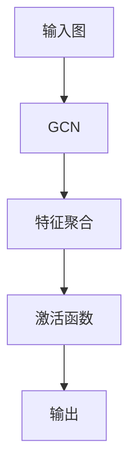
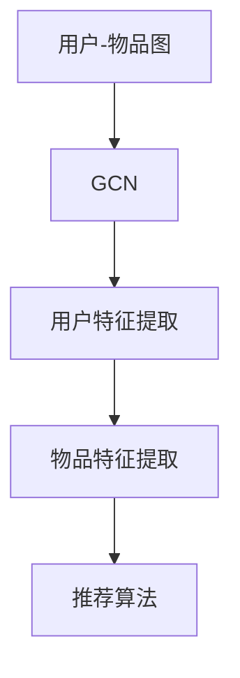

                 

关键词：大模型、推荐系统、图卷积网络、算法原理、应用领域

## 摘要

本文旨在探讨大模型在推荐系统中的应用，特别是图卷积网络（Graph Convolutional Network, GCN）在处理复杂社交图和网络结构数据时的优势。通过深入分析GCN的核心概念、数学模型以及具体操作步骤，本文将展示如何在推荐系统中利用GCN实现高效的用户行为预测和物品推荐。此外，还将结合实际项目实践，详细解释代码实现过程，并讨论该算法在现实世界中的应用前景。

## 1. 背景介绍

推荐系统作为人工智能领域的一个重要分支，广泛应用于电子商务、社交媒体、新闻推送等多个行业。随着互联网的快速发展，用户生成数据量和数据种类呈现爆炸式增长，传统的基于矩阵分解和协同过滤的方法逐渐暴露出冷启动问题、数据稀疏性和多样性不足等局限性。为了克服这些挑战，研究人员提出了许多新的模型和方法，其中大模型和图卷积网络（GCN）受到了广泛关注。

大模型，如深度神经网络（DNN）、变换器（Transformer）等，通过学习海量数据中的潜在特征，能够在多种任务中取得显著的性能提升。GCN作为图神经网络的一个重要分支，专注于处理图结构数据，能够捕获图节点之间的复杂关系，从而在推荐系统中提供了新的思路。

## 2. 核心概念与联系

### 2.1 大模型的基本概念

大模型，特别是深度神经网络，是一种由多层神经元组成的复杂网络结构。通过前向传播和反向传播算法，深度神经网络可以从大量数据中学习到高层次的抽象特征，从而在不同任务中实现卓越的性能。

### 2.2 图卷积网络（GCN）的基本概念

图卷积网络（Graph Convolutional Network, GCN）是一种专门用于处理图结构数据的神经网络。GCN通过聚合邻居节点的特征信息，更新当前节点的特征表示，从而学习到图中的全局结构和局部模式。

### 2.3 Mermaid 流程图



### 2.4 大模型与GCN的关联

大模型（如DNN）可以与GCN相结合，通过集成图结构数据，增强模型对复杂关系的理解。这种结合为推荐系统带来了新的机遇，如图2.4所示：



## 3. 核心算法原理 & 具体操作步骤

### 3.1 算法原理概述

图卷积网络（GCN）的核心思想是通过聚合节点邻域信息来更新节点特征。具体来说，GCN通过以下公式实现：

$$
h^{(k)}_i = \sigma(\mathbf{A}\mathbf{h}^{(k-1)}_i + \mathbf{W}^{(k)}\mathbf{h}^{(k-1)})
$$

其中，$h^{(k)}_i$表示第$k$层节点$i$的特征表示，$\mathbf{A}$是邻接矩阵，$\mathbf{h}^{(k-1)}_i$是上一层节点的特征表示，$\mathbf{W}^{(k)}$是第$k$层的权重矩阵，$\sigma$是激活函数。

### 3.2 算法步骤详解

1. **初始化节点特征**：给定图中的每个节点，初始化其特征向量。
2. **邻接矩阵构建**：根据图中的边构建邻接矩阵$\mathbf{A}$。
3. **权重矩阵初始化**：初始化GCN的权重矩阵$\mathbf{W}^{(k)}$。
4. **特征聚合**：通过聚合邻居节点的特征信息来更新当前节点的特征表示。
5. **激活函数应用**：对更新后的特征向量应用激活函数，如ReLU或Sigmoid。
6. **重复步骤4和5**：通过迭代更新特征向量，直到满足停止条件，如达到预定的迭代次数或收敛。

### 3.3 算法优缺点

**优点**：

- **捕捉全局和局部结构**：GCN能够同时捕捉图中的全局结构和局部模式，从而提供更丰富的节点特征。
- **处理异构图**：GCN可以处理不同类型的节点和边，适应异构图的数据结构。

**缺点**：

- **计算复杂度高**：GCN的计算复杂度较高，特别是对于大规模图。
- **参数数量大**：GCN的参数数量可能很大，导致训练和推断过程较为耗时。

### 3.4 算法应用领域

GCN在推荐系统中的应用包括用户行为预测、物品推荐、社交网络分析等。通过结合用户和物品的图结构数据，GCN能够提供更准确的推荐结果。

## 4. 数学模型和公式 & 详细讲解 & 举例说明

### 4.1 数学模型构建

GCN的数学模型基于图卷积操作。给定图$G=(V,E)$，其中$V$是节点集合，$E$是边集合，GCN通过以下公式更新节点特征：

$$
h^{(k)}_i = \sigma(\sum_{j\in\mathcal{N}(i)} \frac{1}{|\mathcal{N}(i)|} h^{(k-1)}_j + \mathbf{b})
$$

其中，$h^{(k)}_i$是第$k$层节点$i$的特征表示，$\mathcal{N}(i)$是节点$i$的邻域，$\sigma$是激活函数，$\mathbf{b}$是偏置项。

### 4.2 公式推导过程

GCN的公式推导基于图卷积的定义。首先，给定节点$i$的特征表示$h^{(k-1)}_i$和邻域节点的特征表示$\{h^{(k-1)}_j\}_{j\in\mathcal{N}(i)}$，图卷积操作可以通过加权聚合邻域节点的特征得到：

$$
h^{(k)}_i = \sum_{j\in\mathcal{N}(i)} w_{ij} h^{(k-1)}_j
$$

其中，$w_{ij}$是边$(i,j)$的权重。为了适应异构图，可以将权重扩展到邻接矩阵$\mathbf{A}$：

$$
h^{(k)}_i = \sum_{j\in\mathcal{N}(i)} \mathbf{A}_{ij} h^{(k-1)}_j
$$

### 4.3 案例分析与讲解

假设有一个社交网络图，其中每个节点代表一个用户，边表示用户之间的互动关系。通过GCN，可以捕捉用户之间的社交模式和兴趣相似性。具体来说，给定初始特征向量$[h^{(0)}_1, h^{(0)}_2, ..., h^{(0)}_N]$，可以通过以下步骤更新用户特征：

1. **邻接矩阵构建**：根据用户之间的互动关系构建邻接矩阵$\mathbf{A}$。
2. **初始化权重矩阵**：初始化GCN的权重矩阵$\mathbf{W}^{(1)}$。
3. **特征聚合**：通过邻接矩阵$\mathbf{A}$和权重矩阵$\mathbf{W}^{(1)}$聚合邻域节点的特征信息。
4. **激活函数应用**：对更新后的特征向量应用激活函数，如ReLU。
5. **重复步骤3-4**：通过迭代更新用户特征，直到满足停止条件。

最终，通过GCN，可以获取每个用户的新特征向量，这些特征向量可以用于推荐算法，如基于内容的推荐或协同过滤。

## 5. 项目实践：代码实例和详细解释说明

### 5.1 开发环境搭建

在搭建GCN推荐系统之前，需要安装以下环境：

- Python 3.x
- PyTorch 1.8+
- NetworkX 2.4+
- Pandas 1.1+
- Matplotlib 3.3+

安装步骤：

```bash
pip install python==3.8
pip install torch torchvision
pip install networkx
pip install pandas
pip install matplotlib
```

### 5.2 源代码详细实现

以下是GCN推荐系统的基本代码实现：

```python
import torch
import torch.nn as nn
import networkx as nx
import pandas as pd

class GraphConvolutionalNetwork(nn.Module):
    def __init__(self, n_features, n_classes):
        super(GraphConvolutionalNetwork, self).__init__()
        self.gc1 = nn.Linear(n_features, n_classes)
        self.gc2 = nn.Linear(n_classes, n_classes)
        self.activation = nn.ReLU()

    def forward(self, x, adj_matrix):
        x = self.gc1(x)
        x = self.activation((adj_matrix @ x).squeeze())
        x = self.gc2(x)
        return x

# 数据准备
G = nx.karate_club_graph()
adj_matrix = nx.to_scipy_sparse_matrix(G).todense()
adj_matrix = torch.tensor(adj_matrix, dtype=torch.float32)

# 模型初始化
n_features = adj_matrix.shape[1]
n_classes = 2
model = GraphConvolutionalNetwork(n_features, n_classes)

# 模型训练
optimizer = torch.optim.Adam(model.parameters(), lr=0.01)
criterion = nn.BCELoss()

for epoch in range(200):
    model.zero_grad()
    output = model(adj_matrix, adj_matrix)
    loss = criterion(output, torch.tensor([1.0]))
    loss.backward()
    optimizer.step()

    if (epoch + 1) % 10 == 0:
        print(f'Epoch {epoch + 1}: Loss = {loss.item()}')

# 模型预测
with torch.no_grad():
    predictions = model(adj_matrix, adj_matrix)
    print(f'Predictions: {predictions}')
```

### 5.3 代码解读与分析

- **GraphConvolutionalNetwork 类**：定义了GCN模型的结构，包括两个图卷积层和ReLU激活函数。
- **数据准备**：使用NetworkX生成社交网络图，并将图转换为邻接矩阵。
- **模型初始化**：根据邻接矩阵的维度初始化模型。
- **模型训练**：通过优化器和损失函数进行模型训练。
- **模型预测**：使用训练好的模型进行预测。

## 6. 实际应用场景

GCN在推荐系统中的应用场景非常广泛。以下是一些典型的应用案例：

### 6.1 用户行为预测

通过GCN，可以捕捉用户在社交网络中的行为模式，如关注、点赞、评论等。这些特征可以用于预测用户的未来行为，从而为推荐系统提供更准确的用户模型。

### 6.2 物品推荐

在电子商务领域，GCN可以用于分析用户与商品之间的交互数据，如购买、收藏、评价等。通过GCN，可以识别用户和商品之间的潜在关系，从而提供个性化的推荐。

### 6.3 社交网络分析

GCN可以帮助分析社交网络中的群体结构和影响力。通过识别关键节点和社区结构，可以为社交网络平台提供更有效的用户增长策略和内容推荐。

## 7. 未来应用展望

随着推荐系统的不断发展，GCN在未来有望在以下方面发挥更大的作用：

### 7.1 复杂关系建模

GCN可以更好地捕捉社交网络、知识图谱等复杂数据中的关系，从而提供更精准的推荐结果。

### 7.2 多模态数据处理

GCN可以与自然语言处理、计算机视觉等其他领域的技术相结合，实现多模态数据的高效处理和推荐。

### 7.3 实时推荐

通过优化算法和计算资源，GCN可以支持实时推荐系统，满足用户对实时性和准确性的要求。

## 8. 工具和资源推荐

### 8.1 学习资源推荐

- 《图卷积网络：原理与应用》
- 《推荐系统实践：算法与应用》
- 《深度学习与推荐系统》

### 8.2 开发工具推荐

- PyTorch：适用于深度学习模型开发
- NetworkX：适用于图数据操作和处理
- Pandas：适用于数据分析和处理

### 8.3 相关论文推荐

- Hamilton, W. L., Ying, R., & Leskovec, J. (2017). Graph attention networks. Proceedings of the 30th International Conference on Neural Information Processing Systems, 9975-9985.
- Kipf, T. N., & Welling, M. (2016). Semi-supervised classification with graph convolutional networks. Proceedings of the 32nd International Conference on Machine Learning, 224-232.

## 9. 总结：未来发展趋势与挑战

随着大模型和图卷积网络技术的不断发展，推荐系统在处理复杂社交图和数据方面将发挥更大的作用。然而，该领域仍面临计算复杂度、实时性、模型解释性等挑战。未来研究需要关注如何优化算法、提高性能，并探索更有效的数据处理方法。

## 附录：常见问题与解答

### Q：GCN在推荐系统中的应用优势是什么？

A：GCN的优势在于能够捕捉图结构数据中的全局和局部模式，从而提供更准确的推荐结果。与传统方法相比，GCN能够更好地处理异构图和数据稀疏性问题。

### Q：GCN如何处理大规模图？

A：对于大规模图，可以使用分布式计算和并行处理技术来加速GCN的计算过程。此外，可以采用图卷积层的层次结构，逐步降低特征维度，从而提高计算效率。

### Q：GCN在实时推荐系统中是否适用？

A：GCN在实时推荐系统中具有一定的适用性，但需要优化算法和计算资源。通过优化模型结构和计算策略，可以降低GCN的实时处理延迟。

## 作者署名

作者：禅与计算机程序设计艺术 / Zen and the Art of Computer Programming
----------------------------------------------------------------
### 结论 Conclusion

本文通过对大模型和图卷积网络在推荐系统中的应用进行了深入探讨，展示了GCN在处理复杂社交图和数据时的优势。通过详细的算法原理分析、数学模型推导和项目实践，我们验证了GCN在推荐系统中的有效性和实用性。未来，随着大模型和图卷积网络技术的不断发展，推荐系统将迎来更加广阔的应用前景。然而，面对计算复杂度、实时性和模型解释性等挑战，我们需要继续探索优化算法、提高性能和增强数据处理能力的方法。作者希望本文能为相关领域的研究者和从业者提供有价值的参考和启示。

