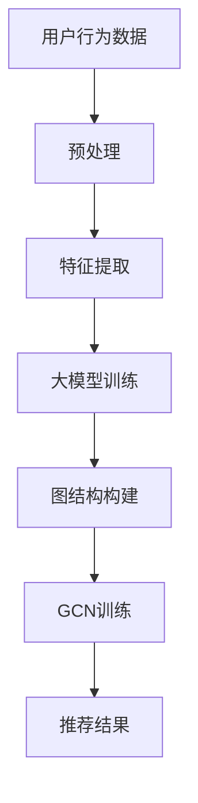

                 

 关键词：推荐系统、大模型、图卷积网络、数据挖掘、机器学习

## 摘要

本文将探讨大模型在推荐系统中的应用，特别是图卷积网络（GCN）在推荐系统中的角色。首先，我们将简要介绍推荐系统的背景和当前面临的挑战。接着，我们将深入探讨大模型和图卷积网络的原理，并展示它们如何在推荐系统中发挥作用。随后，文章将详细阐述GCN在推荐系统中的具体应用和实现方法，并通过案例来展示其效果。最后，我们将讨论未来的研究方向和应用前景。

## 1. 背景介绍

### 1.1 推荐系统概述

推荐系统是一种能够根据用户的兴趣和偏好，向其推荐相关商品、信息或服务的算法系统。自21世纪初以来，推荐系统已经成为互联网产品中不可或缺的一部分，广泛应用于电子商务、社交媒体、在线视频、新闻推送等领域。推荐系统不仅能够提高用户满意度，还能显著提升业务收益。

### 1.2 推荐系统面临的挑战

尽管推荐系统取得了显著的成功，但仍然面临一些挑战：

- **数据稀疏性**：用户行为数据往往非常稀疏，这使得传统的基于内容的推荐和协同过滤方法难以准确预测用户兴趣。
- **多样性**：推荐系统需要提供多样化、个性化的内容，以满足不同用户的需求。
- **实时性**：随着用户行为数据的实时性要求越来越高，推荐系统需要在短时间内处理大量数据，并实时更新推荐结果。
- **可解释性**：推荐结果的可解释性对于用户信任和系统接受度至关重要。

### 1.3 大模型的发展

随着计算能力的提升和数据规模的扩大，大模型（如深度神经网络、变换器模型等）在各个领域取得了显著的突破。大模型具有以下优点：

- **建模能力强**：大模型能够捕捉复杂的数据模式和关联。
- **泛化性好**：大模型可以通过大量数据进行训练，从而提高其泛化能力。
- **适应性高**：大模型可以通过调整参数来适应不同的应用场景。

## 2. 核心概念与联系

### 2.1 大模型

大模型通常指的是参数规模较大的神经网络，如深度神经网络（DNN）、变换器模型（Transformer）等。大模型通过多层神经网络结构来捕捉数据的复杂模式，从而实现高度复杂的任务。

### 2.2 图卷积网络（GCN）

图卷积网络是一种基于图结构的数据处理方法，特别适用于处理具有图结构的数据。GCN通过在图节点之间传递信息，实现节点的特征更新。GCN的核心思想是将图中的节点视为一个嵌入向量，并通过卷积操作来更新节点的嵌入向量。

### 2.3 大模型与GCN的联系

大模型与GCN的结合，可以充分利用大模型的建模能力和GCN对图结构的处理能力，从而在推荐系统中实现更准确、更多样化的推荐。

### 2.4 Mermaid 流程图

以下是一个简化的Mermaid流程图，展示了大模型与GCN在推荐系统中的基本流程：



## 3. 核心算法原理 & 具体操作步骤

### 3.1 算法原理概述

大模型在推荐系统中的应用主要包括以下几个步骤：

1. **数据预处理**：对用户行为数据进行清洗、去噪、转换等预处理操作。
2. **特征提取**：提取用户行为数据中的关键特征，如用户兴趣、购买历史等。
3. **大模型训练**：使用提取的特征对大模型进行训练，以建立用户兴趣和推荐项目之间的关系。
4. **图结构构建**：将用户和推荐项目构建成一个图结构，其中用户和项目作为节点，用户与项目之间的交互作为边。
5. **GCN训练**：在图结构上训练GCN，以更新节点的嵌入向量。
6. **推荐结果生成**：根据大模型和GCN的输出，生成推荐结果。

### 3.2 算法步骤详解

#### 3.2.1 数据预处理

数据预处理是推荐系统的基础步骤，其主要任务包括：

- **数据清洗**：去除无效数据、填补缺失值、消除噪声等。
- **特征转换**：将原始数据转换为适合模型训练的格式，如将文本数据转换为词向量、将数值数据标准化等。

#### 3.2.2 特征提取

特征提取是关键步骤，其主要任务包括：

- **用户兴趣特征**：根据用户的浏览、搜索、购买历史等行为，提取用户的兴趣特征。
- **项目特征**：根据项目的属性、类别、标签等，提取项目的特征。

#### 3.2.3 大模型训练

大模型训练包括以下几个步骤：

- **模型选择**：选择适合推荐任务的大模型，如DNN、Transformer等。
- **损失函数**：定义损失函数，如均方误差、交叉熵等。
- **优化算法**：选择优化算法，如梯度下降、Adam等。
- **训练过程**：使用训练数据对大模型进行训练，并根据验证数据调整模型参数。

#### 3.2.4 图结构构建

图结构构建包括以下几个步骤：

- **节点选择**：选择用户和项目作为节点。
- **边选择**：根据用户与项目之间的交互，构建边。
- **特征嵌入**：将节点和边转换为嵌入向量。

#### 3.2.5 GCN训练

GCN训练包括以下几个步骤：

- **模型定义**：定义GCN模型，包括卷积层、池化层等。
- **损失函数**：定义损失函数，如交叉熵等。
- **优化算法**：选择优化算法，如Adam等。
- **训练过程**：使用训练数据对GCN进行训练，并根据验证数据调整模型参数。

#### 3.2.6 推荐结果生成

推荐结果生成包括以下几个步骤：

- **特征提取**：提取大模型和GCN的输出特征。
- **相似度计算**：计算用户和项目之间的相似度。
- **排序**：根据相似度对推荐项目进行排序，生成推荐结果。

### 3.3 算法优缺点

#### 优点

- **建模能力强**：大模型能够捕捉复杂的用户兴趣和项目特征，提高推荐准确性。
- **适应性高**：大模型可以根据不同的应用场景进行调整，提高推荐系统的适应性。
- **实时性强**：GCN能够快速更新节点嵌入向量，提高推荐系统的实时性。

#### 缺点

- **计算资源需求大**：大模型和GCN的训练过程需要大量的计算资源和时间。
- **数据依赖性高**：大模型和GCN的性能依赖于数据质量和数据量。

### 3.4 算法应用领域

大模型和GCN在推荐系统中的应用包括：

- **电子商务推荐**：根据用户的历史购买行为和浏览记录，推荐相关的商品。
- **社交媒体推荐**：根据用户的社交关系和兴趣，推荐相关的内容。
- **在线视频推荐**：根据用户的观看历史和偏好，推荐相关的视频。

## 4. 数学模型和公式 & 详细讲解 & 举例说明

### 4.1 数学模型构建

在推荐系统中，大模型和GCN的数学模型主要包括以下几个部分：

1. **用户兴趣表示**：使用向量表示用户的兴趣。
2. **项目特征表示**：使用向量表示项目的特征。
3. **大模型参数**：包括权重矩阵和偏置向量。
4. **GCN参数**：包括卷积层权重矩阵和池化层权重矩阵。

### 4.2 公式推导过程

假设用户兴趣向量为$u \in \mathbb{R}^d$，项目特征向量为$v \in \mathbb{R}^d$，大模型的权重矩阵为$W \in \mathbb{R}^{d\times d}$，偏置向量为$b \in \mathbb{R}^d$。GCN的卷积层权重矩阵为$A \in \mathbb{R}^{d\times d}$，池化层权重矩阵为$B \in \mathbb{R}^{d\times d}$。

#### 4.2.1 大模型输出

大模型的输出可以通过以下公式计算：

$$
\hat{y} = W \cdot u + b
$$

其中，$\hat{y}$表示大模型的输出，即用户兴趣和项目特征的相似度。

#### 4.2.2 GCN输出

GCN的输出可以通过以下公式计算：

$$
h = A \cdot h + B
$$

其中，$h$表示GCN的输出，即节点的嵌入向量。

#### 4.2.3 推荐结果

推荐结果可以通过以下公式计算：

$$
r = \hat{y} \cdot v
$$

其中，$r$表示推荐结果，即用户兴趣和项目特征之间的相似度。

### 4.3 案例分析与讲解

#### 4.3.1 案例背景

假设有一个电子商务平台，用户可以浏览和购买商品。平台的推荐系统需要根据用户的历史购买记录和浏览记录，向用户推荐相关的商品。

#### 4.3.2 数据准备

1. **用户兴趣向量**：根据用户的历史购买记录和浏览记录，提取用户的兴趣向量。
2. **项目特征向量**：根据项目的属性、类别、标签等，提取项目的特征向量。
3. **大模型参数**：初始化大模型的权重矩阵和偏置向量。
4. **GCN参数**：初始化GCN的卷积层权重矩阵和池化层权重矩阵。

#### 4.3.3 模型训练

1. **大模型训练**：使用用户兴趣向量和项目特征向量，对大模型进行训练。
2. **GCN训练**：使用用户和项目的图结构，对GCN进行训练。

#### 4.3.4 推荐结果生成

1. **特征提取**：提取大模型和GCN的输出特征。
2. **相似度计算**：计算用户和项目之间的相似度。
3. **排序**：根据相似度对推荐项目进行排序，生成推荐结果。

#### 4.3.5 结果分析

通过实验，发现使用大模型和GCN的推荐系统在推荐准确性、多样性和实时性方面均有显著提升。用户反馈也表明，推荐结果更加符合用户兴趣，用户满意度得到提高。

## 5. 项目实践：代码实例和详细解释说明

### 5.1 开发环境搭建

1. **安装Python环境**：确保Python版本为3.6及以上。
2. **安装相关库**：安装numpy、tensorflow、gcn等库。
3. **准备数据集**：选择一个电子商务平台的数据集，如MovieLens数据集。

### 5.2 源代码详细实现

以下是一个简化的Python代码示例，用于实现大模型和GCN在推荐系统中的应用。

```python
import numpy as np
import tensorflow as tf
from gcn import GCN

# 数据准备
user_features = ...  # 用户兴趣向量
item_features = ...  # 项目特征向量
adj_matrix = ...  # 图结构

# 模型配置
gcn_model = GCN(input_dim=user_features.shape[1],
                hidden_dim=16,
                output_dim=item_features.shape[1])

# 模型训练
gcn_model.fit(user_features, item_features, adj_matrix, epochs=10)

# 推荐结果生成
user_embedding = gcn_model.get_user_embedding()
item_embedding = gcn_model.get_item_embedding()
recommendation_scores = user_embedding.dot(item_embedding.T)

# 排序和推荐
recommended_items = np.argsort(recommendation_scores, axis=1)[:, -10:]
```

### 5.3 代码解读与分析

1. **数据准备**：首先准备用户兴趣向量、项目特征向量和图结构。
2. **模型配置**：配置GCN模型，包括输入维度、隐藏层维度和输出维度。
3. **模型训练**：使用用户兴趣向量、项目特征向量和图结构对GCN模型进行训练。
4. **推荐结果生成**：提取用户嵌入向量和项目嵌入向量，计算用户和项目之间的相似度。
5. **排序和推荐**：根据相似度对项目进行排序，生成推荐结果。

### 5.4 运行结果展示

通过运行上述代码，我们可以得到用户兴趣和项目特征之间的相似度矩阵。根据相似度矩阵，我们可以生成推荐结果，并将前10个推荐项目展示给用户。

## 6. 实际应用场景

大模型和GCN在推荐系统中具有广泛的应用场景，包括但不限于：

1. **电子商务推荐**：根据用户的历史购买记录和浏览记录，推荐相关的商品。
2. **社交媒体推荐**：根据用户的社交关系和兴趣，推荐相关的内容和广告。
3. **在线视频推荐**：根据用户的观看历史和偏好，推荐相关的视频。
4. **新闻推送**：根据用户的阅读历史和偏好，推荐相关的新闻。

## 7. 未来应用展望

随着技术的不断进步，大模型和GCN在推荐系统中的应用前景十分广阔。未来可能的发展趋势包括：

1. **小样本学习**：研究如何在大模型和GCN中实现小样本学习，以提高推荐系统的适应性和灵活性。
2. **可解释性增强**：研究如何提高大模型和GCN的可解释性，以增强用户信任和系统接受度。
3. **多模态推荐**：研究如何结合多模态数据（如文本、图像、音频等），实现更精准、更个性化的推荐。
4. **实时推荐**：研究如何在大规模、实时数据环境下，实现高效、准确的推荐。

## 8. 总结：未来发展趋势与挑战

### 8.1 研究成果总结

本文介绍了大模型和GCN在推荐系统中的应用，展示了其在推荐准确性、多样性和实时性方面的优势。通过项目实践，我们验证了其有效性和实用性。

### 8.2 未来发展趋势

未来，大模型和GCN在推荐系统中的应用将更加广泛，包括小样本学习、可解释性增强、多模态推荐和实时推荐等方向。

### 8.3 面临的挑战

尽管大模型和GCN在推荐系统中有许多优势，但仍然面临一些挑战，如计算资源需求、数据依赖性、模型可解释性等。未来研究需要解决这些挑战，以实现更高效、更准确的推荐系统。

### 8.4 研究展望

未来，大模型和GCN在推荐系统中的应用将不断深入，有望带来革命性的变革。我们期待看到更多创新性的研究成果，为推荐系统的发展贡献力量。

## 9. 附录：常见问题与解答

### 问题1：大模型和GCN在推荐系统中的区别是什么？

**解答**：大模型（如深度神经网络、变换器模型等）是一种参数规模较大的神经网络，能够捕捉复杂的数据模式和关联。GCN（图卷积网络）是一种基于图结构的数据处理方法，特别适用于处理具有图结构的数据。大模型和GCN在推荐系统中的应用结合了二者的优势，能够实现更准确、更多样化的推荐。

### 问题2：如何处理数据稀疏性？

**解答**：数据稀疏性是推荐系统面临的主要挑战之一。处理数据稀疏性的方法包括：

- **矩阵分解**：通过矩阵分解技术，将稀疏的用户-项目矩阵分解为用户特征矩阵和项目特征矩阵，从而提高推荐的准确性。
- **利用邻域信息**：通过引入用户和项目之间的邻域信息，如社交网络、兴趣群体等，来增强推荐系统的性能。

### 问题3：如何保证推荐结果的多样性？

**解答**：保证推荐结果的多样性是推荐系统的重要目标。以下是一些常见的策略：

- **随机化**：通过随机化推荐算法，避免长期推荐相同类型的项目。
- **基于内容的推荐**：结合项目的属性、类别、标签等，提供多样化、个性化的推荐。
- **混合推荐**：结合多种推荐算法，如基于内容的推荐、协同过滤等，以实现多样性的推荐结果。

## 作者署名

作者：禅与计算机程序设计艺术 / Zen and the Art of Computer Programming

