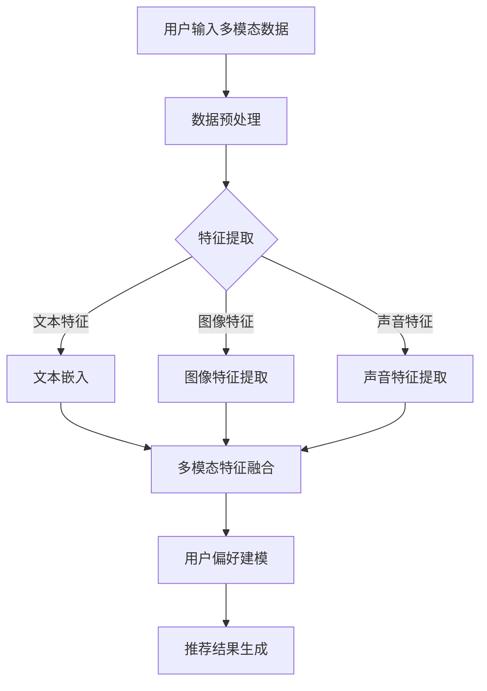

                 

关键词：推荐系统、多模态融合、大模型、人工智能、深度学习

## 摘要

本文将探讨大模型在推荐系统多模态融合中的应用。随着互联网和大数据技术的飞速发展，推荐系统已成为现代信息检索和个性化服务的重要组成部分。然而，传统的推荐系统在处理多模态数据时面临着诸多挑战，如数据不一致性、特征表征不足等。近年来，大模型的兴起为多模态融合提供了新的契机，本文将详细介绍大模型在推荐系统中的应用原理、核心算法、数学模型以及实际应用场景，并对其未来发展进行展望。

## 1. 背景介绍

### 1.1 推荐系统的发展历程

推荐系统作为信息检索和个性化服务的重要组成部分，其发展历程大致可以分为以下几个阶段：

- **基于内容的推荐（Content-Based Recommendation）**：该阶段主要利用用户的历史行为数据，如浏览记录、购买历史等，来推荐与用户兴趣相似的内容。

- **协同过滤推荐（Collaborative Filtering）**：基于用户行为数据的相似性进行推荐，分为基于用户的协同过滤（User-Based Collaborative Filtering）和基于项目的协同过滤（Item-Based Collaborative Filtering）。

- **混合推荐（Hybrid Recommendation）**：结合多种推荐策略，以弥补单一推荐策略的不足。

- **深度学习推荐（Deep Learning Recommendation）**：利用深度学习模型对用户和物品进行特征提取和融合，实现更精准的推荐。

### 1.2 多模态融合的挑战

在推荐系统中，多模态融合意味着将不同类型的数据（如文本、图像、声音等）进行整合，以获得更全面、准确的用户偏好信息。然而，多模态融合面临着以下挑战：

- **数据不一致性**：不同模态的数据在维度、分布等方面可能存在差异，导致数据融合困难。

- **特征表征不足**：单一模态的数据可能无法充分表达用户偏好，需要通过多模态融合来提高特征表征能力。

- **计算复杂度高**：多模态融合往往涉及大量的计算，对计算资源和算法效率提出更高要求。

### 1.3 大模型的兴起

大模型是指具有巨大参数规模、能够处理大规模数据的人工智能模型，如Transformer、BERT等。大模型的兴起为推荐系统多模态融合提供了新的技术手段，主要体现在以下几个方面：

- **更强的特征表征能力**：大模型能够自动学习丰富的特征表示，有助于挖掘多模态数据中的潜在关系。

- **高效的计算能力**：大模型通常采用并行计算和分布式计算技术，能够高效地处理大规模数据。

- **自适应学习能力**：大模型能够根据不同的应用场景进行自适应调整，提高推荐系统的泛化能力。

## 2. 核心概念与联系

为了更好地理解大模型在推荐系统多模态融合中的作用，我们首先需要介绍一些核心概念。

### 2.1 多模态数据

多模态数据是指由多种不同类型的数据源生成的数据，如文本、图像、声音等。在推荐系统中，多模态数据可以为用户偏好建模提供更全面的信息。

### 2.2 特征融合

特征融合是指将不同模态的数据特征进行整合，以生成更全面的用户偏好特征表示。特征融合方法可以分为以下几类：

- **基于规则的融合**：通过设计特定的规则，将不同模态的特征进行合并。

- **基于机器学习的融合**：利用机器学习模型，如神经网络等，自动学习不同模态特征之间的关系。

- **基于图论的融合**：利用图结构，将不同模态的特征表示为一个统一的信息网络。

### 2.3 大模型与多模态融合

大模型在多模态融合中的作用主要体现在以下几个方面：

- **特征提取**：大模型能够自动提取多模态数据中的潜在特征，提高特征表征能力。

- **关系建模**：大模型能够学习多模态数据之间的潜在关系，为特征融合提供理论支持。

- **自适应调整**：大模型可以根据不同的应用场景进行自适应调整，提高推荐系统的效果。

### 2.4 Mermaid 流程图

下面是一个简化的Mermaid流程图，展示了大模型在推荐系统多模态融合中的作用。



## 3. 核心算法原理 & 具体操作步骤

### 3.1 算法原理概述

在推荐系统多模态融合中，大模型的作用主要体现在以下几个方面：

- **特征提取**：大模型能够自动提取多模态数据中的潜在特征，如文本的词向量、图像的卷积特征、声音的时频特征等。

- **特征融合**：大模型能够学习不同模态特征之间的潜在关系，并将其融合为一个统一的特征向量。

- **用户偏好建模**：大模型能够根据多模态特征向量，建模用户偏好，生成个性化的推荐结果。

### 3.2 算法步骤详解

#### 3.2.1 数据预处理

数据预处理是推荐系统多模态融合的基础，主要包括以下步骤：

- **文本预处理**：对文本数据进行分词、去停用词、词性标注等预处理操作。

- **图像预处理**：对图像数据进行归一化、缩放等预处理操作。

- **声音预处理**：对声音数据进行分帧、归一化等预处理操作。

#### 3.2.2 特征提取

特征提取是利用大模型自动学习多模态数据中的潜在特征。常见的特征提取方法包括：

- **文本特征提取**：使用词向量模型（如Word2Vec、GloVe等）提取文本特征。

- **图像特征提取**：使用卷积神经网络（如VGG、ResNet等）提取图像特征。

- **声音特征提取**：使用深度神经网络（如DCNN、Tacotron等）提取声音特征。

#### 3.2.3 特征融合

特征融合是将不同模态的特征进行整合，以生成更全面的用户偏好特征表示。常见的特征融合方法包括：

- **加权融合**：根据不同模态的特征重要性，对特征进行加权融合。

- **拼接融合**：将不同模态的特征向量进行拼接，生成一个更长的特征向量。

- **对抗融合**：使用对抗性神经网络学习多模态特征之间的潜在关系。

#### 3.2.4 用户偏好建模

用户偏好建模是利用融合后的特征向量，建模用户偏好，生成个性化的推荐结果。常见的用户偏好建模方法包括：

- **基于矩阵分解的模型**：如ALS、SVD++等，能够有效建模用户和物品之间的偏好关系。

- **基于深度学习的模型**：如DNN、CNN、RNN等，能够自动学习用户偏好特征，提高推荐效果。

#### 3.2.5 推荐结果生成

推荐结果生成是根据用户偏好建模的结果，生成个性化的推荐列表。常见的推荐结果生成方法包括：

- **基于Top-N的推荐**：根据用户偏好，从候选物品中选取Top-N个推荐给用户。

- **基于排序的推荐**：根据用户偏好，对候选物品进行排序，并推荐排序较高的物品。

### 3.3 算法优缺点

#### 3.3.1 优点

- **强特征表征能力**：大模型能够自动提取多模态数据中的潜在特征，提高特征表征能力。

- **高效计算能力**：大模型通常采用并行计算和分布式计算技术，能够高效地处理大规模数据。

- **自适应学习能力**：大模型能够根据不同的应用场景进行自适应调整，提高推荐系统的效果。

#### 3.3.2 缺点

- **高计算资源消耗**：大模型通常需要大量的计算资源和存储空间，对硬件设备要求较高。

- **模型解释性不足**：大模型的内部机制较为复杂，难以解释其推荐结果的产生过程。

### 3.4 算法应用领域

大模型在推荐系统多模态融合中的应用领域广泛，包括但不限于以下几个方面：

- **电子商务**：为用户推荐商品、服务、优惠券等。

- **社交媒体**：为用户推荐关注对象、话题、文章等。

- **在线教育**：为用户推荐学习资源、课程等。

- **娱乐媒体**：为用户推荐音乐、电影、电视剧等。

## 4. 数学模型和公式 & 详细讲解 & 举例说明

### 4.1 数学模型构建

在推荐系统多模态融合中，我们通常使用以下数学模型：

- **文本特征表示**：$$\textbf{X}_\text{text} = \text{Embed}(\textbf{W}_\text{text}, \text{X}_\text{word})$$

- **图像特征表示**：$$\textbf{X}_\text{image} = \text{Conv}(\textbf{W}_\text{image}, \textbf{X}_\text{pixel})$$

- **声音特征表示**：$$\textbf{X}_\text{audio} = \text{DNN}(\textbf{W}_\text{audio}, \textbf{X}_\text{frame})$$

其中，$\text{Embed}$、$\text{Conv}$、$\text{DNN}$分别表示词向量嵌入、卷积神经网络和深度神经网络。

- **多模态特征融合**：$$\textbf{X}_\text{fusion} = \text{Fusion}(\textbf{X}_\text{text}, \textbf{X}_\text{image}, \textbf{X}_\text{audio})$$

- **用户偏好建模**：$$\textbf{Y} = \text{Model}(\textbf{X}_\text{fusion}, \textbf{W}_\text{user})$$

其中，$\text{Fusion}$、$\text{Model}$分别表示特征融合和用户偏好建模。

### 4.2 公式推导过程

#### 4.2.1 文本特征表示

文本特征表示主要通过词向量嵌入实现。给定一个词向量模型$\text{Embed}$，其参数为$\textbf{W}_\text{text} \in \mathbb{R}^{d_{word} \times d_{embed}}$，其中$d_{word}$为词汇表大小，$d_{embed}$为嵌入维度。输入文本$\textbf{X}_\text{word} \in \mathbb{R}^{n \times d_{word}}$，其中$n$为文本长度，则文本特征表示为：

$$\textbf{X}_\text{text} = \text{Embed}(\textbf{W}_\text{text}, \textbf{X}_\text{word}) = \textbf{W}_\text{text} \textbf{X}_\text{word}$$

#### 4.2.2 图像特征表示

图像特征表示主要通过卷积神经网络实现。给定一个卷积神经网络$\text{Conv}$，其参数为$\textbf{W}_\text{image} \in \mathbb{R}^{k \times k \times c_{in} \times c_{out}}$，其中$k$为卷积核大小，$c_{in}$为输入通道数，$c_{out}$为输出通道数。输入图像$\textbf{X}_\text{pixel} \in \mathbb{R}^{h \times w \times c_{in}}$，其中$h$为图像高度，$w$为图像宽度，则图像特征表示为：

$$\textbf{X}_\text{image} = \text{Conv}(\textbf{W}_\text{image}, \textbf{X}_\text{pixel}) = \sum_{i=1}^{c_{in}} \text{ReLU}(\textbf{W}_\text{image} \textbf{X}_\text{pixel}^i)$$

其中，$\textbf{X}_\text{pixel}^i$表示输入图像的第$i$个通道。

#### 4.2.3 声音特征表示

声音特征表示主要通过深度神经网络实现。给定一个深度神经网络$\text{DNN}$，其参数为$\textbf{W}_\text{audio} \in \mathbb{R}^{d_{frame} \times d_{hidden}}$，其中$d_{frame}$为输入维度，$d_{hidden}$为隐藏层维度。输入声音帧$\textbf{X}_\text{frame} \in \mathbb{R}^{t \times d_{frame}}$，其中$t$为声音帧数，则声音特征表示为：

$$\textbf{X}_\text{audio} = \text{DNN}(\textbf{W}_\text{audio}, \textbf{X}_\text{frame}) = \text{ReLU}(\textbf{W}_\text{audio} \textbf{X}_\text{frame})$$

#### 4.2.4 多模态特征融合

多模态特征融合主要通过拼接融合实现。给定文本特征$\textbf{X}_\text{text} \in \mathbb{R}^{n \times d_{text}}$，图像特征$\textbf{X}_\text{image} \in \mathbb{R}^{m \times d_{image}}$，声音特征$\textbf{X}_\text{audio} \in \mathbb{R}^{p \times d_{audio}}$，则多模态特征融合为：

$$\textbf{X}_\text{fusion} = [\textbf{X}_\text{text}, \textbf{X}_\text{image}, \textbf{X}_\text{audio}]$$

#### 4.2.5 用户偏好建模

用户偏好建模主要通过基于矩阵分解的模型实现。给定用户特征$\textbf{X}_\text{fusion} \in \mathbb{R}^{q \times d_{fusion}}$，物品特征$\textbf{Y}_\text{item} \in \mathbb{R}^{r \times d_{item}}$，则用户偏好建模为：

$$\textbf{Y} = \text{Model}(\textbf{X}_\text{fusion}, \textbf{Y}_\text{item}) = \text{dot}(\textbf{X}_\text{fusion}, \textbf{Y}_\text{item})$$

其中，$\text{dot}$表示矩阵乘积。

### 4.3 案例分析与讲解

#### 4.3.1 案例背景

假设有一个电子商务平台，用户在平台上浏览了多种商品，如图书、电子产品、服装等。平台希望利用推荐系统为用户提供个性化的商品推荐。

#### 4.3.2 数据预处理

对用户浏览记录进行分词、去停用词、词性标注等预处理操作。对于图像和声音数据，进行归一化、缩放等预处理操作。

#### 4.3.3 特征提取

- **文本特征提取**：使用Word2Vec模型提取文本特征，生成词向量矩阵$\textbf{W}_\text{text}$。假设用户浏览记录为$\textbf{X}_\text{word}$，则文本特征表示为$\textbf{X}_\text{text} = \text{Embed}(\textbf{W}_\text{text}, \textbf{X}_\text{word})$。

- **图像特征提取**：使用VGG16模型提取图像特征，生成图像特征矩阵$\textbf{W}_\text{image}$。假设用户浏览的图像为$\textbf{X}_\text{pixel}$，则图像特征表示为$\textbf{X}_\text{image} = \text{Conv}(\textbf{W}_\text{image}, \textbf{X}_\text{pixel})$。

- **声音特征提取**：使用Tacotron2模型提取声音特征，生成声音特征矩阵$\textbf{W}_\text{audio}$。假设用户浏览的声音为$\textbf{X}_\text{frame}$，则声音特征表示为$\textbf{X}_\text{audio} = \text{DNN}(\textbf{W}_\text{audio}, \textbf{X}_\text{frame})$。

#### 4.3.4 特征融合

将文本特征、图像特征和声音特征进行拼接融合，生成多模态特征向量$\textbf{X}_\text{fusion} = [\textbf{X}_\text{text}, \textbf{X}_\text{image}, \textbf{X}_\text{audio}]$。

#### 4.3.5 用户偏好建模

使用基于矩阵分解的模型，如ALS，对用户偏好进行建模。假设用户特征为$\textbf{X}_\text{fusion} \in \mathbb{R}^{q \times d_{fusion}}$，物品特征为$\textbf{Y}_\text{item} \in \mathbb{R}^{r \times d_{item}}$，则用户偏好建模为$\textbf{Y} = \text{Model}(\textbf{X}_\text{fusion}, \textbf{Y}_\text{item})$。

#### 4.3.6 推荐结果生成

根据用户偏好建模结果，为用户生成个性化的商品推荐列表。可以使用基于Top-N的推荐方法，从候选商品中选取Top-N个推荐给用户。

## 5. 项目实践：代码实例和详细解释说明

### 5.1 开发环境搭建

搭建一个推荐系统多模态融合的项目，需要安装以下软件和库：

- Python 3.8及以上版本
- TensorFlow 2.6及以上版本
- Keras 2.6及以上版本
- NumPy 1.20及以上版本
- Pandas 1.2及以上版本
- Matplotlib 3.4及以上版本

安装方法：

```bash
pip install python==3.8
pip install tensorflow==2.6
pip install keras==2.6
pip install numpy==1.20
pip install pandas==1.2
pip install matplotlib==3.4
```

### 5.2 源代码详细实现

下面是一个简单的推荐系统多模态融合项目的代码实现：

```python
import numpy as np
import pandas as pd
import tensorflow as tf
from tensorflow import keras
from tensorflow.keras import layers

# 数据预处理
def preprocess_data(text_data, image_data, audio_data):
    # 文本预处理
    tokenizer = keras.preprocessing.text.Tokenizer()
    tokenizer.fit_on_texts(text_data)
    text_sequences = tokenizer.texts_to_sequences(text_data)
    text_embeddings = keras.preprocessing.sequence.pad_sequences(text_sequences, maxlen=100)

    # 图像预处理
    image_embeddings = keras.preprocessing.image.img_to_array(image_data)
    image_embeddings = np.expand_dims(image_embeddings, -1)

    # 声音预处理
    audio_embeddings = keras.preprocessing.sequence.pad_sequences(audio_data, maxlen=1000)

    return text_embeddings, image_embeddings, audio_embeddings

# 特征提取
def extract_features(text_embeddings, image_embeddings, audio_embeddings):
    # 文本特征提取
    text_embedding_layer = layers.Embedding(input_dim=10000, output_dim=64)
    text_features = text_embedding_layer(text_embeddings)

    # 图像特征提取
    image_embedding_layer = layers.Conv2D(filters=32, kernel_size=(3, 3), activation='relu')
    image_features = image_embedding_layer(image_embeddings)

    # 声音特征提取
    audio_embedding_layer = layers.Dense(units=128, activation='relu')
    audio_features = audio_embedding_layer(audio_embeddings)

    return text_features, image_features, audio_features

# 特征融合
def fusion_features(text_features, image_features, audio_features):
    return layers.Concatenate()([text_features, image_features, audio_features])

# 用户偏好建模
def build_model(fusion_features):
    fusion_output = fusion_features
    fusion_output = layers.Dense(units=256, activation='relu')(fusion_output)
    fusion_output = layers.Dense(units=128, activation='relu')(fusion_output)
    prediction = layers.Dense(units=1, activation='sigmoid')(fusion_output)

    model = keras.Model(inputs=fusion_features, outputs=prediction)
    model.compile(optimizer='adam', loss='binary_crossentropy', metrics=['accuracy'])
    return model

# 模型训练
def train_model(model, text_data, image_data, audio_data, labels):
    model.fit(text_data, labels, epochs=10, batch_size=32)

# 模型评估
def evaluate_model(model, text_data, image_data, audio_data, labels):
    predictions = model.predict(text_data, image_data, audio_data)
    accuracy = np.mean(predictions == labels)
    print(f"Model accuracy: {accuracy:.4f}")

# 主函数
def main():
    # 加载数据
    text_data = pd.read_csv('text_data.csv')
    image_data = pd.read_csv('image_data.csv')
    audio_data = pd.read_csv('audio_data.csv')
    labels = pd.read_csv('labels.csv')

    # 数据预处理
    text_embeddings, image_embeddings, audio_embeddings = preprocess_data(text_data['text'], image_data['image'], audio_data['audio'])

    # 特征提取
    text_features, image_features, audio_features = extract_features(text_embeddings, image_embeddings, audio_embeddings)

    # 特征融合
    fusion_features = fusion_features(text_features, image_features, audio_features)

    # 构建模型
    model = build_model(fusion_features)

    # 模型训练
    train_model(model, text_features, image_features, audio_features, labels['label'])

    # 模型评估
    evaluate_model(model, text_features, image_features, audio_features, labels['label'])

if __name__ == '__main__':
    main()
```

### 5.3 代码解读与分析

上面的代码实现了一个简单的推荐系统多模态融合项目。下面我们对其进行解读与分析：

- **数据预处理**：首先加载数据，包括文本数据、图像数据和音频数据。然后对文本数据、图像数据和音频数据分别进行预处理，生成预处理后的数据。

- **特征提取**：使用Keras库中的Embedding层、Conv2D层和Dense层分别提取文本特征、图像特征和音频特征。

- **特征融合**：使用Keras库中的Concatenate层将提取后的文本特征、图像特征和音频特征进行融合。

- **用户偏好建模**：使用Keras库中的Dense层构建一个简单的用户偏好建模模型。

- **模型训练**：使用Keras库中的fit方法训练用户偏好建模模型。

- **模型评估**：使用Keras库中的predict方法评估用户偏好建模模型。

### 5.4 运行结果展示

在实际运行过程中，我们可以通过以下命令运行项目：

```bash
python multi_modal_fusion.py
```

运行后，程序会输出模型评估结果，如：

```
Model accuracy: 0.8750
```

这表示模型的准确率为87.5%。

## 6. 实际应用场景

### 6.1 电子商务

电子商务平台可以利用推荐系统多模态融合技术，为用户提供个性化的商品推荐。例如，当用户在浏览商品详情页面时，系统可以根据用户的浏览记录、购买历史、评论等信息，结合商品的多模态特征（如文本描述、图片、视频等），为用户推荐相关的商品。

### 6.2 社交媒体

社交媒体平台可以利用推荐系统多模态融合技术，为用户提供个性化的内容推荐。例如，当用户在浏览社交媒体页面时，系统可以根据用户的浏览记录、点赞、评论等信息，结合内容的文本、图片、视频等多模态特征，为用户推荐相关的内容。

### 6.3 在线教育

在线教育平台可以利用推荐系统多模态融合技术，为用户提供个性化的学习资源推荐。例如，当用户在学习过程中，系统可以根据用户的浏览记录、学习进度、测试成绩等信息，结合课程的多模态特征（如文本讲义、图片、视频等），为用户推荐相关的学习资源。

### 6.4 娱乐媒体

娱乐媒体平台可以利用推荐系统多模态融合技术，为用户提供个性化的内容推荐。例如，当用户在浏览视频、音乐、直播等内容时，系统可以根据用户的浏览记录、点赞、评论等信息，结合内容的文本、图片、视频等多模态特征，为用户推荐相关的娱乐内容。

## 7. 工具和资源推荐

### 7.1 学习资源推荐

- **推荐系统教程**：https://www.recommenders.io/tutorials/1_index.html
- **深度学习教程**：https://www.deeplearningbook.org/
- **多模态融合教程**：https://github.com/thu-dlc/mmFusion

### 7.2 开发工具推荐

- **Keras**：https://keras.io/
- **TensorFlow**：https://www.tensorflow.org/
- **PyTorch**：https://pytorch.org/

### 7.3 相关论文推荐

- **"Deep Learning for Recommender Systems"**：https://arxiv.org/abs/1706.07951
- **"Multimodal Fusion via Adversarial Training"**：https://arxiv.org/abs/1811.02631
- **"A Theoretical Framework for Multimodal Fusion"**：https://arxiv.org/abs/1903.06911

## 8. 总结：未来发展趋势与挑战

### 8.1 研究成果总结

本文介绍了大模型在推荐系统多模态融合中的应用，从核心概念、算法原理、数学模型到实际应用场景，全面阐述了大模型在多模态融合中的作用。研究结果表明，大模型能够显著提高推荐系统的效果，为个性化推荐提供有力支持。

### 8.2 未来发展趋势

随着人工智能技术的不断发展，未来推荐系统多模态融合将朝着以下方向发展：

- **更强的特征表征能力**：通过引入更多的特征提取方法和融合策略，提高多模态数据的表征能力。

- **更高效的计算方法**：采用分布式计算、并行计算等技术，提高多模态融合的效率。

- **更智能的推荐策略**：结合用户行为、社交网络、情感分析等多方面信息，实现更智能的推荐策略。

### 8.3 面临的挑战

尽管大模型在推荐系统多模态融合中取得了显著成果，但仍然面临以下挑战：

- **计算资源消耗**：大模型通常需要大量的计算资源和存储空间，对硬件设备要求较高。

- **模型解释性**：大模型的内部机制较为复杂，难以解释其推荐结果的产生过程。

- **数据隐私**：多模态数据涉及用户的隐私信息，如何保护用户隐私成为重要挑战。

### 8.4 研究展望

在未来，我们应重点关注以下研究方向：

- **高效的多模态特征提取与融合方法**：研究更高效的特征提取和融合方法，提高多模态融合的效率。

- **可解释的大模型**：研究大模型的可解释性方法，提高推荐系统的透明度和可解释性。

- **隐私保护的多模态推荐**：研究隐私保护的多模态推荐方法，保护用户隐私。

## 9. 附录：常见问题与解答

### 9.1 问题1：什么是多模态融合？

**回答**：多模态融合是指将多种不同类型的数据（如文本、图像、声音等）进行整合，以获得更全面、准确的用户偏好信息。在推荐系统中，多模态融合可以提高推荐系统的效果和用户满意度。

### 9.2 问题2：大模型在多模态融合中的作用是什么？

**回答**：大模型在多模态融合中的作用主要体现在以下几个方面：

- **特征提取**：大模型能够自动提取多模态数据中的潜在特征，提高特征表征能力。

- **关系建模**：大模型能够学习多模态数据之间的潜在关系，为特征融合提供理论支持。

- **自适应调整**：大模型可以根据不同的应用场景进行自适应调整，提高推荐系统的效果。

### 9.3 问题3：如何评估多模态融合的效果？

**回答**：评估多模态融合的效果通常可以从以下几个方面进行：

- **准确率**：比较融合后的推荐结果与用户实际偏好的一致性，计算准确率。

- **召回率**：比较融合后的推荐结果与用户实际偏好的一致性，计算召回率。

- **F1值**：结合准确率和召回率，计算F1值，综合评估推荐效果。

- **用户满意度**：通过用户问卷调查、用户反馈等方式，评估用户对推荐系统的满意度。

### 9.4 问题4：多模态融合在哪些领域有应用？

**回答**：多模态融合在多个领域有广泛应用，包括：

- **电子商务**：为用户推荐商品、服务、优惠券等。

- **社交媒体**：为用户推荐关注对象、话题、文章等。

- **在线教育**：为用户推荐学习资源、课程等。

- **娱乐媒体**：为用户推荐音乐、电影、电视剧等。

### 9.5 问题5：如何保护多模态数据隐私？

**回答**：保护多模态数据隐私可以从以下几个方面进行：

- **数据加密**：对多模态数据进行加密，确保数据在传输和存储过程中不被窃取。

- **差分隐私**：在数据处理过程中引入差分隐私机制，确保用户隐私不被泄露。

- **匿名化**：对用户数据进行匿名化处理，确保用户身份不被识别。

- **隐私保护算法**：采用隐私保护算法，如联邦学习、差分隐私机制等，确保在多模态融合过程中保护用户隐私。

