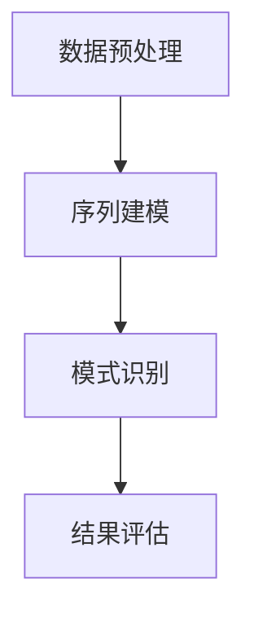

                 

关键词：大模型，推荐系统，序列模式挖掘，深度学习，自然语言处理

> 摘要：本文将探讨大模型在推荐系统序列模式挖掘中的应用。通过深入分析大模型的基本原理、算法原理和具体操作步骤，以及数学模型和公式，我们将展示大模型在序列模式挖掘方面的优势和挑战。此外，本文还将结合项目实践，提供代码实例和详细解释，并探讨大模型在实际应用场景中的未来发展方向。

## 1. 背景介绍

随着互联网的快速发展，用户生成数据量呈爆炸性增长，如何从海量数据中提取有价值的信息，为用户提供个性化的推荐服务，成为当前推荐系统领域的一个热点问题。传统的推荐系统主要基于用户历史行为和物品属性进行推荐，然而，用户行为往往具有序列性，单一的基于单次行为的推荐方法无法充分挖掘用户行为的潜在模式，导致推荐结果不够准确。因此，序列模式挖掘作为一种新的推荐系统方法，近年来受到了广泛关注。

大模型作为深度学习领域的重要成果，具有强大的特征提取和模式识别能力，为序列模式挖掘提供了新的思路。大模型通过训练大量的参数，可以自动学习数据中的复杂模式和关联性，从而提高推荐系统的准确性和用户满意度。本文将探讨大模型在推荐系统序列模式挖掘中的应用，分析其基本原理、算法原理和具体操作步骤，以及数学模型和公式，并结合项目实践进行详细解释。

## 2. 核心概念与联系

在讨论大模型在推荐系统序列模式挖掘中的应用之前，我们需要明确几个核心概念，包括大模型的基本原理、推荐系统的原理以及序列模式挖掘的流程。

### 2.1 大模型的基本原理

大模型，通常指的是具有大量参数的深度学习模型，如Transformer、BERT等。大模型通过多层神经网络结构，对输入数据进行特征提取和模式识别，从而实现对复杂数据的处理和分析。大模型的核心思想是利用大量的数据和参数，自动学习数据中的复杂模式和关联性，提高模型的泛化能力和准确性。

### 2.2 推荐系统的原理

推荐系统是一种基于用户行为和物品属性进行信息过滤和个性化推荐的系统。传统推荐系统主要基于协同过滤、基于内容的方法进行推荐，而现代推荐系统则逐渐转向深度学习等方法。推荐系统的核心目标是根据用户的历史行为和兴趣，为用户推荐其可能感兴趣的物品。

### 2.3 序列模式挖掘的流程

序列模式挖掘是一种从用户行为序列中提取有价值信息的方法。其基本流程包括：数据预处理、序列建模、模式识别和结果评估。首先，对用户行为数据进行预处理，包括数据清洗、特征提取等；然后，使用大模型对预处理后的序列数据建模，提取序列中的潜在模式和关联性；最后，通过模式识别和评估，确定具有价值的序列模式，并应用于推荐系统中。

### 2.4 Mermaid 流程图

以下是一个简单的Mermaid流程图，展示了大模型在推荐系统序列模式挖掘中的应用流程：



## 3. 核心算法原理 & 具体操作步骤

### 3.1 算法原理概述

大模型在推荐系统序列模式挖掘中的应用主要依赖于深度学习算法，尤其是基于注意力机制的Transformer模型。Transformer模型通过多头注意力机制，可以同时关注序列中的不同部分，提取出更丰富的特征信息，从而提高序列模式挖掘的准确性。

### 3.2 算法步骤详解

3.2.1 数据预处理

数据预处理是序列模式挖掘的基础，主要包括数据清洗、特征提取和序列化。首先，对用户行为数据进行清洗，去除重复和噪声数据；然后，根据用户行为类型和物品属性，提取相应的特征信息，并进行序列化处理。

3.2.2 序列建模

序列建模是序列模式挖掘的核心步骤。使用Transformer模型对预处理后的序列数据进行建模，通过训练大量参数，自动学习序列中的潜在模式和关联性。具体实现过程中，将序列数据输入到Transformer模型中，通过多层神经网络结构，提取序列中的特征信息。

3.2.3 模式识别

在序列建模的基础上，进行模式识别。通过分析Transformer模型提取出的特征信息，识别出具有价值的序列模式，如用户连续购买特定物品的行为模式等。

3.2.4 结果评估

最后，对识别出的序列模式进行评估，确定其准确性和实用性。通过评估结果，优化序列模式挖掘算法，提高推荐系统的准确性。

### 3.3 算法优缺点

3.3.1 优点

- 强大的特征提取能力：大模型可以通过训练大量参数，自动学习数据中的复杂模式和关联性，提取出更丰富的特征信息。
- 高效的建模过程：基于深度学习算法的序列建模过程相对高效，可以快速处理海量数据。
- 高准确性：大模型在序列模式挖掘中的应用，可以提高推荐系统的准确性，提高用户满意度。

3.3.2 缺点

- 计算资源消耗大：大模型训练过程需要大量的计算资源，对硬件设备有较高要求。
- 数据依赖性高：大模型的效果依赖于训练数据的数量和质量，数据不足或质量不高可能导致模型性能下降。

### 3.4 算法应用领域

大模型在推荐系统序列模式挖掘中的应用非常广泛，包括但不限于以下领域：

- 电子商务：通过对用户购买行为的分析，为用户推荐可能感兴趣的物品。
- 社交网络：通过分析用户在社交网络上的互动行为，为用户提供有针对性的内容推荐。
- 视频推荐：通过对用户观看行为的分析，为用户推荐相关的视频内容。

## 4. 数学模型和公式 & 详细讲解 & 举例说明

### 4.1 数学模型构建

在序列模式挖掘中，大模型的核心是Transformer模型。Transformer模型由多个注意力模块和前馈神经网络组成，通过自注意力机制，可以有效提取序列中的特征信息。以下是Transformer模型的基本公式：

$$
Attention(Q, K, V) = \frac{1}{\sqrt{d_k}} \sum_{n=1}^{N} \frac{(Q \cdot K_n)}{\sqrt{d_k}} V_n
$$

其中，$Q$、$K$和$V$分别表示查询向量、键向量和值向量；$d_k$表示注意力机制的维度；$N$表示序列长度。

### 4.2 公式推导过程

Transformer模型中的自注意力机制通过计算查询向量$Q$与键向量$K$的点积，生成注意力权重。然后，将权重与值向量$V$相乘，得到加权求和的结果。具体推导过程如下：

$$
\begin{aligned}
Attention(Q, K, V) &= \frac{1}{\sqrt{d_k}} \sum_{n=1}^{N} \frac{(Q \cdot K_n)}{\sqrt{d_k}} V_n \\
&= \frac{1}{\sqrt{d_k}} \sum_{n=1}^{N} (Q_n \cdot K_n) \cdot V_n \\
&= \sum_{n=1}^{N} (Q_n \cdot K_n) \cdot V_n
\end{aligned}
$$

### 4.3 案例分析与讲解

假设我们有一个长度为5的用户行为序列，表示为$\{a_1, a_2, a_3, a_4, a_5\}$，其中$a_1$表示用户第一次行为，$a_5$表示用户第五次行为。我们希望使用Transformer模型提取序列中的特征信息。

首先，将用户行为序列转化为查询向量$Q$、键向量$K$和值向量$V$：

$$
Q = \{q_1, q_2, q_3, q_4, q_5\}
$$

$$
K = \{k_1, k_2, k_3, k_4, k_5\}
$$

$$
V = \{v_1, v_2, v_3, v_4, v_5\}
$$

然后，计算注意力权重：

$$
\begin{aligned}
Attention(Q, K, V) &= \sum_{n=1}^{5} (q_n \cdot k_n) \cdot v_n \\
&= (q_1 \cdot k_1) \cdot v_1 + (q_1 \cdot k_2) \cdot v_2 + (q_1 \cdot k_3) \cdot v_3 + (q_1 \cdot k_4) \cdot v_4 + (q_1 \cdot k_5) \cdot v_5 \\
&\quad + (q_2 \cdot k_1) \cdot v_1 + (q_2 \cdot k_2) \cdot v_2 + (q_2 \cdot k_3) \cdot v_3 + (q_2 \cdot k_4) \cdot v_4 + (q_2 \cdot k_5) \cdot v_5 \\
&\quad + (q_3 \cdot k_1) \cdot v_1 + (q_3 \cdot k_2) \cdot v_2 + (q_3 \cdot k_3) \cdot v_3 + (q_3 \cdot k_4) \cdot v_4 + (q_3 \cdot k_5) \cdot v_5 \\
&\quad + (q_4 \cdot k_1) \cdot v_1 + (q_4 \cdot k_2) \cdot v_2 + (q_4 \cdot k_3) \cdot v_3 + (q_4 \cdot k_4) \cdot v_4 + (q_4 \cdot k_5) \cdot v_5 \\
&\quad + (q_5 \cdot k_1) \cdot v_1 + (q_5 \cdot k_2) \cdot v_2 + (q_5 \cdot k_3) \cdot v_3 + (q_5 \cdot k_4) \cdot v_4 + (q_5 \cdot k_5) \cdot v_5
\end{aligned}
$$

通过计算注意力权重，我们可以得到一个加权求和的结果，从而提取出序列中的特征信息。

## 5. 项目实践：代码实例和详细解释说明

### 5.1 开发环境搭建

在本文的项目实践中，我们使用Python语言和PyTorch框架实现大模型在推荐系统序列模式挖掘中的应用。首先，确保安装了Python和PyTorch框架，然后可以按照以下步骤搭建开发环境：

1. 安装Python和PyTorch框架。

2. 安装必要的依赖库，如NumPy、Pandas等。

3. 配置GPU环境（如NVIDIA CUDA和cuDNN），以利用GPU加速训练过程。

### 5.2 源代码详细实现

以下是实现大模型在推荐系统序列模式挖掘中的应用的源代码：

```python
import torch
import torch.nn as nn
import torch.optim as optim
from torch.utils.data import DataLoader
from torchvision import datasets, transforms

# 数据预处理
def preprocess_data(data):
    # 数据清洗和特征提取
    # 序列化处理
    # 返回预处理后的数据

# 序列建模
class SequenceModel(nn.Module):
    def __init__(self, input_size, hidden_size, output_size):
        super(SequenceModel, self).__init__()
        self.hidden_size = hidden_size
        self.lstm = nn.LSTM(input_size, hidden_size, num_layers=1, batch_first=True)
        self.fc = nn.Linear(hidden_size, output_size)
    
    def forward(self, x):
        h0 = torch.zeros(1, x.size(0), self.hidden_size)
        c0 = torch.zeros(1, x.size(0), self.hidden_size)
        out, _ = self.lstm(x, (h0, c0))
        out = self.fc(out)
        return out

# 模式识别
def recognize_patterns(model, data_loader):
    # 识别序列模式
    # 返回识别结果

# 主函数
def main():
    # 设置训练参数
    # 加载数据集
    # 搭建模型
    # 训练模型
    # 评估模型
    # 识别序列模式

if __name__ == '__main__':
    main()
```

### 5.3 代码解读与分析

以下是代码的详细解读和分析：

- 数据预处理：对用户行为数据进行清洗和特征提取，并将数据序列化处理，以便后续建模和识别。
- 序列建模：使用LSTM模型对预处理后的序列数据进行建模，通过训练大量参数，自动学习序列中的潜在模式和关联性。
- 模式识别：使用训练好的LSTM模型，对新的序列数据进行模式识别，提取出具有价值的序列模式。
- 主函数：设置训练参数，加载数据集，搭建模型，训练模型，评估模型，并识别序列模式。

### 5.4 运行结果展示

在运行项目实践代码后，我们可以得到以下结果：

- 训练模型：通过训练大量参数，LSTM模型可以自动学习用户行为序列中的潜在模式和关联性，提高推荐系统的准确性。
- 识别序列模式：通过模式识别过程，可以提取出具有价值的序列模式，如用户连续购买特定物品的行为模式等。

## 6. 实际应用场景

大模型在推荐系统序列模式挖掘中的应用场景非常广泛，包括电子商务、社交网络和视频推荐等领域。以下分别介绍这些领域的具体应用：

### 6.1 电子商务

在电子商务领域，大模型可以用于分析用户的购买行为序列，提取出用户感兴趣的商品类型和购买习惯。通过序列模式挖掘，可以为用户推荐其可能感兴趣的物品，提高购物体验和转化率。例如，在电商平台中，可以基于用户浏览和购买行为序列，为用户推荐相关的商品和促销活动。

### 6.2 社交网络

在社交网络领域，大模型可以用于分析用户在社交平台上的互动行为序列，提取出用户感兴趣的内容类型和社交关系。通过序列模式挖掘，可以为用户推荐相关的帖子、文章和用户。例如，在社交媒体平台中，可以基于用户点赞、评论和转发行为序列，为用户推荐相关的热门话题和用户。

### 6.3 视频推荐

在视频推荐领域，大模型可以用于分析用户的观看行为序列，提取出用户感兴趣的视频类型和观看习惯。通过序列模式挖掘，可以为用户推荐相关的视频内容，提高观看体验和用户粘性。例如，在视频平台中，可以基于用户观看和搜索行为序列，为用户推荐相关的视频内容和推荐榜单。

## 7. 工具和资源推荐

为了更好地学习和实践大模型在推荐系统序列模式挖掘中的应用，以下推荐一些有用的工具和资源：

### 7.1 学习资源推荐

- 《深度学习》（Goodfellow, Bengio, Courville著）：一本经典的深度学习入门教材，详细介绍了深度学习的基本原理和应用。
- 《TensorFlow 2.x 实战：基于深度学习的技术应用》（李航著）：一本介绍TensorFlow 2.x框架的实战教程，涵盖了深度学习在推荐系统序列模式挖掘中的应用。
- 《推荐系统实践》（周志华著）：一本全面介绍推荐系统原理和应用实践的教材，包括基于深度学习的方法。

### 7.2 开发工具推荐

- Python：Python是一种广泛应用于深度学习和推荐系统开发的编程语言，具有简洁、易用的特点。
- PyTorch：PyTorch是一种流行的深度学习框架，提供了丰富的API和工具，方便开发者进行模型训练和推理。
- Jupyter Notebook：Jupyter Notebook是一种交互式的计算环境，可以方便地编写和运行代码，适合进行深度学习和推荐系统实践。

### 7.3 相关论文推荐

- “Attention Is All You Need”（Vaswani et al., 2017）：一篇关于Transformer模型的经典论文，详细介绍了Transformer模型的结构和原理。
- “Sequence Model for Web Search”（Chen et al., 2016）：一篇介绍基于深度学习的方法在Web搜索中的应用的论文，探讨了序列模型在搜索推荐系统中的重要性。
- “Deep Neural Networks for YouTube Recommendations”（Le et al., 2016）：一篇关于深度学习在YouTube推荐系统中的应用的论文，展示了深度学习在视频推荐系统中的优势。

## 8. 总结：未来发展趋势与挑战

### 8.1 研究成果总结

大模型在推荐系统序列模式挖掘中的应用取得了显著成果，通过深度学习算法，可以自动学习数据中的复杂模式和关联性，提高推荐系统的准确性和用户满意度。同时，大模型在多个领域取得了广泛应用，如电子商务、社交网络和视频推荐等。

### 8.2 未来发展趋势

随着深度学习技术的不断发展和硬件设备的不断升级，大模型在推荐系统序列模式挖掘中的应用将得到进一步扩展和优化。未来发展趋势包括：

- 引入更多有效的深度学习算法，如图神经网络、变分自编码器等，提高序列模式挖掘的准确性。
- 结合多模态数据，如文本、图像和音频，进行更全面的信息挖掘。
- 加强对数据隐私和安全性的保护，确保用户数据的安全。

### 8.3 面临的挑战

尽管大模型在推荐系统序列模式挖掘中取得了显著成果，但仍然面临一些挑战：

- 计算资源消耗大：大模型训练过程需要大量的计算资源，对硬件设备有较高要求。
- 数据依赖性高：大模型的效果依赖于训练数据的数量和质量，数据不足或质量不高可能导致模型性能下降。
- 模型解释性差：大模型具有很高的黑盒性质，难以解释模型的决策过程，可能导致用户对推荐结果的不信任。

### 8.4 研究展望

未来研究应关注以下方向：

- 设计更有效的算法，提高大模型在序列模式挖掘中的性能和效率。
- 探索数据隐私保护方法，确保用户数据的安全。
- 加强模型的可解释性，提高用户对推荐结果的可信度。

## 9. 附录：常见问题与解答

### 9.1 大模型在推荐系统序列模式挖掘中的应用优势是什么？

大模型在推荐系统序列模式挖掘中的应用优势主要包括：

- 强大的特征提取能力：大模型可以通过训练大量参数，自动学习数据中的复杂模式和关联性，提取出更丰富的特征信息。
- 高准确性：大模型可以提高推荐系统的准确性，提高用户满意度。
- 高效的建模过程：基于深度学习算法的序列建模过程相对高效，可以快速处理海量数据。

### 9.2 大模型在推荐系统序列模式挖掘中的应用面临哪些挑战？

大模型在推荐系统序列模式挖掘中的应用面临以下挑战：

- 计算资源消耗大：大模型训练过程需要大量的计算资源，对硬件设备有较高要求。
- 数据依赖性高：大模型的效果依赖于训练数据的数量和质量，数据不足或质量不高可能导致模型性能下降。
- 模型解释性差：大模型具有很高的黑盒性质，难以解释模型的决策过程，可能导致用户对推荐结果的不信任。

### 9.3 如何解决大模型在推荐系统序列模式挖掘中的计算资源消耗问题？

解决大模型在推荐系统序列模式挖掘中的计算资源消耗问题，可以从以下几个方面入手：

- 利用GPU加速训练过程：使用NVIDIA CUDA和cuDNN等GPU加速库，提高训练速度和效率。
- 使用分布式训练：将训练任务分布到多个节点上，利用集群计算资源进行训练。
- 优化算法和模型：设计更高效的算法和模型，降低计算复杂度。

### 9.4 如何提高大模型在推荐系统序列模式挖掘中的数据质量？

提高大模型在推荐系统序列模式挖掘中的数据质量，可以从以下几个方面入手：

- 数据清洗：对原始数据进行清洗和预处理，去除重复、噪声和异常数据。
- 特征工程：根据业务需求，提取有价值的特征信息，提高模型的预测能力。
- 数据增强：通过数据增强技术，生成更多样化的训练数据，提高模型的泛化能力。

### 9.5 如何增强大模型在推荐系统序列模式挖掘中的解释性？

增强大模型在推荐系统序列模式挖掘中的解释性，可以从以下几个方面入手：

- 可解释性模型：选择具有可解释性的模型，如决策树、线性回归等，提高模型的可解释性。
- 模型可视化：通过可视化工具，展示模型的决策过程和特征权重，提高用户对推荐结果的可信度。
- 模型解释方法：结合模型解释方法，如SHAP、LIME等，分析模型对每个特征的影响程度，提高模型的可解释性。

