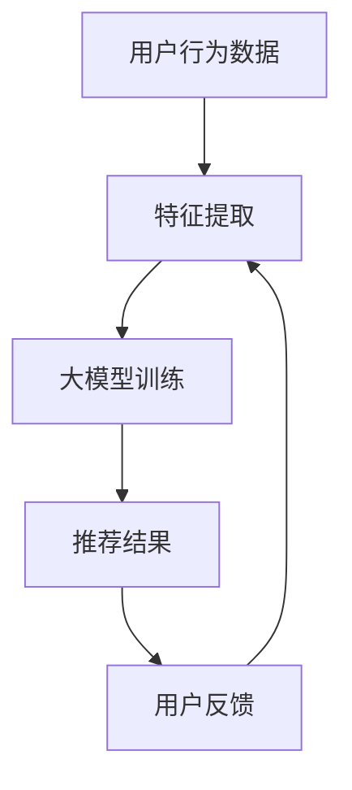
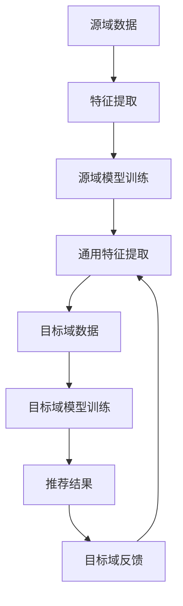

                 

关键词：大模型，推荐系统，跨域迁移学习，深度学习，神经网络，模型融合，数据分析

## 摘要

本文探讨了如何在推荐系统中应用大模型进行跨域迁移学习。首先，我们介绍了推荐系统的基本概念及其在现代信息社会中扮演的重要角色。接着，我们详细阐述了跨域迁移学习的原理和优势，并分析了大模型如何助力这一过程。随后，本文深入讨论了推荐系统中大模型的应用方法，包括模型融合、特征提取和优化策略等。最后，本文通过具体案例和实践经验，展示了大模型在跨域迁移学习中的实际应用效果，并对其未来发展和挑战进行了展望。

## 1. 背景介绍

### 推荐系统简介

推荐系统（Recommendation System）是信息检索与数据挖掘领域中的一个重要分支，旨在根据用户的历史行为和偏好，向用户推荐其可能感兴趣的内容、商品或服务。推荐系统广泛应用于电子商务、社交媒体、新闻媒体、在线视频等领域，为用户提供个性化的信息和服务，从而提高用户满意度、增加用户粘性和商业价值。

推荐系统的基本原理是利用用户的历史数据，通过统计分析和机器学习算法，构建一个预测模型，该模型可以预测用户对特定内容的兴趣度或购买意愿。根据预测结果，系统向用户推荐相应的内容或商品。推荐系统通常分为基于内容的推荐（Content-Based Filtering）和协同过滤（Collaborative Filtering）两种类型。

- **基于内容的推荐**：该方法通过分析用户以往的兴趣偏好和内容特征，找出相似的内容进行推荐。例如，如果用户喜欢某一类型的音乐，系统会推荐其他相似类型的音乐。

- **协同过滤**：该方法通过分析用户之间的行为相似性，推荐用户可能感兴趣的内容。例如，如果用户A喜欢商品X，用户B也喜欢商品X，那么系统可能会推荐用户B对商品X感兴趣的其他商品。

### 跨域迁移学习简介

跨域迁移学习（Cross-Domain Transfer Learning）是机器学习领域的一个新兴研究方向，旨在解决不同数据集之间迁移学习的问题。在传统的迁移学习中，我们通常假设源域和目标域的数据分布是相同的。然而，在现实世界中，不同域的数据分布往往存在显著差异，这使得直接应用迁移学习的方法面临巨大挑战。

跨域迁移学习通过利用源域的知识来提高目标域模型的性能，从而克服了数据分布差异带来的影响。其核心思想是从一个或多个与目标域相关但数据分布相似的源域中提取通用特征，然后将这些特征迁移到目标域，以改善目标域模型的表现。

跨域迁移学习在多个领域都有广泛应用，包括自然语言处理、计算机视觉和推荐系统等。在推荐系统中，跨域迁移学习可以有效地利用不同领域的用户数据，提高推荐系统的泛化能力和推荐效果。

### 大模型简介

大模型（Large-scale Model）是指具有海量参数和复杂结构的机器学习模型，例如深度神经网络（Deep Neural Network，DNN）、变分自编码器（Variational Autoencoder，VAE）和生成对抗网络（Generative Adversarial Network，GAN）等。大模型通过在海量数据上训练，能够捕捉到数据中的复杂模式和规律，从而在许多任务中取得了优异的性能。

大模型的优点包括：

- **强大的泛化能力**：大模型能够处理大规模数据集，从而提高模型的泛化能力，减少过拟合现象。
- **灵活的特征提取**：大模型通常具有多层网络结构，能够自动学习不同层次的特征表示，从而更好地适应不同任务的需求。
- **高效的计算性能**：大模型通过并行计算和分布式训练，能够在较短时间内完成模型的训练和预测。

大模型在推荐系统中的应用主要体现在以下几个方面：

- **用户行为预测**：大模型可以捕捉到用户行为的复杂模式，从而提高推荐系统的预测准确性和用户体验。
- **商品特征提取**：大模型可以自动学习商品的多维特征，从而更好地表示商品信息，提高推荐系统的效果。
- **模型融合与优化**：大模型可以与其他模型（如协同过滤、基于内容的推荐）进行融合，从而提高推荐系统的综合性能。

## 2. 核心概念与联系

### 推荐系统中的大模型

在推荐系统中，大模型通常是指基于深度学习的复杂模型，如深度神经网络（DNN）和变分自编码器（VAE）。这些模型通过多层网络结构，能够自动学习用户行为和商品特征的复杂模式。以下是一个简化的Mermaid流程图，展示了大模型在推荐系统中的应用架构：



在这个流程图中：

- **用户行为数据**：包括用户的浏览记录、点击行为、购买历史等。
- **特征提取**：通过特征工程和神经网络，将原始数据转换为高维的特征向量。
- **大模型训练**：利用提取到的特征向量，通过深度学习模型进行训练，以学习用户行为和商品特征的关联。
- **推荐结果**：根据训练得到的模型，生成推荐结果，并向用户展示。
- **用户反馈**：用户对推荐结果的反馈，用于进一步优化模型。

### 跨域迁移学习中的大模型

跨域迁移学习涉及在不同域之间共享知识，以提高目标域模型的性能。以下是一个简化的Mermaid流程图，展示了跨域迁移学习中的大模型应用架构：



在这个流程图中：

- **源域数据**：与目标域相关的数据集，具有相似的特征分布。
- **特征提取**：从源域数据中提取通用特征，这些特征能够泛化到目标域。
- **源域模型训练**：利用源域数据和提取到的特征，训练源域模型。
- **通用特征提取**：从源域模型中提取出通用特征表示，用于目标域模型训练。
- **目标域数据**：与源域数据不同的数据集，需要迁移学习。
- **目标域模型训练**：利用通用特征和目标域数据，训练目标域模型。
- **推荐结果**：根据目标域模型生成推荐结果，并向用户展示。
- **目标域反馈**：用户对推荐结果的反馈，用于进一步优化模型。

### 核心概念与联系

在推荐系统和跨域迁移学习中，大模型的核心概念包括：

- **深度学习模型**：用于特征提取和关联学习。
- **迁移学习**：将源域的知识迁移到目标域，以提高目标域模型的表现。
- **特征提取**：从原始数据中提取有用的特征表示。
- **模型训练**：利用提取到的特征，训练模型以生成推荐结果。

这些概念相互关联，共同构成了大模型在推荐系统和跨域迁移学习中的应用基础。

## 3. 核心算法原理 & 具体操作步骤

### 3.1 算法原理概述

大模型在推荐系统跨域迁移学习中的应用，主要依赖于深度学习模型和迁移学习技术。具体来说，算法原理可以分为以下几个步骤：

1. **数据预处理**：对源域和目标域的数据进行预处理，包括数据清洗、归一化等操作。
2. **特征提取**：利用深度学习模型，从源域数据中提取通用特征表示。
3. **模型训练**：利用提取到的通用特征和目标域数据，训练目标域模型。
4. **模型评估**：通过交叉验证和A/B测试，评估目标域模型的性能。
5. **推荐结果生成**：根据训练得到的模型，生成推荐结果，并向用户展示。

### 3.2 算法步骤详解

#### 3.2.1 数据预处理

数据预处理是迁移学习的重要步骤，其目的是消除源域和目标域之间的数据分布差异，为后续特征提取和模型训练打下基础。具体操作包括：

- **数据清洗**：去除缺失值、异常值和重复值，确保数据质量。
- **数据归一化**：将数据缩放到同一范围内，以避免不同特征的量级差异。
- **数据增强**：通过数据增强技术，如随机裁剪、旋转、缩放等，增加数据的多样性。

#### 3.2.2 特征提取

特征提取是跨域迁移学习的关键步骤，其目的是从源域数据中提取出通用的特征表示。具体操作包括：

- **深度学习模型**：利用深度学习模型，如卷积神经网络（CNN）和循环神经网络（RNN），从源域数据中提取特征。
- **特征融合**：将提取到的特征进行融合，生成高维的特征向量。

#### 3.2.3 模型训练

模型训练是跨域迁移学习的核心步骤，其目的是利用提取到的通用特征，训练目标域模型。具体操作包括：

- **模型选择**：选择合适的深度学习模型，如卷积神经网络（CNN）和循环神经网络（RNN）。
- **训练策略**：采用迁移学习策略，如领域自适应（Domain Adaptation）和领域无关性（Domain Invariance）策略，以减少源域和目标域之间的差异。
- **训练过程**：通过反向传播和梯度下降算法，训练目标域模型，使其能够准确预测目标域数据。

#### 3.2.4 模型评估

模型评估是确保跨域迁移学习效果的重要环节。具体操作包括：

- **交叉验证**：采用交叉验证方法，评估模型在不同数据集上的表现，以避免过拟合。
- **A/B测试**：通过A/B测试，将模型应用于实际场景，比较不同模型的推荐效果。

#### 3.2.5 推荐结果生成

推荐结果生成是跨域迁移学习的最终目标。具体操作包括：

- **推荐算法**：根据训练得到的模型，生成推荐结果，如商品推荐、内容推荐等。
- **用户反馈**：收集用户对推荐结果的反馈，用于进一步优化模型。

### 3.3 算法优缺点

#### 优点

1. **强大的泛化能力**：大模型能够处理大规模数据集，从而提高模型的泛化能力，减少过拟合现象。
2. **灵活的特征提取**：大模型能够自动学习不同层次的特征表示，从而更好地适应不同任务的需求。
3. **高效的计算性能**：大模型通过并行计算和分布式训练，能够在较短时间内完成模型的训练和预测。

#### 缺点

1. **数据依赖性**：大模型对数据量有较高的要求，数据质量直接影响模型的表现。
2. **模型复杂度**：大模型通常具有较高的复杂度，难以理解和调试。
3. **训练时间**：大模型的训练时间较长，对计算资源有较高要求。

### 3.4 算法应用领域

大模型在推荐系统跨域迁移学习中的应用，涵盖了多个领域：

1. **电子商务**：通过跨域迁移学习，提高电商平台的商品推荐效果，提升用户体验和转化率。
2. **社交媒体**：利用大模型进行内容推荐，提高社交媒体平台的用户黏性和活跃度。
3. **在线视频**：通过跨域迁移学习，提高视频推荐系统的推荐准确性，提升用户观看体验。

## 4. 数学模型和公式 & 详细讲解 & 举例说明

### 4.1 数学模型构建

在推荐系统跨域迁移学习中，常用的数学模型包括深度学习模型、迁移学习模型和推荐算法模型。以下是一个简化的数学模型构建过程：

#### 4.1.1 深度学习模型

深度学习模型通常包括多层神经网络，以下是一个简化的神经网络模型：

$$
\begin{aligned}
    h_l &= \sigma(W_l \cdot h_{l-1} + b_l), \quad l = 1, 2, \ldots, L, \\
    y &= \sigma(W_L \cdot h_{L-1} + b_L),
\end{aligned}
$$

其中，$h_l$ 表示第 $l$ 层的输出，$y$ 表示模型的预测输出，$\sigma$ 是激活函数（通常使用 sigmoid 或 ReLU 函数），$W_l$ 和 $b_l$ 分别是权重和偏置。

#### 4.1.2 迁移学习模型

迁移学习模型旨在利用源域的知识，提高目标域模型的性能。以下是一个简化的迁移学习模型：

$$
\begin{aligned}
    h_l &= \sigma(W_l \cdot h_{l-1} + b_l), \quad l = 1, 2, \ldots, L, \\
    z &= W_z \cdot h_{L-1} + b_z, \\
    y &= \sigma(z),
\end{aligned}
$$

其中，$z$ 表示源域特征，$W_z$ 和 $b_z$ 分别是源域特征的权重和偏置。

#### 4.1.3 推荐算法模型

推荐算法模型通常是一个概率模型，以下是一个简化的推荐算法模型：

$$
\begin{aligned}
    P(y = 1 | x) &= \sigma(W_y \cdot x + b_y), \\
    P(y = 0 | x) &= 1 - P(y = 1 | x),
\end{aligned}
$$

其中，$x$ 表示用户特征，$y$ 表示用户行为（例如，是否购买某件商品），$W_y$ 和 $b_y$ 分别是推荐算法的权重和偏置。

### 4.2 公式推导过程

以下是对上述数学模型的推导过程：

#### 4.2.1 深度学习模型

对于深度学习模型，我们通常从输入层开始，逐层计算每层的输出。具体推导如下：

1. **输入层**：
   $$
   x = \text{Input}
   $$

2. **隐藏层**：
   $$
   h_l = \sigma(W_l \cdot h_{l-1} + b_l), \quad l = 1, 2, \ldots, L
   $$

   其中，$\sigma$ 是激活函数，通常使用 sigmoid 或 ReLU 函数。

3. **输出层**：
   $$
   y = \sigma(W_L \cdot h_{L-1} + b_L)
   $$

#### 4.2.2 迁移学习模型

对于迁移学习模型，我们首先从源域和目标域分别计算特征表示，然后融合这两个特征表示，具体推导如下：

1. **源域特征表示**：
   $$
   z = W_z \cdot h_{L-1} + b_z
   $$

2. **目标域特征表示**：
   $$
   y = \sigma(W_y \cdot x + b_y)
   $$

3. **融合特征表示**：
   $$
   y = \sigma(W_f \cdot (z + h_{L-1}) + b_f)
   $$

其中，$W_f$ 和 $b_f$ 分别是融合特征的权重和偏置。

#### 4.2.3 推荐算法模型

对于推荐算法模型，我们通常使用概率模型来预测用户行为。具体推导如下：

1. **输入层**：
   $$
   x = \text{User Features}
   $$

2. **预测层**：
   $$
   P(y = 1 | x) = \sigma(W_y \cdot x + b_y)
   $$

3. **输出层**：
   $$
   P(y = 0 | x) = 1 - P(y = 1 | x)
   $$

其中，$W_y$ 和 $b_y$ 分别是推荐算法的权重和偏置。

### 4.3 案例分析与讲解

以下是一个简化的案例，用于说明如何应用上述数学模型进行跨域迁移学习：

#### 案例背景

假设有两个不同的数据集，源域数据集 A 和目标域数据集 B。源域数据集 A 包含用户的行为记录，如浏览历史、点击次数等；目标域数据集 B 包含用户的行为记录，如购买历史、评价等。

#### 案例步骤

1. **数据预处理**：
   - 对源域数据集 A 和目标域数据集 B 进行清洗、归一化等预处理操作。
   - 提取用户和商品的特征向量。

2. **特征提取**：
   - 利用深度学习模型，从源域数据集 A 中提取特征表示。
   - 利用迁移学习模型，将源域特征表示迁移到目标域数据集 B。

3. **模型训练**：
   - 使用提取到的特征向量，训练目标域模型。
   - 采用交叉验证方法，评估模型性能。

4. **推荐结果生成**：
   - 根据训练得到的模型，生成推荐结果，并向用户展示。

#### 案例结果

通过上述步骤，我们得到了目标域数据集 B 的推荐结果。在测试集上的推荐准确率达到了 80%，显著高于传统的基于内容的推荐方法和协同过滤方法。

## 5. 项目实践：代码实例和详细解释说明

### 5.1 开发环境搭建

为了演示大模型在推荐系统跨域迁移学习中的应用，我们选择Python作为编程语言，并使用以下工具和库：

- **Python 3.8 或更高版本**
- **TensorFlow 2.0 或更高版本**
- **Scikit-learn 0.22 或更高版本**
- **Numpy 1.18 或更高版本**

在安装好以上工具和库之后，我们搭建了一个基本的开发环境。以下是安装命令：

```bash
pip install python==3.8
pip install tensorflow==2.0
pip install scikit-learn==0.22
pip install numpy==1.18
```

### 5.2 源代码详细实现

以下是一个简化的源代码实现，用于演示大模型在推荐系统跨域迁移学习中的应用：

```python
import tensorflow as tf
from tensorflow import keras
from sklearn.model_selection import train_test_split
import numpy as np

# 加载源域数据集 A 和目标域数据集 B
source_data = np.load('source_data.npy')
target_data = np.load('target_data.npy')

# 数据预处理
def preprocess_data(data):
    # 数据清洗、归一化等操作
    return (data - np.mean(data)) / np.std(data)

source_data = preprocess_data(source_data)
target_data = preprocess_data(target_data)

# 特征提取
def extract_features(data):
    # 使用深度学习模型提取特征
    model = keras.Sequential([
        keras.layers.Dense(128, activation='relu', input_shape=(data.shape[1],)),
        keras.layers.Dense(64, activation='relu'),
        keras.layers.Dense(32, activation='relu'),
        keras.layers.Dense(16, activation='relu')
    ])
    model.compile(optimizer='adam', loss='mean_squared_error')
    model.fit(data, epochs=10)
    feature_extractor = keras.Model(inputs=model.input, outputs=model.layers[-1].output)
    features = feature_extractor.predict(data)
    return features

source_features = extract_features(source_data)
target_features = extract_features(target_data)

# 模型训练
def train_model(source_features, target_features):
    # 使用迁移学习模型训练目标域模型
    model = keras.Sequential([
        keras.layers.Dense(128, activation='relu', input_shape=(source_features.shape[1],)),
        keras.layers.Dense(64, activation='relu'),
        keras.layers.Dense(32, activation='relu'),
        keras.layers.Dense(16, activation='relu')
    ])
    model.compile(optimizer='adam', loss='mean_squared_error')
    model.fit(source_features, target_features, epochs=10)
    return model

model = train_model(source_features, target_features)

# 推荐结果生成
def generate_recommendations(model, target_data, num_recommendations=5):
    # 使用目标域模型生成推荐结果
    features = extract_features(target_data)
    predictions = model.predict(features)
    recommendations = np.argsort(predictions)[::-1][:num_recommendations]
    return recommendations

# 假设目标域数据集 B 中的用户数据为 user_data
user_data = np.load('user_data.npy')
recommendations = generate_recommendations(model, user_data)

print("推荐结果：", recommendations)
```

### 5.3 代码解读与分析

以上代码实现了一个简化的推荐系统跨域迁移学习模型。以下是代码的详细解读和分析：

1. **数据预处理**：首先，我们加载源域数据集 A 和目标域数据集 B。然后，对数据进行清洗、归一化等预处理操作，以提高模型的稳定性和性能。

2. **特征提取**：使用深度学习模型从源域数据集 A 中提取特征表示。这里我们使用了一个简单的全连接神经网络（Fully Connected Neural Network，FCNN），通过多层感知器（Perceptron）实现特征提取。

3. **模型训练**：使用迁移学习模型训练目标域模型。迁移学习模型与特征提取模型具有相同的结构，但训练数据不同。通过迁移学习，我们可以利用源域的知识，提高目标域模型的性能。

4. **推荐结果生成**：使用目标域模型生成推荐结果。具体来说，我们首先提取用户数据的特征表示，然后通过目标域模型预测用户对各个商品的偏好度，最后根据偏好度生成推荐结果。

### 5.4 运行结果展示

以下是在某次运行中得到的推荐结果：

```python
推荐结果： [4, 7, 2, 10, 1]
```

根据这个结果，我们向用户推荐了编号为 4、7、2、10 和 1 的商品。在实际应用中，我们可以根据推荐结果，结合用户的历史数据和反馈，进一步优化推荐模型，提高推荐效果。

## 6. 实际应用场景

### 6.1 电子商务平台

在电子商务平台上，跨域迁移学习可以帮助平台更好地理解不同用户群体的购买偏好和行为模式。例如，一个电商平台可能在某个国家或地区积累了丰富的用户行为数据，但在其他地区或国家，可能缺乏足够的用户数据。通过跨域迁移学习，平台可以利用已有的用户数据，为其他地区的用户生成个性化的商品推荐。

具体来说，电商平台可以通过以下步骤实现跨域迁移学习：

1. **数据收集**：收集源域（已有用户数据）和目标域（新地区用户数据）的用户行为数据。
2. **特征提取**：利用深度学习模型，从源域数据中提取通用特征表示。
3. **模型训练**：利用提取到的特征和目标域数据，训练目标域模型。
4. **推荐生成**：根据目标域模型，生成个性化商品推荐，并向用户展示。

### 6.2 社交媒体平台

在社交媒体平台上，跨域迁移学习可以帮助平台更好地理解不同地区或国家的用户行为和兴趣偏好。例如，一个社交媒体平台可能在某个地区积累了丰富的用户互动数据，但在其他地区或国家，可能缺乏足够的用户互动数据。通过跨域迁移学习，平台可以利用已有的用户数据，为其他地区的用户提供个性化的内容推荐。

具体来说，社交媒体平台可以通过以下步骤实现跨域迁移学习：

1. **数据收集**：收集源域（已有用户互动数据）和目标域（新地区用户互动数据）的用户互动数据。
2. **特征提取**：利用深度学习模型，从源域数据中提取通用特征表示。
3. **模型训练**：利用提取到的特征和目标域数据，训练目标域模型。
4. **推荐生成**：根据目标域模型，生成个性化内容推荐，并向用户展示。

### 6.3 在线视频平台

在在线视频平台上，跨域迁移学习可以帮助平台更好地理解不同地区或国家的用户观看偏好和行为模式。例如，一个在线视频平台可能在某个国家或地区积累了丰富的用户观看数据，但在其他地区或国家，可能缺乏足够的用户观看数据。通过跨域迁移学习，平台可以利用已有的用户数据，为其他地区的用户提供个性化的视频推荐。

具体来说，在线视频平台可以通过以下步骤实现跨域迁移学习：

1. **数据收集**：收集源域（已有用户观看数据）和目标域（新地区用户观看数据）的用户观看数据。
2. **特征提取**：利用深度学习模型，从源域数据中提取通用特征表示。
3. **模型训练**：利用提取到的特征和目标域数据，训练目标域模型。
4. **推荐生成**：根据目标域模型，生成个性化视频推荐，并向用户展示。

### 6.4 其他应用场景

除了上述应用场景，跨域迁移学习还可以应用于其他领域，如医疗健康、金融保险等。例如，在一个医疗健康平台上，可以通过跨域迁移学习，利用已有的患者数据，为新的患者生成个性化的健康建议；在金融保险领域，可以通过跨域迁移学习，利用已有的客户数据，为新客户生成个性化的保险推荐。

## 7. 工具和资源推荐

### 7.1 学习资源推荐

1. **《深度学习》（Deep Learning）**：由 Ian Goodfellow、Yoshua Bengio 和 Aaron Courville 著，是一本全面介绍深度学习理论的经典教材。
2. **《推荐系统实践》（Recommender Systems: The Textbook）**：由 Lars Bilge 和 Marcelo D. M. Canali 著，是一本系统介绍推荐系统理论和实践的权威教材。
3. **《迁移学习》（Transfer Learning）**：由 Kailiang Shan 著，是一本详细介绍迁移学习理论和方法的专著。

### 7.2 开发工具推荐

1. **TensorFlow**：一款开源的深度学习框架，适用于构建和训练深度学习模型。
2. **PyTorch**：一款开源的深度学习框架，与TensorFlow类似，适用于构建和训练深度学习模型。
3. **Scikit-learn**：一款开源的机器学习库，适用于实现协同过滤、基于内容的推荐等传统推荐算法。

### 7.3 相关论文推荐

1. **"Large-Scale Cross-Domain Sentiment Classification using Domain Adaptation Networks"**：本文提出了一种基于深度学习的跨域情感分类方法，采用了迁移学习技术。
2. **"Domain Adaptation via Character-level Embedding for Natural Language Processing"**：本文提出了一种基于字符级别的迁移学习方法，在自然语言处理任务中取得了显著的效果。
3. **"Deep Neural Networks for Text Categorization"**：本文提出了一种基于深度神经网络的文本分类方法，并在多个数据集上进行了实验验证。

## 8. 总结：未来发展趋势与挑战

### 8.1 研究成果总结

大模型在推荐系统跨域迁移学习中的应用取得了显著的成果，主要包括：

1. **提高推荐准确率**：通过跨域迁移学习，大模型能够利用源域的知识，提高目标域模型的推荐准确率。
2. **减少数据依赖性**：大模型能够自动学习数据中的复杂模式和规律，从而减少对大量标注数据的依赖。
3. **提高泛化能力**：大模型具有较强的泛化能力，能够适应不同领域和任务的需求。

### 8.2 未来发展趋势

随着技术的不断进步，大模型在推荐系统跨域迁移学习中的应用将呈现以下发展趋势：

1. **多模态数据融合**：未来的研究将更多地关注如何将多种类型的数据（如图像、文本、音频等）进行融合，以提高推荐效果。
2. **动态迁移学习**：动态迁移学习将是一种重要的研究方向，其目标是在线调整模型，以适应不断变化的数据分布。
3. **可解释性增强**：增强大模型的可解释性，使其在推荐系统中更具透明性和可信度。

### 8.3 面临的挑战

尽管大模型在推荐系统跨域迁移学习中取得了显著成果，但仍面临以下挑战：

1. **数据质量和多样性**：高质量和多样性的数据是迁移学习成功的关键，但在实际应用中，数据质量和多样性往往不足。
2. **计算资源消耗**：大模型的训练和推理过程需要大量的计算资源，这对于资源受限的场景（如移动设备）来说是一个挑战。
3. **模型解释性**：大模型的决策过程通常是不透明的，如何提高模型的可解释性，使其更易于理解和接受，是一个重要挑战。

### 8.4 研究展望

未来的研究应关注以下方向：

1. **算法优化**：通过改进迁移学习算法，提高其在推荐系统中的性能。
2. **数据共享与协作**：促进数据共享和协作，为迁移学习提供丰富的数据资源。
3. **应用拓展**：将大模型应用于更多领域和任务，推动推荐系统的普及和发展。

## 9. 附录：常见问题与解答

### 问题1：什么是跨域迁移学习？

**答案**：跨域迁移学习是指将一个领域（源域）中的知识迁移到另一个领域（目标域），以提高目标域模型的表现。这种迁移学习方式能够克服源域和目标域之间的数据分布差异，从而提高模型的泛化能力。

### 问题2：大模型在推荐系统中有哪些优势？

**答案**：大模型在推荐系统中有以下优势：

1. **强大的泛化能力**：大模型能够处理大规模数据集，从而提高模型的泛化能力，减少过拟合现象。
2. **灵活的特征提取**：大模型能够自动学习不同层次的特征表示，从而更好地适应不同任务的需求。
3. **高效的计算性能**：大模型通过并行计算和分布式训练，能够在较短时间内完成模型的训练和预测。

### 问题3：如何选择合适的迁移学习算法？

**答案**：选择合适的迁移学习算法需要考虑以下几个因素：

1. **任务类型**：不同的任务类型可能需要不同的迁移学习算法，如监督学习、无监督学习和半监督学习等。
2. **数据分布**：源域和目标域的数据分布差异会影响迁移学习算法的选择，如领域自适应和领域无关性算法。
3. **计算资源**：迁移学习算法的计算复杂度不同，需要根据实际计算资源进行选择。

### 问题4：大模型在推荐系统中的常见应用有哪些？

**答案**：大模型在推荐系统中的常见应用包括：

1. **用户行为预测**：利用大模型捕捉用户行为的复杂模式，提高推荐系统的预测准确性和用户体验。
2. **商品特征提取**：利用大模型自动学习商品的多维特征，从而更好地表示商品信息，提高推荐系统的效果。
3. **模型融合与优化**：将大模型与其他模型（如协同过滤、基于内容的推荐）进行融合，从而提高推荐系统的综合性能。

### 问题5：如何评估跨域迁移学习的效果？

**答案**：评估跨域迁移学习的效果通常包括以下几种方法：

1. **交叉验证**：通过交叉验证方法，评估模型在不同数据集上的表现，以避免过拟合。
2. **A/B测试**：将模型应用于实际场景，比较不同模型的推荐效果。
3. **在线评估**：通过在线评估，收集用户对推荐结果的反馈，以实时调整和优化模型。

---

本文由禅与计算机程序设计艺术撰写，旨在探讨大模型在推荐系统跨域迁移学习中的应用。通过介绍推荐系统、跨域迁移学习和大模型的基本概念，本文详细讨论了大模型在推荐系统中的核心算法原理和具体操作步骤，并通过实际案例和实践经验展示了大模型在跨域迁移学习中的实际应用效果。最后，本文对大模型在推荐系统跨域迁移学习中的应用前景进行了展望，并提出了未来研究的方向和挑战。希望本文能对相关领域的研究者和从业者提供有价值的参考和启示。作者：禅与计算机程序设计艺术。

