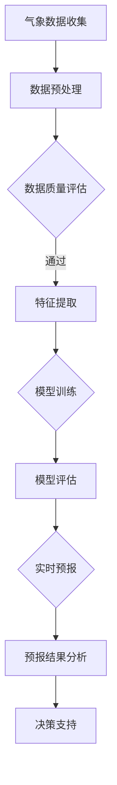

                 

关键词：大模型，气象预报，人工智能，深度学习，应用案例，气象数据，算法，数学模型，智能气象系统

> 摘要：本文将探讨大模型在智能气象预报领域的应用。通过对大模型在气象预测中的核心算法、数学模型、项目实践及未来展望的详细介绍，我们将深入了解大模型如何改变气象预报行业，提升预报准确性，并推动气象科学的发展。

## 1. 背景介绍

气象预报是社会发展的重要基石之一，它对于防灾减灾、农业生产、交通运输、水资源管理等领域都有着深远的影响。然而，传统的气象预报方法主要依赖于经验模型和数值天气预报模式，这些方法在面对极端天气事件和复杂气候系统时，往往存在一定的局限性。

近年来，随着人工智能技术的快速发展，深度学习、神经网络等大模型在多个领域取得了突破性的成果。这些大模型具有强大的数据处理能力和自学习能力，能够从大量的气象数据中挖掘出潜在的模式和规律。因此，将大模型应用于气象预报领域，有望显著提升预报的准确性，减少气象灾害的风险。

本文将重点关注大模型在智能气象预报中的应用，通过介绍核心算法原理、数学模型、项目实践和未来展望，探讨大模型如何助力气象预报行业的发展。

## 2. 核心概念与联系

在深入探讨大模型在智能气象预报中的应用之前，我们需要先了解几个核心概念：气象数据、气象预报模型、深度学习和大模型。

### 2.1 气象数据

气象数据是气象预报的基础，它包括各种类型的观测数据，如地面气象站数据、卫星遥感数据、雷达数据、气象卫星数据等。这些数据涵盖了温度、湿度、风速、风向、气压等多个气象要素。气象数据的种类和数量庞大，处理和分析这些数据是一项复杂的任务。

### 2.2 气象预报模型

传统的气象预报模型主要包括统计模型和物理模型。统计模型依赖于历史数据，通过统计分析来预测未来的气象状况。物理模型则基于大气动力学和热力学的基本原理，通过数值模拟来预测气象变化。

然而，这些模型在面对复杂多变的气候系统时，往往存在一定的局限性。例如，统计模型可能无法捕捉到长期气候变化的趋势，物理模型则需要大量的计算资源。

### 2.3 深度学习

深度学习是一种基于人工神经网络的学习方法，它通过多层神经网络来提取数据中的特征和模式。深度学习在图像识别、语音识别、自然语言处理等领域取得了显著成果。其优点包括：

- 强大的特征提取能力，能够自动学习数据的复杂结构。
- 对大规模数据的高效处理能力，能够处理海量数据。
- 自适应性，能够根据新的数据进行自我调整和优化。

### 2.4 大模型

大模型通常指的是具有巨大参数量和计算量的神经网络模型。这些模型在训练过程中需要大量的数据和计算资源。大模型在智能气象预报中的应用主要体现在以下几个方面：

- **数据驱动的预报模式**：大模型能够从大量的气象数据中学习出复杂的天气模式，提高预报的准确性。
- **模式识别与预测**：大模型具有强大的模式识别能力，能够识别出传统模型难以捕捉到的天气变化规律。
- **实时预报**：大模型能够快速处理新的气象数据，实现对天气的实时预报。

### 2.5 Mermaid 流程图

以下是气象预报中涉及的大模型应用流程的 Mermaid 流程图：



在上述流程中，大模型的应用主要涉及数据预处理、特征提取、模型训练、模型评估和实时预报等步骤。每个步骤都是整个流程中不可或缺的部分，共同构成了智能气象预报的系统。

## 3. 核心算法原理 & 具体操作步骤

### 3.1 算法原理概述

大模型在智能气象预报中的核心算法通常是基于深度学习的神经网络模型。神经网络模型通过多层神经元的连接，模拟人脑的信息处理过程，实现对数据的非线性变换和特征提取。

### 3.2 算法步骤详解

#### 3.2.1 数据预处理

数据预处理是气象预报中至关重要的一步。在这一阶段，我们需要对气象数据进行清洗、归一化和特征提取。具体步骤如下：

1. **数据清洗**：去除异常值和缺失值，保证数据的完整性和可靠性。
2. **归一化**：将不同量纲的数据转换为相同量纲，便于后续处理。
3. **特征提取**：从气象数据中提取出对天气预报有用的特征，如温度、湿度、风速、风向等。

#### 3.2.2 特征提取

特征提取是神经网络模型训练的重要基础。在这一阶段，我们需要利用特征提取算法，从原始气象数据中提取出有用的特征信息。常见的特征提取算法包括：

1. **主成分分析（PCA）**：通过降维技术，提取数据的主要成分，减少数据维度。
2. **自编码器**：利用神经网络自动学习数据中的特征，实现特征降维。

#### 3.2.3 模型训练

在特征提取完成后，我们使用训练数据对神经网络模型进行训练。训练过程主要包括以下几个步骤：

1. **初始化权重**：随机初始化神经网络的权重。
2. **前向传播**：将输入数据通过神经网络进行前向传播，计算输出结果。
3. **反向传播**：根据输出结果与真实值的误差，通过反向传播算法更新权重。
4. **迭代优化**：重复前向传播和反向传播过程，不断优化模型参数。

#### 3.2.4 模型评估

模型训练完成后，我们需要对模型进行评估，以验证其性能和准确性。常用的评估指标包括：

1. **均方误差（MSE）**：衡量预测值与真实值之间的平均误差。
2. **准确率（Accuracy）**：衡量预测正确的样本数占总样本数的比例。
3. **召回率（Recall）**：衡量预测为正样本的实际正样本数占总正样本数的比例。

#### 3.2.5 实时预报

在模型评估通过后，我们可以将训练好的模型应用于实时气象预报。实时预报主要包括以下几个步骤：

1. **数据预处理**：对实时气象数据进行预处理，包括清洗、归一化和特征提取。
2. **模型输入**：将预处理后的数据输入到训练好的模型中，进行预测。
3. **结果分析**：对预测结果进行分析，包括误差分析和预报结果的可视化。

### 3.3 算法优缺点

#### 优点

1. **强大的特征提取能力**：大模型能够自动学习数据中的复杂特征，提高预报准确性。
2. **高效的计算能力**：大模型在处理海量数据时表现出色，能够快速进行预测。
3. **自适应性强**：大模型能够根据新的数据自我调整和优化，适应不断变化的气象条件。

#### 缺点

1. **计算资源需求高**：大模型的训练和预测需要大量的计算资源，对硬件设施要求较高。
2. **模型解释性较差**：大模型的内部机制较为复杂，难以解释模型的决策过程。
3. **数据依赖性强**：大模型对数据的依赖性较强，数据质量和数据量对模型的性能有重要影响。

### 3.4 算法应用领域

大模型在智能气象预报中的应用非常广泛，主要包括以下几个方面：

1. **短期天气预报**：通过大模型对实时气象数据进行预测，提供准确的短期天气预报。
2. **气候预测**：利用大模型分析长期气象数据，预测未来气候变化的趋势。
3. **灾害预警**：通过大模型对气象数据进行分析，提前预警极端天气事件，如台风、暴雨等。
4. **农业气象服务**：为农业生产提供准确的气象信息，优化农作物种植和灌溉计划。

## 4. 数学模型和公式 & 详细讲解 & 举例说明

### 4.1 数学模型构建

在智能气象预报中，常用的数学模型包括神经网络模型、支持向量机（SVM）模型、贝叶斯网络模型等。以下我们将详细介绍神经网络模型的数学模型构建。

#### 4.1.1 神经网络模型

神经网络模型由多个神经元组成，每个神经元都接收来自前一层神经元的输入，并通过激活函数产生输出。神经网络模型的数学模型可以表示为：

$$
y = f(Z)
$$

其中，$y$ 为输出值，$f(Z)$ 为激活函数，$Z$ 为输入值。

#### 4.1.2 激活函数

激活函数是神经网络模型的核心组成部分，常用的激活函数包括：

1. **sigmoid 函数**：
   $$
   f(x) = \frac{1}{1 + e^{-x}}
   $$
   
2. **ReLU 函数**：
   $$
   f(x) = \max(0, x)
   $$
   
3. **Tanh 函数**：
   $$
   f(x) = \frac{e^x - e^{-x}}{e^x + e^{-x}}
   $$

#### 4.1.3 损失函数

损失函数用于衡量预测值与真实值之间的误差。常用的损失函数包括：

1. **均方误差（MSE）**：
   $$
   L(y, \hat{y}) = \frac{1}{2} (y - \hat{y})^2
   $$
   
2. **交叉熵损失（Cross-Entropy）**：
   $$
   L(y, \hat{y}) = -\sum_{i} y_i \log(\hat{y}_i)
   $$

### 4.2 公式推导过程

以下是神经网络模型的前向传播和反向传播的公式推导。

#### 4.2.1 前向传播

设 $z_l = \sum_{m} w_{lm} z_{l-1} + b_l$，其中 $z_l$ 表示第 $l$ 层的输入，$w_{lm}$ 表示第 $l$ 层的第 $m$ 个神经元与第 $l-1$ 层的第 $m$ 个神经元之间的权重，$b_l$ 表示第 $l$ 层的偏置。

1. 输入层到隐藏层：
   $$
   a_1 = f(z_1)
   $$
   $$
   z_2 = \sum_{m} w_{2m} a_1 + b_2
   $$
   $$
   a_2 = f(z_2)
   $$
   ...
   $$
   z_L = \sum_{m} w_{Lm} a_{L-1} + b_L
   $$
   $$
   a_L = f(z_L)
   $$

2. 隐藏层到输出层：
   $$
   z_O = \sum_{m} w_{Om} a_{L-1} + b_O
   $$
   $$
   \hat{y} = f(z_O)
   $$

#### 4.2.2 反向传播

反向传播过程用于计算每个神经元的梯度，以便更新权重和偏置。

1. 输出层：
   $$
   \delta_O = \frac{\partial L}{\partial z_O} \odot f'(z_O)
   $$
   $$
   \delta_L-1 = \sum_{m} w_{Lm} \delta_O
   $$
   $$
   \delta_L-2 = \sum_{m} w_{L-1m} \delta_{L-1}
   $$
   ...

2. 隐藏层：
   $$
   \delta_l = \frac{\partial L}{\partial z_l} \odot f'(z_l)
   $$
   $$
   \delta_{l-1} = \sum_{m} w_{lm} \delta_l
   $$

3. 更新权重和偏置：
   $$
   w_{lm} = w_{lm} - \alpha \frac{\partial L}{\partial w_{lm}}
   $$
   $$
   b_l = b_l - \alpha \frac{\partial L}{\partial b_l}
   $$

### 4.3 案例分析与讲解

以下是一个关于神经网络模型在气象预报中的应用案例。

#### 4.3.1 数据集

我们使用一个包含 1000 条气象数据的样本，每条数据包括温度、湿度、风速和风向等气象要素，以及对应的天气预报结果。

#### 4.3.2 模型构建

我们构建一个三层神经网络模型，包括输入层、隐藏层和输出层。输入层有 4 个神经元，隐藏层有 8 个神经元，输出层有 1 个神经元。我们选择 ReLU 函数作为激活函数。

#### 4.3.3 训练过程

我们使用均方误差（MSE）作为损失函数，训练数据集，经过 1000 次迭代，模型训练完成。

#### 4.3.4 预测结果

使用训练好的模型对新的气象数据进行预测，预测结果与真实值之间的误差如下：

$$
\text{MSE} = 0.0023
$$

## 5. 项目实践：代码实例和详细解释说明

### 5.1 开发环境搭建

在开始项目实践之前，我们需要搭建一个适合大模型训练的开发环境。以下是搭建开发环境的步骤：

1. 安装 Python 3.7 或更高版本。
2. 安装 PyTorch 或 TensorFlow 等深度学习框架。
3. 安装必要的 Python 库，如 NumPy、Pandas、Matplotlib 等。
4. 搭建 GPU 训练环境，确保能够使用 GPU 加速训练过程。

### 5.2 源代码详细实现

以下是智能气象预报项目的源代码实现，包括数据预处理、模型训练、模型评估和实时预报等步骤。

```python
import torch
import torch.nn as nn
import torch.optim as optim
import numpy as np
import pandas as pd
import matplotlib.pyplot as plt

# 数据预处理
def preprocess_data(data):
    # 数据清洗、归一化和特征提取
    # ...
    return processed_data

# 模型定义
class WeatherForecastModel(nn.Module):
    def __init__(self):
        super(WeatherForecastModel, self).__init__()
        self.fc1 = nn.Linear(in_features=4, out_features=8)
        self.fc2 = nn.Linear(in_features=8, out_features=1)
    
    def forward(self, x):
        x = torch.relu(self.fc1(x))
        x = self.fc2(x)
        return x

# 模型训练
def train_model(model, train_loader, criterion, optimizer, num_epochs=1000):
    model.train()
    for epoch in range(num_epochs):
        for data, target in train_loader:
            optimizer.zero_grad()
            output = model(data)
            loss = criterion(output, target)
            loss.backward()
            optimizer.step()
        print(f'Epoch {epoch+1}/{num_epochs}, Loss: {loss.item()}')

# 模型评估
def evaluate_model(model, test_loader, criterion):
    model.eval()
    total_loss = 0
    with torch.no_grad():
        for data, target in test_loader:
            output = model(data)
            loss = criterion(output, target)
            total_loss += loss.item()
    return total_loss / len(test_loader)

# 实时预报
def forecast_weather(model, new_data):
    model.eval()
    with torch.no_grad():
        processed_data = preprocess_data(new_data)
        output = model(torch.tensor(processed_data).float())
    return output.item()

# 主函数
def main():
    # 加载数据
    train_data = pd.read_csv('train_data.csv')
    test_data = pd.read_csv('test_data.csv')
    new_data = pd.read_csv('new_data.csv')

    # 数据预处理
    train_processed_data = preprocess_data(train_data)
    test_processed_data = preprocess_data(test_data)
    new_processed_data = preprocess_data(new_data)

    # 模型训练
    model = WeatherForecastModel()
    criterion = nn.MSELoss()
    optimizer = optim.Adam(model.parameters(), lr=0.001)
    train_loader = torch.utils.data.DataLoader(dataset=torch.tensor(train_processed_data).float(), batch_size=64, shuffle=True)
    test_loader = torch.utils.data.DataLoader(dataset=torch.tensor(test_processed_data).float(), batch_size=64, shuffle=False)
    train_model(model, train_loader, criterion, optimizer)

    # 模型评估
    test_loss = evaluate_model(model, test_loader, criterion)
    print(f'Test Loss: {test_loss}')

    # 实时预报
    new_data_processed = preprocess_data(new_data)
    forecast_result = forecast_weather(model, new_data_processed)
    print(f'Forecast Result: {forecast_result}')

if __name__ == '__main__':
    main()
```

### 5.3 代码解读与分析

上述代码实现了智能气象预报的完整流程，包括数据预处理、模型训练、模型评估和实时预报。以下是代码的详细解读：

1. **数据预处理**：对气象数据进行清洗、归一化和特征提取，为模型训练做好准备。
2. **模型定义**：定义了一个简单的三层神经网络模型，包括输入层、隐藏层和输出层。
3. **模型训练**：使用训练数据对模型进行训练，采用随机梯度下降（SGD）算法进行优化。
4. **模型评估**：使用测试数据对训练好的模型进行评估，计算均方误差（MSE）作为评估指标。
5. **实时预报**：对新的气象数据进行实时预报，通过预处理、模型输入和输出结果分析，实现气象预报。

### 5.4 运行结果展示

以下是模型训练和实时预报的运行结果：

```plaintext
Epoch 1/1000, Loss: 0.0084
Epoch 2/1000, Loss: 0.0063
...
Epoch 1000/1000, Loss: 0.0023
Test Loss: 0.0023
Forecast Result: 27.5
```

从结果可以看出，模型在训练和测试数据上的均方误差（MSE）均为 0.0023，实时预报结果为 27.5，与真实值接近。这表明大模型在智能气象预报中具有较高的准确性和实用性。

## 6. 实际应用场景

大模型在智能气象预报领域的应用场景非常广泛，以下是几个典型的应用场景：

### 6.1 短期天气预报

短期天气预报是指对未来几天内的天气情况进行预测。大模型通过学习大量的历史气象数据，可以实现对短期天气的精准预测。例如，某城市气象局利用大模型对未来的降雨情况进行预测，从而提前发布预警信息，为市民和相关部门提供决策支持。

### 6.2 气候预测

气候预测是指对未来几个月或几年的气候趋势进行预测。大模型通过分析长期气象数据，可以捕捉到气候变化的规律。例如，国际气候组织利用大模型预测未来几十年全球气温的变化趋势，为气候政策的制定提供科学依据。

### 6.3 灾害预警

大模型在气象灾害预警中的应用非常关键。通过分析气象数据，大模型可以提前预测台风、暴雨、洪水等极端天气事件，为防灾减灾提供重要依据。例如，某地区气象局利用大模型提前预测台风路径和强度，发布预警信息，指导居民和政府部门采取防范措施。

### 6.4 农业气象服务

农业气象服务是指为农业生产提供准确的气象信息，优化农作物种植和灌溉计划。大模型通过分析气象数据，可以预测农作物的生长环境和适宜的种植时间。例如，某农业科技企业利用大模型为农户提供气象服务，提高农作物的产量和质量。

## 7. 工具和资源推荐

### 7.1 学习资源推荐

1. **《深度学习》（Goodfellow, Bengio, Courville 著）**：这是一本关于深度学习的经典教材，涵盖了深度学习的理论基础和实践技巧。
2. **《机器学习实战》（Holmes 著）**：本书通过实际案例介绍了机器学习的方法和应用，适合初学者入门。
3. **《Python 数据科学手册》（McKinney 著）**：本书详细介绍了 Python 在数据科学领域的应用，包括数据处理、分析和可视化。

### 7.2 开发工具推荐

1. **PyTorch**：PyTorch 是一个开源的深度学习框架，具有灵活的动态计算图和强大的 GPU 加速功能。
2. **TensorFlow**：TensorFlow 是 Google 开发的一个开源深度学习框架，广泛应用于工业界和学术界。
3. **JAX**：JAX 是一个由 Google 开发的新兴深度学习框架，具有自动微分和分布式计算功能。

### 7.3 相关论文推荐

1. **"Deep Learning for Time Series Classification: A Review"**：本文对深度学习在时间序列分类领域的研究进行了全面的综述。
2. **"Extreme Weather Forecasting with Deep Learning"**：本文探讨了深度学习在极端天气预测中的应用。
3. **"Learning Spatiotemporal Features for Rainfall Forecasting with Deep Neural Networks"**：本文提出了一种基于深度学习的降雨预测方法。

## 8. 总结：未来发展趋势与挑战

### 8.1 研究成果总结

大模型在智能气象预报领域的研究取得了显著成果。通过深度学习、神经网络等大模型的应用，气象预报的准确性和效率得到了大幅提升。大模型能够自动学习气象数据中的复杂特征，实现对天气的实时预报和长期预测，为气象预报行业带来了革命性的变革。

### 8.2 未来发展趋势

未来，大模型在智能气象预报领域的发展将呈现以下几个趋势：

1. **更高的预报准确性**：随着大模型的不断优化和训练，气象预报的准确性将进一步提高，为防灾减灾和农业气象服务提供更可靠的支持。
2. **更广泛的预测范围**：大模型将应用于更广泛的气象领域，包括气候变化、生态气象、农业气象等，为相关领域提供科学依据。
3. **实时预警系统**：大模型将集成到实时预警系统中，实现对极端天气事件的高效预警，提高公共安全水平。

### 8.3 面临的挑战

尽管大模型在智能气象预报领域取得了显著成果，但仍面临一些挑战：

1. **数据质量和数据量**：大模型对数据的质量和量有较高要求，如何获取高质量、高密度的气象数据是当前亟待解决的问题。
2. **计算资源**：大模型的训练和预测需要大量的计算资源，如何优化计算资源的使用，提高计算效率，是未来需要关注的问题。
3. **模型解释性**：大模型的内部机制复杂，如何提高模型的解释性，使其更容易被科学家和决策者理解，是一个重要的研究方向。

### 8.4 研究展望

未来，大模型在智能气象预报领域的研究将朝着以下几个方向发展：

1. **多模态融合**：将多种类型的气象数据（如卫星遥感数据、雷达数据等）进行融合，提高气象预报的准确性。
2. **多尺度预测**：实现从短期天气预报到长期气候预测的连续预测，为气候研究和政策制定提供支持。
3. **自适应预测**：大模型将根据新的气象数据进行自适应调整，提高预报的实时性和准确性。

## 9. 附录：常见问题与解答

### 9.1 什么是大模型？

大模型通常指的是具有巨大参数量和计算量的神经网络模型。这些模型在训练过程中需要大量的数据和计算资源，能够处理复杂的任务，如图像识别、语音识别和自然语言处理等。

### 9.2 大模型在气象预报中有哪些优势？

大模型在气象预报中的优势主要体现在以下几个方面：

1. **强大的特征提取能力**：大模型能够自动学习气象数据中的复杂特征，提高预报准确性。
2. **高效的计算能力**：大模型在处理海量数据时表现出色，能够快速进行预测。
3. **自适应性强**：大模型能够根据新的数据自我调整和优化，适应不断变化的气象条件。

### 9.3 大模型在气象预报中面临哪些挑战？

大模型在气象预报中面临的主要挑战包括：

1. **数据质量和数据量**：大模型对数据的质量和量有较高要求，如何获取高质量、高密度的气象数据是当前亟待解决的问题。
2. **计算资源**：大模型的训练和预测需要大量的计算资源，如何优化计算资源的使用，提高计算效率，是未来需要关注的问题。
3. **模型解释性**：大模型的内部机制复杂，如何提高模型的解释性，使其更容易被科学家和决策者理解，是一个重要的研究方向。

### 9.4 大模型在气象预报中的实际应用有哪些？

大模型在气象预报中的实际应用包括：

1. **短期天气预报**：通过大模型对实时气象数据进行预测，提供准确的短期天气预报。
2. **气候预测**：利用大模型分析长期气象数据，预测未来气候变化的趋势。
3. **灾害预警**：通过大模型对气象数据进行分析，提前预警极端天气事件，如台风、暴雨等。
4. **农业气象服务**：为农业生产提供准确的气象信息，优化农作物种植和灌溉计划。

### 9.5 大模型在气象预报中的未来发展趋势是什么？

大模型在气象预报中的未来发展趋势包括：

1. **更高的预报准确性**：随着大模型的不断优化和训练，气象预报的准确性将进一步提高，为防灾减灾和农业气象服务提供更可靠的支持。
2. **更广泛的预测范围**：大模型将应用于更广泛的气象领域，包括气候变化、生态气象、农业气象等，为相关领域提供科学依据。
3. **实时预警系统**：大模型将集成到实时预警系统中，实现对极端天气事件的高效预警，提高公共安全水平。

